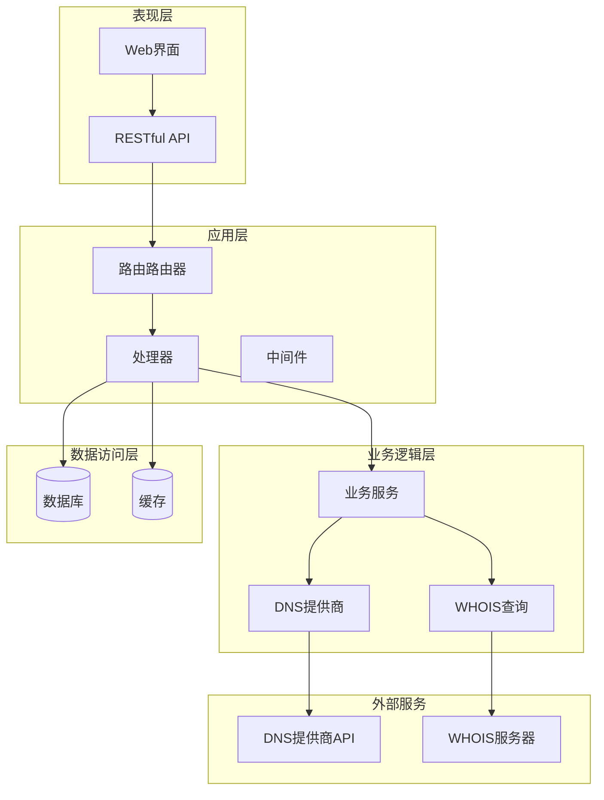
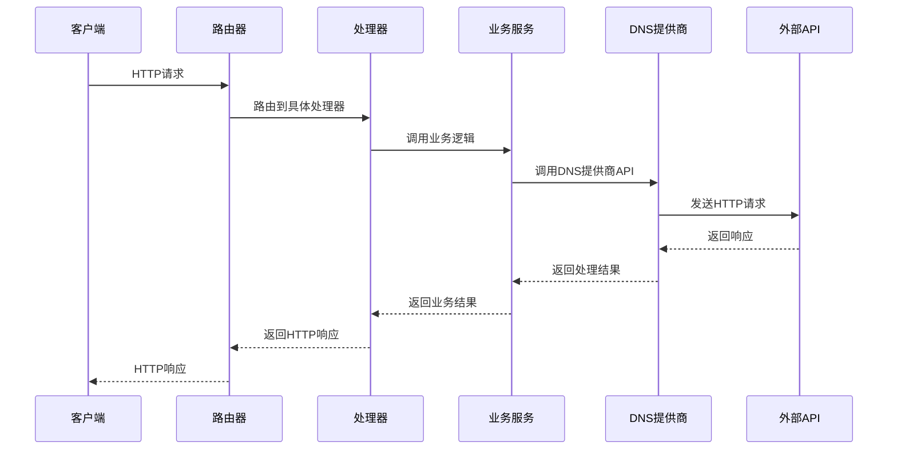
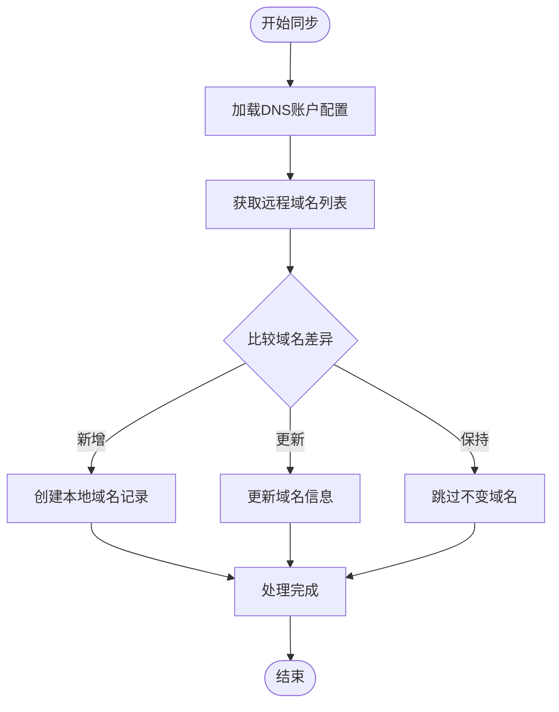
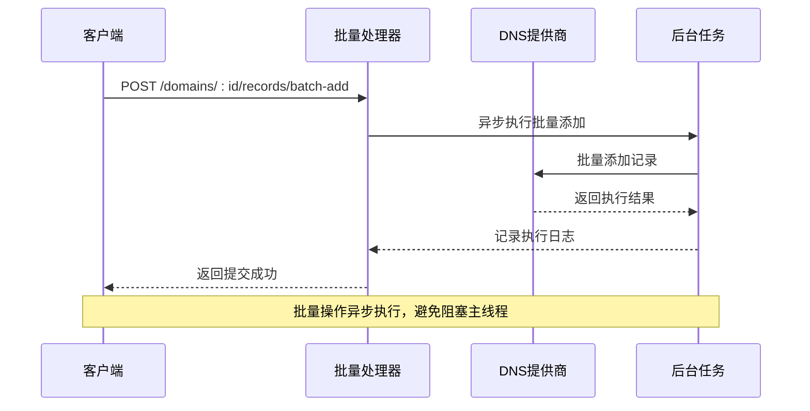
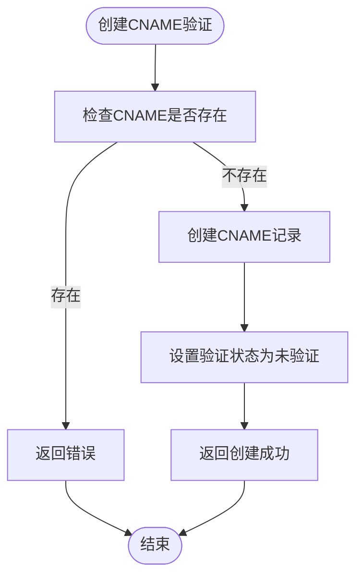
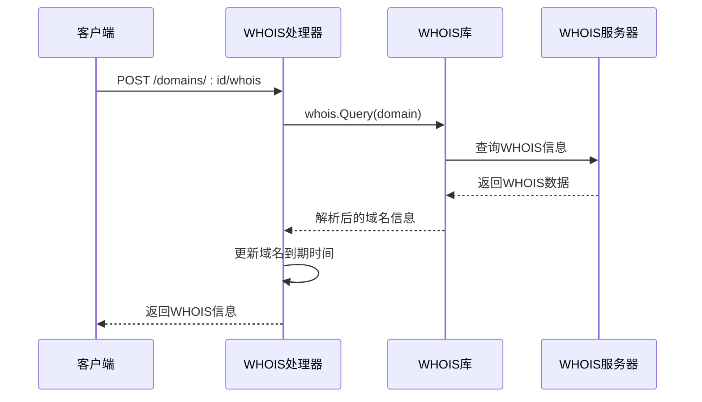
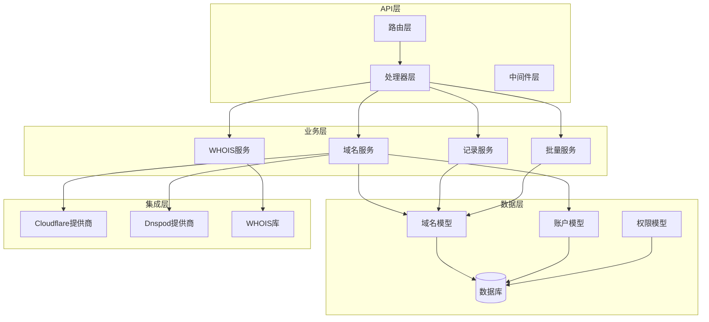

# 域名管理API

<cite>
**本文档引用的文件**
- [router.go](file://main/internal/api/router.go)
- [domain.go](file://main/internal/api/handler/domain.go)
- [batch.go](file://main/internal/api/handler/batch.go)
- [cname.go](file://main/internal/api/handler/cname.go)
- [whois.go](file://main/internal/whois/whois.go)
- [interface.go](file://main/internal/dns/interface.go)
- [models.go](file://main/internal/models/models.go)
- [cloudflare.go](file://main/internal/dns/providers/cloudflare/cloudflare.go)
- [dnspod.go](file://main/internal/dns/providers/dnspod/dnspod.go)
- [auth.go](file://main/internal/api/middleware/auth.go)
- [logger.go](file://main/internal/api/middleware/logger.go)
</cite>

## 目录
1. [简介](#简介)
2. [项目结构](#项目结构)
3. [核心组件](#核心组件)
4. [架构概览](#架构概览)
5. [详细组件分析](#详细组件分析)
6. [依赖关系分析](#依赖关系分析)
7. [性能考虑](#性能考虑)
8. [故障排除指南](#故障排除指南)
9. [结论](#结论)

## 简介

域名管理API是一个基于Go语言构建的DNS管理系统，提供了完整的域名和解析记录管理功能。该系统支持多种DNS提供商集成，包括Cloudflare、腾讯云DNSPod等，实现了域名的增删改查、同步、过期时间更新等功能。

系统采用现代化的架构设计，使用Gin框架作为Web服务器，支持JWT认证、CORS跨域、日志记录等企业级功能。通过抽象的DNS提供商接口，系统能够灵活地适配不同的DNS服务提供商。

## 项目结构

项目采用分层架构设计，主要分为以下几个层次：



**图表来源**
- [router.go:14-163](file://main/internal/api/router.go#L14-L163)
- [domain.go:1-50](file://main/internal/api/handler/domain.go#L1-L50)

**章节来源**
- [router.go:1-276](file://main/internal/api/router.go#L1-L276)
- [domain.go:1-50](file://main/internal/api/handler/domain.go#L1-L50)

## 核心组件

### API路由系统

系统通过统一的路由路由器管理所有API端点，采用分组方式组织不同功能模块：

- **认证相关**: `/api/login`, `/api/logout`, `/api/install`
- **域名管理**: `/api/domains`, `/api/domains/:id`, `/api/domains/sync`
- **解析记录**: `/api/domains/:id/records`, `/api/domains/:id/lines`
- **批量操作**: `/api/domains/:id/records/batch`
- **WHOIS查询**: `/api/domains/:id/whois`
- **证书管理**: `/api/cert/cnames`

### DNS提供商接口

系统定义了统一的DNS提供商接口，支持多种DNS服务提供商：

```mermaid
classDiagram
class Provider {
<<interface>>
+GetError() string
+Check(ctx) error
+GetDomainList(ctx, keyword, page, pageSize) PageResult
+GetDomainRecords(ctx, page, pageSize, keyword, subDomain, value, type, line, status) PageResult
+AddDomainRecord(ctx, name, type, value, line, ttl, mx, weight, remark) string
+UpdateDomainRecord(ctx, recordID, name, type, value, line, ttl, mx, weight, remark) error
+DeleteDomainRecord(ctx, recordID) error
+SetDomainRecordStatus(ctx, recordID, enable) error
+GetRecordLine(ctx) []RecordLine
+GetMinTTL() int
}
class CloudflareProvider {
+request(ctx, method, path, params, body) map[string]interface{}
+GetDomainRecords(ctx, page, pageSize, keyword, subDomain, value, type, line, status) PageResult
+AddDomainRecord(ctx, name, type, value, line, ttl, mx, weight, remark) string
+SetDomainRecordStatus(ctx, recordID, enable) error
}
class DnspodProvider {
+GetDomainRecords(ctx, page, pageSize, keyword, subDomain, value, type, line, status) PageResult
+AddDomainRecord(ctx, name, type, value, line, ttl, mx, weight, remark) string
+SetDomainRecordStatus(ctx, recordID, enable) error
}
Provider <|-- CloudflareProvider
Provider <|-- DnspodProvider
```

**图表来源**
- [interface.go:40-86](file://main/internal/dns/interface.go#L40-L86)
- [cloudflare.go:34-51](file://main/internal/dns/providers/cloudflare/cloudflare.go#L34-L51)
- [dnspod.go:29-49](file://main/internal/dns/providers/dnspod/dnspod.go#L29-L49)

### 数据模型

系统使用GORM ORM框架管理数据模型，主要包括以下核心实体：

- **Domain**: 域名信息，包含域名名称、账户关联、记录数量、到期时间等
- **Account**: DNS账户信息，包含账户类型、配置、备注等
- **CertCNAME**: 证书CNAME验证记录
- **Permission**: 用户权限管理
- **DomainNote**: 用户自定义域名备注

**章节来源**
- [models.go:62-81](file://main/internal/models/models.go#L62-L81)
- [models.go:49-60](file://main/internal/models/models.go#L49-L60)
- [models.go:268-276](file://main/internal/models/models.go#L268-L276)

## 架构概览

系统采用分层架构，确保关注点分离和代码的可维护性：



**图表来源**
- [router.go:21-160](file://main/internal/api/router.go#L21-L160)
- [domain.go:26-43](file://main/internal/api/handler/domain.go#L26-L43)

## 详细组件分析

### 域名管理功能

#### 基础CRUD操作

系统提供了完整的域名生命周期管理：

**创建域名**
- 支持管理员通过DNS账户添加域名
- 自动获取第三方平台域名ID
- 验证套餐配额限制

**查询域名**
- 支持分页查询和关键词搜索
- 支持按账户筛选
- 返回域名详细信息和统计

**更新域名**
- 支持更新域名属性：隐藏、SSO、通知、备注
- 支持手动设置到期时间
- 支持用户自定义备注

**删除域名**
- 支持管理员删除域名
- 自动清理关联的监控任务、优化IP、定时任务等

#### 域名同步机制

系统提供智能的域名同步功能：



**图表来源**
- [domain.go:382-475](file://main/internal/api/handler/domain.go#L382-L475)

#### 过期时间管理

系统提供自动化的域名过期时间管理：

- 支持单个域名过期时间更新
- 支持批量更新域名过期时间
- 集成WHOIS查询获取准确的到期时间
- 支持定期检查和通知机制

**章节来源**
- [domain.go:1167-1247](file://main/internal/api/handler/domain.go#L1167-L1247)
- [domain.go:1336-1396](file://main/internal/api/handler/domain.go#L1336-L1396)

### 解析记录管理

#### 记录CRUD操作

系统提供完整的解析记录管理功能：

**创建记录**
- 支持A、AAAA、CNAME、MX、TXT等多种记录类型
- 支持自定义TTL、线路、权重等参数
- 支持备注功能
- 异步执行，立即返回提交确认

**查询记录**
- 支持分页查询和多种筛选条件
- 支持子域名权限过滤
- 支持按类型、线路、状态等条件筛选
- 支持关键词搜索

**更新记录**
- 支持修改记录值、线路、TTL等属性
- 支持批量更新
- 异步执行，支持超时保护

**删除记录**
- 支持单个和批量删除
- 异步执行，支持超时保护

#### 状态控制

系统提供灵活的记录状态控制：

- 支持启用/暂停记录
- 支持批量状态操作
- 状态转换通过DNS提供商API实现
- 支持子域名权限控制

#### 解析线路管理

系统支持DNS提供商的线路管理：

- 获取可用的解析线路列表
- 支持线路级别的记录管理
- 不同DNS提供商支持不同的线路策略

**章节来源**
- [domain.go:751-826](file://main/internal/api/handler/domain.go#L751-L826)
- [domain.go:828-964](file://main/internal/api/handler/domain.go#L828-L964)
- [domain.go:966-1027](file://main/internal/api/handler/domain.go#L966-L1027)
- [domain.go:1029-1077](file://main/internal/api/handler/domain.go#L1029-L1077)

### 批量操作功能

系统提供高效的批量操作能力：



**图表来源**
- [batch.go:47-156](file://main/internal/api/handler/batch.go#L47-L156)

#### 批量添加记录

支持两种模式的批量添加：
- **文本模式**: 支持标准DNS记录格式
- **结构化模式**: 支持JSON数组格式

#### 批量编辑记录

支持批量修改记录属性：
- 支持修改TTL、线路等属性
- 支持批量启用/暂停/删除
- 120秒超时保护

#### 自动类型检测

系统支持智能的记录类型检测：
- 基于值自动识别A/AAAA/CNAME记录
- IPv4地址识别为A记录
- IPv6地址识别为AAAA记录
- 其他情况识别为CNAME记录

**章节来源**
- [batch.go:33-41](file://main/internal/api/handler/batch.go#L33-L41)
- [batch.go:158-171](file://main/internal/api/handler/batch.go#L158-L171)
- [batch.go:173-264](file://main/internal/api/handler/batch.go#L173-L264)

### CNAME记录特殊处理

系统提供专门的CNAME记录管理功能：

#### 证书CNAME验证



**图表来源**
- [cname.go:64-103](file://main/internal/api/handler/cname.go#L64-L103)

#### 验证机制

- 支持手动触发CNAME验证
- 验证通过后自动更新状态
- 支持查看验证历史

**章节来源**
- [cname.go:16-50](file://main/internal/api/handler/cname.go#L16-L50)
- [cname.go:141-177](file://main/internal/api/handler/cname.go#L141-L177)

### WHOIS查询接口

系统提供域名WHOIS信息查询功能：



**图表来源**
- [batch.go:377-420](file://main/internal/api/handler/batch.go#L377-L420)

#### 查询功能

- 查询域名注册商信息
- 获取域名到期时间
- 获取DNS服务器信息
- 获取域名状态信息

#### 数据解析

系统使用正则表达式解析WHOIS响应：
- 支持多种日期格式
- 自动去除URL链接
- 提取关键信息字段

**章节来源**
- [whois.go:31-58](file://main/internal/whois/whois.go#L31-L58)
- [whois.go:60-129](file://main/internal/whois/whois.go#L60-L129)

### DNS提供商集成

#### Cloudflare集成

Cloudflare提供商支持：
- 域名列表查询
- 解析记录管理
- 状态控制（启用/暂停）
- 线路管理（代理/非代理）

#### 腾讯云DNSPod集成

DNSPod提供商支持：
- 完整的解析记录管理
- 权重负载均衡
- 备注功能
- 状态管理

**章节来源**
- [cloudflare.go:17-30](file://main/internal/dns/providers/cloudflare/cloudflare.go#L17-L30)
- [dnspod.go:14-27](file://main/internal/dns/providers/dnspod/dnspod.go#L14-L27)

## 依赖关系分析

系统采用松耦合的设计，通过接口抽象实现模块间的解耦：



**图表来源**
- [router.go:21-160](file://main/internal/api/router.go#L21-L160)
- [domain.go:26-43](file://main/internal/api/handler/domain.go#L26-L43)
- [interface.go:40-86](file://main/internal/dns/interface.go#L40-L86)

**章节来源**
- [router.go:1-276](file://main/internal/api/router.go#L1-L276)
- [interface.go:1-125](file://main/internal/dns/interface.go#L1-L125)

## 性能考虑

### 异步处理机制

系统广泛采用异步处理模式：
- 所有DNS操作都通过异步任务执行
- 避免阻塞主线程，提升响应速度
- 支持超时保护和错误处理

### 缓存策略

- 认证用户信息缓存，减少数据库查询
- DNS提供商配置缓存
- 静态资源缓存

### 数据库优化

- N+1查询优化
- 批量操作优化
- 索引合理设计

## 故障排除指南

### 常见错误类型

**认证相关错误**
- 401 未登录：检查Cookie和Token有效性
- 403 权限不足：检查用户权限和域名权限

**参数错误**
- 400 参数解析失败：检查请求格式和必填字段
- 404 资源不存在：检查ID的有效性

**业务逻辑错误**
- 429 请求过于频繁：检查API调用频率
- 500 服务器内部错误：查看日志获取详细信息

### 日志分析

系统提供详细的日志记录：
- 控制台彩色输出
- 文件结构化日志
- 错误追踪和性能监控

**章节来源**
- [auth.go:124-199](file://main/internal/api/middleware/auth.go#L124-L199)
- [logger.go:152-232](file://main/internal/api/middleware/logger.go#L152-L232)

## 结论

域名管理API提供了一个完整、高效、可扩展的DNS管理解决方案。通过模块化的架构设计、完善的错误处理机制和丰富的功能特性，系统能够满足各种规模的DNS管理需求。

系统的主要优势包括：
- **多提供商支持**：灵活适配不同的DNS服务提供商
- **高性能设计**：异步处理和缓存优化
- **安全性保障**：JWT认证、CORS防护、输入验证
- **易用性**：直观的API设计和详细的文档
- **可扩展性**：模块化架构便于功能扩展

通过持续的功能完善和性能优化，该系统能够为企业和个人用户提供可靠的DNS管理服务。