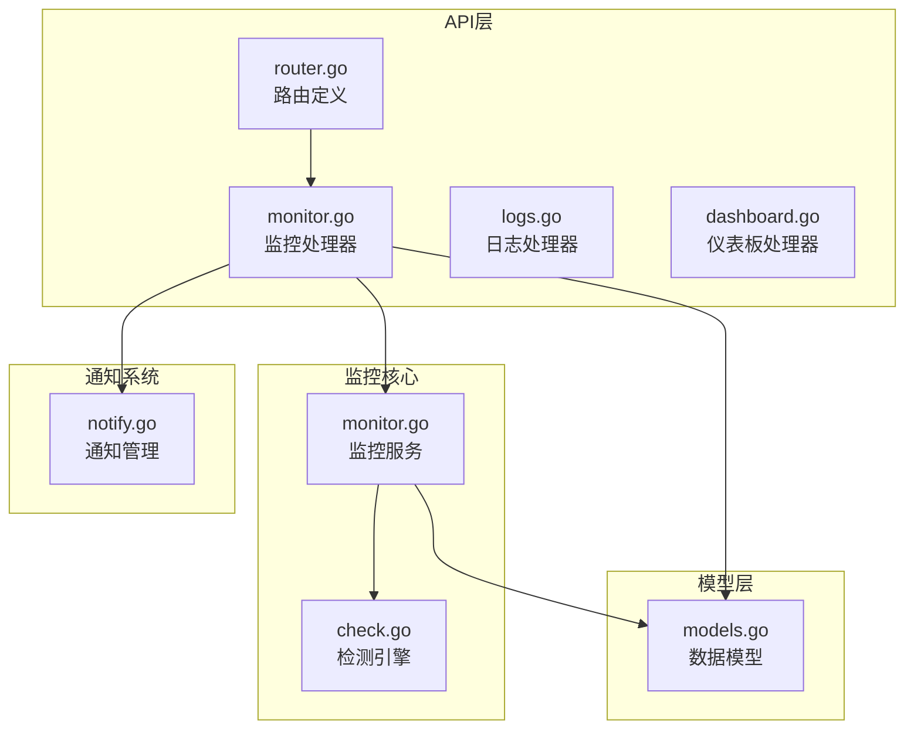
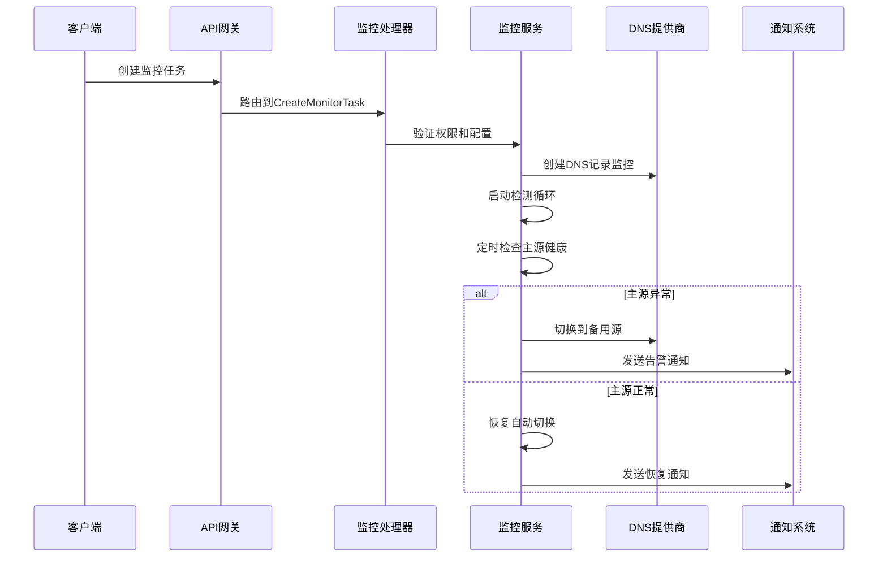
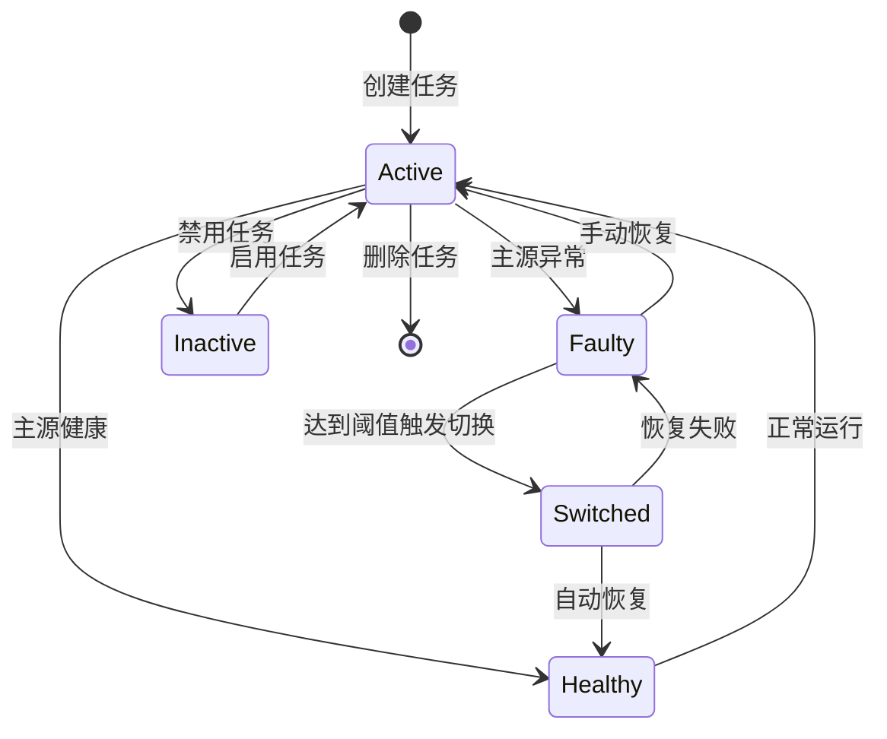
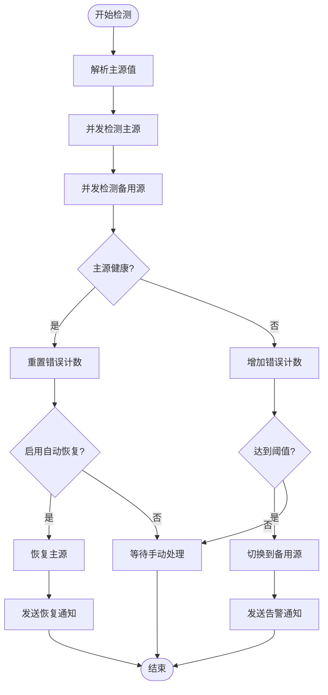
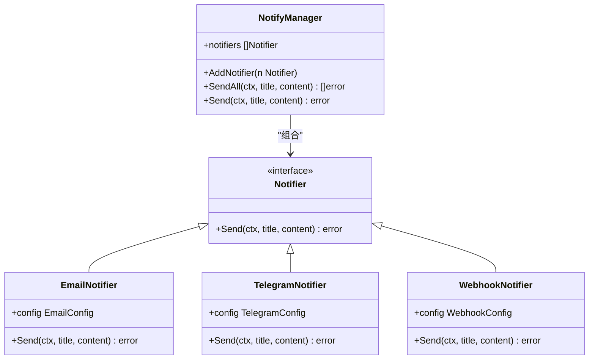
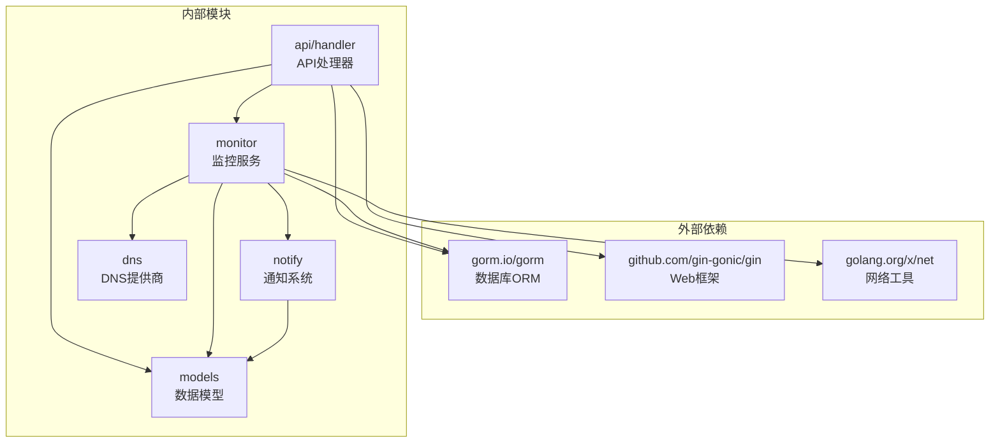

# 监控告警API

<cite>
**本文档引用的文件**
- [monitor.go](file://main/internal/api/handler/monitor.go)
- [router.go](file://main/internal/api/router.go)
- [monitor.go](file://main/internal/monitor/monitor.go)
- [check.go](file://main/internal/monitor/check.go)
- [models.go](file://main/internal/models/models.go)
- [notify.go](file://main/internal/notify/notify.go)
- [dashboard.go](file://main/internal/api/handler/dashboard.go)
</cite>

## 目录
1. [简介](#简介)
2. [项目结构](#项目结构)
3. [核心组件](#核心组件)
4. [架构概览](#架构概览)
5. [详细组件分析](#详细组件分析)
6. [依赖关系分析](#依赖关系分析)
7. [性能考虑](#性能考虑)
8. [故障排除指南](#故障排除指南)
9. [结论](#结论)

## 简介

DNSPlane监控告警API是一个完整的容灾监控解决方案，提供DNS解析监控、自动切换、告警通知等功能。该系统能够监控DNS记录的可用性，当主源出现故障时自动切换到备用源，并通过多种渠道发送告警通知。

## 项目结构

监控告警API主要分布在以下目录结构中：

**图表来源**
- [router.go:76-85](file://main/internal/api/router.go#L76-L85)
- [monitor.go:1-50](file://main/internal/api/handler/monitor.go#L1-L50)
- [monitor.go:1-50](file://main/internal/monitor/monitor.go#L1-L50)

**章节来源**
- [router.go:1-279](file://main/internal/api/router.go#L1-L279)
- [monitor.go:1-1148](file://main/internal/api/handler/monitor.go#L1-L1148)

## 核心组件

### 监控任务管理

监控任务是整个系统的核心实体，包含以下关键属性：

- **任务标识**: 唯一ID、域名ID、记录ID
- **监控配置**: 检测类型、频率、超时时间、连续失败阈值
- **切换策略**: 主源值、备用值、切换类型
- **状态信息**: 当前状态、错误计数、最后检查时间
- **通知配置**: 是否启用通知、通知渠道

### 监控检测引擎

系统支持多种检测方式：
- **Ping检测**: 跨平台ICMP检测
- **TCP检测**: 端口连通性检测
- **HTTP/HTTPS检测**: Web服务可用性检测
- **CDN支持**: 支持CDN节点检测

### 通知系统

支持多种通知渠道：
- **邮件通知**: SMTP配置支持
- **Telegram**: Bot消息推送
- **Webhook**: 自定义HTTP回调
- **Discord**: Discord Webhook
- **Bark**: 移动推送
- **企业微信**: 机器人通知

**章节来源**
- [models.go:122-164](file://main/internal/models/models.go#L122-L164)
- [monitor.go:45-54](file://main/internal/monitor/monitor.go#L45-L54)
- [notify.go:17-27](file://main/internal/notify/notify.go#L17-L27)

## 架构概览

**图表来源**
- [monitor.go:208-263](file://main/internal/api/handler/monitor.go#L208-L263)
- [monitor.go:130-152](file://main/internal/monitor/monitor.go#L130-L152)
- [monitor.go:257-318](file://main/internal/monitor/monitor.go#L257-L318)

## 详细组件分析

### 监控任务生命周期

**图表来源**
- [models.go:148-151](file://main/internal/models/models.go#L148-L151)
- [monitor.go:268-318](file://main/internal/monitor/monitor.go#L268-L318)

### API接口定义

#### 监控任务管理接口

| 方法 | 路径 | 功能描述 |
|------|------|----------|
| GET | `/monitor/tasks` | 获取监控任务列表 |
| POST | `/monitor/tasks` | 创建监控任务 |
| PUT | `/monitor/tasks/:id` | 更新监控任务 |
| DELETE | `/monitor/tasks/:id` | 删除监控任务 |
| POST | `/monitor/tasks/:id/toggle` | 启用/禁用任务 |
| POST | `/monitor/tasks/:id/switch` | 手动切换主备 |

#### 监控查询接口

| 方法 | 路径 | 功能描述 |
|------|------|----------|
| GET | `/monitor/tasks/:id/logs` | 获取任务日志 |
| GET | `/monitor/overview` | 获取监控概览 |
| GET | `/monitor/status` | 获取监控状态 |
| GET | `/monitor/history` | 获取历史记录 |
| GET | `/monitor/uptime` | 获取可用性统计 |

#### 批量操作接口

| 方法 | 路径 | 功能描述 |
|------|------|----------|
| POST | `/monitor/tasks/batch` | 批量创建监控任务 |
| POST | `/monitor/tasks/auto-create` | 智能创建监控任务 |

**章节来源**
- [router.go:76-85](file://main/internal/api/router.go#L76-L85)
- [monitor.go:106-155](file://main/internal/api/handler/monitor.go#L106-L155)

### 监控检测算法

**图表来源**
- [monitor.go:170-214](file://main/internal/monitor/monitor.go#L170-L214)
- [monitor.go:257-318](file://main/internal/monitor/monitor.go#L257-L318)

**章节来源**
- [monitor.go:320-356](file://main/internal/monitor/monitor.go#L320-L356)
- [check.go:47-130](file://main/internal/monitor/check.go#L47-L130)

### 通知机制

**图表来源**
- [notify.go:334-364](file://main/internal/notify/notify.go#L334-L364)
- [notify.go:48-51](file://main/internal/notify/notify.go#L48-L51)

**章节来源**
- [notify.go:735-791](file://main/internal/notify/notify.go#L735-L791)
- [monitor.go:793-820](file://main/internal/monitor/monitor.go#L793-L820)

## 依赖关系分析

**图表来源**
- [monitor.go:3-23](file://main/internal/api/handler/monitor.go#L3-L23)
- [monitor.go:3-17](file://main/internal/monitor/monitor.go#L3-L17)

**章节来源**
- [monitor.go:1-23](file://main/internal/api/handler/monitor.go#L1-L23)
- [monitor.go:1-17](file://main/internal/monitor/monitor.go#L1-L17)

## 性能考虑

### 监控检测优化

1. **并发检测**: 主源和备用源检测采用并发执行，提高检测效率
2. **内存状态缓存**: 实时解析状态存储在内存中，避免频繁数据库查询
3. **历史数据限制**: 图表历史数据限制在4000条以内，防止响应过大
4. **防抖机制**: 防止同一任务并发处理，避免重复检测

### 数据库优化

1. **索引设计**: 关键查询字段建立适当索引
2. **批量操作**: 支持批量创建和更新操作
3. **分页查询**: 日志和任务列表支持分页，限制查询数量
4. **连接池**: 数据库连接池配置优化

## 故障排除指南

### 常见问题诊断

| 问题类型 | 症状 | 可能原因 | 解决方案 |
|----------|------|----------|----------|
| 任务不执行 | 任务状态不变 | 频率设置过长、权限不足 | 检查任务配置和权限 |
| 切换失败 | 主源异常但未切换 | DNS提供商不支持暂停 | 检查提供商能力 |
| 通知失败 | 无告警邮件 | 邮件配置错误 | 验证SMTP配置 |
| 检测超时 | 检测结果超时 | 网络问题、代理配置 | 检查网络和代理设置 |

### 监控状态检查

1. **服务状态**: 通过`/monitor/status`检查监控服务运行状态
2. **任务状态**: 通过`/monitor/overview`查看整体监控状态
3. **日志分析**: 通过`/monitor/tasks/:id/logs`查看详细日志
4. **历史记录**: 通过`/monitor/history`查看历史检测记录

**章节来源**
- [monitor.go:709-726](file://main/internal/api/handler/monitor.go#L709-L726)
- [monitor.go:528-602](file://main/internal/api/handler/monitor.go#L528-L602)

## 结论

DNSPlane监控告警API提供了完整的DNS容灾监控解决方案，具有以下特点：

1. **全面的功能覆盖**: 支持多种检测方式、自动切换、多渠道通知
2. **高可用性设计**: 并发检测、内存缓存、防抖机制确保系统稳定
3. **灵活的配置**: 支持多种DNS提供商、自定义检测参数、通知渠道
4. **完善的监控**: 实时状态监控、历史数据分析、告警通知机制

该系统适合需要高可用DNS服务的企业用户，能够有效提升DNS服务的可靠性和服务质量。