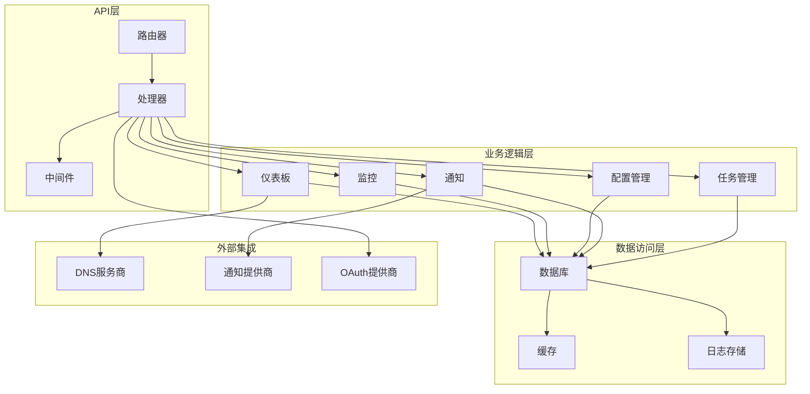
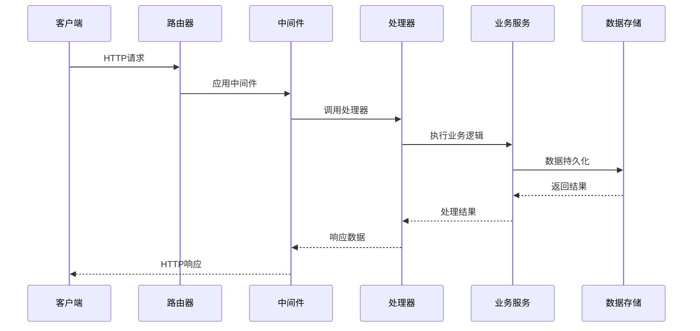
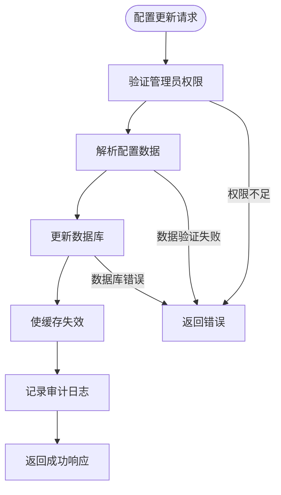
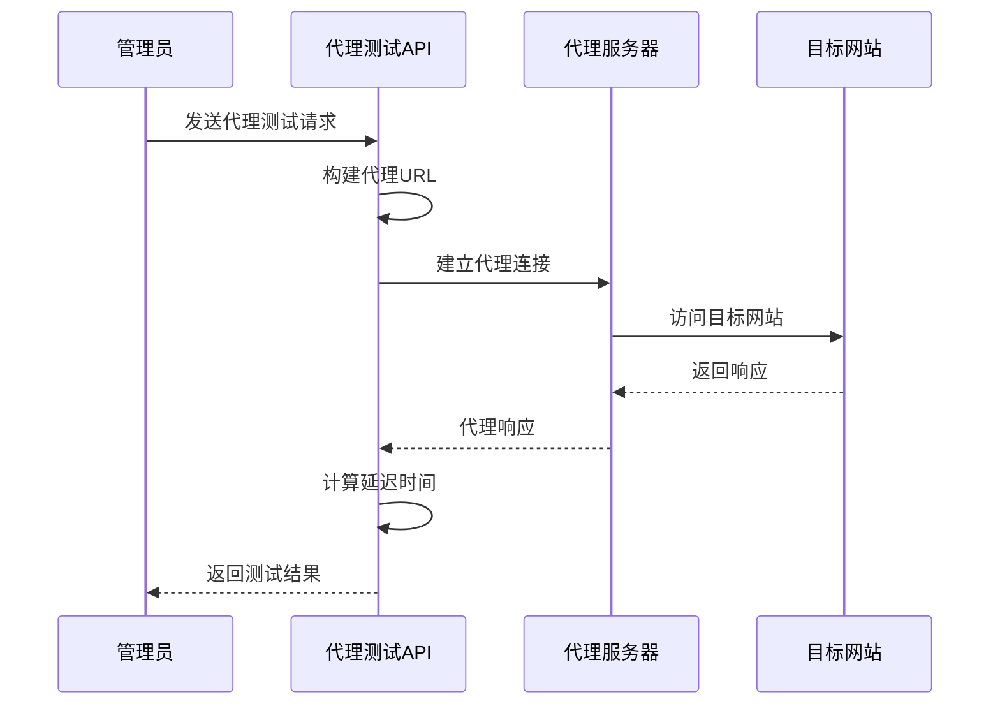
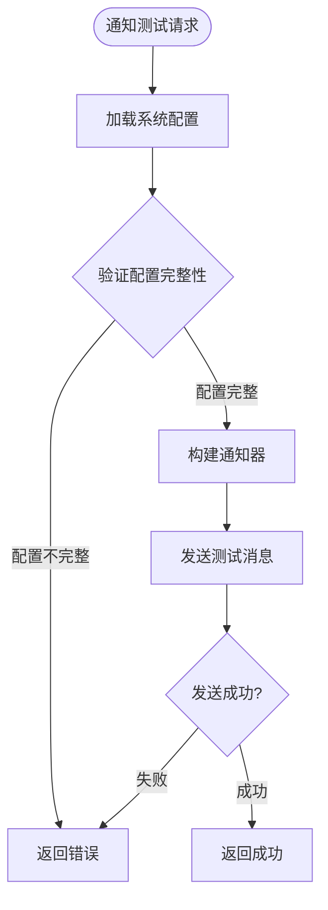
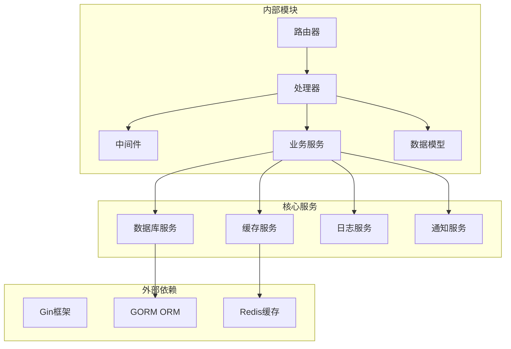

# 系统管理API

<cite>
**本文档引用的文件**
- [router.go](file://main/internal/api/router.go)
- [dashboard.go](file://main/internal/api/handler/dashboard.go)
- [sysconfig_cache.go](file://main/internal/api/handler/sysconfig_cache.go)
- [quota.go](file://main/internal/api/handler/quota.go)
- [monitor.go](file://main/internal/api/handler/monitor.go)
- [logs.go](file://main/internal/api/handler/logs.go)
- [request_log.go](file://main/internal/api/handler/request_log.go)
- [user.go](file://main/internal/api/handler/user.go)
- [account.go](file://main/internal/api/handler/account.go)
- [domain.go](file://main/internal/api/handler/domain.go)
- [cname.go](file://main/internal/api/handler/cname.go)
- [oauth.go](file://main/internal/api/handler/oauth.go)
- [quicklogin.go](file://main/internal/api/handler/quicklogin.go)
- [behavioral_captcha.go](file://main/internal/api/handler/behavioral_captcha.go)
- [sysconfig.go](file://main/internal/sysconfig/sysconfig.go)
</cite>

## 目录
1. [简介](#简介)
2. [项目结构](#项目结构)
3. [核心组件](#核心组件)
4. [架构概览](#架构概览)
5. [详细组件分析](#详细组件分析)
6. [依赖关系分析](#依赖关系分析)
7. [性能考虑](#性能考虑)
8. [故障排除指南](#故障排除指南)
9. [结论](#结论)

## 简介

系统管理API是DNSPlane管理系统的核心接口集合，提供了完整的系统配置管理、监控告警、通知测试、缓存管理、任务调度等功能。该API采用RESTful设计原则，基于Gin框架构建，支持多种认证方式和权限控制机制。

本系统管理API主要面向系统管理员和运维人员，提供以下核心功能：
- 系统配置的查询和更新
- 缓存管理与清理
- 代理测试与网络连通性验证
- 任务状态查询与监控
- 仪表板统计数据获取
- 系统通知测试（邮件、Telegram、Webhook等）
- 配额管理与资源限制
- 系统状态监控与健康检查
- 定时任务配置与管理
- 系统维护和清理操作

## 项目结构

系统管理API采用模块化设计，按照功能领域进行组织：

**图表来源**
- [router.go:14-167](file://main/internal/api/router.go#L14-L167)
- [dashboard.go:41-129](file://main/internal/api/handler/dashboard.go#L41-L129)

**章节来源**
- [router.go:14-167](file://main/internal/api/router.go#L14-L167)

## 核心组件

### API路由器
系统API通过路由器集中管理所有路由规则，采用分组方式组织不同功能模块的接口。

### 处理器层
每个功能模块都有对应的处理器，负责具体的业务逻辑实现和数据处理。

### 中间件层
提供认证、授权、日志记录、CORS跨域等横切关注点的处理。

### 数据访问层
封装数据库操作，提供统一的数据访问接口。

**章节来源**
- [router.go:14-167](file://main/internal/api/router.go#L14-L167)

## 架构概览

系统采用分层架构设计，确保关注点分离和代码的可维护性：

**图表来源**
- [router.go:21-25](file://main/internal/api/router.go#L21-L25)
- [dashboard.go:131-205](file://main/internal/api/handler/dashboard.go#L131-L205)

## 详细组件分析

### 系统配置管理

系统配置管理提供了查询和更新系统配置的功能，支持缓存机制以提高性能。

#### 配置查询接口
- **端点**: `GET /api/system/config`
- **功能**: 获取所有系统配置项
- **权限**: 需要认证
- **响应**: JSON格式的配置键值对

#### 配置更新接口
- **端点**: `POST /api/system/config`
- **功能**: 批量更新系统配置
- **权限**: 管理员权限
- **请求体**: JSON格式的配置键值对

**图表来源**
- [user.go:345-357](file://main/internal/api/handler/user.go#L345-L357)
- [sysconfig_cache.go:14-22](file://main/internal/api/handler/sysconfig_cache.go#L14-L22)

**章节来源**
- [user.go:333-357](file://main/internal/api/handler/user.go#L333-L357)
- [sysconfig_cache.go:14-22](file://main/internal/api/handler/sysconfig_cache.go#L14-L22)

### 缓存管理

系统提供了完整的缓存管理功能，包括缓存查询、清理和状态监控。

#### 缓存清理接口
- **端点**: `POST /api/system/cache/clear`
- **功能**: 清除系统缓存并触发垃圾回收
- **权限**: 管理员权限
- **响应**: 清理状态和内存回收信息

#### 缓存配置管理
系统使用共享缓存层，提供以下特性：
- 自动缓存失效机制
- 60秒TTL的配置缓存
- 支持批量缓存失效

**章节来源**
- [dashboard.go:272-285](file://main/internal/api/handler/dashboard.go#L272-L285)
- [sysconfig.go:18-46](file://main/internal/sysconfig/sysconfig.go#L18-L46)

### 代理测试

系统提供了代理服务器连通性测试功能，支持HTTP和SOCKS5代理。

#### 代理测试接口
- **端点**: `POST /api/system/proxy/test`
- **功能**: 测试代理服务器连通性和延迟
- **权限**: 管理员权限
- **请求体**: 代理服务器配置（类型、主机、端口、认证信息）
- **响应**: 连接状态、延迟时间和HTTP状态码

**图表来源**
- [dashboard.go:287-365](file://main/internal/api/handler/dashboard.go#L287-L365)

**章节来源**
- [dashboard.go:287-365](file://main/internal/api/handler/dashboard.go#L287-L365)

### 任务状态查询

系统提供了全面的任务状态查询功能，包括定时任务、优化任务和证书自动处理任务。

#### 任务状态查询接口
- **端点**: `GET /api/system/task/status`
- **功能**: 获取各类后台任务的统计信息
- **权限**: 需要认证
- **响应**: 任务总数、活动任务数、最后执行时间等

#### 任务统计内容
- 定时任务（schedule）：总数、活动数、最后执行时间
- 优化任务（optimize）：总数、活动数、最后执行时间  
- 证书自动处理任务：自动处理数量
- 域名通知任务：通知启用数量

**章节来源**
- [dashboard.go:367-402](file://main/internal/api/handler/dashboard.go#L367-L402)

### 仪表板统计数据

仪表板提供了系统的综合统计数据，帮助管理员了解系统运行状况。

#### 统计数据接口
- **端点**: `GET /api/dashboard/stats`
- **功能**: 获取系统关键指标统计
- **权限**: 需要认证
- **响应**: 域名数量、任务数量、证书数量、部署数量等

#### 统计数据维度
- 基础统计：域名、任务、证书、部署总数
- 监控状态：活动监控任务数量、不同状态的监控任务数量
- 优化状态：活动优化任务数量、不同状态的优化任务数量
- 证书状态：不同状态的证书订单和部署数量
- 运行状态：监控服务运行状态

**章节来源**
- [dashboard.go:41-129](file://main/internal/api/handler/dashboard.go#L41-L129)

### 系统通知测试

系统支持多种通知渠道的测试功能，确保通知配置正确。

#### 支持的通知类型
- **邮件通知**: `POST /api/system/mail/test`
- **Telegram通知**: `POST /api/system/telegram/test`
- **Webhook通知**: `POST /api/system/webhook/test`
- **Discord通知**: `POST /api/system/discord/test`
- **Bark推送**: `POST /api/system/bark/test`
- **企业微信**: `POST /api/system/wechat/test`

#### 通知测试流程

**图表来源**
- [dashboard.go:131-270](file://main/internal/api/handler/dashboard.go#L131-L270)

**章节来源**
- [dashboard.go:131-270](file://main/internal/api/handler/dashboard.go#L131-L270)

### 配额管理和资源限制

系统实现了灵活的配额管理机制，支持资源使用限制和功能开关控制。

#### 配额检查接口
- **端点**: `GET /api/quota/check`
- **功能**: 检查用户资源使用情况
- **权限**: 需要认证
- **响应**: 配额检查结果

#### 功能开关接口
- **端点**: `GET /api/feature/check`
- **功能**: 检查功能模块是否可用
- **权限**: 需要认证
- **响应**: 功能可用性状态

**章节来源**
- [quota.go:10-18](file://main/internal/api/handler/quota.go#L10-L18)

### 定时任务配置和管理

系统提供了完整的定时任务配置和管理功能。

#### 定时任务配置接口
- **查询配置**: `GET /api/system/cron`
- **更新配置**: `POST /api/system/cron`

#### 默认配置
- 定时任务调度：每分钟执行
- 优化任务：每30分钟执行  
- 证书处理：每小时执行
- 到期检查：每天8点执行

**章节来源**
- [dashboard.go:404-432](file://main/internal/api/handler/dashboard.go#L404-L432)
- [dashboard.go:568-609](file://main/internal/api/handler/dashboard.go#L568-L609)

### 系统维护和清理操作

系统提供了多种维护和清理功能，帮助管理员保持系统最佳运行状态。

#### 请求日志清理
- **端点**: `POST /api/request-logs/clean`
- **功能**: 清理过期的请求日志
- **权限**: 管理员权限
- **参数**: 保留策略（按天数或数量）

#### 系统信息查询
- **端点**: `GET /api/dashboard/system/info`
- **功能**: 获取系统运行信息
- **权限**: 管理员权限
- **响应**: 版本信息、硬件信息、数据库大小等

**章节来源**
- [dashboard.go:529-558](file://main/internal/api/handler/dashboard.go#L529-L558)
- [request_log.go:314-334](file://main/internal/api/handler/request_log.go#L314-L334)

## 依赖关系分析

系统管理API的依赖关系体现了清晰的分层架构：

**图表来源**
- [router.go:3-12](file://main/internal/api/router.go#L3-L12)
- [sysconfig.go:3-9](file://main/internal/sysconfig/sysconfig.go#L3-L9)

**章节来源**
- [router.go:3-12](file://main/internal/api/router.go#L3-L12)
- [sysconfig.go:3-9](file://main/internal/sysconfig/sysconfig.go#L3-L9)

## 性能考虑

系统在设计时充分考虑了性能优化：

### 缓存策略
- 系统配置缓存：60秒TTL，减少数据库查询压力
- 账户列表缓存：支持管理员和普通用户的差异化缓存
- 请求日志统计缓存：60秒TTL，避免重复计算

### 数据库优化
- 并行查询：仪表板统计使用并发SQL查询
- 分页查询：支持大数据量的分页处理
- 索引优化：关键查询字段建立适当索引

### 网络优化
- 代理测试：支持HTTP和SOCKS5代理
- 连接池：数据库连接池管理
- 超时控制：合理的超时设置避免资源占用

## 故障排除指南

### 常见问题及解决方案

#### 权限相关问题
- **问题**: 403权限不足
- **原因**: 用户权限不足或未登录
- **解决**: 确认用户具有相应权限或重新登录

#### 配置相关问题
- **问题**: 通知测试失败
- **原因**: 系统配置不完整或网络连接问题
- **解决**: 检查相关配置项并测试网络连通性

#### 数据库连接问题
- **问题**: 500服务器内部错误
- **原因**: 数据库连接失败或查询超时
- **解决**: 检查数据库服务状态和连接配置

#### 缓存问题
- **问题**: 配置更新不生效
- **原因**: 缓存未正确失效
- **解决**: 手动触发缓存清理或等待TTL过期

**章节来源**
- [dashboard.go:131-205](file://main/internal/api/handler/dashboard.go#L131-L205)
- [sysconfig_cache.go:42-46](file://main/internal/api/handler/sysconfig_cache.go#L42-L46)

## 结论

系统管理API提供了完整的系统管理功能，涵盖了配置管理、监控告警、通知测试、缓存管理等各个方面。通过模块化的设计和清晰的分层架构，系统具备良好的可维护性和扩展性。

主要特点包括：
- 完整的权限控制机制
- 多种通知渠道支持
- 灵活的缓存策略
- 全面的监控和统计功能
- 完善的错误处理和故障排除机制

该API为DNSPlane管理系统提供了强大的后台管理能力，能够满足各种复杂的系统管理需求。