# 认证API

<cite>
**本文档引用的文件**
- [auth.go](file://main/internal/api/handler/auth.go)
- [oauth.go](file://main/internal/api/handler/oauth.go)
- [quicklogin.go](file://main/internal/api/handler/quicklogin.go)
- [behavioral_captcha.go](file://main/internal/api/handler/behavioral_captcha.go)
- [auth.go](file://main/internal/api/middleware/auth.go)
- [oauth.go](file://main/internal/oauth/oauth.go)
- [models.go](file://main/internal/models/models.go)
- [router.go](file://main/internal/api/router.go)
- [api.ts](file://web/lib/api.ts)
- [login/page.tsx](file://web/app/(auth)/login/page.tsx)
- [forgot-password/page.tsx](file://web/app/(auth)/forgot-password/page.tsx)
</cite>

## 目录
1. [简介](#简介)
2. [项目结构](#项目结构)
3. [核心组件](#核心组件)
4. [架构概览](#架构概览)
5. [详细组件分析](#详细组件分析)
6. [依赖关系分析](#依赖关系分析)
7. [性能考虑](#性能考虑)
8. [故障排除指南](#故障排除指南)
9. [结论](#结论)

## 简介

DNSPlane 是一个基于 Go 语言开发的 DNS 管理系统，提供了完整的认证和授权机制。本文档详细介绍了系统的认证API，包括用户登录、注册、密码重置、OAuth集成、JWT令牌管理、Bearer Token使用方法以及安全最佳实践。

系统采用现代化的认证架构，支持多种认证方式：
- 传统用户名密码认证
- 行为验证码验证
- TOTP二步验证
- OAuth第三方登录
- 快速登录功能
- JWT令牌的生成、验证和刷新机制

## 项目结构

系统采用分层架构设计，主要分为以下层次：

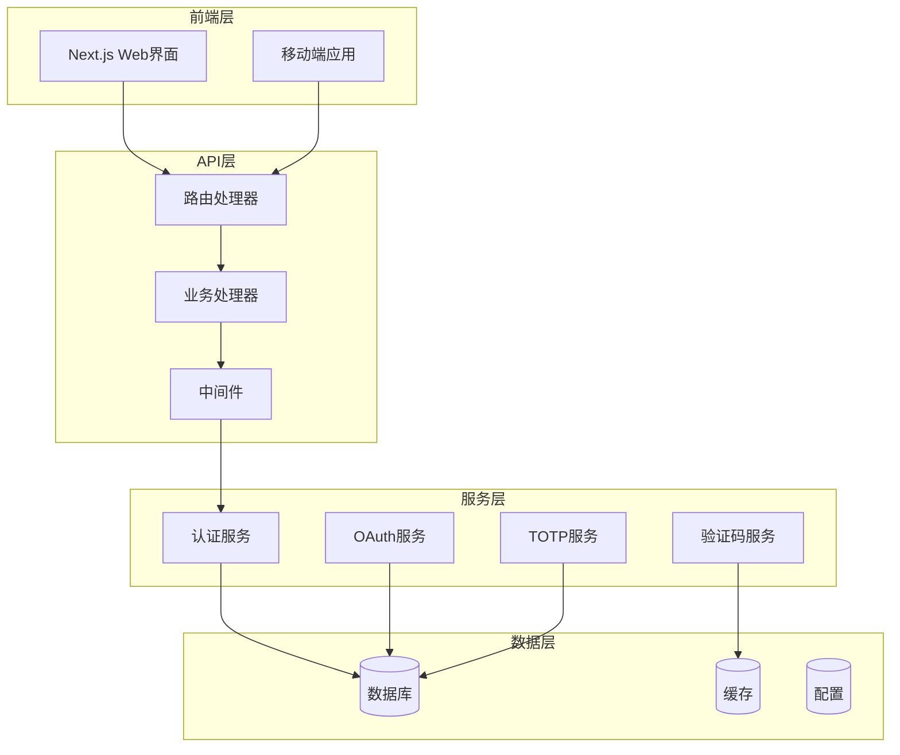

**图表来源**
- [router.go:14-163](file://main/internal/api/router.go#L14-L163)
- [auth.go:124-199](file://main/internal/api/middleware/auth.go#L124-L199)

**章节来源**
- [router.go:14-163](file://main/internal/api/router.go#L14-L163)
- [auth.go:124-199](file://main/internal/api/middleware/auth.go#L124-L199)

## 核心组件

### 认证中间件

认证中间件是整个认证系统的核心，负责JWT令牌的验证和用户身份识别。

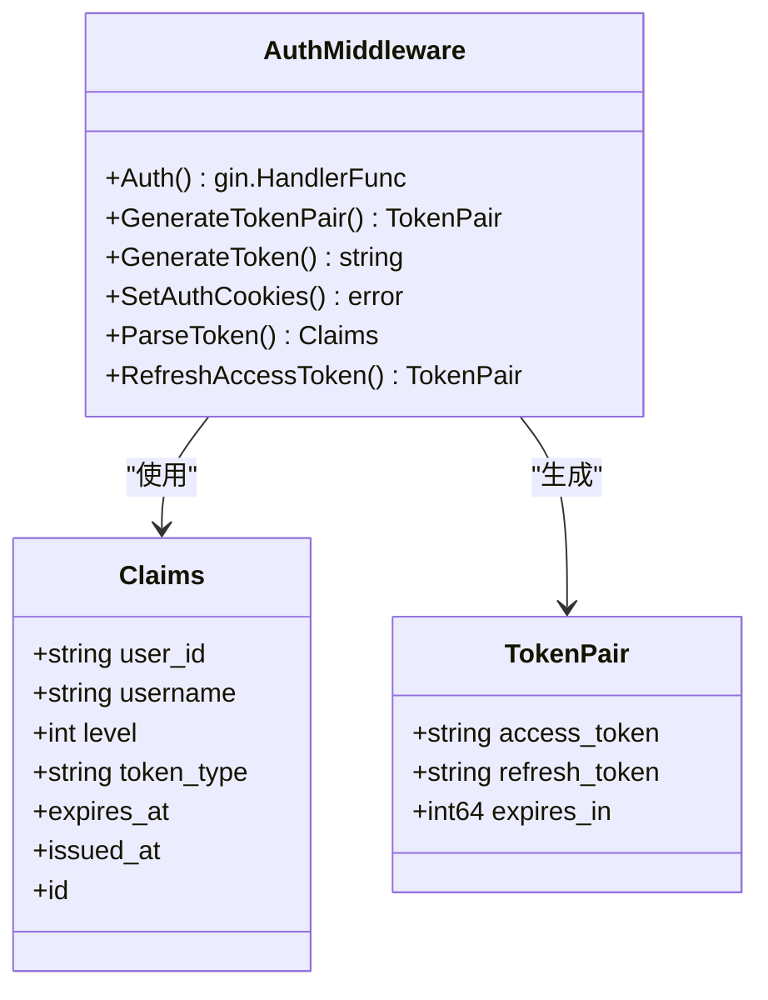

**图表来源**
- [auth.go:100-113](file://main/internal/api/middleware/auth.go#L100-L113)
- [auth.go:227-244](file://main/internal/api/middleware/auth.go#L227-L244)

### 用户模型

系统使用统一的用户模型来管理用户信息和权限。

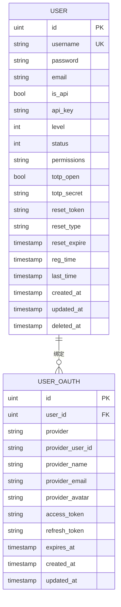

**图表来源**
- [models.go:9-31](file://main/internal/models/models.go#L9-L31)
- [models.go:33-47](file://main/internal/models/models.go#L33-L47)

**章节来源**
- [auth.go:100-113](file://main/internal/api/middleware/auth.go#L100-L113)
- [models.go:9-31](file://main/internal/models/models.go#L9-L31)

## 架构概览

系统采用JWT双令牌机制，结合HttpOnly Cookie实现安全的认证状态管理。

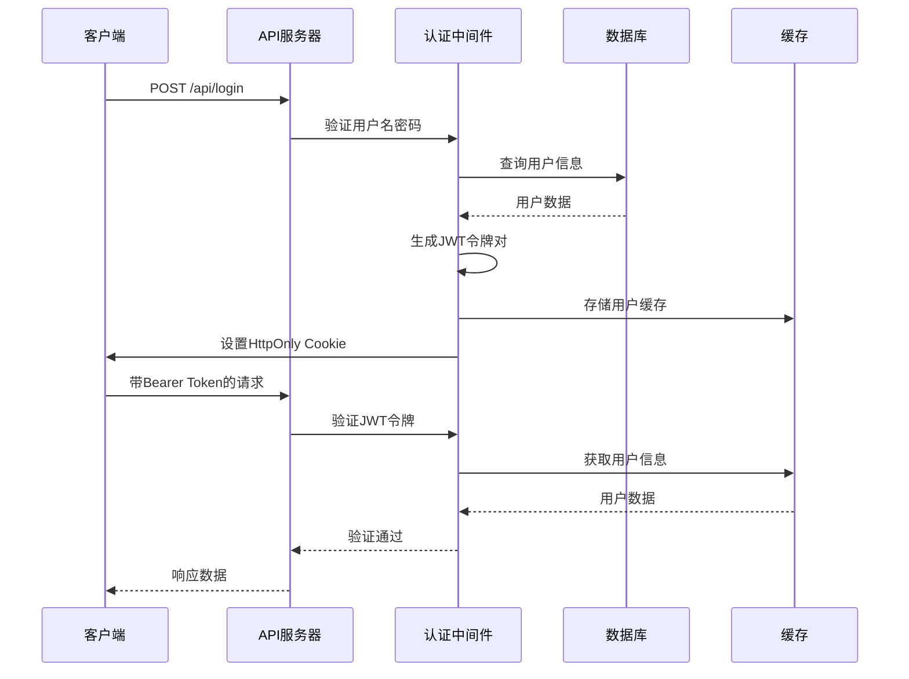

**图表来源**
- [auth.go:67-149](file://main/internal/api/handler/auth.go#L67-L149)
- [auth.go:124-199](file://main/internal/api/middleware/auth.go#L124-L199)

## 详细组件分析

### 用户登录认证

用户登录流程支持多种验证方式，包括传统密码验证、验证码验证和TOTP二步验证。

#### 登录接口

| 参数 | 类型 | 必需 | 描述 |
|------|------|------|------|
| username | string | 是 | 用户名 |
| password | string | 是 | 密码 |
| captcha_id | string | 否 | 验证码ID（启用验证码时） |
| captcha_code | string | 否 | 验证码内容（启用验证码时） |
| totp_code | string | 否 | TOTP动态口令（启用TOTP时） |

**成功响应示例**
```json
{
  "code": 0,
  "msg": "登录成功",
  "data": {
    "token": "eyJhbGciOiJIUzI1NiIsInR5cCI6IkpXVCJ9...",
    "user": {
      "id": 1,
      "username": "admin",
      "level": 1
    }
  }
}
```

**失败响应示例**
```json
{
  "code": -1,
  "msg": "用户名或密码错误"
}
```

#### TOTP二步验证

当用户启用TOTP二步验证时，登录流程会分两步进行：

1. **第一步**：验证用户名和密码
2. **第二步**：验证TOTP动态口令

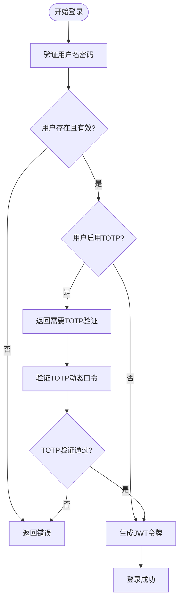

**图表来源**
- [auth.go:113-124](file://main/internal/api/handler/auth.go#L113-L124)
- [auth.go:126-148](file://main/internal/api/handler/auth.go#L126-L148)

**章节来源**
- [auth.go:25-31](file://main/internal/api/handler/auth.go#L25-L31)
- [auth.go:67-149](file://main/internal/api/handler/auth.go#L67-L149)

### 密码重置机制

系统提供两种密码重置方式：通过邮箱重置和通过管理员重置。

#### 邮箱重置流程

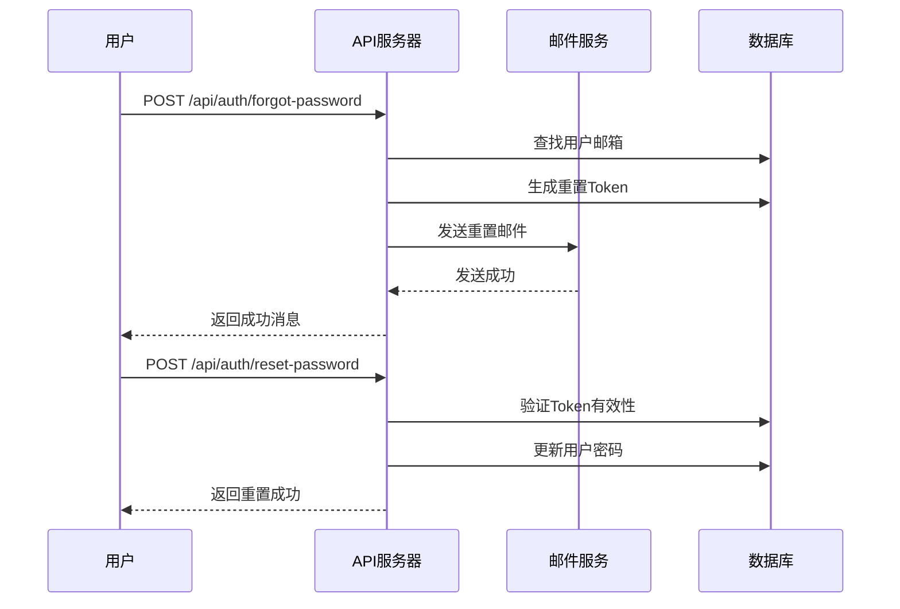

**图表来源**
- [auth.go:469-520](file://main/internal/api/handler/auth.go#L469-L520)
- [auth.go:522-563](file://main/internal/api/handler/auth.go#L522-L563)

#### 管理员重置

管理员可以通过后台为用户发送重置邮件，支持密码和TOTP两种类型的重置。

**章节来源**
- [auth.go:469-563](file://main/internal/api/handler/auth.go#L469-L563)
- [auth.go:659-718](file://main/internal/api/handler/auth.go#L659-L718)

### OAuth第三方登录

系统支持多种OAuth提供商，包括GitHub、Google、微信、钉钉等。

#### OAuth登录流程

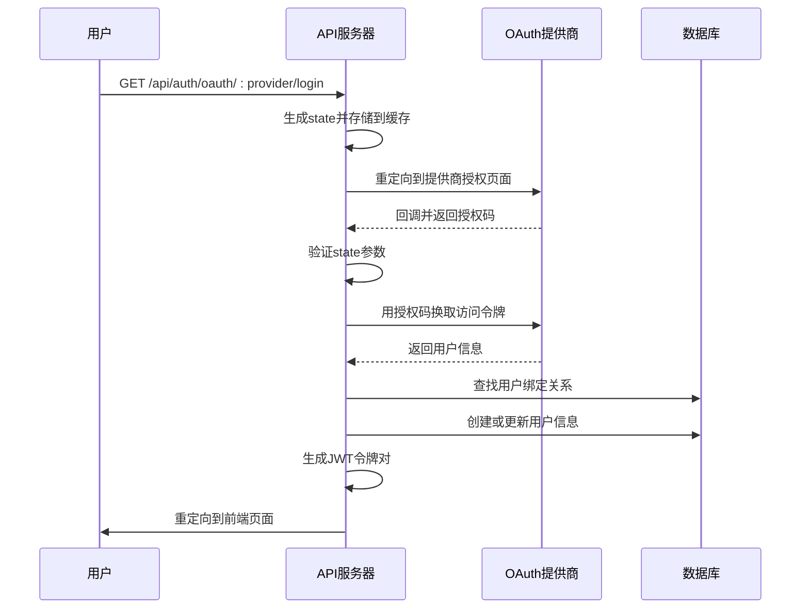

**图表来源**
- [oauth.go:60-89](file://main/internal/api/handler/oauth.go#L60-L89)
- [oauth.go:99-158](file://main/internal/api/handler/oauth.go#L99-L158)

#### 支持的OAuth提供商

系统内置支持以下OAuth提供商：

| 提供商 | 名称 | 特殊配置 |
|--------|------|----------|
| github | GitHub | 标准OAuth2配置 |
| google | Google | 标准OAuth2配置 |
| wechat | 微信 | 支持小程序和公众号 |
| dingtalk | 钉钉 | 企业内部应用 |
| custom | 自定义 | 支持自定义OAuth2配置 |

**章节来源**
- [oauth.go:54-58](file://main/internal/api/handler/oauth.go#L54-L58)
- [oauth.go:60-89](file://main/internal/api/handler/oauth.go#L60-L89)
- [oauth.go:99-158](file://main/internal/api/handler/oauth.go#L99-L158)

### 快速登录功能

快速登录提供了一种便捷的一次性登录方式，适用于特定场景下的快速访问。

#### 快速登录流程

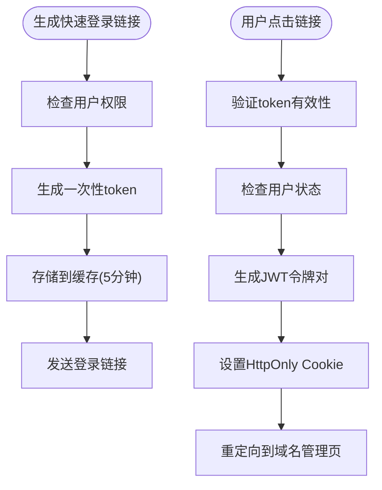

**图表来源**
- [quicklogin.go:49-96](file://main/internal/api/handler/quicklogin.go#L49-L96)
- [quicklogin.go:113-172](file://main/internal/api/handler/quicklogin.go#L113-L172)

**章节来源**
- [quicklogin.go:20-31](file://main/internal/api/handler/quicklogin.go#L20-L31)
- [quicklogin.go:49-96](file://main/internal/api/handler/quicklogin.go#L49-L96)
- [quicklogin.go:113-172](file://main/internal/api/handler/quicklogin.go#L113-L172)

### 行为验证码系统

系统提供行为验证码功能，支持点击、滑动、旋转三种验证方式。

#### 行为验证码流程

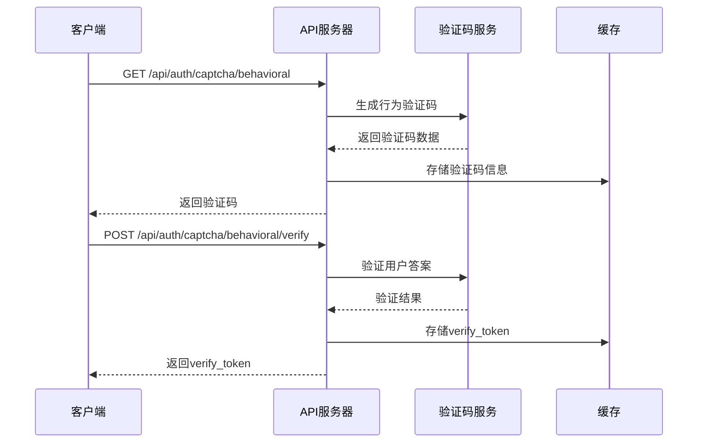

**图表来源**
- [behavioral_captcha.go:32-43](file://main/internal/api/handler/behavioral_captcha.go#L32-L43)
- [behavioral_captcha.go:51-85](file://main/internal/api/handler/behavioral_captcha.go#L51-L85)

**章节来源**
- [behavioral_captcha.go:21-30](file://main/internal/api/handler/behavioral_captcha.go#L21-L30)
- [behavioral_captcha.go:32-43](file://main/internal/api/handler/behavioral_captcha.go#L32-L43)
- [behavioral_captcha.go:51-85](file://main/internal/api/handler/behavioral_captcha.go#L51-L85)

## 依赖关系分析

系统认证模块之间的依赖关系如下：

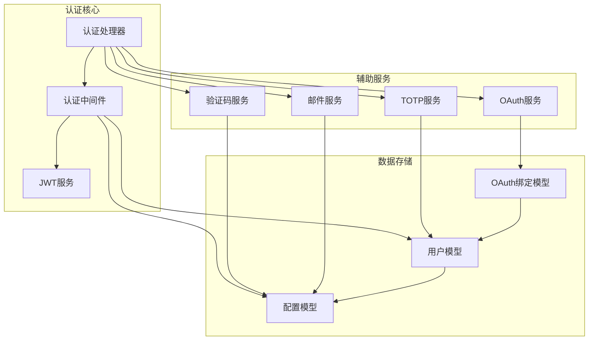

**图表来源**
- [auth.go:1-21](file://main/internal/api/handler/auth.go#L1-L21)
- [auth.go:1-23](file://main/internal/api/middleware/auth.go#L1-L23)

**章节来源**
- [auth.go:1-21](file://main/internal/api/handler/auth.go#L1-L21)
- [auth.go:1-23](file://main/internal/api/middleware/auth.go#L1-L23)

## 性能考虑

### JWT令牌优化

系统采用了多项性能优化措施：

1. **令牌缓存**：用户信息缓存30秒，减少数据库查询
2. **双令牌机制**：短期访问令牌(15分钟) + 长期刷新令牌(7天)
3. **JTI轮转**：每次刷新都会生成新的JTI，防止令牌重用
4. **AES-GCM加密**：Cookie中的令牌使用AES-GCM加密，提高安全性

### 认证中间件优化

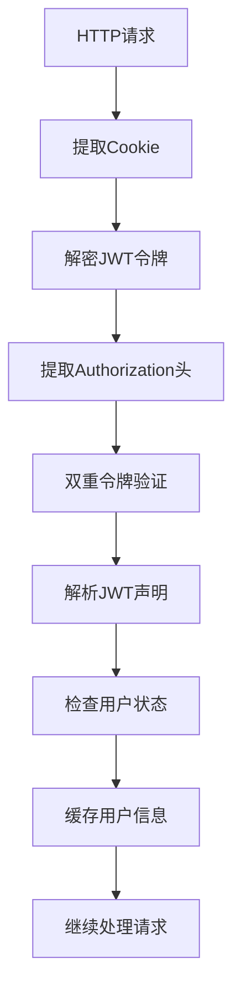

**图表来源**
- [auth.go:124-199](file://main/internal/api/middleware/auth.go#L124-L199)

### 限流机制

系统实现了多层限流保护：

1. **快速登录限流**：每IP每小时最多30次请求
2. **验证码限流**：基于缓存的固定窗口计数
3. **OAuth状态缓存清理**：定期清理过期的state缓存

**章节来源**
- [auth.go:124-199](file://main/internal/api/middleware/auth.go#L124-L199)
- [quicklogin.go:98-105](file://main/internal/api/handler/quicklogin.go#L98-L105)

## 故障排除指南

### 常见认证问题

#### 1. 登录失败

**可能原因**：
- 用户名或密码错误
- 账户被禁用
- 验证码错误
- TOTP验证失败

**解决方案**：
- 检查用户名和密码是否正确
- 确认账户状态为启用
- 验证验证码是否正确
- 确认TOTP动态口令

#### 2. JWT令牌过期

**现象**：API返回401未授权错误

**解决方案**：
- 使用刷新令牌获取新的访问令牌
- 检查系统时间是否正确
- 确认JWT密钥配置正确

#### 3. OAuth登录失败

**可能原因**：
- OAuth配置错误
- 网络连接问题
- 用户取消授权

**解决方案**：
- 检查OAuth提供商的客户端ID和密钥
- 确认回调URL配置正确
- 验证网络连接和防火墙设置

#### 4. 邮件重置失败

**可能原因**：
- 邮件配置不正确
- 邮件服务器连接失败
- 用户邮箱未设置

**解决方案**：
- 检查SMTP配置参数
- 测试邮件服务器连接
- 确认用户邮箱地址有效

**章节来源**
- [auth.go:94-111](file://main/internal/api/handler/auth.go#L94-L111)
- [auth.go:151-156](file://main/internal/api/middleware/auth.go#L151-L156)
- [oauth.go:133-140](file://main/internal/api/handler/oauth.go#L133-L140)

## 结论

DNSPlane的认证系统采用了现代化的安全架构，提供了完整的用户认证和授权功能。系统的主要特点包括：

1. **多层次安全防护**：传统认证、验证码、TOTP、OAuth等多种认证方式
2. **JWT双令牌机制**：短期访问令牌和长期刷新令牌相结合
3. **HttpOnly Cookie**：防止XSS攻击，提高安全性
4. **灵活的配置**：支持多种OAuth提供商和自定义配置
5. **性能优化**：用户信息缓存、令牌缓存等优化措施

系统的设计充分考虑了安全性、可用性和性能，在保证安全的前提下提供了良好的用户体验。通过合理的API设计和错误处理机制，系统能够有效应对各种认证场景和异常情况。

建议在生产环境中：
- 定期更新JWT密钥
- 配置适当的会话超时时间
- 启用HTTPS和安全响应头
- 监控认证相关的日志和指标
- 定期审查OAuth提供商配置