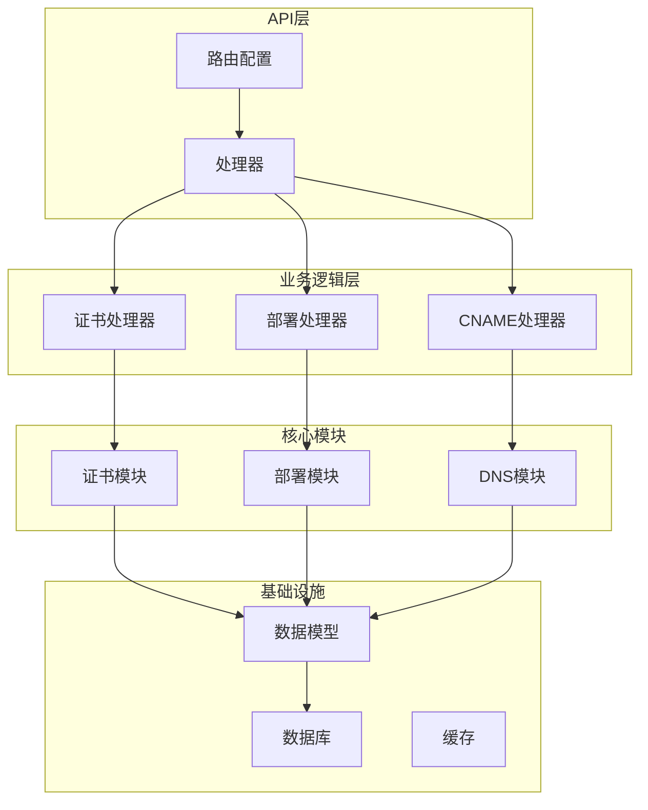
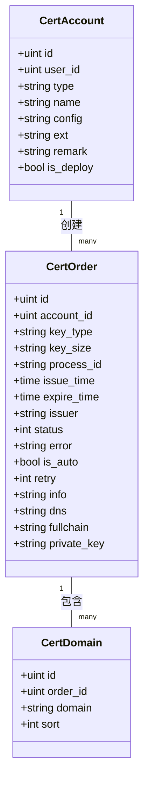
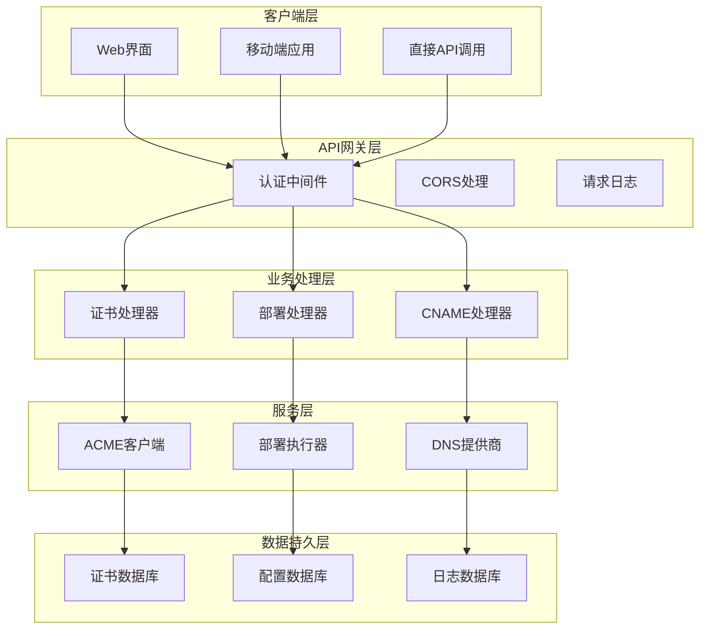
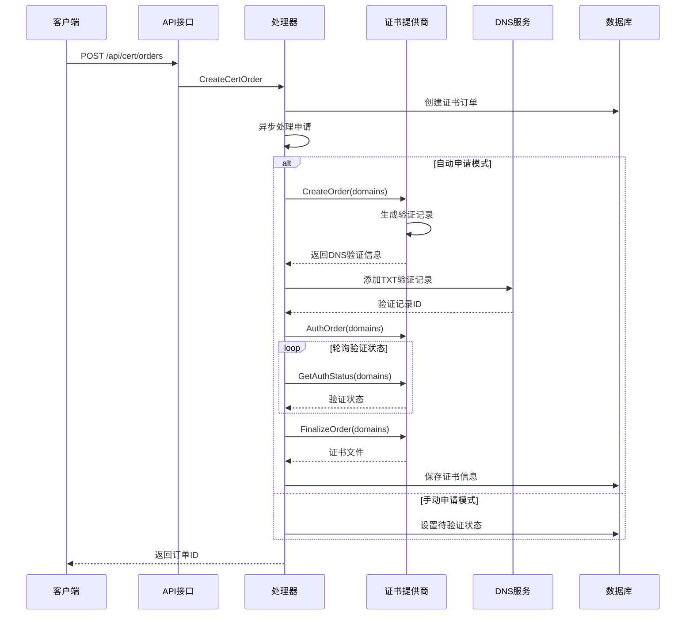
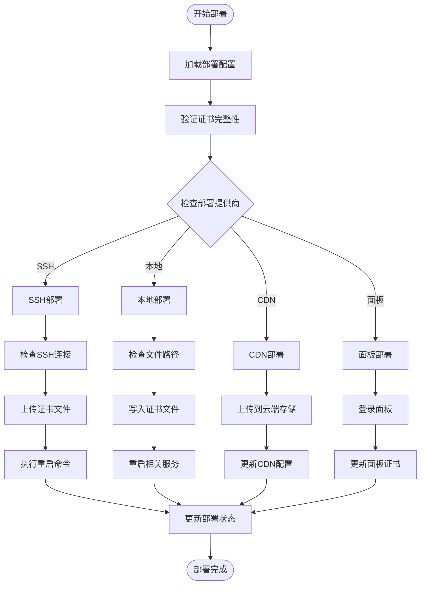
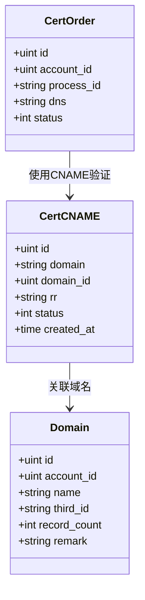
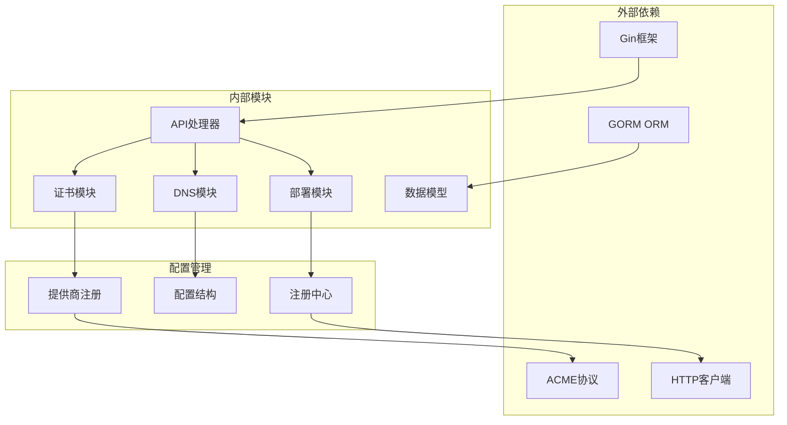
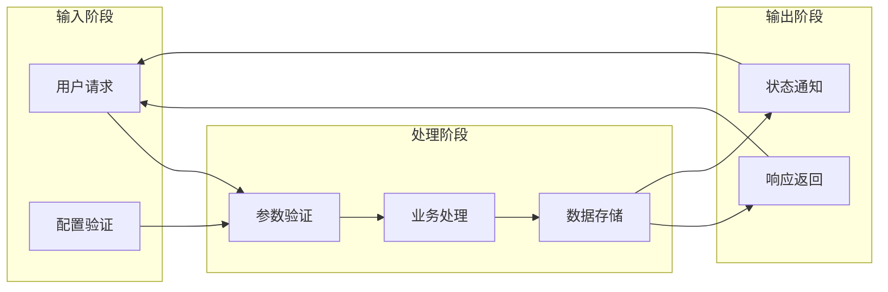
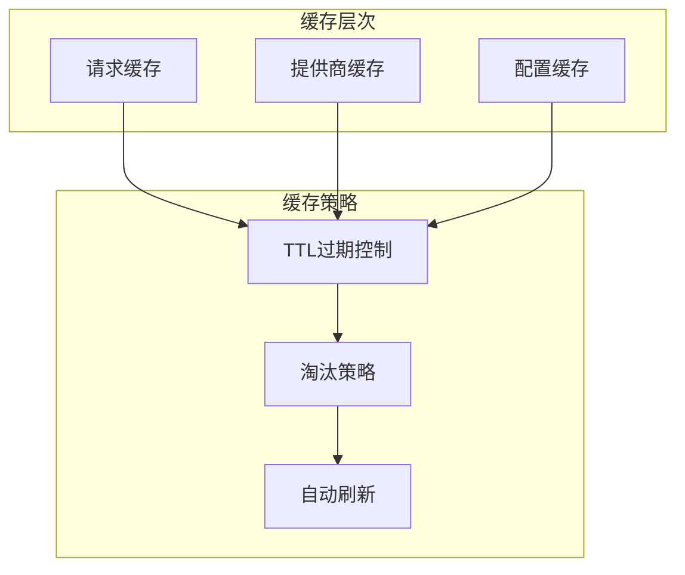
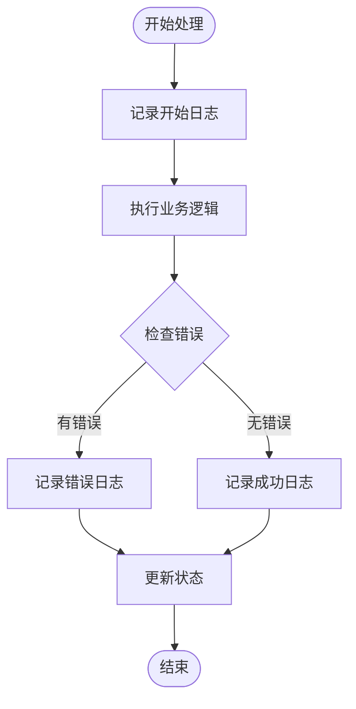

# 证书管理API

<cite>
**本文档引用的文件**
- [cert.go](file://main/internal/api/handler/cert.go)
- [cert_deploy.go](file://main/internal/api/handler/cert_deploy.go)
- [cname.go](file://main/internal/api/handler/cname.go)
- [router.go](file://main/internal/api/router.go)
- [interface.go](file://main/internal/cert/interface.go)
- [providers.go](file://main/internal/cert/providers.go)
- [acme.go](file://main/internal/cert/acme/acme.go)
- [base.go](file://main/internal/cert/deploy/base/base.go)
- [models.go](file://main/internal/models/models.go)
- [README.md](file://README.md)
</cite>

## 目录
1. [简介](#简介)
2. [项目结构](#项目结构)
3. [核心组件](#核心组件)
4. [架构概览](#架构概览)
5. [详细组件分析](#详细组件分析)
6. [依赖关系分析](#依赖关系分析)
7. [性能考虑](#性能考虑)
8. [故障排除指南](#故障排除指南)
9. [结论](#结论)

## 简介

DNSPlane是一个基于Go语言开发的DNS管理系统，集成了SSL证书申请、部署和管理功能。该系统支持多平台DNS管理、证书申请部署、容灾切换等功能，特别专注于自动化证书管理流程。

证书管理API提供了完整的证书生命周期管理能力，包括证书账户的CRUD操作、证书订单的创建和处理、证书部署配置和执行、CNAME记录管理等功能。系统支持多种证书提供商（如Let's Encrypt、ZeroSSL等）和多种部署方式（SSH、本地、CDN等）。

## 项目结构

DNSPlane项目采用清晰的分层架构设计：

**图表来源**
- [router.go:14-279](file://main/internal/api/router.go#L14-L279)
- [cert.go:1-935](file://main/internal/api/handler/cert.go#L1-L935)
- [cert_deploy.go:1-1097](file://main/internal/api/handler/cert_deploy.go#L1-L1097)

**章节来源**
- [README.md:1-172](file://README.md#L1-L172)
- [router.go:14-279](file://main/internal/api/router.go#L14-L279)

## 核心组件

### 证书账户管理

证书账户是证书申请的基础配置单元，支持多种证书提供商类型：

| 账户类型 | 描述 | 支持功能 |
|---------|------|----------|
| Let's Encrypt | 免费ACME证书 | ✅ DNS验证, 自动续期 |
| ZeroSSL | 商业ACME证书 | ✅ EAB认证, DNS验证 |
| 腾讯云免费SSL | 企业级免费证书 | ❌ DNS验证 |
| 阿里云免费SSL | 企业级免费证书 | ❌ DNS验证 |

### 证书订单管理

证书订单代表一次完整的证书申请流程，包含域名列表、密钥类型、状态跟踪等信息：

**图表来源**
- [models.go:204-276](file://main/internal/models/models.go#L204-L276)

### 部署配置管理

系统支持多种部署方式，每种部署方式都有特定的配置要求：

| 部署类型 | 支持平台 | 配置要点 |
|---------|----------|----------|
| SSH部署 | Linux/Windows服务器 | 主机地址、端口、认证方式 |
| 本地部署 | 本地文件系统 | 证书路径、重启命令 |
| CDN部署 | 阿里云/腾讯云等 | 云服务商凭据、域名列表 |
| 面板部署 | 宝塔/1Panel等 | 面板API密钥、站点配置 |

**章节来源**
- [cert.go:23-115](file://main/internal/api/handler/cert.go#L23-L115)
- [models.go:204-276](file://main/internal/models/models.go#L204-L276)

## 架构概览

证书管理系统的整体架构采用分层设计，确保了良好的可扩展性和维护性：

**图表来源**
- [router.go:21-163](file://main/internal/api/router.go#L21-L163)
- [cert.go:389-518](file://main/internal/api/handler/cert.go#L389-L518)

## 详细组件分析

### 证书申请流程

证书申请是整个系统的核心功能，采用异步处理模式确保用户体验：

**图表来源**
- [cert.go:155-223](file://main/internal/api/handler/cert.go#L155-L223)
- [cert.go:389-518](file://main/internal/api/handler/cert.go#L389-L518)

#### 状态管理机制

证书订单采用状态机管理模式，确保每个步骤的可追溯性：

| 状态码 | 状态名称 | 描述 | 错误码 |
|-------|----------|------|--------|
| 0 | 待处理 | 订单刚创建 | - |
| 1 | 验证中 | 正在添加DNS验证记录 | - |
| 2 | 验证通过 | DNS验证已完成 | - |
| 3 | 已签发 | 证书已成功签发 | - |
| 4 | 已吊销 | 证书已被吊销 | - |
| -1 | 通用错误 | 一般性错误 | - |
| -2 | 订单创建失败 | 订单创建阶段失败 | 订单错误 |
| -3 | 验证触发失败 | 验证请求发送失败 | 验证错误 |
| -4 | 验证超时 | DNS验证超时 | 超时错误 |
| -5 | 签发失败 | 证书签发失败 | 签发错误 |

**章节来源**
- [cert.go:155-223](file://main/internal/api/handler/cert.go#L155-L223)
- [models.go:204-231](file://main/internal/models/models.go#L204-L231)

### 证书部署系统

部署系统提供了灵活的证书分发机制，支持多种目标平台：

**图表来源**
- [cert_deploy.go:722-800](file://main/internal/api/handler/cert_deploy.go#L722-L800)
- [base.go:44-53](file://main/internal/cert/deploy/base/base.go#L44-L53)

#### 部署提供商类型

系统支持的部署提供商类型：

| 类型 | 名称 | 特点 | 配置要求 |
|------|------|------|----------|
| ssh | SSH部署 | 远程服务器部署 | 主机地址、认证信息 |
| local | 本地部署 | 本地文件系统 | 证书路径、重启命令 |
| aliyun_cdn | 阿里云CDN | 云服务商集成 | AccessKey、域名列表 |
| tencent_cdn | 腾讯云CDN | 云服务商集成 | SecretId/Key、域名列表 |
| btpanel | 宝塔面板 | 面板集成 | API密钥、站点配置 |
| k8s | Kubernetes | 容器化部署 | kubeconfig、命名空间 |

**章节来源**
- [providers.go:114-666](file://main/internal/cert/providers.go#L114-L666)
- [cert_deploy.go:722-800](file://main/internal/api/handler/cert_deploy.go#L722-L800)

### CNAME记录管理

CNAME记录管理功能支持证书申请过程中的域名验证：

**图表来源**
- [models.go:268-276](file://main/internal/models/models.go#L268-L276)

**章节来源**
- [cname.go:26-177](file://main/internal/api/handler/cname.go#L26-L177)
- [models.go:268-276](file://main/internal/models/models.go#L268-L276)

## 依赖关系分析

### 核心依赖图

**图表来源**
- [providers.go:3-6](file://main/internal/cert/providers.go#L3-L6)
- [base.go:58-84](file://main/internal/cert/deploy/base/base.go#L58-L84)

### 数据流分析

证书管理的数据流遵循严格的处理顺序：

**图表来源**
- [cert.go:61-83](file://main/internal/api/handler/cert.go#L61-L83)
- [cert_deploy.go:501-579](file://main/internal/api/handler/cert_deploy.go#L501-L579)

**章节来源**
- [interface.go:49-77](file://main/internal/cert/interface.go#L49-L77)
- [acme.go:90-206](file://main/internal/cert/acme/acme.go#L90-L206)

## 性能考虑

### 异步处理机制

系统采用异步处理模式来提升性能和用户体验：

1. **异步证书申请**：创建订单后立即返回，实际申请在后台异步执行
2. **批量DNS记录处理**：支持批量添加和验证DNS记录
3. **并发部署执行**：多个部署任务可以并行处理

### 缓存策略

### 性能优化措施

1. **数据库查询优化**：使用JOIN查询减少数据库往返
2. **批量操作**：支持批量创建、更新、删除操作
3. **连接池管理**：合理配置数据库连接池大小
4. **内存管理**：及时释放临时对象和缓冲区

## 故障排除指南

### 常见问题诊断

| 问题类型 | 症状 | 可能原因 | 解决方案 |
|----------|------|----------|----------|
| DNS验证失败 | 验证超时或失败 | DNS记录未生效 | 检查DNS传播时间 |
| 证书签发失败 | 订单状态变为-5 | ACME服务器错误 | 检查提供商配置 |
| 部署失败 | 部署状态异常 | 目标服务器不可达 | 检查网络连接和权限 |
| 认证失败 | API调用被拒绝 | Token过期或无效 | 重新登录获取新Token |

### 日志分析

系统提供了详细的日志记录机制：

**图表来源**
- [cert.go:369-376](file://main/internal/api/handler/cert.go#L369-L376)

### 调试工具

1. **请求日志**：记录所有API请求的详细信息
2. **状态跟踪**：实时查看证书订单状态变化
3. **错误报告**：生成详细的错误报告和解决方案建议

**章节来源**
- [cert.go:606-631](file://main/internal/api/handler/cert.go#L606-L631)
- [cert_deploy.go:722-800](file://main/internal/api/handler/cert_deploy.go#L722-L800)

## 结论

DNSPlane的证书管理API提供了一个完整、灵活且高性能的证书生命周期管理解决方案。系统的主要优势包括：

1. **全面的功能覆盖**：从证书申请到部署的完整流程支持
2. **灵活的配置管理**：支持多种证书提供商和部署方式
3. **强大的扩展性**：模块化设计便于功能扩展和定制
4. **优秀的用户体验**：异步处理和状态跟踪确保流畅的操作体验
5. **完善的错误处理**：详细的日志记录和错误诊断机制

该系统特别适合需要自动化证书管理的企业级应用场景，能够显著降低证书管理的复杂性和成本。通过合理的配置和使用，可以实现证书管理的完全自动化，提高运维效率和安全性。