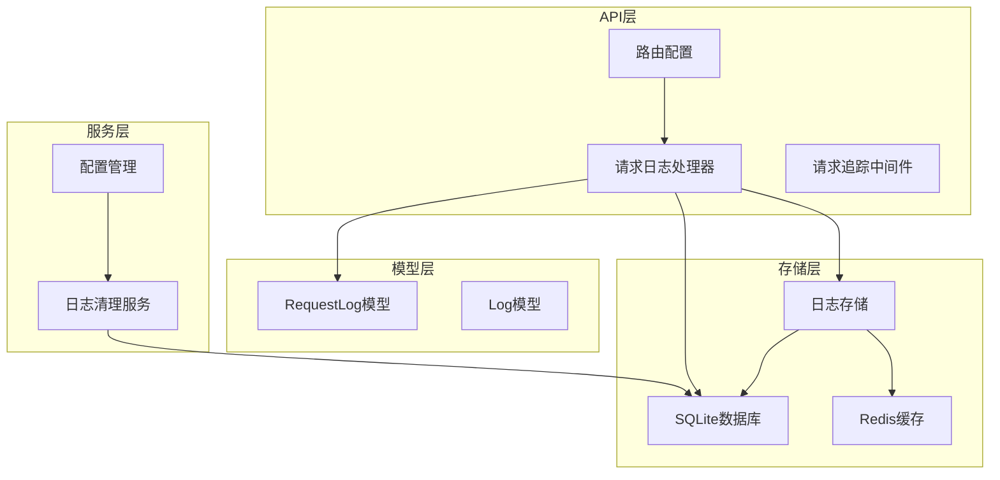
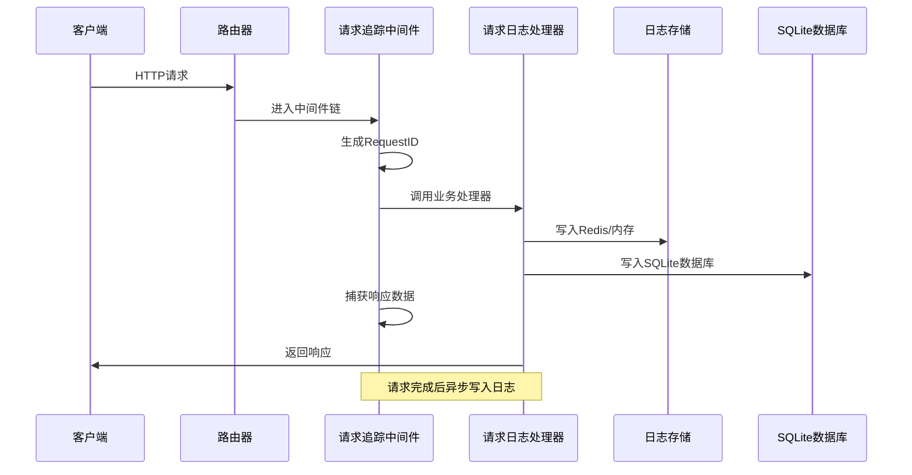
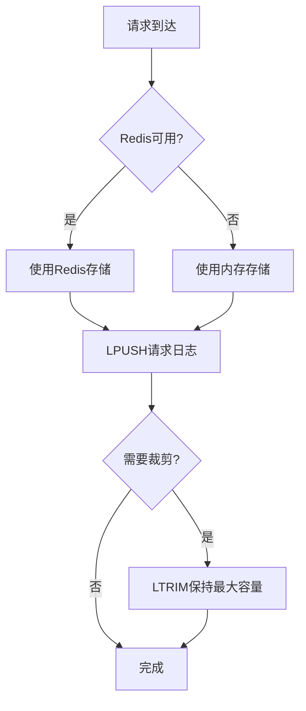
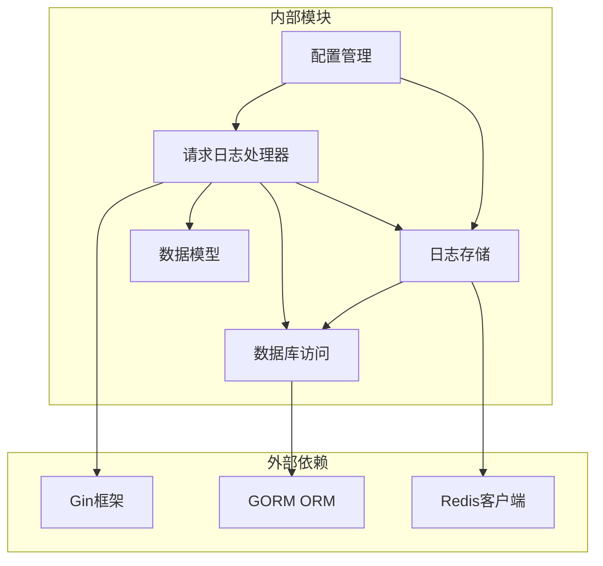

# 请求日志API

<cite>
**本文档引用的文件**
- [request_log.go](file://main/internal/api/handler/request_log.go)
- [store.go](file://main/internal/logstore/store.go)
- [models.go](file://main/internal/models/models.go)
- [config.go](file://main/internal/config/config.go)
- [log_cleanup.go](file://main/internal/service/log_cleanup.go)
- [request_trace.go](file://main/internal/api/middleware/request_trace.go)
- [router.go](file://main/internal/api/router.go)
- [page.tsx](file://web/app/(dashboard)/dashboard/request-logs/page.tsx)
</cite>

## 目录
1. [简介](#简介)
2. [项目结构](#项目结构)
3. [核心组件](#核心组件)
4. [架构概览](#架构概览)
5. [详细组件分析](#详细组件分析)
6. [依赖关系分析](#依赖关系分析)
7. [性能考虑](#性能考虑)
8. [故障排除指南](#故障排除指南)
9. [结论](#结论)
10. [附录](#附录)

## 简介

请求日志API是DNSPlane系统中用于管理和查询HTTP请求日志的核心功能模块。该系统提供了完整的请求日志生命周期管理，包括日志收集、存储、查询、统计、清理等功能。

系统采用双存储架构设计：实时请求日志通过Redis或内存进行高速缓存存储，同时通过SQLite数据库进行持久化存储。这种设计确保了高性能的日志查询能力，同时保证了数据的持久性和可靠性。

## 项目结构

请求日志功能主要分布在以下模块中：

**图表来源**
- [router.go:158-162](file://main/internal/api/router.go#L158-L162)
- [request_log.go:16-19](file://main/internal/api/handler/request_log.go#L16-L19)
- [store.go:35-50](file://main/internal/logstore/store.go#L35-L50)

**章节来源**
- [router.go:14-166](file://main/internal/api/router.go#L14-L166)
- [request_log.go:1-335](file://main/internal/api/handler/request_log.go#L1-L335)

## 核心组件

### 请求日志模型

RequestLog模型定义了请求日志的完整结构，包含以下关键字段：

- **标识字段**: RequestID、ErrorID、UserID、Username
- **请求信息**: Method、Path、Query、Body、Headers、IP、UserAgent
- **响应信息**: StatusCode、Response、Duration、IsError
- **错误信息**: ErrorMsg、ErrorStack
- **性能指标**: DBQueries、DBQueryTime、Extra
- **时间戳**: CreatedAt

### 日志存储架构

系统采用混合存储策略：

1. **实时存储**: 使用Redis或内存缓存存储最新请求日志
2. **持久化存储**: 使用SQLite数据库存储历史请求日志
3. **双写策略**: 请求日志同时写入Redis和SQLite，确保数据一致性

### 请求追踪中间件

RequestTrace中间件负责捕获HTTP请求的完整信息，包括：
- 自动生成RequestID和ErrorID
- 捕获请求头、请求体、响应体
- 记录数据库查询信息
- 计算请求耗时和错误状态

**章节来源**
- [models.go:332-356](file://main/internal/models/models.go#L332-L356)
- [store.go:35-50](file://main/internal/logstore/store.go#L35-L50)
- [request_trace.go:95-200](file://main/internal/api/middleware/request_trace.go#L95-L200)

## 架构概览

**图表来源**
- [router.go:21-24](file://main/internal/api/router.go#L21-L24)
- [request_trace.go:95-200](file://main/internal/api/middleware/request_trace.go#L95-L200)
- [store.go:59-77](file://main/internal/logstore/store.go#L59-L77)

## 详细组件分析

### 请求日志查询接口

#### GET /request-logs/list

**功能**: 分页查询HTTP请求日志，支持多种筛选条件

**请求参数**:
- page: 页码（默认1）
- page_size: 每页条数（默认20，最大200）
- keyword: 关键词（支持RequestID、ErrorID、Path、Username、IP模糊匹配）
- is_error: 错误标志（1=错误，0=成功）
- method: HTTP方法
- start_date: 开始日期（YYYY-MM-DD）
- end_date: 结束日期（YYYY-MM-DD）

**响应数据**:
- total: 总记录数
- list: 请求日志列表（不包含大字段以优化IO）

**章节来源**
- [request_log.go:57-91](file://main/internal/api/handler/request_log.go#L57-L91)
- [request_log.go:99-129](file://main/internal/api/handler/request_log.go#L99-L129)

#### POST /request-logs/detail

**功能**: 根据RequestID查询完整请求日志详情

**请求参数**:
- request_id: 请求ID（必填）

**响应数据**: 完整的RequestLog对象

**章节来源**
- [request_log.go:131-165](file://main/internal/api/handler/request_log.go#L131-L165)

#### POST /request-logs/error

**功能**: 根据ErrorID查询错误请求的完整日志

**请求参数**:
- error_id: 错误ID（必填）

**响应数据**: 完整的RequestLog对象

**章节来源**
- [request_log.go:167-201](file://main/internal/api/handler/request_log.go#L167-L201)

### 请求统计接口

#### POST /request-logs/stats

**功能**: 获取请求统计信息

**响应数据**:
- total_count: 总请求数
- error_count: 错误请求数
- today_count: 今日请求数
- today_error_count: 今日错误数
- recent_errors: 最近5个错误记录

**缓存机制**: 使用60秒TTL的内存缓存优化性能

**章节来源**
- [request_log.go:209-251](file://main/internal/api/handler/request_log.go#L209-L251)

### 日志清理接口

#### POST /request-logs/clean

**功能**: 清理请求日志

**请求参数**:
- days: 保留天数
- before_date: 截止日期（YYYY-MM-DD）
- success_keep_count: 保留的成功日志数量
- error_keep_count: 保留的错误日志数量

**清理策略**:
1. 按日期清理过期日志
2. 按数量保留最新日志
3. 同时清理Redis和SQLite中的日志

**章节来源**
- [request_log.go:253-334](file://main/internal/api/handler/request_log.go#L253-L334)

### 日志存储实现

#### Redis存储策略

当Redis可用时，系统使用Redis作为主要存储后端：

**图表来源**
- [store.go:59-77](file://main/internal/logstore/store.go#L59-L77)
- [store.go:251-264](file://main/internal/logstore/store.go#L251-L264)

#### SQLite持久化策略

SQLite数据库用于长期存储和查询：

- 独立的request_logs.db数据库
- 主键自增ID
- 多字段索引优化查询性能
- 支持复杂查询和统计

**章节来源**
- [store.go:59-77](file://main/internal/logstore/store.go#L59-L77)
- [config.go:55-65](file://main/internal/config/config.go#L55-L65)

## 依赖关系分析

**图表来源**
- [request_log.go:3-14](file://main/internal/api/handler/request_log.go#L3-L14)
- [store.go:3-14](file://main/internal/logstore/store.go#L3-L14)

### 关键依赖关系

1. **Gin框架**: 提供HTTP路由和中间件支持
2. **GORM**: 提供SQLite数据库ORM操作
3. **Redis**: 提供高性能缓存存储
4. **中间件链**: RequestTrace中间件负责日志捕获

**章节来源**
- [request_log.go:3-14](file://main/internal/api/handler/request_log.go#L3-L14)
- [store.go:3-14](file://main/internal/logstore/store.go#L3-L14)

## 性能考虑

### 查询优化策略

1. **字段选择优化**: 列表查询只选择必要字段，避免大字段传输
2. **索引使用**: RequestID、ErrorID、CreatedAt等字段建立索引
3. **缓存策略**: 统计数据使用内存缓存，减少数据库查询压力
4. **分页限制**: 默认每页20条，最大200条，防止大数据量查询

### 存储优化策略

1. **双存储架构**: Redis提供高速读取，SQLite提供持久化存储
2. **批量操作**: Redis使用LPUSH和LTRIM进行批量操作
3. **内存管理**: 自动裁剪超出容量的日志条目
4. **异步写入**: 请求完成后异步写入日志，不影响请求响应

### 性能监控指标

- **Redis命中率**: 通过LRANGE和LLEN操作监控
- **SQLite查询时间**: 监控复杂查询的执行时间
- **内存使用**: 监控Redis和内存的使用情况
- **磁盘IO**: 监控SQLite数据库的读写性能

**章节来源**
- [request_log.go:21-26](file://main/internal/api/handler/request_log.go#L21-L26)
- [store.go:16-22](file://main/internal/logstore/store.go#L16-L22)

## 故障排除指南

### 常见问题及解决方案

#### 1. 日志查询性能问题

**症状**: 日志查询响应缓慢

**可能原因**:
- 缺少必要的索引
- 查询条件过于宽泛
- Redis内存不足

**解决方法**:
- 确保RequestID、ErrorID、CreatedAt字段有索引
- 优化查询条件，添加具体的时间范围
- 增加Redis内存或调整maxLogSize

#### 2. 日志丢失问题

**症状**: 查询不到预期的日志

**可能原因**:
- Redis被回收
- 日志被自动清理
- 查询条件错误

**解决方法**:
- 检查Redis配置和内存使用情况
- 验证清理策略配置
- 确认查询条件的正确性

#### 3. 存储空间不足

**症状**: 磁盘空间使用过高

**解决方法**:
- 调整日志保留策略
- 增加磁盘空间
- 优化日志内容大小

**章节来源**
- [log_cleanup.go:65-127](file://main/internal/service/log_cleanup.go#L65-L127)
- [store.go:16-22](file://main/internal/logstore/store.go#L16-L22)

### 调试工具

1. **日志级别**: 支持Debug、Info、Warn、Error四种级别
2. **错误追踪**: 通过X-Error-ID头部进行错误追踪
3. **性能监控**: 内置性能指标监控
4. **配置检查**: 动态配置更新和验证

## 结论

请求日志API提供了完整的日志管理解决方案，具有以下特点：

1. **高性能**: 双存储架构确保快速的日志查询和写入
2. **可靠性**: Redis和SQLite双重保障数据安全
3. **易用性**: 简洁的API接口和丰富的查询功能
4. **可扩展性**: 支持水平扩展和配置化管理

通过合理的配置和使用，可以有效满足生产环境对日志管理的需求。

## 附录

### API接口汇总

| 接口名称 | 方法 | 路径 | 功能描述 |
|---------|------|------|----------|
| 获取请求日志列表 | POST | /request-logs/list | 分页查询HTTP请求日志 |
| 获取请求详情 | POST | /request-logs/detail | 根据RequestID查询日志详情 |
| 获取错误日志 | POST | /request-logs/error | 根据ErrorID查询错误日志 |
| 获取统计信息 | POST | /request-logs/stats | 获取请求统计信息 |
| 清理日志 | POST | /request-logs/clean | 清理过期或指定的日志 |

### 配置参数说明

| 参数名 | 类型 | 默认值 | 描述 |
|-------|------|--------|------|
| LogCleanup.Enable | bool | true | 是否启用自动清理 |
| LogCleanup.SuccessKeepCount | int | 1000 | 保留成功日志数量 |
| LogCleanup.ErrorKeepCount | int | 500 | 保留错误日志数量 |
| LogCleanup.CleanupInterval | int | 6 | 清理间隔（小时） |
| Redis.PoolSize | int | 10 | Redis连接池大小 |
| Redis.KeyPrefix | string | "" | Redis键前缀 |

### 监控和告警

系统支持以下监控指标：
- 日志写入速率
- 查询响应时间
- 存储空间使用率
- 错误率统计

建议设置相应的告警阈值，及时发现和处理异常情况。