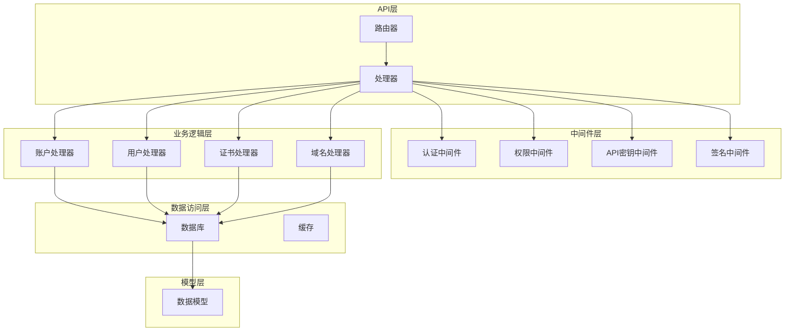
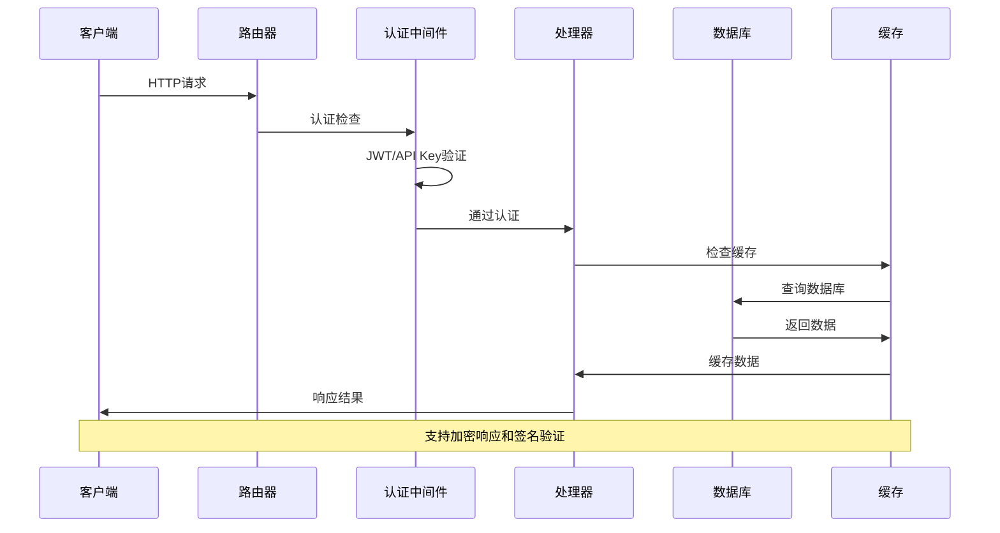
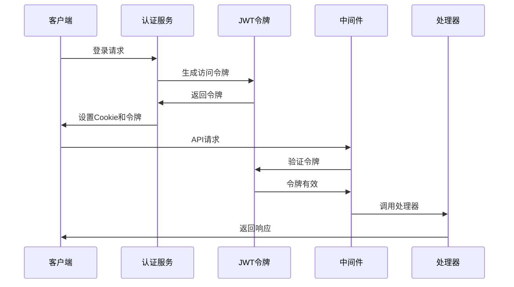
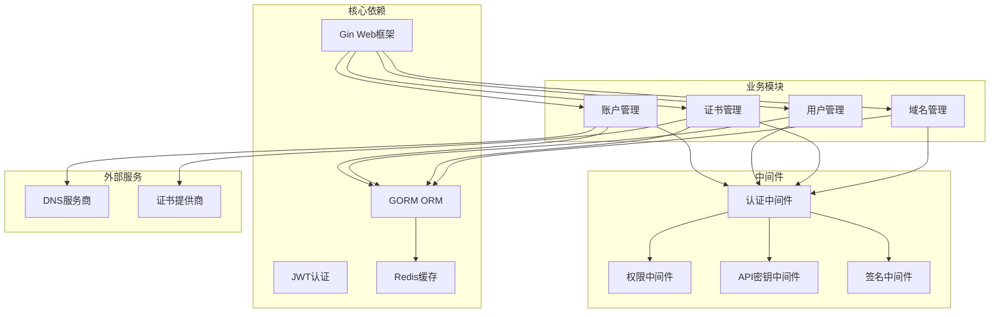
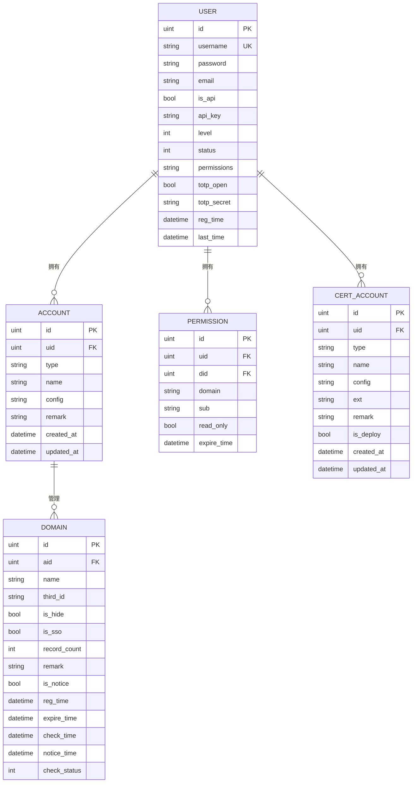

# 账户管理API

<cite>
**本文档引用的文件**
- [router.go](file://main/internal/api/router.go)
- [account.go](file://main/internal/api/handler/account.go)
- [user.go](file://main/internal/api/handler/user.go)
- [cert.go](file://main/internal/api/handler/cert.go)
- [domain.go](file://main/internal/api/handler/domain.go)
- [auth.go](file://main/internal/api/middleware/auth.go)
- [apikey.go](file://main/internal/api/middleware/apikey.go)
- [permission.go](file://main/internal/api/middleware/permission.go)
- [sign.go](file://main/internal/api/middleware/sign.go)
- [models.go](file://main/internal/models/models.go)
</cite>

## 目录
1. [简介](#简介)
2. [项目结构](#项目结构)
3. [核心组件](#核心组件)
4. [架构概览](#架构概览)
5. [详细组件分析](#详细组件分析)
6. [依赖关系分析](#依赖关系分析)
7. [性能考虑](#性能考虑)
8. [故障排除指南](#故障排除指南)
9. [结论](#结论)

## 简介

本文档详细记录了DNSPlane系统的账户管理API，涵盖DNS账户和证书账户的完整CRUD操作接口。系统提供了用户管理接口，包括用户创建、更新、删除和权限管理功能。同时，详细说明了API密钥的生成、重置和管理机制，以及账户权限控制和访问限制规则。

该系统采用现代化的Web架构，使用Gin框架构建RESTful API，支持JWT认证、API密钥认证和权限控制等多种认证方式。系统还集成了完整的审计日志功能，确保所有操作都可追溯。

## 项目结构

DNSPlane系统采用分层架构设计，主要分为以下几个层次：

**图表来源**
- [router.go:14-163](file://main/internal/api/router.go#L14-L163)
- [auth.go:124-199](file://main/internal/api/middleware/auth.go#L124-L199)
- [permission.go:132-207](file://main/internal/api/middleware/permission.go#L132-L207)

**章节来源**
- [router.go:14-163](file://main/internal/api/router.go#L14-L163)

## 核心组件

### 路由系统

系统使用Gin框架构建RESTful API，路由按照功能模块进行组织。主要路由组包括：

- `/api` - 所有API端点的基础路径
- `/api/auth` - 认证相关端点
- `/api/accounts` - DNS账户管理
- `/api/users` - 用户管理
- `/api/cert` - 证书管理
- `/api/domains` - 域名管理

### 认证机制

系统支持多种认证方式：

1. **JWT认证** - 主要的用户认证方式
2. **API密钥认证** - 用于第三方集成
3. **会话认证** - 基于HttpOnly Cookie的会话管理

### 权限控制系统

系统实现了细粒度的权限控制：

- 用户级别权限（普通用户、管理员）
- 功能模块权限
- 域名级权限控制
- 子域名权限细分

**章节来源**
- [router.go:21-163](file://main/internal/api/router.go#L21-L163)
- [auth.go:124-199](file://main/internal/api/middleware/auth.go#L124-L199)
- [permission.go:132-207](file://main/internal/api/middleware/permission.go#L132-L207)

## 架构概览

系统采用分层架构，确保关注点分离和代码可维护性：

**图表来源**
- [router.go:14-163](file://main/internal/api/router.go#L14-L163)
- [auth.go:124-199](file://main/internal/api/middleware/auth.go#L124-L199)
- [sign.go:13-69](file://main/internal/api/middleware/sign.go#L13-L69)

## 详细组件分析

### DNS账户管理API

#### 账户CRUD操作

DNS账户管理提供了完整的CRUD操作：

**获取账户列表**
- 端点：`GET /api/accounts`
- 功能：获取用户拥有的DNS账户列表
- 权限：需要domain模块权限
- 响应：包含账户基本信息的数组

**创建DNS账户**
- 端点：`POST /api/accounts`
- 功能：创建新的DNS服务商账户
- 请求参数：
  - `type`: DNS服务商类型
  - `name`: 账户名称
  - `config`: 配置参数对象
  - `remark`: 备注信息
- 响应：包含新创建账户ID

**更新DNS账户**
- 端点：`PUT /api/accounts/:id`
- 功能：更新现有DNS账户信息
- 请求参数：同创建接口
- 响应：更新成功消息

**删除DNS账户**
- 端点：`DELETE /api/accounts/:id`
- 功能：删除DNS账户
- 注意：删除前会检查是否有关联域名

**账户状态检查**
- 端点：`POST /api/accounts/:id/check`
- 功能：异步检测DNS账户连接状态
- 响应：提交成功消息

**获取账户域名列表**
- 端点：`GET /api/accounts/:id/domains`
- 功能：获取DNS账户下的域名列表
- 响应：包含域名信息的数组

**章节来源**
- [account.go:85-126](file://main/internal/api/handler/account.go#L85-L126)
- [account.go:184-237](file://main/internal/api/handler/account.go#L184-L237)
- [account.go:252-290](file://main/internal/api/handler/account.go#L252-L290)
- [account.go:301-341](file://main/internal/api/handler/account.go#L301-L341)
- [account.go:352-412](file://main/internal/api/handler/account.go#L352-L412)
- [domain.go:1089-1165](file://main/internal/api/handler/domain.go#L1089-L1165)

#### 账户配置管理

系统支持多种DNS服务商的配置管理：

**支持的DNS服务商**
- Cloudflare
- Aliyun DNS
- Huawei Cloud DNS
- PowerDNS
- 以及其他主流DNS服务商

**配置字段验证**
- 每个DNS服务商都有特定的配置字段要求
- 系统提供动态配置字段定义
- 支持配置字段的增删改查

**章节来源**
- [account.go:427-448](file://main/internal/api/handler/account.go#L427-L448)

### 证书账户管理API

#### 证书账户CRUD操作

**获取证书账户列表**
- 端点：`GET /api/cert/accounts`
- 功能：获取证书账户列表
- 参数：`deploy=1` 过滤部署型账户

**创建证书账户**
- 端点：`POST /api/cert/accounts`
- 功能：创建证书账户
- 请求参数：类型、名称、配置、备注、部署标志

**更新证书账户**
- 端点：`PUT /api/cert/accounts/:id`
- 功能：更新证书账户信息

**删除证书账户**
- 端点：`DELETE /api/cert/accounts/:id`
- 功能：删除证书账户

#### 证书订单管理

**获取证书订单列表**
- 端点：`GET /api/cert/orders`
- 功能：获取证书订单列表

**创建证书订单**
- 端点：`POST /api/cert/orders`
- 功能：创建证书订单
- 请求参数：账户ID、域名列表、密钥类型、密钥大小、自动续期标志

**处理证书订单**
- 端点：`POST /api/cert/orders/:id/process`
- 功能：开始处理证书申请
- 流程：创建订单→DNS验证→签发证书

**下载证书**
- 端点：`GET /api/cert/orders/:id/download`
- 功能：下载证书文件
- 支持：完整证书链、私钥、ZIP压缩包

**章节来源**
- [cert.go:23-51](file://main/internal/api/handler/cert.go#L23-L51)
- [cert.go:61-83](file://main/internal/api/handler/cert.go#L61-L83)
- [cert.go:85-109](file://main/internal/api/handler/cert.go#L85-L109)
- [cert.go:117-145](file://main/internal/api/handler/cert.go#L117-L145)
- [cert.go:155-223](file://main/internal/api/handler/cert.go#L155-L223)
- [cert.go:225-304](file://main/internal/api/handler/cert.go#L225-L304)
- [cert.go:669-737](file://main/internal/api/handler/cert.go#L669-L737)

### 用户管理API

#### 用户CRUD操作

**获取用户列表**
- 端点：`GET /api/users`
- 功能：获取所有用户列表
- 响应：包含用户基本信息的数组

**创建用户**
- 端点：`POST /api/users`
- 功能：创建新用户
- 请求参数：用户名、密码、邮箱、级别、API访问权限、权限配置

**更新用户**
- 端点：`PUT /api/users/:id`
- 功能：更新用户信息
- 支持：密码、邮箱、级别、API访问、状态、权限等

**删除用户**
- 端点：`DELETE /api/users/:id`
- 功能：删除用户
- 注意：不能删除当前登录用户

#### 权限管理

**获取用户权限**
- 端点：`GET /api/users/:id/permissions`
- 功能：获取用户权限列表

**添加用户权限**
- 端点：`POST /api/users/:id/permissions`
- 功能：为用户添加域名权限
- 请求参数：域名ID、域名、子域名、只读权限、过期时间

**更新用户权限**
- 端点：`PUT /api/users/:id/permissions/:permId`
- 功能：更新用户权限

**删除用户权限**
- 端点：`DELETE /api/users/:id/permissions/:permId`
- 功能：删除用户权限

#### API密钥管理

**重置API密钥**
- 端点：`POST /api/users/:id/reset-apikey`
- 功能：重新生成用户API密钥
- 注意：只有启用API访问的用户才能重置密钥

**章节来源**
- [user.go:23-45](file://main/internal/api/handler/user.go#L23-L45)
- [user.go:56-98](file://main/internal/api/handler/user.go#L56-L98)
- [user.go:100-150](file://main/internal/api/handler/user.go#L100-L150)
- [user.go:152-165](file://main/internal/api/handler/user.go#L152-L165)
- [user.go:167-175](file://main/internal/api/handler/user.go#L167-L175)
- [user.go:177-209](file://main/internal/api/handler/user.go#L177-L209)
- [user.go:211-240](file://main/internal/api/handler/user.go#L211-L240)
- [user.go:242-254](file://main/internal/api/handler/user.go#L242-L254)
- [user.go:256-275](file://main/internal/api/handler/user.go#L256-L275)

### 认证与授权机制

#### JWT认证流程

**图表来源**
- [auth.go:124-199](file://main/internal/api/middleware/auth.go#L124-L199)
- [auth.go:227-282](file://main/internal/api/middleware/auth.go#L227-L282)

#### API密钥认证

API密钥认证适用于第三方集成场景：

**认证流程**
1. 客户端生成HMAC-SHA256签名
2. 设置请求头：X-API-UID、X-API-Timestamp、X-API-Sign
3. 服务器验证时间戳和签名
4. 验证用户状态和API权限

**安全特性**
- 时间戳防重放攻击（±5分钟）
- HMAC常量时间比较
- 用户状态实时检查

**章节来源**
- [apikey.go:44-105](file://main/internal/api/middleware/apikey.go#L44-L105)

#### 权限控制机制

系统实现了多层次的权限控制：

**用户级别权限**
- 普通用户（level=0）：基本功能访问
- 管理员（level≥2）：完全访问权限

**功能模块权限**
- 通过JSON配置控制用户可访问的功能模块
- 默认情况下未配置权限的用户可访问所有模块

**域名级权限**
- 支持按域名分配权限
- 支持子域名权限细分
- 支持只读权限设置

**章节来源**
- [permission.go:132-207](file://main/internal/api/middleware/permission.go#L132-L207)
- [permission.go:357-376](file://main/internal/api/middleware/permission.go#L357-L376)

## 依赖关系分析

系统采用模块化设计，各组件之间依赖关系清晰：

**图表来源**
- [router.go:3-12](file://main/internal/api/router.go#L3-L12)
- [auth.go:3-23](file://main/internal/api/middleware/auth.go#L3-L23)

### 数据模型关系

系统使用GORM ORM管理数据模型之间的关系：

**图表来源**
- [models.go:9-31](file://main/internal/models/models.go#L9-L31)
- [models.go:49-60](file://main/internal/models/models.go#L49-L60)
- [models.go:62-81](file://main/internal/models/models.go#L62-L81)
- [models.go:93-103](file://main/internal/models/models.go#L93-L103)
- [models.go:189-202](file://main/internal/models/models.go#L189-L202)

**章节来源**
- [models.go:9-31](file://main/internal/models/models.go#L9-L31)
- [models.go:49-60](file://main/internal/models/models.go#L49-L60)
- [models.go:62-81](file://main/internal/models/models.go#L62-L81)
- [models.go:93-103](file://main/internal/models/models.go#L93-L103)
- [models.go:189-202](file://main/internal/models/models.go#L189-L202)

## 性能考虑

### 缓存策略

系统实现了多层次的缓存机制：

**认证用户缓存**
- 用户信息缓存30秒，减少数据库查询
- 支持缓存失效和手动清理

**账户列表缓存**
- DNS账户列表缓存，默认TTL
- 管理员和普通用户的缓存键不同

**响应加密缓存**
- 加密响应的缓存机制
- 避免重复的加密计算

### 性能优化

**数据库查询优化**
- 使用JOIN查询减少查询次数
- 分页查询支持大数据集
- 索引优化和查询计划分析

**并发处理**
- 异步任务处理（如DNS连接检查）
- goroutine池管理
- 上下文超时控制

**内存管理**
- 对象池减少GC压力
- 字符串池优化
- 及时释放资源

## 故障排除指南

### 常见问题诊断

**认证失败**
- 检查JWT密钥配置
- 验证用户状态和权限
- 确认时间同步和时区设置

**API密钥认证失败**
- 验证时间戳是否在允许范围内
- 检查HMAC签名计算
- 确认用户API权限状态

**权限不足**
- 检查用户级别和功能模块权限
- 验证域名权限配置
- 确认子域名权限范围

**数据库连接问题**
- 检查数据库配置和连接字符串
- 验证数据库服务状态
- 查看慢查询日志

### 日志分析

系统提供了详细的日志记录：

**审计日志**
- 所有重要操作都会记录
- 包含操作者信息、时间、IP等
- 支持日志查询和导出

**错误日志**
- 详细的错误信息和堆栈跟踪
- 包含请求ID和上下文信息
- 支持错误统计和分析

**性能日志**
- 请求处理时间和数据库查询时间
- 缓存命中率统计
- 并发处理统计

**章节来源**
- [auth.go:442-463](file://main/internal/api/middleware/auth.go#L442-L463)
- [sign.go:165-177](file://main/internal/api/middleware/sign.go#L165-L177)

## 结论

DNSPlane系统的账户管理API提供了完整的企业级功能，包括：

**功能完整性**
- 支持DNS账户和证书账户的完整生命周期管理
- 提供用户管理和权限控制的完整解决方案
- 支持多种认证方式和安全机制

**安全性保障**
- 多层认证和授权机制
- 数据传输加密和签名验证
- 审计日志和操作追踪

**可扩展性**
- 模块化设计便于功能扩展
- 支持新的DNS服务商和证书提供商
- 灵活的权限配置机制

**易用性**
- RESTful API设计符合行业标准
- 详细的文档和示例
- 完善的错误处理和调试工具

该系统为企业级DNS和证书管理提供了可靠的技术基础，支持大规模部署和高并发访问需求。