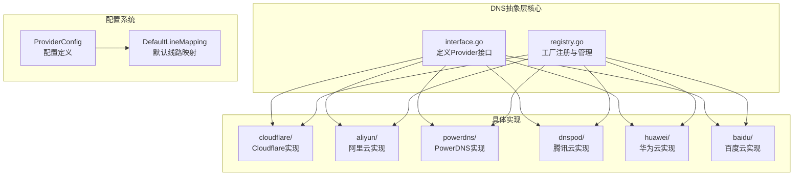
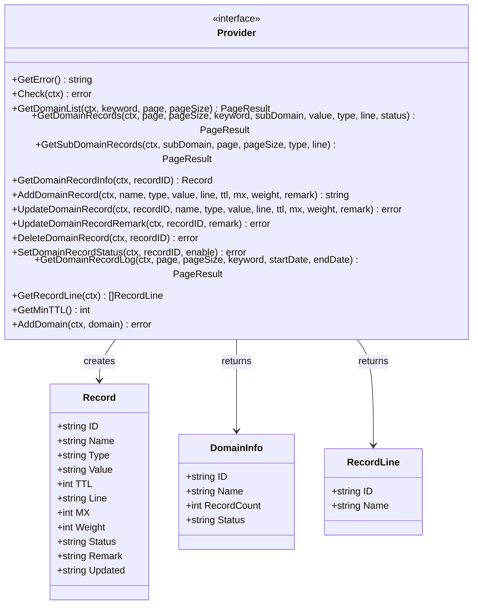
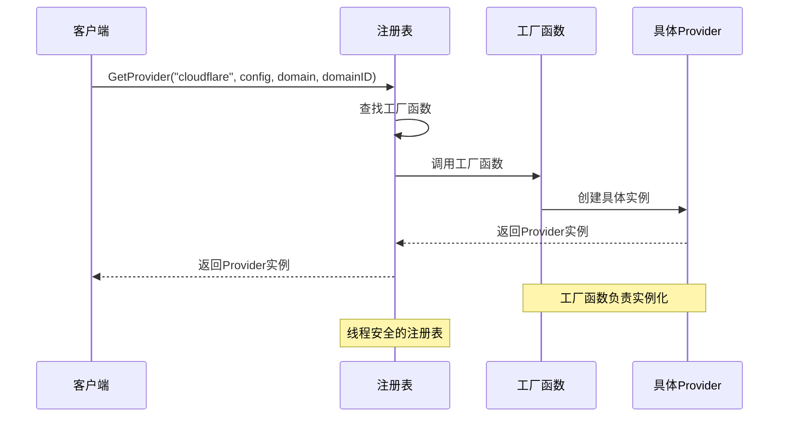
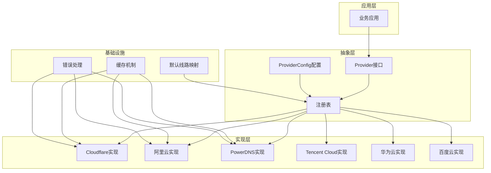
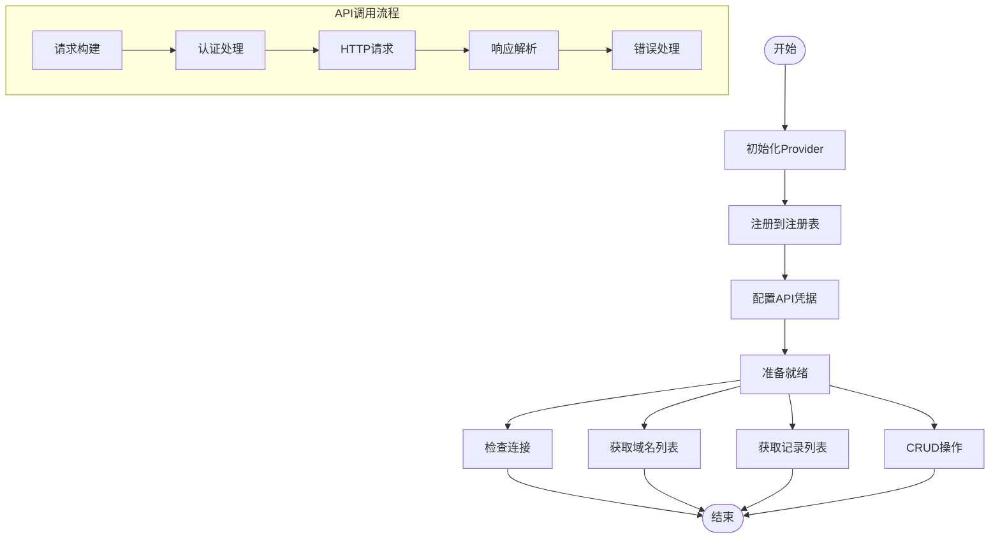
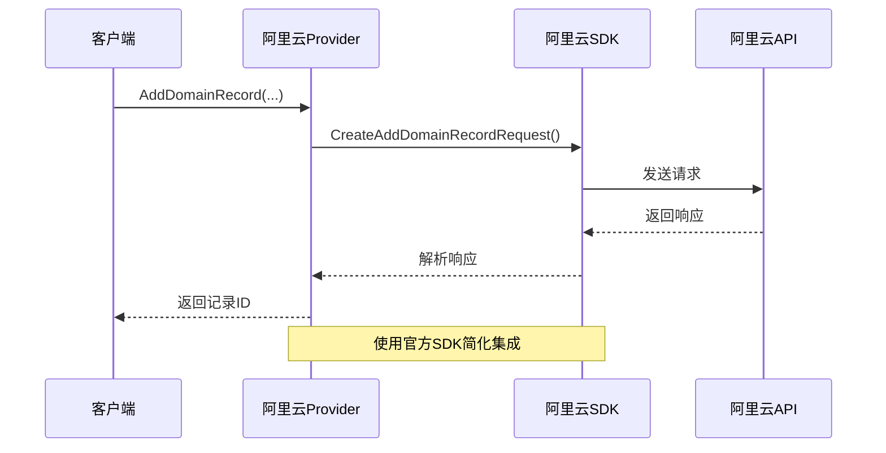
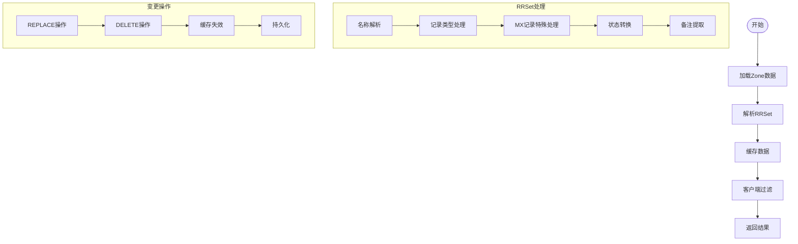
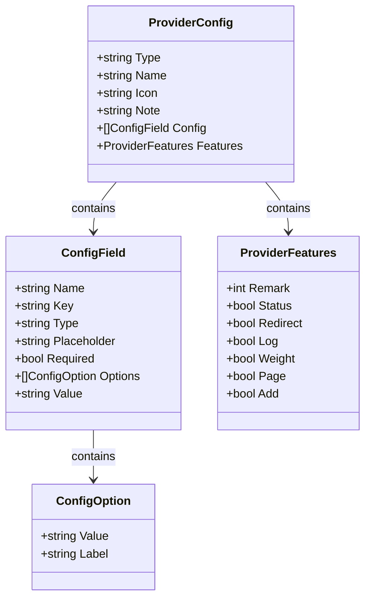
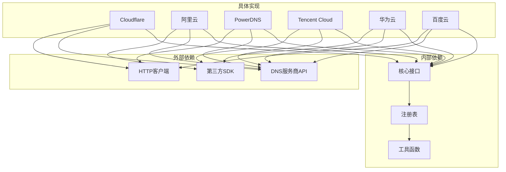
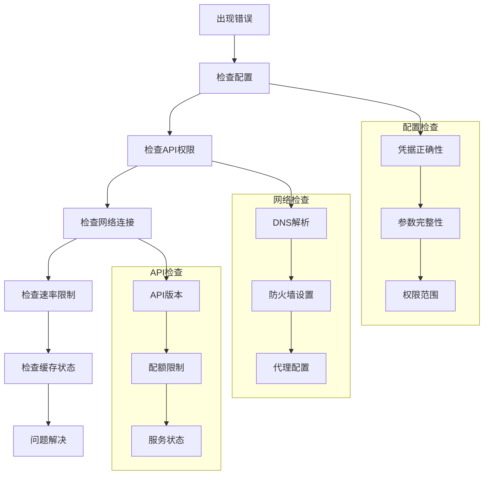

# DNS提供商抽象层

<cite>
**本文档引用的文件**
- [interface.go](file://main/internal/dns/interface.go)
- [registry.go](file://main/internal/dns/registry.go)
- [cloudflare.go](file://main/internal/dns/providers/cloudflare/cloudflare.go)
- [aliyun.go](file://main/internal/dns/providers/aliyun/aliyun.go)
- [powerdns.go](file://main/internal/dns/providers/powerdns/powerdns.go)
- [dnspod.go](file://main/internal/dns/providers/dnspod/dnspod.go)
- [huawei.go](file://main/internal/dns/providers/huawei/huawei.go)
- [baidu.go](file://main/internal/dns/providers/baidu/baidu.go)
</cite>

## 目录
1. [简介](#简介)
2. [项目结构](#项目结构)
3. [核心组件](#核心组件)
4. [架构概览](#架构概览)
5. [详细组件分析](#详细组件分析)
6. [依赖关系分析](#依赖关系分析)
7. [性能考虑](#性能考虑)
8. [故障排除指南](#故障排除指南)
9. [结论](#结论)

## 简介

DNS提供商抽象层是一个设计精良的插件化架构，旨在为多种DNS服务提供商提供统一的接口。该系统采用接口抽象和工厂模式相结合的设计理念，实现了对不同DNS服务商的无缝集成。

该抽象层的核心价值在于：
- **统一接口**：通过Provider接口标准化所有DNS服务商的操作
- **插件化架构**：支持动态注册和发现新的DNS服务商
- **配置驱动**：通过ProviderConfig实现灵活的配置管理
- **线路上下文**：内置默认线路映射机制，处理不同服务商的线路差异

## 项目结构

DNS提供商抽象层位于`main/internal/dns`目录下，采用清晰的模块化组织：

**图表来源**
- [interface.go:40-125](file://main/internal/dns/interface.go#L40-L125)
- [registry.go:17-65](file://main/internal/dns/registry.go#L17-L65)

**章节来源**
- [interface.go:1-125](file://main/internal/dns/interface.go#L1-L125)
- [registry.go:1-65](file://main/internal/dns/registry.go#L1-L65)

## 核心组件

### Provider接口设计

Provider接口是整个抽象层的核心，定义了DNS服务商的标准操作规范：

**图表来源**
- [interface.go:5-125](file://main/internal/dns/interface.go#L5-L125)

### 工厂模式实现

工厂模式通过ProviderFactory函数实现动态实例化：

**图表来源**
- [registry.go:25-37](file://main/internal/dns/registry.go#L25-L37)

**章节来源**
- [interface.go:40-86](file://main/internal/dns/interface.go#L40-L86)
- [registry.go:8-37](file://main/internal/dns/registry.go#L8-L37)

## 架构概览

DNS提供商抽象层采用分层架构设计，确保了高度的可扩展性和维护性：

**图表来源**
- [interface.go:88-125](file://main/internal/dns/interface.go#L88-L125)
- [registry.go:58-65](file://main/internal/dns/registry.go#L58-L65)

## 详细组件分析

### Cloudflare提供商实现

Cloudflare实现展示了完整的API集成模式：

**图表来源**
- [cloudflare.go:17-30](file://main/internal/dns/providers/cloudflare/cloudflare.go#L17-L30)
- [cloudflare.go:138-141](file://main/internal/dns/providers/cloudflare/cloudflare.go#L138-L141)

Cloudflare实现的关键特性：
- **双认证模式**：支持Global API Key和Bearer Token两种认证方式
- **智能线路处理**：将内部线路ID转换为Cloudflare特有的"proxied"状态
- **错误处理**：详细的API错误信息提取和处理

**章节来源**
- [cloudflare.go:17-445](file://main/internal/dns/providers/cloudflare/cloudflare.go#L17-L445)

### 阿里云提供商实现

阿里云实现体现了SDK集成的最佳实践：

**图表来源**
- [aliyun.go:201-225](file://main/internal/dns/providers/aliyun/aliyun.go#L201-L225)

阿里云实现的特点：
- **官方SDK集成**：直接使用阿里云官方Go SDK
- **完整功能支持**：支持备注、状态、权重等高级功能
- **日志查询**：提供详细的记录操作日志

**章节来源**
- [aliyun.go:14-344](file://main/internal/dns/providers/aliyun/aliyun.go#L14-L344)

### PowerDNS提供商实现

PowerDNS实现展示了自定义API集成的复杂场景：

**图表来源**
- [powerdns.go:170-247](file://main/internal/dns/providers/powerdns/powerdns.go#L170-L247)
- [powerdns.go:351-385](file://main/internal/dns/providers/powerdns/powerdns.go#L351-L385)

PowerDNS实现的独特挑战：
- **客户端过滤**：由于API限制，需要在客户端进行数据过滤
- **RRSet概念**：基于RRSet而非单个记录的处理模型
- **缓存机制**：实现多级缓存以提高性能

**章节来源**
- [powerdns.go:17-627](file://main/internal/dns/providers/powerdns/powerdns.go#L17-L627)

### 配置系统设计

ProviderConfig结构提供了灵活的配置管理机制：

**图表来源**
- [interface.go:88-125](file://main/internal/dns/interface.go#L88-L125)

**章节来源**
- [interface.go:88-125](file://main/internal/dns/interface.go#L88-L125)

## 依赖关系分析

DNS提供商抽象层的依赖关系展现了清晰的分层架构：

**图表来源**
- [cloudflare.go:3-15](file://main/internal/dns/providers/cloudflare/cloudflare.go#L3-L15)
- [aliyun.go:3-12](file://main/internal/dns/providers/aliyun/aliyun.go#L3-L12)
- [powerdns.go:3-15](file://main/internal/dns/providers/powerdns/powerdns.go#L3-L15)

**章节来源**
- [cloudflare.go:3-15](file://main/internal/dns/providers/cloudflare/cloudflare.go#L3-L15)
- [aliyun.go:3-12](file://main/internal/dns/providers/aliyun/aliyun.go#L3-L12)
- [powerdns.go:3-15](file://main/internal/dns/providers/powerdns/powerdns.go#L3-L15)

## 性能考虑

DNS提供商抽象层在设计时充分考虑了性能优化：

### 缓存策略
- **PowerDNS缓存**：实现RRSet级别的缓存，减少API调用频率
- **线程安全**：使用读写锁确保并发访问的安全性
- **智能失效**：在数据变更时自动清除相关缓存

### 网络优化
- **超时控制**：统一设置30秒超时，避免长时间阻塞
- **连接复用**：HTTP客户端支持连接池复用
- **错误重试**：在特定情况下提供重试机制

### 内存管理
- **按需加载**：只在需要时加载和解析数据
- **对象复用**：减少临时对象的创建和销毁

## 故障排除指南

### 常见问题诊断

### 错误处理机制

每个Provider实现都包含完善的错误处理：
- **错误信息存储**：通过GetError()方法提供详细的错误信息
- **API错误映射**：将服务商特定的错误转换为统一格式
- **重试策略**：在合适的场景下提供自动重试机制

**章节来源**
- [cloudflare.go:53-55](file://main/internal/dns/providers/cloudflare/cloudflare.go#L53-L55)
- [aliyun.go:51-53](file://main/internal/dns/providers/aliyun/aliyun.go#L51-L53)
- [powerdns.go:84-86](file://main/internal/dns/providers/powerdns/powerdns.go#L84-L86)

## 结论

DNS提供商抽象层成功实现了以下目标：

### 设计优势
- **高度可扩展**：通过工厂模式轻松集成新服务商
- **统一接口**：所有服务商暴露一致的操作界面
- **配置驱动**：灵活的配置管理系统支持各种部署场景
- **线路上下文**：内置线路映射机制处理服务商差异

### 技术特色
- **多实现模式**：支持SDK集成、HTTP API、自定义协议等多种集成方式
- **性能优化**：合理的缓存策略和网络优化
- **错误处理**：完善的错误处理和诊断机制
- **线程安全**：并发环境下的安全保证

### 扩展建议
对于新DNS服务商的集成，建议遵循以下最佳实践：
1. 实现Provider接口的所有必需方法
2. 在init()函数中注册到注册表
3. 提供完整的ProviderConfig配置
4. 实现适当的错误处理和日志记录
5. 考虑性能优化和缓存策略

该抽象层为DNS服务的统一管理和扩展提供了坚实的基础，支持未来更多的服务商集成和功能增强。