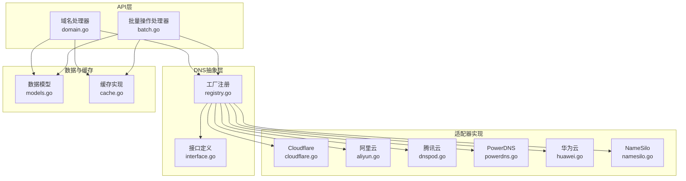
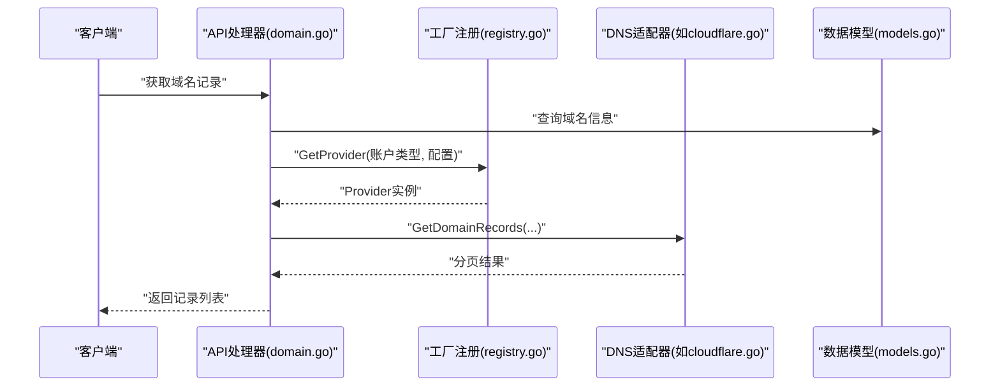
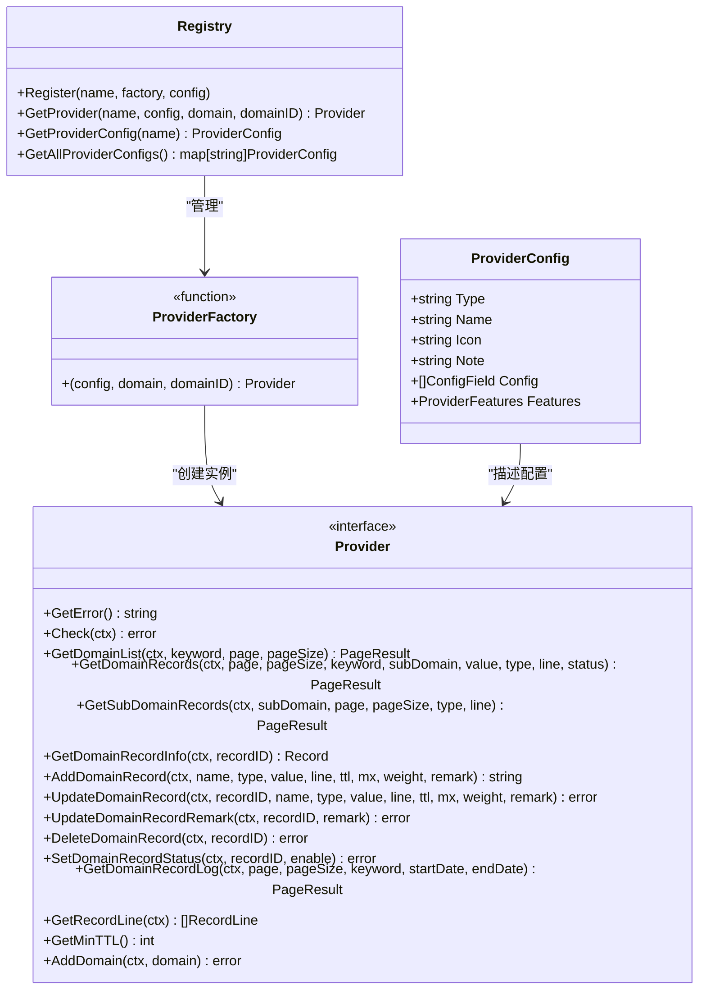
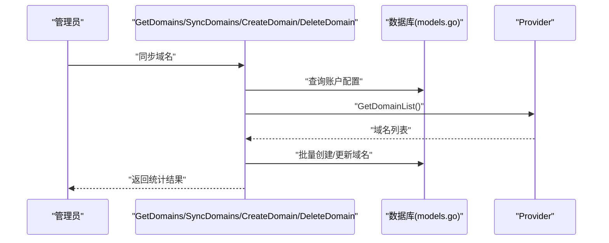
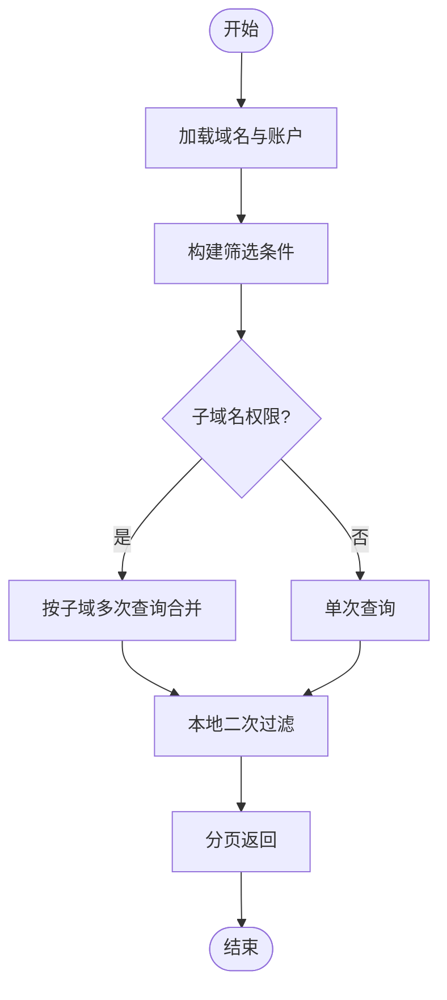
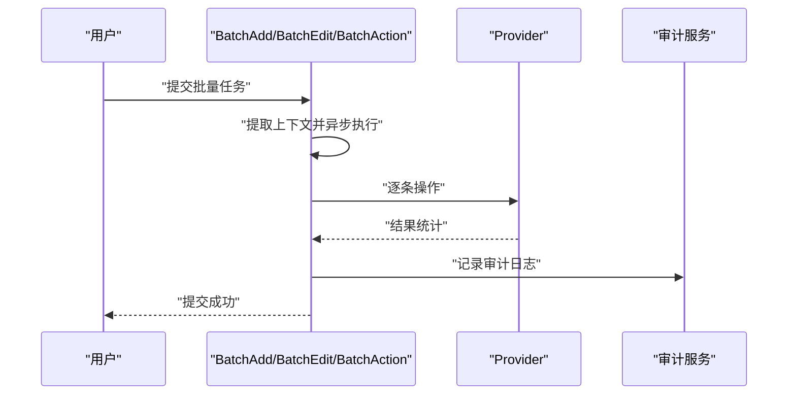
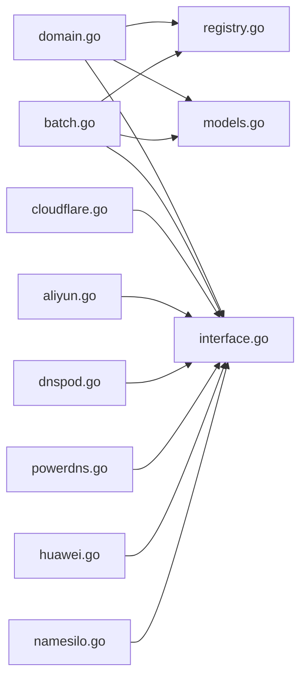

# DNS管理功能

<cite>
**本文档引用的文件**
- [interface.go](file://main/internal/dns/interface.go)
- [registry.go](file://main/internal/dns/registry.go)
- [domain.go](file://main/internal/api/handler/domain.go)
- [batch.go](file://main/internal/api/handler/batch.go)
- [cloudflare.go](file://main/internal/dns/providers/cloudflare/cloudflare.go)
- [aliyun.go](file://main/internal/dns/providers/aliyun/aliyun.go)
- [dnspod.go](file://main/internal/dns/providers/dnspod/dnspod.go)
- [powerdns.go](file://main/internal/dns/providers/powerdns/powerdns.go)
- [huawei.go](file://main/internal/dns/providers/huawei/huawei.go)
- [namesilo.go](file://main/internal/dns/providers/namesilo/namesilo.go)
- [cache.go](file://main/internal/cache/cache.go)
- [models.go](file://main/internal/models/models.go)
</cite>

## 目录
1. [简介](#简介)
2. [项目结构](#项目结构)
3. [核心组件](#核心组件)
4. [架构总览](#架构总览)
5. [详细组件分析](#详细组件分析)
6. [依赖关系分析](#依赖关系分析)
7. [性能考虑](#性能考虑)
8. [故障排除指南](#故障排除指南)
9. [结论](#结论)

## 简介
本项目提供统一的DNS管理能力，通过抽象DNS提供商接口与工厂模式，屏蔽不同云厂商API差异，实现域名与解析记录的统一管理。系统支持域名列表同步、解析记录的增删改查、批量操作、以及基于缓存的性能优化。

## 项目结构
- DNS抽象层位于 `main/internal/dns`，定义统一接口与工厂注册机制
- 具体DNS提供商适配器位于 `main/internal/dns/providers/<provider>`
- Web API处理器位于 `main/internal/api/handler`，负责业务编排与鉴权
- 数据模型位于 `main/internal/models`，包含域名、账户、权限等核心实体
- 缓存层位于 `main/internal/cache`，支持内存与Redis双栈

**图表来源**
- [domain.go:1-1397](file://main/internal/api/handler/domain.go#L1-L1397)
- [batch.go:1-426](file://main/internal/api/handler/batch.go#L1-L426)
- [interface.go:1-125](file://main/internal/dns/interface.go#L1-L125)
- [registry.go:1-65](file://main/internal/dns/registry.go#L1-L65)
- [cloudflare.go:1-445](file://main/internal/dns/providers/cloudflare/cloudflare.go#L1-L445)
- [aliyun.go:1-344](file://main/internal/dns/providers/aliyun/aliyun.go#L1-L344)
- [dnspod.go:1-320](file://main/internal/dns/providers/dnspod/dnspod.go#L1-L320)
- [powerdns.go:1-627](file://main/internal/dns/providers/powerdns/powerdns.go#L1-L627)
- [huawei.go:1-395](file://main/internal/dns/providers/huawei/huawei.go#L1-L395)
- [namesilo.go:1-325](file://main/internal/dns/providers/namesilo/namesilo.go#L1-L325)
- [models.go:1-357](file://main/internal/models/models.go#L1-L357)
- [cache.go:1-309](file://main/internal/cache/cache.go#L1-L309)

**章节来源**
- [interface.go:1-125](file://main/internal/dns/interface.go#L1-L125)
- [registry.go:1-65](file://main/internal/dns/registry.go#L1-L65)
- [domain.go:1-1397](file://main/internal/api/handler/domain.go#L1-L1397)
- [batch.go:1-426](file://main/internal/api/handler/batch.go#L1-L426)
- [models.go:1-357](file://main/internal/models/models.go#L1-L357)
- [cache.go:1-309](file://main/internal/cache/cache.go#L1-L309)

## 核心组件
- DNS接口与数据模型
  - 统一的记录、域名信息、线路、分页结果等数据结构
  - Provider接口定义了账户检查、域名/记录查询、增删改查、状态控制、日志与线路查询等能力
- 工厂与注册机制
  - 通过注册表集中管理各提供商工厂与配置，运行时按名称动态创建Provider实例
  - 支持默认线路映射，便于跨平台一致性
- API处理器
  - 域名管理：列表、详情、创建、同步、删除
  - 记录管理：列表、创建、更新、删除、状态控制、日志查询
  - 批量操作：批量新增、批量编辑、批量动作（启用/暂停/删除）

**章节来源**
- [interface.go:1-125](file://main/internal/dns/interface.go#L1-L125)
- [registry.go:1-65](file://main/internal/dns/registry.go#L1-L65)
- [domain.go:1-1397](file://main/internal/api/handler/domain.go#L1-L1397)
- [batch.go:1-426](file://main/internal/api/handler/batch.go#L1-L426)

## 架构总览
系统采用“接口抽象 + 工厂注册 + 适配器实现”的分层设计：
- 抽象层：Provider接口与ProviderConfig，屏蔽具体云厂商差异
- 工厂层：注册与获取Provider实例，支持并发安全
- 适配层：各云厂商API适配器，实现Provider接口
- 控制层：API处理器封装业务流程，调用Provider完成实际操作
- 数据层：GORM模型持久化域名、账户、权限等信息
- 缓存层：统一缓存接口，支持内存与Redis后端

**图表来源**
- [domain.go:548-728](file://main/internal/api/handler/domain.go#L548-L728)
- [registry.go:25-37](file://main/internal/dns/registry.go#L25-L37)
- [cloudflare.go:183-276](file://main/internal/dns/providers/cloudflare/cloudflare.go#L183-L276)
- [models.go:62-81](file://main/internal/models/models.go#L62-L81)

**章节来源**
- [domain.go:548-728](file://main/internal/api/handler/domain.go#L548-L728)
- [registry.go:25-37](file://main/internal/dns/registry.go#L25-L37)

## 详细组件分析

### DNS抽象层与工厂模式
- Provider接口职责
  - 账户校验、域名列表、记录查询与筛选、单条记录信息、增删改查、状态控制、日志、线路、最小TTL、添加域名
- ProviderConfig与ConfigField
  - 描述提供商名称、图标、配置项（键、类型、占位符、必填、选项）、特性开关（备注、状态、转发、日志、权重、分页、添加域名）
- 工厂注册
  - Register(name, factory, config)集中注册
  - GetProvider(name, config, domain, domainID)运行时创建实例
  - 默认线路映射支持跨平台一致性

**图表来源**
- [interface.go:40-125](file://main/internal/dns/interface.go#L40-L125)
- [registry.go:8-65](file://main/internal/dns/registry.go#L8-L65)

**章节来源**
- [interface.go:40-125](file://main/internal/dns/interface.go#L40-L125)
- [registry.go:17-65](file://main/internal/dns/registry.go#L17-L65)

### 支持的DNS服务商与适配器实现

#### 阿里云（Alibaba Cloud）
- 特性：支持备注、状态、域名转发、日志、权重、客户端分页、添加域名
- 关键实现点
  - DescribeDomains/DescribeDomainRecords等官方SDK调用
  - 线路转换、状态映射、MX优先级处理
  - 支持添加域名、记录日志查询

**章节来源**
- [aliyun.go:14-27](file://main/internal/dns/providers/aliyun/aliyun.go#L14-L27)
- [aliyun.go:63-144](file://main/internal/dns/providers/aliyun/aliyun.go#L63-L144)
- [aliyun.go:201-281](file://main/internal/dns/providers/aliyun/aliyun.go#L201-L281)

#### 腾讯云（DNSPod）
- 特性：支持备注、状态、域名转发、日志、权重、客户端分页、添加域名
- 关键实现点
  - 腾讯云SDK调用，线路与权重支持
  - 记录状态与权重字段映射

**章节来源**
- [dnspod.go:14-27](file://main/internal/dns/providers/dnspod/dnspod.go#L14-L27)
- [dnspod.go:88-138](file://main/internal/dns/providers/dnspod/dnspod.go#L88-L138)
- [dnspod.go:166-226](file://main/internal/dns/providers/dnspod/dnspod.go#L166-L226)

#### Cloudflare
- 特性：支持备注、状态、不支持域名转发、不支持日志、不支持权重、不支持客户端分页、支持添加域名
- 关键实现点
  - 通过proxied字段模拟线路，暂停通过在主机名后缀追加"_pause"
  - 支持创建/更新/删除记录，支持设置备注

**章节来源**
- [cloudflare.go:17-30](file://main/internal/dns/providers/cloudflare/cloudflare.go#L17-L30)
- [cloudflare.go:183-276](file://main/internal/dns/providers/cloudflare/cloudflare.go#L183-L276)
- [cloudflare.go:334-404](file://main/internal/dns/providers/cloudflare/cloudflare.go#L334-L404)

#### PowerDNS
- 特性：支持备注、状态、不支持域名转发、不支持日志、不支持权重、支持客户端分页、支持添加域名
- 关键实现点
  - 通过RR集（rrsets）进行增删改，PATCH替换/删除
  - 客户端侧过滤与缓存，减少API调用

**章节来源**
- [powerdns.go:17-35](file://main/internal/dns/providers/powerdns/powerdns.go#L17-L35)
- [powerdns.go:170-341](file://main/internal/dns/providers/powerdns/powerdns.go#L170-L341)
- [powerdns.go:414-450](file://main/internal/dns/providers/powerdns/powerdns.go#L414-L450)

#### 华为云
- 特性：支持备注、不支持状态、不支持域名转发、不支持日志、支持权重、不支持客户端分页、不支持添加域名
- 关键实现点
  - 通过RecordSet管理记录，MX值拼接/拆分
  - 线路名称映射

**章节来源**
- [huawei.go:15-28](file://main/internal/dns/providers/huawei/huawei.go#L15-L28)
- [huawei.go:112-210](file://main/internal/dns/providers/huawei/huawei.go#L112-L210)
- [huawei.go:277-315](file://main/internal/dns/providers/huawei/huawei.go#L277-L315)

#### NameSilo
- 特性：不支持备注、不支持状态、不支持域名转发、不支持日志、不支持权重、支持客户端分页、不支持添加域名
- 关键实现点
  - 通过HTTP GET接口调用，客户端侧过滤
  - MX距离字段映射

**章节来源**
- [namesilo.go:16-33](file://main/internal/dns/providers/namesilo/namesilo.go#L16-L33)
- [namesilo.go:150-229](file://main/internal/dns/providers/namesilo/namesilo.go#L150-L229)
- [namesilo.go:239-266](file://main/internal/dns/providers/namesilo/namesilo.go#L239-L266)

### 域名管理与解析记录管理API

#### 域名管理
- 列表与详情：支持关键词搜索、账户筛选、用户权限控制
- 同步：从提供商拉取域名列表，自动补齐ThirdID与记录数
- 创建：管理员通过提供商添加域名并获取第三方ID
- 删除：清理关联权限、监控任务、定时任务等

**图表来源**
- [domain.go:382-475](file://main/internal/api/handler/domain.go#L382-L475)
- [domain.go:265-349](file://main/internal/api/handler/domain.go#L265-L349)
- [models.go:62-81](file://main/internal/models/models.go#L62-L81)

**章节来源**
- [domain.go:79-196](file://main/internal/api/handler/domain.go#L79-L196)
- [domain.go:382-475](file://main/internal/api/handler/domain.go#L382-L475)
- [domain.go:265-349](file://main/internal/api/handler/domain.go#L265-L349)
- [domain.go:486-529](file://main/internal/api/handler/domain.go#L486-L529)

#### 解析记录管理
- 列表：支持子域名权限过滤、关键字/类型/线路/状态/值筛选、分页
- 新增/更新/删除/状态控制：统一调用Provider对应方法
- 日志：部分提供商支持记录日志查询

**图表来源**
- [domain.go:548-728](file://main/internal/api/handler/domain.go#L548-L728)

**章节来源**
- [domain.go:548-728](file://main/internal/api/handler/domain.go#L548-L728)

### 批量操作功能
- 批量新增：支持文本模式与结构化模式，异步执行，超时保护
- 批量编辑：异步修改TTL/线路等属性
- 批量动作：异步启用/暂停/删除记录
- 自动类型识别：根据值自动识别A/AAAA/CNAME

**图表来源**
- [batch.go:47-156](file://main/internal/api/handler/batch.go#L47-L156)
- [batch.go:185-264](file://main/internal/api/handler/batch.go#L185-L264)
- [batch.go:277-351](file://main/internal/api/handler/batch.go#L277-L351)

**章节来源**
- [batch.go:47-156](file://main/internal/api/handler/batch.go#L47-L156)
- [batch.go:185-264](file://main/internal/api/handler/batch.go#L185-L264)
- [batch.go:277-351](file://main/internal/api/handler/batch.go#L277-L351)

### DNS记录的缓存策略与性能优化
- 缓存接口统一：支持Set/Get/Delete/Incr/SetJSON/GetJSON/列表操作
- 后端选择：优先Redis，失败回退内存缓存
- PowerDNS适配器缓存：按域名ID缓存RR集，减少API调用
- 并发安全：读写锁保护缓存访问
- 性能建议：合理设置TTL，利用客户端过滤减少网络往返

**章节来源**
- [cache.go:15-94](file://main/internal/cache/cache.go#L15-L94)
- [powerdns.go:170-247](file://main/internal/dns/providers/powerdns/powerdns.go#L170-L247)

## 依赖关系分析

**图表来源**
- [domain.go:1-1397](file://main/internal/api/handler/domain.go#L1-L1397)
- [batch.go:1-426](file://main/internal/api/handler/batch.go#L1-L426)
- [registry.go:1-65](file://main/internal/dns/registry.go#L1-L65)
- [interface.go:1-125](file://main/internal/dns/interface.go#L1-L125)
- [models.go:1-357](file://main/internal/models/models.go#L1-L357)
- [cloudflare.go:1-445](file://main/internal/dns/providers/cloudflare/cloudflare.go#L1-L445)
- [aliyun.go:1-344](file://main/internal/dns/providers/aliyun/aliyun.go#L1-L344)
- [dnspod.go:1-320](file://main/internal/dns/providers/dnspod/dnspod.go#L1-L320)
- [powerdns.go:1-627](file://main/internal/dns/providers/powerdns/powerdns.go#L1-L627)
- [huawei.go:1-395](file://main/internal/dns/providers/huawei/huawei.go#L1-L395)
- [namesilo.go:1-325](file://main/internal/dns/providers/namesilo/namesilo.go#L1-L325)

**章节来源**
- [domain.go:1-1397](file://main/internal/api/handler/domain.go#L1-L1397)
- [batch.go:1-426](file://main/internal/api/handler/batch.go#L1-L426)
- [registry.go:1-65](file://main/internal/dns/registry.go#L1-L65)

## 性能考虑
- 异步批处理：批量操作在后台执行，避免阻塞主线程
- 客户端过滤：PowerDNS等适配器在本地进行二次过滤，减少API调用
- 缓存策略：针对频繁查询的记录集进行缓存，降低第三方API压力
- 超时控制：Provider请求与批处理均设置超时，防止长时间阻塞
- 分页与权限：结合子域名权限与分页，避免一次性拉取过多数据

## 故障排除指南
- Provider未注册
  - 现象：获取Provider时报unknown DNS provider
  - 排查：确认init中是否调用Register，名称是否匹配
- Provider实现为空
  - 现象：工厂返回nil
  - 排查：检查factory是否正确初始化
- Provider错误信息
  - 使用GetError()获取最近错误消息，便于定位问题
- 权限不足
  - 现象：无权限查看域名或记录
  - 排查：确认用户权限、子域名权限、管理员身份
- 批量操作失败
  - 现象：批量任务提交成功但部分失败
  - 排查：查看审计日志中的成功/失败计数，检查单条记录的错误原因

**章节来源**
- [registry.go:30-36](file://main/internal/dns/registry.go#L30-L36)
- [cloudflare.go:53-55](file://main/internal/dns/providers/cloudflare/cloudflare.go#L53-L55)
- [domain.go:569-578](file://main/internal/api/handler/domain.go#L569-L578)
- [batch.go:152-153](file://main/internal/api/handler/batch.go#L152-L153)

## 结论
本DNS管理功能通过清晰的抽象层与工厂模式，有效屏蔽了多家DNS提供商的API差异，提供了统一的域名与解析记录管理能力。配合批量操作、缓存与权限控制，满足了多租户、高并发场景下的运维需求。后续可在以下方面持续优化：
- 扩展更多DNS提供商适配器
- 引入更细粒度的缓存策略与失效机制
- 增强审计与可观测性能力
- 提供导入/导出工具链以支持大规模迁移