# 域名管理

<cite>
**本文引用的文件**
- [domain.go](file://main/internal/api/handler/domain.go)
- [batch.go](file://main/internal/api/handler/batch.go)
- [models.go](file://main/internal/models/models.go)
- [interface.go](file://main/internal/dns/interface.go)
- [registry.go](file://main/internal/dns/registry.go)
- [router.go](file://main/internal/api/router.go)
- [permission.go](file://main/internal/api/middleware/permission.go)
- [audit.go](file://main/internal/service/audit.go)
- [whois.go](file://main/internal/whois/whois.go)
- [cloudflare.go](file://main/internal/dns/providers/cloudflare/cloudflare.go)
- [bt.go](file://main/internal/dns/providers/bt/bt.go)
</cite>

## 目录
1. [简介](#简介)
2. [项目结构](#项目结构)
3. [核心组件](#核心组件)
4. [架构总览](#架构总览)
5. [详细组件分析](#详细组件分析)
6. [依赖分析](#依赖分析)
7. [性能考虑](#性能考虑)
8. [故障排查指南](#故障排查指南)
9. [结论](#结论)
10. [附录](#附录)

## 简介
本技术文档围绕域名管理功能进行系统性梳理，涵盖数据模型设计、增删改查接口、权限与审计、域名验证与有效性检查、批量操作、以及跨账户导入/同步等能力。文档旨在帮助开发者与运维人员快速理解系统架构与实现细节，并提供可操作的排障建议与最佳实践。

## 项目结构
域名管理位于后端 Go 代码的 API 层与数据层之间，采用“处理器 + 中间件 + 数据模型 + DNS 适配器”的分层设计：
- API 层：提供域名与解析记录的 REST 接口，负责参数校验、权限控制与调用 DNS 适配器。
- 中间件层：统一鉴权、日志、CORS、权限检查与模块白名单控制。
- 数据模型层：定义域名、账户、权限、日志等核心实体及字段。
- DNS 适配器层：抽象统一的 Provider 接口，屏蔽不同服务商差异，支持 Cloudflare、宝塔等多家厂商。

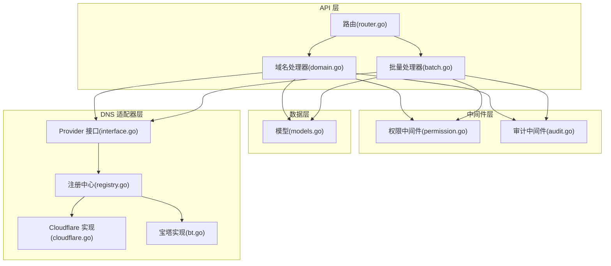

图表来源
- [router.go:14-160](file://main/internal/api/router.go#L14-L160)
- [domain.go:1-120](file://main/internal/api/handler/domain.go#L1-L120)
- [batch.go:1-60](file://main/internal/api/handler/batch.go#L1-L60)
- [permission.go:132-207](file://main/internal/api/middleware/permission.go#L132-L207)
- [audit.go:109-173](file://main/internal/service/audit.go#L109-L173)
- [models.go:62-81](file://main/internal/models/models.go#L62-L81)
- [interface.go:40-86](file://main/internal/dns/interface.go#L40-L86)
- [registry.go:25-45](file://main/internal/dns/registry.go#L25-L45)
- [cloudflare.go:17-30](file://main/internal/dns/providers/cloudflare/cloudflare.go#L17-L30)
- [bt.go:172-220](file://main/internal/dns/providers/bt/bt.go#L172-L220)

章节来源
- [router.go:14-160](file://main/internal/api/router.go#L14-L160)
- [domain.go:1-120](file://main/internal/api/handler/domain.go#L1-L120)
- [batch.go:1-60](file://main/internal/api/handler/batch.go#L1-L60)

## 核心组件
- 域名数据模型：包含域名基本信息、第三方平台 ID、解析记录数、通知开关、到期时间、校验状态等字段。
- Provider 接口：抽象 DNS 服务商能力，统一域名列表、记录查询、增删改查、状态控制、线路查询等。
- 权限与模块控制：基于用户等级与委派权限，支持子域名粒度的读写控制与模块白名单。
- 审计与日志：记录域名与记录的关键操作，支持本地与服务商日志回退。
- 批量与跨账户导入：支持批量添加/编辑/删除记录与批量域名操作，支持跨账户域名导入与同步。

章节来源
- [models.go:62-81](file://main/internal/models/models.go#L62-L81)
- [interface.go:40-86](file://main/internal/dns/interface.go#L40-L86)
- [permission.go:132-207](file://main/internal/api/middleware/permission.go#L132-L207)
- [audit.go:109-173](file://main/internal/service/audit.go#L109-L173)

## 架构总览
域名管理的调用链路如下：
- 前端通过路由触发 API，经鉴权与模块权限检查后进入处理器。
- 处理器根据域名信息加载对应 DNS 账户配置，创建 Provider 实例。
- 通过 Provider 与第三方 DNS 平台交互，完成后端数据更新与审计记录。

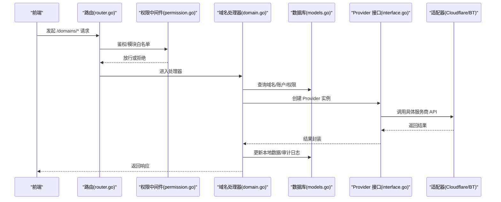

图表来源
- [router.go:53-67](file://main/internal/api/router.go#L53-L67)
- [permission.go:132-207](file://main/internal/api/middleware/permission.go#L132-L207)
- [domain.go:26-43](file://main/internal/api/handler/domain.go#L26-L43)
- [interface.go:40-86](file://main/internal/dns/interface.go#L40-L86)
- [cloudflare.go:138-141](file://main/internal/dns/providers/cloudflare/cloudflare.go#L138-L141)
- [bt.go:172-220](file://main/internal/dns/providers/bt/bt.go#L172-L220)

## 详细组件分析

### 数据模型与字段定义
- Domain（域名）：包含账户 ID、域名名称、第三方平台 ID、隐藏/SSO/通知开关、记录数、备注、到期时间、校验时间、校验状态等。
- Account（DNS 账户）：包含用户 ID、类型、名称、配置 JSON、备注等。
- Permission（权限）：支持按域名与子域名委派，支持只读与过期时间。
- Log（审计日志）：记录用户操作、实体类型与前后数据快照。

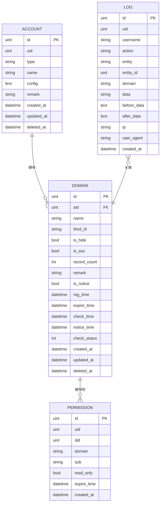

图表来源
- [models.go:49-60](file://main/internal/models/models.go#L49-L60)
- [models.go:62-81](file://main/internal/models/models.go#L62-L81)
- [models.go:93-103](file://main/internal/models/models.go#L93-L103)
- [models.go:105-120](file://main/internal/models/models.go#L105-L120)

章节来源
- [models.go:49-60](file://main/internal/models/models.go#L49-L60)
- [models.go:62-81](file://main/internal/models/models.go#L62-L81)
- [models.go:93-103](file://main/internal/models/models.go#L93-L103)
- [models.go:105-120](file://main/internal/models/models.go#L105-L120)

### 域名增删改查接口与业务逻辑
- 列表与详情：支持关键词搜索、账户筛选、分页、备注与权限合并展示。
- 新增域名：管理员通过账户与第三方平台校验后创建本地记录。
- 同步域名：管理员从账户侧批量同步域名，自动补齐第三方 ID 与记录数。
- 删除域名：清理权限、监控任务、定时任务、证书 CNAME、备注等关联数据。
- 更新域名：支持隐藏/SSO/通知开关、备注（用户独立备注）、到期时间等。
- 批量域名操作：支持批量删除、设置通知、设置备注、更新到期时间。

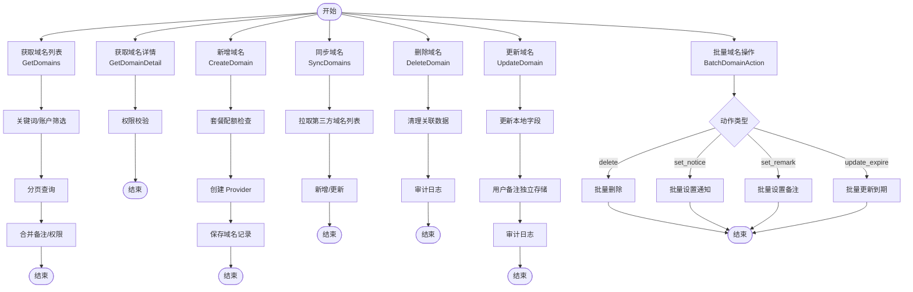

图表来源
- [domain.go:79-196](file://main/internal/api/handler/domain.go#L79-L196)
- [domain.go:203-253](file://main/internal/api/handler/domain.go#L203-L253)
- [domain.go:265-349](file://main/internal/api/handler/domain.go#L265-L349)
- [domain.go:382-475](file://main/internal/api/handler/domain.go#L382-L475)
- [domain.go:486-529](file://main/internal/api/handler/domain.go#L486-L529)
- [domain.go:1181-1247](file://main/internal/api/handler/domain.go#L1181-L1247)
- [domain.go:1261-1334](file://main/internal/api/handler/domain.go#L1261-L1334)

章节来源
- [domain.go:79-196](file://main/internal/api/handler/domain.go#L79-L196)
- [domain.go:203-253](file://main/internal/api/handler/domain.go#L203-L253)
- [domain.go:265-349](file://main/internal/api/handler/domain.go#L265-L349)
- [domain.go:382-475](file://main/internal/api/handler/domain.go#L382-L475)
- [domain.go:486-529](file://main/internal/api/handler/domain.go#L486-L529)
- [domain.go:1181-1247](file://main/internal/api/handler/domain.go#L1181-L1247)
- [domain.go:1261-1334](file://main/internal/api/handler/domain.go#L1261-L1334)

### 域名解析记录管理
- 查询记录：支持分页、关键词、子域名、记录类型、线路、状态筛选；支持子域权限合并查询。
- 添加/更新/删除记录：均采用异步执行，避免阻塞请求线程。
- 设置记录状态：支持启用/暂停。
- 获取线路：查询服务商支持的解析线路。

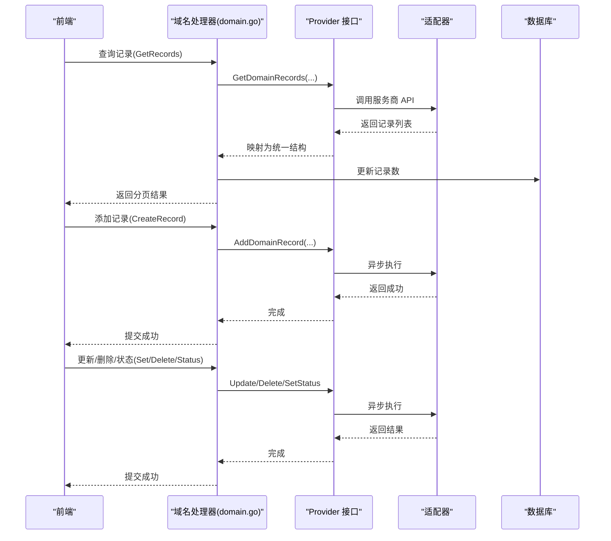

图表来源
- [domain.go:548-728](file://main/internal/api/handler/domain.go#L548-L728)
- [domain.go:768-826](file://main/internal/api/handler/domain.go#L768-L826)
- [domain.go:846-896](file://main/internal/api/handler/domain.go#L846-L896)
- [domain.go:908-964](file://main/internal/api/handler/domain.go#L908-L964)
- [domain.go:977-1027](file://main/internal/api/handler/domain.go#L977-L1027)
- [domain.go:1038-1077](file://main/internal/api/handler/domain.go#L1038-L1077)

章节来源
- [domain.go:548-728](file://main/internal/api/handler/domain.go#L548-L728)
- [domain.go:768-826](file://main/internal/api/handler/domain.go#L768-L826)
- [domain.go:846-896](file://main/internal/api/handler/domain.go#L846-L896)
- [domain.go:908-964](file://main/internal/api/handler/domain.go#L908-L964)
- [domain.go:977-1027](file://main/internal/api/handler/domain.go#L977-L1027)
- [domain.go:1038-1077](file://main/internal/api/handler/domain.go#L1038-L1077)

### 域名与 DNS 账户的关联关系与权限控制
- 关联关系：Domain 通过 aid 关联到 Account；Account 保存服务商类型与配置 JSON。
- 权限控制：
  - 管理员（level>=2）完全放行。
  - 自有账户域名：完全开放，无子域限制。
  - 委派权限：按域名与子域名合并策略，支持只读与过期控制。
- 子域名权限：支持通配与列表组合，精确到主机记录名。

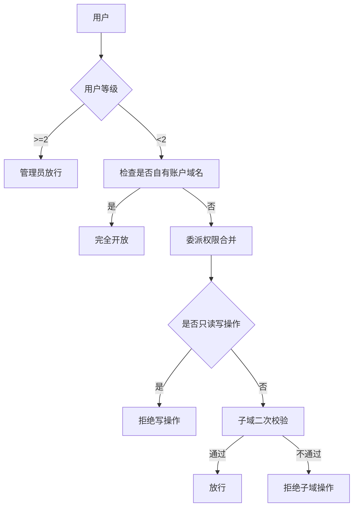

图表来源
- [permission.go:132-207](file://main/internal/api/middleware/permission.go#L132-L207)
- [permission.go:289-335](file://main/internal/api/middleware/permission.go#L289-L335)

章节来源
- [permission.go:132-207](file://main/internal/api/middleware/permission.go#L132-L207)
- [permission.go:289-335](file://main/internal/api/middleware/permission.go#L289-L335)

### 域名验证与有效性检查
- 域名有效性：通过 DNS 适配器的 Check 方法与 Provider 的错误信息返回，确保账户配置可用。
- WHOIS 到期时间：通过 whois 查询解析到期时间，更新到 Domain.expire_time 与 check_time。
- 记录状态标准化：将前端状态统一映射为 ENABLE/DISABLE，兼容不同服务商的状态表达。

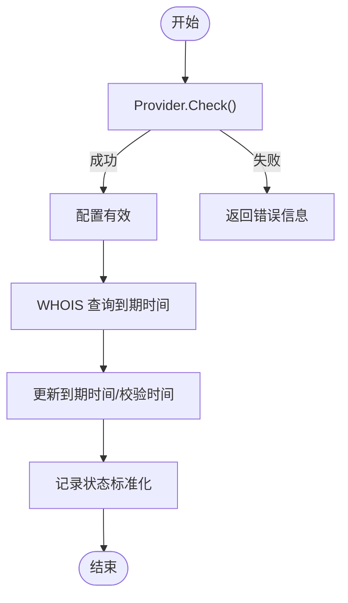

图表来源
- [cloudflare.go:138-141](file://main/internal/dns/providers/cloudflare/cloudflare.go#L138-L141)
- [whois.go:60-94](file://main/internal/whois/whois.go#L60-L94)
- [domain.go:45-65](file://main/internal/api/handler/domain.go#L45-L65)

章节来源
- [cloudflare.go:138-141](file://main/internal/dns/providers/cloudflare/cloudflare.go#L138-L141)
- [whois.go:60-94](file://main/internal/whois/whois.go#L60-L94)
- [domain.go:45-65](file://main/internal/api/handler/domain.go#L45-L65)

### 域名批量操作
- 批量添加记录：支持文本模式与结构化模式，自动识别记录类型（A/AAAA/CNAME），异步执行。
- 批量编辑记录：批量修改 TTL/线路等属性，异步执行。
- 批量记录操作：批量启用/暂停/删除记录，异步执行。
- 批量域名操作：批量删除、设置通知、设置备注、更新到期时间。

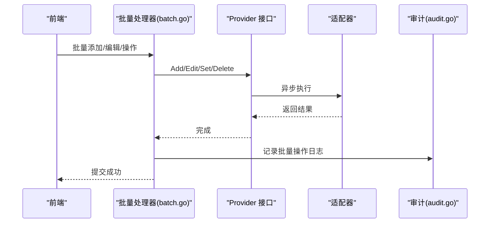

图表来源
- [batch.go:47-156](file://main/internal/api/handler/batch.go#L47-L156)
- [batch.go:185-264](file://main/internal/api/handler/batch.go#L185-L264)
- [batch.go:277-351](file://main/internal/api/handler/batch.go#L277-L351)
- [audit.go:109-173](file://main/internal/service/audit.go#L109-L173)

章节来源
- [batch.go:47-156](file://main/internal/api/handler/batch.go#L47-L156)
- [batch.go:185-264](file://main/internal/api/handler/batch.go#L185-L264)
- [batch.go:277-351](file://main/internal/api/handler/batch.go#L277-L351)
- [audit.go:109-173](file://main/internal/service/audit.go#L109-L173)

### 域名状态变更的日志记录与审计
- 记录关键操作：添加/更新/删除记录、设置状态、批量操作、域名更新等。
- 审计内容：包含用户、实体、操作、前后数据快照、IP、UA、时间等。
- 日志来源：优先从服务商日志获取，若服务商不可用则回退到本地日志。

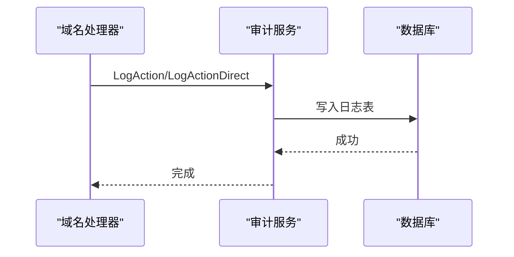

图表来源
- [audit.go:109-173](file://main/internal/service/audit.go#L109-L173)
- [domain.go:814-823](file://main/internal/api/handler/domain.go#L814-L823)
- [domain.go:885-893](file://main/internal/api/handler/domain.go#L885-L893)
- [domain.go:953-961](file://main/internal/api/handler/domain.go#L953-L961)
- [domain.go:1016-1024](file://main/internal/api/handler/domain.go#L1016-L1024)

章节来源
- [audit.go:109-173](file://main/internal/service/audit.go#L109-L173)
- [domain.go:814-823](file://main/internal/api/handler/domain.go#L814-L823)
- [domain.go:885-893](file://main/internal/api/handler/domain.go#L885-L893)
- [domain.go:953-961](file://main/internal/api/handler/domain.go#L953-L961)
- [domain.go:1016-1024](file://main/internal/api/handler/domain.go#L1016-L1024)

### 域名导入与同步
- 账户域名列表：从服务商拉取账户下域名列表，标记已导入状态。
- 跨账户导入：管理员可从其他账户的域名列表中选择导入。
- 同步域名：管理员从账户侧批量同步域名，自动补齐第三方 ID 与记录数。

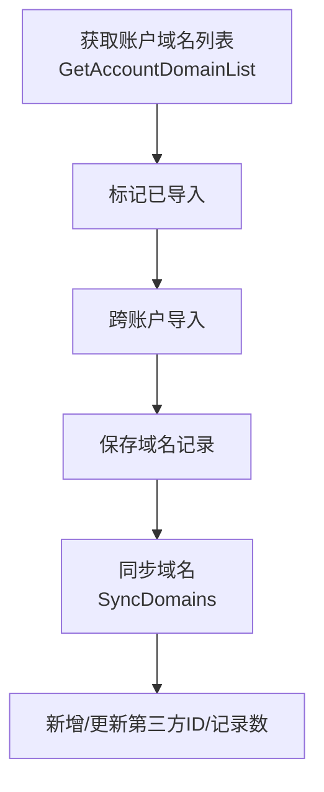

图表来源
- [domain.go:1089-1165](file://main/internal/api/handler/domain.go#L1089-L1165)
- [domain.go:382-475](file://main/internal/api/handler/domain.go#L382-L475)

章节来源
- [domain.go:1089-1165](file://main/internal/api/handler/domain.go#L1089-L1165)
- [domain.go:382-475](file://main/internal/api/handler/domain.go#L382-L475)

## 依赖分析
- 组件耦合：
  - 处理器依赖中间件（鉴权/权限/模块白名单）、数据模型、DNS 适配器。
  - Provider 通过注册中心统一创建，避免硬编码依赖。
- 外部依赖：
  - DNS 服务商 API（Cloudflare、宝塔等）。
  - WHOIS 服务用于到期时间查询。
- 潜在风险：
  - Provider 错误处理需统一，避免泄露敏感信息。
  - 批量操作需注意超时与幂等性。

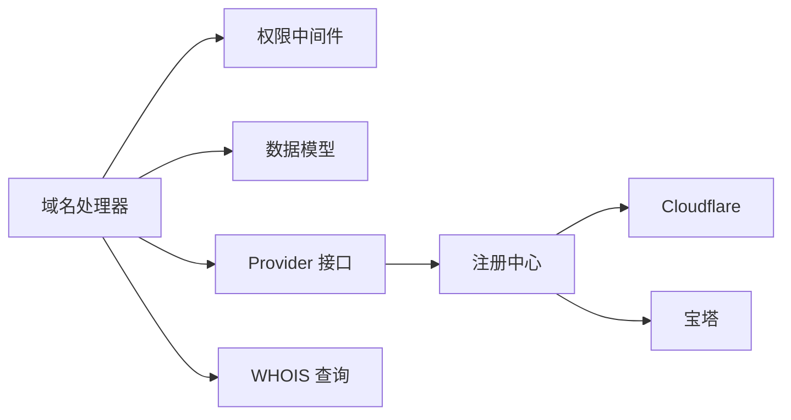

图表来源
- [domain.go:26-43](file://main/internal/api/handler/domain.go#L26-L43)
- [registry.go:25-45](file://main/internal/dns/registry.go#L25-L45)
- [cloudflare.go:17-30](file://main/internal/dns/providers/cloudflare/cloudflare.go#L17-L30)
- [bt.go:172-220](file://main/internal/dns/providers/bt/bt.go#L172-L220)

章节来源
- [domain.go:26-43](file://main/internal/api/handler/domain.go#L26-L43)
- [registry.go:25-45](file://main/internal/dns/registry.go#L25-L45)
- [cloudflare.go:17-30](file://main/internal/dns/providers/cloudflare/cloudflare.go#L17-L30)
- [bt.go:172-220](file://main/internal/dns/providers/bt/bt.go#L172-L220)

## 性能考虑
- 分页与筛选：列表查询支持关键词、账户、分页，避免一次性拉取全部数据。
- N+1 优化：同步域名时预加载本地域名，减少数据库查询次数。
- 异步执行：记录增删改与批量操作均采用异步执行，提升响应速度。
- 超时控制：对第三方 API 调用设置合理超时，防止阻塞。
- 缓存与映射：默认线路映射与状态标准化减少重复计算。

章节来源
- [domain.go:419-425](file://main/internal/api/handler/domain.go#L419-L425)
- [domain.go:768-826](file://main/internal/api/handler/domain.go#L768-L826)
- [batch.go:97-156](file://main/internal/api/handler/batch.go#L97-L156)

## 故障排查指南
- 无权限操作：
  - 检查用户等级与委派权限，确认子域名是否在允许列表内。
  - 只读权限会阻止写操作。
- Provider 错误：
  - 查看 Provider.GetError 返回的错误信息，确认账户配置是否正确。
- 记录状态异常：
  - 使用 normalizeDNSListStatusForAPI 统一状态，避免大小写与数值差异。
- 审计日志：
  - 若服务商日志不可用，系统会回退到本地日志，可通过 /domains/:id/logs 查询。

章节来源
- [permission.go:132-207](file://main/internal/api/middleware/permission.go#L132-L207)
- [cloudflare.go:53-55](file://main/internal/dns/providers/cloudflare/cloudflare.go#L53-L55)
- [domain.go:45-65](file://main/internal/api/handler/domain.go#L45-L65)
- [domain.go:64-72](file://main/internal/api/handler/domain.go#L64-L72)

## 结论
域名管理模块以清晰的分层架构与完善的权限控制为基础，结合 Provider 抽象与批量异步执行，实现了对多 DNS 服务商的统一接入与高效运维。通过严格的审计与日志回退机制，保障了操作的可追溯性与稳定性。建议在生产环境中持续关注 Provider 错误处理、超时与幂等性，并定期维护权限与模块白名单配置。

## 附录
- 路由与接口概览（节选）
  - 域名列表：GET /domains
  - 域名详情：GET /domains/:id
  - 新增域名：POST /domains
  - 同步域名：POST /domains/sync
  - 删除域名：DELETE /domains/:id
  - 更新域名：PUT /domains/:id
  - 批量域名操作：POST /domains/batch
  - 域名记录列表：GET /domains/:id/records
  - 添加记录：POST /domains/:id/records
  - 更新记录：PUT /domains/:id/records/:recordId
  - 删除记录：DELETE /domains/:id/records/:recordId
  - 设置记录状态：POST /domains/:id/records/:recordId/status
  - 获取线路：GET /domains/:id/lines
  - 批量记录操作：POST /domains/:id/records/batch/action
  - WHOIS 查询：POST /domains/:id/whois

章节来源
- [router.go:53-72](file://main/internal/api/router.go#L53-L72)