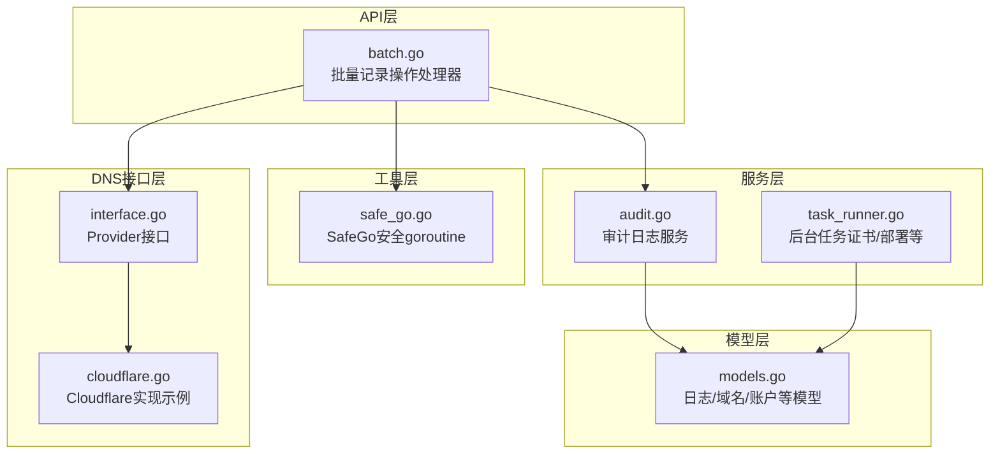
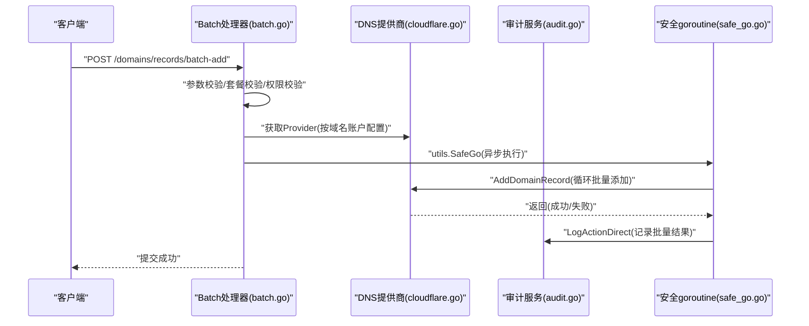
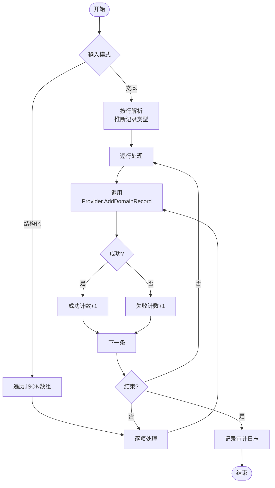
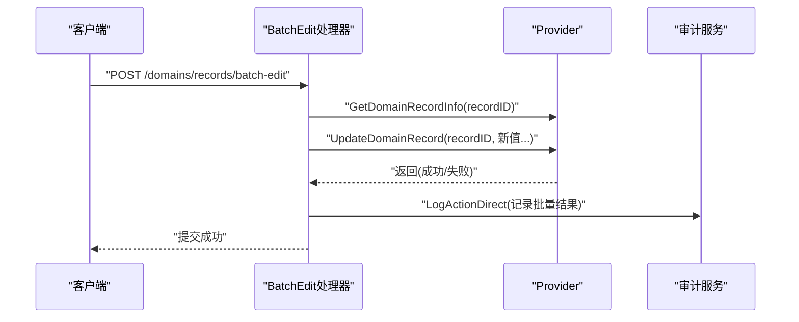
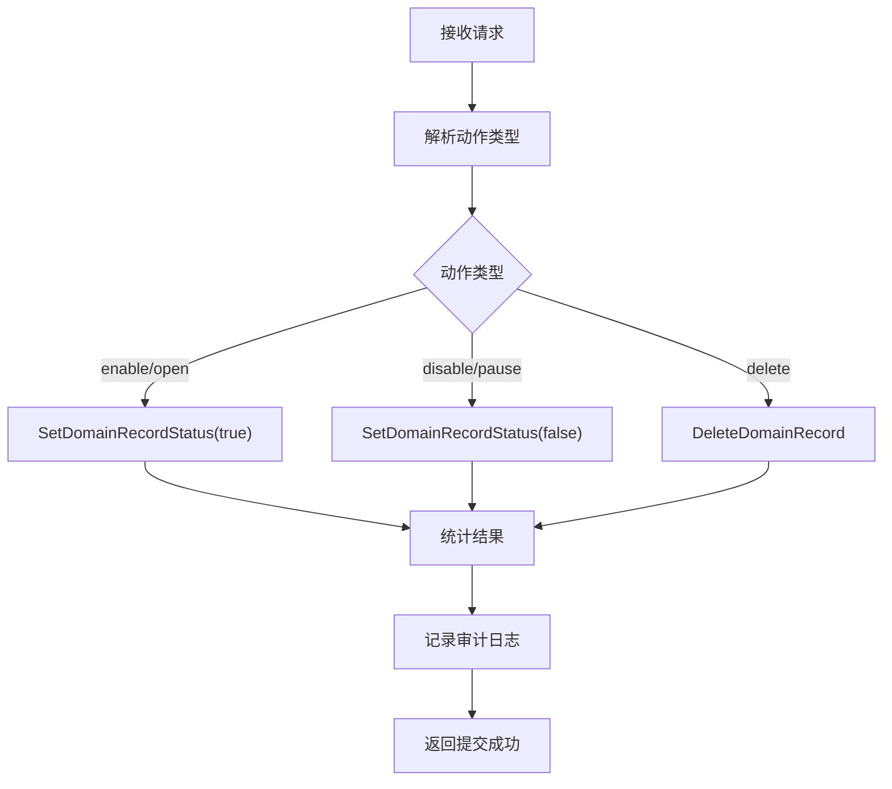
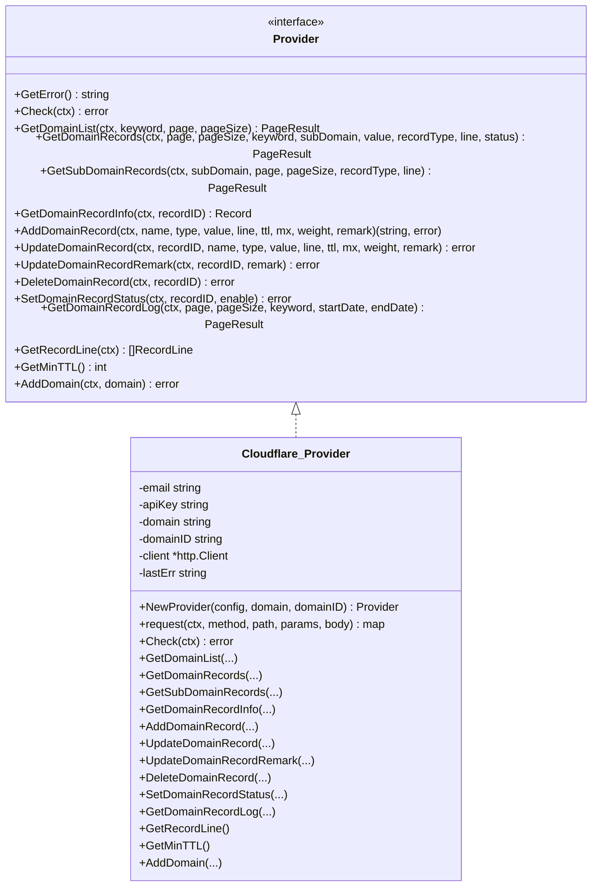
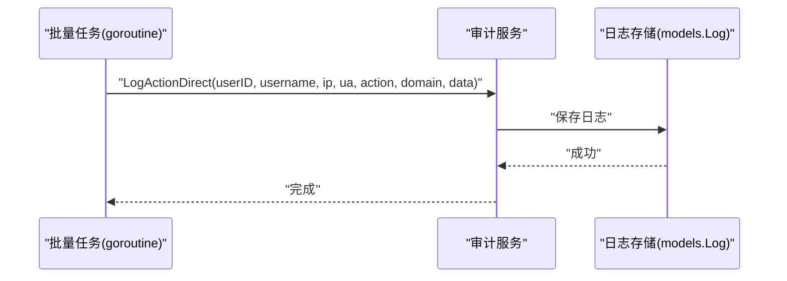
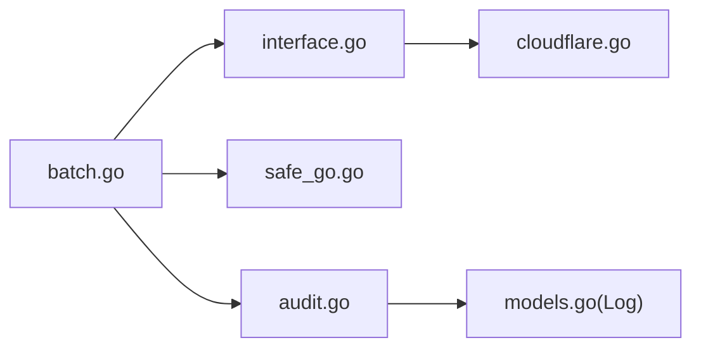

# 批量操作功能

<cite>
**本文引用的文件**
- [batch.go](file://main/internal/api/handler/batch.go)
- [safe_go.go](file://main/internal/utils/safe_go.go)
- [task_runner.go](file://main/internal/service/task_runner.go)
- [audit.go](file://main/internal/service/audit.go)
- [models.go](file://main/internal/models/models.go)
- [interface.go](file://main/internal/dns/interface.go)
- [cloudflare.go](file://main/internal/dns/providers/cloudflare/cloudflare.go)
</cite>

## 目录
1. [简介](#简介)
2. [项目结构](#项目结构)
3. [核心组件](#核心组件)
4. [架构总览](#架构总览)
5. [详细组件分析](#详细组件分析)
6. [依赖分析](#依赖分析)
7. [性能考虑](#性能考虑)
8. [故障排查指南](#故障排查指南)
9. [结论](#结论)
10. [附录](#附录)

## 简介
本技术文档围绕批量操作功能展开，重点解释批量域名解析记录的添加、编辑与动作执行机制，以及异步执行、超时保护、错误恢复、审计日志与并发安全策略。文档同时梳理了批量操作在系统中的职责边界、与DNS提供商接口的交互方式、以及与后台任务系统的关系。由于仓库中未发现专门的“批量导入/导出”API实现，本文将聚焦于现有批量记录操作能力，并给出可扩展的建议。

## 项目结构
批量操作相关代码主要位于后端API处理器层与工具层：
- API处理器：提供批量添加、批量编辑、批量动作（启用/暂停/删除）等接口
- 工具层：提供安全goroutine封装，避免子协程panic导致进程崩溃
- 服务层：审计日志服务，记录批量操作结果
- DNS接口层：定义统一的DNS提供商接口，屏蔽不同服务商差异
- DNS提供商实现：以Cloudflare为例展示接口实现

图表来源
- [batch.go:1-426](file://main/internal/api/handler/batch.go#L1-L426)
- [safe_go.go:1-52](file://main/internal/utils/safe_go.go#L1-L52)
- [audit.go:1-217](file://main/internal/service/audit.go#L1-L217)
- [models.go:105-120](file://main/internal/models/models.go#L105-L120)
- [interface.go:40-86](file://main/internal/dns/interface.go#L40-L86)
- [cloudflare.go:17-51](file://main/internal/dns/providers/cloudflare/cloudflare.go#L17-L51)

章节来源
- [batch.go:1-426](file://main/internal/api/handler/batch.go#L1-L426)
- [safe_go.go:1-52](file://main/internal/utils/safe_go.go#L1-L52)
- [audit.go:1-217](file://main/internal/service/audit.go#L1-L217)
- [models.go:105-120](file://main/internal/models/models.go#L105-L120)
- [interface.go:40-86](file://main/internal/dns/interface.go#L40-L86)
- [cloudflare.go:17-51](file://main/internal/dns/providers/cloudflare/cloudflare.go#L17-L51)

## 核心组件
- 批量记录操作处理器：提供批量添加、批量编辑、批量动作三类接口，均采用异步执行与超时保护
- 安全goroutine工具：封装panic恢复，避免批量任务异常影响主进程
- 审计日志服务：记录批量操作结果（成功/失败计数），支持直接记录（无需HTTP上下文）
- DNS提供商接口：抽象统一的记录增删改查与状态控制方法，屏蔽不同服务商差异
- DNS提供商实现：以Cloudflare为例，展示如何实现Provider接口

章节来源
- [batch.go:47-156](file://main/internal/api/handler/batch.go#L47-L156)
- [batch.go:185-264](file://main/internal/api/handler/batch.go#L185-L264)
- [batch.go:277-351](file://main/internal/api/handler/batch.go#L277-L351)
- [safe_go.go:14-24](file://main/internal/utils/safe_go.go#L14-L24)
- [audit.go:201-213](file://main/internal/service/audit.go#L201-L213)
- [interface.go:40-86](file://main/internal/dns/interface.go#L40-L86)
- [cloudflare.go:43-51](file://main/internal/dns/providers/cloudflare/cloudflare.go#L43-L51)

## 架构总览
批量操作的执行路径如下：
- 接收请求 → 参数绑定与权限校验 → 选择DNS提供商 → 异步执行批量任务（带超时）→ 记录审计日志

图表来源
- [batch.go:47-156](file://main/internal/api/handler/batch.go#L47-L156)
- [cloudflare.go:43-51](file://main/internal/dns/providers/cloudflare/cloudflare.go#L43-L51)
- [audit.go:201-213](file://main/internal/service/audit.go#L201-L213)
- [safe_go.go:14-24](file://main/internal/utils/safe_go.go#L14-L24)

## 详细组件分析

### 批量添加解析记录（文本/结构化两种模式）
- 支持两种输入模式：
  - 文本模式：按行解析，自动推断记录类型（A/AAAA/CNAME），默认TTL与默认线路可覆盖
  - 结构化模式：按JSON数组逐条添加，支持自定义TTL/线路/MX/备注
- 异步执行：使用安全goroutine启动，避免阻塞请求线程
- 超时保护：每个批量任务设置120秒超时，防止长时间阻塞
- 错误统计：逐条执行并统计成功/失败数量，最终记录审计日志

图表来源
- [batch.go:111-151](file://main/internal/api/handler/batch.go#L111-L151)
- [batch.go:159-171](file://main/internal/api/handler/batch.go#L159-L171)

章节来源
- [batch.go:47-156](file://main/internal/api/handler/batch.go#L47-L156)
- [batch.go:159-171](file://main/internal/api/handler/batch.go#L159-L171)

### 批量编辑解析记录（TTL/线路）
- 输入包含域名ID、记录ID列表、可选TTL与线路指针
- 对每条记录先查询原始信息，再根据请求参数决定更新值
- 异步执行与超时保护同上，最终记录审计日志

图表来源
- [batch.go:185-264](file://main/internal/api/handler/batch.go#L185-L264)

章节来源
- [batch.go:185-264](file://main/internal/api/handler/batch.go#L185-L264)

### 批量记录动作（启用/暂停/删除）
- 输入包含域名ID、记录ID列表与动作类型
- 根据动作类型调用对应Provider方法（启用/暂停/删除）
- 异步执行与超时保护，最终记录审计日志

图表来源
- [batch.go:277-351](file://main/internal/api/handler/batch.go#L277-L351)

章节来源
- [batch.go:277-351](file://main/internal/api/handler/batch.go#L277-L351)

### DNS提供商接口与实现
- Provider接口定义了记录增删改查与状态控制等方法，确保批量操作与具体服务商解耦
- Cloudflare实现展示了如何构造请求、解析响应、处理错误并返回统一结果

图表来源
- [interface.go:40-86](file://main/internal/dns/interface.go#L40-L86)
- [cloudflare.go:43-51](file://main/internal/dns/providers/cloudflare/cloudflare.go#L43-L51)

章节来源
- [interface.go:40-86](file://main/internal/dns/interface.go#L40-L86)
- [cloudflare.go:43-51](file://main/internal/dns/providers/cloudflare/cloudflare.go#L43-L51)

### 审计日志与状态记录
- 批量操作完成后，通过审计服务记录“批量添加/编辑/动作”的结果（成功/失败计数）
- 审计日志模型包含用户、实体、域名、IP、UA、时间戳等字段，便于追踪与合规

图表来源
- [audit.go:201-213](file://main/internal/service/audit.go#L201-L213)
- [models.go:105-120](file://main/internal/models/models.go#L105-L120)

章节来源
- [audit.go:201-213](file://main/internal/service/audit.go#L201-L213)
- [models.go:105-120](file://main/internal/models/models.go#L105-L120)

## 依赖分析
- 批量处理器依赖：
  - DNS接口层：通过Provider接口与具体服务商交互
  - 工具层：使用安全goroutine避免panic传播
  - 服务层：审计日志服务记录批量结果
- DNS接口层与实现：
  - Provider接口定义统一能力
  - 不同服务商实现遵循相同接口，便于替换与扩展

图表来源
- [batch.go:1-426](file://main/internal/api/handler/batch.go#L1-L426)
- [interface.go:40-86](file://main/internal/dns/interface.go#L40-L86)
- [safe_go.go:14-24](file://main/internal/utils/safe_go.go#L14-L24)
- [audit.go:201-213](file://main/internal/service/audit.go#L201-L213)
- [models.go:105-120](file://main/internal/models/models.go#L105-L120)
- [cloudflare.go:43-51](file://main/internal/dns/providers/cloudflare/cloudflare.go#L43-L51)

章节来源
- [batch.go:1-426](file://main/internal/api/handler/batch.go#L1-L426)
- [interface.go:40-86](file://main/internal/dns/interface.go#L40-L86)
- [safe_go.go:14-24](file://main/internal/utils/safe_go.go#L14-L24)
- [audit.go:201-213](file://main/internal/service/audit.go#L201-L213)
- [models.go:105-120](file://main/internal/models/models.go#L105-L120)
- [cloudflare.go:43-51](file://main/internal/dns/providers/cloudflare/cloudflare.go#L43-L51)

## 性能考虑
- 异步执行与超时保护：批量任务在独立goroutine中执行，设置120秒超时，避免阻塞主线程
- 并发安全：使用安全goroutine封装，捕获panic并记录堆栈，防止进程崩溃
- DNS调用：Provider实现中设置HTTP超时，避免外部API阻塞
- 审计日志：异步记录，减少IO对主流程的影响

章节来源
- [batch.go:97-153](file://main/internal/api/handler/batch.go#L97-L153)
- [batch.go:233-261](file://main/internal/api/handler/batch.go#L233-L261)
- [batch.go:324-348](file://main/internal/api/handler/batch.go#L324-L348)
- [safe_go.go:14-24](file://main/internal/utils/safe_go.go#L14-L24)
- [cloudflare.go:49](file://main/internal/dns/providers/cloudflare/cloudflare.go#L49)

## 故障排查指南
- 批量任务未响应或超时
  - 检查Provider实现的HTTP超时设置与网络连通性
  - 查看安全goroutine日志，确认是否存在panic并已恢复
- 权限不足
  - 确认用户模块权限与域名权限校验逻辑
- 审计日志缺失
  - 检查审计服务是否正常工作，日志存储是否可用
- 失败重试与通知
  - 后台任务系统提供证书部署的失败重试与通知机制，可参考其模式设计批量操作的失败重试策略

章节来源
- [batch.go:47-156](file://main/internal/api/handler/batch.go#L47-L156)
- [batch.go:185-264](file://main/internal/api/handler/batch.go#L185-L264)
- [batch.go:277-351](file://main/internal/api/handler/batch.go#L277-L351)
- [safe_go.go:14-24](file://main/internal/utils/safe_go.go#L14-L24)
- [audit.go:201-213](file://main/internal/service/audit.go#L201-L213)

## 结论
本批量操作功能通过异步执行、超时保护与审计日志实现了稳定可靠的批量记录管理能力。其设计遵循接口抽象与解耦原则，便于接入多种DNS服务商。对于尚未实现的批量导入/导出能力，可在现有框架基础上扩展数据格式解析与输出流程，并复用现有的安全执行与审计机制。

## 附录
- 批量导入/导出建议
  - 数据格式：CSV/JSON等结构化数据解析与校验
  - 解析流程：字段映射、必填校验、类型校验、范围校验
  - 输出流程：按域名/记录维度组织数据，支持多格式导出
  - 扩展点：在现有处理器中新增导入/导出路由与业务逻辑，沿用安全goroutine与审计日志