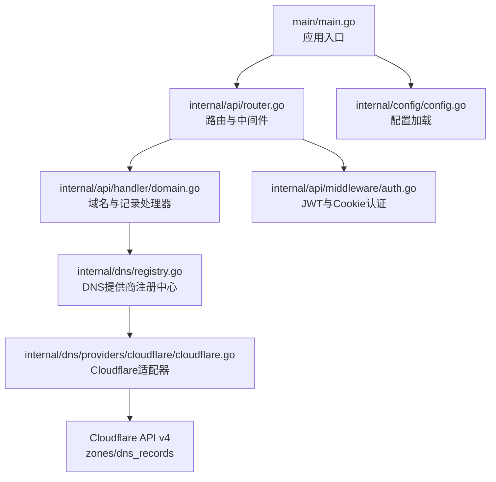
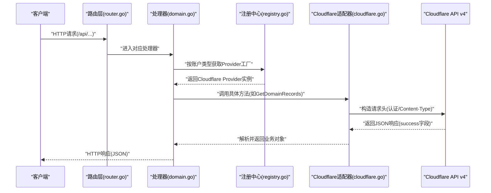
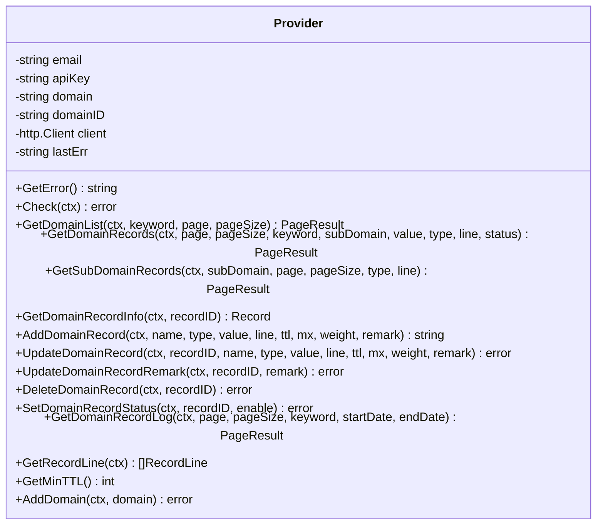
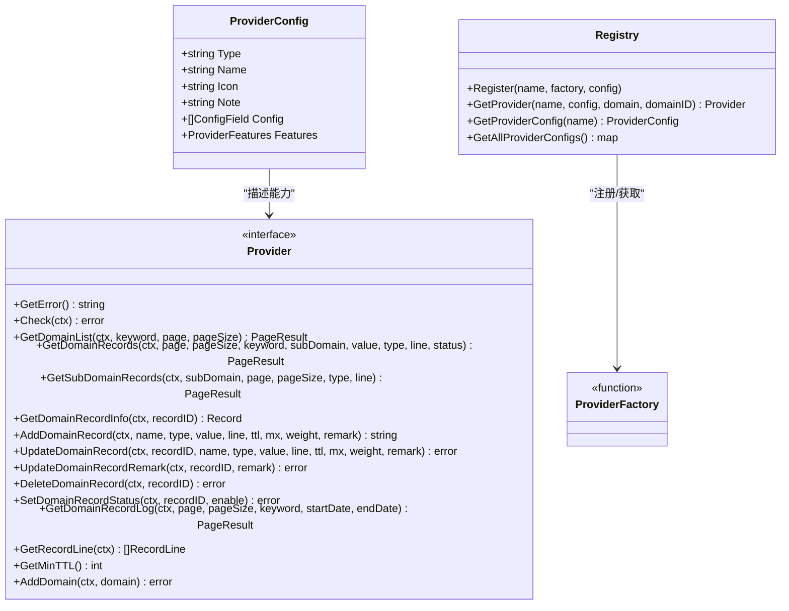
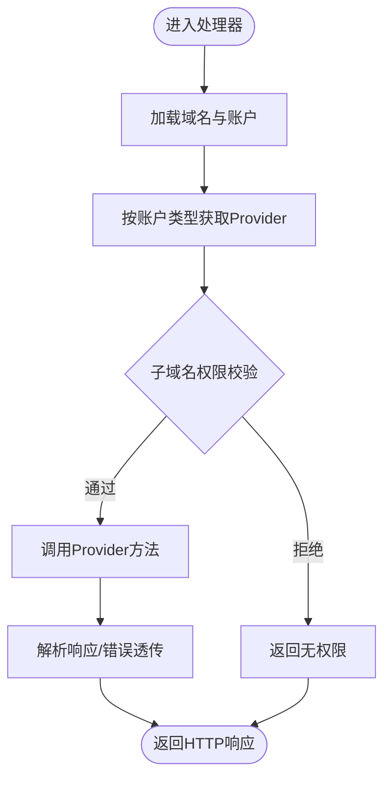
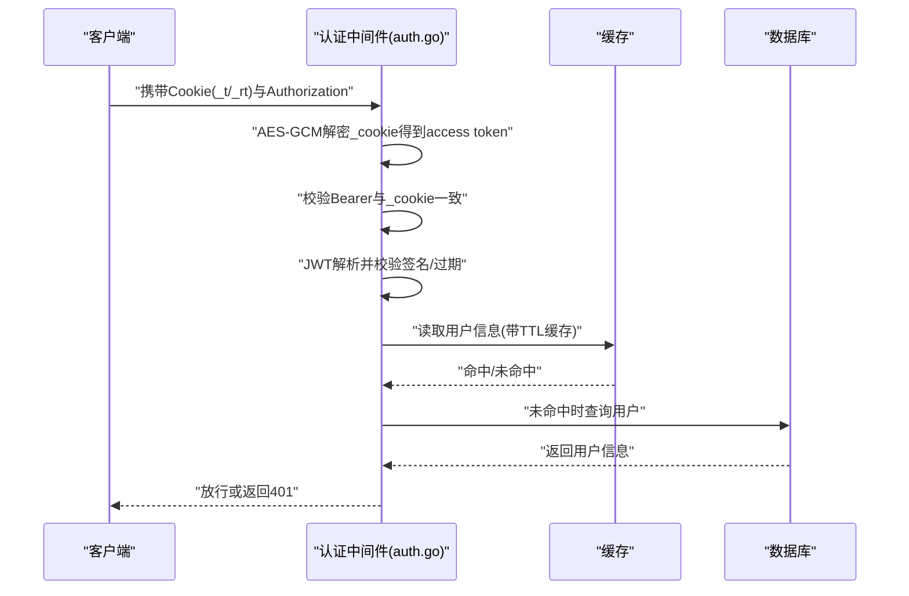
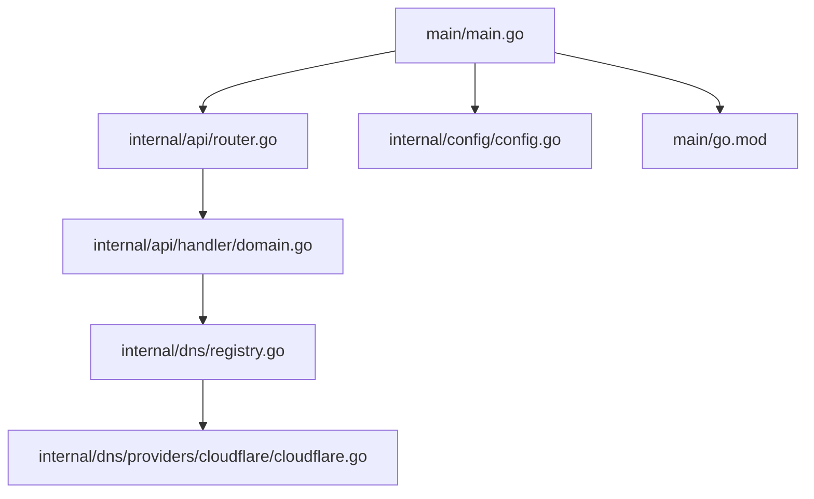

# Cloudflare DNS

<cite>
**本文引用的文件**
- [main.go](file://main/main.go)
- [go.mod](file://main/go.mod)
- [cloudflare.go](file://main/internal/dns/providers/cloudflare/cloudflare.go)
- [interface.go](file://main/internal/dns/interface.go)
- [registry.go](file://main/internal/dns/registry.go)
- [router.go](file://main/internal/api/router.go)
- [domain.go](file://main/internal/api/handler/domain.go)
- [auth.go](file://main/internal/api/middleware/auth.go)
- [config.go](file://main/internal/config/config.go)
- [README.md](file://README.md)
</cite>

## 目录
1. [简介](#简介)
2. [项目结构](#项目结构)
3. [核心组件](#核心组件)
4. [架构总览](#架构总览)
5. [详细组件分析](#详细组件分析)
6. [依赖分析](#依赖分析)
7. [性能考虑](#性能考虑)
8. [故障排查指南](#故障排查指南)
9. [结论](#结论)
10. [附录](#附录)

## 简介
本文件面向Cloudflare DNS服务的技术文档，聚焦于Cloudflare API v4的集成实现，涵盖以下主题：
- API v4认证机制与权限管理：支持Global API Key与API Token两种认证方式，并在请求头中自动选择合适的认证方案
- DNS记录管理：支持A、AAAA、CNAME、MX、TXT、NS、SRV、CAA等常见记录类型，代理状态（Proxied）的处理，以及TTL、MX优先级等字段映射
- 高级功能：DNSSEC、防火墙规则、Workers集成等Cloudflare特性的对接思路与实现边界
- 性能优化与安全特性：请求超时控制、错误透传、JWT认证与Cookie加密、CORS与安全响应头等

## 项目结构
后端采用Go语言实现，主要目录与职责如下：
- main：入口与运行时配置
- internal/api：HTTP API层，路由与中间件
- internal/dns：DNS抽象与各服务商适配器
- internal/config：系统配置加载
- web：前端静态资源（通过embed嵌入）

**图表来源**
- [main.go:52-147](file://main/main.go#L52-L147)
- [router.go:14-278](file://main/internal/api/router.go#L14-L278)
- [domain.go:26-43](file://main/internal/api/handler/domain.go#L26-L43)
- [registry.go:17-56](file://main/internal/dns/registry.go#L17-L56)
- [cloudflare.go:17-51](file://main/internal/dns/providers/cloudflare/cloudflare.go#L17-L51)
- [auth.go:124-199](file://main/internal/api/middleware/auth.go#L124-L199)
- [config.go:82-122](file://main/internal/config/config.go#L82-L122)

**章节来源**
- [main.go:52-147](file://main/main.go#L52-L147)
- [README.md:14-40](file://README.md#L14-L40)

## 核心组件
- DNS抽象层：定义统一的Provider接口与数据结构，屏蔽不同DNS服务商差异
- Cloudflare适配器：实现Provider接口，封装Cloudflare API v4调用
- API处理器：对接前端请求，调用Provider完成域名与记录的增删改查
- 认证中间件：JWT签发与校验、Cookie加密存储、CORS与安全响应头

**章节来源**
- [interface.go:40-86](file://main/internal/dns/interface.go#L40-L86)
- [cloudflare.go:34-51](file://main/internal/dns/providers/cloudflare/cloudflare.go#L34-L51)
- [domain.go:26-43](file://main/internal/api/handler/domain.go#L26-L43)
- [auth.go:124-199](file://main/internal/api/middleware/auth.go#L124-L199)

## 架构总览
Cloudflare DNS服务的整体交互流程如下：

**图表来源**
- [router.go:14-278](file://main/internal/api/router.go#L14-L278)
- [domain.go:548-728](file://main/internal/api/handler/domain.go#L548-L728)
- [registry.go:25-37](file://main/internal/dns/registry.go#L25-L37)
- [cloudflare.go:63-136](file://main/internal/dns/providers/cloudflare/cloudflare.go#L63-L136)

## 详细组件分析

### Cloudflare Provider实现
Cloudflare适配器负责：
- 认证头设置：根据API Key是否为纯十六进制判断为Global API Key，分别设置X-Auth-Email/X-Auth-Key或Authorization: Bearer
- 请求封装：统一的request方法，支持GET/DELETE参数拼接到URL，POST/PUT/PATCH参数序列化为JSON体
- 响应解析：检查success字段，错误时提取第一条错误消息并透传
- 域名与记录：实现Provider接口的所有方法，包括域名列表、记录查询、增删改、状态切换、TTL/MX等字段映射

**图表来源**
- [cloudflare.go:34-51](file://main/internal/dns/providers/cloudflare/cloudflare.go#L34-L51)
- [cloudflare.go:138-444](file://main/internal/dns/providers/cloudflare/cloudflare.go#L138-L444)

**章节来源**
- [cloudflare.go:57-136](file://main/internal/dns/providers/cloudflare/cloudflare.go#L57-L136)
- [cloudflare.go:143-276](file://main/internal/dns/providers/cloudflare/cloudflare.go#L143-L276)
- [cloudflare.go:334-400](file://main/internal/dns/providers/cloudflare/cloudflare.go#L334-L400)
- [cloudflare.go:402-444](file://main/internal/dns/providers/cloudflare/cloudflare.go#L402-L444)

### DNS抽象与注册中心
- Provider接口：统一域名与记录的CRUD能力，以及最小TTL、线路、日志等扩展能力
- ProviderConfig：描述提供商的配置字段、特性开关与图标等元信息
- 注册中心：以工厂函数形式注册Provider，按类型获取实例

**图表来源**
- [interface.go:40-86](file://main/internal/dns/interface.go#L40-L86)
- [interface.go:88-125](file://main/internal/dns/interface.go#L88-L125)
- [registry.go:17-56](file://main/internal/dns/registry.go#L17-L56)

**章节来源**
- [interface.go:40-125](file://main/internal/dns/interface.go#L40-L125)
- [registry.go:17-56](file://main/internal/dns/registry.go#L17-L56)

### API路由与处理器
- 路由层：定义/api前缀下的REST接口，统一挂载日志、CORS、请求追踪等中间件
- 处理器：根据域名获取对应Provider，调用其方法完成业务操作；对子域名权限进行过滤与限制

**图表来源**
- [router.go:14-278](file://main/internal/api/router.go#L14-L278)
- [domain.go:26-43](file://main/internal/api/handler/domain.go#L26-L43)
- [domain.go:548-728](file://main/internal/api/handler/domain.go#L548-L728)

**章节来源**
- [router.go:14-278](file://main/internal/api/router.go#L14-L278)
- [domain.go:548-728](file://main/internal/api/handler/domain.go#L548-L728)

### 认证与权限管理
- JWT与Cookie：登录成功后生成短期access token与长期refresh token，均通过AES-GCM加密写入HttpOnly Cookie
- 双重校验：Authorization头中的Bearer Token需与Cookie中解密出的token一致
- CORS与安全头：严格限定跨域来源，设置安全响应头，防止常见Web攻击

**图表来源**
- [auth.go:124-199](file://main/internal/api/middleware/auth.go#L124-L199)
- [auth.go:295-310](file://main/internal/api/middleware/auth.go#L295-L310)
- [auth.go:442-453](file://main/internal/api/middleware/auth.go#L442-L453)

**章节来源**
- [auth.go:124-199](file://main/internal/api/middleware/auth.go#L124-L199)
- [auth.go:295-310](file://main/internal/api/middleware/auth.go#L295-L310)
- [auth.go:490-508](file://main/internal/api/middleware/auth.go#L490-L508)

## 依赖分析
- 运行时依赖：gin-gonic/gin（Web框架）、gorm（ORM）、redis/go-redis/v9（可选缓存）、bcrypt（密码哈希）、jwt等
- Cloudflare SDK：直接使用HTTP客户端调用API，未引入官方SDK

**图表来源**
- [main.go:52-147](file://main/main.go#L52-L147)
- [go.mod:5-28](file://main/go.mod#L5-L28)

**章节来源**
- [go.mod:5-28](file://main/go.mod#L5-L28)

## 性能考虑
- 请求超时：Cloudflare适配器与认证中间件均设置了合理的超时时间，避免阻塞
- 缓存：认证用户信息带TTL缓存，减少数据库往返
- 分页与筛选：API层支持分页与多条件筛选，降低单次响应体积
- 错误快速失败：Cloudflare API返回success=false时立即抛错，避免后续处理

[本节为通用性能讨论，不涉及具体文件分析]

## 故障排查指南
- 认证失败
  - 检查Cookie是否正确设置与解密
  - 确认Authorization头与Cookie中的token一致
  - 核对JWT Secret配置与签名有效性
- Cloudflare API错误
  - 查看Provider.lastErr或响应中的errors.message
  - 确认API Key类型（Global API Key或API Token）与请求头设置
- 权限问题
  - 子域名权限过滤可能导致记录为空或部分记录被隐藏
  - 管理员可绕过子域名限制，普通用户仅能看到授权范围内的记录

**章节来源**
- [cloudflare.go:121-135](file://main/internal/dns/providers/cloudflare/cloudflare.go#L121-L135)
- [auth.go:124-199](file://main/internal/api/middleware/auth.go#L124-L199)
- [domain.go:686-725](file://main/internal/api/handler/domain.go#L686-L725)

## 结论
本实现以清晰的抽象层与适配器模式，将Cloudflare API v4无缝接入统一的DNS管理平台。通过完善的认证与权限控制、严格的错误处理与安全中间件，既保证了易用性，也兼顾了安全性与可维护性。对于Cloudflare特有的代理状态、TTL与MX优先级等字段，已在Provider中完整映射，满足日常解析管理需求。

[本节为总结性内容，不涉及具体文件分析]

## 附录

### 配置示例与环境变量
- 配置文件位置与加载：命令行参数指定config.json路径，未提供时使用默认配置并生成随机JWT密钥
- 关键配置项
  - server.host/port/mode/base_url
  - database.driver/file_path
  - jwt.secret/expire_hour
  - redis.enable/addr/password/db/pool_size/min_idle_conns/key_prefix
  - log_cleanup.enable/success_keep_count/error_keep_count/cleanup_interval
  - proxy.enable/url

**章节来源**
- [config.go:82-122](file://main/internal/config/config.go#L82-L122)
- [config.go:147-161](file://main/internal/config/config.go#L147-L161)

### API接口与认证
- 所有API以/api为前缀，需要Bearer Token认证
- 登录接口：POST /api/login，成功后设置加密Cookie
- 常用接口
  - GET /api/domains：域名列表
  - GET /api/domains/:id/records：记录列表
  - POST /api/domains/:id/records：新增记录
  - PUT /api/domains/:id/records/:recordId：更新记录
  - DELETE /api/domains/:id/records/:recordId：删除记录
  - POST /api/domains/:id/records/:recordId/status：启用/停用记录

**章节来源**
- [README.md:124-148](file://README.md#L124-L148)
- [router.go:26-166](file://main/internal/api/router.go#L26-L166)

### Cloudflare特有能力说明
- 支持的记录类型：A、AAAA、CNAME、MX、TXT、NS、SRV、CAA等
- 代理状态（Proxied）：通过line字段映射“仅DNS/已代理”，并正确处理TTL与MX优先级
- 日志：Cloudflare不支持查看解析日志，因此GetDomainRecordLog返回不支持
- DNSSEC、防火墙规则、Workers集成：当前适配器未实现，如需使用可在Provider中扩展相应API调用

**章节来源**
- [cloudflare.go:26-29](file://main/internal/dns/providers/cloudflare/cloudflare.go#L26-L29)
- [cloudflare.go:425-427](file://main/internal/dns/providers/cloudflare/cloudflare.go#L425-L427)
- [cloudflare.go:279-332](file://main/internal/dns/providers/cloudflare/cloudflare.go#L279-L332)