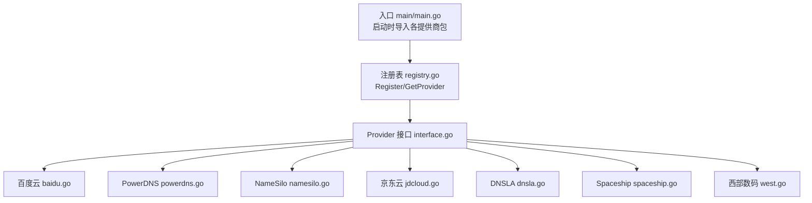
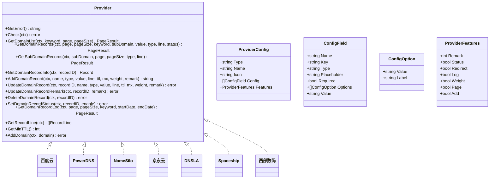
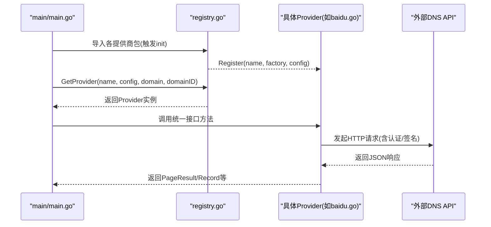

# 其他DNS服务商

<cite>
**本文引用的文件**
- [main.go](file://main/main.go)
- [interface.go](file://main/internal/dns/interface.go)
- [registry.go](file://main/internal/dns/registry.go)
- [baidu.go](file://main/internal/dns/providers/baidu/baidu.go)
- [powerdns.go](file://main/internal/dns/providers/powerdns/powerdns.go)
- [namesilo.go](file://main/internal/dns/providers/namesilo/namesilo.go)
- [jdcloud.go](file://main/internal/dns/providers/jdcloud/jdcloud.go)
- [dnsla.go](file://main/internal/dns/providers/dnsla/dnsla.go)
- [spaceship.go](file://main/internal/dns/providers/spaceship/spaceship.go)
- [west.go](file://main/internal/dns/providers/west/west.go)
</cite>

## 目录
1. [简介](#简介)
2. [项目结构](#项目结构)
3. [核心组件](#核心组件)
4. [架构总览](#架构总览)
5. [详细组件分析](#详细组件分析)
6. [依赖关系分析](#依赖关系分析)
7. [性能考量](#性能考量)
8. [故障排查指南](#故障排查指南)
9. [结论](#结论)
10. [附录](#附录)

## 简介
本文件面向需要对接多家第三方DNS服务商的开发者，基于仓库中的DNS适配层，系统性梳理百度云DNS、PowerDNS、NameSilo、京东云DNS、DNSLA、Spaceship、西部数码等服务商的API集成实现。内容涵盖：
- 认证方式与API特点
- 功能支持与限制条件
- 配置参数对比与选择建议
- 典型集成模式与通用适配器设计
- 性能与价格差异的实践建议
- 常见问题与最佳实践

## 项目结构
DNS适配层采用“统一接口 + 工厂注册 + 多实现”的架构：
- 统一接口定义：Provider接口与数据模型
- 服务发现与注册：通过注册表按名称获取具体实现
- 多实现：各DNS服务商独立实现，遵循统一接口

图表来源
- [main.go:25-39](file://main/main.go#L25-L39)
- [registry.go:17-37](file://main/internal/dns/registry.go#L17-L37)
- [interface.go:40-86](file://main/internal/dns/interface.go#L40-L86)

章节来源
- [main.go:25-39](file://main/main.go#L25-L39)
- [registry.go:17-37](file://main/internal/dns/registry.go#L17-L37)
- [interface.go:40-86](file://main/internal/dns/interface.go#L40-L86)

## 核心组件
- Provider接口：定义域名与记录的增删改查、状态控制、日志、线路、最小TTL、域名添加等能力
- ProviderConfig：描述每个服务商的UI配置项、特性开关（备注、状态、转发、日志、权重、分页、添加域名）
- 注册表：以名称为键，工厂函数与配置为值进行注册，运行时按名称获取实例

章节来源
- [interface.go:40-125](file://main/internal/dns/interface.go#L40-L125)
- [registry.go:17-56](file://main/internal/dns/registry.go#L17-L56)

## 架构总览
统一适配器设计要点：
- 统一的数据模型：Record、DomainInfo、RecordLine、PageResult
- 统一的Provider接口：屏蔽各服务商差异
- 统一的注册机制：init中注册，main启动时自动生效
- 统一的特性开关：通过Features描述能力边界，前端据此渲染

图表来源
- [interface.go:40-125](file://main/internal/dns/interface.go#L40-L125)
- [registry.go:17-37](file://main/internal/dns/registry.go#L17-L37)

## 详细组件分析

### 百度云DNS
- 认证方式：AK/SK签名，使用自定义签名算法与Authorization头
- API特点：
  - 支持域名列表、记录列表、增删改查、状态切换、线路枚举、最小TTL、添加域名
  - 不支持单独修改备注、不支持查看解析日志
- 限制条件：
  - 客户端侧过滤（如按子域、关键字、类型、状态）
  - 线路ID需映射到服务商约定值
- 配置参数：AccessKeyId、SecretAccessKey、是否使用代理
- 最小TTL：60秒

章节来源
- [baidu.go:22-39](file://main/internal/dns/providers/baidu/baidu.go#L22-L39)
- [baidu.go:128-145](file://main/internal/dns/providers/baidu/baidu.go#L128-L145)
- [baidu.go:239-242](file://main/internal/dns/providers/baidu/baidu.go#L239-L242)
- [baidu.go:273-369](file://main/internal/dns/providers/baidu/baidu.go#L273-L369)
- [baidu.go:419-444](file://main/internal/dns/providers/baidu/baidu.go#L419-L444)
- [baidu.go:446-464](file://main/internal/dns/providers/baidu/baidu.go#L446-L464)
- [baidu.go:466-468](file://main/internal/dns/providers/baidu/baidu.go#L466-L468)
- [baidu.go:470-474](file://main/internal/dns/providers/baidu/baidu.go#L470-L474)
- [baidu.go:476-487](file://main/internal/dns/providers/baidu/baidu.go#L476-L487)
- [baidu.go:489-491](file://main/internal/dns/providers/baidu/baidu.go#L489-L491)
- [baidu.go:493-502](file://main/internal/dns/providers/baidu/baidu.go#L493-L502)
- [baidu.go:504-506](file://main/internal/dns/providers/baidu/baidu.go#L504-L506)
- [baidu.go:508-515](file://main/internal/dns/providers/baidu/baidu.go#L508-L515)

### PowerDNS
- 认证方式：HTTP API + X-API-Key头
- API特点：
  - 支持域名列表、记录列表、增删改查、状态切换、最小TTL、添加域名
  - 不支持获取单条记录、不支持查看解析日志
  - 记录更新采用RR集替换策略，内部维护缓存
- 限制条件：
  - 客户端侧过滤
  - MX/TXT/CNAME/MX特殊处理
- 配置参数：IP地址、端口、API KEY、是否使用代理
- 最小TTL：60秒

章节来源
- [powerdns.go:17-35](file://main/internal/dns/providers/powerdns/powerdns.go#L17-L35)
- [powerdns.go:88-140](file://main/internal/dns/providers/powerdns/powerdns.go#L88-L140)
- [powerdns.go:142-145](file://main/internal/dns/providers/powerdns/powerdns.go#L142-L145)
- [powerdns.go:170-247](file://main/internal/dns/providers/powerdns/powerdns.go#L170-L247)
- [powerdns.go:249-341](file://main/internal/dns/providers/powerdns/powerdns.go#L249-L341)
- [powerdns.go:351-385](file://main/internal/dns/providers/powerdns/powerdns.go#L351-L385)
- [powerdns.go:414-450](file://main/internal/dns/providers/powerdns/powerdns.go#L414-L450)
- [powerdns.go:452-517](file://main/internal/dns/providers/powerdns/powerdns.go#L452-L517)
- [powerdns.go:523-561](file://main/internal/dns/providers/powerdns/powerdns.go#L523-L561)
- [powerdns.go:563-599](file://main/internal/dns/providers/powerdns/powerdns.go#L563-L599)
- [powerdns.go:601-603](file://main/internal/dns/providers/powerdns/powerdns.go#L601-L603)
- [powerdns.go:605-609](file://main/internal/dns/providers/powerdns/powerdns.go#L605-L609)
- [powerdns.go:611-613](file://main/internal/dns/providers/powerdns/powerdns.go#L611-L613)
- [powerdns.go:615-626](file://main/internal/dns/providers/powerdns/powerdns.go#L615-L626)

### NameSilo
- 认证方式：GET查询参数携带API Key
- API特点：
  - 支持域名列表、记录列表、增删改查、最小TTL
  - 不支持获取单条记录、不支持设置记录状态、不支持查看解析日志、不支持添加域名
- 限制条件：
  - 客户端侧过滤
  - MX优先级使用distance字段
- 配置参数：账户名、API Key、是否使用代理
- 最小TTL：3600秒

章节来源
- [namesilo.go:16-33](file://main/internal/dns/providers/namesilo/namesilo.go#L16-L33)
- [namesilo.go:58-107](file://main/internal/dns/providers/namesilo/namesilo.go#L58-L107)
- [namesilo.go:109-112](file://main/internal/dns/providers/namesilo/namesilo.go#L109-L112)
- [namesilo.go:114-148](file://main/internal/dns/providers/namesilo/namesilo.go#L114-L148)
- [namesilo.go:150-229](file://main/internal/dns/providers/namesilo/namesilo.go#L150-L229)
- [namesilo.go:235-237](file://main/internal/dns/providers/namesilo/namesilo.go#L235-L237)
- [namesilo.go:239-266](file://main/internal/dns/providers/namesilo/namesilo.go#L239-L266)
- [namesilo.go:268-288](file://main/internal/dns/providers/namesilo/namesilo.go#L268-L288)
- [namesilo.go:294-302](file://main/internal/dns/providers/namesilo/namesilo.go#L294-L302)
- [namesilo.go:304-306](file://main/internal/dns/providers/namesilo/namesilo.go#L304-L306)
- [namesilo.go:308-310](file://main/internal/dns/providers/namesilo/namesilo.go#L308-L310)
- [namesilo.go:312-316](file://main/internal/dns/providers/namesilo/namesilo.go#L312-L316)
- [namesilo.go:318-320](file://main/internal/dns/providers/namesilo/namesilo.go#L318-L320)
- [namesilo.go:322-324](file://main/internal/dns/providers/namesilo/namesilo.go#L322-L324)

### 京东云DNS
- 认证方式：JDCLOUD2-HMAC-SHA256签名，Authorization头
- API特点：
  - 支持域名列表、记录列表、增删改查、状态切换、线路枚举、最小TTL、添加域名
  - 不支持查看解析日志
- 限制条件：
  - 线路ID映射为数字视图值
  - 客户端侧过滤（子域、类型、值）
- 配置参数：AccessKey、SecretKey、是否使用代理
- 最小TTL：600秒

章节来源
- [jdcloud.go:20-37](file://main/internal/dns/providers/jdcloud/jdcloud.go#L20-L37)
- [jdcloud.go:82-121](file://main/internal/dns/providers/jdcloud/jdcloud.go#L82-L121)
- [jdcloud.go:123-177](file://main/internal/dns/providers/jdcloud/jdcloud.go#L123-L177)
- [jdcloud.go:179-182](file://main/internal/dns/providers/jdcloud/jdcloud.go#L179-L182)
- [jdcloud.go:184-217](file://main/internal/dns/providers/jdcloud/jdcloud.go#L184-L217)
- [jdcloud.go:219-263](file://main/internal/dns/providers/jdcloud/jdcloud.go#L219-L263)
- [jdcloud.go:269-285](file://main/internal/dns/providers/jdcloud/jdcloud.go#L269-L285)
- [jdcloud.go:287-315](file://main/internal/dns/providers/jdcloud/jdcloud.go#L287-L315)
- [jdcloud.go:317-333](file://main/internal/dns/providers/jdcloud/jdcloud.go#L317-L333)
- [jdcloud.go:339-343](file://main/internal/dns/providers/jdcloud/jdcloud.go#L339-L343)
- [jdcloud.go:345-353](file://main/internal/dns/providers/jdcloud/jdcloud.go#L345-L353)
- [jdcloud.go:355-357](file://main/internal/dns/providers/jdcloud/jdcloud.go#L355-L357)
- [jdcloud.go:359-367](file://main/internal/dns/providers/jdcloud/jdcloud.go#L359-L367)
- [jdcloud.go:369-371](file://main/internal/dns/providers/jdcloud/jdcloud.go#L369-L371)
- [jdcloud.go:373-380](file://main/internal/dns/providers/jdcloud/jdcloud.go#L373-L380)

### DNSLA
- 认证方式：Basic认证（APIID:APISecret），Authorization头
- API特点：
  - 支持域名列表、记录列表、增删改查、状态切换、权重、线路枚举、最小TTL、添加域名
  - 支持URL转发（主/备两种模式）
  - 不支持查看解析日志
- 限制条件：
  - 类型ID与名称双向映射
  - 客户端侧过滤
- 配置参数：APIID、API密钥、是否使用代理
- 最小TTL：60秒

章节来源
- [dnsla.go:18-35](file://main/internal/dns/providers/dnsla/dnsla.go#L18-L35)
- [dnsla.go:73-162](file://main/internal/dns/providers/dnsla/dnsla.go#L73-L162)
- [dnsla.go:164-167](file://main/internal/dns/providers/dnsla/dnsla.go#L164-L167)
- [dnsla.go:169-197](file://main/internal/dns/providers/dnsla/dnsla.go#L169-L197)
- [dnsla.go:212-283](file://main/internal/dns/providers/dnsla/dnsla.go#L212-L283)
- [dnsla.go:292-294](file://main/internal/dns/providers/dnsla/dnsla.go#L292-L294)
- [dnsla.go:296-329](file://main/internal/dns/providers/dnsla/dnsla.go#L296-L329)
- [dnsla.go:331-357](file://main/internal/dns/providers/dnsla/dnsla.go#L331-L357)
- [dnsla.go:363-368](file://main/internal/dns/providers/dnsla/dnsla.go#L363-L368)
- [dnsla.go:370-377](file://main/internal/dns/providers/dnsla/dnsla.go#L370-L377)
- [dnsla.go:379-381](file://main/internal/dns/providers/dnsla/dnsla.go#L379-L381)
- [dnsla.go:383-407](file://main/internal/dns/providers/dnsla/dnsla.go#L383-L407)
- [dnsla.go:409-411](file://main/internal/dns/providers/dnsla/dnsla.go#L409-L411)
- [dnsla.go:413-417](file://main/internal/dns/providers/dnsla/dnsla.go#L413-L417)

### Spaceship
- 认证方式：X-API-Key + X-API-Secret双头
- API特点：
  - 支持域名列表、记录列表、增删改查、最小TTL
  - 不支持获取单条记录、不支持设置记录状态、不支持查看解析日志、不支持添加域名
- 限制条件：
  - 记录ID由类型+名称+地址+MX拼接而成，便于本地解析
  - MX/TXT/CNAME/NS/PTR/CAA/SRV/ALIAS等字段映射
- 配置参数：API Key、API Secret、是否使用代理
- 最小TTL：60秒

章节来源
- [spaceship.go:21-45](file://main/internal/dns/providers/spaceship/spaceship.go#L21-L45)
- [spaceship.go:346-399](file://main/internal/dns/providers/spaceship/spaceship.go#L346-L399)
- [spaceship.go:73-76](file://main/internal/dns/providers/spaceship/spaceship.go#L73-L76)
- [spaceship.go:78-109](file://main/internal/dns/providers/spaceship/spaceship.go#L78-L109)
- [spaceship.go:111-199](file://main/internal/dns/providers/spaceship/spaceship.go#L111-L199)
- [spaceship.go:208-228](file://main/internal/dns/providers/spaceship/spaceship.go#L208-L228)
- [spaceship.go:230-243](file://main/internal/dns/providers/spaceship/spaceship.go#L230-L243)
- [spaceship.go:245-255](file://main/internal/dns/providers/spaceship/spaceship.go#L245-L255)
- [spaceship.go:261-280](file://main/internal/dns/providers/spaceship/spaceship.go#L261-L280)
- [spaceship.go:282-284](file://main/internal/dns/providers/spaceship/spaceship.go#L282-L284)
- [spaceship.go:286-288](file://main/internal/dns/providers/spaceship/spaceship.go#L286-L288)
- [spaceship.go:290-292](file://main/internal/dns/providers/spaceship/spaceship.go#L290-L292)
- [spaceship.go:294-296](file://main/internal/dns/providers/spaceship/spaceship.go#L294-L296)
- [spaceship.go:298-300](file://main/internal/dns/providers/spaceship/spaceship.go#L298-L300)

### 西部数码
- 认证方式：MD5(username+api_password+timestamp) token，GBK响应转UTF-8
- API特点：
  - 支持域名列表、记录列表、增删改查、状态切换、线路枚举、最小TTL
  - 不支持获取单条记录、不支持查看解析日志、不支持添加域名
- 限制条件：
  - 线路ID为中文标识，需映射
  - 客户端侧过滤
- 配置参数：用户名、API密码、是否使用代理
- 最小TTL：600秒

章节来源
- [west.go:22-39](file://main/internal/dns/providers/west/west.go#L22-L39)
- [west.go:68-126](file://main/internal/dns/providers/west/west.go#L68-L126)
- [west.go:128-131](file://main/internal/dns/providers/west/west.go#L128-L131)
- [west.go:133-162](file://main/internal/dns/providers/west/west.go#L133-L162)
- [west.go:164-222](file://main/internal/dns/providers/west/west.go#L164-L222)
- [west.go:231-233](file://main/internal/dns/providers/west/west.go#L231-L233)
- [west.go:235-263](file://main/internal/dns/providers/west/west.go#L235-L263)
- [west.go:265-279](file://main/internal/dns/providers/west/west.go#L265-L279)
- [west.go:285-294](file://main/internal/dns/providers/west/west.go#L285-L294)
- [west.go:296-310](file://main/internal/dns/providers/west/west.go#L296-L310)
- [west.go:312-314](file://main/internal/dns/providers/west/west.go#L312-L314)
- [west.go:316-326](file://main/internal/dns/providers/west/west.go#L316-L326)
- [west.go:328-330](file://main/internal/dns/providers/west/west.go#L328-L330)
- [west.go:332-334](file://main/internal/dns/providers/west/west.go#L332-L334)

## 依赖关系分析
- 启动期注册：main启动时导入各提供商包，触发init完成注册
- 运行期调用：通过注册表按名称获取Provider实例，再调用统一接口方法
- 线路映射：注册表内置部分服务商默认线路映射，便于跨平台一致性

图表来源
- [main.go:25-39](file://main/main.go#L25-L39)
- [registry.go:17-37](file://main/internal/dns/registry.go#L17-L37)
- [baidu.go:22-39](file://main/internal/dns/providers/baidu/baidu.go#L22-L39)

章节来源
- [main.go:25-39](file://main/main.go#L25-L39)
- [registry.go:17-37](file://main/internal/dns/registry.go#L17-L37)

## 性能考量
- 分页策略
  - 百度云、NameSilo、DNSLA、京东云、西部数码均支持服务端分页或可由客户端模拟分页
  - PowerDNS、Spaceship明确支持分页；NameSilo、DNSLA、京东云、西部数码在实现中体现分页逻辑
- 缓存与一致性
  - PowerDNS对RR集进行缓存，更新后主动失效缓存，避免频繁拉取
- 最小TTL
  - 不同服务商最小TTL差异较大，影响解析收敛速度与成本
- 网络与代理
  - 各实现均支持可选代理，便于内网或合规场景

章节来源
- [powerdns.go:170-176](file://main/internal/dns/providers/powerdns/powerdns.go#L170-L176)
- [powerdns.go:380-384](file://main/internal/dns/providers/powerdns/powerdns.go#L380-L384)
- [baidu.go:35](file://main/internal/dns/providers/baidu/baidu.go#L35)
- [namesilo.go:29](file://main/internal/dns/providers/namesilo/namesilo.go#L29)
- [dnsla.go:32](file://main/internal/dns/providers/dnsla/dnsla.go#L32)
- [jdcloud.go:34](file://main/internal/dns/providers/jdcloud/jdcloud.go#L34)
- [west.go:36](file://main/internal/dns/providers/west/west.go#L36)

## 故障排查指南
- 常见错误来源
  - 认证失败/签名错误：检查AK/SK、APIID/API密钥、签名算法参数
  - 参数不合法：MX优先级、TTL范围、线路ID映射
  - 服务端返回错误：读取Provider.GetError()获取最近错误消息
- 建议排查步骤
  - 使用Check方法快速验证账号可用性
  - 打印请求URL与参数，确认编码与必填项
  - 对比Features特性开关，确认目标操作是否受支持
  - 关注最小TTL限制，避免因过低TTL导致失败

章节来源
- [interface.go:42-46](file://main/internal/dns/interface.go#L42-L46)
- [baidu.go:64](file://main/internal/dns/providers/baidu/baidu.go#L64)
- [powerdns.go:84](file://main/internal/dns/providers/powerdns/powerdns.go#L84)
- [namesilo.go:54](file://main/internal/dns/providers/namesilo/namesilo.go#L54)
- [jdcloud.go:66](file://main/internal/dns/providers/jdcloud/jdcloud.go#L66)
- [dnsla.go:69](file://main/internal/dns/providers/dnsla/dnsla.go#L69)
- [spaceship.go:69](file://main/internal/dns/providers/spaceship/spaceship.go#L69)
- [west.go:64](file://main/internal/dns/providers/west/west.go#L64)

## 结论
该适配层通过统一接口与注册机制，将多家DNS服务商的差异化API抽象为一致的调用体验。在实际接入时，应重点关注：
- 认证与签名方式的正确实现
- 线路ID与字段映射的准确性
- 功能特性开关与业务需求匹配
- 最小TTL与性能/成本平衡
- 客户端过滤与服务端分页的取舍

## 附录

### 配置参数对比与选择建议
- 百度云：适合国内合规要求，支持线路与状态管理，但不支持日志与备注单独修改
- PowerDNS：适合自建权威/递归场景，支持状态切换与最小TTL，注意RR集替换策略
- NameSilo：适合简单解析场景，不支持状态与日志，适合轻量运维
- 京东云：企业级能力较全，支持线路与状态，最小TTL较高
- DNSLA：支持权重与URL转发，适合CDN/加速场景
- Spaceship：适合特定生态，不支持状态与日志，适合固定模板化管理
- 西部数码：国内主流服务商之一，支持线路与状态，最小TTL较高

章节来源
- [baidu.go:27-38](file://main/internal/dns/providers/baidu/baidu.go#L27-L38)
- [powerdns.go:31-34](file://main/internal/dns/providers/powerdns/powerdns.go#L31-L34)
- [namesilo.go:29](file://main/internal/dns/providers/namesilo/namesilo.go#L29)
- [jdcloud.go:33-36](file://main/internal/dns/providers/jdcloud/jdcloud.go#L33-L36)
- [dnsla.go:31-34](file://main/internal/dns/providers/dnsla/dnsla.go#L31-L34)
- [spaceship.go:35](file://main/internal/dns/providers/spaceship/spaceship.go#L35)
- [west.go:35](file://main/internal/dns/providers/west/west.go#L35)