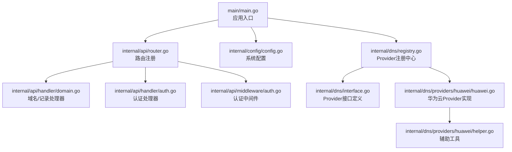
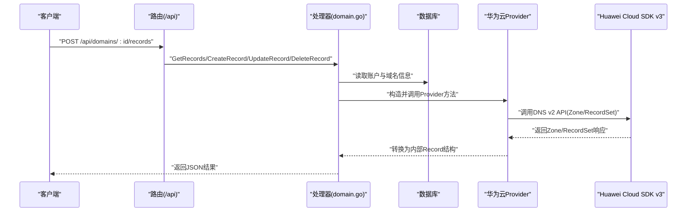
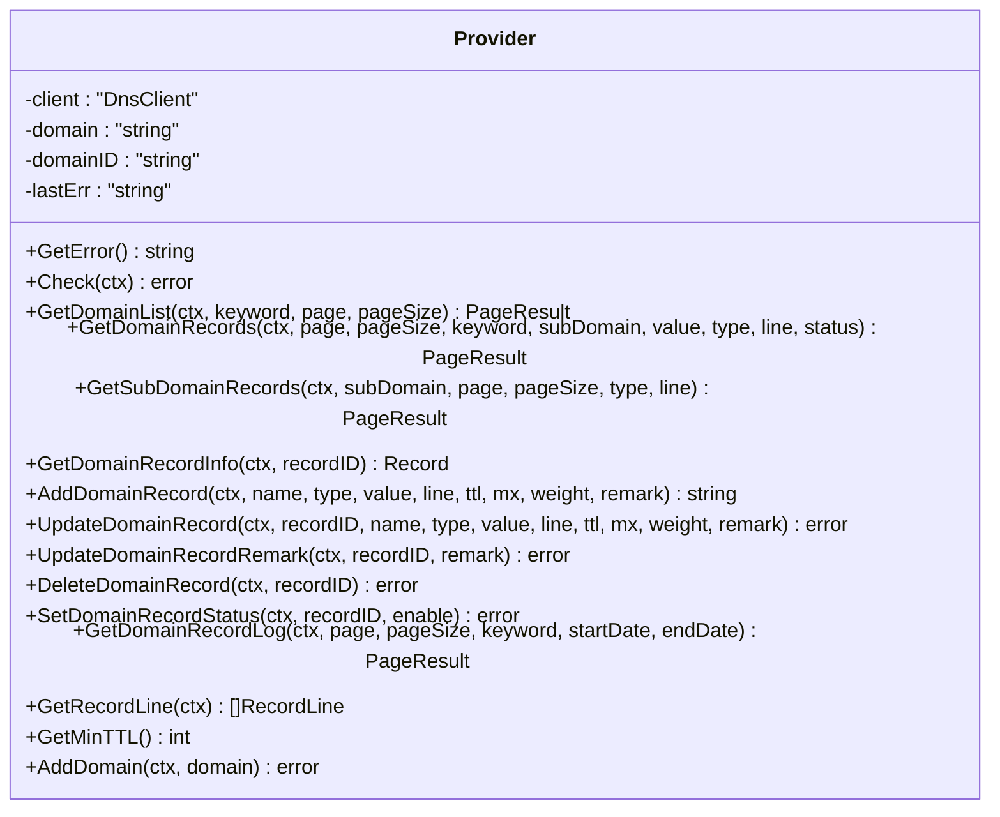
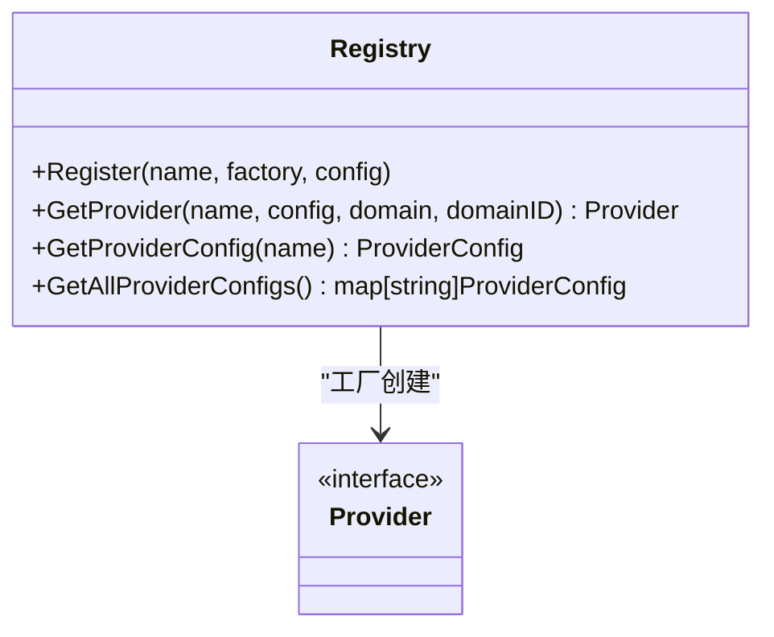
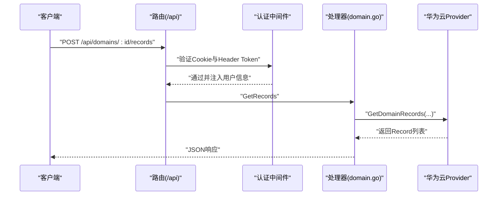
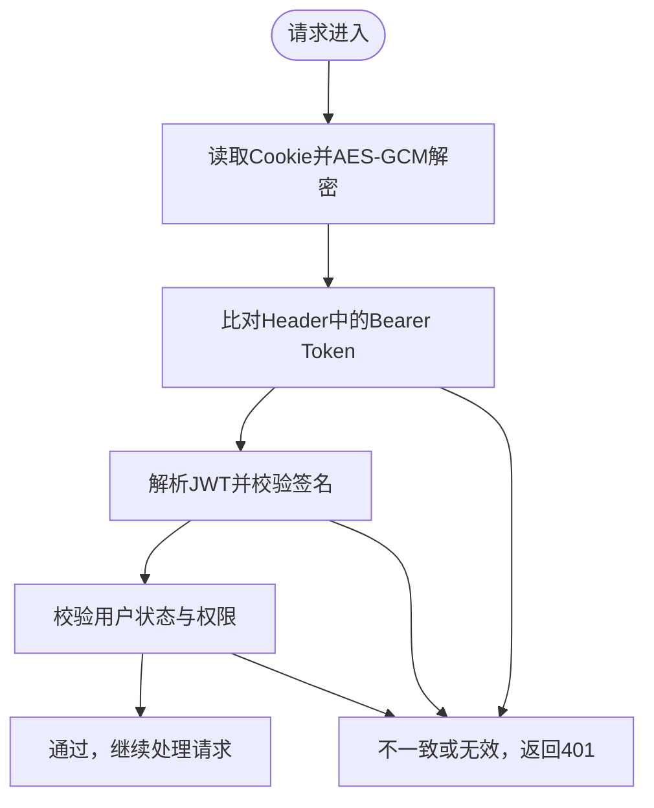
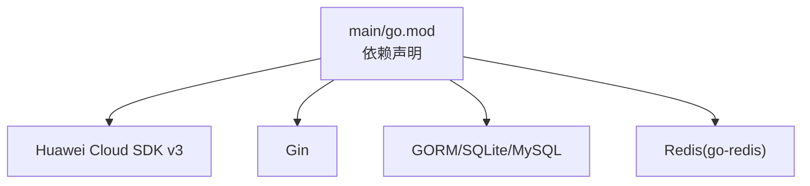

# 华为云DNS

<cite>
**本文档引用的文件**
- [main.go](file://main/main.go)
- [go.mod](file://main/go.mod)
- [huawei.go](file://main/internal/dns/providers/huawei/huawei.go)
- [helper.go](file://main/internal/dns/providers/huawei/helper.go)
- [interface.go](file://main/internal/dns/interface.go)
- [registry.go](file://main/internal/dns/registry.go)
- [config.go](file://main/internal/config/config.go)
- [router.go](file://main/internal/api/router.go)
- [domain.go](file://main/internal/api/handler/domain.go)
- [auth.go](file://main/internal/api/handler/auth.go)
- [auth_middleware.go](file://main/internal/api/middleware/auth.go)
</cite>

## 目录
1. [简介](#简介)
2. [项目结构](#项目结构)
3. [核心组件](#核心组件)
4. [架构总览](#架构总览)
5. [详细组件分析](#详细组件分析)
6. [依赖分析](#依赖分析)
7. [性能考虑](#性能考虑)
8. [故障排查指南](#故障排查指南)
9. [结论](#结论)
10. [附录](#附录)

## 简介
本文件面向华为云DNS服务的集成实现，基于仓库中的代码，系统性梳理AK/SK认证机制、请求签名与API版本管理、域名与解析记录的管理流程、配置参数与认证设置、批量操作与异步任务处理，以及华为云DNS的特色能力（如全局负载均衡、智能路由等）。文档同时提供架构图与流程图，帮助开发者快速理解与扩展。

## 项目结构
项目采用Go模块化组织，后端以Gin框架提供REST API，DNS适配层抽象为Provider接口，华为云实现位于huawei子包。主要目录与职责如下：
- main：应用入口与配置加载
- internal/dns：DNS抽象层与注册中心
- internal/dns/providers/huawei：华为云Provider实现
- internal/api：路由与处理器
- internal/api/middleware：认证、日志、CORS等中间件
- internal/config：系统配置定义与加载
- web：前端静态资源（由后端嵌入）

**图表来源**
- [main.go:52-148](file://main/main.go#L52-L148)
- [router.go:14-279](file://main/internal/api/router.go#L14-L279)
- [domain.go:1-800](file://main/internal/api/handler/domain.go#L1-L800)
- [auth.go:67-161](file://main/internal/api/handler/auth.go#L67-L161)
- [auth_middleware.go:124-199](file://main/internal/api/middleware/auth.go#L124-L199)
- [config.go:82-161](file://main/internal/config/config.go#L82-L161)
- [registry.go:17-65](file://main/internal/dns/registry.go#L17-L65)
- [interface.go:40-125](file://main/internal/dns/interface.go#L40-L125)
- [huawei.go:15-54](file://main/internal/dns/providers/huawei/huawei.go#L15-L54)
- [helper.go:3-6](file://main/internal/dns/providers/huawei/helper.go#L3-L6)

**章节来源**
- [main.go:52-148](file://main/main.go#L52-L148)
- [router.go:14-279](file://main/internal/api/router.go#L14-L279)

## 核心组件
- Provider接口与注册中心：统一抽象不同DNS服务商的能力，支持动态注册与获取。
- 华为云Provider：基于Huawei Cloud SDK v3实现AK/SK认证与Zone/RecordSet操作。
- API处理器：封装域名与记录的增删改查、批量操作、权限控制与分页。
- 认证中间件：基于JWT与HttpOnly Cookie的双因子验证，支持短期访问令牌与长期刷新令牌。
- 配置系统：集中管理服务器、数据库、JWT、Redis等配置项。

**章节来源**
- [interface.go:40-125](file://main/internal/dns/interface.go#L40-L125)
- [registry.go:17-65](file://main/internal/dns/registry.go#L17-L65)
- [huawei.go:15-54](file://main/internal/dns/providers/huawei/huawei.go#L15-L54)
- [domain.go:26-43](file://main/internal/api/handler/domain.go#L26-L43)
- [auth_middleware.go:124-199](file://main/internal/api/middleware/auth.go#L124-L199)

## 架构总览
下图展示了从HTTP请求到华为云DNS API的调用链路，以及认证与Provider解耦的设计。

**图表来源**
- [router.go:64-74](file://main/internal/api/router.go#L64-L74)
- [domain.go:548-728](file://main/internal/api/handler/domain.go#L548-L728)
- [huawei.go:112-210](file://main/internal/dns/providers/huawei/huawei.go#L112-L210)

## 详细组件分析

### 华为云Provider实现
- 认证机制：使用AK/SK构建Basic Credentials，并指定区域（示例为CN_NORTH_1），通过SDK v3客户端发起请求。
- Zone管理：通过ListPublicZones获取域名列表，解析Zone元数据并映射为内部DomainInfo。
- RecordSet管理：支持按Zone查询RecordSets、按条件筛选、获取单条记录、创建/更新/删除RecordSet。
- 线路与TTL：提供线路枚举与最小TTL查询；部分能力（如权重、状态开关、日志）在华为云上不可用或未实现。
- 辅助工具：提供int32指针构造辅助函数，简化SDK请求体构造。

**图表来源**
- [huawei.go:30-395](file://main/internal/dns/providers/huawei/huawei.go#L30-L395)
- [interface.go:40-86](file://main/internal/dns/interface.go#L40-L86)

**章节来源**
- [huawei.go:15-54](file://main/internal/dns/providers/huawei/huawei.go#L15-L54)
- [huawei.go:65-101](file://main/internal/dns/providers/huawei/huawei.go#L65-L101)
- [huawei.go:112-210](file://main/internal/dns/providers/huawei/huawei.go#L112-L210)
- [huawei.go:277-359](file://main/internal/dns/providers/huawei/huawei.go#L277-L359)
- [huawei.go:369-382](file://main/internal/dns/providers/huawei/huawei.go#L369-L382)
- [helper.go:3-6](file://main/internal/dns/providers/huawei/helper.go#L3-L6)

### Provider接口与注册中心
- Provider接口：统一定义域名/记录查询、创建、更新、删除、状态控制、日志、线路、TTL与添加域名等能力。
- 注册中心：提供Register、GetProvider、GetProviderConfig等方法，支持并发安全的Provider工厂注册与获取。
- 默认线路映射：包含huawei在内的多厂商默认线路映射表，便于前端展示与选择。

**图表来源**
- [registry.go:17-65](file://main/internal/dns/registry.go#L17-L65)
- [interface.go:40-125](file://main/internal/dns/interface.go#L40-L125)

**章节来源**
- [registry.go:17-65](file://main/internal/dns/registry.go#L17-L65)
- [interface.go:40-125](file://main/internal/dns/interface.go#L40-L125)

### API路由与处理器
- 路由设计：/api前缀下的认证路由与业务路由分离，统一接入CORS与请求追踪中间件。
- 域名与记录：提供域名列表、详情、同步、增删改、批量操作、线路查询等接口。
- 认证流程：登录、登出、TOTP、密码/TOTP重置等，均通过中间件完成JWT签发与Cookie设置。

**图表来源**
- [router.go:41-163](file://main/internal/api/router.go#L41-L163)
- [auth_middleware.go:124-199](file://main/internal/api/middleware/auth.go#L124-L199)
- [domain.go:548-728](file://main/internal/api/handler/domain.go#L548-L728)

**章节来源**
- [router.go:14-279](file://main/internal/api/router.go#L14-L279)
- [domain.go:548-728](file://main/internal/api/handler/domain.go#L548-L728)
- [auth.go:67-161](file://main/internal/api/handler/auth.go#L67-L161)

### 认证与安全中间件
- 双因子验证：HttpOnly Cookie存储加密后的AccessToken，Header携带Bearer Token，双重校验。
- JWT策略：短期AccessToken（15分钟）、长期RefreshToken（7天），支持JTI轮转与重放防护。
- CORS与安全头：严格限制Origin来源，设置安全响应头，降低CSRF与XSS风险。

**图表来源**
- [auth_middleware.go:124-199](file://main/internal/api/middleware/auth.go#L124-L199)
- [auth_middleware.go:295-310](file://main/internal/api/middleware/auth.go#L295-L310)

**章节来源**
- [auth_middleware.go:124-199](file://main/internal/api/middleware/auth.go#L124-L199)
- [auth_middleware.go:295-310](file://main/internal/api/middleware/auth.go#L295-L310)

### 配置参数与认证设置
- 系统配置：服务器监听、数据库驱动与路径、JWT密钥与过期时间、Redis连接参数、日志清理策略等。
- 华为云账户配置：需提供AccessKeyId与SecretAccessKey；Provider注册时声明为必填字段。
- 区域与版本：Provider中固定区域示例为CN_NORTH_1；SDK版本在go.mod中声明为v0.1.191。

**章节来源**
- [config.go:82-161](file://main/internal/config/config.go#L82-L161)
- [huawei.go:15-28](file://main/internal/dns/providers/huawei/huawei.go#L15-L28)
- [go.mod:13](file://main/go.mod#L13)

### 批量操作与异步任务
- 批量接口：提供批量新增、编辑、动作执行等路由，处理器中对子域名权限进行过滤与合并查询。
- 异步处理：记录创建接口采用异步模式，立即返回，后台执行具体任务，提升用户体验。

**章节来源**
- [router.go:71-74](file://main/internal/api/router.go#L71-L74)
- [domain.go:768-800](file://main/internal/api/handler/domain.go#L768-L800)

### 华为云DNS特色能力
- 全局负载均衡与智能路由：通过线路枚举（如default_view、Dianxin、Liantong、Yidong、Abroad）实现按运营商/地区分流。
- TTL与权重：支持最小TTL查询与权重字段（Feature中Weight为true），但具体权重设置在华为云Provider中未启用。
- 日志与状态：华为云Provider明确不支持查看解析日志与设置记录状态。

**章节来源**
- [huawei.go:369-382](file://main/internal/dns/providers/huawei/huawei.go#L369-L382)
- [huawei.go:361-367](file://main/internal/dns/providers/huawei/huawei.go#L361-L367)

## 依赖分析
- 外部SDK：Huawei Cloud SDK v3用于DNS v2 API调用。
- Web框架：Gin提供路由与中间件能力。
- 数据库：SQLite/MySQL驱动，配合GORM使用。
- 缓存：Redis可选，用于会话与用户信息缓存。

**图表来源**
- [go.mod:5-28](file://main/go.mod#L5-L28)

**章节来源**
- [go.mod:5-28](file://main/go.mod#L5-L28)

## 性能考虑
- 并发安全：Provider注册中心使用读写锁，保障高并发下的注册与获取稳定性。
- 缓存策略：认证用户信息缓存（约30秒TTL），减少数据库往返。
- 分页与筛选：API层对子域名权限进行合并查询与本地筛选，避免重复网络请求。
- 超时控制：Provider调用超时设置为30秒，避免阻塞。

[本节为通用性能讨论，无需特定文件来源]

## 故障排查指南
- 登录失败：检查验证码开关、用户状态、TOTP配置与密码哈希。
- 认证失败：确认Cookie是否正确加密、Header Bearer Token与Cookie一致、JWT签名与密钥匹配。
- 华为云调用异常：核对AK/SK、区域配置、网络连通性与SDK版本；查看Provider错误信息。
- 权限不足：确认用户级别与域名/子域名权限，检查处理器中的权限校验逻辑。

**章节来源**
- [auth.go:67-161](file://main/internal/api/handler/auth.go#L67-L161)
- [auth_middleware.go:124-199](file://main/internal/api/middleware/auth.go#L124-L199)
- [huawei.go:56-58](file://main/internal/dns/providers/huawei/huawei.go#L56-L58)
- [domain.go:569-578](file://main/internal/api/handler/domain.go#L569-L578)

## 结论
本实现以Provider接口抽象DNS能力，华为云通过SDK v3完成AK/SK认证与Zone/RecordSet操作。API层提供完善的路由与中间件，覆盖认证、权限、日志与CORS等关键安全与可用性需求。批量与异步处理提升了用户体验，线路与TTL能力满足基础负载均衡与智能路由场景。对于不支持的功能（如记录状态设置与日志查看），已在Provider中明确标注。

[本节为总结性内容，无需特定文件来源]

## 附录

### 常见业务场景API调用示例（路径指引）
- 获取域名列表：POST /api/domains
- 获取域名记录：POST /api/domains/:id/records
- 新增解析记录：POST /api/domains/:id/records
- 更新解析记录：PUT /api/domains/:id/records/:recordId
- 删除解析记录：DELETE /api/domains/:id/records/:recordId
- 批量新增记录：POST /api/domains/:id/records/batch
- 批量编辑记录：PUT /api/domains/:id/records/batch
- 批量执行动作：POST /api/domains/:id/records/batch/action
- 获取解析线路：GET /api/domains/:id/lines

**章节来源**
- [router.go:55-74](file://main/internal/api/router.go#L55-L74)

### 配置参数说明（节选）
- 服务器配置：host/port/mode/base_url
- 数据库配置：driver/host/port/username/password/database/file_path
- JWT配置：secret/expire_hour
- Redis配置：enable/addr/password/db/pool_size/min_idle_conns/key_prefix
- 日志清理：enable/success_keep_count/error_keep_count/cleanup_interval

**章节来源**
- [config.go:12-161](file://main/internal/config/config.go#L12-L161)