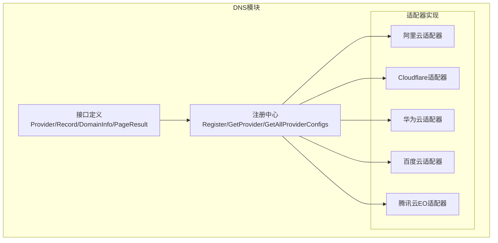
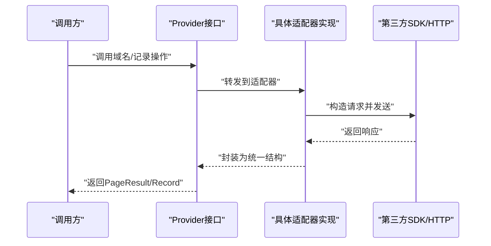
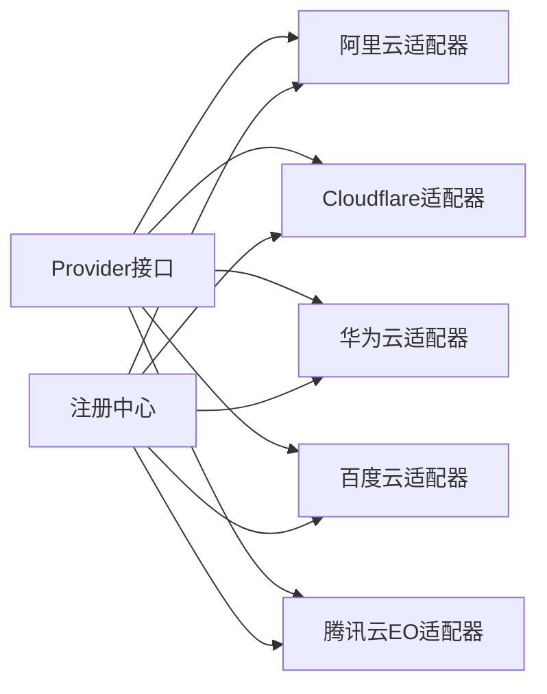

# 支持的DNS服务商

<cite>
**本文引用的文件**
- [README.md](file://README.md)
- [interface.go](file://main/internal/dns/interface.go)
- [registry.go](file://main/internal/dns/registry.go)
- [aliyun.go](file://main/internal/dns/providers/aliyun/aliyun.go)
- [cloudflare.go](file://main/internal/dns/providers/cloudflare/cloudflare.go)
- [huawei.go](file://main/internal/dns/providers/huawei/huawei.go)
- [baidu.go](file://main/internal/dns/providers/baidu/baidu.go)
- [tencenteo.go](file://main/internal/dns/providers/tencenteo/tencenteo.go)
</cite>

## 目录
1. [简介](#简介)
2. [项目结构](#项目结构)
3. [核心组件](#核心组件)
4. [架构总览](#架构总览)
5. [详细组件分析](#详细组件分析)
6. [依赖分析](#依赖分析)
7. [性能考虑](#性能考虑)
8. [故障排查指南](#故障排查指南)
9. [结论](#结论)
10. [附录](#附录)

## 简介
本文件面向已集成的DNS服务商，系统性梳理阿里云DNS、腾讯云DNS、Cloudflare、华为云DNS、百度云DNS等的实现细节，覆盖认证方式、API调用规范、错误处理机制、特色功能与限制、配置参数说明、使用示例、Rate Limiting与错误码处理策略，并给出不同服务商之间的功能差异与选型建议。

## 项目结构
DNS模块采用“接口 + 工厂 + 多适配器”的架构设计：
- 接口层定义统一的Provider能力集；
- 注册中心负责服务提供商的注册与检索；
- 各云厂商提供独立适配器，按需实现接口方法；
- 默认线路映射表用于跨平台线路ID的兼容转换。

图表来源
- [interface.go:40-86](file://main/internal/dns/interface.go#L40-L86)
- [registry.go:17-45](file://main/internal/dns/registry.go#L17-L45)

章节来源
- [README.md:98-108](file://README.md#L98-L108)
- [interface.go:1-125](file://main/internal/dns/interface.go#L1-L125)
- [registry.go:1-65](file://main/internal/dns/registry.go#L1-L65)

## 核心组件
- Provider接口：定义统一的DNS服务商操作能力，包括域名/记录查询、增删改、状态控制、日志、线路、最小TTL、域名添加等。
- ProviderConfig：描述服务商的显示名称、图标、配置字段、特性开关（备注、启用暂停、转发、日志、权重、分页、添加域名）。
- 注册中心：通过Register注册适配器工厂，GetProvider按类型构造实例，GetAllProviderConfigs返回可用服务商清单。
- 默认线路映射：提供跨平台线路ID的默认映射，便于UI与业务层统一处理。

章节来源
- [interface.go:40-125](file://main/internal/dns/interface.go#L40-L125)
- [registry.go:17-65](file://main/internal/dns/registry.go#L17-L65)

## 架构总览
下图展示DNS适配器的通用调用流程：上层通过Provider接口发起请求，适配器内部封装具体SDK或HTTP调用，统一返回PageResult或单条Record。

图表来源
- [interface.go:40-86](file://main/internal/dns/interface.go#L40-L86)
- [registry.go:25-37](file://main/internal/dns/registry.go#L25-L37)

## 详细组件分析

### 阿里云DNS（Aliyun）
- 认证方式：AccessKey（AccessKeyId + AccessKeySecret），初始化客户端时注入凭证。
- API调用规范：
  - 使用官方SDK进行请求封装，支持分页查询域名、记录、线路，支持按关键词、类型、子域名、状态筛选。
  - 支持记录备注更新、启用/停用、删除、最小TTL查询、添加域名等。
- 错误处理：适配器内部捕获SDK错误并缓存到lastErr，GetError可返回最近一次错误。
- 特色功能与限制：
  - 支持备注、启用暂停、日志、权重（接口声明为false）、分页（接口声明为false）、添加域名。
  - 最小TTL为固定值。
- 配置参数
  - AccessKeyId：必填
  - AccessKeySecret：必填
- 使用示例（步骤说明）
  - 在账户配置中填写AccessKeyId与AccessKeySecret。
  - 选择“阿里云”作为服务商类型，输入主域名与域名ID（若已存在）。
  - 通过Provider接口进行域名/记录查询与变更。
- Rate Limiting与错误码
  - 适配器未内置限流重试逻辑，错误通过SDK返回；建议结合业务侧重试与退避策略。
- 关键实现位置
  - 初始化与注册：[init/注册:14-27](file://main/internal/dns/providers/aliyun/aliyun.go#L14-L27)
  - 认证与客户端：[NewProvider:36-49](file://main/internal/dns/providers/aliyun/aliyun.go#L36-L49)
  - 域名/记录查询与变更：[GetDomainList/GetDomainRecords/Add/Update/Delete/SetStatus:63-281](file://main/internal/dns/providers/aliyun/aliyun.go#L63-L281)
  - 线路与最小TTL：[GetRecordLine/GetMinTTL:314-336](file://main/internal/dns/providers/aliyun/aliyun.go#L314-L336)

章节来源
- [aliyun.go:14-344](file://main/internal/dns/providers/aliyun/aliyun.go#L14-L344)

### Cloudflare
- 认证方式：支持两种模式
  - Global API Key：使用X-Auth-Email与X-Auth-Key头部。
  - API Token（Bearer）：使用Authorization: Bearer。
- API调用规范：
  - 使用HTTP客户端直连官方API，统一封装request方法，自动识别成功/失败字段并提取错误信息。
  - 支持域名列表、记录列表（含按name/type/search等过滤）、记录详情、增删改、启用/停用（通过名称后缀_pause实现）、最小TTL查询、添加域名。
- 错误处理：解析响应中的success字段与错误数组，提取第一条错误消息并缓存到lastErr。
- 特色功能与限制：
  - 支持“代理/未代理”线路（1/0），不支持查看解析日志。
  - 最小TTL为60秒。
- 配置参数
  - 邮箱地址：可选
  - API密钥/令牌：必填
- 使用示例（步骤说明）
  - 若使用Global API Key，需同时提供邮箱地址与密钥；否则提供API Token。
  - 选择“Cloudflare”作为服务商类型，输入主域名与其zone ID。
- Rate Limiting与错误码
  - 适配器未内置限流重试逻辑；错误通过响应success字段与错误数组判断。
- 关键实现位置
  - 初始化与注册：[init/注册:17-30](file://main/internal/dns/providers/cloudflare/cloudflare.go#L17-L30)
  - 认证判定与请求封装：[isGlobalAPIKey/request:58-136](file://main/internal/dns/providers/cloudflare/cloudflare.go#L58-L136)
  - 域名/记录操作：[GetDomainList/GetDomainRecords/Add/Update/Delete/SetStatus:143-423](file://main/internal/dns/providers/cloudflare/cloudflare.go#L143-L423)
  - 线路与最小TTL：[GetRecordLine/GetMinTTL:429-438](file://main/internal/dns/providers/cloudflare/cloudflare.go#L429-L438)

章节来源
- [cloudflare.go:17-445](file://main/internal/dns/providers/cloudflare/cloudflare.go#L17-L445)

### 华为云DNS（Huawei）
- 认证方式：AK/SK（AccessKeyId + SecretAccessKey），使用官方SDK客户端。
- API调用规范：
  - 使用SDK的区域与凭证构建客户端，支持公共Zone列表、按Zone查询记录集、记录详情、创建/更新/删除记录集、最小TTL查询。
  - 不支持设置记录状态、查看解析日志、添加域名。
- 错误处理：SDK错误直接返回，lastErr暂未使用。
- 特色功能与限制：
  - 支持权重（接口声明为true），但适配器中权重字段未实际赋值。
  - 支持备注（接口声明为2），可通过Description字段设置。
  - 不支持启用暂停、日志、分页（接口声明为false）、添加域名。
- 配置参数
  - AccessKeyId：必填
  - SecretAccessKey：必填
- 使用示例（步骤说明）
  - 在账户配置中填写AK/SK。
  - 选择“华为云”作为服务商类型，输入主域名与其Zone ID。
- Rate Limiting与错误码
  - 适配器未内置限流重试逻辑；错误通过SDK返回。
- 关键实现位置
  - 初始化与注册：[init/注册:15-28](file://main/internal/dns/providers/huawei/huawei.go#L15-L28)
  - 客户端构建：[NewProvider:37-54](file://main/internal/dns/providers/huawei/huawei.go#L37-L54)
  - 域名/记录操作：[GetDomainList/GetDomainRecords/Add/Update/Delete:65-359](file://main/internal/dns/providers/huawei/huawei.go#L65-L359)
  - 线路与最小TTL：[GetRecordLine/GetMinTTL:369-382](file://main/internal/dns/providers/huawei/huawei.go#L369-L382)

章节来源
- [huawei.go:15-395](file://main/internal/dns/providers/huawei/huawei.go#L15-L395)

### 百度云DNS（Baidu）
- 认证方式：基于 BCE-AUTH-V1 签名算法，生成Authorization头，支持可选代理。
- API调用规范：
  - 自行实现签名算法（包含CanonicalURI/Query/Header/Request拼接与HMAC-SHA256），支持Zone与Record查询、增删改、启用/停用、最小TTL查询、添加域名。
  - 不支持查看解析日志、单独修改备注。
- 错误处理：解析响应中的code/message字段，设置lastErr并返回错误。
- 特色功能与限制：
  - 支持备注（接口声明为2），但更新备注需与记录更新合并提交。
  - 不支持启用暂停、日志、分页（接口声明为false）、添加域名。
- 配置参数
  - AccessKeyId：必填
  - SecretAccessKey：必填
  - 使用代理服务器：可选（0/1）
- 使用示例（步骤说明）
  - 在账户配置中填写AK/SK与代理选项。
  - 选择“百度云”作为服务商类型，输入主域名与其Zone ID。
- Rate Limiting与错误码
  - 适配器未内置限流重试逻辑；错误通过响应code/message判断。
- 关键实现位置
  - 初始化与注册：[init/注册:22-39](file://main/internal/dns/providers/baidu/baidu.go#L22-L39)
  - 签名算法与请求封装：[generateSign/request:128-237](file://main/internal/dns/providers/baidu/baidu.go#L128-L237)
  - 域名/记录操作：[GetDomainList/GetDomainRecords/Add/Update/Delete/SetStatus:244-487](file://main/internal/dns/providers/baidu/baidu.go#L244-L487)
  - 线路与最小TTL：[GetRecordLine/GetMinTTL:493-506](file://main/internal/dns/providers/baidu/baidu.go#L493-L506)

章节来源
- [baidu.go:22-516](file://main/internal/dns/providers/baidu/baidu.go#L22-L516)

### 腾讯云EO（TencentEO）
- 认证方式：TC3-HMAC-SHA256签名，支持国内与国际接入点，支持可选代理。
- API调用规范：
  - 自行实现TC3签名（包含Canonical Request、StringToSign、Signature计算），支持Zone与记录查询、增删改、启用/停用、最小TTL查询、添加域名。
  - 不支持查看解析日志、修改备注、添加域名。
- 错误处理：解析Response.Error.Message，设置lastErr并返回错误。
- 特色功能与限制：
  - 支持权重（接口声明为true），但适配器中权重字段未实际赋值。
  - 不支持启用暂停、日志、分页（接口声明为false）、添加域名。
- 配置参数
  - SecretId：必填
  - SecretKey：必填
  - API接入点：可选（cn/intl）
  - 使用代理服务器：可选（0/1）
- 使用示例（步骤说明）
  - 在账户配置中填写SecretId/SecretKey、接入点与代理选项。
  - 选择“腾讯云EO”作为服务商类型，输入主域名与其Zone ID。
- Rate Limiting与错误码
  - 适配器未内置限流重试逻辑；错误通过Response.Error.Message判断。
- 关键实现位置
  - 初始化与注册：[init/注册:19-41](file://main/internal/dns/providers/tencenteo/tencenteo.go#L19-L41)
  - TC3签名与请求封装：[request:90-171](file://main/internal/dns/providers/tencenteo/tencenteo.go#L90-L171)
  - 域名/记录操作：[GetDomainList/GetDomainRecords/Add/Update/Delete/SetStatus:178-464](file://main/internal/dns/providers/tencenteo/tencenteo.go#L178-L464)
  - 线路与最小TTL：[GetRecordLine/GetMinTTL:470-478](file://main/internal/dns/providers/tencenteo/tencenteo.go#L470-L478)

章节来源
- [tencenteo.go:19-483](file://main/internal/dns/providers/tencenteo/tencenteo.go#L19-L483)

## 依赖分析
- 适配器与接口耦合：所有适配器均实现Provider接口，确保上层调用一致性。
- 外部SDK依赖：
  - 阿里云：官方SDK（Alibaba Cloud SDK for Go）。
  - 华为云：官方SDK（Huaweicloud SDK for Go）。
  - Cloudflare：标准HTTP客户端。
  - 百度云/腾讯云EO：自实现签名与HTTP请求。
- 注册中心解耦：通过工厂函数与全局注册表实现运行时动态加载与替换。

图表来源
- [interface.go:40-86](file://main/internal/dns/interface.go#L40-L86)
- [registry.go:17-45](file://main/internal/dns/registry.go#L17-L45)

章节来源
- [interface.go:40-86](file://main/internal/dns/interface.go#L40-L86)
- [registry.go:17-45](file://main/internal/dns/registry.go#L17-L45)

## 性能考虑
- 客户端分页与服务端分页：
  - 阿里云/华为云/百度云/腾讯云EO：接口声明支持分页（Page为true/false），适配器内部实现分页查询。
  - Cloudflare：接口声明不支持分页（Page为false），适配器内部仍按分页参数处理。
- 线路映射：
  - 默认线路映射表提供跨平台线路ID的映射，减少UI与业务层差异。
- 最小TTL：
  - 各服务商最小TTL不同，适配器通过GetMinTTL返回各自限制，便于上层校验。
- 错误与重试：
  - 适配器未内置限流与指数退避；建议在上层或中间层增加重试与熔断策略，结合业务场景调整并发与速率。

章节来源
- [registry.go:58-65](file://main/internal/dns/registry.go#L58-L65)
- [aliyun.go:334-336](file://main/internal/dns/providers/aliyun/aliyun.go#L334-L336)
- [cloudflare.go:436-438](file://main/internal/dns/providers/cloudflare/cloudflare.go#L436-L438)
- [huawei.go:380-382](file://main/internal/dns/providers/huawei/huawei.go#L380-L382)
- [baidu.go:504-506](file://main/internal/dns/providers/baidu/baidu.go#L504-L506)
- [tencenteo.go:476-478](file://main/internal/dns/providers/tencenteo/tencenteo.go#L476-L478)

## 故障排查指南
- 常见错误来源
  - 认证失败：检查AccessKey/API Token/AK/SK是否正确；确认接入点与代理设置。
  - 请求失败：查看lastErr或响应中的错误字段，定位具体错误原因。
  - 速率限制：若出现频繁失败，建议在上层增加重试与退避策略。
- 定位步骤
  - 使用Check方法验证账户配置是否有效。
  - 逐步缩小范围：先查询域名列表，再查询记录列表，最后执行变更操作。
  - 对Cloudflare/Huawei/Baidu/TencentEO等不支持的功能，避免依赖其能力。
- 建议
  - 对关键操作增加幂等性与回滚策略。
  - 对批量操作分批执行，避免触发限流。

章节来源
- [cloudflare.go:58-136](file://main/internal/dns/providers/cloudflare/cloudflare.go#L58-L136)
- [huawei.go:56-58](file://main/internal/dns/providers/huawei/huawei.go#L56-L58)
- [baidu.go:128-237](file://main/internal/dns/providers/baidu/baidu.go#L128-L237)
- [tencenteo.go:90-171](file://main/internal/dns/providers/tencenteo/tencenteo.go#L90-L171)

## 结论
- 阿里云DNS：功能最完整，支持备注、启用暂停、日志、最小TTL与添加域名，适合对功能完整性要求高的场景。
- Cloudflare：支持代理/未代理线路，适合需要边缘加速与DDoS防护的场景，但不支持日志与部分状态控制。
- 华为云DNS：支持权重与备注，但不支持启用暂停、日志与添加域名，适合对合规与区域化有要求的场景。
- 百度云DNS：自实现签名，功能相对基础，适合对成本敏感且具备一定开发能力的场景。
- 腾讯云EO：支持权重，但不支持日志与备注修改，适合特定接入方式（NS）的场景。

## 附录

### 服务商功能对比与选择建议
- 功能对比要点
  - 备注支持：阿里云（单独设置）、Cloudflare（comment）、华为云（Description）、百度云（与记录一起设置）、腾讯云EO（不支持）。
  - 启用暂停：阿里云、Cloudflare（通过名称后缀）、华为云（不支持）、百度云、腾讯云EO。
  - 日志：阿里云（支持）、Cloudflare（不支持）、华为云（不支持）、百度云（不支持）、腾讯云EO（不支持）。
  - 权重：阿里云（不支持）、Cloudflare（不支持）、华为云（支持）、百度云（不支持）、腾讯云EO（支持）。
  - 分页：阿里云（支持）、Cloudflare（不支持）、华为云（不支持）、百度云（支持）、腾讯云EO（不支持）。
  - 添加域名：阿里云（支持）、Cloudflare（支持）、华为云（不支持）、百度云（支持）、腾讯云EO（不支持）。
- 选择建议
  - 需要完整功能与生态：优先阿里云。
  - 需要边缘加速与安全：优先Cloudflare。
  - 对合规与区域化有要求：优先华为云。
  - 成本敏感且具备开发能力：可考虑百度云。
  - 特定接入方式（NS）：可考虑腾讯云EO。

章节来源
- [registry.go:58-65](file://main/internal/dns/registry.go#L58-L65)
- [aliyun.go:23-26](file://main/internal/dns/providers/aliyun/aliyun.go#L23-L26)
- [cloudflare.go:26-29](file://main/internal/dns/providers/cloudflare/cloudflare.go#L26-L29)
- [huawei.go:24-27](file://main/internal/dns/providers/huawei/huawei.go#L24-L27)
- [baidu.go:35-38](file://main/internal/dns/providers/baidu/baidu.go#L35-L38)
- [tencenteo.go:37-40](file://main/internal/dns/providers/tencenteo/tencenteo.go#L37-L40)