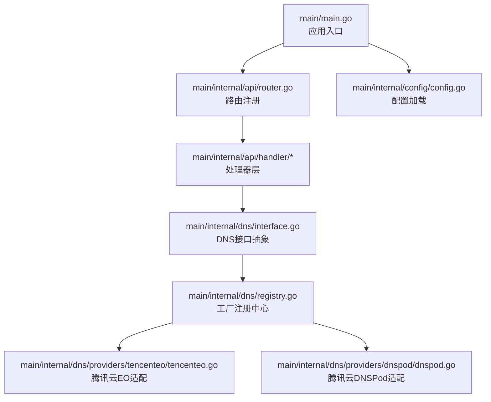
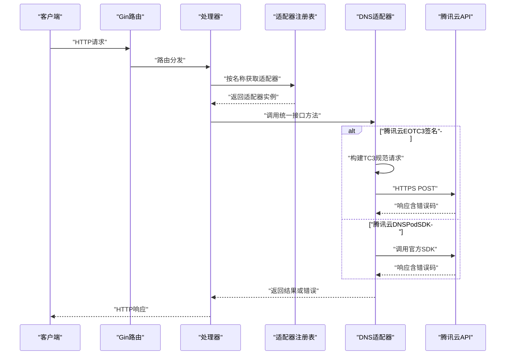
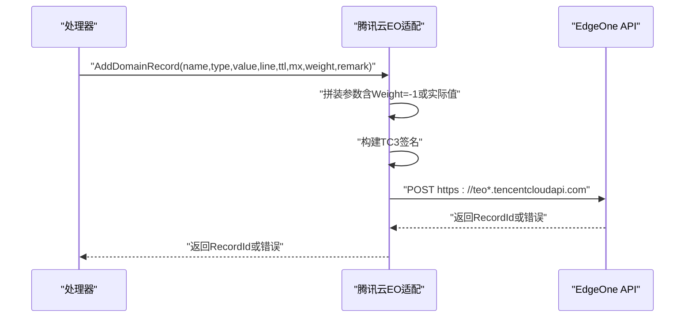
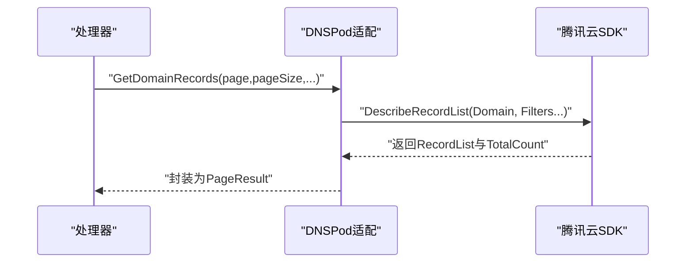
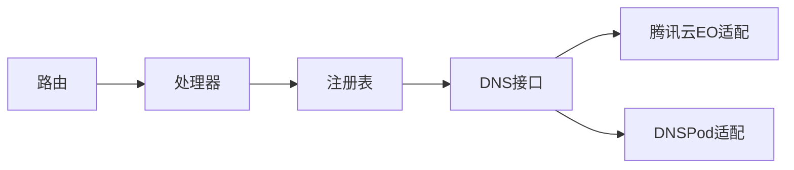

# 腾讯云DNS

<cite>
**本文引用的文件**
- [main.go](file://main/main.go)
- [router.go](file://main/internal/api/router.go)
- [config.go](file://main/internal/config/config.go)
- [interface.go](file://main/internal/dns/interface.go)
- [registry.go](file://main/internal/dns/registry.go)
- [tencenteo.go](file://main/internal/dns/providers/tencenteo/tencenteo.go)
- [dnspod.go](file://main/internal/dns/providers/dnspod/dnspod.go)
</cite>

## 目录
1. [简介](#简介)
2. [项目结构](#项目结构)
3. [核心组件](#核心组件)
4. [架构总览](#架构总览)
5. [详细组件分析](#详细组件分析)
6. [依赖关系分析](#依赖关系分析)
7. [性能考虑](#性能考虑)
8. [故障排查指南](#故障排查指南)
9. [结论](#结论)
10. [附录](#附录)

## 简介
本技术文档面向“腾讯云DNS”适配实现，聚焦以下目标：
- 详述腾讯云DNS API的适配方式，包括 SecretId/SecretKey 认证、API 签名机制与请求格式。
- 说明域名解析记录的增删改查能力，覆盖 A、AAAA、CNAME、MX、TXT 等常见记录类型。
- 提供配置参数说明与最佳实践，包含批量操作与错误处理策略。
- 展示常见业务场景的调用流程与注意事项，并给出性能优化建议。

注意：当前仓库同时包含两个腾讯云 DNS 适配实现：
- 腾讯云 EO（EdgeOne）适配：通过自定义 TC3-HMAC-SHA256 签名实现。
- 腾讯云 DNSPod 官方 SDK 适配：通过官方 Go SDK 调用。

两者在认证方式、签名机制、请求格式与能力集上存在显著差异，本文将分别进行说明。

## 项目结构
后端采用 Go + Gin 框架，API 路由集中注册在路由模块，DNS 适配通过统一接口抽象与工厂注册机制实现多厂商适配。主程序负责加载配置、初始化数据库与缓存、启动 HTTP 服务与后台任务。

图表来源
- [main.go:1-148](file://main/main.go#L1-L148)
- [router.go:1-279](file://main/internal/api/router.go#L1-L279)
- [interface.go:1-125](file://main/internal/dns/interface.go#L1-L125)
- [registry.go:1-65](file://main/internal/dns/registry.go#L1-L65)
- [tencenteo.go:1-483](file://main/internal/dns/providers/tencenteo/tencenteo.go#L1-L483)
- [dnspod.go:1-320](file://main/internal/dns/providers/dnspod/dnspod.go#L1-L320)

章节来源
- [main.go:1-148](file://main/main.go#L1-L148)
- [router.go:1-279](file://main/internal/api/router.go#L1-L279)
- [config.go:1-161](file://main/internal/config/config.go#L1-L161)

## 核心组件
- 统一 DNS 接口与数据模型：定义记录、域名、分页结果、线路、配置字段与特性集合，确保不同厂商适配的一致性。
- 工厂注册机制：通过注册表集中管理各厂商适配器及其配置项，运行时按名称获取实例。
- 路由与处理器：暴露统一的 API，供前端或外部系统调用，内部委派到具体 DNS 适配器执行。
- 配置系统：支持服务器、数据库、JWT、Redis、代理、日志清理等配置项。

章节来源
- [interface.go:1-125](file://main/internal/dns/interface.go#L1-L125)
- [registry.go:1-65](file://main/internal/dns/registry.go#L1-L65)
- [router.go:1-279](file://main/internal/api/router.go#L1-L279)
- [config.go:1-161](file://main/internal/config/config.go#L1-L161)

## 架构总览
下图展示了从 HTTP 请求到 DNS 适配器的调用链，以及两种腾讯云适配实现的差异：

图表来源
- [router.go:1-279](file://main/internal/api/router.go#L1-L279)
- [registry.go:1-65](file://main/internal/dns/registry.go#L1-L65)
- [tencenteo.go:1-483](file://main/internal/dns/providers/tencenteo/tencenteo.go#L1-L483)
- [dnspod.go:1-320](file://main/internal/dns/providers/dnspod/dnspod.go#L1-L320)

## 详细组件分析

### 统一DNS接口与数据模型
- 数据模型
  - 记录 Record：包含主机记录、类型、值、TTL、线路、MX优先级、权重、状态、备注、更新时间等。
  - 域名 DomainInfo：包含域名 ID、名称、记录数量、状态。
  - 记录线路 RecordLine：包含线路 ID 与名称。
  - 分页结果 PageResult：包含总数与记录集合。
- 接口能力
  - 账户校验、域名列表、记录查询、子域名记录、单条记录详情、新增、更新、删除、启停、日志、线路、最小 TTL、添加域名等。
- 特性集 ProviderFeatures：用于描述适配器对备注、状态、转发、日志、权重、分页、添加域名等能力的支持情况。

章节来源
- [interface.go:1-125](file://main/internal/dns/interface.go#L1-L125)

### 适配器工厂与注册
- 工厂函数 ProviderFactory：根据配置与域名信息构造适配器实例。
- 注册 Register：将适配器工厂与配置项注册到全局表。
- 获取 GetProvider/GetProviderConfig：运行时按名称获取适配器与配置。
- 默认线路映射 DefaultLineMapping：为部分厂商提供线路 ID 的默认映射。

章节来源
- [registry.go:1-65](file://main/internal/dns/registry.go#L1-L65)

### 腾讯云EO（EdgeOne）适配
- 认证与签名
  - 使用 SecretId/SecretKey 进行 TC3-HMAC-SHA256 签名，遵循腾讯云 TC3 规范。
  - 请求头包含 Content-Type、Host、X-TC-Action、X-TC-Version、X-TC-Timestamp、Authorization。
  - 签名步骤：构建规范请求、字符串待签、计算签名、组装 Authorization。
- 请求格式
  - 服务域名：teo.tencentcloudapi.com 或 teo.intl.tencentcloudapi.com（按接入点选择）。
  - 版本：2022-09-01。
  - 方法：DescribeZones、DescribeDnsRecords、CreateDnsRecord、ModifyDnsRecord、DeleteDnsRecords、ModifyDnsRecordsStatus 等。
- 记录类型支持
  - 支持 A、AAAA、CNAME、MX、TXT 等常见类型；MX 优先级通过 Priority 字段传递。
  - 权重通过 Weight 字段传递；当未设置时传入 -1。
- 能力限制
  - 不支持备注单独设置、日志查询、添加域名；支持启停记录、权重、线路（默认线路）。
- 关键流程（新增记录）

图表来源
- [tencenteo.go:369-405](file://main/internal/dns/providers/tencenteo/tencenteo.go#L369-L405)
- [tencenteo.go:90-171](file://main/internal/dns/providers/tencenteo/tencenteo.go#L90-L171)

章节来源
- [tencenteo.go:1-483](file://main/internal/dns/providers/tencenteo/tencenteo.go#L1-L483)

### 腾讯云DNSPod适配（官方SDK）
- 认证与SDK
  - 使用 SecretId/SecretKey 初始化官方 SDK 客户端。
  - 通过 SDK 方法直接调用 DescribeDomainList、DescribeRecordList、CreateRecord、ModifyRecord、DeleteRecord、ModifyRecordStatus 等。
- 记录类型支持
  - 支持 A、AAAA、CNAME、MX、TXT 等；MX 通过 MX 字段传递。
  - 权重通过 Weight 字段传递；默认线路可映射为“默认”。
- 能力特性
  - 支持备注、状态、日志、权重、线路、添加域名、分页等。
- 关键流程（查询记录）

图表来源
- [dnspod.go:88-138](file://main/internal/dns/providers/dnspod/dnspod.go#L88-L138)

章节来源
- [dnspod.go:1-320](file://main/internal/dns/providers/dnspod/dnspod.go#L1-L320)

### API 路由与处理器
- 路由组织
  - /api 下的公开与鉴权路由，涵盖账户、域名、记录、线路、监控、证书、用户、系统配置等。
  - 记录相关：GET/POST/PUT/DELETE /domains/:id/records，支持批量新增、编辑与动作。
- 处理器职责
  - 从请求中提取参数，调用对应 DNS 适配器，处理错误并返回统一响应格式。

章节来源
- [router.go:1-279](file://main/internal/api/router.go#L1-L279)

## 依赖关系分析
- 组件耦合
  - 路由与处理器依赖 DNS 接口抽象，不直接依赖具体厂商实现，降低耦合度。
  - 适配器通过工厂注册，运行时按需加载，便于扩展新厂商。
- 外部依赖
  - 腾讯云EO适配：标准库 http、crypto/sha256、crypto/hmac。
  - DNSPod适配：tencentcloud-sdk-go（官方 SDK）。
- 循环依赖
  - 无明显循环依赖；注册在 init 中完成，避免运行期循环。

图表来源
- [router.go:1-279](file://main/internal/api/router.go#L1-L279)
- [registry.go:1-65](file://main/internal/dns/registry.go#L1-L65)
- [interface.go:1-125](file://main/internal/dns/interface.go#L1-L125)
- [tencenteo.go:1-483](file://main/internal/dns/providers/tencenteo/tencenteo.go#L1-L483)
- [dnspod.go:1-320](file://main/internal/dns/providers/dnspod/dnspod.go#L1-L320)

## 性能考虑
- 签名与网络
  - TC3 签名涉及哈希与 HMAC 计算，建议在高并发场景下复用 HTTP 客户端连接池，合理设置超时。
  - DNSPod SDK 内部已做连接池优化，适合频繁调用。
- 分页与过滤
  - 使用分页参数 Offset/Limit 控制返回量；尽量结合关键字、类型、线路等过滤条件减少无效数据传输。
- 缓存与降噪
  - 对线路列表、域名列表等静态或低频变更数据可引入本地缓存，降低重复请求。
- 批量操作
  - 优先使用批量接口减少往返次数；对大批次建议分批提交并设置合理的重试与退避策略。
- 错误处理
  - 对网络错误与限流进行指数退避重试；对业务错误（如参数非法、权限不足）快速失败并记录上下文。

## 故障排查指南
- 常见错误与定位
  - 认证失败：检查 SecretId/SecretKey 是否正确，是否过期或被禁用；确认接入点（国内/国际）与服务域名匹配。
  - 签名错误：核对 Canonical Request、StringToSign、Authorization 组装顺序与编码；确保时间戳与服务器时间一致。
  - 参数错误：核对记录类型、MX 优先级、权重、TTL 等字段范围；MX 类型需传入 Priority。
  - 权限不足：确认账号具备相应 API 权限与域名操作权限。
- 日志与追踪
  - 启用请求追踪中间件，记录请求 ID、头部与主体，便于定位问题。
  - 查看适配器返回的 lastErr 或响应中的错误信息，结合腾讯云控制台错误码进一步诊断。
- 限流与重试
  - 遇到限流时采用指数退避重试；对幂等操作（如查询）可增加重试次数。
- 幂等性
  - 新增记录时若需设置备注，可在创建后单独调用备注接口；注意 DNSPod 支持备注，EO 不支持。

章节来源
- [tencenteo.go:74-76](file://main/internal/dns/providers/tencenteo/tencenteo.go#L74-L76)
- [dnspod.go:51-53](file://main/internal/dns/providers/dnspod/dnspod.go#L51-L53)

## 结论
- 腾讯云 EO 与 DNSPod 两条适配路径覆盖了不同的使用场景：前者更贴近原生 TC3 签名，后者基于官方 SDK 更易维护且能力更全。
- 通过统一接口与工厂注册，系统具备良好的扩展性与可维护性。
- 在生产环境中，建议结合业务特点选择适配器，完善错误处理与重试策略，并关注性能与成本优化。

## 附录

### 配置参数说明（节选）
- 服务器配置：监听地址、端口、运行模式、基础 URL。
- 数据库配置：驱动类型、主机、端口、用户名、密码、数据库名或 SQLite 文件路径。
- JWT 配置：密钥与过期时间。
- Redis 配置：开关、地址、密码、DB、连接池大小、最小空闲连接、Key 前缀。
- 代理配置：开关与代理 URL。
- 日志清理配置：是否启用、成功/错误日志保留条数、清理间隔。

章节来源
- [config.go:12-161](file://main/internal/config/config.go#L12-L161)

### 常见业务场景与最佳实践
- 场景一：查询域名解析记录
  - 使用 GET /domains/:id/records，结合子域名、关键字、类型、线路、状态进行过滤。
  - 建议：先查域名列表，再按域名 ID 查询记录；合理设置分页大小。
- 场景二：新增 A/AAAA/CNAME/MX/TXT 记录
  - 使用 POST /domains/:id/records；MX 需要传入优先级；权重仅在支持的适配器生效。
  - 建议：先获取线路列表，再选择合适的线路；设置合理的 TTL。
- 场景三：批量操作
  - 使用 /domains/:id/records/batch 与 /domains/:id/records/batch/action；分批提交，避免单次过大。
- 场景四：启停记录
  - 使用 /domains/:id/records/:recordId/status；注意不同适配器对状态字段的映射。
- 场景五：错误处理
  - 对网络异常与业务错误分别处理；记录请求 ID 与关键参数，便于回溯。

章节来源
- [router.go:64-74](file://main/internal/api/router.go#L64-L74)
- [dnspod.go:166-196](file://main/internal/dns/providers/dnspod/dnspod.go#L166-L196)
- [tencenteo.go:369-405](file://main/internal/dns/providers/tencenteo/tencenteo.go#L369-L405)

### 腾讯云DNS特性对比（适配器维度）
- 备注：DNSPod 支持；EO 不支持。
- 状态：均支持启停。
- 转发：EO 不支持；DNSPod 支持。
- 日志：DNSPod 支持；EO 不支持。
- 权重：EO 支持；DNSPod 支持。
- 分页：EO 不支持客户端分页；DNSPod 支持。
- 添加域名：DNSPod 支持；EO 不支持。

章节来源
- [registry.go:37-40](file://main/internal/dns/registry.go#L37-L40)
- [dnspod.go:23-26](file://main/internal/dns/providers/dnspod/dnspod.go#L23-L26)
- [tencenteo.go:37-40](file://main/internal/dns/providers/tencenteo/tencenteo.go#L37-L40)