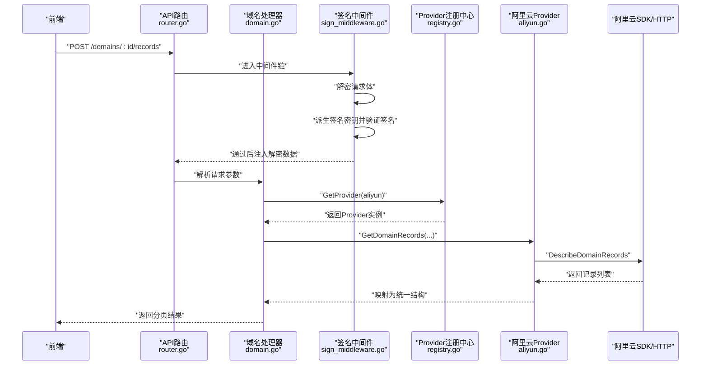
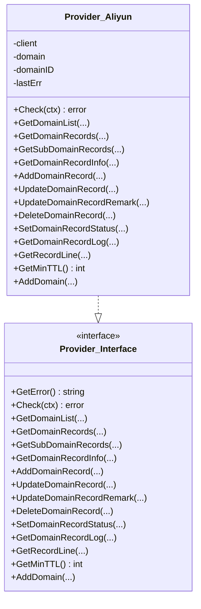
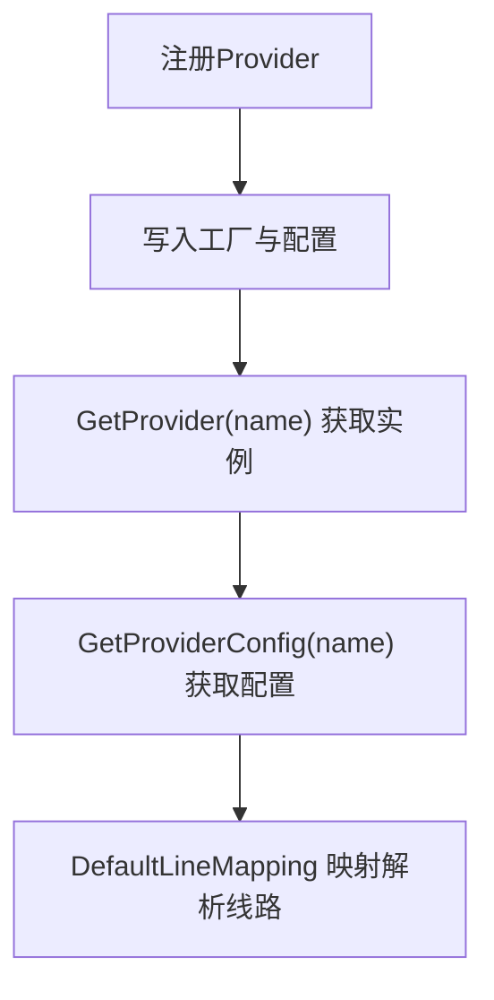
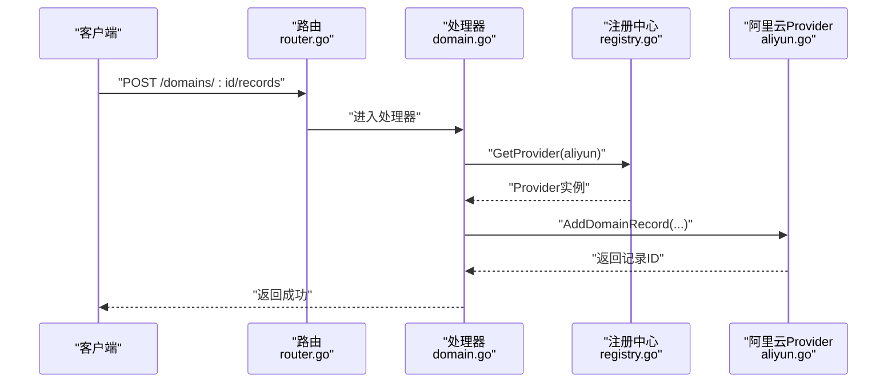
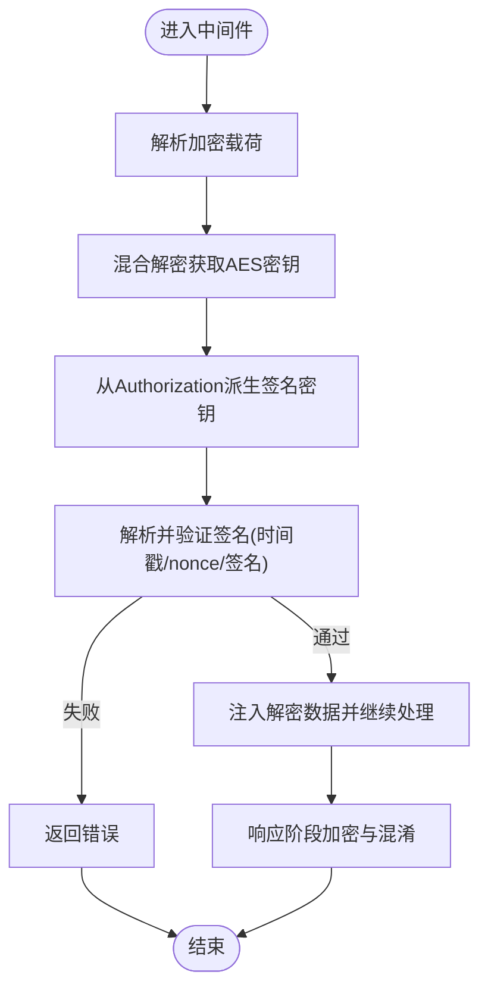
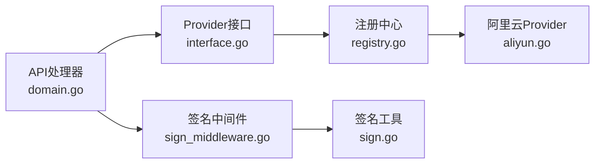

# 阿里云DNS

<cite>
**本文引用的文件**
- [aliyun.go](file://main/internal/dns/providers/aliyun/aliyun.go)
- [interface.go](file://main/internal/dns/interface.go)
- [registry.go](file://main/internal/dns/registry.go)
- [router.go](file://main/internal/api/router.go)
- [domain.go](file://main/internal/api/handler/domain.go)
- [sign.go](file://main/internal/utils/sign.go)
- [sign_middleware.go](file://main/internal/api/middleware/sign.go)
- [config_cloud.go](file://main/internal/cert/deploy/config_cloud.go)
</cite>

## 目录
1. [简介](#简介)
2. [项目结构](#项目结构)
3. [核心组件](#核心组件)
4. [架构总览](#架构总览)
5. [详细组件分析](#详细组件分析)
6. [依赖分析](#依赖分析)
7. [性能考虑](#性能考虑)
8. [故障排查指南](#故障排查指南)
9. [结论](#结论)
10. [附录](#附录)

## 简介
本文件面向阿里云DNS服务的集成实现，系统性阐述以下内容：
- 阿里云DNS API的接入方式与认证机制
- 域名管理与解析记录管理的实现细节（RR、TTL、MX优先级、状态控制等）
- 阿里云DNS特有的能力（如解析线路、记录日志、最小TTL等）
- 客户端加密与签名中间件在请求链路中的作用
- 常见API调用流程与错误处理策略
- 配置参数说明（Region、认证信息、线路映射等）

## 项目结构
阿里云DNS集成位于“dns”模块下的“providers/aliyun”，并通过统一的Provider接口对外暴露能力。API层通过路由与处理器对接Provider，并在请求链路上使用加密与签名中间件。

```mermaid
graph TB
subgraph "API层"
R["路由注册<br/>router.go"]
H["域名/记录处理器<br/>domain.go"]
M["签名中间件<br/>sign_middleware.go"]
end
subgraph "DNS抽象层"
IF["Provider接口定义<br/>interface.go"]
REG["Provider注册中心<br/>registry.go"]
end
subgraph "阿里云实现"
P["阿里云Provider实现<br/>aliyun.go"]
end
subgraph "工具与安全"
S["签名与防重放工具<br/>sign.go"]
end
R --> H
H --> M
H --> IF
IF --> REG
REG --> P
M --> S
```

**图表来源**
- [router.go:14-166](file://main/internal/api/router.go#L14-L166)
- [domain.go:26-43](file://main/internal/api/handler/domain.go#L26-L43)
- [sign_middleware.go:14-69](file://main/internal/api/middleware/sign.go#L14-L69)
- [interface.go:40-86](file://main/internal/dns/interface.go#L40-L86)
- [registry.go:17-37](file://main/internal/dns/registry.go#L17-L37)
- [aliyun.go:14-49](file://main/internal/dns/providers/aliyun/aliyun.go#L14-L49)
- [sign.go:35-178](file://main/internal/utils/sign.go#L35-L178)

**章节来源**
- [router.go:14-166](file://main/internal/api/router.go#L14-L166)
- [domain.go:26-43](file://main/internal/api/handler/domain.go#L26-L43)
- [interface.go:40-86](file://main/internal/dns/interface.go#L40-L86)
- [registry.go:17-37](file://main/internal/dns/registry.go#L17-L37)
- [aliyun.go:14-49](file://main/internal/dns/providers/aliyun/aliyun.go#L14-L49)
- [sign.go:35-178](file://main/internal/utils/sign.go#L35-L178)

## 核心组件
- Provider接口：定义了域名与记录的增删改查、状态切换、日志查询、最小TTL、解析线路等能力。
- 阿里云Provider实现：基于阿里云官方SDK封装，负责具体API调用与参数映射。
- Provider注册中心：集中注册与检索Provider，支持默认线路映射。
- API处理器：将HTTP请求转换为Provider调用，处理权限、分页、状态标准化等。
- 签名与加密中间件：对请求进行解密、签名验证、响应加密与混淆。

**章节来源**
- [interface.go:40-86](file://main/internal/dns/interface.go#L40-L86)
- [aliyun.go:14-49](file://main/internal/dns/providers/aliyun/aliyun.go#L14-L49)
- [registry.go:17-37](file://main/internal/dns/registry.go#L17-L37)
- [domain.go:548-728](file://main/internal/api/handler/domain.go#L548-L728)
- [sign_middleware.go:14-69](file://main/internal/api/middleware/sign.go#L14-L69)
- [sign.go:35-178](file://main/internal/utils/sign.go#L35-L178)

## 架构总览
下面以“获取域名解析记录”的典型流程为例，展示从前端到阿里云DNS API的调用链路与安全处理。



**图表来源**
- [router.go:64-67](file://main/internal/api/router.go#L64-L67)
- [domain.go:575-728](file://main/internal/api/handler/domain.go#L575-L728)
- [sign_middleware.go:14-69](file://main/internal/api/middleware/sign.go#L14-L69)
- [registry.go:26-37](file://main/internal/dns/registry.go#L26-L37)
- [aliyun.go:91-144](file://main/internal/dns/providers/aliyun/aliyun.go#L91-L144)

## 详细组件分析

### 阿里云Provider实现
- 认证与初始化
  - 使用AccessKeyID与AccessKeySecret构造凭证，初始化SDK客户端。
  - 固定Region为“cn-hangzhou”，可通过扩展支持动态Region。
- 域名与记录管理
  - 域名列表：DescribeDomains
  - 记录列表：DescribeDomainRecords（支持关键字、RR、记录类型、线路、状态过滤）
  - 子域名记录：DescribeSubDomainRecords
  - 单条记录详情：DescribeDomainRecordInfo
  - 新增/更新记录：AddDomainRecord、UpdateDomainRecord（支持TTL、线路、MX优先级）
  - 删除记录：DeleteDomainRecord
  - 状态控制：SetDomainRecordStatus（ENABLE/DISABLE）
  - 备注更新：UpdateDomainRecordRemark
  - 记录日志：DescribeRecordLogs
  - 解析线路：DescribeSupportLines
  - 最小TTL：GetMinTTL返回600
  - 添加域名：AddDomain
- 特性声明
  - 支持备注、启用/暂停、日志、添加域名；不支持权重



**图表来源**
- [aliyun.go:29-344](file://main/internal/dns/providers/aliyun/aliyun.go#L29-L344)
- [interface.go:40-86](file://main/internal/dns/interface.go#L40-L86)

**章节来源**
- [aliyun.go:14-49](file://main/internal/dns/providers/aliyun/aliyun.go#L14-L49)
- [aliyun.go:55-61](file://main/internal/dns/providers/aliyun/aliyun.go#L55-L61)
- [aliyun.go:63-89](file://main/internal/dns/providers/aliyun/aliyun.go#L63-L89)
- [aliyun.go:91-144](file://main/internal/dns/providers/aliyun/aliyun.go#L91-L144)
- [aliyun.go:146-180](file://main/internal/dns/providers/aliyun/aliyun.go#L146-L180)
- [aliyun.go:182-199](file://main/internal/dns/providers/aliyun/aliyun.go#L182-L199)
- [aliyun.go:201-251](file://main/internal/dns/providers/aliyun/aliyun.go#L201-L251)
- [aliyun.go:262-281](file://main/internal/dns/providers/aliyun/aliyun.go#L262-L281)
- [aliyun.go:283-312](file://main/internal/dns/providers/aliyun/aliyun.go#L283-L312)
- [aliyun.go:314-332](file://main/internal/dns/providers/aliyun/aliyun.go#L314-L332)
- [aliyun.go:334-336](file://main/internal/dns/providers/aliyun/aliyun.go#L334-L336)
- [aliyun.go:338-343](file://main/internal/dns/providers/aliyun/aliyun.go#L338-L343)

### Provider接口与注册中心
- Provider接口统一了不同DNS服务商的能力边界，便于扩展与替换。
- 注册中心负责注册Provider工厂与配置，并提供默认线路映射（如阿里云的“DEF/CT/CU/CM/AB”到“default/telecom/unicom/mobile/oversea”的映射）。



**图表来源**
- [registry.go:17-37](file://main/internal/dns/registry.go#L17-L37)
- [registry.go:58-65](file://main/internal/dns/registry.go#L58-L65)

**章节来源**
- [interface.go:40-86](file://main/internal/dns/interface.go#L40-L86)
- [registry.go:17-37](file://main/internal/dns/registry.go#L17-L37)
- [registry.go:58-65](file://main/internal/dns/registry.go#L58-L65)

### API路由与处理器
- 路由层定义了域名与记录相关的REST接口，如“获取记录列表”“新增记录”“批量操作”等。
- 处理器层完成鉴权、参数绑定、权限校验、Provider调用与结果返回。
- 对于记录状态，统一转换为“ENABLE/DISABLE”，并在返回给前端时映射为“1/0”。



**图表来源**
- [router.go:64-67](file://main/internal/api/router.go#L64-L67)
- [domain.go:768-849](file://main/internal/api/handler/domain.go#L768-L849)
- [registry.go:26-37](file://main/internal/dns/registry.go#L26-L37)
- [aliyun.go:201-225](file://main/internal/dns/providers/aliyun/aliyun.go#L201-L225)

**章节来源**
- [router.go:64-67](file://main/internal/api/router.go#L64-L67)
- [domain.go:548-728](file://main/internal/api/handler/domain.go#L548-L728)
- [domain.go:768-849](file://main/internal/api/handler/domain.go#L768-L849)

### 客户端加密与签名中间件
- 请求解密：从请求体中提取加密载荷，使用混合解密得到AES密钥。
- 签名验证：从Authorization头派生签名密钥，解析并验证请求中的时间戳、nonce与签名。
- 响应加密：若具备AES密钥，则对响应进行加密与混淆。



**图表来源**
- [sign_middleware.go:14-69](file://main/internal/api/middleware/sign.go#L14-L69)
- [sign.go:86-141](file://main/internal/utils/sign.go#L86-L141)
- [sign.go:143-178](file://main/internal/utils/sign.go#L143-L178)

**章节来源**
- [sign_middleware.go:14-69](file://main/internal/api/middleware/sign.go#L14-L69)
- [sign.go:35-178](file://main/internal/utils/sign.go#L35-L178)

## 依赖分析
- Provider接口与实现解耦：API层只依赖接口，不关心具体实现，便于扩展其他DNS服务商。
- 注册中心集中管理Provider工厂与配置，支持默认线路映射。
- 阿里云Provider依赖官方SDK，封装为统一的数据结构与方法。
- 签名中间件与工具模块独立，提供跨模块复用的安全能力。



**图表来源**
- [interface.go:40-86](file://main/internal/dns/interface.go#L40-L86)
- [registry.go:17-37](file://main/internal/dns/registry.go#L17-L37)
- [aliyun.go:14-49](file://main/internal/dns/providers/aliyun/aliyun.go#L14-L49)
- [domain.go:26-43](file://main/internal/api/handler/domain.go#L26-L43)
- [sign_middleware.go:14-69](file://main/internal/api/middleware/sign.go#L14-L69)
- [sign.go:35-178](file://main/internal/utils/sign.go#L35-L178)

**章节来源**
- [interface.go:40-86](file://main/internal/dns/interface.go#L40-L86)
- [registry.go:17-37](file://main/internal/dns/registry.go#L17-L37)
- [aliyun.go:14-49](file://main/internal/dns/providers/aliyun/aliyun.go#L14-L49)
- [domain.go:26-43](file://main/internal/api/handler/domain.go#L26-L43)
- [sign_middleware.go:14-69](file://main/internal/api/middleware/sign.go#L14-L69)
- [sign.go:35-178](file://main/internal/utils/sign.go#L35-L178)

## 性能考虑
- 分页与筛选：API层对记录查询支持分页与多维筛选，建议前端合理设置page/page_size，避免一次性拉取过多数据。
- 子域名权限合并：当用户具备多个子域名权限时，处理器会多次调用Provider并本地合并，再进行二次筛选，注意控制权限数量与分页大小。
- 超时控制：Provider调用使用上下文超时，避免阻塞影响整体性能。
- 线路映射缓存：处理器会缓存线路ID到名称的映射，减少重复查询。

**章节来源**
- [domain.go:589-728](file://main/internal/api/handler/domain.go#L589-L728)

## 故障排查指南
- 认证失败
  - 检查AccessKeyID与AccessKeySecret是否正确配置。
  - 确认Region设置与实际可用区一致（当前实现固定为“cn-hangzhou”）。
- 请求签名错误
  - 确保请求头包含Authorization与必要的X-Refresh-Token、X-Secret-Token。
  - 核对时间戳与nonce的有效性（时间戳偏差不超过5分钟，nonce在10分钟内不可重复）。
- 记录状态异常
  - 状态在API层会被标准化为“ENABLE/DISABLE”，请确认传入值是否符合预期。
- 权限不足
  - 非管理员用户需具备对应子域名权限，否则无法查看或修改记录。
- 日志与错误响应
  - API中间件统一返回“code/msg/data”结构，错误码为-1时代表业务错误；必要时结合请求追踪ID定位问题。

**章节来源**
- [sign_middleware.go:44-68](file://main/internal/api/middleware/sign.go#L44-L68)
- [sign.go:143-178](file://main/internal/utils/sign.go#L143-L178)
- [domain.go:569-573](file://main/internal/api/handler/domain.go#L569-L573)
- [sign_middleware.go:164-177](file://main/internal/api/middleware/sign.go#L164-L177)

## 结论
本实现通过Provider接口与注册中心实现了对阿里云DNS的统一接入，配合API层的路由与处理器，提供了完善的域名与记录管理能力。签名与加密中间件确保了请求链路的安全性。当前实现支持基础的RR类型、TTL、MX优先级与状态控制，最小TTL为600秒；权重与特定智能解析功能不在当前特性集内，后续可通过扩展Provider接口与注册中心进行增强。

## 附录

### 配置参数说明
- 认证信息
  - AccessKeyId：阿里云访问密钥ID
  - AccessKeySecret：阿里云访问密钥
- Region
  - 当前实现固定为“cn-hangzhou”，如需扩展可参考阿里云SDK配置
- 线路映射
  - 默认映射：DEF→default，CT→telecom，CU→unicom，CM→mobile，AB→oversea

**章节来源**
- [aliyun.go:19-26](file://main/internal/dns/providers/aliyun/aliyun.go#L19-L26)
- [aliyun.go:38-39](file://main/internal/dns/providers/aliyun/aliyun.go#L38-L39)
- [registry.go:59-65](file://main/internal/dns/registry.go#L59-L65)

### 常见API调用示例（步骤说明）
- 获取域名解析记录
  - 步骤：鉴权→参数绑定→权限校验→调用Provider.GetDomainRecords→映射返回→分页输出
  - 参考路径：[domain.go:575-728](file://main/internal/api/handler/domain.go#L575-L728)，[aliyun.go:91-144](file://main/internal/dns/providers/aliyun/aliyun.go#L91-L144)
- 新增解析记录
  - 步骤：鉴权→参数绑定→权限校验→调用Provider.AddDomainRecord→返回记录ID
  - 参考路径：[domain.go:795-849](file://main/internal/api/handler/domain.go#L795-L849)，[aliyun.go:201-225](file://main/internal/dns/providers/aliyun/aliyun.go#L201-L225)
- 设置记录状态
  - 步骤：鉴权→参数绑定→权限校验→调用Provider.SetDomainRecordStatus→返回
  - 参考路径：[domain.go:64-69](file://main/internal/api/router.go#L64-L69)，[aliyun.go:270-281](file://main/internal/dns/providers/aliyun/aliyun.go#L270-L281)

### 阿里云DNS特性与限制
- 支持能力
  - 域名与记录管理、状态控制、记录日志、解析线路、最小TTL
- 不支持能力
  - 权重（Weight）
- 线路映射
  - 默认线路映射参见注册中心

**章节来源**
- [aliyun.go:23-26](file://main/internal/dns/providers/aliyun/aliyun.go#L23-L26)
- [aliyun.go:334-336](file://main/internal/dns/providers/aliyun/aliyun.go#L334-L336)
- [registry.go:59-65](file://main/internal/dns/registry.go#L59-L65)