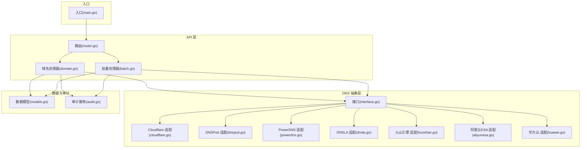
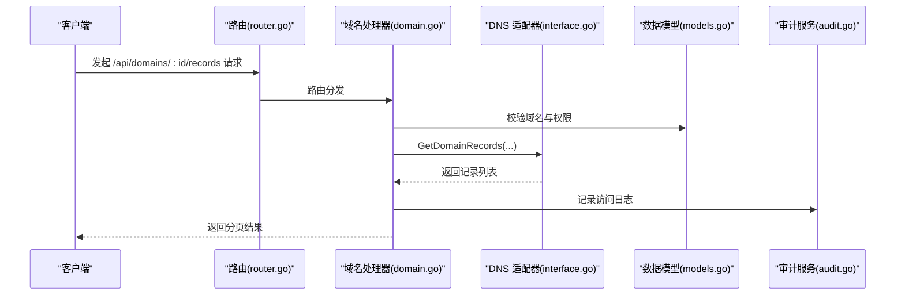
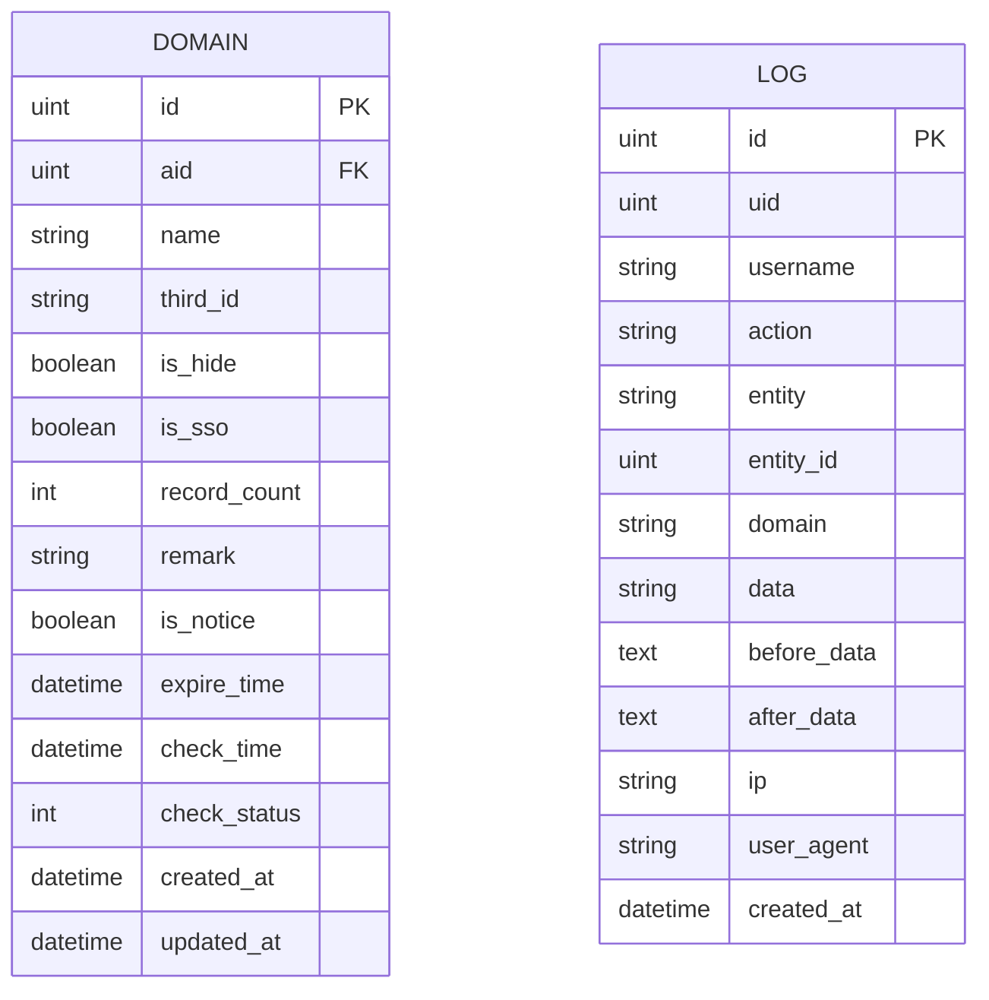
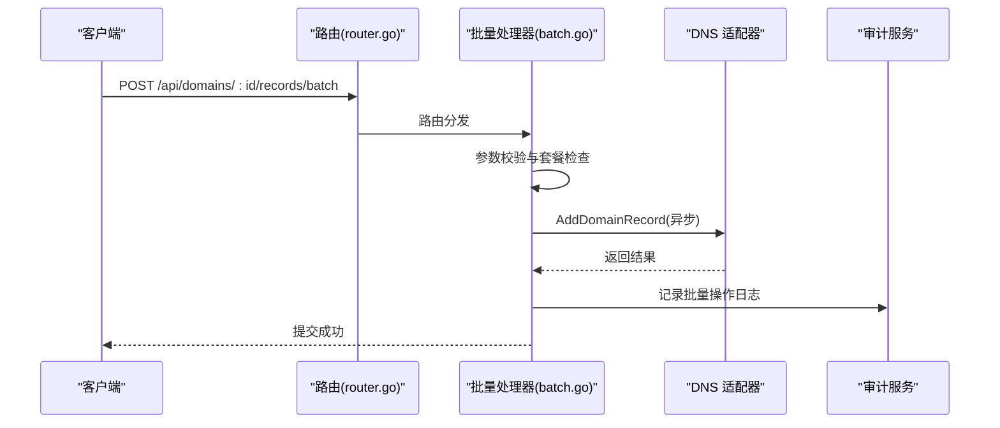
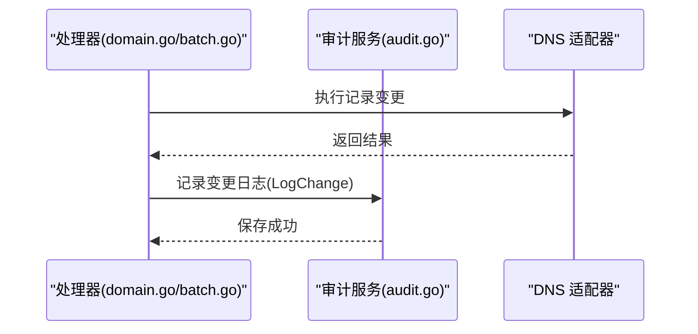
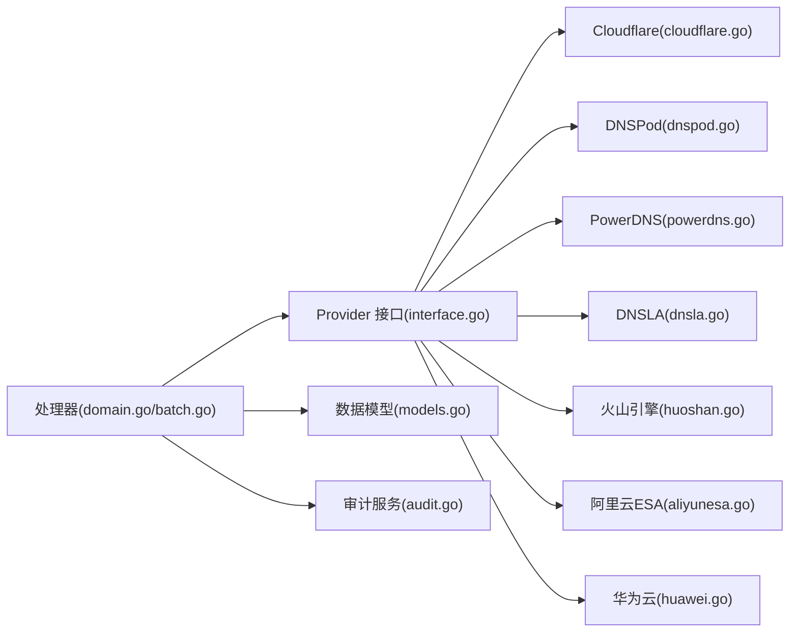

# 解析记录管理

<cite>
**本文档引用的文件**
- [main.go](file://main/main.go)
- [models.go](file://main/internal/models/models.go)
- [interface.go](file://main/internal/dns/interface.go)
- [router.go](file://main/internal/api/router.go)
- [domain.go](file://main/internal/api/handler/domain.go)
- [batch.go](file://main/internal/api/handler/batch.go)
- [audit.go](file://main/internal/service/audit.go)
- [cloudflare.go](file://main/internal/dns/providers/cloudflare/cloudflare.go)
- [dnspod.go](file://main/internal/dns/providers/dnspod/dnspod.go)
- [powerdns.go](file://main/internal/dns/providers/powerdns/powerdns.go)
- [dnsla.go](file://main/internal/dns/providers/dnsla/dnsla.go)
- [huoshan.go](file://main/internal/dns/providers/huoshan/huoshan.go)
- [aliyunesa.go](file://main/internal/dns/providers/aliyunesa/aliyunesa.go)
- [huawei.go](file://main/internal/dns/providers/huawei/huawei.go)
</cite>

## 目录
1. [简介](#简介)
2. [项目结构](#项目结构)
3. [核心组件](#核心组件)
4. [架构总览](#架构总览)
5. [详细组件分析](#详细组件分析)
6. [依赖关系分析](#依赖关系分析)
7. [性能考虑](#性能考虑)
8. [故障排查指南](#故障排查指南)
9. [结论](#结论)

## 简介
本技术文档围绕解析记录管理功能进行深入剖析，涵盖DNS记录的数据模型设计、记录类型支持范围、增删改查与批量处理能力、冲突检测与重复记录处理机制、记录模板与预设配置、优先级排序与线路映射、以及记录变更的审计与回滚机制。文档以代码为依据，结合架构图与流程图，帮助开发者与运维人员快速理解系统实现与最佳实践。

## 项目结构
后端采用 Go + Gin 框架，核心模块包括：
- API 层：路由定义与控制器处理
- DNS 抽象层：统一记录模型与服务商接口
- DNS 服务商适配层：多家云厂商与自建方案
- 数据模型层：数据库表结构与审计日志
- 审计服务：统一记录操作日志

图表来源
- [router.go:14-276](file://main/internal/api/router.go#L14-L276)
- [domain.go:548-728](file://main/internal/api/handler/domain.go#L548-L728)
- [batch.go:47-156](file://main/internal/api/handler/batch.go#L47-L156)
- [interface.go:41-86](file://main/internal/dns/interface.go#L41-L86)
- [cloudflare.go:17-30](file://main/internal/dns/providers/cloudflare/cloudflare.go#L17-L30)
- [dnspod.go:14-27](file://main/internal/dns/providers/dnspod/dnspod.go#L14-L27)
- [powerdns.go:71-82](file://main/internal/dns/providers/powerdns/powerdns.go#L71-L82)
- [dnsla.go:17-26](file://main/internal/dns/providers/dnsla/dnsla.go#L17-L26)
- [huoshan.go:17-26](file://main/internal/dns/providers/huoshan/huoshan.go#L17-L26)
- [aliyunesa.go:17-26](file://main/internal/dns/providers/aliyunesa/aliyunesa.go#L17-L26)
- [huawei.go:14-27](file://main/internal/dns/providers/huawei/huawei.go#L14-L27)
- [models.go:49-81](file://main/internal/models/models.go#L49-L81)
- [audit.go:28-92](file://main/internal/service/audit.go#L28-L92)
- [main.go:52-148](file://main/main.go#L52-L148)

章节来源
- [router.go:14-276](file://main/internal/api/router.go#L14-L276)
- [main.go:52-148](file://main/main.go#L52-L148)

## 核心组件
- 记录模型 Record：统一承载主机记录、记录类型、目标值、TTL、线路、MX优先级、权重、状态、备注、更新时间等字段，便于跨服务商抽象。
- Provider 接口：定义获取域名列表、记录列表、单条记录、增删改查、状态控制、线路、最小TTL、添加域名等能力，屏蔽不同云厂商差异。
- Handler 控制器：域名与记录的增删改查、批量操作、WHOIS 查询、证书CNAME辅助等。
- 审计服务：统一记录操作日志，支持变更前后数据对比，便于审计与回溯。

章节来源
- [interface.go:5-18](file://main/internal/dns/interface.go#L5-L18)
- [interface.go:41-86](file://main/internal/dns/interface.go#L41-L86)
- [domain.go:548-728](file://main/internal/api/handler/domain.go#L548-L728)
- [batch.go:47-156](file://main/internal/api/handler/batch.go#L47-L156)
- [audit.go:28-92](file://main/internal/service/audit.go#L28-L92)

## 架构总览
系统通过统一的 Provider 接口对接多家 DNS 服务商，API 层负责权限校验、参数绑定与调用 Provider，数据模型与审计服务贯穿整个生命周期。

图表来源
- [router.go:62-67](file://main/internal/api/router.go#L62-L67)
- [domain.go:548-728](file://main/internal/api/handler/domain.go#L548-L728)
- [interface.go:51-58](file://main/internal/dns/interface.go#L51-L58)
- [audit.go:36-55](file://main/internal/service/audit.go#L36-L55)

## 详细组件分析

### 数据模型设计
- 域名 Domain：包含账户ID、名称、第三方ID、隐藏/SSO标记、记录数、备注、通知开关、到期/检查时间等。
- 记录 Record：统一字段包括 ID、name、type、value、ttl、line、mx、weight、status、remark、updated，便于跨服务商统一展示与处理。
- 审计日志 Log：记录操作者、动作、实体、实体ID、域名、变更前后数据、IP与UA等，支撑审计与回滚。

图表来源
- [models.go:62-81](file://main/internal/models/models.go#L62-L81)
- [models.go:105-120](file://main/internal/models/models.go#L105-L120)

章节来源
- [models.go:62-81](file://main/internal/models/models.go#L62-L81)
- [models.go:105-120](file://main/internal/models/models.go#L105-L120)
- [interface.go:5-18](file://main/internal/dns/interface.go#L5-L18)

### 记录类型支持与处理
系统支持常见记录类型：A、AAAA、CNAME、MX、TXT、NS、SRV、CAA 等。不同 Provider 对记录类型的处理略有差异：
- Cloudflare：通过 API 字段映射，MX 优先级通过 priority 字段传递。
- DNSPod：直接使用记录类型与值，MX 通过 MX 字段，权重通过 Weight 字段。
- PowerDNS：MX 值可能包含优先级前缀，解析时拆分；TXT/CNAME/NS/CAA/SRV/ALIAS 等按字段映射。
- DNSLA：根据类型ID与 dominant 标记转换为具体类型，MX 优先级与权重解析。
- 火山引擎：MX 值包含优先级，解析时拆分；支持权重。
- 阿里云ESA：A/AAAA 合并为 A/AAAA 类型，MX 优先级通过 Priority 字段。
- 华为云：MX 值包含优先级，解析时拆分；支持描述作为备注。

章节来源
- [cloudflare.go:352-398](file://main/internal/dns/providers/cloudflare/cloudflare.go#L352-L398)
- [dnspod.go:166-196](file://main/internal/dns/providers/dnspod/dnspod.go#L166-L196)
- [powerdns.go:252-313](file://main/internal/dns/providers/powerdns/powerdns.go#L252-L313)
- [dnsla.go:236-290](file://main/internal/dns/providers/dnsla/dnsla.go#L236-L290)
- [huoshan.go:261-366](file://main/internal/dns/providers/huoshan/huoshan.go#L261-L366)
- [aliyunesa.go:330-392](file://main/internal/dns/providers/aliyunesa/aliyunesa.go#L330-L392)
- [huawei.go:112-214](file://main/internal/dns/providers/huawei/huawei.go#L112-L214)

### 增删改查与批量处理
- 查询：GetRecords 支持关键字、子域名、记录类型、线路、状态、值模糊筛选，支持子域名权限过滤与分页。
- 新增：CreateRecord 校验子域名权限后调用 Provider.AddDomainRecord，支持 TTL、MX、权重、备注。
- 更新：UpdateRecord 调用 Provider.UpdateDomainRecord，支持 TTL、MX、权重、备注与线路。
- 删除：DeleteRecord 调用 Provider.DeleteDomainRecord。
- 批量新增：BatchAddRecords 支持文本与结构化两种模式，自动检测记录类型（A/AAAA/CNAME），异步执行。
- 批量编辑：BatchEditRecords 异步批量修改 TTL/线路。
- 批量操作：BatchActionRecords 支持批量启用/暂停/删除。

图表来源
- [router.go:69-72](file://main/internal/api/router.go#L69-L72)
- [batch.go:47-156](file://main/internal/api/handler/batch.go#L47-L156)
- [audit.go:198-213](file://main/internal/service/audit.go#L198-L213)

章节来源
- [domain.go:548-728](file://main/internal/api/handler/domain.go#L548-L728)
- [domain.go:768-849](file://main/internal/api/handler/domain.go#L768-L849)
- [batch.go:47-156](file://main/internal/api/handler/batch.go#L47-L156)
- [batch.go:185-264](file://main/internal/api/handler/batch.go#L185-L264)
- [batch.go:277-351](file://main/internal/api/handler/batch.go#L277-L351)

### 冲突检测与重复记录处理
- 记录值规范化：不同 Provider 对记录值格式有差异（如 TXT 引号、CNAME 结尾点、MX 前缀优先级），在 Provider 层进行格式化与解析，降低冲突概率。
- 线路与状态：通过统一的线路映射与状态转换（enable/disable/PAUSE），避免因状态不一致导致的冲突。
- 幂等性：批量新增时按行解析，若某行格式不合法则计入失败计数，不影响其他行；Provider 层通常具备幂等处理能力。

章节来源
- [powerdns.go:452-494](file://main/internal/dns/providers/powerdns/powerdns.go#L452-L494)
- [dnsla.go:236-290](file://main/internal/dns/providers/dnsla/dnsla.go#L236-L290)
- [huoshan.go:261-366](file://main/internal/dns/providers/huoshan/huoshan.go#L261-L366)
- [aliyunesa.go:368-392](file://main/internal/dns/providers/aliyunesa/aliyunesa.go#L368-L392)
- [huawei.go:112-214](file://main/internal/dns/providers/huawei/huawei.go#L112-L214)

### 记录模板与预设配置
- Provider 配置：每个 Provider 定义了配置字段与特性集合，如是否支持备注、状态、权重、分页、添加域名等，便于前端渲染与用户选择。
- 默认值：批量新增时若未指定 TTL，默认为 600；未指定线路默认为 "default"。
- 记录类型推断：批量新增支持自动推断记录类型（A/AAAA/CNAME），提升易用性。

章节来源
- [cloudflare.go:17-30](file://main/internal/dns/providers/cloudflare/cloudflare.go#L17-L30)
- [dnspod.go:14-27](file://main/internal/dns/providers/dnspod/dnspod.go#L14-L27)
- [powerdns.go:71-82](file://main/internal/dns/providers/powerdns/powerdns.go#L71-L82)
- [dnsla.go:17-26](file://main/internal/dns/providers/dnsla/dnsla.go#L17-L26)
- [huoshan.go:17-26](file://main/internal/dns/providers/huoshan/huoshan.go#L17-L26)
- [aliyunesa.go:17-26](file://main/internal/dns/providers/aliyunesa/aliyunesa.go#L17-L26)
- [huawei.go:14-27](file://main/internal/dns/providers/huawei/huawei.go#L14-L27)
- [batch.go:101-107](file://main/internal/api/handler/batch.go#L101-L107)
- [batch.go:136-151](file://main/internal/api/handler/batch.go#L136-L151)

### 优先级排序与线路映射
- 线路映射：Provider 返回的线路ID在前端映射为线路名称，便于用户理解。
- 状态标准化：前端/通用状态与多数云 API 的 ENABLE/DISABLE 进行转换，确保一致性。
- 权限过滤：子域名权限限制下，按允许的子域名集合分别查询并合并结果，再进行本地二次筛选。

章节来源
- [domain.go:620-625](file://main/internal/api/handler/domain.go#L620-L625)
- [domain.go:45-65](file://main/internal/api/handler/domain.go#L45-L65)
- [domain.go:686-709](file://main/internal/api/handler/domain.go#L686-L709)

### 审计与回滚机制
- 审计日志：统一记录操作日志，支持变更前后数据对比，便于审计与回溯。
- 批量操作审计：批量新增/编辑/删除均记录操作摘要，便于追踪。
- 回滚思路：基于审计日志可定位变更前状态，结合 Provider 的更新/删除能力进行回滚；部分 Provider 支持暂停/启用，便于快速恢复。

图表来源
- [audit.go:57-92](file://main/internal/service/audit.go#L57-L92)
- [domain.go:768-849](file://main/internal/api/handler/domain.go#L768-L849)
- [batch.go:152-153](file://main/internal/api/handler/batch.go#L152-L153)

章节来源
- [audit.go:28-92](file://main/internal/service/audit.go#L28-L92)
- [audit.go:198-213](file://main/internal/service/audit.go#L198-L213)

## 依赖关系分析
- Handler 依赖 Provider 接口，不关心具体实现细节。
- Provider 实现来自多家云厂商与自建方案，统一抽象于 interface.go。
- 数据模型与审计服务贯穿所有操作，保证可观测性与可追溯性。

图表来源
- [domain.go:548-728](file://main/internal/api/handler/domain.go#L548-L728)
- [batch.go:47-156](file://main/internal/api/handler/batch.go#L47-L156)
- [interface.go:41-86](file://main/internal/dns/interface.go#L41-L86)
- [cloudflare.go:17-30](file://main/internal/dns/providers/cloudflare/cloudflare.go#L17-L30)
- [dnspod.go:14-27](file://main/internal/dns/providers/dnspod/dnspod.go#L14-L27)
- [powerdns.go:71-82](file://main/internal/dns/providers/powerdns/powerdns.go#L71-L82)
- [dnsla.go:17-26](file://main/internal/dns/providers/dnsla/dnsla.go#L17-L26)
- [huoshan.go:17-26](file://main/internal/dns/providers/huoshan/huoshan.go#L17-L26)
- [aliyunesa.go:17-26](file://main/internal/dns/providers/aliyunesa/aliyunesa.go#L17-L26)
- [huawei.go:14-27](file://main/internal/dns/providers/huawei/huawei.go#L14-L27)
- [models.go:62-81](file://main/internal/models/models.go#L62-L81)
- [audit.go:28-92](file://main/internal/service/audit.go#L28-L92)

章节来源
- [interface.go:41-86](file://main/internal/dns/interface.go#L41-L86)
- [domain.go:548-728](file://main/internal/api/handler/domain.go#L548-L728)
- [batch.go:47-156](file://main/internal/api/handler/batch.go#L47-L156)

## 性能考虑
- 分页与子域过滤：在 Provider 层进行分页与子域过滤，减少不必要的网络往返；本地再做二次筛选，平衡性能与权限控制。
- 异步批量：批量新增/编辑/删除采用异步执行，设置超时保护，避免阻塞主线程。
- 缓存与最小TTL：部分 Provider 支持最小TTL查询，避免无效请求；PowerDNS 提供缓存键空间，减少重复查询。

章节来源
- [domain.go:686-725](file://main/internal/api/handler/domain.go#L686-L725)
- [batch.go:97-153](file://main/internal/api/handler/batch.go#L97-L153)
- [powerdns.go:71-82](file://main/internal/dns/providers/powerdns/powerdns.go#L71-L82)
- [interface.go:81-82](file://main/internal/dns/interface.go#L81-L82)

## 故障排查指南
- 记录状态不一致：检查 normalizeDNSListStatusForAPI 的状态转换逻辑，确认前端/后端状态映射。
- 线路名称缺失：确认 Provider.GetRecordLine 返回的线路映射，前端回退显示线路ID。
- 批量失败：查看批量处理器的失败计数与错误原因，逐条排查非法行或权限不足。
- 审计定位：通过审计日志定位变更前状态，结合 Provider 的更新/删除能力进行回滚。

章节来源
- [domain.go:45-65](file://main/internal/api/handler/domain.go#L45-L65)
- [domain.go:620-625](file://main/internal/api/handler/domain.go#L620-L625)
- [batch.go:108-151](file://main/internal/api/handler/batch.go#L108-L151)
- [audit.go:57-92](file://main/internal/service/audit.go#L57-L92)

## 结论
本系统通过统一的 Provider 接口与 Record 模型，实现了对多家 DNS 服务商的抽象与统一管理。配合完善的批量处理、权限过滤、状态与线路映射、审计日志与回滚思路，能够满足企业级解析记录管理的多样化需求。建议在生产环境中结合最小TTL策略、异步批量与严格的权限控制，进一步提升稳定性与可维护性。