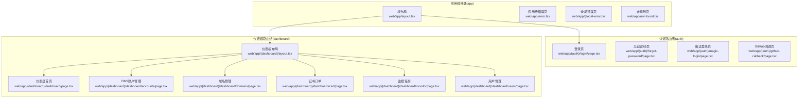
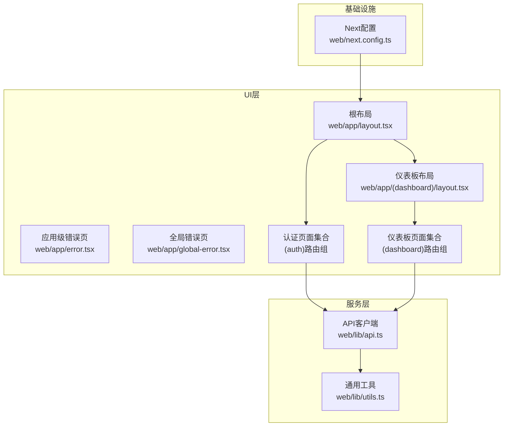
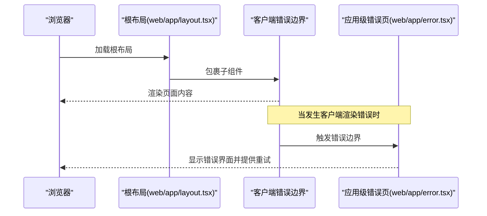
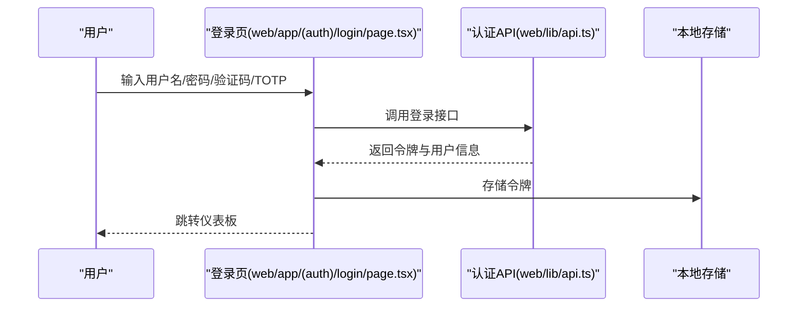
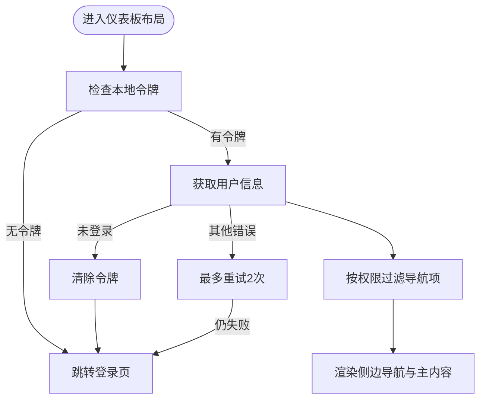
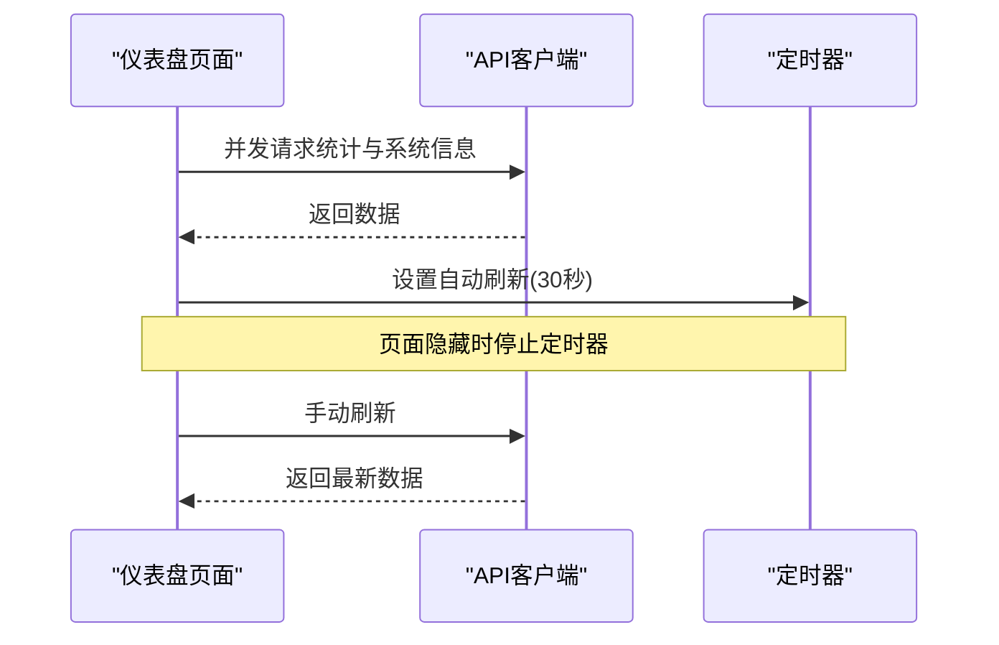
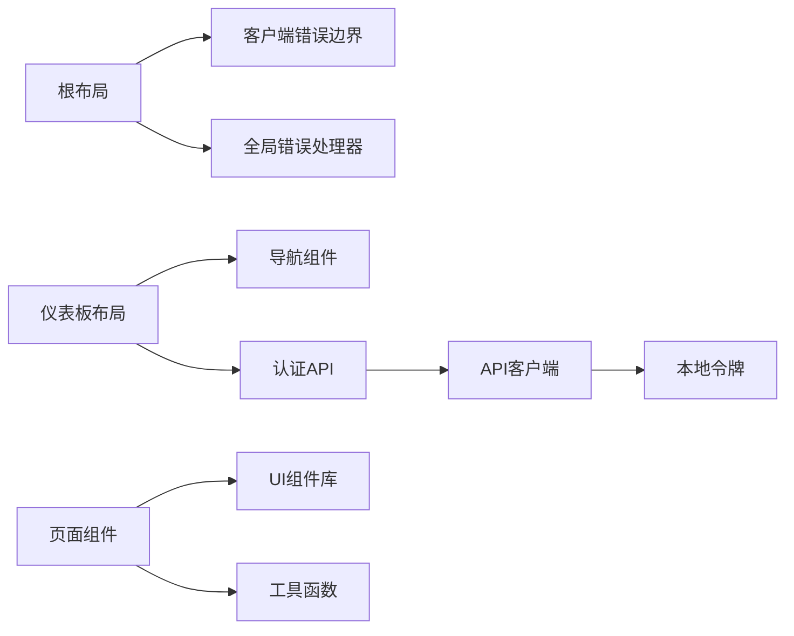

# Next.js应用结构

<cite>
**本文档引用的文件**
- [web/app/layout.tsx](file://web/app/layout.tsx)
- [web/app/error.tsx](file://web/app/error.tsx)
- [web/app/global-error.tsx](file://web/app/global-error.tsx)
- [web/app/not-found.tsx](file://web/app/not-found.tsx)
- [web/app/(dashboard)/layout.tsx](file://web/app/(dashboard)/layout.tsx)
- [web/app/(auth)/login/page.tsx](file://web/app/(auth)/login/page.tsx)
- [web/app/(dashboard)/dashboard/page.tsx](file://web/app/(dashboard)/dashboard/page.tsx)
- [web/components/client-error-boundary.tsx](file://web/components/client-error-boundary.tsx)
- [web/components/global-error-handler.tsx](file://web/components/global-error-handler.tsx)
- [web/lib/api.ts](file://web/lib/api.ts)
- [web/lib/utils.ts](file://web/lib/utils.ts)
- [web/next.config.ts](file://web/next.config.ts)
</cite>

## 目录
1. [简介](#简介)
2. [项目结构](#项目结构)
3. [核心组件](#核心组件)
4. [架构总览](#架构总览)
5. [详细组件分析](#详细组件分析)
6. [依赖关系分析](#依赖关系分析)
7. [性能考虑](#性能考虑)
8. [故障排除指南](#故障排除指南)
9. [结论](#结论)

## 简介
本文件面向DNSPlane的Next.js前端应用，系统性梳理基于App Router的文件系统路由架构，涵盖页面路由、嵌套路由与路由组的组织方式；详解app目录下的布局系统与共享组件；阐释认证路由组与仪表板路由组的设计理念；总结全局布局、错误边界与加载状态的实现模式；说明TypeScript配置与类型安全最佳实践；并提供路由守卫、权限控制与导航优化的实现细节，以及路由性能优化与SEO友好配置建议。

## 项目结构
DNSPlane采用Next.js App Router的文件系统路由，通过路由组对功能域进行逻辑隔离，并在app根目录统一管理全局布局与错误处理。认证相关页面位于(auth)路由组，仪表板相关页面位于(dashboard)路由组，二者共享各自的布局与通用UI组件。

**图表来源**
- [web/app/layout.tsx:1-34](file://web/app/layout.tsx#L1-L34)
- [web/app/error.tsx:1-98](file://web/app/error.tsx#L1-L98)
- [web/app/global-error.tsx:1-102](file://web/app/global-error.tsx#L1-L102)
- [web/app/not-found.tsx:1-65](file://web/app/not-found.tsx#L1-L65)
- [web/app/(auth)/login/page.tsx:1-292](file://web/app/(auth)/login/page.tsx#L1-L292)
- [web/app/(dashboard)/layout.tsx:1-391](file://web/app/(dashboard)/layout.tsx#L1-L391)
- [web/app/(dashboard)/dashboard/page.tsx:1-578](file://web/app/(dashboard)/dashboard/page.tsx#L1-L578)

**章节来源**
- [web/app/layout.tsx:1-34](file://web/app/layout.tsx#L1-L34)
- [web/app/(auth)/login/page.tsx:1-292](file://web/app/(auth)/login/page.tsx#L1-L292)
- [web/app/(dashboard)/layout.tsx:1-391](file://web/app/(dashboard)/layout.tsx#L1-L391)

## 核心组件
- 全局布局与元数据：根布局负责注入全局样式、国际化语言、全局错误处理与通知组件，定义站点元信息。
- 应用级错误页：捕获客户端渲染错误，提供重试与返回首页能力。
- 全局错误页：当根布局自身崩溃时的最终兜底错误页面。
- 未找到页：处理404场景，提供返回上一页与首页导航。
- 认证路由组：集中处理登录、注册、忘记密码、第三方登录回调等认证流程。
- 仪表板路由组：提供统一的侧边导航、顶部用户菜单、权限过滤与路由守卫。

**章节来源**
- [web/app/layout.tsx:1-34](file://web/app/layout.tsx#L1-L34)
- [web/app/error.tsx:1-98](file://web/app/error.tsx#L1-L98)
- [web/app/global-error.tsx:1-102](file://web/app/global-error.tsx#L1-L102)
- [web/app/not-found.tsx:1-65](file://web/app/not-found.tsx#L1-L65)

## 架构总览
DNSPlane的前端采用分层架构：UI层（页面与组件）、服务层（API封装）、工具层（通用工具函数）。路由组作为功能域边界，分别承载认证与业务功能；全局布局与错误处理贯穿所有路由组，确保一致的用户体验与健壮性。

**图表来源**
- [web/app/layout.tsx:1-34](file://web/app/layout.tsx#L1-L34)
- [web/app/error.tsx:1-98](file://web/app/error.tsx#L1-L98)
- [web/app/global-error.tsx:1-102](file://web/app/global-error.tsx#L1-L102)
- [web/app/(auth)/login/page.tsx:1-292](file://web/app/(auth)/login/page.tsx#L1-L292)
- [web/app/(dashboard)/layout.tsx:1-391](file://web/app/(dashboard)/layout.tsx#L1-L391)
- [web/lib/api.ts:1-686](file://web/lib/api.ts#L1-L686)
- [web/lib/utils.ts:1-129](file://web/lib/utils.ts#L1-L129)
- [web/next.config.ts:1-16](file://web/next.config.ts#L1-L16)

## 详细组件分析

### 根布局与全局错误处理
- 根布局负责注入全局样式、Suspense包裹的进度条、客户端错误边界与全局错误处理器，同时定义站点元信息。
- 应用级错误页用于捕获客户端渲染错误，提供重试与返回首页能力。
- 全局错误页在根布局自身崩溃时作为最终兜底，必须自带<html>与<body>标签。

**图表来源**
- [web/app/layout.tsx:14-33](file://web/app/layout.tsx#L14-L33)
- [web/components/client-error-boundary.tsx:1-8](file://web/components/client-error-boundary.tsx#L1-L8)
- [web/app/error.tsx:9-97](file://web/app/error.tsx#L9-L97)

**章节来源**
- [web/app/layout.tsx:1-34](file://web/app/layout.tsx#L1-L34)
- [web/app/error.tsx:1-98](file://web/app/error.tsx#L1-L98)
- [web/app/global-error.tsx:1-102](file://web/app/global-error.tsx#L1-L102)

### 认证路由组设计
- 路由组(auth)用于隔离认证相关页面，包含登录、注册、忘记密码、魔法登录、OAuth回调等。
- 登录页实现了安装检测、验证码加载、TOTP二次验证、表单校验与错误提示等完整流程。
- 通过authApi与api封装调用后端接口，统一处理登录态与错误反馈。

**图表来源**
- [web/app/(auth)/login/page.tsx:14-292](file://web/app/(auth)/login/page.tsx#L14-L292)
- [web/lib/api.ts:112-123](file://web/lib/api.ts#L112-L123)

**章节来源**
- [web/app/(auth)/login/page.tsx:1-292](file://web/app/(auth)/login/page.tsx#L1-L292)
- [web/lib/api.ts:1-686](file://web/lib/api.ts#L1-L686)

### 仪表板路由组与权限控制
- 仪表板布局提供统一侧边导航、顶部用户菜单与权限过滤，支持嵌套菜单与动态展开。
- 通过hasModuleAccess与用户权限、管理员等级进行权限判断，动态过滤导航项。
- 实现路由守卫：若无令牌或用户信息获取失败则跳转登录；兼容旧版OAuth重定向参数清理。

**图表来源**
- [web/app/(dashboard)/layout.tsx:77-160](file://web/app/(dashboard)/layout.tsx#L77-L160)
- [web/lib/utils.ts:117-129](file://web/lib/utils.ts#L117-L129)

**章节来源**
- [web/app/(dashboard)/layout.tsx:1-391](file://web/app/(dashboard)/layout.tsx#L1-L391)
- [web/lib/utils.ts:1-129](file://web/lib/utils.ts#L1-L129)

### 仪表盘页面与数据加载策略
- 仪表盘首页实现并发请求统计与系统信息，支持手动刷新与自动刷新（页面隐藏时暂停，显示时恢复）。
- 使用骨架屏提升首屏体验，格式化时间与字节单位，提供快捷操作入口与系统信息展示。

**图表来源**
- [web/app/(dashboard)/dashboard/page.tsx:33-84](file://web/app/(dashboard)/dashboard/page.tsx#L33-L84)
- [web/lib/api.ts:277-280](file://web/lib/api.ts#L277-L280)

**章节来源**
- [web/app/(dashboard)/dashboard/page.tsx:1-578](file://web/app/(dashboard)/dashboard/page.tsx#L1-L578)
- [web/lib/api.ts:1-686](file://web/lib/api.ts#L1-L686)

## 依赖关系分析
- 组件依赖：根布局依赖客户端错误边界与全局错误处理器；仪表板布局依赖导航组件与API客户端；页面组件依赖UI组件库与工具函数。
- 数据流：页面通过API客户端发起请求，API客户端负责令牌管理、错误处理与响应解析；工具函数提供权限判断与格式化。
- 配置影响：Next配置禁用TS构建错误阻断，导出静态构建，图片未优化以适配静态托管。

**图表来源**
- [web/app/layout.tsx:14-33](file://web/app/layout.tsx#L14-L33)
- [web/components/client-error-boundary.tsx:1-8](file://web/components/client-error-boundary.tsx#L1-L8)
- [web/components/global-error-handler.tsx:1-59](file://web/components/global-error-handler.tsx#L1-L59)
- [web/app/(dashboard)/layout.tsx:77-160](file://web/app/(dashboard)/layout.tsx#L77-L160)
- [web/lib/api.ts:18-31](file://web/lib/api.ts#L18-L31)
- [web/lib/utils.ts:117-129](file://web/lib/utils.ts#L117-L129)

**章节来源**
- [web/next.config.ts:1-16](file://web/next.config.ts#L1-L16)
- [web/lib/api.ts:1-686](file://web/lib/api.ts#L1-L686)
- [web/lib/utils.ts:1-129](file://web/lib/utils.ts#L1-L129)

## 性能考虑
- 静态导出与图片优化：Next配置为静态导出并关闭图片优化，适合静态托管部署，减少运行时开销。
- 自动刷新与可见性：仪表盘页面在页面不可见时暂停定时器，可见时恢复，降低后台消耗。
- 骨架屏与并发请求：页面首次加载使用骨架屏提升感知性能，使用Promise.all并发请求减少等待时间。
- 本地令牌与重试策略：API客户端在401时清理令牌并跳转登录，避免无效请求；仪表板布局对用户信息获取进行有限重试，提升稳定性。

**章节来源**
- [web/next.config.ts:3-13](file://web/next.config.ts#L3-L13)
- [web/app/(dashboard)/dashboard/page.tsx:60-84](file://web/app/(dashboard)/dashboard/page.tsx#L60-L84)
- [web/lib/api.ts:57-69](file://web/lib/api.ts#L57-L69)
- [web/app/(dashboard)/layout.tsx:117-152](file://web/app/(dashboard)/layout.tsx#L117-L152)

## 故障排除指南
- 客户端错误：客户端错误边界捕获渲染错误，应用级错误页提供重试与返回首页；全局错误处理器监听window.onerror与unhandledrejection，过滤常见误报并以toast提示用户。
- 未找到页面：未找到页提供返回上一页与首页导航，便于用户快速回到有效路径。
- 登录失败：登录页根据后端返回码区分验证码错误、TOTP缺失、网络异常等情况，动态刷新验证码并提示用户。
- 权限不足：仪表板布局按用户等级与模块权限过滤导航项，避免访问无权限的功能。

**章节来源**
- [web/components/global-error-handler.tsx:1-59](file://web/components/global-error-handler.tsx#L1-L59)
- [web/app/error.tsx:1-98](file://web/app/error.tsx#L1-L98)
- [web/app/not-found.tsx:1-65](file://web/app/not-found.tsx#L1-L65)
- [web/app/(auth)/login/page.tsx:109-157](file://web/app/(auth)/login/page.tsx#L109-L157)
- [web/app/(dashboard)/layout.tsx:196-215](file://web/app/(dashboard)/layout.tsx#L196-L215)

## 结论
DNSPlane的Next.js应用通过路由组清晰划分认证与业务功能域，结合全局布局与错误处理机制，提供了稳定一致的用户体验。API客户端统一处理令牌与错误，工具函数支撑权限与格式化，页面组件聚焦业务逻辑与交互。在性能方面，静态导出、自动刷新与并发请求等策略提升了可用性与效率。建议在后续迭代中完善TS严格模式配置与SEO元数据，进一步增强类型安全与搜索引擎友好度。