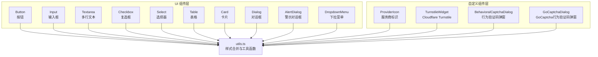
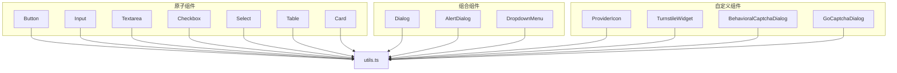
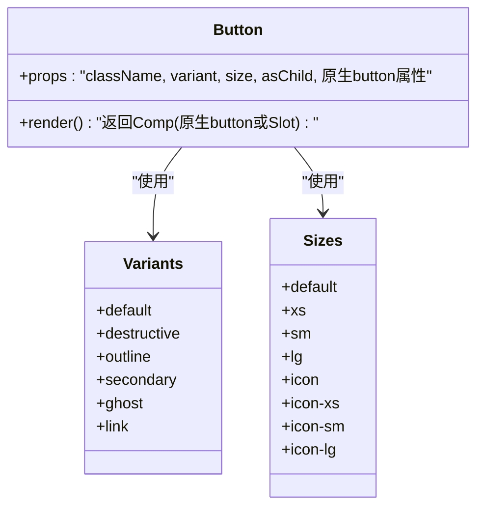
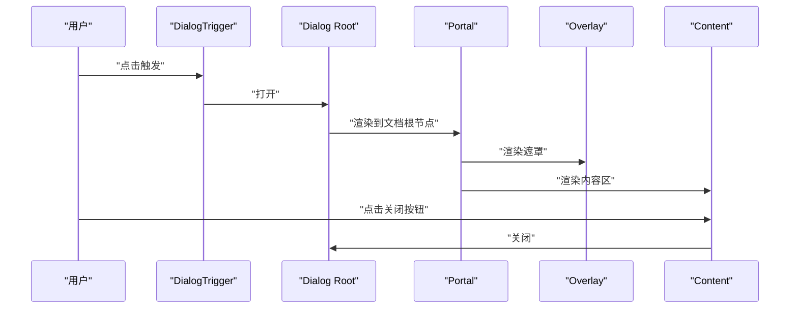
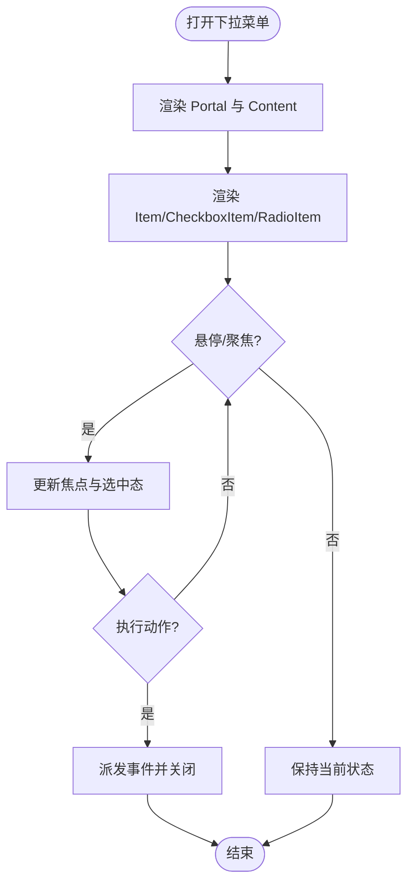
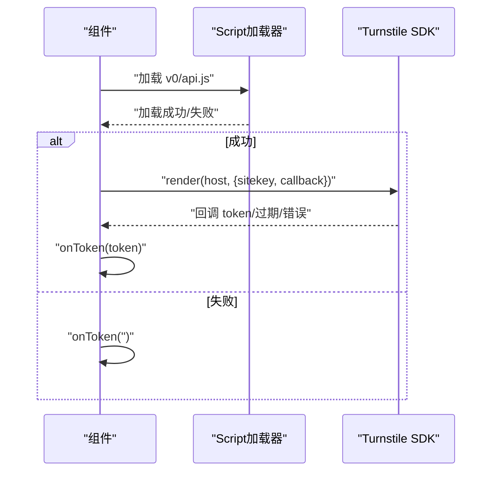
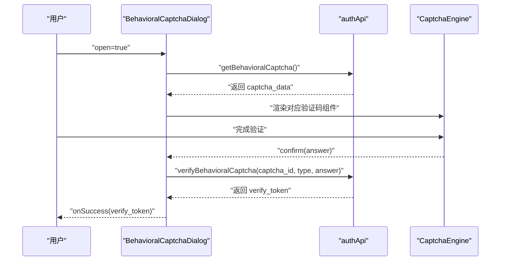
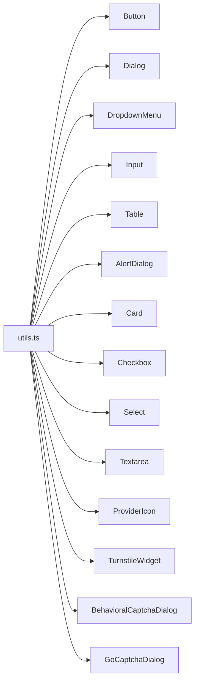

# UI组件库

<cite>
**本文引用的文件**
- [button.tsx](file://web/components/ui/button.tsx)
- [dialog.tsx](file://web/components/ui/dialog.tsx)
- [dropdown-menu.tsx](file://web/components/ui/dropdown-menu.tsx)
- [input.tsx](file://web/components/ui/input.tsx)
- [table.tsx](file://web/components/ui/table.tsx)
- [alert-dialog.tsx](file://web/components/ui/alert-dialog.tsx)
- [card.tsx](file://web/components/ui/card.tsx)
- [checkbox.tsx](file://web/components/ui/checkbox.tsx)
- [select.tsx](file://web/components/ui/select.tsx)
- [textarea.tsx](file://web/components/ui/textarea.tsx)
- [provider-icon.tsx](file://web/components/provider-icon.tsx)
- [turnstile-widget.tsx](file://web/components/turnstile-widget.tsx)
- [captcha-dialog.tsx](file://web/components/captcha-dialog.tsx)
- [go-captcha-dialog.tsx](file://web/components/go-captcha-dialog.tsx)
- [utils.ts](file://web/lib/utils.ts)
</cite>

## 目录
1. [简介](#简介)
2. [项目结构](#项目结构)
3. [核心组件](#核心组件)
4. [架构总览](#架构总览)
5. [详细组件分析](#详细组件分析)
6. [依赖关系分析](#依赖关系分析)
7. [性能考量](#性能考量)
8. [故障排查指南](#故障排查指南)
9. [结论](#结论)
10. [附录](#附录)

## 简介
本文件系统性梳理 DNSPlane 前端 Web 应用中的 UI 组件库，基于 Radix UI 与 Tailwind CSS 构建，覆盖基础按钮、输入框、对话框、下拉菜单、表格等通用组件，以及行为验证码弹窗、Turnstile 独立人机验证、服务商标识等自定义组件。文档从架构、数据流、处理逻辑、可访问性与键盘导航、主题定制与样式覆盖、响应式设计、组合模式与最佳实践、测试与文档生成等方面进行深入解析，并提供可视化图示帮助理解。

## 项目结构
UI 组件主要位于 web/components/ui 目录，采用“按功能分层 + 组件原子化”的组织方式：
- 基础组件：button、input、textarea、checkbox、select、table、card、alert-dialog、dialog、dropdown-menu 等
- 自定义组件：provider-icon、turnstile-widget、captcha-dialog、go-captcha-dialog
- 工具函数：web/lib/utils.ts 提供 cn 合并工具与常用格式化函数

**图表来源**
- [button.tsx:1-65](file://web/components/ui/button.tsx#L1-L65)
- [input.tsx:1-22](file://web/components/ui/input.tsx#L1-L22)
- [textarea.tsx:1-19](file://web/components/ui/textarea.tsx#L1-L19)
- [checkbox.tsx:1-33](file://web/components/ui/checkbox.tsx#L1-L33)
- [select.tsx:1-191](file://web/components/ui/select.tsx#L1-L191)
- [table.tsx:1-117](file://web/components/ui/table.tsx#L1-L117)
- [card.tsx:1-93](file://web/components/ui/card.tsx#L1-L93)
- [dialog.tsx:1-159](file://web/components/ui/dialog.tsx#L1-L159)
- [alert-dialog.tsx:1-197](file://web/components/ui/alert-dialog.tsx#L1-L197)
- [dropdown-menu.tsx:1-258](file://web/components/ui/dropdown-menu.tsx#L1-L258)
- [provider-icon.tsx:1-313](file://web/components/provider-icon.tsx#L1-L313)
- [turnstile-widget.tsx:1-114](file://web/components/turnstile-widget.tsx#L1-L114)
- [captcha-dialog.tsx:1-234](file://web/components/captcha-dialog.tsx#L1-L234)
- [go-captcha-dialog.tsx:1-234](file://web/components/go-captcha-dialog.tsx#L1-L234)
- [utils.ts:1-129](file://web/lib/utils.ts#L1-L129)

**章节来源**
- [button.tsx:1-65](file://web/components/ui/button.tsx#L1-L65)
- [dialog.tsx:1-159](file://web/components/ui/dialog.tsx#L1-L159)
- [dropdown-menu.tsx:1-258](file://web/components/ui/dropdown-menu.tsx#L1-L258)
- [input.tsx:1-22](file://web/components/ui/input.tsx#L1-L22)
- [table.tsx:1-117](file://web/components/ui/table.tsx#L1-L117)
- [alert-dialog.tsx:1-197](file://web/components/ui/alert-dialog.tsx#L1-L197)
- [card.tsx:1-93](file://web/components/ui/card.tsx#L1-L93)
- [checkbox.tsx:1-33](file://web/components/ui/checkbox.tsx#L1-L33)
- [select.tsx:1-191](file://web/components/ui/select.tsx#L1-L191)
- [textarea.tsx:1-19](file://web/components/ui/textarea.tsx#L1-L19)
- [provider-icon.tsx:1-313](file://web/components/provider-icon.tsx#L1-L313)
- [turnstile-widget.tsx:1-114](file://web/components/turnstile-widget.tsx#L1-L114)
- [captcha-dialog.tsx:1-234](file://web/components/captcha-dialog.tsx#L1-L234)
- [go-captcha-dialog.tsx:1-234](file://web/components/go-captcha-dialog.tsx#L1-L234)
- [utils.ts:1-129](file://web/lib/utils.ts#L1-L129)

## 核心组件
本节对关键 UI 组件进行深入剖析，包括组件职责、属性接口、事件处理、状态管理、样式与主题定制、可访问性与键盘导航要点。

- Button（按钮）
  - 职责：统一的交互入口，支持多种变体与尺寸，支持作为容器（asChild）包裹原生按钮或链接。
  - 关键特性：使用 class-variance-authority 定义变体与尺寸；通过 data-slot 与 data-* 属性暴露语义化标记；集成焦点可见性与无效态样式。
  - 属性接口：className、variant、size、asChild、原生 button 属性。
  - 事件处理：透传原生事件；支持通过 asChild 与上层组合形成点击行为。
  - 主题与样式：基于 Tailwind 类与暗色模式变量；支持 aria-invalid 与 focus-visible ring。
  - 可访问性：内置焦点环与可聚焦性；建议配合 Label 使用以提升可访问性。

- Dialog（对话框）
  - 职责：模态对话框容器，包含 Overlay、Portal、Content、Header/Footer、Title/Description、Trigger/Close 等子组件。
  - 关键特性：基于 Radix UI 的受控/非受控状态；支持动画入场/出场；支持关闭按钮与 Footer 按钮组合。
  - 属性接口：Root/Trigger/Portal/Overlay/Content/Header/Footer/Title/Description/Close 的 props；Content 支持 showCloseButton 控制关闭按钮显隐。
  - 事件处理：通过 Radix UI 的 onOpenChange 与原生事件协作；Footer 中可直接使用 Button 组合。
  - 主题与样式：基于 Tailwind 类；Content 支持响应式最大宽度与居中定位。
  - 可访问性：自动管理焦点；关闭按钮包含 sr-only 文本；建议提供标题与描述。

- DropdownMenu（下拉菜单）
  - 职责：上下文菜单与选项组，支持复选/单选项、子菜单、快捷键提示等。
  - 关键特性：基于 Radix UI；支持 inset、variant、侧向动画；支持 ItemIndicator 显示选中态。
  - 属性接口：Root/Portal/Trigger/Content/Group/Label/Item/CheckboxItem/RadioGroup/RadioItem/Separator/Shortcut/Sub/SubTrigger/SubContent 等。
  - 事件处理：通过原生事件与 Radix 状态联动；支持子菜单展开/收起。
  - 主题与样式：Popover 背景与边框；支持侧向 slide-in 动画。
  - 可访问性：自动焦点管理；键盘导航支持；建议为快捷键提供可见提示。

- Input（输入框）
  - 职责：基础文本输入，支持禁用、无效态、占位符与选择态样式。
  - 关键特性：统一的边框、阴影、聚焦 ring；支持 aria-invalid 与 focus-visible ring。
  - 属性接口：className、type、原生 input 属性。
  - 事件处理：透传原生事件；建议结合表单校验与反馈。
  - 主题与样式：基于 Tailwind 类；暗色模式适配。
  - 可访问性：建议与 Label 配合；支持键盘导航与屏幕阅读器。

- Table（表格）
  - 职责：响应式表格容器与子元素（thead/tbody/tfoot/tr/th/td/caption），支持悬停与选中态。
  - 关键特性：容器层提供横向滚动；tr 支持 hover 与 selected 状态；th/td 内含复选框时调整间距。
  - 属性接口：Table/TableHeader/TableBody/TableFooter/TableRow/TableHead/TableCell/TableCaption 的 props。
  - 事件处理：主要用于渲染；状态由上层控制（如选中）。
  - 主题与样式：基于 Tailwind 类；支持 hover 与 border 样式。
  - 可访问性：建议提供 caption 与 role=checkbox 的复选框语义。

- AlertDialog（警示对话框）
  - 职责：强调操作的确认/取消流程，支持媒体区域与尺寸变体。
  - 关键特性：基于 Radix UI；Content 支持 default/sm 尺寸；Header/Footer 布局随尺寸变化。
  - 属性接口：Root/Portal/Overlay/Content/Header/Footer/Title/Description/Media/Action/Cancel 的 props；Action/Cancel 支持 variant/size 组合。
  - 事件处理：Action/Cancel 通过 asChild 组合 Button；Content 的 size 影响布局。
  - 主题与样式：基于 Tailwind 类；响应式布局。
  - 可访问性：自动焦点管理；建议提供标题与描述。

- Card（卡片）
  - 职责：内容区块容器，支持 Header/Title/Description/Action/Content/Footer。
  - 关键特性：Header 支持 action 区域网格布局；Footer 支持边框线。
  - 属性接口：Card/CardHeader/CardTitle/CardDescription/CardAction/CardContent/CardFooter 的 props。
  - 事件处理：主要用于渲染；状态由上层控制。
  - 主题与样式：基于 Tailwind 类；支持 @container 响应式断点。
  - 可访问性：建议提供语义化标题与描述。

- Checkbox（复选框）
  - 职责：二元选择控件，支持禁用与无效态。
  - 关键特性：Indicator 显示勾选图标；支持 focus-visible ring 与 aria-invalid。
  - 属性接口：className、原生 checkbox 属性。
  - 事件处理：透传原生事件。
  - 主题与样式：基于 Tailwind 类；暗色模式适配。
  - 可访问性：原生控件语义；建议与 Label 配合。

- Select（选择器）
  - 职责：下拉选择，支持分组、标签、滚动按钮、指示器等。
  - 关键特性：Trigger 支持 size；Content 支持 popper/item-aligned 位置；Viewport 自适应高度。
  - 属性接口：Root/Group/Value/Trigger/Content/Label/Item/Separator/ScrollUpButton/ScrollDownButton 的 props；Trigger 支持 size。
  - 事件处理：通过原生事件与 Radix 状态联动。
  - 主题与样式：基于 Tailwind 类；支持侧向 slide-in 动画。
  - 可访问性：原生控件语义；建议提供可见的快捷键提示。

- Textarea（多行文本）
  - 职责：多行文本输入，支持禁用与无效态。
  - 关键特性：统一的边框、阴影、聚焦 ring；支持 aria-invalid 与 focus-visible ring。
  - 属性接口：className、原生 textarea 属性。
  - 事件处理：透传原生事件。
  - 主题与样式：基于 Tailwind 类；暗色模式适配。
  - 可访问性：建议与 Label 配合。

**章节来源**
- [button.tsx:1-65](file://web/components/ui/button.tsx#L1-L65)
- [dialog.tsx:1-159](file://web/components/ui/dialog.tsx#L1-L159)
- [dropdown-menu.tsx:1-258](file://web/components/ui/dropdown-menu.tsx#L1-L258)
- [input.tsx:1-22](file://web/components/ui/input.tsx#L1-L22)
- [table.tsx:1-117](file://web/components/ui/table.tsx#L1-L117)
- [alert-dialog.tsx:1-197](file://web/components/ui/alert-dialog.tsx#L1-L197)
- [card.tsx:1-93](file://web/components/ui/card.tsx#L1-L93)
- [checkbox.tsx:1-33](file://web/components/ui/checkbox.tsx#L1-L33)
- [select.tsx:1-191](file://web/components/ui/select.tsx#L1-L191)
- [textarea.tsx:1-19](file://web/components/ui/textarea.tsx#L1-L19)

## 架构总览
UI 组件库整体采用“原子组件 + 组合组件 + 自定义业务组件”的分层架构：
- 原子组件：Button、Input、Textarea、Checkbox、Select、Table、Card 等，负责最小可用功能与样式。
- 组合组件：Dialog、AlertDialog、DropdownMenu 等，基于 Radix UI 扩展语义与交互。
- 自定义组件：ProviderIcon、TurnstileWidget、BehavioralCaptchaDialog、GoCaptchaDialog 等，封装业务逻辑与第三方 SDK。

**图表来源**
- [button.tsx:1-65](file://web/components/ui/button.tsx#L1-L65)
- [input.tsx:1-22](file://web/components/ui/input.tsx#L1-L22)
- [textarea.tsx:1-19](file://web/components/ui/textarea.tsx#L1-L19)
- [checkbox.tsx:1-33](file://web/components/ui/checkbox.tsx#L1-L33)
- [select.tsx:1-191](file://web/components/ui/select.tsx#L1-L191)
- [table.tsx:1-117](file://web/components/ui/table.tsx#L1-L117)
- [card.tsx:1-93](file://web/components/ui/card.tsx#L1-L93)
- [dialog.tsx:1-159](file://web/components/ui/dialog.tsx#L1-L159)
- [alert-dialog.tsx:1-197](file://web/components/ui/alert-dialog.tsx#L1-L197)
- [dropdown-menu.tsx:1-258](file://web/components/ui/dropdown-menu.tsx#L1-L258)
- [provider-icon.tsx:1-313](file://web/components/provider-icon.tsx#L1-L313)
- [turnstile-widget.tsx:1-114](file://web/components/turnstile-widget.tsx#L1-L114)
- [captcha-dialog.tsx:1-234](file://web/components/captcha-dialog.tsx#L1-L234)
- [go-captcha-dialog.tsx:1-234](file://web/components/go-captcha-dialog.tsx#L1-L234)
- [utils.ts:1-129](file://web/lib/utils.ts#L1-L129)

## 详细组件分析

### Button（按钮）组件
- 设计模式：基于 class-variance-authority 的变体与尺寸系统；Slot 容器模式支持 asChild。
- 数据结构与复杂度：无复杂数据结构；样式计算为 O(n) 字符串拼接。
- 依赖链：依赖 Radix Slot、class-variance-authority、cn 工具。
- 错误处理：通过 aria-invalid 与 focus-visible ring 提示无效状态。
- 性能影响：样式计算轻量；避免在渲染路径中频繁创建新对象。

**图表来源**
- [button.tsx:7-39](file://web/components/ui/button.tsx#L7-L39)

**章节来源**
- [button.tsx:1-65](file://web/components/ui/button.tsx#L1-L65)

### Dialog（对话框）组件
- 设计模式：组合多个 Radix UI 原子组件，提供语义化 data-slot 标记与默认样式。
- 数据流：Root 管理全局状态；Portal 渲染至文档根节点；Overlay/Content 控制外观与动画。
- 事件处理：onOpenChange 与原生事件协作；Footer 可组合 Button 实现确认/取消。
- 状态管理：外部通过 open 控制；内部通过 Close 触发关闭。

**图表来源**
- [dialog.tsx:10-82](file://web/components/ui/dialog.tsx#L10-L82)

**章节来源**
- [dialog.tsx:1-159](file://web/components/ui/dialog.tsx#L1-L159)

### DropdownMenu（下拉菜单）组件
- 设计模式：基于 Radix UI 的 Menu 原子组件，扩展 inset、variant、子菜单等能力。
- 数据流：Root 管理状态；Portal 渲染 Content；Item/CheckboxItem/RadioItem 支持 Indicator。
- 事件处理：通过原生事件与 Radix 状态联动；支持子菜单 SubTrigger/SubContent。
- 状态管理：外部通过 open/close 控制；内部通过 ItemIndicator 显示选中态。

**图表来源**
- [dropdown-menu.tsx:34-83](file://web/components/ui/dropdown-menu.tsx#L34-L83)

**章节来源**
- [dropdown-menu.tsx:1-258](file://web/components/ui/dropdown-menu.tsx#L1-L258)

### Input（输入框）组件
- 设计模式：原生 input 包装，统一边框、阴影、聚焦 ring 与无效态样式。
- 数据流：props 透传；样式通过 cn 合并；支持 aria-invalid 与 focus-visible ring。
- 事件处理：透传原生 onChange/onBlur 等事件。
- 状态管理：外部通过受控/非受控 value 管理；内部通过 invalid/focus-visible 状态提示。

**章节来源**
- [input.tsx:1-22](file://web/components/ui/input.tsx#L1-L22)

### Table（表格）组件
- 设计模式：容器层提供横向滚动；子元素统一类名与状态类（hover/selected）。
- 数据流：外部传入数据；组件负责渲染结构与样式。
- 事件处理：主要用于渲染；状态由上层控制（如选中）。
- 状态管理：通过 data-state 与类名映射实现 hover/selected。

**章节来源**
- [table.tsx:1-117](file://web/components/ui/table.tsx#L1-L117)

### AlertDialog（警示对话框）组件
- 设计模式：基于 Dialog 的警示变体，支持媒体区域与尺寸变体。
- 数据流：Root 管理状态；Content 根据 size 切换布局；Action/Cancel 组合 Button。
- 事件处理：Action/Cancel 通过 asChild 组合 Button；Content 的 size 影响布局。
- 状态管理：外部通过 open 控制；内部通过 Close 触发关闭。

**章节来源**
- [alert-dialog.tsx:1-197](file://web/components/ui/alert-dialog.tsx#L1-L197)

### Card（卡片）组件
- 设计模式：容器组件，支持 Header/Title/Description/Action/Content/Footer。
- 数据流：外部传入内容；组件负责结构与样式。
- 事件处理：主要用于渲染；状态由上层控制。
- 状态管理：无内部状态；通过 data-slot 与类名映射实现布局。

**章节来源**
- [card.tsx:1-93](file://web/components/ui/card.tsx#L1-L93)

### Checkbox（复选框）组件
- 设计模式：原生 checkbox 包装，统一样式与指示器。
- 数据流：props 透传；Indicator 显示勾选图标；支持 aria-invalid 与 focus-visible ring。
- 事件处理：透传原生事件。
- 状态管理：外部通过 checked/indeterminate 控制；内部通过 data-state 映射。

**章节来源**
- [checkbox.tsx:1-33](file://web/components/ui/checkbox.tsx#L1-L33)

### Select（选择器）组件
- 设计模式：基于 Radix UI 的 Select 原子组件，扩展 Trigger/Content/Item 等。
- 数据流：Root 管理状态；Portal 渲染 Content；Viewport 自适应高度。
- 事件处理：通过原生事件与 Radix 状态联动；支持 ScrollUpButton/ScrollDownButton。
- 状态管理：外部通过 value 控制；内部通过 ItemIndicator 显示选中态。

**章节来源**
- [select.tsx:1-191](file://web/components/ui/select.tsx#L1-L191)

### Textarea（多行文本）组件
- 设计模式：原生 textarea 包装，统一边框、阴影、聚焦 ring 与无效态样式。
- 数据流：props 透传；样式通过 cn 合并；支持 aria-invalid 与 focus-visible ring。
- 事件处理：透传原生 onChange/onBlur 等事件。
- 状态管理：外部通过受控/非受控 value 管理；内部通过 invalid/focus-visible 状态提示。

**章节来源**
- [textarea.tsx:1-19](file://web/components/ui/textarea.tsx#L1-L19)

### 自定义组件

#### ProviderIcon（服务商标识）
- 职责：根据类型渲染带颜色与背景的服务商标识，支持 Badge 样式。
- 接口：type（必填）、size（sm/md/lg）、showName（是否显示名称）、className。
- 主题与样式：基于 providerConfig 的颜色与背景类；支持暗色模式类名。
- 最佳实践：优先使用内置类型；未匹配时回退到通用配置。

**章节来源**
- [provider-icon.tsx:1-313](file://web/components/provider-icon.tsx#L1-L313)

#### TurnstileWidget（Cloudflare Turnstile）
- 职责：独立加载 Cloudflare Turnstile SDK 并渲染人机验证 Widget。
- 接口：siteKey（必填）、onToken（回调）、refreshSignal（刷新信号）、disabled（禁用）、label（标签）。
- 生命周期：首次挂载加载脚本；卸载时移除 Widget；支持禁用状态清空 token。
- 错误处理：脚本加载失败或 SDK 不可用时回调空 token；禁用时清空 token。

**图表来源**
- [turnstile-widget.tsx:6-97](file://web/components/turnstile-widget.tsx#L6-L97)

**章节来源**
- [turnstile-widget.tsx:1-114](file://web/components/turnstile-widget.tsx#L1-L114)

#### BehavioralCaptchaDialog（行为验证码弹窗）
- 职责：支持点选/滑动/旋转三种行为验证码，通过弹窗展示，验证通过后返回 verify_token。
- 接口：open（受控开关）、onClose（关闭回调）、onSuccess（成功回调）。
- 生命周期：open=true 时加载验证码；open=false 或卸载时清理状态；支持刷新与错误提示。
- 数据流：authApi 获取验证码 -> 渲染对应组件 -> 提交验证 -> 成功回调。

**图表来源**
- [captcha-dialog.tsx:40-115](file://web/components/captcha-dialog.tsx#L40-L115)

**章节来源**
- [captcha-dialog.tsx:1-234](file://web/components/captcha-dialog.tsx#L1-L234)

#### GoCaptchaDialog（GoCaptcha行为验证码弹窗）
- 职责：与 BehavioralCaptchaDialog 类似，但使用 GoCaptcha SDK。
- 接口：open、onClose、onSuccess。
- 生命周期：open=true 时加载验证码；open=false 或卸载时清理状态；支持刷新与错误提示。
- 数据流：authApi 获取验证码 -> 渲染对应组件 -> 提交验证 -> 成功回调。

**章节来源**
- [go-captcha-dialog.tsx:1-234](file://web/components/go-captcha-dialog.tsx#L1-L234)

## 依赖关系分析
- 组件间耦合：所有 UI 组件均依赖 utils.ts 的 cn 工具；部分组合组件依赖 Button。
- 外部依赖：Radix UI（dialog、dropdown-menu、select、checkbox 等）、Lucide Icons、class-variance-authority、Tailwind CSS。
- 潜在循环依赖：未发现组件间循环导入；自定义组件通过 API 与外部 SDK 交互，不引入循环。

**图表来源**
- [utils.ts:1-6](file://web/lib/utils.ts#L1-L6)
- [button.tsx:1-6](file://web/components/ui/button.tsx#L1-L6)
- [dialog.tsx:1-8](file://web/components/ui/dialog.tsx#L1-L8)
- [dropdown-menu.tsx:1-7](file://web/components/ui/dropdown-menu.tsx#L1-L7)
- [input.tsx:1-3](file://web/components/ui/input.tsx#L1-L3)
- [table.tsx:1-5](file://web/components/ui/table.tsx#L1-L5)
- [alert-dialog.tsx:1-7](file://web/components/ui/alert-dialog.tsx#L1-L7)
- [card.tsx:1-3](file://web/components/ui/card.tsx#L1-L3)
- [checkbox.tsx:1-7](file://web/components/ui/checkbox.tsx#L1-L7)
- [select.tsx:1-7](file://web/components/ui/select.tsx#L1-L7)
- [textarea.tsx:1-3](file://web/components/ui/textarea.tsx#L1-L3)
- [provider-icon.tsx:1-3](file://web/components/provider-icon.tsx#L1-L3)
- [turnstile-widget.tsx:1-4](file://web/components/turnstile-widget.tsx#L1-L4)
- [captcha-dialog.tsx:1-9](file://web/components/captcha-dialog.tsx#L1-L9)
- [go-captcha-dialog.tsx:1-9](file://web/components/go-captcha-dialog.tsx#L1-L9)

**章节来源**
- [utils.ts:1-129](file://web/lib/utils.ts#L1-L129)
- [button.tsx:1-65](file://web/components/ui/button.tsx#L1-L65)
- [dialog.tsx:1-159](file://web/components/ui/dialog.tsx#L1-L159)
- [dropdown-menu.tsx:1-258](file://web/components/ui/dropdown-menu.tsx#L1-L258)
- [input.tsx:1-22](file://web/components/ui/input.tsx#L1-L22)
- [table.tsx:1-117](file://web/components/ui/table.tsx#L1-L117)
- [alert-dialog.tsx:1-197](file://web/components/ui/alert-dialog.tsx#L1-L197)
- [card.tsx:1-93](file://web/components/ui/card.tsx#L1-L93)
- [checkbox.tsx:1-33](file://web/components/ui/checkbox.tsx#L1-L33)
- [select.tsx:1-191](file://web/components/ui/select.tsx#L1-L191)
- [textarea.tsx:1-19](file://web/components/ui/textarea.tsx#L1-L19)
- [provider-icon.tsx:1-313](file://web/components/provider-icon.tsx#L1-L313)
- [turnstile-widget.tsx:1-114](file://web/components/turnstile-widget.tsx#L1-L114)
- [captcha-dialog.tsx:1-234](file://web/components/captcha-dialog.tsx#L1-L234)
- [go-captcha-dialog.tsx:1-234](file://web/components/go-captcha-dialog.tsx#L1-L234)

## 性能考量
- 样式合并：统一使用 cn 工具合并类名，避免重复与冲突；尽量减少运行时样式计算。
- 动画与渲染：Dialog/DropdownMenu/AlertDialog 使用 Radix UI 的动画系统，确保流畅过渡；避免在动画期间进行昂贵计算。
- 第三方 SDK：TurnstileWidget 仅在需要时加载脚本并缓存加载状态；卸载时移除 Widget，防止内存泄漏。
- 表格与滚动：Table 容器提供横向滚动，避免布局抖动；Select/Menu Content 支持滚动按钮，优化长列表体验。
- 受控组件：Input/Textarea/Select/Checkbox 等受控组件通过外部状态驱动，减少不必要的重渲染。

## 故障排查指南
- 对话框无法关闭或焦点异常
  - 检查 onOpenChange 与外部 open 状态同步；确认 DialogTrigger/Close 的使用正确。
  - 确认 Portal 是否正确渲染到文档根节点。
- 下拉菜单显示错位或不可见
  - 检查 Portal 与 Content 的渲染层级；确认 sideOffset 与 align 设置。
  - 确认 viewport 高度与 transform-origin 计算。
- 输入框无效态样式不生效
  - 检查 aria-invalid 与 focus-visible ring 的类名拼接；确认主题变量是否正确。
- 行为验证码加载失败
  - 检查 authApi 返回的数据结构；确认 captcha_type 与组件渲染分支。
  - 查看网络请求与控制台错误日志；确认刷新与重试逻辑。
- Turnstile Widget 未渲染
  - 检查 siteKey 是否为空；确认脚本加载成功且 SDK 存在。
  - 查看回调函数是否被正确调用；确认禁用状态下的清理逻辑。

**章节来源**
- [dialog.tsx:1-159](file://web/components/ui/dialog.tsx#L1-L159)
- [dropdown-menu.tsx:1-258](file://web/components/ui/dropdown-menu.tsx#L1-L258)
- [input.tsx:1-22](file://web/components/ui/input.tsx#L1-L22)
- [captcha-dialog.tsx:1-234](file://web/components/captcha-dialog.tsx#L1-L234)
- [turnstile-widget.tsx:1-114](file://web/components/turnstile-widget.tsx#L1-L114)

## 结论
DNSPlane 的 UI 组件库以 Radix UI 为核心，结合 Tailwind CSS 实现高可定制、可组合、可访问的前端组件体系。通过统一的工具函数与变体/尺寸系统，组件在保证一致性的同时具备良好的扩展性。自定义组件进一步完善了业务场景下的用户体验，如行为验证码与人机验证。建议在实际使用中遵循可访问性与键盘导航规范，合理利用主题变量与响应式断点，持续优化性能与稳定性。

## 附录
- 组合模式与最佳实践
  - 使用 Button 作为统一入口，通过 variant/size 组合满足不同场景。
  - Dialog/AlertDialog 通过 Footer 组合 Button 实现确认/取消流程。
  - DropdownMenu 通过 Group/Label/Item 组织选项，支持 inset 与 variant。
  - Table 通过容器层提供滚动，子元素统一类名与状态类。
  - 自定义组件通过 API 与第三方 SDK 协作，注意生命周期与错误处理。
- 无障碍访问与键盘导航
  - 为所有交互组件提供明确的标签与描述；使用 sr-only 文本增强可读性。
  - 确保焦点可见性与键盘可达性；支持 Tab/Shift+Tab 导航。
  - 为下拉菜单与选择器提供键盘操作支持（Arrow、Enter、Space）。
- 主题定制与样式覆盖
  - 通过 Tailwind 变量与暗色模式类名实现主题切换。
  - 使用 data-slot 与 data-* 属性进行细粒度样式覆盖。
  - 建议在项目层面统一定义品牌色与语义色，避免硬编码颜色值。
- 响应式设计
  - 使用 sm: 前缀实现断点适配；容器层提供滚动与缩放。
  - 表单组件在移动端保持可触摸目标尺寸与间距。
- 测试与文档生成
  - 单元测试：针对组件的 props、状态与事件进行断言。
  - 集成测试：模拟用户交互（点击、输入、键盘操作）验证行为。
  - 文档生成：基于组件注释与 Storybook/Playwright 生成示例页面与交互演示。