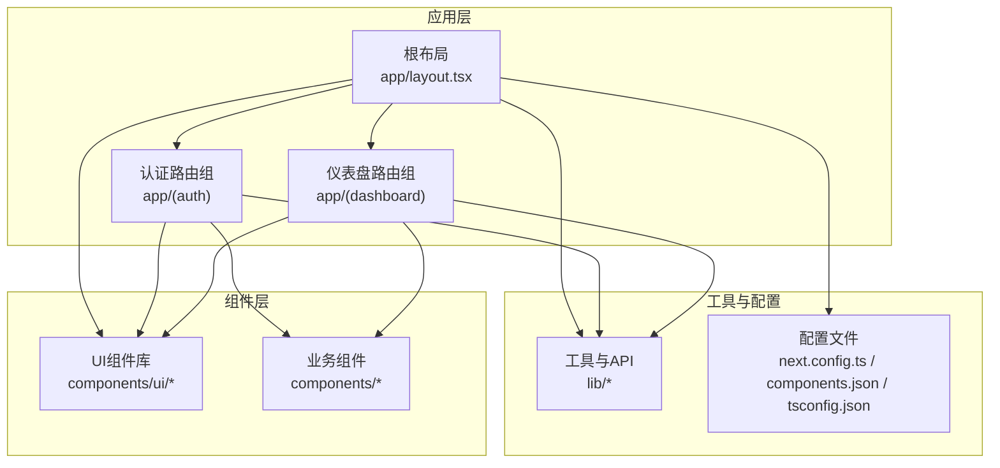
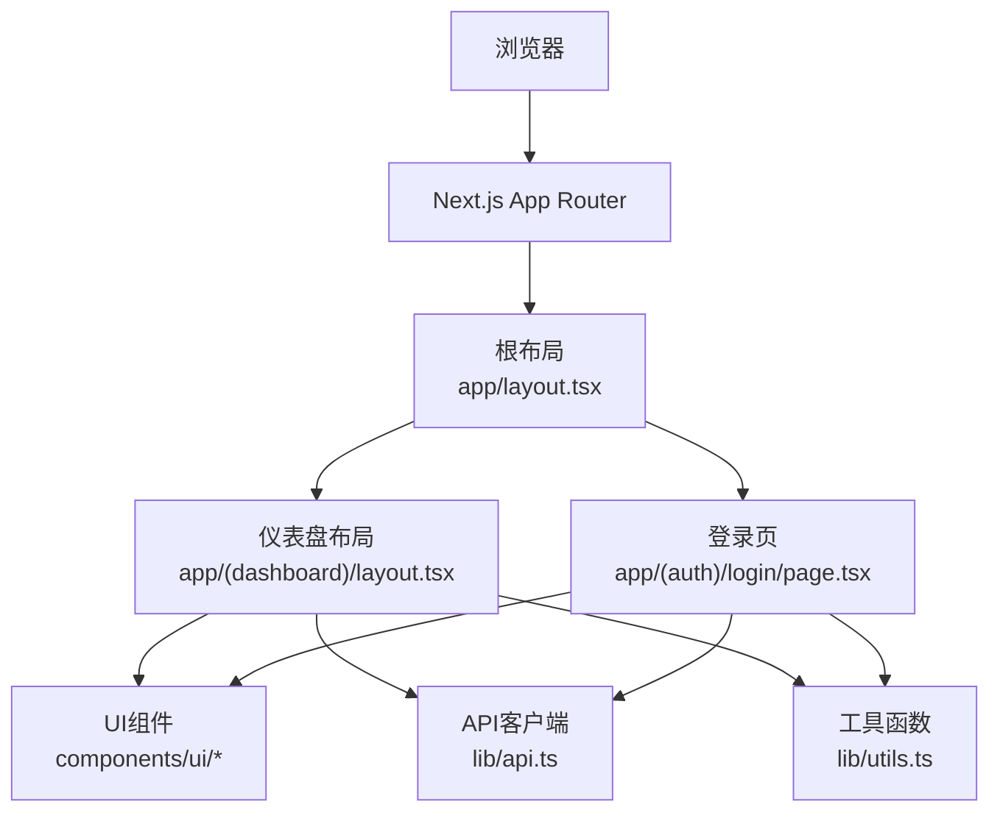
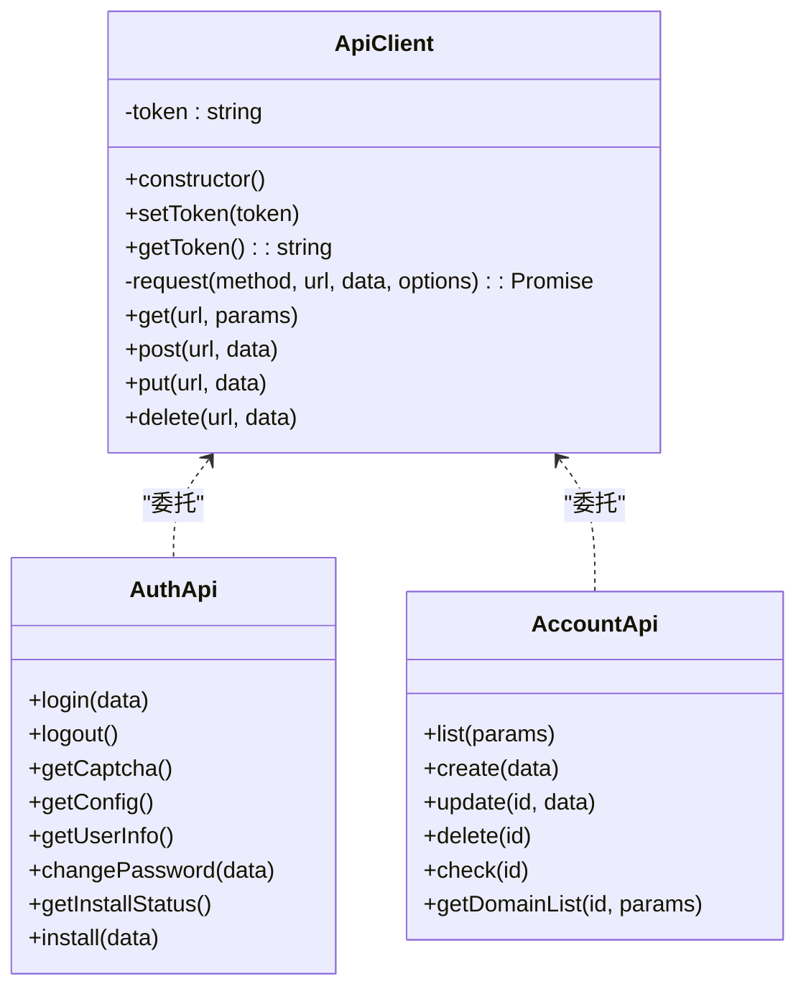
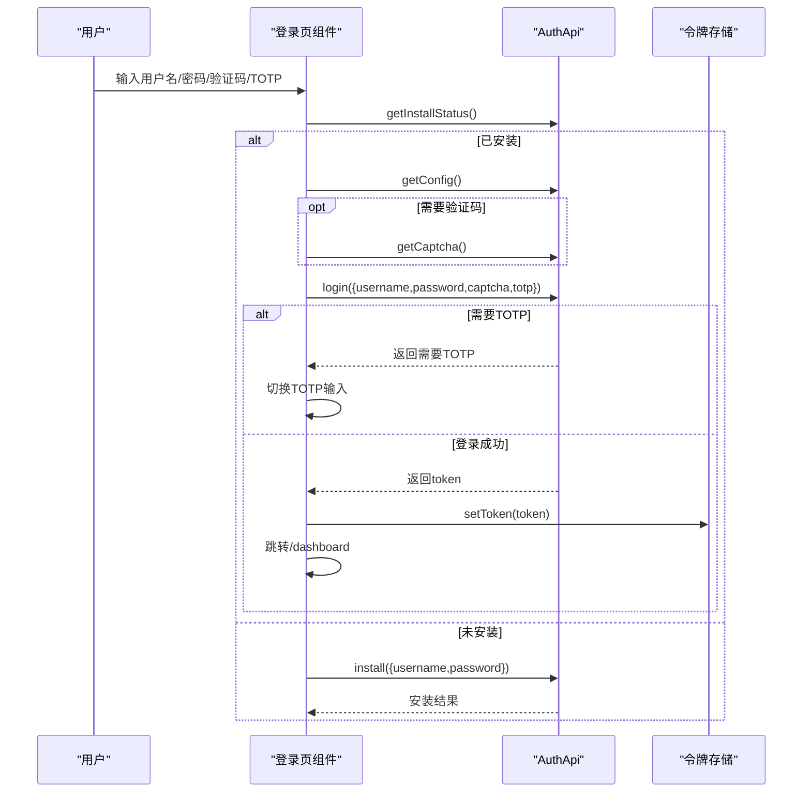
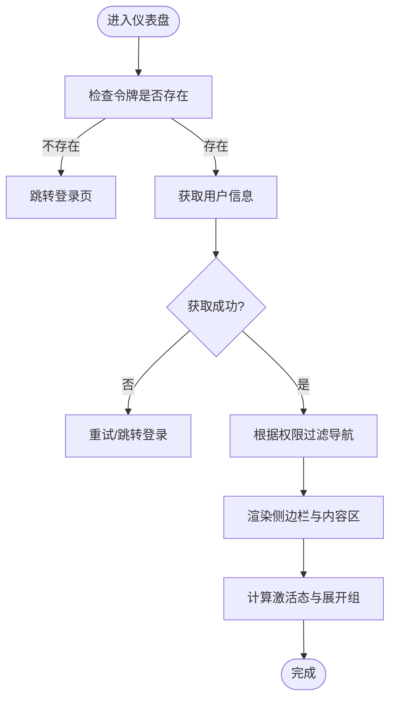
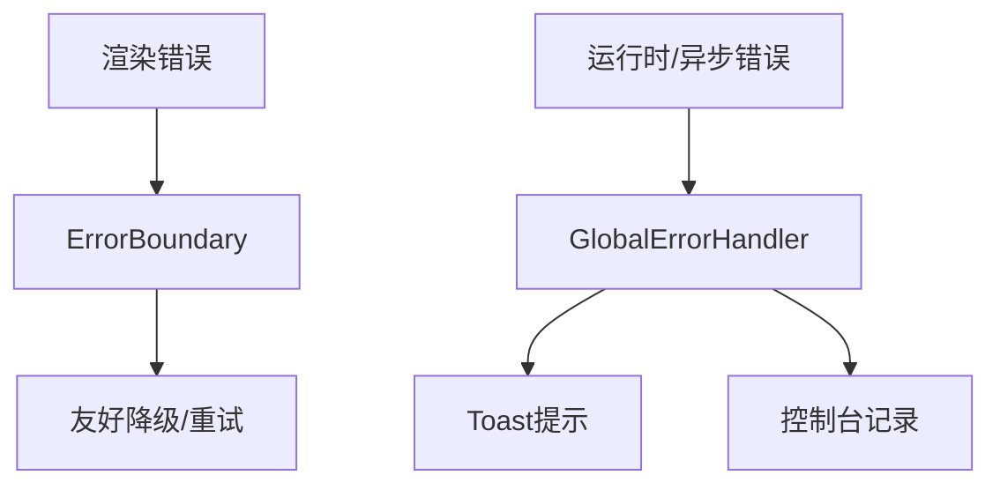
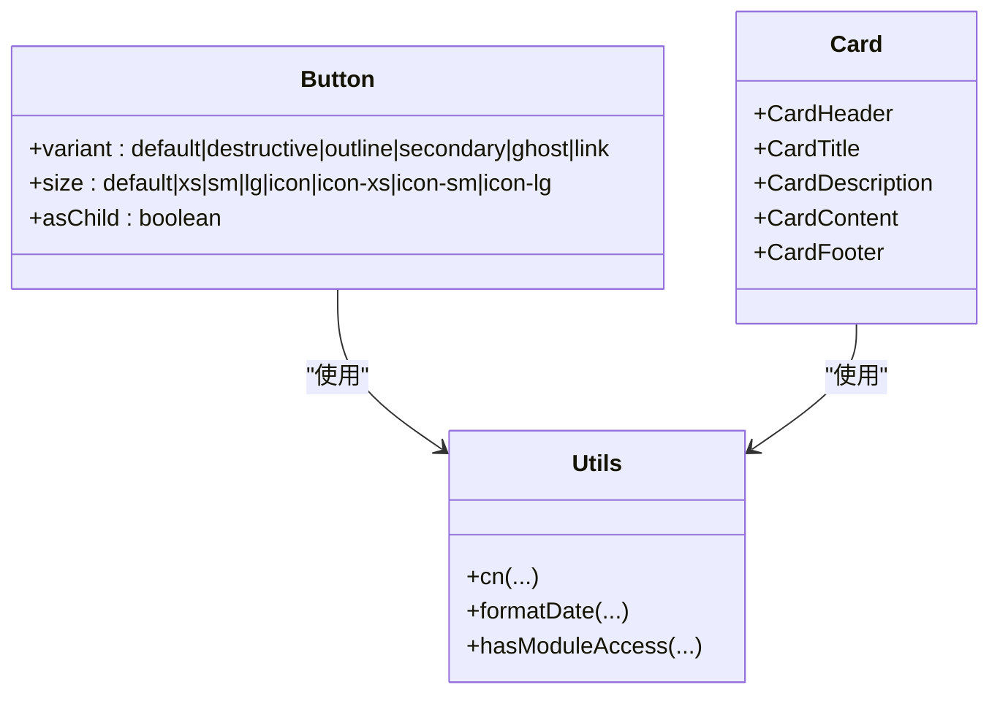
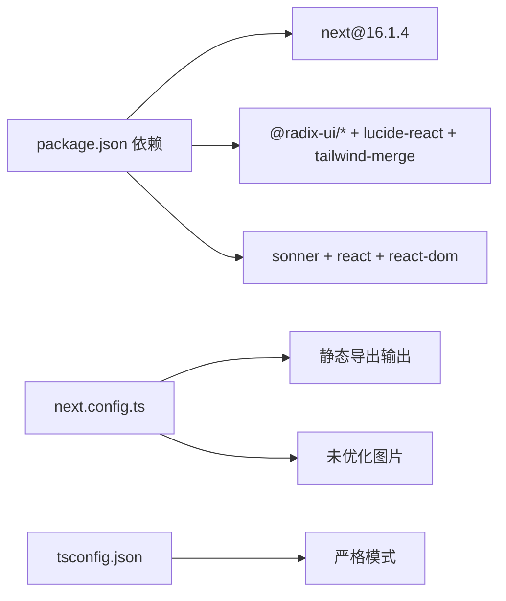

# 前端开发指南

<cite>
**本文档引用的文件**
- [package.json](file://web/package.json)
- [next.config.ts](file://web/next.config.ts)
- [components.json](file://web/components.json)
- [api.ts](file://web/lib/api.ts)
- [layout.tsx](file://web/app/layout.tsx)
- [globals.css](file://web/app/globals.css)
- [button.tsx](file://web/components/ui/button.tsx)
- [card.tsx](file://web/components/ui/card.tsx)
- [dashboard/layout.tsx](file://web/app/(dashboard)/layout.tsx)
- [utils.ts](file://web/lib/utils.ts)
- [page.tsx](file://web/app/page.tsx)
- [error-boundary.tsx](file://web/components/error-boundary.tsx)
- [global-error-handler.tsx](file://web/components/global-error-handler.tsx)
- [login/page.tsx](file://web/app/(auth)/login/page.tsx)
- [tsconfig.json](file://web/tsconfig.json)
</cite>

## 目录
1. [简介](#简介)
2. [项目结构](#项目结构)
3. [核心组件](#核心组件)
4. [架构总览](#架构总览)
5. [详细组件分析](#详细组件分析)
6. [依赖关系分析](#依赖关系分析)
7. [性能考虑](#性能考虑)
8. [故障排除指南](#故障排除指南)
9. [结论](#结论)
10. [附录](#附录)

## 简介
本指南面向DNSPlane前端团队，系统性阐述基于Next.js 16.1.4的现代前端架构设计与开发实践。内容涵盖页面路由与App Router使用模式、组件架构与UI库组织、shadcn/ui集成与定制、状态管理与API调用最佳实践、响应式设计与用户体验优化、组件开发规范、构建与部署流程，以及与后端API的交互与数据流管理。

## 项目结构
前端位于web目录，采用Next.js App Router目录结构，按功能域划分路由组，统一在根布局中注入全局样式、错误边界与通知组件。核心目录与职责如下：
- app：应用入口与页面路由，包含(认证)与(仪表盘)路由组
- components：可复用UI组件与业务组件
- lib：工具函数、API客户端与通用逻辑
- public：静态资源
- styles：全局样式与主题变量

**图表来源**
- [layout.tsx:14-33](file://web/app/layout.tsx#L14-L33)
- [dashboard/layout.tsx](file://web/app/(dashboard)/layout.tsx#L77-L390)
- [login/page.tsx](file://web/app/(auth)/login/page.tsx#L1-L292)

**章节来源**
- [layout.tsx:1-34](file://web/app/layout.tsx#L1-L34)
- [dashboard/layout.tsx](file://web/app/(dashboard)/layout.tsx#L1-L391)
- [login/page.tsx](file://web/app/(auth)/login/page.tsx#L1-L292)

## 核心组件
- API客户端与类型系统：集中封装HTTP请求、鉴权令牌管理与统一响应结构，按领域拆分API模块，便于维护与测试
- UI组件库：基于shadcn/ui，使用Radix UI与Tailwind CSS，提供高可定制的原子化组件
- 错误处理体系：结合ErrorBoundary与全局错误处理器，覆盖渲染错误与运行时/异步错误
- 路由与导航：App Router路由组隔离认证与业务页面，仪表盘侧边栏动态生成与权限控制
- 全局样式与主题：CSS变量驱动的主题切换、动画与响应式工具类

**章节来源**
- [api.ts:1-686](file://web/lib/api.ts#L1-L686)
- [button.tsx:1-65](file://web/components/ui/button.tsx#L1-L65)
- [card.tsx:1-93](file://web/components/ui/card.tsx#L1-L93)
- [error-boundary.tsx:1-174](file://web/components/error-boundary.tsx#L1-L174)
- [global-error-handler.tsx:1-59](file://web/components/global-error-handler.tsx#L1-L59)
- [dashboard/layout.tsx](file://web/app/(dashboard)/layout.tsx#L1-L391)

## 架构总览
前端采用“路由组 + 组件库 + 工具层”的分层架构，通过App Router实现页面级路由与嵌套路由，配合全局布局与错误边界保障稳定性。API层统一封装请求与响应，UI层遵循设计系统，工具层提供通用能力。

**图表来源**
- [layout.tsx:14-33](file://web/app/layout.tsx#L14-L33)
- [dashboard/layout.tsx](file://web/app/(dashboard)/layout.tsx#L77-L390)
- [login/page.tsx](file://web/app/(auth)/login/page.tsx#L1-L292)
- [api.ts:9-101](file://web/lib/api.ts#L9-L101)
- [utils.ts:1-129](file://web/lib/utils.ts#L1-L129)

## 详细组件分析

### API客户端与领域API
- 设计要点
  - 统一基地址与鉴权头，自动持久化令牌
  - 统一响应结构，内置401处理与路由跳转
  - 按领域拆分API模块，清晰的类型定义
- 使用建议
  - 在组件中优先使用领域API，避免直接拼接URL
  - 对复杂查询参数使用辅助函数构造
  - 错误处理遵循统一策略，必要时结合Toast与错误边界

**图表来源**
- [api.ts:9-101](file://web/lib/api.ts#L9-L101)
- [api.ts:112-135](file://web/lib/api.ts#L112-L135)

**章节来源**
- [api.ts:1-686](file://web/lib/api.ts#L1-L686)

### 登录页与认证流程
- 功能流程
  - 安装检查与初始化
  - 验证码与TOTP联动
  - 成功后写入令牌并跳转仪表盘
- 错误处理
  - 参数校验与Toast提示
  - 验证码失败自动刷新
  - TOTP缺失场景引导

**图表来源**
- [login/page.tsx](file://web/app/(auth)/login/page.tsx#L33-L157)
- [api.ts:112-123](file://web/lib/api.ts#L112-L123)

**章节来源**
- [login/page.tsx](file://web/app/(auth)/login/page.tsx#L1-L292)

### 仪表盘布局与导航
- 导航生成
  - 基于配置的导航树，支持分组、子项与权限过滤
  - 动态展开与激活态计算
- 用户信息与权限
  - 首次进入拉取用户信息，未登录自动跳转
  - 权限校验与模块访问控制
- 响应式侧边栏
  - 移动端抽屉与遮罩，桌面端固定侧栏

**图表来源**
- [dashboard/layout.tsx](file://web/app/(dashboard)/layout.tsx#L82-L160)
- [dashboard/layout.tsx](file://web/app/(dashboard)/layout.tsx#L196-L214)

**章节来源**
- [dashboard/layout.tsx](file://web/app/(dashboard)/layout.tsx#L1-L391)

### 错误处理与全局通知
- 渲染错误边界
  - 捕获子树渲染异常，提供重试、复制错误与返回首页
- 全局运行时错误
  - 监听window.onerror与unhandledrejection，过滤常见噪音，统一Toast提示
- 最佳实践
  - 优先使用ErrorBoundary与error.tsx处理页面级错误
  - 异步错误通过API层拦截与Toast反馈

**图表来源**
- [error-boundary.tsx:20-135](file://web/components/error-boundary.tsx#L20-L135)
- [global-error-handler.tsx:14-58](file://web/components/global-error-handler.tsx#L14-L58)

**章节来源**
- [error-boundary.tsx:1-174](file://web/components/error-boundary.tsx#L1-L174)
- [global-error-handler.tsx:1-59](file://web/components/global-error-handler.tsx#L1-L59)

### UI组件库与定制
- 组件选择
  - shadcn/ui提供高质量原子化组件，基于Radix UI与Tailwind CSS
  - 通过components.json统一别名与样式风格
- 定制策略
  - 使用cva定义变体与尺寸，保持一致性
  - 通过cn合并条件样式，避免冲突
  - 在lib/utils中集中工具函数，减少重复

**图表来源**
- [button.tsx:41-62](file://web/components/ui/button.tsx#L41-L62)
- [card.tsx:5-92](file://web/components/ui/card.tsx#L5-L92)
- [utils.ts:4-6](file://web/lib/utils.ts#L4-L6)

**章节来源**
- [button.tsx:1-65](file://web/components/ui/button.tsx#L1-L65)
- [card.tsx:1-93](file://web/components/ui/card.tsx#L1-L93)
- [components.json:1-23](file://web/components.json#L1-L23)
- [utils.ts:1-129](file://web/lib/utils.ts#L1-L129)

## 依赖关系分析
- 构建与运行
  - Next.js 16.1.4，启用Turbopack开发体验
  - 输出为静态导出，禁用TS编译错误阻塞
- UI与样式
  - shadcn/ui + Radix UI，Tailwind 4，Lucide图标
  - 全局CSS变量与暗色主题支持
- 开发工具
  - ESLint + TypeScript，严格类型检查

**图表来源**
- [package.json:12-51](file://web/package.json#L12-L51)
- [next.config.ts:3-13](file://web/next.config.ts#L3-L13)
- [tsconfig.json:7-23](file://web/tsconfig.json#L7-L23)

**章节来源**
- [package.json:1-53](file://web/package.json#L1-L53)
- [next.config.ts:1-16](file://web/next.config.ts#L1-L16)
- [tsconfig.json:1-35](file://web/tsconfig.json#L1-L35)

## 性能考虑
- 路由与渲染
  - 使用Suspense与渐进式加载，避免阻塞首屏
  - 仪表盘侧边栏按需展开，减少DOM节点
- 网络与缓存
  - API层统一处理401与重定向，避免无效请求
  - 令牌本地持久化，减少重复鉴权
- 样式与主题
  - CSS变量驱动主题切换，避免样式抖动
  - Tailwind按需引入，减少包体积

## 故障排除指南
- 登录失败
  - 检查验证码与TOTP输入，确认后端配置
  - 若频繁失败，清理本地令牌并重试
- 仪表盘空白
  - 确认令牌有效，检查用户权限
  - 查看控制台是否有未捕获异常
- 构建失败
  - 关闭TS错误阻断，先修复关键问题
  - 确认静态导出配置与图片优化设置

**章节来源**
- [login/page.tsx](file://web/app/(auth)/login/page.tsx#L109-L157)
- [dashboard/layout.tsx](file://web/app/(dashboard)/layout.tsx#L120-L160)
- [global-error-handler.tsx:14-58](file://web/components/global-error-handler.tsx#L14-L58)
- [next.config.ts:9-13](file://web/next.config.ts#L9-L13)

## 结论
本指南总结了DNSPlane前端的架构设计与开发实践，强调以App Router为中心的路由组织、以shadcn/ui为核心的UI体系、以API客户端为纽带的数据流管理，以及以错误边界与全局处理器保障的稳定性。遵循本文档的规范与最佳实践，可显著提升开发效率与用户体验。

## 附录

### 组件开发规范
- 命名与结构
  - 组件文件使用PascalCase，导出默认组件
  - 使用asChild与data-*属性增强可访问性
- 样式与主题
  - 优先使用cva定义变体，通过cn合并条件样式
  - 避免内联样式的硬编码颜色
- 类型与API
  - 所有API调用返回Promise，统一处理错误
  - 使用领域API模块，避免硬编码URL

**章节来源**
- [button.tsx:41-62](file://web/components/ui/button.tsx#L41-L62)
- [card.tsx:5-92](file://web/components/ui/card.tsx#L5-L92)
- [api.ts:112-135](file://web/lib/api.ts#L112-L135)

### 构建、打包与部署
- 开发
  - 使用Turbopack加速热更新
- 生产构建
  - 静态导出，自动拷贝至后端主程序目录
- CI流程
  - 通过CI构建并同步静态资源

**章节来源**
- [package.json:5-11](file://web/package.json#L5-L11)
- [next.config.ts:3-8](file://web/next.config.ts#L3-L8)

### 与后端API交互模式
- 请求流程
  - 统一在lib/api.ts中发起请求，自动附加令牌
  - 401时清除令牌并跳转登录
- 数据流
  - 页面组件通过领域API读取数据
  - 使用Toast与错误边界反馈异常
- 最佳实践
  - 对高频请求进行防抖与节流
  - 对大列表使用分页与懒加载

**章节来源**
- [api.ts:33-98](file://web/lib/api.ts#L33-L98)
- [login/page.tsx](file://web/app/(auth)/login/page.tsx#L126-L156)
- [dashboard/layout.tsx](file://web/app/(dashboard)/layout.tsx#L120-L160)