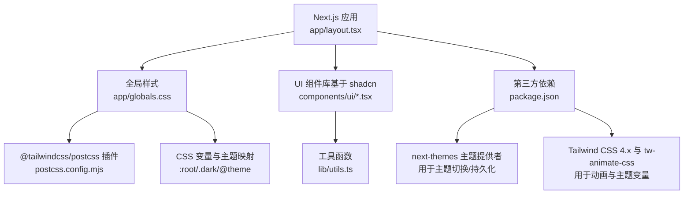
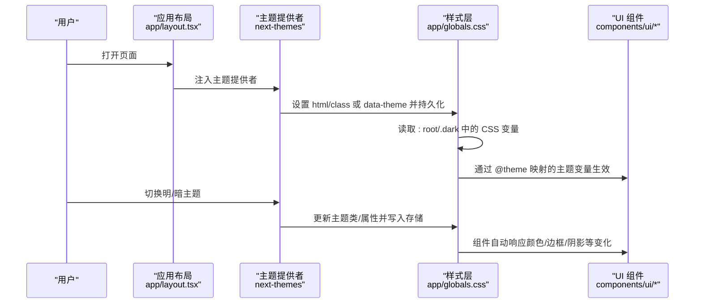
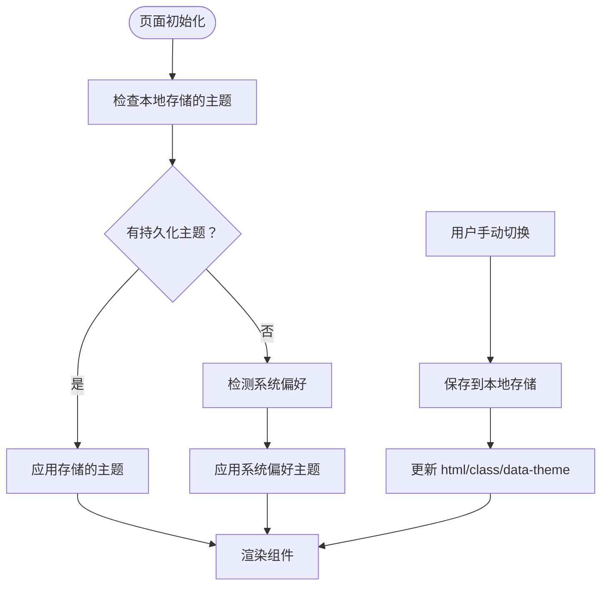
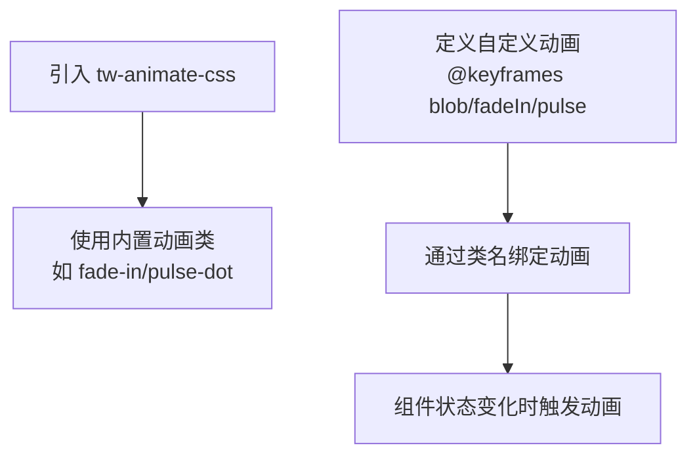
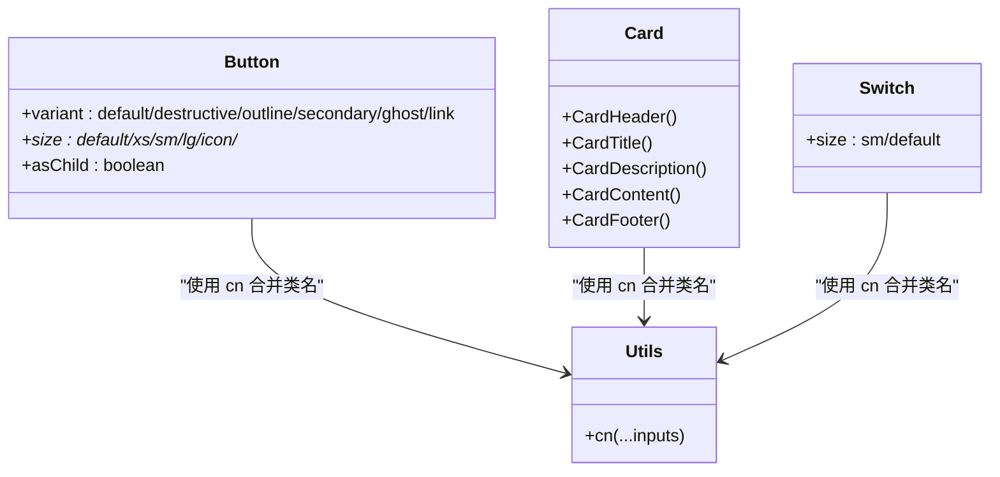
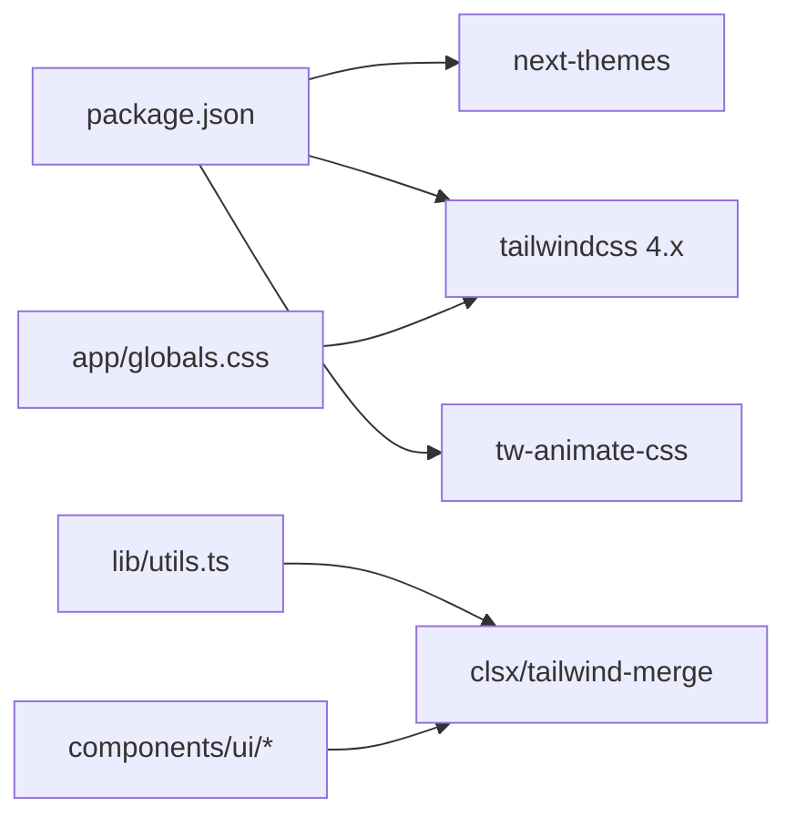

# 响应式设计与主题

<cite>
**本文引用的文件**
- [package.json](file://web/package.json)
- [postcss.config.mjs](file://web/postcss.config.mjs)
- [components.json](file://web/components.json)
- [app/globals.css](file://web/app/globals.css)
- [app/layout.tsx](file://web/app/layout.tsx)
- [lib/utils.ts](file://web/lib/utils.ts)
- [components/ui/button.tsx](file://web/components/ui/button.tsx)
- [components/ui/card.tsx](file://web/components/ui/card.tsx)
- [components/ui/switch.tsx](file://web/components/ui/switch.tsx)
- [next.config.ts](file://web/next.config.ts)
</cite>

## 目录
1. [简介](#简介)
2. [项目结构](#项目结构)
3. [核心组件](#核心组件)
4. [架构总览](#架构总览)
5. [详细组件分析](#详细组件分析)
6. [依赖关系分析](#依赖关系分析)
7. [性能考量](#性能考量)
8. [故障排查指南](#故障排查指南)
9. [结论](#结论)
10. [附录](#附录)

## 简介
本文件聚焦 DNSPlane Web 前端的响应式设计与主题系统，基于 Tailwind CSS 4.x 的新特性与 next-themes 实现，系统性阐述以下内容：
- Tailwind CSS 4.x 配置与使用：自定义断点、颜色系统、间距规范、@theme 与 CSS 变量映射
- 深色/浅色主题机制：主题切换、持久化存储、系统偏好检测
- 响应式设计原则与移动端适配策略
- 动画与过渡效果：进入/退出动画、状态变化效果
- 可访问性设计：高对比度支持、屏幕阅读器兼容
- 组件主题化最佳实践与样式组织
- CSS 模块化与样式隔离技术方案

## 项目结构
DNSPlane Web 前端采用 Next.js 16 应用，样式体系以 Tailwind CSS 4.x 为核心，结合 next-themes 提供主题切换能力，并通过 PostCSS 插件链进行构建。

图表来源
- [app/layout.tsx:14-33](file://web/app/layout.tsx#L14-L33)
- [app/globals.css:1-435](file://web/app/globals.css#L1-L435)
- [postcss.config.mjs:1-8](file://web/postcss.config.mjs#L1-L8)
- [package.json:12-51](file://web/package.json#L12-L51)

章节来源
- [app/layout.tsx:14-33](file://web/app/layout.tsx#L14-L33)
- [app/globals.css:1-435](file://web/app/globals.css#L1-L435)
- [postcss.config.mjs:1-8](file://web/postcss.config.mjs#L1-L8)
- [package.json:12-51](file://web/package.json#L12-L51)

## 核心组件
- 全局样式与主题变量：通过 CSS 变量在 :root 与 .dark 中定义颜色与半径等基础变量，并在 @theme 中映射为 Tailwind 变量，确保组件层可直接使用。
- UI 组件：基于 class-variance-authority 的变体系统，统一尺寸与状态样式，配合 cn 合并工具实现主题化与可组合性。
- 主题提供者：next-themes 在客户端注入主题状态，监听系统偏好与用户选择，持久化到本地存储并在页面加载时恢复。
- 构建链路：PostCSS 通过 @tailwindcss/postcss 插件解析 Tailwind 4.x 语法，生成最终样式。

章节来源
- [app/globals.css:26-136](file://web/app/globals.css#L26-L136)
- [components/ui/button.tsx:7-39](file://web/components/ui/button.tsx#L7-L39)
- [lib/utils.ts:4-6](file://web/lib/utils.ts#L4-L6)
- [package.json:33-33](file://web/package.json#L33-L33)

## 架构总览
下图展示主题系统在应用中的工作流：从布局注入主题提供者，到样式层读取 CSS 变量，再到组件层根据变体与状态渲染。

图表来源
- [app/layout.tsx:14-33](file://web/app/layout.tsx#L14-L33)
- [app/globals.css:26-136](file://web/app/globals.css#L26-L136)
- [package.json:33-33](file://web/package.json#L33-L33)

## 详细组件分析

### Tailwind CSS 4.x 配置与使用
- 配置入口
  - PostCSS 插件：通过 @tailwindcss/postcss 解析 Tailwind 4.x 语法。
  - 组件库配置：components.json 指定 tailwind.css 为 app/globals.css，启用 CSS 变量映射，基础色为 neutral。
- 主题变量与 @theme
  - 在 :root 定义基础变量（背景、前景、卡片、输入、边框、环形光晕、图表色等），并在 .dark 中定义深色变量。
  - 使用 @theme inline 将 CSS 变量映射为 Tailwind 变量，使组件层可直接使用 bg-foreground、text-primary 等语义化类名。
- 断点与间距
  - Tailwind 4.x 默认断点满足移动端优先策略；通过语义化间距类（如 p-、m-、gap-、space-）与容器类（如 max-w-screen-*）实现响应式布局。
  - 圆角半径通过 CSS 变量 --radius 与派生变量 --radius-sm/-md/-lg/-xl 等统一管理，保证视觉一致性。

章节来源
- [postcss.config.mjs:1-8](file://web/postcss.config.mjs#L1-L8)
- [components.json:6-12](file://web/components.json#L6-L12)
- [app/globals.css:26-67](file://web/app/globals.css#L26-L67)
- [app/globals.css:69-136](file://web/app/globals.css#L69-L136)

### 深色/浅色主题机制
- 主题提供者
  - 依赖 next-themes，在客户端组件中使用 useTheme 获取当前主题与切换函数。
  - 支持 theme="system"，自动跟随系统偏好；同时将主题持久化到本地存储，刷新后恢复。
- 主题切换流程
  - 用户操作触发 setTheme，next-themes 写入 html/class 或 data-theme 属性，并保存到 storage。
  - 样式层通过 .dark 选择器或 @custom-variant dark 读取对应变量，组件层无需感知，自动更新。
- 系统偏好检测
  - 当 theme="system" 时，next-themes 会监听 prefers-color-scheme，优先使用系统设置。

图表来源
- [package.json:33-33](file://web/package.json#L33-L33)
- [app/globals.css:24-24](file://web/app/globals.css#L24-L24)
- [app/globals.css:104-136](file://web/app/globals.css#L104-L136)

章节来源
- [package.json:33-33](file://web/package.json#L33-L33)
- [app/globals.css:24-24](file://web/app/globals.css#L24-L24)
- [app/globals.css:104-136](file://web/app/globals.css#L104-L136)

### 响应式设计原则与移动端适配
- 移动优先
  - 使用默认断点与语义化间距类，确保在小屏设备上优先获得良好体验。
  - 通过容器类与 max-w-* 控制内容宽度，避免大屏拉伸。
- 触达友好
  - 组件尺寸（如按钮、开关）提供多档位，保证触摸目标足够大。
- 可读性
  - 通过语义化颜色与对比度变量（如 muted-foreground、primary-foreground）提升文本可读性。

章节来源
- [components/ui/button.tsx:23-32](file://web/components/ui/button.tsx#L23-L32)
- [components/ui/switch.tsx:10-14](file://web/components/ui/switch.tsx#L10-L14)
- [app/globals.css:26-67](file://web/app/globals.css#L26-L67)

### CSS 变量的使用与主题定制
- 变量来源
  - :root 定义浅色变量，.dark 定义深色变量；@theme 将其映射为 Tailwind 变量，供组件层直接使用。
- 定制方法
  - 在 app/globals.css 中修改 :root 与 .dark 的 oklch 颜色值，即可完成品牌色与对比度的统一调整。
  - 通过 --radius 等变量统一圆角，减少重复定义。
- 组件层映射
  - 组件使用语义化类名（如 bg-card、text-foreground、border-input），自动随主题变量变化而变化。

章节来源
- [app/globals.css:69-136](file://web/app/globals.css#L69-L136)
- [app/globals.css:26-67](file://web/app/globals.css#L26-L67)

### 动画与过渡效果
- 动画库
  - 引入 tw-animate-css，提供丰富的入场/退出动画类，便于快速集成。
- 自定义动画
  - 使用 @keyframes 定义脉冲、渐入、背景块等动画，并通过组件类名复用。
- 组件交互
  - 按钮与卡片等组件通过 hover/active 状态类实现过渡与阴影变化，增强反馈。

图表来源
- [app/globals.css:5-10](file://web/app/globals.css#L5-L10)
- [app/globals.css:251-263](file://web/app/globals.css#L251-L263)
- [app/globals.css:247-254](file://web/app/globals.css#L247-L254)

章节来源
- [app/globals.css:5-10](file://web/app/globals.css#L5-L10)
- [app/globals.css:247-263](file://web/app/globals.css#L247-L263)
- [app/globals.css:251-263](file://web/app/globals.css#L251-L263)

### 可访问性设计
- 高对比度支持
  - 通过语义化颜色变量（如 primary、muted、destructive）与 .dark 适配，确保在不同背景下保持足够的对比度。
- 屏幕阅读器兼容
  - 组件使用语义化 HTML 结构与可访问属性（如 outline-ring、focus-visible），提升键盘导航与辅助技术可用性。
- 状态可视化
  - 使用状态指示器与颜色语义（成功/警告/错误/信息）传达状态，避免仅依赖颜色。

章节来源
- [app/globals.css:138-145](file://web/app/globals.css#L138-L145)
- [components/ui/button.tsx:8-8](file://web/components/ui/button.tsx#L8-L8)

### 组件主题化最佳实践与样式组织
- 变体系统
  - 使用 class-variance-authority 定义组件变体与尺寸，统一状态样式（如 hover、focus-visible、disabled）。
- 样式合并
  - 通过 lib/utils.ts 的 cn 函数合并类名，避免冲突并保持可维护性。
- 组件结构
  - 卡片组件按 Header/Title/Description/Content/Footer 分层，便于主题化与扩展。
- 语义化命名
  - 统一使用语义化颜色与尺寸类，减少硬编码颜色与像素值。

图表来源
- [components/ui/button.tsx:7-39](file://web/components/ui/button.tsx#L7-L39)
- [components/ui/card.tsx:5-16](file://web/components/ui/card.tsx#L5-L16)
- [components/ui/switch.tsx:8-33](file://web/components/ui/switch.tsx#L8-L33)
- [lib/utils.ts:4-6](file://web/lib/utils.ts#L4-L6)

章节来源
- [components/ui/button.tsx:7-39](file://web/components/ui/button.tsx#L7-L39)
- [components/ui/card.tsx:5-16](file://web/components/ui/card.tsx#L5-L16)
- [components/ui/switch.tsx:8-33](file://web/components/ui/switch.tsx#L8-L33)
- [lib/utils.ts:4-6](file://web/lib/utils.ts#L4-L6)

### CSS 模块化与样式隔离
- 层级组织
  - base/layer：统一基础样式与重置；components/layer：组件级样式；utilities/layer：工具类与通用修饰。
- 变量驱动
  - 通过 CSS 变量与 @theme 映射，避免在组件内直接写死颜色与尺寸，降低耦合。
- 作用域控制
  - 使用 .dark 与 @custom-variant dark 精准控制深色场景下的样式覆盖，避免全局污染。
- 构建优化
  - Next.js export 输出与 images.unoptimized 配置，确保静态导出环境下的样式与资源正确加载。

章节来源
- [app/globals.css:138-188](file://web/app/globals.css#L138-L188)
- [app/globals.css:190-303](file://web/app/globals.css#L190-L303)
- [app/globals.css:24-24](file://web/app/globals.css#L24-L24)
- [next.config.ts:3-13](file://web/next.config.ts#L3-L13)

## 依赖关系分析
- 核心依赖
  - next-themes：提供主题切换、持久化与系统偏好检测。
  - tailwindcss 4.x 与 @tailwindcss/postcss：解析新语法与生成样式。
  - tw-animate-css：提供动画类，简化动效实现。
- 组件库
  - shadcn 风格组件（如 Button、Card、Switch）通过变体系统与 CSS 变量实现主题化。

图表来源
- [package.json:12-51](file://web/package.json#L12-L51)
- [lib/utils.ts:1-6](file://web/lib/utils.ts#L1-L6)

章节来源
- [package.json:12-51](file://web/package.json#L12-L51)
- [lib/utils.ts:1-6](file://web/lib/utils.ts#L1-L6)

## 性能考量
- 构建与输出
  - Next.js export 输出与 images.unoptimized 配置，减少运行时计算与网络请求，提升首屏性能。
- 样式体积
  - 通过 @theme 与 CSS 变量集中管理颜色与半径，避免重复定义，降低 CSS 体积。
- 动画与过渡
  - 使用 GPU 友好的 transform/opacity 动画，避免频繁触发重排；合理使用动画延迟与节流。

章节来源
- [next.config.ts:3-13](file://web/next.config.ts#L3-L13)
- [app/globals.css:26-67](file://web/app/globals.css#L26-L67)

## 故障排查指南
- 主题不生效
  - 确认已注入 next-themes 提供者且未出现水合警告；检查 html/class 或 data-theme 是否被正确设置。
- 深色模式异常
  - 检查 .dark 选择器是否覆盖了关键样式；确认 CSS 变量在 .dark 中已定义。
- 动画无效
  - 确认 tw-animate-css 已导入；检查自定义 @keyframes 是否正确拼写与作用域。
- 构建报错
  - 确认 @tailwindcss/postcss 插件版本与 Tailwind 4.x 兼容；检查 components.json 中 tailwind.css 路径。

章节来源
- [app/layout.tsx:14-33](file://web/app/layout.tsx#L14-L33)
- [app/globals.css:104-136](file://web/app/globals.css#L104-L136)
- [postcss.config.mjs:1-8](file://web/postcss.config.mjs#L1-L8)
- [components.json:6-12](file://web/components.json#L6-L12)

## 结论
DNSPlane 的响应式设计与主题系统以 Tailwind CSS 4.x 与 next-themes 为核心，通过 CSS 变量与 @theme 映射实现统一的颜色与间距体系，配合组件变体系统与工具函数实现高度可组合与可维护的 UI。深色/浅色主题具备系统偏好检测与持久化能力，响应式设计遵循移动优先原则，辅以动画与过渡增强交互体验。整体方案在可访问性、模块化与性能方面均具备良好实践基础。

## 附录
- 关键实现路径参考
  - 主题提供者与布局注入：[app/layout.tsx:14-33](file://web/app/layout.tsx#L14-L33)
  - 全局样式与变量映射：[app/globals.css:26-136](file://web/app/globals.css#L26-L136)
  - 组件变体与样式合并：[components/ui/button.tsx:7-39](file://web/components/ui/button.tsx#L7-L39)、[lib/utils.ts:4-6](file://web/lib/utils.ts#L4-L6)
  - 动画与过渡：[app/globals.css:5-10](file://web/app/globals.css#L5-L10)、[app/globals.css:247-263](file://web/app/globals.css#L247-L263)
  - 构建插件与组件库配置：[postcss.config.mjs:1-8](file://web/postcss.config.mjs#L1-L8)、[components.json:6-12](file://web/components.json#L6-L12)