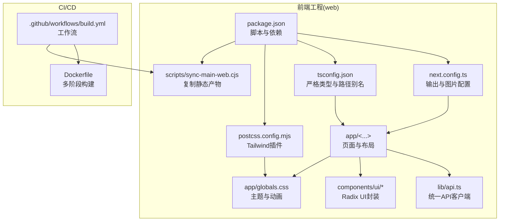
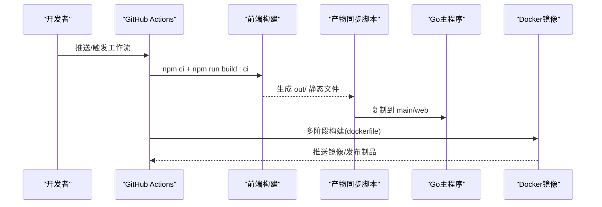
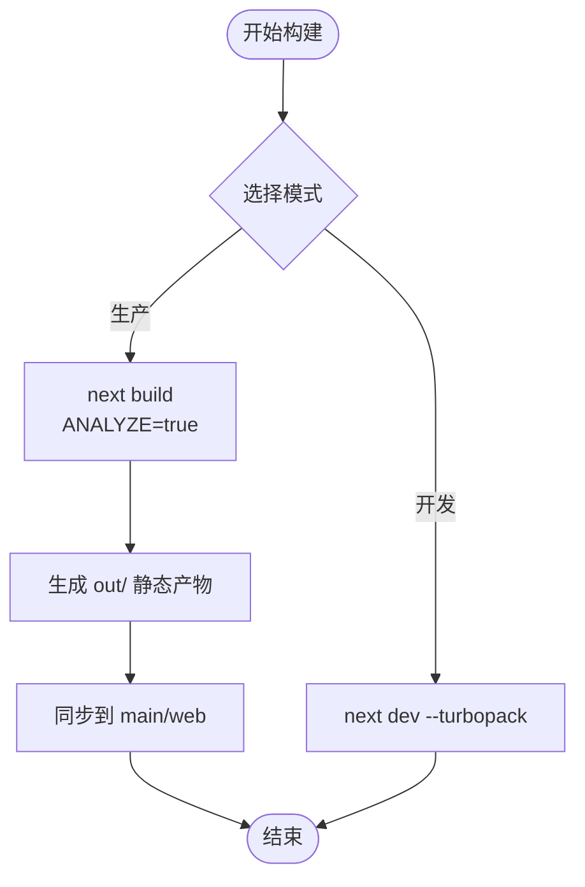
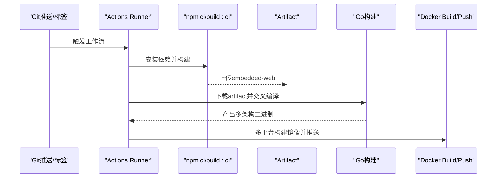
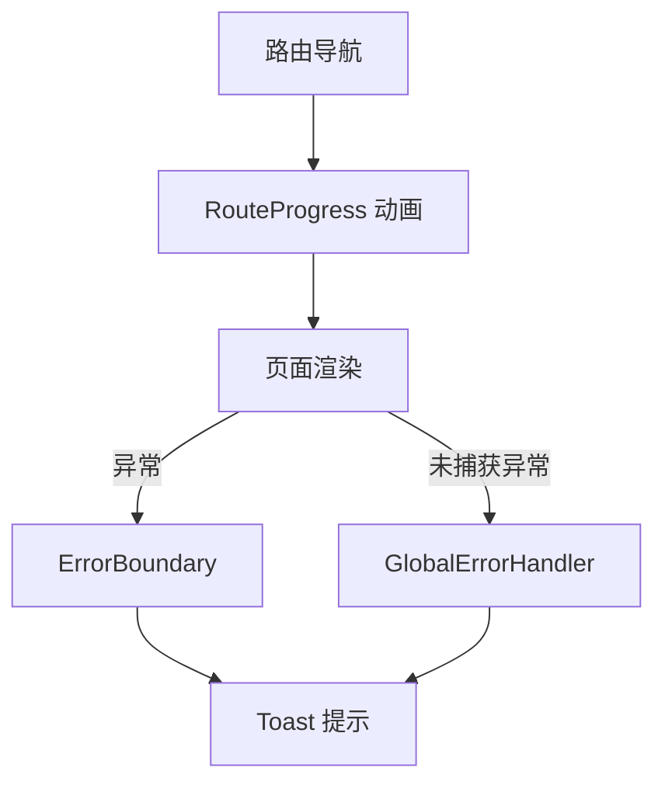
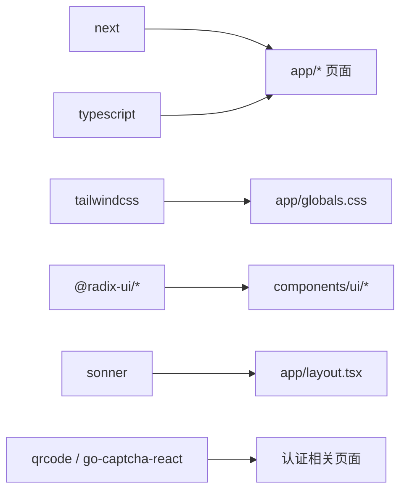

# 构建部署与性能优化

<cite>
**本文引用的文件**
- [next.config.ts](file://web/next.config.ts)
- [package.json](file://web/package.json)
- [tsconfig.json](file://web/tsconfig.json)
- [postcss.config.mjs](file://web/postcss.config.mjs)
- [build.yml](file://.github/workflows/build.yml)
- [Dockerfile](file://Dockerfile)
- [layout.tsx](file://web/app/layout.tsx)
- [page.tsx](file://web/app/page.tsx)
- [route-progress.tsx](file://web/components/route-progress.tsx)
- [client-error-boundary.tsx](file://web/components/client-error-boundary.tsx)
- [error-boundary.tsx](file://web/components/error-boundary.tsx)
- [global-error-handler.tsx](file://web/components/global-error-handler.tsx)
- [globals.css](file://web/app/globals.css)
- [api.ts](file://web/lib/api.ts)
- [sync-main-web.cjs](file://web/scripts/sync-main-web.cjs)
</cite>

## 目录
1. [引言](#引言)
2. [项目结构](#项目结构)
3. [核心组件](#核心组件)
4. [架构总览](#架构总览)
5. [详细组件分析](#详细组件分析)
6. [依赖分析](#依赖分析)
7. [性能考量](#性能考量)
8. [故障排查指南](#故障排查指南)
9. [结论](#结论)
10. [附录](#附录)

## 引言
本指南面向DNSPlane前端团队与运维人员，系统阐述基于Next.js的构建流程、优化策略与生产部署实践。内容覆盖代码分割、Tree Shaking、Bundle分析、生产配置、性能监控、CI/CD自动化、静态资源优化、预渲染与增量静态再生、运行时性能优化（懒加载、虚拟滚动、内存管理）、Lighthouse评分提升、前端监控与错误追踪、以及域名部署、CDN与HTTPS最佳实践。

## 项目结构
前端位于web目录，采用App Router组织页面与布局，使用Next.js 16与TypeScript，TailwindCSS v4进行样式管理，并通过GitHub Actions完成CI/CD与容器化发布。

图示来源
- [package.json:1-53](file://web/package.json#L1-L53)
- [next.config.ts:1-16](file://web/next.config.ts#L1-L16)
- [tsconfig.json:1-35](file://web/tsconfig.json#L1-L35)
- [postcss.config.mjs:1-8](file://web/postcss.config.mjs#L1-L8)
- [build.yml:1-181](file://.github/workflows/build.yml#L1-L181)
- [Dockerfile:1-34](file://Dockerfile#L1-L34)

章节来源
- [package.json:1-53](file://web/package.json#L1-L53)
- [next.config.ts:1-16](file://web/next.config.ts#L1-L16)
- [tsconfig.json:1-35](file://web/tsconfig.json#L1-L35)
- [postcss.config.mjs:1-8](file://web/postcss.config.mjs#L1-L8)
- [build.yml:1-181](file://.github/workflows/build.yml#L1-L181)
- [Dockerfile:1-34](file://Dockerfile#L1-L34)

## 核心组件
- 构建配置与输出
  - 静态导出模式与图片优化关闭，便于嵌入主程序分发。
  - TypeScript错误忽略构建失败，保障CI稳定性。
- 脚本与CI/CD
  - 本地开发启用Turbopack加速；生产构建生成静态站点并同步至主程序web目录。
  - GitHub Actions在Linux环境执行npm ci与构建，产物上传为artifact并参与二进制打包。
- 样式与主题
  - Tailwind v4与自定义动画库，全局主题变量与暗色适配。
- 错误处理与用户体验
  - 路由进度条、客户端错误边界、全局未捕获异常toast提示。
- API客户端
  - 统一请求封装、Token同步、401自动跳转登录。

章节来源
- [next.config.ts:1-16](file://web/next.config.ts#L1-L16)
- [package.json:5-11](file://web/package.json#L5-L11)
- [build.yml:29-39](file://.github/workflows/build.yml#L29-L39)
- [globals.css:1-435](file://web/app/globals.css#L1-L435)
- [route-progress.tsx:1-74](file://web/components/route-progress.tsx#L1-L74)
- [client-error-boundary.tsx:1-8](file://web/components/client-error-boundary.tsx#L1-L8)
- [global-error-handler.tsx:1-59](file://web/components/global-error-handler.tsx#L1-L59)
- [api.ts:1-125](file://web/lib/api.ts#L1-L125)

## 架构总览
下图展示从开发到生产的端到端流程，包括构建、产物同步、镜像构建与发布。

图示来源
- [build.yml:29-39](file://.github/workflows/build.yml#L29-L39)
- [sync-main-web.cjs:1-14](file://web/scripts/sync-main-web.cjs#L1-L14)
- [Dockerfile:1-34](file://Dockerfile#L1-L34)

## 详细组件分析

### 构建配置与优化策略
- 输出模式与图片
  - 静态导出与尾斜杠，利于嵌入式分发与反向代理。
  - 关闭Next优化图片，配合外部CDN或本地静态托管。
- TypeScript与Webpack
  - 生产构建可切换Webpack模式，便于分析与兼容性验证。
- 分析与报告
  - 通过ANALYZE环境变量开启分析，定位大体积模块与重复依赖。

图示来源
- [package.json:5-11](file://web/package.json#L5-L11)
- [next.config.ts:3-13](file://web/next.config.ts#L3-L13)
- [sync-main-web.cjs:1-14](file://web/scripts/sync-main-web.cjs#L1-L14)

章节来源
- [next.config.ts:1-16](file://web/next.config.ts#L1-L16)
- [package.json:5-11](file://web/package.json#L5-L11)

### CI/CD流程与自动化部署
- 触发条件
  - 推送至main/master或打标签；手动触发。
- 步骤
  - 设置Node 22，缓存npm依赖。
  - 执行npm ci与build:ci，产物作为artifact上传。
  - 下载embedded-web并在多架构矩阵中编译Go二进制。
  - Docker多平台构建并推送镜像。
- 容器镜像
  - 前端仅在构建平台构建一次，避免并发下载阻塞；Go在宿主交叉编译，最终以静态二进制运行。

图示来源
- [build.yml:1-181](file://.github/workflows/build.yml#L1-L181)
- [Dockerfile:1-34](file://Dockerfile#L1-L34)

章节来源
- [build.yml:1-181](file://.github/workflows/build.yml#L1-L181)
- [Dockerfile:1-34](file://Dockerfile#L1-L34)

### 静态资源优化
- 图片策略
  - 关闭Next内置图片优化，建议使用CDN或本地静态托管，结合现代格式（WebP/AVIF）与尺寸裁剪。
- 字体与样式
  - Tailwind v4按需生成，减少未使用CSS；全局动画与主题变量集中管理，避免重复引入。
- 缓存策略
  - 静态导出产物可直接由CDN缓存；建议对JS/CSS设置长缓存，HTML短缓存或不缓存。

章节来源
- [next.config.ts:6-8](file://web/next.config.ts#L6-L8)
- [postcss.config.mjs:1-8](file://web/postcss.config.mjs#L1-L8)
- [globals.css:1-435](file://web/app/globals.css#L1-L435)

### 预渲染与增量静态再生
- 当前状态
  - 使用静态导出模式，适合固定内容与仪表盘入口。
- 建议
  - 对动态列表页可考虑增量静态再生（ISR）或服务端渲染（SSR），以平衡新鲜度与性能。
  - ISR适用于后台任务统计、证书状态等周期性更新数据。

章节来源
- [next.config.ts:4-4](file://web/next.config.ts#L4-L4)
- [page.tsx:1-19](file://web/app/page.tsx#L1-L19)

### 运行时性能优化
- 路由切换体验
  - 路由进度条通过DOM直接操作，避免状态级联渲染，提升切换流畅度。
- 错误处理
  - 客户端错误边界与全局未捕获异常toast，提升稳定性与可恢复性。
- 组件与样式
  - UI组件基于Radix UI，保持轻量与可访问性；样式层分离，避免样式抖动。

图示来源
- [route-progress.tsx:1-74](file://web/components/route-progress.tsx#L1-L74)
- [client-error-boundary.tsx:1-8](file://web/components/client-error-boundary.tsx#L1-L8)
- [error-boundary.tsx:1-174](file://web/components/error-boundary.tsx#L1-L174)
- [global-error-handler.tsx:1-59](file://web/components/global-error-handler.tsx#L1-L59)

章节来源
- [layout.tsx:1-34](file://web/app/layout.tsx#L1-L34)
- [route-progress.tsx:1-74](file://web/components/route-progress.tsx#L1-L74)
- [error-boundary.tsx:1-174](file://web/components/error-boundary.tsx#L1-L174)
- [global-error-handler.tsx:1-59](file://web/components/global-error-handler.tsx#L1-L59)

### Lighthouse性能评分优化
- 代码质量
  - 严格类型与增量编译，减少运行时错误与回流。
- 资源优化
  - 关闭Next图片优化后，统一由CDN处理；确保HTTP/2与压缩开启。
- 交互与首屏
  - 路由进度条与骨架屏结合，缩短感知延迟。
- 可靠性
  - 全局错误处理与错误边界，降低崩溃率。

章节来源
- [tsconfig.json:1-35](file://web/tsconfig.json#L1-L35)
- [next.config.ts:6-8](file://web/next.config.ts#L6-L8)
- [route-progress.tsx:1-74](file://web/components/route-progress.tsx#L1-L74)
- [error-boundary.tsx:1-174](file://web/components/error-boundary.tsx#L1-L174)

### 前端监控与错误追踪
- 错误收集
  - 全局未捕获异常与错误边界双层防护，结合控制台日志与Toast提示。
- API层拦截
  - 统一的API客户端处理401跳转与错误响应，便于统一上报。
- 建议
  - 集成Sentry或类似的前端监控平台，上报错误堆栈与上下文。

章节来源
- [global-error-handler.tsx:1-59](file://web/components/global-error-handler.tsx#L1-L59)
- [error-boundary.tsx:1-174](file://web/components/error-boundary.tsx#L1-L174)
- [api.ts:82-92](file://web/lib/api.ts#L82-L92)

### 域名部署、CDN与HTTPS
- 部署方式
  - 静态导出产物可部署于任意静态托管或CDN边缘节点。
- CDN配置
  - 启用HTTP/2、压缩与缓存头；对JS/CSS长缓存，HTML短缓存。
- HTTPS
  - 由CDN或反向代理统一终止TLS，确保全站HTTPS。

章节来源
- [next.config.ts:4-8](file://web/next.config.ts#L4-L8)

## 依赖分析
- 构建工具链
  - Next.js 16、TypeScript、TailwindCSS v4、ESM模块解析。
- UI组件
  - Radix UI生态，保证可访问性与一致性。
- 运行时
  - React 19、Sonner通知、QRCode与验证码组件。

图示来源
- [package.json:12-51](file://web/package.json#L12-L51)
- [layout.tsx:1-34](file://web/app/layout.tsx#L1-L34)
- [globals.css:1-435](file://web/app/globals.css#L1-L435)

章节来源
- [package.json:12-51](file://web/package.json#L12-L51)

## 性能考量
- 代码分割
  - 使用App Router的路由级分割；对大组件采用动态导入。
- Tree Shaking
  - ESM模块解析与严格类型，减少未使用代码。
- Bundle分析
  - 生产构建开启分析，识别大包与重复依赖。
- 运行时优化
  - 懒加载、虚拟滚动（针对大数据集列表）、内存管理（及时清理定时器与事件监听）。

章节来源
- [package.json:5-11](file://web/package.json#L5-L11)
- [tsconfig.json:10-11](file://web/tsconfig.json#L10-L11)

## 故障排查指南
- 构建失败
  - 检查ANALYZE开关与Webpack模式；确认Node版本与缓存命中。
- 401自动跳转
  - API客户端在401时清除Token并跳转登录，检查后端会话与CORS。
- 全局错误
  - 忽略特定浏览器误报（如ResizeObserver循环限制）；网络取消与跨域错误按需忽略。
- 产物缺失
  - 确认构建脚本生成out/后再执行同步脚本。

章节来源
- [package.json:5-11](file://web/package.json#L5-L11)
- [api.ts:82-88](file://web/lib/api.ts#L82-L88)
- [global-error-handler.tsx:17-46](file://web/components/global-error-handler.tsx#L17-L46)
- [sync-main-web.cjs:7-10](file://web/scripts/sync-main-web.cjs#L7-L10)

## 结论
通过静态导出与CI/CD流水线，DNSPlane前端实现了稳定高效的交付；结合CDN与HTTPS、严格的错误处理与性能监控，可在保证功能完整性的同时持续优化用户体验与性能表现。建议后续引入增量静态再生与更精细的Bundle分析，进一步提升动态内容的时效性与构建效率。

## 附录
- 关键配置与脚本路径
  - 构建配置：[next.config.ts:1-16](file://web/next.config.ts#L1-L16)
  - 依赖与脚本：[package.json:1-53](file://web/package.json#L1-L53)
  - TypeScript配置：[tsconfig.json:1-35](file://web/tsconfig.json#L1-L35)
  - 样式配置：[postcss.config.mjs:1-8](file://web/postcss.config.mjs#L1-L8)
  - CI工作流：[build.yml:1-181](file://.github/workflows/build.yml#L1-L181)
  - 容器构建：[Dockerfile:1-34](file://Dockerfile#L1-L34)
  - 产物同步：[sync-main-web.cjs:1-14](file://web/scripts/sync-main-web.cjs#L1-L14)
  - 布局与入口：[layout.tsx:1-34](file://web/app/layout.tsx#L1-L34)、[page.tsx:1-19](file://web/app/page.tsx#L1-L19)
  - 错误处理：[route-progress.tsx:1-74](file://web/components/route-progress.tsx#L1-L74)、[error-boundary.tsx:1-174](file://web/components/error-boundary.tsx#L1-L174)、[global-error-handler.tsx:1-59](file://web/components/global-error-handler.tsx#L1-L59)
  - 样式主题：[globals.css:1-435](file://web/app/globals.css#L1-L435)
  - API客户端：[api.ts:1-125](file://web/lib/api.ts#L1-L125)