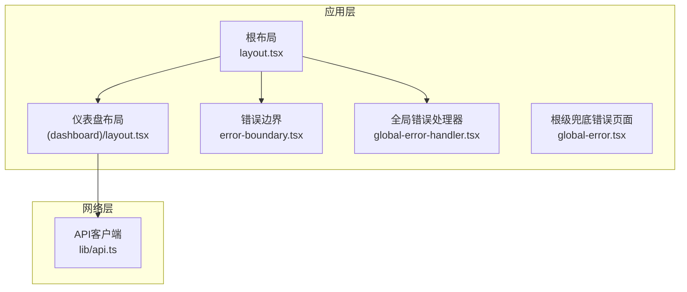
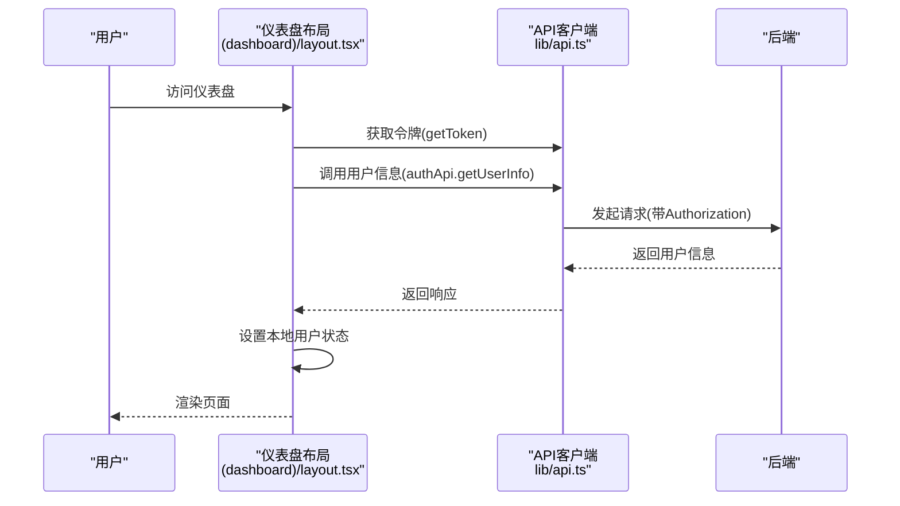
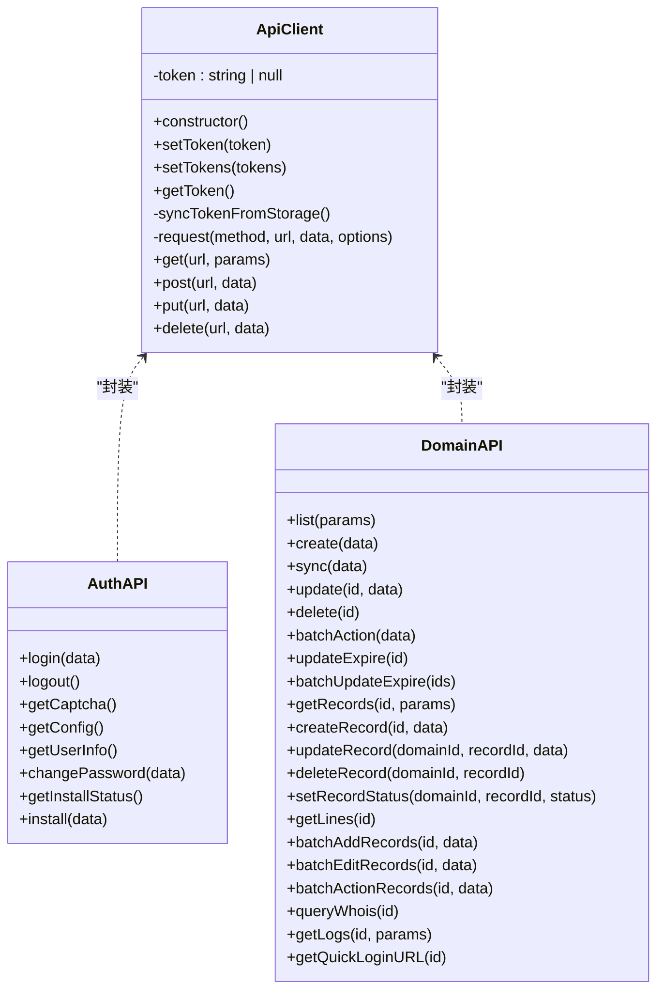
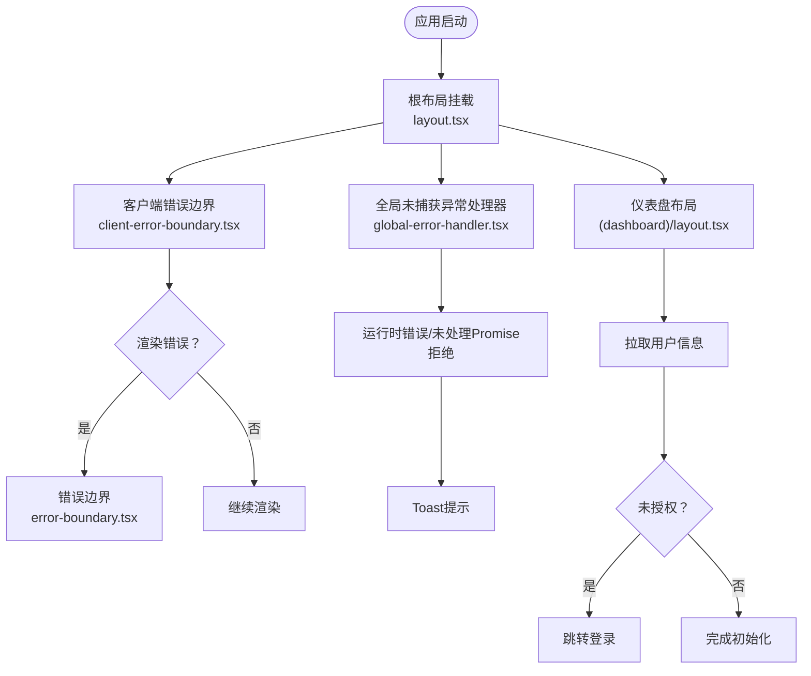
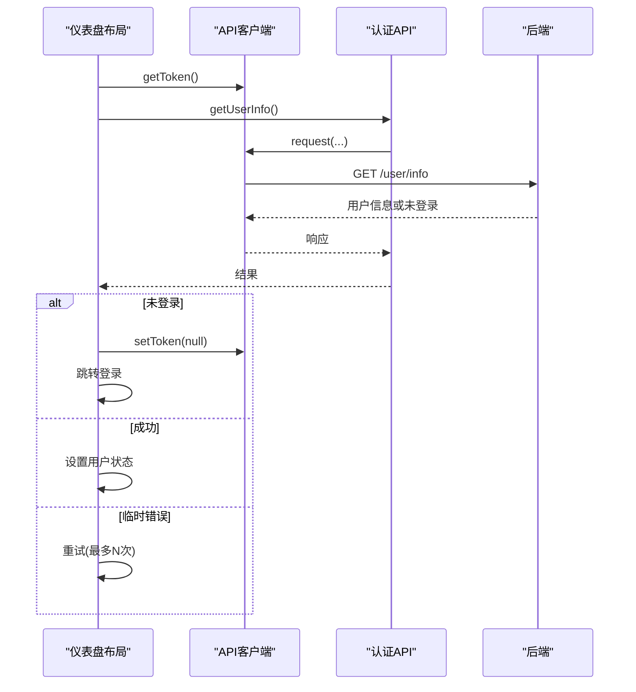
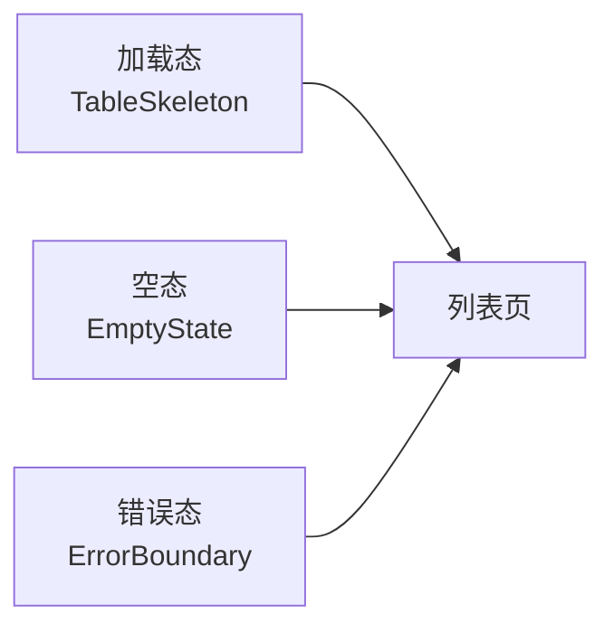
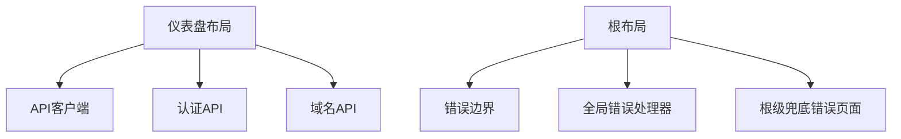

# 状态管理与API调用

<cite>
**本文引用的文件**
- [web/lib/api.ts](file://web/lib/api.ts)
- [web/app/layout.tsx](file://web/app/layout.tsx)
- [web/components/global-error-handler.tsx](file://web/components/global-error-handler.tsx)
- [web/components/error-boundary.tsx](file://web/components/error-boundary.tsx)
- [web/components/client-error-boundary.tsx](file://web/components/client-error-boundary.tsx)
- [web/app/global-error.tsx](file://web/app/global-error.tsx)
- [web/app/(dashboard)/layout.tsx](file://web/app/(dashboard)/layout.tsx)
- [web/components/table-skeleton.tsx](file://web/components/table-skeleton.tsx)
- [web/components/empty-state.tsx](file://web/components/empty-state.tsx)
</cite>

## 目录
1. [简介](#简介)
2. [项目结构](#项目结构)
3. [核心组件](#核心组件)
4. [架构总览](#架构总览)
5. [详细组件分析](#详细组件分析)
6. [依赖关系分析](#依赖关系分析)
7. [性能考虑](#性能考虑)
8. [故障排查指南](#故障排查指南)
9. [结论](#结论)
10. [附录](#附录)

## 简介
本指南聚焦DNSPlane前端的状态管理与API调用实践，涵盖以下主题：
- 前端状态管理模式：本地状态、全局状态与服务器状态的协同策略
- API客户端实现：请求拦截、响应处理与错误管理
- 数据获取模式：服务端渲染（SSR）、客户端渲染（CSR）与增量静态再生（ISR）的应用场景
- 错误边界与全局错误处理：渲染错误、未捕获异常与根级兜底
- UI反馈设计：加载态、空态与错误态
- 数据缓存策略、乐观更新与冲突解决
- 性能优化：代码分割、懒加载与内存管理
- API版本控制与向后兼容

## 项目结构
DNSPlane采用Next.js App Router组织前端代码，状态与API集中在web目录中：
- web/lib/api.ts：统一的API客户端与业务API封装
- web/app/layout.tsx：根布局与全局错误边界挂载点
- web/components/*：UI组件与错误处理组件
- web/app/(dashboard)/layout.tsx：仪表盘侧边栏与用户信息拉取逻辑

**图表来源**
- [web/app/layout.tsx:14-33](file://web/app/layout.tsx#L14-L33)
- [web/app/(dashboard)/layout.tsx:77-390](file://web/app/(dashboard)/layout.tsx#L77-L390)
- [web/components/error-boundary.tsx:20-135](file://web/components/error-boundary.tsx#L20-L135)
- [web/components/global-error-handler.tsx:14-58](file://web/components/global-error-handler.tsx#L14-L58)
- [web/app/global-error.tsx:9-101](file://web/app/global-error.tsx#L9-L101)
- [web/lib/api.ts:9-124](file://web/lib/api.ts#L9-L124)

**章节来源**
- [web/app/layout.tsx:14-33](file://web/app/layout.tsx#L14-L33)
- [web/app/(dashboard)/layout.tsx:77-390](file://web/app/(dashboard)/layout.tsx#L77-L390)
- [web/lib/api.ts:9-124](file://web/lib/api.ts#L9-L124)

## 核心组件
- API客户端与业务API封装：统一的请求构造、鉴权头注入、401处理、类型化响应与业务模块化API（认证、账户、域名、监控、证书、用户、日志、系统、TOTP、OAuth等）
- 错误边界与全局错误处理：客户端错误边界、全局未捕获异常处理器、根级兜底错误页面
- 状态管理策略：本地状态（组件内部）、全局状态（仪表盘布局中的用户信息与导航状态）、服务器状态（通过API获取与更新）

**章节来源**
- [web/lib/api.ts:9-709](file://web/lib/api.ts#L9-L709)
- [web/components/error-boundary.tsx:20-135](file://web/components/error-boundary.tsx#L20-L135)
- [web/components/global-error-handler.tsx:14-58](file://web/components/global-error-handler.tsx#L14-L58)
- [web/app/(dashboard)/layout.tsx:82-160](file://web/app/(dashboard)/layout.tsx#L82-L160)

## 架构总览
DNSPlane前端采用“布局驱动的状态”与“API客户端驱动的数据流”相结合的架构：
- 布局层负责初始化与同步令牌、拉取用户信息、维护导航状态
- API客户端负责统一的请求/响应处理与错误处理
- 错误处理层覆盖渲染错误、未捕获异常与根级兜底

**图表来源**
- [web/app/(dashboard)/layout.tsx:120-159](file://web/app/(dashboard)/layout.tsx#L120-L159)
- [web/lib/api.ts:53-92](file://web/lib/api.ts#L53-L92)
- [web/lib/api.ts:135-145](file://web/lib/api.ts#L135-L145)

## 详细组件分析

### API客户端与请求流程
- 统一基类与令牌管理：在构造时读取localStorage中的token；提供setToken/setTokens与getToken；请求前同步令牌，确保内存与持久化一致
- 请求拦截与响应处理：自动注入Content-Type与Authorization；credentials包含cookie；401时清除token并跳转登录；统一解析JSON响应
- 业务API封装：按领域拆分（认证、账户、域名、监控、证书、用户、日志、系统、TOTP、OAuth等），每个模块导出typed接口，便于上层直接调用

**图表来源**
- [web/lib/api.ts:9-124](file://web/lib/api.ts#L9-L124)
- [web/lib/api.ts:135-195](file://web/lib/api.ts#L135-L195)

**章节来源**
- [web/lib/api.ts:9-124](file://web/lib/api.ts#L9-L124)
- [web/lib/api.ts:135-195](file://web/lib/api.ts#L135-L195)

### 错误边界与全局错误处理
- 客户端错误边界：捕获渲染错误，提供重试、返回首页、复制错误信息等能力
- 全局未捕获异常处理器：监听window.onerror与unhandledrejection，过滤常见噪音，统一toast提示
- 根级兜底错误页面：当root layout自身崩溃时渲染，作为最后一道防线

**图表来源**
- [web/app/layout.tsx:14-33](file://web/app/layout.tsx#L14-L33)
- [web/components/client-error-boundary.tsx:5-7](file://web/components/client-error-boundary.tsx#L5-L7)
- [web/components/error-boundary.tsx:20-135](file://web/components/error-boundary.tsx#L20-L135)
- [web/components/global-error-handler.tsx:14-58](file://web/components/global-error-handler.tsx#L14-L58)
- [web/app/(dashboard)/layout.tsx:120-159](file://web/app/(dashboard)/layout.tsx#L120-L159)

**章节来源**
- [web/components/error-boundary.tsx:20-135](file://web/components/error-boundary.tsx#L20-L135)
- [web/components/global-error-handler.tsx:14-58](file://web/components/global-error-handler.tsx#L14-L58)
- [web/app/global-error.tsx:9-101](file://web/app/global-error.tsx#L9-L101)

### 仪表盘布局与状态管理
- 本地状态：侧边栏展开状态、导航分组展开状态、用户信息状态
- 全局状态：用户信息（来自后端）与导航权限过滤
- 服务器状态：通过authApi.getUserInfo拉取用户信息，处理未授权与临时错误的重试逻辑

**图表来源**
- [web/app/(dashboard)/layout.tsx:120-159](file://web/app/(dashboard)/layout.tsx#L120-L159)
- [web/lib/api.ts:48-51](file://web/lib/api.ts#L48-L51)
- [web/lib/api.ts:135-145](file://web/lib/api.ts#L135-L145)

**章节来源**
- [web/app/(dashboard)/layout.tsx:82-160](file://web/app/(dashboard)/layout.tsx#L82-L160)

### UI反馈设计：加载态、空态与错误态
- 加载态：表格骨架屏组件，用于列表页数据加载时的占位展示
- 空态：统一空状态组件，支持自定义图标、标题、描述、操作按钮与子节点
- 错误态：错误边界提供错误信息展示、详情折叠、复制错误与重试/返回首页操作

**图表来源**
- [web/components/table-skeleton.tsx:14-37](file://web/components/table-skeleton.tsx#L14-L37)
- [web/components/empty-state.tsx:30-56](file://web/components/empty-state.tsx#L30-L56)
- [web/components/error-boundary.tsx:58-134](file://web/components/error-boundary.tsx#L58-L134)

**章节来源**
- [web/components/table-skeleton.tsx:14-37](file://web/components/table-skeleton.tsx#L14-L37)
- [web/components/empty-state.tsx:30-56](file://web/components/empty-state.tsx#L30-L56)
- [web/components/error-boundary.tsx:58-134](file://web/components/error-boundary.tsx#L58-L134)

### 数据获取模式与状态同步
- SSR：Next.js App Router天然支持SSR，可在服务端拉取初始数据（如仪表盘统计），减少首屏白屏时间
- CSR：客户端路由切换时通过API拉取所需数据，结合骨架屏提升体验
- ISR：对于不频繁变化的静态内容（如帮助文档、公告），可利用Next.js ISR进行增量更新

[本节为概念性说明，无需列出章节来源]

### 数据缓存策略、乐观更新与冲突解决
- 缓存策略：基于HTTP缓存与本地存储（localStorage）结合；令牌与刷新令牌分别持久化，避免跨标签页状态不同步
- 乐观更新：在提交变更时先更新本地状态，再等待后端确认；若失败则回滚
- 冲突解决：对并发写入采用后端校验与提示，必要时提供冲突详情与手动合并入口

[本节为概念性说明，无需列出章节来源]

### API版本控制与向后兼容
- 版本化路径：后端API以/v1等版本前缀区分（示例：/api/v1/...），前端按模块映射对应接口
- 向后兼容：保持现有字段与语义不变，新增字段采用可选方式；对废弃字段提供兼容映射与迁移提示

[本节为概念性说明，无需列出章节来源]

## 依赖关系分析
- 布局层依赖API客户端进行用户信息拉取与令牌管理
- 错误处理组件独立于业务逻辑，通过根布局挂载，形成多层次保护
- 业务API模块依赖统一的ApiClient，保证一致性与可测试性

**图表来源**
- [web/app/(dashboard)/layout.tsx:120-159](file://web/app/(dashboard)/layout.tsx#L120-L159)
- [web/lib/api.ts:9-124](file://web/lib/api.ts#L9-L124)
- [web/app/layout.tsx:14-33](file://web/app/layout.tsx#L14-L33)
- [web/components/error-boundary.tsx:20-135](file://web/components/error-boundary.tsx#L20-L135)
- [web/components/global-error-handler.tsx:14-58](file://web/components/global-error-handler.tsx#L14-L58)
- [web/app/global-error.tsx:9-101](file://web/app/global-error.tsx#L9-L101)

**章节来源**
- [web/app/(dashboard)/layout.tsx:120-159](file://web/app/(dashboard)/layout.tsx#L120-L159)
- [web/lib/api.ts:9-124](file://web/lib/api.ts#L9-L124)
- [web/app/layout.tsx:14-33](file://web/app/layout.tsx#L14-L33)

## 性能考虑
- 代码分割：利用Next.js路由自动分块，减少首屏体积
- 懒加载：对非关键资源与重型组件采用动态导入
- 内存管理：及时清理事件监听器与定时器；在错误边界与全局处理器中避免内存泄漏
- 骨架屏与空态：降低感知延迟，改善用户体验

[本节为通用指导，无需列出章节来源]

## 故障排查指南
- 未登录/登录过期：API层401自动清除token并跳转登录；检查localStorage中的token与refresh_token是否正确写入
- 未捕获异常：全局错误处理器会过滤常见噪音并提示；关注控制台输出与Toast消息
- 渲染错误：错误边界提供复制错误与重试能力；检查组件栈与错误信息
- 根级错误：根级兜底错误页面用于极端情况；检查服务端渲染与客户端hydration差异

**章节来源**
- [web/lib/api.ts:82-88](file://web/lib/api.ts#L82-L88)
- [web/components/global-error-handler.tsx:14-58](file://web/components/global-error-handler.tsx#L14-L58)
- [web/components/error-boundary.tsx:20-135](file://web/components/error-boundary.tsx#L20-L135)
- [web/app/global-error.tsx:9-101](file://web/app/global-error.tsx#L9-L101)

## 结论
DNSPlane前端通过清晰的API客户端与布局驱动的状态管理，实现了稳定的用户态与数据态同步；配合多层次错误处理与友好的UI反馈，显著提升了可用性与可维护性。建议在后续迭代中进一步完善缓存与乐观更新策略，并持续优化首屏性能与错误诊断能力。

## 附录
- 令牌与刷新令牌的持久化与同步策略
- 业务API模块的扩展与类型化约束
- 错误处理组件的定制化与国际化支持

[本节为补充说明，无需列出章节来源]