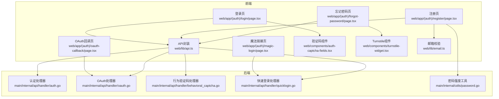
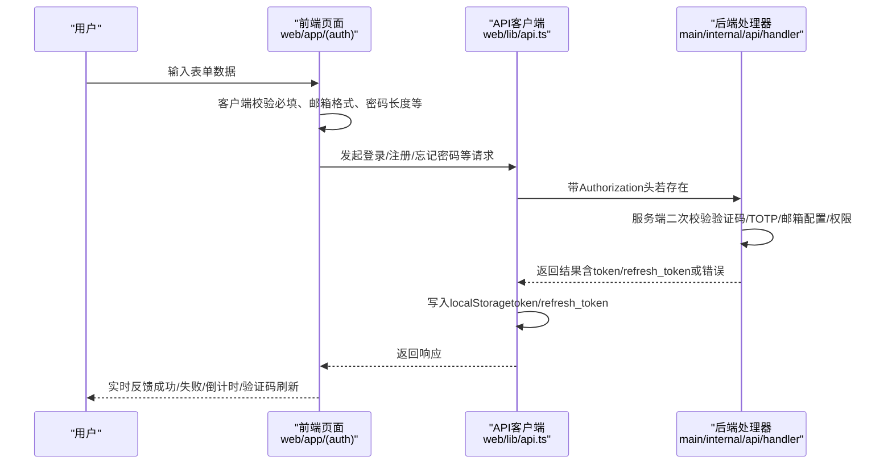
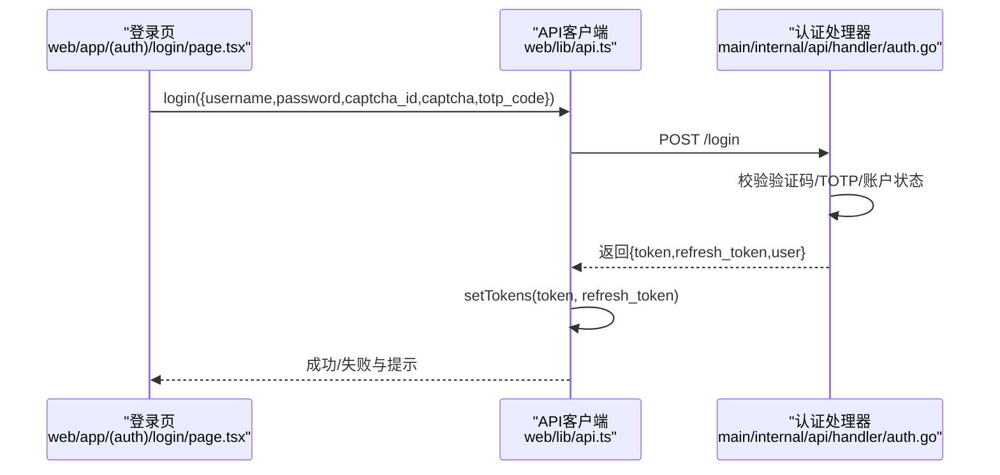
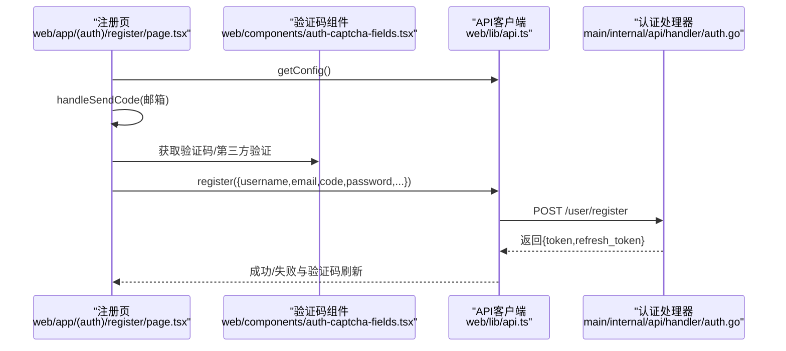
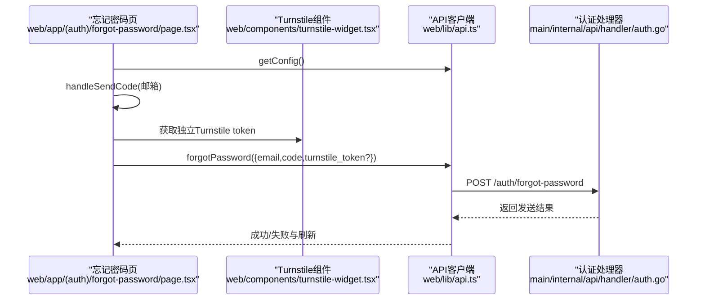
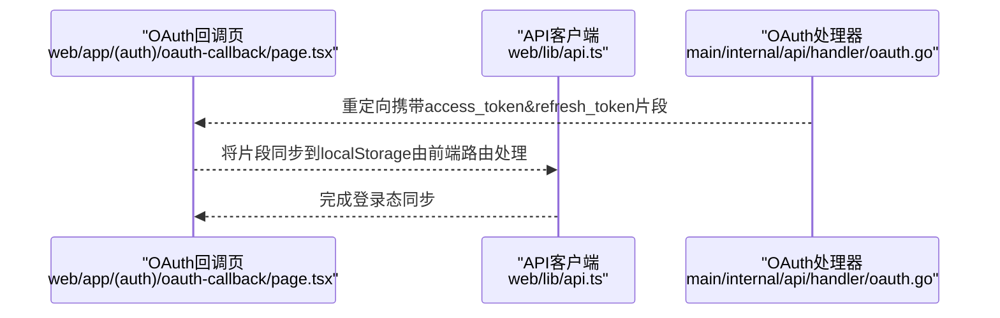
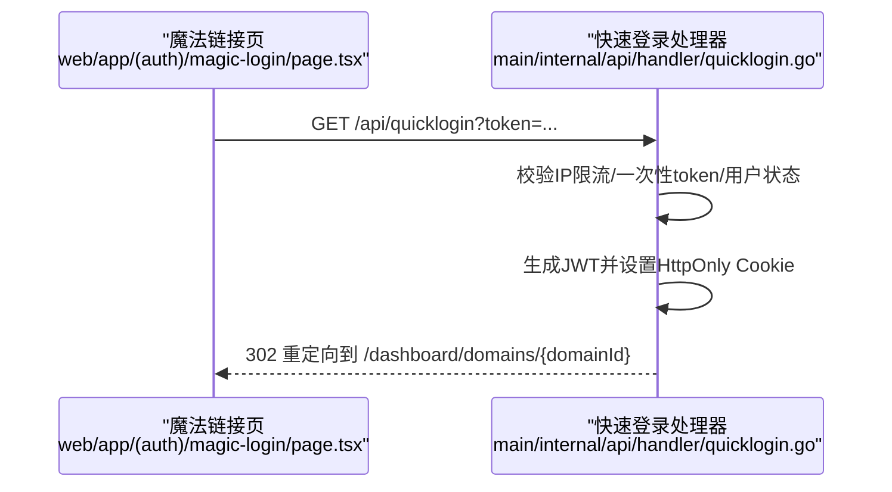
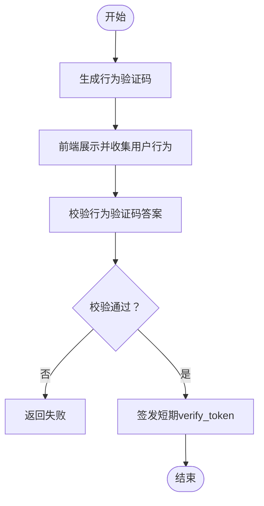
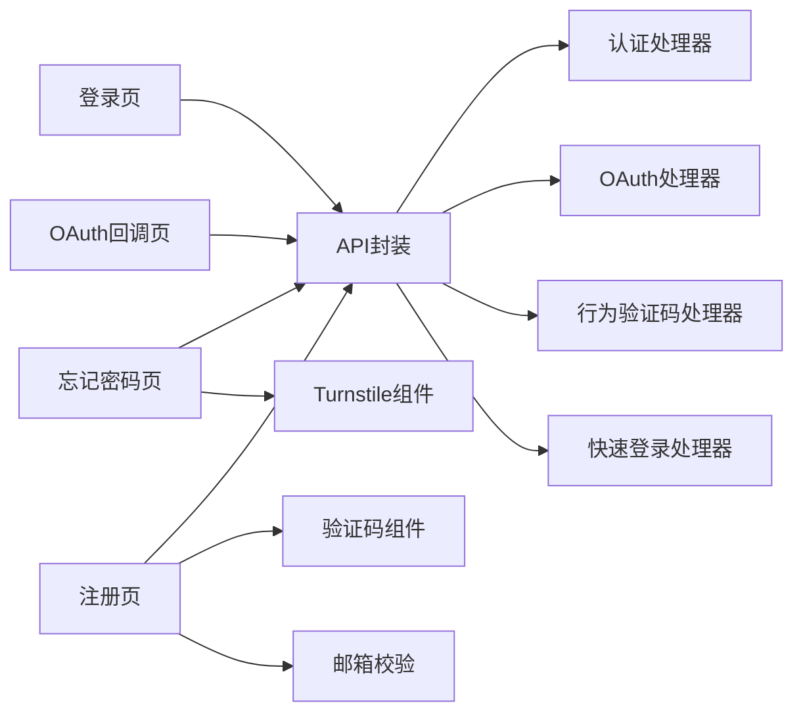

# 表单验证与认证

<cite>
**本文引用的文件**
- [web/app/(auth)/login/page.tsx](file://web/app/(auth)/login/page.tsx)
- [web/app/(auth)/register/page.tsx](file://web/app/(auth)/register/page.tsx)
- [web/app/(auth)/forgot-password/page.tsx](file://web/app/(auth)/forgot-password/page.tsx)
- [web/app/(auth)/magic-login/page.tsx](file://web/app/(auth)/magic-login/page.tsx)
- [web/lib/api.ts](file://web/lib/api.ts)
- [web/components/auth-captcha-fields.tsx](file://web/components/auth-captcha-fields.tsx)
- [web/components/turnstile-widget.tsx](file://web/components/turnstile-widget.tsx)
- [web/lib/email.ts](file://web/lib/email.ts)
- [web/app/(auth)/oauth-callback/page.tsx](file://web/app/(auth)/oauth-callback/page.tsx)
- [main/internal/api/handler/auth.go](file://main/internal/api/handler/auth.go)
- [main/internal/api/handler/oauth.go](file://main/internal/api/handler/oauth.go)
- [main/internal/api/handler/behavioral_captcha.go](file://main/internal/api/handler/behavioral_captcha.go)
- [main/internal/api/handler/quicklogin.go](file://main/internal/api/handler/quicklogin.go)
- [main/internal/utils/password.go](file://main/internal/utils/password.go)
</cite>

## 目录
1. [简介](#简介)
2. [项目结构](#项目结构)
3. [核心组件](#核心组件)
4. [架构总览](#架构总览)
5. [详细组件分析](#详细组件分析)
6. [依赖分析](#依赖分析)
7. [性能考虑](#性能考虑)
8. [故障排查指南](#故障排查指南)
9. [结论](#结论)

## 简介
本文件面向DNSPlane的前端表单验证与认证体系，覆盖以下主题：
- 前端表单验证策略：客户端即时校验、服务端二次校验、实时反馈与错误提示
- 认证流程前端实现：登录、注册、密码重置、OAuth集成、魔法链接登录
- 验证码系统：行为验证码与传统图形验证码/第三方验证码的集成
- 加密与安全：密码哈希、令牌管理、安全通信与会话控制
- 双因子与邮箱验证：TOTP双重认证、邮箱验证码与魔法链接
- 会话管理与自动登录：基于HttpOnly Cookie的会话、刷新令牌与安全令牌轮转
- 用户体验与错误处理：交互优化、错误提示与最佳实践
- CSRF与XSS防护：前端实现要点与建议

## 项目结构
前端认证相关的核心位置集中在web/app/(auth)下的页面组件与web/lib下的API封装，以及验证码与第三方登录组件；后端认证逻辑位于main/internal/api/handler目录。

图表来源
- [web/app/(auth)/login/page.tsx](file://web/app/(auth)/login/page.tsx#L1-L296)
- [web/app/(auth)/register/page.tsx](file://web/app/(auth)/register/page.tsx#L1-L211)
- [web/app/(auth)/forgot-password/page.tsx](file://web/app/(auth)/forgot-password/page.tsx#L1-L151)
- [web/app/(auth)/magic-login/page.tsx](file://web/app/(auth)/magic-login/page.tsx#L1-L62)
- [web/app/(auth)/oauth-callback/page.tsx](file://web/app/(auth)/oauth-callback/page.tsx#L1-L6)
- [web/lib/api.ts:1-709](file://web/lib/api.ts#L1-L709)
- [web/components/auth-captcha-fields.tsx:1-358](file://web/components/auth-captcha-fields.tsx#L1-L358)
- [web/components/turnstile-widget.tsx:1-114](file://web/components/turnstile-widget.tsx#L1-L114)
- [web/lib/email.ts:1-7](file://web/lib/email.ts#L1-L7)
- [main/internal/api/handler/auth.go:1-759](file://main/internal/api/handler/auth.go#L1-L759)
- [main/internal/api/handler/oauth.go:1-448](file://main/internal/api/handler/oauth.go#L1-L448)
- [main/internal/api/handler/behavioral_captcha.go:1-100](file://main/internal/api/handler/behavioral_captcha.go#L1-L100)
- [main/internal/api/handler/quicklogin.go:1-173](file://main/internal/api/handler/quicklogin.go#L1-L173)
- [main/internal/utils/password.go:1-46](file://main/internal/utils/password.go#L1-L46)

章节来源
- [web/lib/api.ts:1-709](file://web/lib/api.ts#L1-L709)
- [main/internal/api/handler/auth.go:1-759](file://main/internal/api/handler/auth.go#L1-L759)

## 核心组件
- 前端API客户端：统一处理鉴权头、本地存储令牌、401自动跳转登录
- 登录页：支持管理员初始化、图形验证码、TOTP二次验证
- 注册页：邮箱验证码、图形/第三方验证码、密码强度校验
- 忘记密码页：邮箱验证码、独立Turnstile校验
- OAuth回调页：接收后端重定向的访问令牌并同步到前端
- 验证码组件：图形验证码、Cloudflare Turnstile、reCAPTCHA、hCaptcha
- 行为验证码：go-captcha行为验证（点选/滑动/旋转）
- 快速登录：一次性魔法链接，缓存+限流+一次性使用
- 密码强度工具：后端密码复杂度校验

章节来源
- [web/lib/api.ts:1-709](file://web/lib/api.ts#L1-L709)
- [web/app/(auth)/login/page.tsx](file://web/app/(auth)/login/page.tsx#L1-L296)
- [web/app/(auth)/register/page.tsx](file://web/app/(auth)/register/page.tsx#L1-L211)
- [web/app/(auth)/forgot-password/page.tsx](file://web/app/(auth)/forgot-password/page.tsx#L1-L151)
- [web/app/(auth)/oauth-callback/page.tsx](file://web/app/(auth)/oauth-callback/page.tsx#L1-L6)
- [web/components/auth-captcha-fields.tsx:1-358](file://web/components/auth-captcha-fields.tsx#L1-L358)
- [web/components/turnstile-widget.tsx:1-114](file://web/components/turnstile-widget.tsx#L1-L114)
- [main/internal/api/handler/behavioral_captcha.go:1-100](file://main/internal/api/handler/behavioral_captcha.go#L1-L100)
- [main/internal/api/handler/quicklogin.go:1-173](file://main/internal/api/handler/quicklogin.go#L1-L173)
- [main/internal/utils/password.go:1-46](file://main/internal/utils/password.go#L1-L46)

## 架构总览
前端通过统一API客户端发起请求，后端根据配置与业务逻辑执行认证、验证码校验、TOTP校验、邮件发送与快速登录等操作。令牌采用JWT并通过HttpOnly Cookie持久化，配合localStorage中的refresh_token实现安全刷新。

图表来源
- [web/lib/api.ts:1-709](file://web/lib/api.ts#L1-L709)
- [main/internal/api/handler/auth.go:1-759](file://main/internal/api/handler/auth.go#L1-L759)
- [main/internal/api/handler/oauth.go:1-448](file://main/internal/api/handler/oauth.go#L1-L448)
- [main/internal/api/handler/quicklogin.go:1-173](file://main/internal/api/handler/quicklogin.go#L1-L173)

## 详细组件分析

### 登录流程（含验证码与TOTP）
- 前端策略
  - 初始化检查安装状态与认证配置，按需加载图形验证码
  - 客户端必填校验与验证码/TOTP非空校验
  - 成功后写入token与refresh_token至localStorage，跳转仪表盘
  - 失败时刷新验证码并提示
- 后端策略
  - 可配置登录验证码开关
  - bcrypt校验密码，禁用账户拦截
  - 若启用TOTP且缺失或错误，返回“需要TOTP”状态码
  - 生成JWT并设置HttpOnly Cookie，记录刷新令牌JTI

图表来源
- [web/app/(auth)/login/page.tsx](file://web/app/(auth)/login/page.tsx#L109-L161)
- [web/lib/api.ts:30-37](file://web/lib/api.ts#L30-L37)
- [main/internal/api/handler/auth.go:67-161](file://main/internal/api/handler/auth.go#L67-L161)

章节来源
- [web/app/(auth)/login/page.tsx](file://web/app/(auth)/login/page.tsx#L1-L296)
- [main/internal/api/handler/auth.go:1-759](file://main/internal/api/handler/auth.go#L1-L759)

### 注册流程（邮箱验证码与验证码组件）
- 前端策略
  - 读取系统配置决定是否开放注册、是否启用验证码及类型
  - 邮箱格式校验与倒计时发送验证码
  - 支持图形验证码与第三方验证码（Turnstile/reCAPTCHA/hCaptcha）
  - 客户端密码长度校验，提交时合并验证码参数
- 后端策略
  - 严格邮箱格式与验证码校验
  - 开启TOTP时可引导用户绑定TOTP
  - 成功后返回token与refresh_token

图表来源
- [web/app/(auth)/register/page.tsx](file://web/app/(auth)/register/page.tsx#L45-L131)
- [web/components/auth-captcha-fields.tsx:56-169](file://web/components/auth-captcha-fields.tsx#L56-L169)
- [web/lib/email.ts:1-7](file://web/lib/email.ts#L1-L7)
- [web/lib/api.ts:135-146](file://web/lib/api.ts#L135-L146)
- [main/internal/api/handler/auth.go:1-759](file://main/internal/api/handler/auth.go#L1-L759)

章节来源
- [web/app/(auth)/register/page.tsx](file://web/app/(auth)/register/page.tsx#L1-L211)
- [web/components/auth-captcha-fields.tsx:1-358](file://web/components/auth-captcha-fields.tsx#L1-L358)
- [web/lib/email.ts:1-7](file://web/lib/email.ts#L1-L7)
- [main/internal/api/handler/auth.go:1-759](file://main/internal/api/handler/auth.go#L1-L759)

### 忘记密码与独立Turnstile校验
- 前端策略
  - 读取系统配置决定是否强制独立Turnstile
  - 邮箱验证码发送与倒计时
  - 提交时附带Turnstile token（如启用）
- 后端策略
  - 邮件配置检查与重置Token生成（30分钟有效）
  - 安全性：对不存在用户也返回“可能已发送”的通用提示

图表来源
- [web/app/(auth)/forgot-password/page.tsx](file://web/app/(auth)/forgot-password/page.tsx#L32-L91)
- [web/components/turnstile-widget.tsx:40-97](file://web/components/turnstile-widget.tsx#L40-L97)
- [web/lib/api.ts:135-146](file://web/lib/api.ts#L135-L146)
- [main/internal/api/handler/auth.go:482-533](file://main/internal/api/handler/auth.go#L482-L533)

章节来源
- [web/app/(auth)/forgot-password/page.tsx](file://web/app/(auth)/forgot-password/page.tsx#L1-L151)
- [web/components/turnstile-widget.tsx:1-114](file://web/components/turnstile-widget.tsx#L1-L114)
- [main/internal/api/handler/auth.go:482-533](file://main/internal/api/handler/auth.go#L482-L533)

### OAuth集成与回调
- 前端策略
  - OAuth回调页仅负责展示与接收后端重定向的访问令牌片段
- 后端策略
  - 生成state并缓存，回调时校验state与过期
  - 已绑定用户直接登录并更新第三方令牌
  - 未绑定用户：若开放注册则自动创建并绑定
  - 登录成功后设置HttpOnly Cookie并重定向至前端回调页

图表来源
- [web/app/(auth)/oauth-callback/page.tsx](file://web/app/(auth)/oauth-callback/page.tsx#L1-L6)
- [main/internal/api/handler/oauth.go:270-299](file://main/internal/api/handler/oauth.go#L270-L299)

章节来源
- [web/app/(auth)/oauth-callback/page.tsx](file://web/app/(auth)/oauth-callback/page.tsx#L1-L6)
- [main/internal/api/handler/oauth.go:1-448](file://main/internal/api/handler/oauth.go#L1-L448)

### 魔法链接登录（快速登录）
- 前端策略
  - 魔法链接页从URL提取token并跳转至后端快速登录接口
- 后端策略
  - 一次性使用：校验token并立即删除
  - IP限流（每小时30次）
  - 校验用户状态与权限，生成JWT并设置HttpOnly Cookie，重定向到域名管理页

图表来源
- [web/app/(auth)/magic-login/page.tsx](file://web/app/(auth)/magic-login/page.tsx#L19-L61)
- [main/internal/api/handler/quicklogin.go:113-172](file://main/internal/api/handler/quicklogin.go#L113-L172)

章节来源
- [web/app/(auth)/magic-login/page.tsx](file://web/app/(auth)/magic-login/page.tsx#L1-L62)
- [main/internal/api/handler/quicklogin.go:1-173](file://main/internal/api/handler/quicklogin.go#L1-L173)

### 行为验证码系统
- 前端策略
  - 支持点击、滑动、旋转三种行为验证码类型
  - 通过后端接口生成并校验，成功返回短期verify_token
- 后端策略
  - 生成行为验证码并校验答案
  - 将verify_token写入缓存（TTL较短），用于后续登录等场景一次性消费

图表来源
- [main/internal/api/handler/behavioral_captcha.go:32-85](file://main/internal/api/handler/behavioral_captcha.go#L32-L85)

章节来源
- [main/internal/api/handler/behavioral_captcha.go:1-100](file://main/internal/api/handler/behavioral_captcha.go#L1-L100)

### 验证码组件与第三方集成
- 图形验证码：支持加载、刷新与错误提示
- 第三方验证码：Turnstile、reCAPTCHA、hCaptcha，按配置动态渲染与回调
- 独立Turnstile：忘记密码等场景可单独启用

章节来源
- [web/components/auth-captcha-fields.tsx:1-358](file://web/components/auth-captcha-fields.tsx#L1-L358)
- [web/components/turnstile-widget.tsx:1-114](file://web/components/turnstile-widget.tsx#L1-L114)

### 会话管理与令牌刷新
- 前端
  - 使用localStorage存储token与refresh_token
  - 请求前从localStorage同步内存中的token，确保多标签页一致性
  - 401时清理token并跳转登录
- 后端
  - JWT设置HttpOnly Cookie，刷新令牌JTI存储用于轮转验证
  - OAuth登录成功后重定向携带访问令牌片段，前端同步到localStorage

章节来源
- [web/lib/api.ts:18-51](file://web/lib/api.ts#L18-L51)
- [main/internal/api/handler/oauth.go:270-299](file://main/internal/api/handler/oauth.go#L270-L299)

### 密码哈希与强度校验
- 密码哈希：bcrypt
- 强度校验：后端提供密码复杂度规则（长度、大小写、数字）

章节来源
- [main/internal/api/handler/auth.go:198-229](file://main/internal/api/handler/auth.go#L198-L229)
- [main/internal/utils/password.go:1-46](file://main/internal/utils/password.go#L1-L46)

### 邮箱验证、TOTP与魔法链接
- 邮箱验证：注册/重置流程均依赖系统邮件配置
- TOTP：启用/验证/禁用流程，支持管理员重置
- 魔法链接：快速登录一次性token，缓存+限流+一次性使用

章节来源
- [main/internal/api/handler/auth.go:482-670](file://main/internal/api/handler/auth.go#L482-L670)
- [main/internal/api/handler/quicklogin.go:1-173](file://main/internal/api/handler/quicklogin.go#L1-L173)

## 依赖分析
- 前端页面依赖API封装与验证码组件
- API封装统一处理Authorization头与401跳转
- 后端处理器按功能分层：认证、OAuth、行为验证码、快速登录
- 组件间耦合度低，通过props与回调传递状态

图表来源
- [web/lib/api.ts:1-709](file://web/lib/api.ts#L1-L709)
- [main/internal/api/handler/auth.go:1-759](file://main/internal/api/handler/auth.go#L1-L759)
- [main/internal/api/handler/oauth.go:1-448](file://main/internal/api/handler/oauth.go#L1-L448)
- [main/internal/api/handler/behavioral_captcha.go:1-100](file://main/internal/api/handler/behavioral_captcha.go#L1-L100)
- [main/internal/api/handler/quicklogin.go:1-173](file://main/internal/api/handler/quicklogin.go#L1-L173)

## 性能考虑
- 前端
  - 验证码加载与刷新采用防抖与错误回退，减少无效请求
  - localStorage同步与401自动跳转降低重复请求
- 后端
  - 行为验证码使用缓存存储verify_token，TTL短、命中率高
  - 快速登录IP限流，防止滥用
- 建议
  - 对高频接口增加前端缓存策略
  - 合理设置验证码与邮件发送的冷却时间

## 故障排查指南
- 登录失败
  - 检查验证码/TOTP是否正确，必要时刷新验证码
  - 确认账户状态正常
- 注册失败
  - 确认系统是否开放注册与验证码配置
  - 检查邮箱格式与验证码倒计时
- 忘记密码
  - 确认邮件配置与独立Turnstile是否启用
  - 检查链接有效期（30分钟）
- OAuth登录
  - 检查state校验与回调URI配置
  - 确认第三方提供商返回的用户信息可用
- 快速登录
  - 检查token是否过期或已被使用
  - 查看IP限流是否触发

章节来源
- [web/app/(auth)/login/page.tsx](file://web/app/(auth)/login/page.tsx#L142-L158)
- [web/app/(auth)/register/page.tsx](file://web/app/(auth)/register/page.tsx#L88-L103)
- [web/app/(auth)/forgot-password/page.tsx](file://web/app/(auth)/forgot-password/page.tsx#L69-L85)
- [main/internal/api/handler/oauth.go:111-122](file://main/internal/api/handler/oauth.go#L111-L122)
- [main/internal/api/handler/quicklogin.go:113-133](file://main/internal/api/handler/quicklogin.go#L113-L133)

## 结论
DNSPlane的表单验证与认证体系在前端实现了完善的客户端校验与实时反馈，在后端通过严格的二次校验与多种安全机制保障了整体安全性。验证码系统支持传统与行为验证码，OAuth与魔法链接提供了多样化的登录路径。结合HttpOnly Cookie与刷新令牌，系统在易用性与安全性之间取得了良好平衡。建议持续关注验证码与邮件配置的维护，以及对高频接口的性能优化与限流策略。