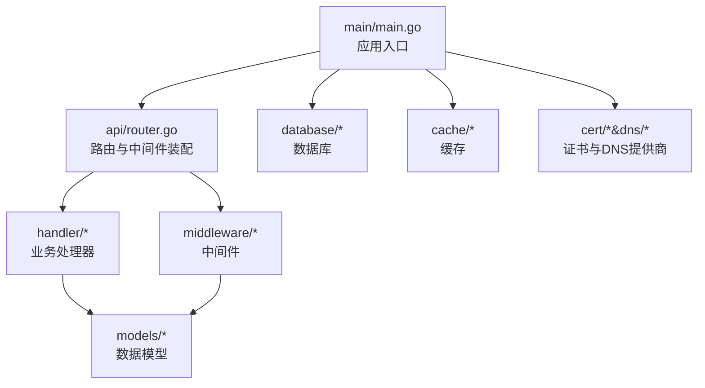
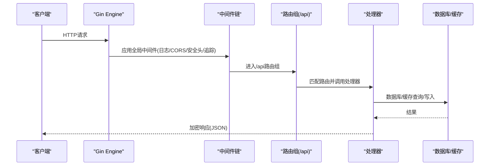
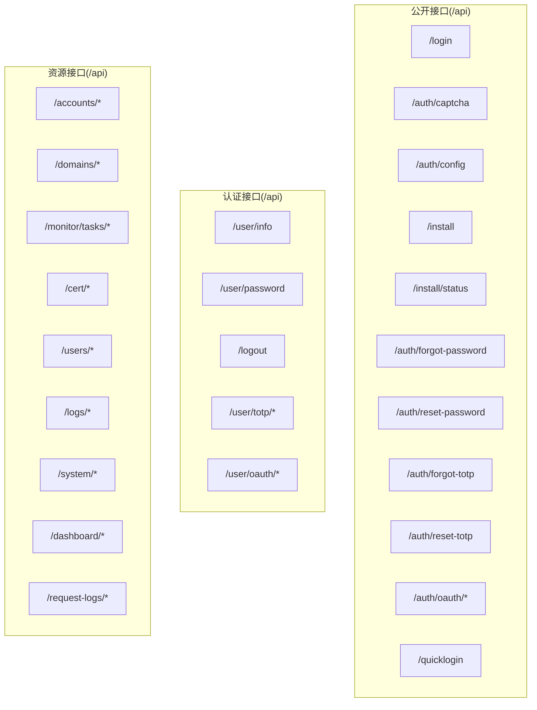
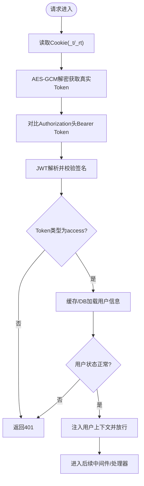
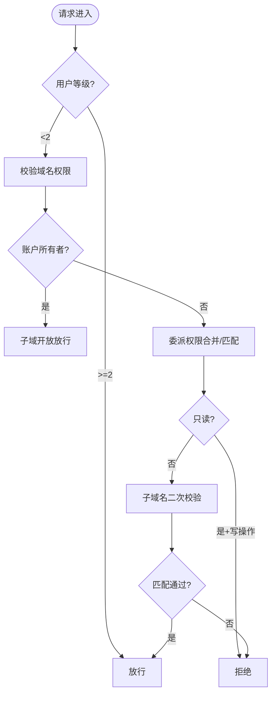
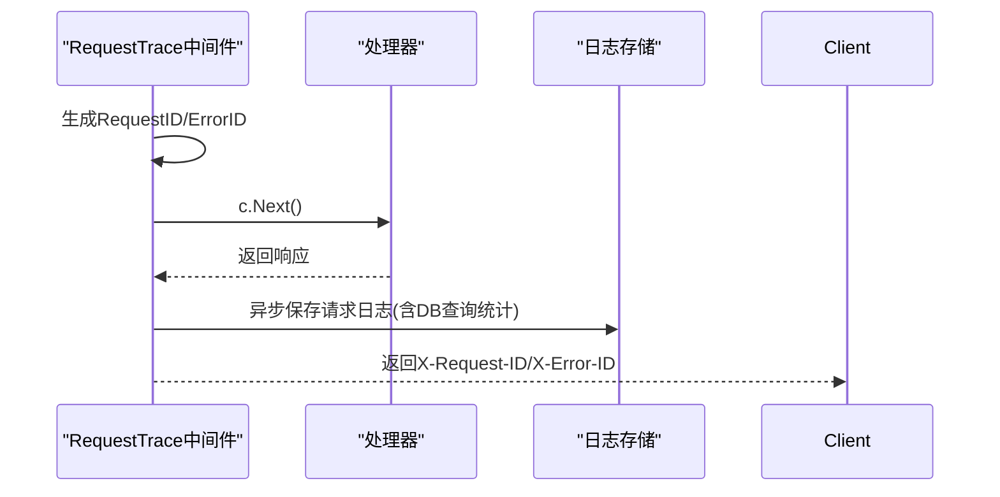
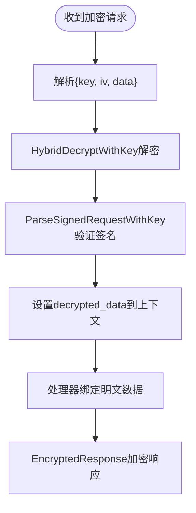
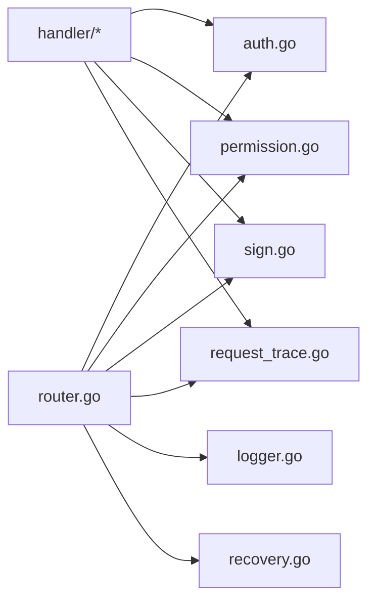

# API开发

<cite>
**本文档引用的文件**
- [main.go](file://main/main.go)
- [router.go](file://main/internal/api/router.go)
- [auth.go](file://main/internal/api/middleware/auth.go)
- [logger.go](file://main/internal/api/middleware/logger.go)
- [recovery.go](file://main/internal/api/middleware/recovery.go)
- [permission.go](file://main/internal/api/middleware/permission.go)
- [sign.go](file://main/internal/api/middleware/sign.go)
- [request_trace.go](file://main/internal/api/middleware/request_trace.go)
- [auth_handler.go](file://main/internal/api/handler/auth.go)
- [user_handler.go](file://main/internal/api/handler/user.go)
- [domain_handler.go](file://main/internal/api/handler/domain.go)
- [account_handler.go](file://main/internal/api/handler/account.go)
- [monitor_handler.go](file://main/internal/api/handler/monitor.go)
- [cert_handler.go](file://main/internal/api/handler/cert.go)
- [dashboard_handler.go](file://main/internal/api/handler/dashboard.go)
</cite>

## 目录
1. [简介](#简介)
2. [项目结构](#项目结构)
3. [核心组件](#核心组件)
4. [架构总览](#架构总览)
5. [详细组件分析](#详细组件分析)
6. [依赖关系分析](#依赖关系分析)
7. [性能考虑](#性能考虑)
8. [故障排除指南](#故障排除指南)
9. [结论](#结论)

## 简介
本指南面向DNSPlane API开发，基于Gin框架构建，涵盖路由配置、请求处理、中间件体系、认证与授权、错误处理与响应格式化等。文档以代码为依据，提供从架构到实现细节的全面解读，并给出最佳实践与排障建议。

## 项目结构
DNSPlane采用分层与按功能模块划分的组织方式：
- main入口负责应用初始化、配置加载、服务启动与生命周期管理
- api层包含路由定义、处理器与中间件
- handler层实现业务逻辑
- middleware层提供横切能力（认证、日志、权限、签名等）
- 其他子系统如数据库、缓存、DNS提供商、证书管理等通过服务层集成

**图示来源**
- [main.go:1-148](file://main/main.go#L1-L148)
- [router.go:1-275](file://main/internal/api/router.go#L1-L275)

**章节来源**
- [main.go:1-148](file://main/main.go#L1-L148)
- [router.go:1-275](file://main/internal/api/router.go#L1-L275)

## 核心组件
- 路由与中间件装配：在router.go中定义/api前缀路由组，挂载日志、CORS、安全头、请求追踪、权限与认证等中间件
- 认证中间件：基于HttpOnly Cookie与JWT，支持Access/Refresh Token双层校验与JTI轮转
- 权限中间件：基于用户模块权限与域名/子域名委派权限的细粒度控制
- 请求追踪与日志：统一请求ID、错误ID、数据库查询统计、响应体截断与异步落库
- 处理器：按领域拆分（认证、用户、账户、域名、监控、证书、仪表盘等）

**章节来源**
- [router.go:14-162](file://main/internal/api/router.go#L14-L162)
- [auth.go:124-199](file://main/internal/api/middleware/auth.go#L124-L199)
- [permission.go:132-207](file://main/internal/api/middleware/permission.go#L132-L207)
- [request_trace.go:58-192](file://main/internal/api/middleware/request_trace.go#L58-L192)

## 架构总览
Gin路由在根级别创建engine，挂载全局中间件后，将/api路径交由router.go定义的路由组处理。处理器通过中间件提供的上下文与工具函数完成业务逻辑，统一返回加密响应。

**图示来源**
- [router.go:14-162](file://main/internal/api/router.go#L14-L162)
- [logger.go:156-232](file://main/internal/api/middleware/logger.go#L156-L232)
- [request_trace.go:58-192](file://main/internal/api/middleware/request_trace.go#L58-L192)

## 详细组件分析

### 路由与API组织
- 公开接口：登录、验证码、OAuth、安装状态、密码/TOTP重置等
- 认证接口：用户信息、密码修改、登出、TOTP管理、OAuth绑定等
- 资源接口：账户、域名、记录、监控任务、证书订单与部署、系统配置、日志、仪表盘等

**图示来源**
- [router.go:21-162](file://main/internal/api/router.go#L21-L162)

**章节来源**
- [router.go:21-162](file://main/internal/api/router.go#L21-L162)

### 认证与会话
- Cookie加密：Access/Refresh Token通过AES-GCM加密存储于_ht/_rt Cookie，避免明文泄露
- Token签发：短期Access Token(15分钟)与长期Refresh Token(7天)，支持JTI轮转防重放
- 双重校验：Cookie解密后的Token与Authorization头Bearer Token一致性校验
- 缓存优化：认证用户信息缓存(30秒)，降低DB/Redis往返
- 安全头：X-Content-Type-Options、X-Frame-Options、X-XSS-Protection、Strict-Transport-Security等

**图示来源**
- [auth.go:124-199](file://main/internal/api/middleware/auth.go#L124-L199)
- [auth.go:295-310](file://main/internal/api/middleware/auth.go#L295-L310)

**章节来源**
- [auth.go:124-199](file://main/internal/api/middleware/auth.go#L124-L199)
- [auth.go:295-310](file://main/internal/api/middleware/auth.go#L295-L310)

### 权限控制
- 用户模块权限：管理员(level>=2)放行；普通用户需具备功能模块权限
- 域名权限：账户所有者完全开放；委派权限支持只读与子域名白名单
- 子域名权限：精确匹配或通配符，写操作受只读限制
- 中间件职责：在请求早期校验并注入权限上下文，处理器仅做业务判断

**图示来源**
- [permission.go:132-207](file://main/internal/api/middleware/permission.go#L132-L207)
- [permission.go:309-335](file://main/internal/api/middleware/permission.go#L309-L335)

**章节来源**
- [permission.go:132-207](file://main/internal/api/middleware/permission.go#L132-L207)
- [permission.go:309-335](file://main/internal/api/middleware/permission.go#L309-L335)

### 请求追踪与日志
- 统一ID：请求ID(X-Request-ID)与错误ID(X-Error-ID)，便于排障
- 请求体与响应体：请求体截断(64KB)，成功响应不落库，错误响应可携带原始结构(截断256KB)
- 数据库查询：收集SQL、耗时、影响行数与错误，聚合上报
- 日志落库：异步写入请求日志表，同时写入Redis(若启用)

**图示来源**
- [request_trace.go:58-192](file://main/internal/api/middleware/request_trace.go#L58-L192)

**章节来源**
- [request_trace.go:58-192](file://main/internal/api/middleware/request_trace.go#L58-L192)

### 加密与签名中间件
- 解密与验证：接收{key, iv, data}，使用HybridDecryptWithKey解密，再用签名密钥验证
- 明文透传：将解密后的明文放入上下文，处理器可直接BindDecryptedData
- 加密响应：对响应体进行加密与混淆，保障传输安全

**图示来源**
- [sign.go:14-177](file://main/internal/api/middleware/sign.go#L14-L177)

**章节来源**
- [sign.go:14-177](file://main/internal/api/middleware/sign.go#L14-L177)

### 处理器功能概览
- 认证相关：登录、登出、用户信息、密码修改、TOTP启用/禁用、OAuth绑定、安装与状态
- 用户与权限：用户列表、创建/更新/删除、权限增删改查、API Key重置
- 账户与域名：账户增删改查、连接检测、域名增删改同步、记录增删改查、批量操作
- 监控：任务列表、创建/更新/删除、开关/切换、日志与历史、可用率统计
- 证书：账户与订单管理、自动/手动处理、下载、部署
- 仪表盘：统计、通知测试、缓存清理、代理测试、任务状态与定时配置

**章节来源**
- [auth_handler.go:67-149](file://main/internal/api/handler/auth.go#L67-L149)
- [user_handler.go:23-357](file://main/internal/api/handler/user.go#L23-L357)
- [account_handler.go:85-449](file://main/internal/api/handler/account.go#L85-L449)
- [domain_handler.go:79-728](file://main/internal/api/handler/domain.go#L79-L728)
- [monitor_handler.go:106-800](file://main/internal/api/handler/monitor.go#L106-L800)
- [cert_handler.go:23-800](file://main/internal/api/handler/cert.go#L23-L800)
- [dashboard_handler.go:42-610](file://main/internal/api/handler/dashboard.go#L42-L610)

### API使用示例与最佳实践
- 登录与会话
  - POST /api/login：携带用户名、密码、验证码(TOTP可选)，成功后设置加密Cookie
  - 建议：生产环境强制HTTPS，使用CORS白名单，启用安全头
- 数据请求
  - 使用DecryptAndVerify中间件时，请求体格式为{key, iv, data}，处理器使用BindDecryptedData绑定
  - 响应统一为加密JSON，包含code/msg/data字段
- 权限控制
  - 管理员(level>=2)可操作所有资源；普通用户需满足模块权限与域名/子域名委派
  - 写操作自动受只读委派限制
- 错误处理
  - 统一返回{code, msg}，code=-1表示业务错误；服务端错误返回-1并记录堆栈
  - 使用SetError标记错误上下文，X-Error-ID用于定位

**章节来源**
- [auth_handler.go:67-149](file://main/internal/api/handler/auth.go#L67-L149)
- [sign.go:100-177](file://main/internal/api/middleware/sign.go#L100-L177)
- [permission.go:132-207](file://main/internal/api/middleware/permission.go#L132-L207)
- [request_trace.go:202-223](file://main/internal/api/middleware/request_trace.go#L202-L223)

## 依赖关系分析
- 路由依赖中间件：/api路由组依赖认证、权限、签名、追踪等中间件
- 处理器依赖中间件：处理器通过中间件注入的上下文获取用户信息、权限、解密数据
- 中间件依赖工具：认证依赖JWT、AES-GCM；日志依赖请求追踪；签名依赖混合加密工具

**图示来源**
- [router.go:14-162](file://main/internal/api/router.go#L14-L162)
- [auth.go:124-199](file://main/internal/api/middleware/auth.go#L124-L199)
- [permission.go:132-207](file://main/internal/api/middleware/permission.go#L132-L207)
- [sign.go:14-177](file://main/internal/api/middleware/sign.go#L14-L177)
- [request_trace.go:58-192](file://main/internal/api/middleware/request_trace.go#L58-L192)
- [logger.go:156-232](file://main/internal/api/middleware/logger.go#L156-L232)
- [recovery.go:21-75](file://main/internal/api/middleware/recovery.go#L21-L75)

**章节来源**
- [router.go:14-162](file://main/internal/api/router.go#L14-L162)

## 性能考虑
- 认证缓存：用户信息缓存30秒，显著降低DB/Redis查询压力
- 分页与限制：域名/记录/监控等列表接口默认分页上限，避免大结果集
- 并行查询：仪表盘统计采用并行SQL，减少等待时间
- 响应体截断：请求/响应体截断避免日志过大与内存占用
- 慢请求告警：日志中间件对慢请求进行告警，便于识别瓶颈

**章节来源**
- [auth.go:442-453](file://main/internal/api/middleware/auth.go#L442-L453)
- [domain_handler.go:79-196](file://main/internal/api/handler/domain.go#L79-L196)
- [dashboard_handler.go:67-98](file://main/internal/api/handler/dashboard.go#L67-L98)
- [logger.go:156-232](file://main/internal/api/middleware/logger.go#L156-L232)

## 故障排除指南
- 401未登录/会话过期
  - 检查_ht/_rt Cookie是否存在且可被AES-GCM解密
  - 确认Authorization头Bearer Token与Cookie一致
- 403无权限
  - 管理员需level>=2；普通用户需模块权限与域名/子域名委派
  - 只读委派禁止写操作
- 500服务器内部错误
  - 查看X-Error-ID对应的堆栈日志
  - 检查Recovery中间件记录的panic信息
- 日志与追踪
  - 通过X-Request-ID关联请求日志，定位慢查询与错误
  - 错误响应包含错误ID，便于跨系统排查

**章节来源**
- [auth.go:124-199](file://main/internal/api/middleware/auth.go#L124-L199)
- [permission.go:132-207](file://main/internal/api/middleware/permission.go#L132-L207)
- [recovery.go:21-75](file://main/internal/api/middleware/recovery.go#L21-L75)
- [request_trace.go:202-223](file://main/internal/api/middleware/request_trace.go#L202-L223)

## 结论
DNSPlane API以Gin为核心，结合自研中间件实现了高安全性、可观测性与可扩展性的后端服务。通过模块化路由、细粒度权限控制、统一加密响应与请求追踪，开发者可以快速构建稳定可靠的API。建议在生产环境中严格启用HTTPS、CORS白名单与安全头，并配合完善的监控与日志体系持续优化性能与稳定性。