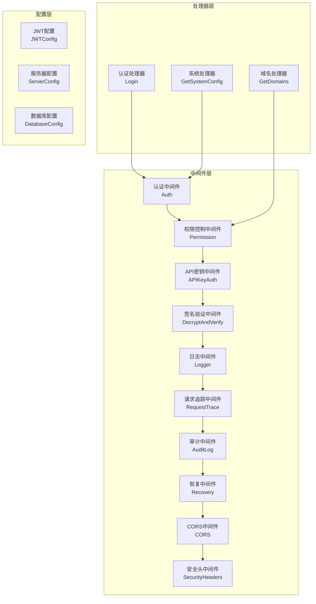
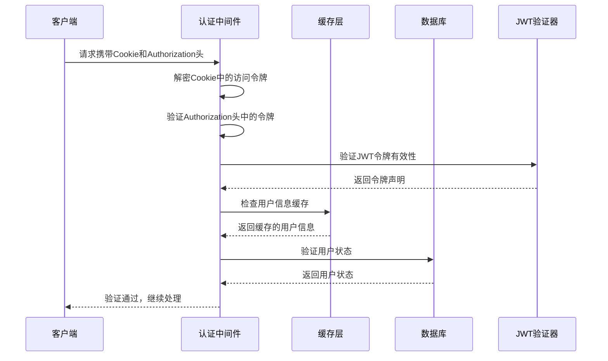
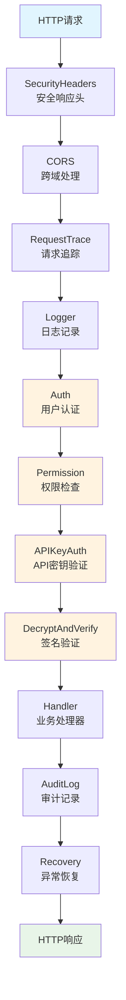
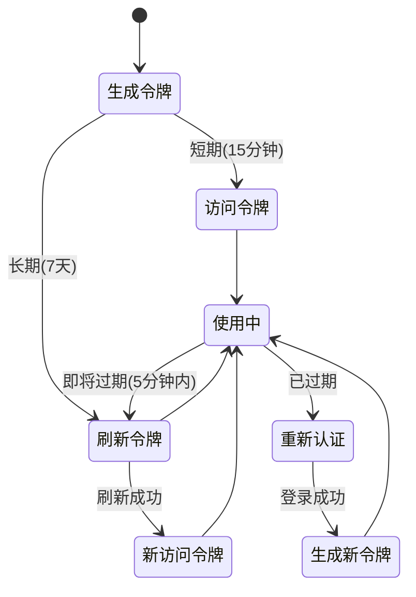
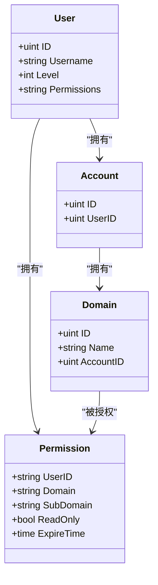
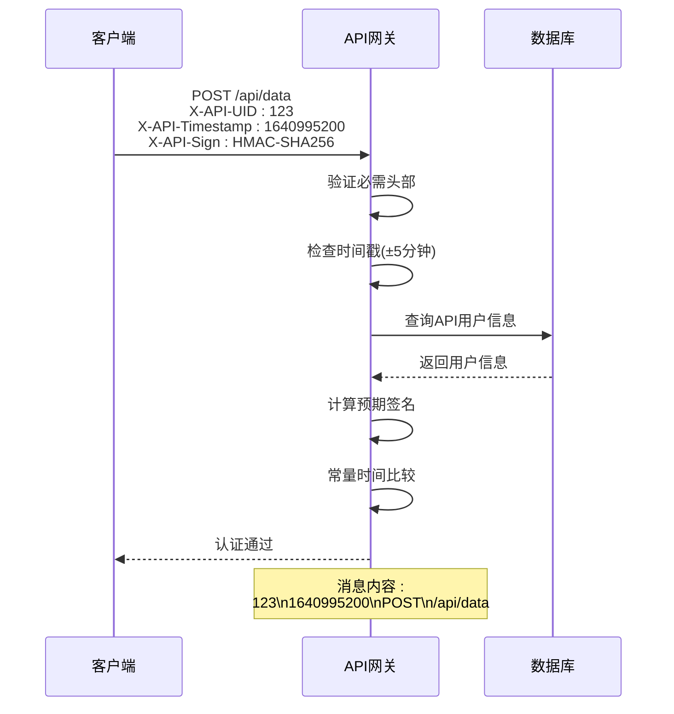
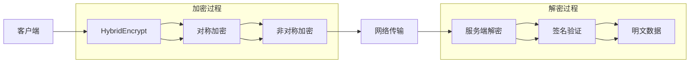
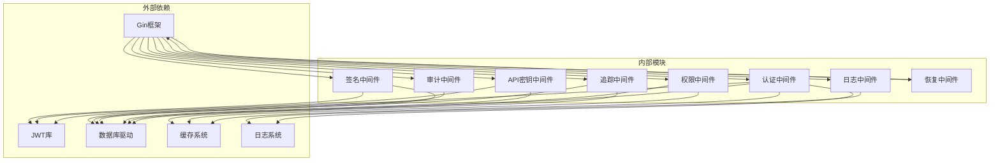

# 中间件系统

<cite>
**本文档引用的文件**
- [auth.go](file://main/internal/api/middleware/auth.go)
- [permission.go](file://main/internal/api/middleware/permission.go)
- [logger.go](file://main/internal/api/middleware/logger.go)
- [apikey.go](file://main/internal/api/middleware/apikey.go)
- [sign.go](file://main/internal/api/middleware/sign.go)
- [recovery.go](file://main/internal/api/middleware/recovery.go)
- [request_trace.go](file://main/internal/api/middleware/request_trace.go)
- [audit.go](file://main/internal/api/middleware/audit.go)
- [router.go](file://main/internal/api/router.go)
- [auth.go](file://main/internal/api/handler/auth.go)
- [domain.go](file://main/internal/api/handler/domain.go)
- [config.go](file://main/internal/config/config.go)
</cite>

## 目录
1. [简介](#简介)
2. [项目结构](#项目结构)
3. [核心组件](#核心组件)
4. [架构概览](#架构概览)
5. [详细组件分析](#详细组件分析)
6. [依赖分析](#依赖分析)
7. [性能考虑](#性能考虑)
8. [故障排除指南](#故障排除指南)
9. [结论](#结论)

## 简介

DNSPlane中间件系统是一个基于Gin框架构建的企业级DNS管理平台的安全中间件层。该系统提供了完整的认证授权、安全防护、日志记录、审计跟踪等功能，确保系统的安全性、可维护性和可观测性。

系统采用中间件链式调用机制，通过精心设计的执行顺序和组合策略，实现了从底层安全到上层业务的全方位保护。每个中间件都经过专门优化，既保证了安全性，又兼顾了性能表现。

## 项目结构

中间件系统位于`main/internal/api/middleware/`目录下，包含以下核心组件：

**图表来源**
- [auth.go:124-199](file://main/internal/api/middleware/auth.go#L124-L199)
- [permission.go:132-207](file://main/internal/api/middleware/permission.go#L132-L207)
- [router.go:18-22](file://main/internal/api/router.go#L18-L22)

**章节来源**
- [router.go:14-276](file://main/internal/api/router.go#L14-L276)

## 核心组件

### 认证中间件 (Auth)

认证中间件是整个中间件系统的核心，负责处理用户身份验证和会话管理。它采用了多层验证机制：

1. **Cookie加密验证**：使用AES-GCM对JWT访问令牌进行加密存储
2. **双重令牌验证**：同时验证Cookie中的令牌和Authorization头
3. **用户状态检查**：确保用户账户处于激活状态
4. **权限缓存机制**：减少数据库查询往返

**图表来源**
- [auth.go:124-199](file://main/internal/api/middleware/auth.go#L124-L199)

### 权限控制中间件 (Permission)

权限控制中间件实现了细粒度的域名和子域名权限管理：

1. **委派权限系统**：支持用户向其他用户委派特定域名的权限
2. **子域名粒度控制**：可以精确控制到具体子域名的操作权限
3. **只读权限支持**：区分读写权限，防止意外修改
4. **账户所有权检查**：自动识别域名所属账户的所有者

**章节来源**
- [permission.go:132-207](file://main/internal/api/middleware/permission.go#L132-L207)

### API密钥中间件 (APIKeyAuth)

API密钥中间件提供了企业级的API认证机制：

1. **HMAC-SHA256签名**：使用标准的HMAC算法确保请求完整性
2. **时间戳防重放**：±5分钟的时间窗口防止重放攻击
3. **常量时间比较**：防止时序攻击
4. **API用户专用**：区分普通用户和API用户

**章节来源**
- [apikey.go:44-105](file://main/internal/api/middleware/apikey.go#L44-L105)

### 签名验证中间件 (DecryptAndVerify)

签名验证中间件实现了端到端的安全通信：

1. **混合加密**：结合对称加密和非对称加密的优势
2. **动态密钥派生**：基于多个令牌派生最终的加密密钥
3. **请求签名验证**：确保请求的完整性和真实性
4. **响应加密**：对敏感数据进行加密传输

**章节来源**
- [sign.go:14-69](file://main/internal/api/middleware/sign.go#L14-L69)

### 日志中间件 (Logger)

日志中间件提供了智能的日志记录功能：

1. **智能过滤**：自动过滤静态资源和HEAD请求
2. **彩色输出**：控制台彩色显示便于调试
3. **慢请求检测**：自动识别性能问题
4. **模块化分类**：按功能模块组织日志

**章节来源**
- [logger.go:156-232](file://main/internal/api/middleware/logger.go#L156-L232)

### 请求追踪中间件 (RequestTrace)

请求追踪中间件实现了完整的请求生命周期监控：

1. **唯一请求ID**：为每个请求生成唯一的跟踪ID
2. **错误ID生成**：自动为错误请求生成唯一标识
3. **数据库查询统计**：记录所有数据库操作
4. **异步日志存储**：不阻塞主线程响应

**章节来源**
- [request_trace.go:58-192](file://main/internal/api/middleware/request_trace.go#L58-L192)

### 审计中间件 (AuditLog)

审计中间件提供了合规性的操作记录：

1. **自动审计**：自动记录所有写操作
2. **智能跳过**：跳过登录和查询类操作
3. **异步存储**：使用SafeGo确保不阻塞响应
4. **操作名称推导**：从路由路径自动推导操作名称

**章节来源**
- [audit.go:21-88](file://main/internal/api/middleware/audit.go#L21-L88)

### 恢复中间件 (Recovery)

恢复中间件增强了错误处理能力：

1. **连接中断检测**：区分客户端断开和真实异常
2. **结构化日志**：记录详细的错误堆栈信息
3. **请求ID关联**：将错误与请求ID关联
4. **优雅降级**：向客户端返回友好的错误信息

**章节来源**
- [recovery.go:21-75](file://main/internal/api/middleware/recovery.go#L21-L75)

## 架构概览

中间件系统采用严格的执行顺序和分层设计：

**图表来源**
- [router.go:18-22](file://main/internal/api/router.go#L18-L22)
- [auth.go:469-482](file://main/internal/api/middleware/auth.go#L469-L482)
- [permission.go:132-207](file://main/internal/api/middleware/permission.go#L132-L207)

## 详细组件分析

### 认证中间件深度分析

#### JWT令牌管理

认证中间件实现了完整的JWT生命周期管理：

**图表来源**
- [auth.go:227-282](file://main/internal/api/middleware/auth.go#L227-L282)

#### Cookie加密机制

中间件使用AES-GCM对JWT访问令牌进行加密存储：

1. **密钥派生**：从JWT密钥的SHA-256哈希派生AES密钥
2. **随机Nonce**：每次加密使用随机Nonce确保安全性
3. **完整性验证**：GCM模式提供数据完整性和机密性
4. **无服务端状态**：所有信息都存储在客户端Cookie中

**章节来源**
- [auth.go:34-87](file://main/internal/api/middleware/auth.go#L34-L87)

### 权限控制深度分析

#### 委派权限系统

权限控制中间件实现了灵活的委派权限机制：

**图表来源**
- [permission.go:18-31](file://main/internal/api/middleware/permission.go#L18-L31)

#### 子域名权限匹配

中间件实现了智能的子域名权限匹配算法：

**章节来源**
- [permission.go:33-49](file://main/internal/api/middleware/permission.go#L33-L49)

### API密钥认证深度分析

#### HMAC签名流程

API密钥认证实现了标准的HMAC签名验证：

**图表来源**
- [apikey.go:44-105](file://main/internal/api/middleware/apikey.go#L44-L105)

**章节来源**
- [apikey.go:107-113](file://main/internal/api/middleware/apikey.go#L107-L113)

### 签名验证深度分析

#### 混合加密架构

签名验证中间件实现了端到端的安全通信：

**图表来源**
- [sign.go:14-69](file://main/internal/api/middleware/sign.go#L14-L69)

**章节来源**
- [sign.go:125-177](file://main/internal/api/middleware/sign.go#L125-L177)

## 依赖分析

中间件系统具有清晰的依赖关系和低耦合设计：

**图表来源**
- [auth.go:3-23](file://main/internal/api/middleware/auth.go#L3-L23)
- [permission.go:3-16](file://main/internal/api/middleware/permission.go#L3-L16)

### 关键依赖关系

1. **认证中间件**：依赖JWT库进行令牌验证，依赖数据库进行用户状态检查
2. **权限中间件**：主要依赖数据库进行权限查询
3. **API密钥中间件**：依赖数据库进行用户信息验证
4. **签名中间件**：依赖JWT库进行密钥派生
5. **日志中间件**：依赖日志系统进行结构化记录

**章节来源**
- [auth.go:1-23](file://main/internal/api/middleware/auth.go#L1-L23)
- [permission.go:1-16](file://main/internal/api/middleware/permission.go#L1-L16)

## 性能考虑

中间件系统在设计时充分考虑了性能优化：

### 缓存策略

1. **认证用户缓存**：用户信息缓存30秒，显著减少数据库查询
2. **权限缓存**：权限信息缓存减少权限检查开销
3. **JWT JTI缓存**：刷新令牌的JTI存储在缓存中

### 异步处理

1. **请求日志异步存储**：使用goroutine异步写入数据库
2. **审计日志异步记录**：使用SafeGo确保不阻塞主线程
3. **错误恢复异步处理**：异常信息异步记录到日志系统

### 连接优化

1. **数据库连接池**：合理配置连接池大小
2. **Redis连接复用**：共享Redis连接减少连接开销
3. **HTTP客户端优化**：复用HTTP客户端连接

## 故障排除指南

### 常见问题诊断

#### 认证失败问题

1. **检查Cookie设置**：确认HttpOnly Cookie正确设置
2. **验证JWT密钥**：确保JWT密钥配置正确
3. **检查时间同步**：确认服务器时间同步

#### 权限拒绝问题

1. **验证委派权限**：检查用户是否被正确委派权限
2. **检查子域名匹配**：确认子域名权限配置
3. **验证账户所有权**：确认域名所属关系

#### API密钥认证失败

1. **检查时间戳**：确认请求时间戳在允许范围内
2. **验证签名计算**：检查消息拼接和签名计算
3. **确认API用户状态**：确保API用户处于激活状态

**章节来源**
- [auth.go:124-199](file://main/internal/api/middleware/auth.go#L124-L199)
- [permission.go:132-207](file://main/internal/api/middleware/permission.go#L132-L207)
- [apikey.go:44-105](file://main/internal/api/middleware/apikey.go#L44-L105)

### 性能监控

1. **慢请求检测**：关注日志中标记的慢请求
2. **内存使用监控**：定期检查内存使用情况
3. **数据库查询监控**：关注长时间运行的查询

## 结论

DNSPlane中间件系统通过精心设计的多层安全架构，为DNS管理平台提供了全面的安全保障。系统的主要优势包括：

1. **多层次安全防护**：从传输层到应用层的全方位保护
2. **灵活的权限管理**：支持细粒度的权限控制和委派机制
3. **高性能设计**：通过缓存和异步处理确保系统性能
4. **完善的可观测性**：提供完整的日志、追踪和审计功能
5. **易于扩展**：模块化的中间件设计便于功能扩展

该系统不仅满足了当前的功能需求，还为未来的功能扩展和安全加固提供了良好的基础。通过合理的配置和持续的监控，可以确保系统的稳定运行和持续安全。