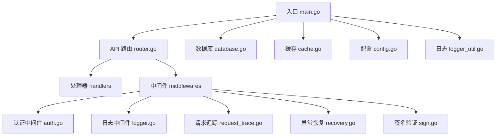
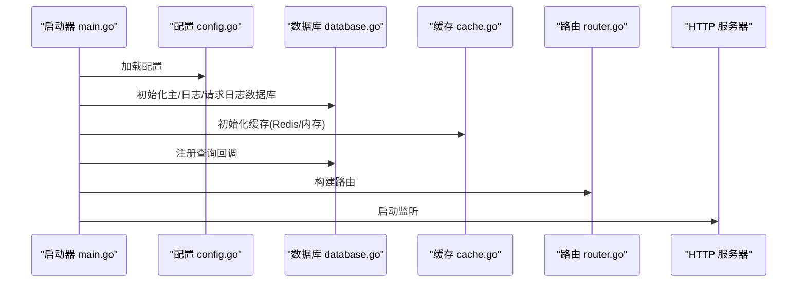
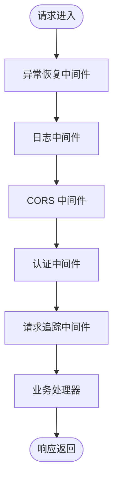
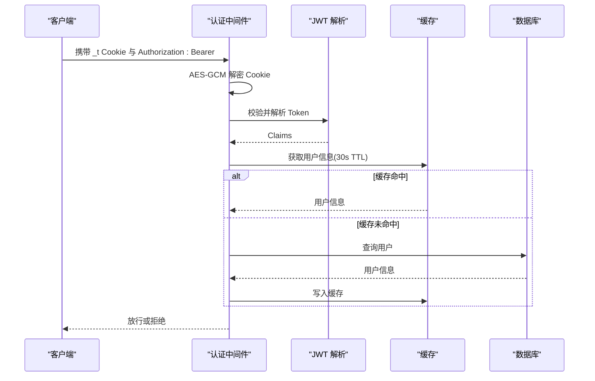
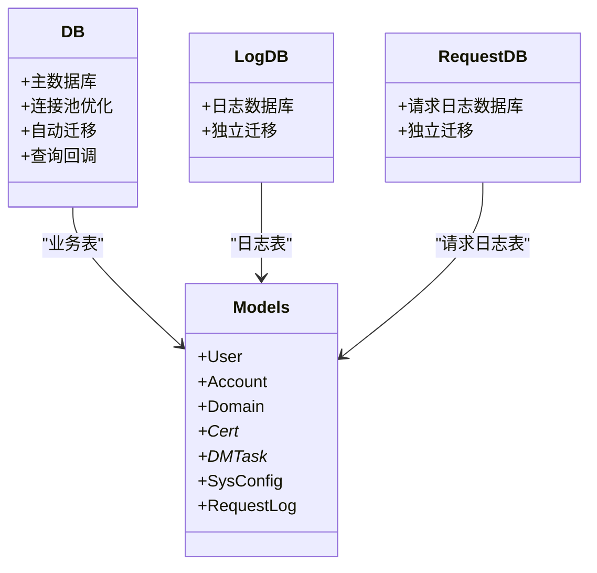
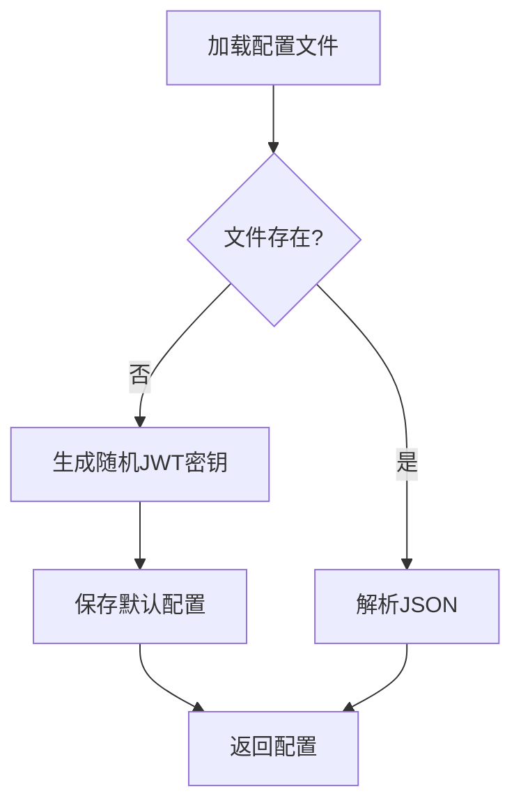
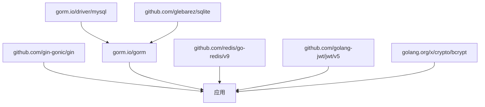

# 后端开发指南

<cite>
**本文档引用的文件**
- [main.go](file://main/main.go)
- [go.mod](file://main/go.mod)
- [router.go](file://main/internal/api/router.go)
- [models.go](file://main/internal/models/models.go)
- [config.go](file://main/internal/config/config.go)
- [auth.go](file://main/internal/api/middleware/auth.go)
- [logger.go](file://main/internal/api/middleware/logger.go)
- [database.go](file://main/internal/database/database.go)
- [cache.go](file://main/internal/cache/cache.go)
- [recovery.go](file://main/internal/api/middleware/recovery.go)
- [sign.go](file://main/internal/api/middleware/sign.go)
- [request_trace.go](file://main/internal/api/middleware/request_trace.go)
- [auth_handler.go](file://main/internal/api/handler/auth.go)
- [logger_util.go](file://main/internal/logger/logger.go)
- [README.md](file://README.md)
</cite>

## 目录
1. [简介](#简介)
2. [项目结构](#项目结构)
3. [核心组件](#核心组件)
4. [架构总览](#架构总览)
5. [详细组件分析](#详细组件分析)
6. [依赖分析](#依赖分析)
7. [性能考虑](#性能考虑)
8. [故障排除指南](#故障排除指南)
9. [结论](#结论)
10. [附录](#附录)

## 简介
DNSPlane 是一个基于 Go 语言的 DNS 管理系统，提供多平台 DNS 管理、SSL 证书申请与部署、容灾切换、多用户权限管理等能力。后端采用 Gin 框架构建 API 层，结合 GORM ORM 进行数据库抽象，支持 SQLite 与 MySQL，并内置 Redis 缓存与请求追踪、日志、安全中间件体系。

## 项目结构
后端位于 `main/` 目录，采用模块化分层设计：
- 入口与初始化：main/main.go
- API 层：internal/api/router.go、internal/api/handler/*、internal/api/middleware/*
- 数据层：internal/database/database.go、internal/models/models.go
- 配置管理：internal/config/config.go
- 缓存：internal/cache/cache.go
- 日志：internal/logger/logger.go
- 其他模块：cert、dns、monitor、oauth、service 等

**图表来源**
- [main.go:52-147](file://main/main.go#L52-L147)
- [router.go:14-274](file://main/internal/api/router.go#L14-L274)

**章节来源**
- [main.go:1-148](file://main/main.go#L1-L148)
- [README.md:14-40](file://README.md#L14-L40)

## 核心组件
- Gin 路由与中间件：统一处理 CORS、日志、安全头、请求追踪、异常恢复、签名验证等
- GORM 数据库：支持 SQLite/MySQL，自动迁移、查询回调、连接池优化
- JWT + Cookie 会话：短期访问令牌 + 长期刷新令牌，AES-GCM 加密存储
- Redis/内存缓存：统一 Cache 接口，支持键前缀、列表操作、过期清理
- 结构化日志：控制台彩色输出 + 文件轮转 + 请求日志异步持久化
- 配置管理：JSON 配置文件，支持默认值、随机密钥生成、运行时读取

**章节来源**
- [router.go:14-274](file://main/internal/api/router.go#L14-L274)
- [database.go:73-149](file://main/internal/database/database.go#L73-L149)
- [auth.go:124-199](file://main/internal/api/middleware/auth.go#L124-L199)
- [cache.go:47-94](file://main/internal/cache/cache.go#L47-L94)
- [logger_util.go:56-91](file://main/internal/logger/logger.go#L56-L91)
- [config.go:82-161](file://main/internal/config/config.go#L82-L161)

## 架构总览
后端启动流程：解析配置 → 初始化数据库（主/日志/请求日志）→ 初始化缓存 → 注册数据库回调 → 启动监控与后台任务 → 构建 Gin 路由 → 启动 HTTP 服务。

**图表来源**
- [main.go:56-127](file://main/main.go#L56-L127)
- [database.go:73-149](file://main/internal/database/database.go#L73-L149)
- [cache.go:47-86](file://main/internal/cache/cache.go#L47-L86)
- [router.go:14-274](file://main/internal/api/router.go#L14-L274)

## 详细组件分析

### API 层设计
- 路由分组：/api 前缀，公开接口（安装、验证码、OAuth）与受保护接口（鉴权中间件）
- 中间件链：Recovery → Logger → CORS → Auth → RequestTrace → Handler
- 静态资源：嵌入前端静态文件，NoRoute 降级到 SPA 路由

**图表来源**
- [router.go:14-274](file://main/internal/api/router.go#L14-L274)
- [auth.go:124-199](file://main/internal/api/middleware/auth.go#L124-L199)
- [logger.go:156-231](file://main/internal/api/middleware/logger.go#L156-L231)
- [request_trace.go:58-192](file://main/internal/api/middleware/request_trace.go#L58-L192)

**章节来源**
- [router.go:14-274](file://main/internal/api/router.go#L14-L274)

### 认证与会话
- 双重验证：HttpOnly Cookie（AES-GCM 加密）+ Bearer Token，确保一致性
- JWT Claims：包含用户ID、用户名、等级、Token 类型、过期时间
- 刷新令牌：JTI 轮转 + 缓存校验，防重放攻击
- 用户信息缓存：30 秒 TTL，减少 DB/Redis 查询

**图表来源**
- [auth.go:124-199](file://main/internal/api/middleware/auth.go#L124-L199)
- [auth.go:442-463](file://main/internal/api/middleware/auth.go#L442-L463)

**章节来源**
- [auth.go:124-199](file://main/internal/api/middleware/auth.go#L124-L199)
- [auth.go:334-413](file://main/internal/api/middleware/auth.go#L334-L413)

### 数据库层设计
- 多数据库：主库用于业务表，日志库用于操作日志/证书日志/容灾日志，请求日志库独立 SQLite
- 连接池：SQLite 使用 WAL + 大连接池，MySQL 调优连接复用
- 自动迁移：首次启动创建/迁移表结构，支持旧数据迁移
- 查询回调：记录 SQL、耗时、影响行数、错误，注入 Gin 上下文

**图表来源**
- [database.go:20-24](file://main/internal/database/database.go#L20-L24)
- [models.go:9-357](file://main/internal/models/models.go#L9-L357)

**章节来源**
- [database.go:73-149](file://main/internal/database/database.go#L73-L149)
- [database.go:367-468](file://main/internal/database/database.go#L367-L468)
- [models.go:9-357](file://main/internal/models/models.go#L9-L357)

### 配置管理系统
- 默认配置：端口、主机、模式、数据库驱动、JWT 密钥、日志清理策略
- 配置文件：支持自动生成随机 JWT 密钥，保存到指定路径
- 运行时读取：全局单例，线程安全

**图表来源**
- [config.go:82-123](file://main/internal/config/config.go#L82-L123)
- [config.go:133-145](file://main/internal/config/config.go#L133-L145)

**章节来源**
- [config.go:82-161](file://main/internal/config/config.go#L82-L161)

### 缓存系统
- 统一接口：Set/Get/Delete/Incr/List/LPush/LLen/LRange/LTrim/Close
- 后端选择：Redis 可用则优先，否则使用内存缓存
- 键前缀：避免多环境冲突，支持删除前缀
- 列表实现：内存版支持 LPush/LRange/LTrim，满足日志存储需求

**章节来源**
- [cache.go:15-94](file://main/internal/cache/cache.go#L15-L94)
- [cache.go:96-309](file://main/internal/cache/cache.go#L96-L309)

### 日志与错误处理
- 控制台彩色输出：按状态码/方法着色，包含耗时与模块
- 文件日志：结构化记录，区分 INFO/WARN/ERROR，支持轮转与清理
- 请求追踪：生成 RequestID/ErrorID，收集请求头/体、响应、数据库查询统计
- 异常恢复：区分客户端断开与真实 panic，记录堆栈并返回统一错误

**章节来源**
- [logger_util.go:56-91](file://main/internal/logger/logger.go#L56-L91)
- [logger_util.go:429-439](file://main/internal/logger/logger.go#L429-L439)
- [logger.go:156-231](file://main/internal/api/middleware/logger.go#L156-L231)
- [request_trace.go:58-192](file://main/internal/api/middleware/request_trace.go#L58-L192)
- [recovery.go:21-74](file://main/internal/api/middleware/recovery.go#L21-L74)

### 安全与防护
- CORS：仅允许系统配置的 site_url 或同源，避免反射型 CSRF
- 安全响应头：HSTS、X-Frame-Options、X-Content-Type-Options、Permissions-Policy
- Cookie 安全：HttpOnly + SameSite + Secure（HTTPS）+ 短 TTL
- 请求签名：混合加密 + 签名验证，支持降级绑定

**章节来源**
- [auth.go:469-482](file://main/internal/api/middleware/auth.go#L469-L482)
- [auth.go:490-508](file://main/internal/api/middleware/auth.go#L490-L508)
- [sign.go:13-69](file://main/internal/api/middleware/sign.go#L13-L69)

### 实际应用场景
- 安装与登录：Install/InstallStatus/Login，支持验证码与 TOTP
- 用户管理：获取/修改密码、TOTP 启用/禁用、管理员重置
- 域名与记录：增删改查、批量操作、WHOIS 查询
- 证书生命周期：账户管理、订单创建/处理、部署任务、CNAME 验证
- 监控与容灾：任务创建/开关/日志、切换记录、健康检查
- 系统配置：SMTP、代理、缓存、定时任务、缓存清理

**章节来源**
- [auth_handler.go:218-270](file://main/internal/api/handler/auth.go#L218-L270)
- [auth_handler.go:469-563](file://main/internal/api/handler/auth.go#L469-L563)
- [auth_handler.go:565-657](file://main/internal/api/handler/auth.go#L565-L657)
- [auth_handler.go:659-745](file://main/internal/api/handler/auth.go#L659-L745)

## 依赖分析
- Gin：Web 框架与路由
- GORM：ORM 与数据库抽象
- Redis：可选缓存后端
- bcrypt：密码哈希
- JWT：令牌签发与解析
- 其他：FTP、Whois、Captcha 等第三方库

**图表来源**
- [go.mod:5-28](file://main/go.mod#L5-L28)

**章节来源**
- [go.mod:1-96](file://main/go.mod#L1-L96)

## 性能考虑
- 数据库优化
  - SQLite：WAL 模式、连接池、mmap、缓存大小、busy_timeout
  - MySQL：连接池大小、空闲连接、生命周期
- 缓存策略
  - 认证用户信息 30 秒 TTL，减少 DB/Redis 查询
  - 列表缓存支持 LPush/LRange/LTrim，满足日志存储
- 日志与追踪
  - 控制台彩色输出 + 文件结构化记录，避免重复输出
  - 请求日志异步写入，错误时记录原始响应，正常快速请求不落库
- 中间件顺序
  - Recovery → Logger → CORS → Auth → RequestTrace，保证异常可追踪且性能最优

[本节为通用指导，无需特定文件引用]

## 故障排除指南
- 启动失败
  - 检查配置文件路径与权限，确认数据库连接参数正确
  - 查看日志文件与控制台输出，定位初始化阶段错误
- 登录问题
  - 核对用户名/密码与验证码设置
  - 检查 TOTP 状态与密钥生成
- 数据库迁移失败
  - 确认数据库驱动与 DSN 正确，查看迁移错误日志
  - 如涉及旧表迁移，确认主库日志表清理与重建
- 缓存不可用
  - Redis 连接失败将回退到内存缓存，检查地址与认证
- 请求日志缺失
  - 确认 RequestTrace 中间件已启用，检查异步写入是否成功

**章节来源**
- [main.go:56-66](file://main/main.go#L56-L66)
- [database.go:149-149](file://main/internal/database/database.go#L149-L149)
- [cache.go:71-85](file://main/internal/cache/cache.go#L71-L85)
- [request_trace.go:184-191](file://main/internal/api/middleware/request_trace.go#L184-L191)

## 结论
DNSPlane 后端采用清晰的分层架构与完善的中间件体系，结合 GORM ORM 与 Gin 框架实现了高性能、可维护的 API 服务。通过统一的配置管理、缓存与日志系统，以及严格的安全防护策略，能够稳定支撑多平台 DNS 管理、证书生命周期与容灾监控等核心业务场景。

[本节为总结性内容，无需特定文件引用]

## 附录
- 配置文件示例与字段说明
- API 接口清单与认证方式
- 常见部署与运维最佳实践

**章节来源**
- [README.md:76-172](file://README.md#L76-L172)