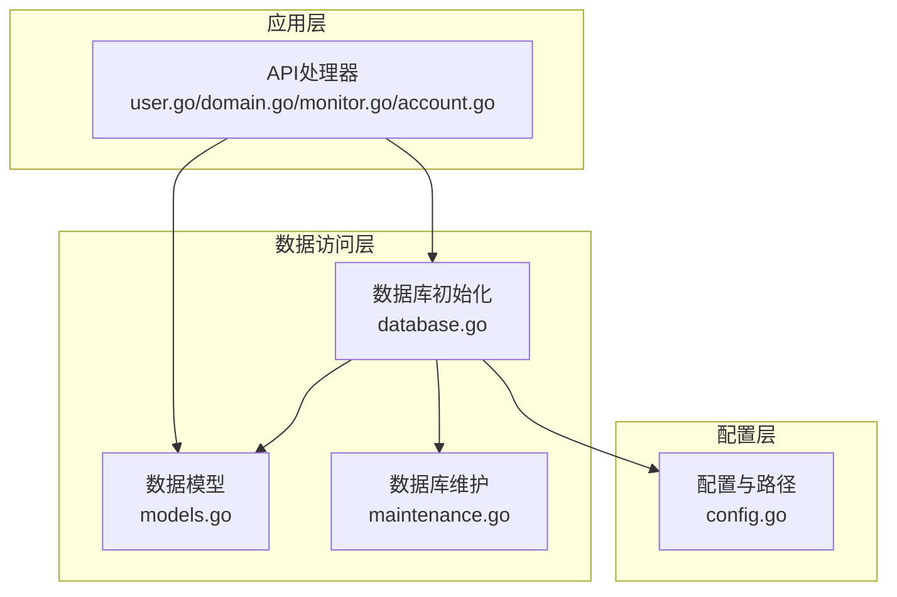
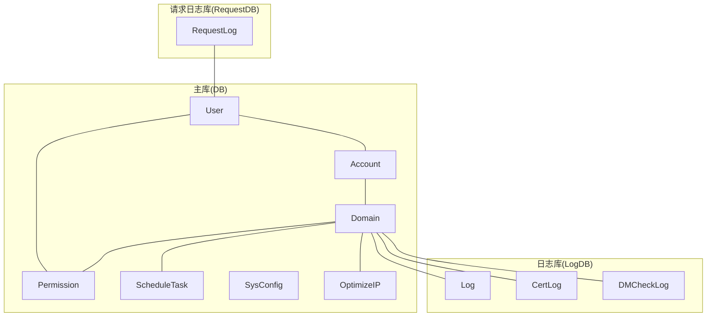
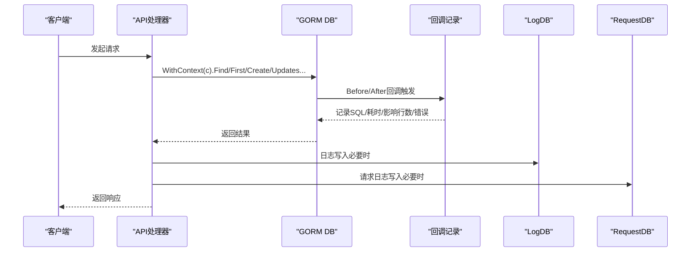
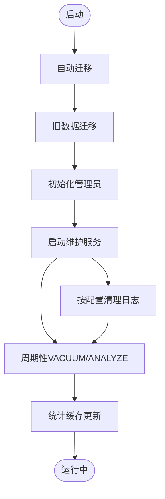
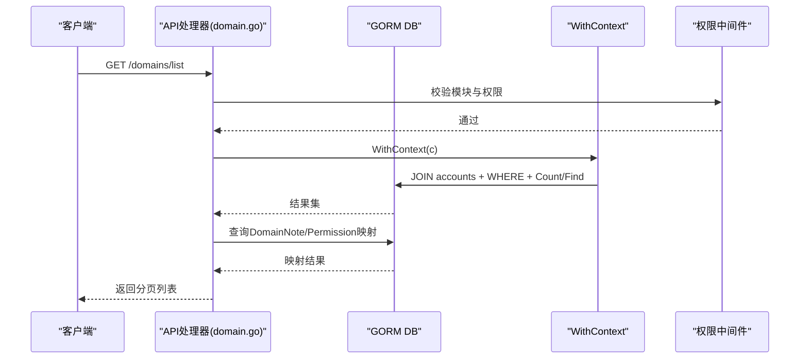
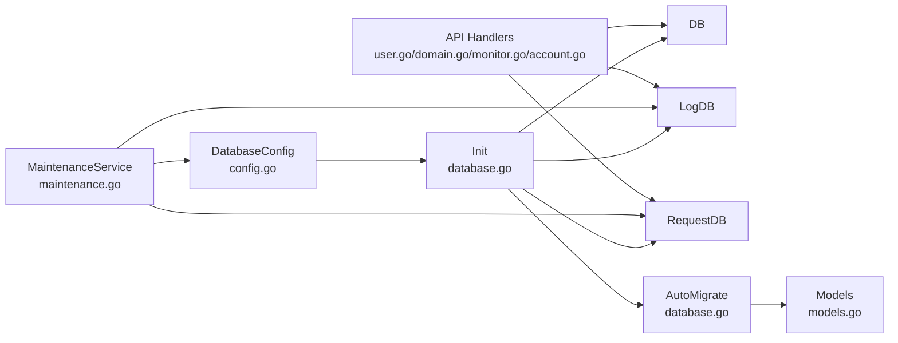

# 数据库设计

<cite>
**本文引用的文件**
- [database.go](file://main/internal/database/database.go)
- [models.go](file://main/internal/models/models.go)
- [maintenance.go](file://main/internal/database/maintenance.go)
- [config.go](file://main/internal/config/config.go)
- [user.go](file://main/internal/api/handler/user.go)
- [domain.go](file://main/internal/api/handler/domain.go)
- [monitor.go](file://main/internal/api/handler/monitor.go)
- [account.go](file://main/internal/api/handler/account.go)
</cite>

## 目录
1. [简介](#简介)
2. [项目结构](#项目结构)
3. [核心组件](#核心组件)
4. [架构总览](#架构总览)
5. [详细组件分析](#详细组件分析)
6. [依赖分析](#依赖分析)
7. [性能考量](#性能考量)
8. [故障排查指南](#故障排查指南)
9. [结论](#结论)
10. [附录](#附录)

## 简介
本文件面向DNSPlane项目的数据库设计与实现，聚焦GORM ORM的配置与使用模式，系统化梳理核心数据模型（User、Domain、Account、MonitorTask等）、实体关系与外键约束、数据库迁移与维护策略、查询优化与索引设计、数据访问层使用示例与最佳实践，以及事务处理与并发控制机制。文档旨在帮助开发者快速理解并高效扩展数据库层能力。

## 项目结构
数据库相关代码主要分布在以下模块：
- 数据库初始化与连接管理：database.go
- 数据模型定义：models.go
- 数据库维护与清理：maintenance.go
- 配置与路径推导：config.go
- API层数据访问示例：user.go、domain.go、monitor.go、account.go

**图示来源**
- [database.go:73-149](file://main/internal/database/database.go#L73-L149)
- [models.go:1-357](file://main/internal/models/models.go#L1-L357)
- [maintenance.go:100-133](file://main/internal/database/maintenance.go#L100-L133)
- [config.go:45-65](file://main/internal/config/config.go#L45-L65)

**章节来源**
- [database.go:73-149](file://main/internal/database/database.go#L73-L149)
- [models.go:1-357](file://main/internal/models/models.go#L1-L357)
- [maintenance.go:100-133](file://main/internal/database/maintenance.go#L100-L133)
- [config.go:45-65](file://main/internal/config/config.go#L45-L65)

## 核心组件
- GORM数据库实例：主库DB、日志库LogDB、请求日志库RequestDB三库分离，分别承载业务主数据、操作/证书/监控日志、API请求日志。
- 数据模型：涵盖用户、账户、域名、权限、监控任务与日志、证书相关、定时任务、系统配置、优选IP等。
- 迁移与初始化：自动迁移、旧数据迁移、管理员初始化、请求上下文注入。
- 维护与优化：按配置清理、VACUUM与ANALYZE、统计缓存、周期性优化。

**章节来源**
- [database.go:20-24](file://main/internal/database/database.go#L20-L24)
- [models.go:9-321](file://main/internal/models/models.go#L9-L321)
- [database.go:233-292](file://main/internal/database/database.go#L233-L292)
- [maintenance.go:14-98](file://main/internal/database/maintenance.go#L14-L98)

## 架构总览
DNSPlane采用“三库分离”的数据库架构：
- 主库（DB）：承载业务主数据（用户、账户、域名、权限、定时任务、系统配置、优选IP等）。
- 日志库（LogDB）：承载操作日志、证书日志、监控检查日志。
- 请求日志库（RequestDB）：承载API请求日志，独立SQLite以降低主库压力。

**图示来源**
- [models.go:9-357](file://main/internal/models/models.go#L9-L357)
- [database.go:105-127](file://main/internal/database/database.go#L105-L127)

## 详细组件分析

### GORM配置与使用模式
- 驱动选择与连接：支持MySQL与SQLite两种驱动，按配置选择；SQLite启用WAL模式、调整缓存与连接池；MySQL提升连接池参数。
- 三库分离：主库DB、日志库LogDB、请求日志库RequestDB分别初始化，便于隔离与优化。
- 请求上下文注入：WithXXXContext将Gin上下文注入GORM，用于查询记录与审计追踪。
- 回调记录：注册Query/Create/Update/Delete/Row/Raw回调，记录SQL、耗时、影响行数与错误，支持按需开启。

**图示来源**
- [database.go:352-365](file://main/internal/database/database.go#L352-L365)
- [database.go:367-404](file://main/internal/database/database.go#L367-L404)

**章节来源**
- [database.go:73-149](file://main/internal/database/database.go#L73-L149)
- [database.go:352-404](file://main/internal/database/database.go#L352-L404)

### 数据模型与关系

#### 用户(User)
- 字段要点：用户名唯一、邮箱、API开关与密钥、级别、状态、TOTP、重置令牌与过期、注册/最后登录时间、软删。
- 索引：用户名唯一索引、软删索引。

**章节来源**
- [models.go:9-31](file://main/internal/models/models.go#L9-L31)

#### 用户OAuth(UserOAuth)
- 字段要点：用户ID、提供商(provider)、提供商用户ID、名称、邮箱、头像、访问/刷新令牌、过期时间、创建/更新时间。
- 索引：用户ID+提供商唯一组合索引、提供商用户ID索引。

**章节来源**
- [models.go:33-47](file://main/internal/models/models.go#L33-L47)

#### DNS账户(Account)
- 字段要点：用户ID、类型、名称、配置JSON、备注、创建/更新时间、软删。
- 索引：用户ID索引。

**章节来源**
- [models.go:49-60](file://main/internal/models/models.go#L49-L60)

#### 域名(Domain)
- 字段要点：账户ID、域名、第三方ID、隐藏/SSO、记录数、备注、通知、到期/检查时间、检查状态、创建/更新时间、软删。
- 索引：账户ID索引、域名索引、软删索引。

**章节来源**
- [models.go:62-81](file://main/internal/models/models.go#L62-L81)

#### 域名备注(DomainNote)
- 字段要点：用户ID、域名ID、备注。
- 索引：用户ID+域名ID唯一组合索引。

**章节来源**
- [models.go:83-91](file://main/internal/models/models.go#L83-L91)

#### 权限(Permission)
- 字段要点：用户ID、域名ID、域名、子域名限制、只读、过期时间、创建时间。
- 索引：用户ID、域名ID索引。

**章节来源**
- [models.go:93-103](file://main/internal/models/models.go#L93-L103)

#### 操作日志(Log)
- 字段要点：用户ID、用户名、动作、实体类型/ID、域名、数据变更前后JSON、IP、UA、创建时间。
- 索引：用户ID、域名索引。

**章节来源**
- [models.go:105-120](file://main/internal/models/models.go#L105-L120)

#### 容灾监控任务(DMTask)
- 字段要点：域名ID、主机记录、记录ID、记录类型/线路、切换类型、主/备值、检查类型/URL/端口、频率/周期/超时、代理、CDN、备注、开关、健康状态、记录信息、期望状态/关键字、重定向限制、通知开关、自动恢复、创建/更新时间。
- 索引：域名ID索引。

**章节来源**
- [models.go:122-164](file://main/internal/models/models.go#L122-L164)

#### 容灾监控检查日志(DMCheckLog)
- 字段要点：任务ID、成功标志、耗时、错误、主健康、备用健康、创建时间。
- 索引：任务ID、成功、创建时间索引。

**章节来源**
- [models.go:166-178](file://main/internal/models/models.go#L166-L178)

#### 容灾切换日志(DMLog)
- 字段要点：任务ID、动作、错误信息、创建时间。
- 索引：任务ID索引。

**章节来源**
- [models.go:180-187](file://main/internal/models/models.go#L180-L187)

#### 证书账户(CertAccount)
- 字段要点：用户ID、类型、名称、配置/扩展、备注、部署标记、创建/更新时间、软删。
- 索引：用户ID索引、软删索引。

**章节来源**
- [models.go:189-202](file://main/internal/models/models.go#L189-L202)

#### 证书订单(CertOrder)
- 字段要点：账户ID、密钥类型/尺寸、流程ID、签发/到期时间、颁发者、状态、错误、自动续期、重试、锁、发送、信息、DNS、链/私钥、续期失败通知/到期通知时间、创建/更新时间。
- 索引：无显式索引声明。

**章节来源**
- [models.go:204-231](file://main/internal/models/models.go#L204-L231)

#### 证书域名(CertDomain)
- 字段要点：订单ID、域名、排序。
- 索引：订单ID索引。

**章节来源**
- [models.go:233-239](file://main/internal/models/models.go#L233-L239)

#### 证书部署任务(CertDeploy)
- 字段要点：用户ID、账户ID、订单ID、签发时间、配置、备注、最后时间、流程ID、状态、错误、激活、重试、最大重试/间隔、重试时间、锁、发送、信息、部署日志、创建/更新时间。
- 索引：用户ID索引。

**章节来源**
- [models.go:241-266](file://main/internal/models/models.go#L241-L266)

#### 证书CNAME(CertCNAME)
- 字段要点：域名、域名ID、主机记录、状态、创建时间。
- 索引：无显式索引声明。

**章节来源**
- [models.go:268-276](file://main/internal/models/models.go#L268-L276)

#### 定时任务(ScheduleTask)
- 字段要点：域名ID、主机记录、记录ID、类型、周期、切换类型/日期/时间、值、线路、添加/更新/下次时间、激活、记录信息、备注。
- 索引：域名ID索引。

**章节来源**
- [models.go:278-297](file://main/internal/models/models.go#L278-L297)

#### 系统配置(SysConfig)
- 字段要点：键（主键）、值。
- 索引：键主键。

**章节来源**
- [models.go:299-303](file://main/internal/models/models.go#L299-L303)

#### 优选IP(OptimizeIP)
- 字段要点：域名ID、主机记录、记录类型、CDN类型、记录数量、TTL、备注、添加/更新时间、状态、错误信息、激活。
- 索引：域名ID索引。

**章节来源**
- [models.go:305-321](file://main/internal/models/models.go#L305-L321)

#### 证书日志(CertLog)
- 字段要点：订单ID、类型、内容、创建时间。
- 索引：订单ID索引。

**章节来源**
- [models.go:323-330](file://main/internal/models/models.go#L323-L330)

#### 请求日志(RequestLog)
- 字段要点：请求ID、错误ID、用户ID、用户名、方法、路径、查询、请求体、头部、IP、UA、状态码、响应、耗时、错误标记、错误消息/堆栈、数据库查询记录、DB查询耗时、额外信息、创建时间。
- 索引：请求ID、错误ID、用户ID、错误标记、创建时间索引。

**章节来源**
- [models.go:332-356](file://main/internal/models/models.go#L332-L356)

### 外键约束与关系
- 用户(User)与DNS账户(Account)：一对多（用户拥有多个账户）。
- DNS账户(Account)与域名(Domain)：一对多（账户拥有多个域名）。
- 域名(Domain)与权限(Permission)：一对多（域名可被授权给多个用户）。
- 域名(Domain)与监控任务(DMTask)：一对多（域名可有多个监控任务）。
- 域名(Domain)与监控检查日志(DMCheckLog)：一对多（任务对应多次检查日志）。
- 域名(Domain)与监控切换日志(DMLog)：一对多（任务对应切换日志）。
- 域名(Domain)与证书CNAME(CertCNAME)：一对多（域名可有多个CNAME代理）。
- 域名(Domain)与定时任务(ScheduleTask)：一对多（域名可有多个定时任务）。
- 域名(Domain)与优选IP(OptimizeIP)：一对多（域名可有多个优选IP任务）。
- 域名(Domain)与操作日志(Log)：一对多（域名相关操作日志）。
- 域名(Domain)与证书日志(CertLog)：一对多（订单对应证书日志）。
- 用户(User)与证书部署任务(CertDeploy)：一对多（用户可有多个部署任务）。
- 用户(User)与用户OAuth(UserOAuth)：一对多（用户绑定多个提供商）。
- 用户(User)与权限(Permission)：一对多（用户可被授予多个域名权限）。

注：项目使用GORM自动迁移，未显式声明外键约束，实际约束依赖数据库引擎行为与业务逻辑保证。

**章节来源**
- [models.go:9-357](file://main/internal/models/models.go#L9-L357)

### 数据库迁移与维护策略
- 自动迁移：主库迁移包含用户、账户、域名、权限、监控任务/日志、证书相关、定时任务、系统配置、优选IP；日志库迁移包含操作日志、证书日志、监控检查日志；请求日志库迁移包含请求日志。
- 旧数据迁移：将主库中的logs/cert_logs/request_logs表迁移至独立数据库，并清理旧表。
- 管理员初始化：若主库无用户，创建默认管理员账户。
- 维护服务：按配置定期清理日志、按条数裁剪请求日志、周期性VACUUM与ANALYZE、统计缓存。

**图示来源**
- [database.go:233-320](file://main/internal/database/database.go#L233-L320)
- [maintenance.go:110-197](file://main/internal/database/maintenance.go#L110-L197)

**章节来源**
- [database.go:233-320](file://main/internal/database/database.go#L233-L320)
- [maintenance.go:110-197](file://main/internal/database/maintenance.go#L110-L197)

### 查询优化、索引设计与性能考虑
- 索引策略：模型注释中明确声明了用户名唯一索引、软删索引、用户ID/域名ID索引、任务ID/成功/创建时间索引、请求ID/错误ID/用户ID/错误标记/创建时间索引等，有助于WHERE、JOIN、ORDER/LIMIT场景的性能。
- SQLite优化：WAL模式、缓存大小、忙等待、内存临时存储、映射内存等参数调优；连接池扩大以支持并发读。
- MySQL优化：提升最大连接数、空闲连接、生命周期等参数。
- 统计与清理：ANALYZE更新统计信息，VACUUM回收空间，按配置清理日志，避免无限增长。
- 请求日志独立库：将高频请求日志分离到独立SQLite库，降低主库压力。
- N+1避免：在域名同步等场景预加载已有域名，减少循环内查询。

**章节来源**
- [database.go:34-71](file://main/internal/database/database.go#L34-L71)
- [models.go:12-120](file://main/internal/models/models.go#L12-L120)
- [models.go:168-178](file://main/internal/models/models.go#L168-L178)
- [models.go:335-356](file://main/internal/models/models.go#L335-L356)
- [maintenance.go:275-325](file://main/internal/database/maintenance.go#L275-L325)

### 数据访问层使用示例与最佳实践
- 基本CRUD：用户增删改查、权限增删改查、系统配置读写。
- 关联查询：域名列表带账户信息JOIN、权限过滤、用户备注与权限映射。
- 上下文注入：WithXXXContext将Gin上下文注入GORM，便于审计与追踪。
- 条件查询与分页：日志列表按关键词/实体/动作/用户ID筛选，分页查询。
- 权限控制：非管理员仅能访问自有账户或被授权域名的数据。
- 批量处理：域名同步时预加载与批量写入，避免N+1。

**图示来源**
- [domain.go:79-196](file://main/internal/api/handler/domain.go#L79-L196)

**章节来源**
- [user.go:23-98](file://main/internal/api/handler/user.go#L23-L98)
- [user.go:167-254](file://main/internal/api/handler/user.go#L167-L254)
- [domain.go:79-196](file://main/internal/api/handler/domain.go#L79-L196)
- [monitor.go:106-155](file://main/internal/api/handler/monitor.go#L106-L155)
- [account.go:85-126](file://main/internal/api/handler/account.go#L85-L126)

### 事务处理与并发控制机制
- 事务：代码中未显式使用GORM事务API，但可通过database.WithContext(c)结合业务逻辑在单请求内顺序执行多个操作，保证一致性。
- 并发控制：SQLite通过WAL与连接池参数提升并发读能力；MySQL通过连接池参数提升复用与并发；请求日志独立库进一步隔离高频写入。
- 锁与重试：证书部署任务与监控任务具备重试字段与锁机制，配合维护服务定期清理与优化，避免资源泄漏。
- 请求追踪：回调记录SQL与耗时，结合请求上下文，便于定位慢查询与错误。

**章节来源**
- [database.go:34-71](file://main/internal/database/database.go#L34-L71)
- [monitor.go:208-263](file://main/internal/api/handler/monitor.go#L208-L263)
- [maintenance.go:275-325](file://main/internal/database/maintenance.go#L275-L325)

## 依赖分析
- 配置驱动：DatabaseConfig决定驱动类型与连接参数，LogDBPath/RequestDBPath推导日志库路径。
- 初始化依赖：database.Init负责三库初始化、迁移、旧数据迁移、管理员初始化、回调注册。
- 维护依赖：MaintenanceService依赖SysConfig配置项，按配置执行清理与优化。
- API依赖：各处理器通过database.WithContext注入上下文，使用GORM模型进行CRUD与查询。

**图示来源**
- [config.go:45-65](file://main/internal/config/config.go#L45-L65)
- [database.go:73-149](file://main/internal/database/database.go#L73-L149)
- [maintenance.go:110-197](file://main/internal/database/maintenance.go#L110-L197)

**章节来源**
- [config.go:45-65](file://main/internal/config/config.go#L45-L65)
- [database.go:73-149](file://main/internal/database/database.go#L73-L149)
- [maintenance.go:110-197](file://main/internal/database/maintenance.go#L110-L197)

## 性能考量
- 连接池：SQLite最大打开连接64，空闲32；MySQL最大打开连接100，空闲25；提升并发与复用。
- SQLite优化：WAL、缓存、忙等待、内存临时存储、映射内存；VACUUM后恢复WAL模式。
- 统计更新：ANALYZE更新查询优化器统计，提升计划质量。
- 独立日志库：请求日志独立SQLite，降低主库写入压力。
- 索引覆盖：模型注释中明确索引，建议在高频查询列上保持索引策略。
- 清理策略：按天/小时/条数清理，避免无限增长。

**章节来源**
- [database.go:34-71](file://main/internal/database/database.go#L34-L71)
- [maintenance.go:275-325](file://main/internal/database/maintenance.go#L275-L325)

## 故障排查指南
- 连接失败：检查DatabaseConfig驱动、主机/端口/凭据；MySQL需确认字符集与时区参数；SQLite需确认文件路径与权限。
- 迁移失败：查看AutoMigrate输出，确认模型定义与数据库版本兼容；旧数据迁移失败时检查表存在性与数据量。
- 查询缓慢：检查WHERE/JOIN列是否命中索引；关注回调记录中的SQL与耗时；必要时增加索引或重构查询。
- 日志膨胀：检查维护配置项（保留天数/小时/条数），确认维护服务运行状态与VACUUM执行间隔。
- 请求日志过多：确认RequestDB路径与容量，必要时调整保留策略或拆分存储。

**章节来源**
- [database.go:73-149](file://main/internal/database/database.go#L73-L149)
- [maintenance.go:110-197](file://main/internal/database/maintenance.go#L110-L197)

## 结论
DNSPlane采用GORM与“三库分离”架构，结合SQLite/WAL与连接池优化、ANALYZE/VACUUM维护策略、索引设计与请求上下文追踪，形成稳定高效的数据库层。通过清晰的数据模型与API层封装，既满足业务扩展需求，又兼顾性能与可维护性。建议持续关注索引命中率、清理策略有效性与日志库容量，以保障长期稳定运行。

## 附录
- 配置项参考：DatabaseConfig.driver/host/port/username/password/database/file_path；日志库路径由主库路径推导。
- 维护配置键：maint_operation_log_days、maint_cert_log_days、maint_monitor_log_days、maint_check_log_hours、maint_request_log_days、maint_request_success_keep、maint_request_error_keep、maint_vacuum_interval_h。

**章节来源**
- [config.go:45-65](file://main/internal/config/config.go#L45-L65)
- [maintenance.go:28-44](file://main/internal/database/maintenance.go#L28-L44)