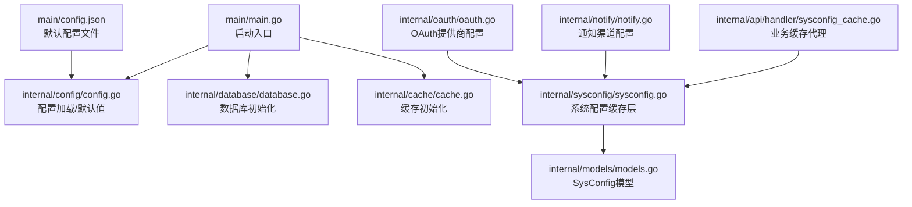
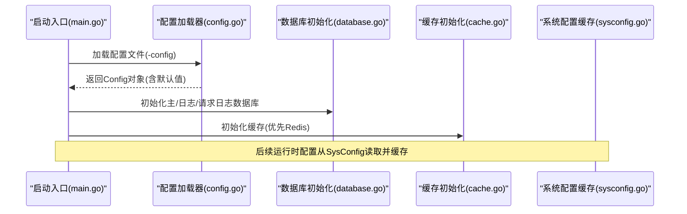
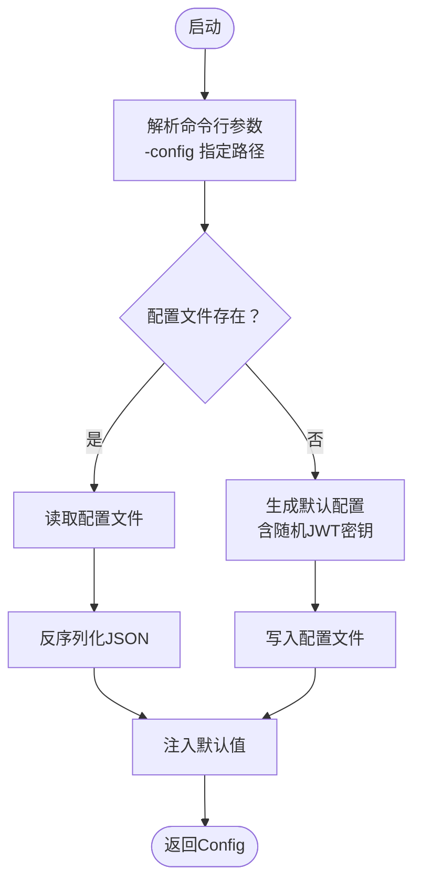
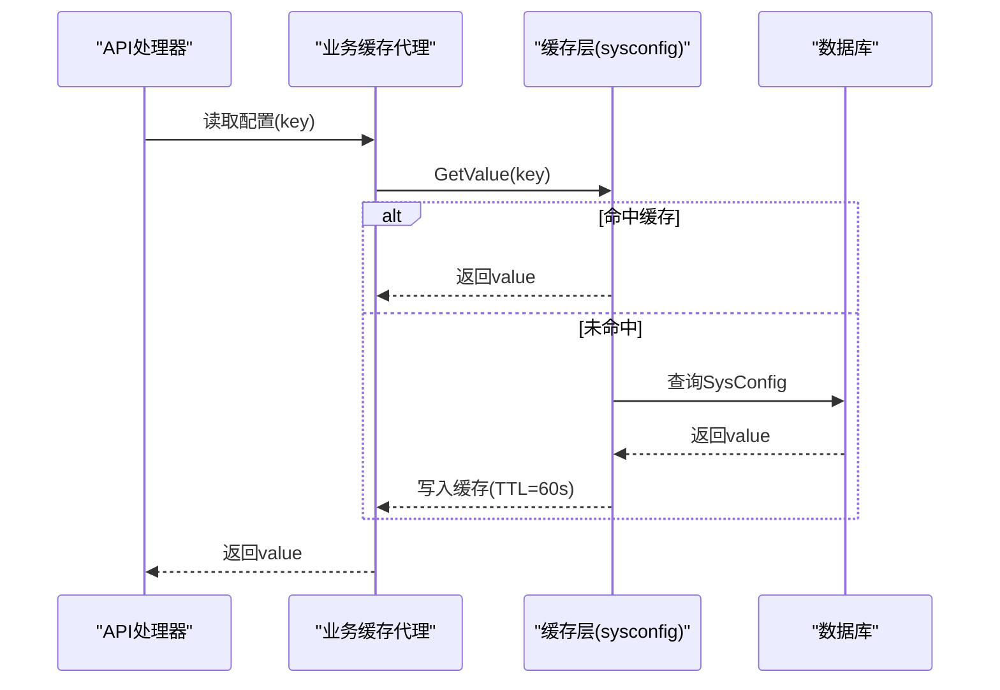
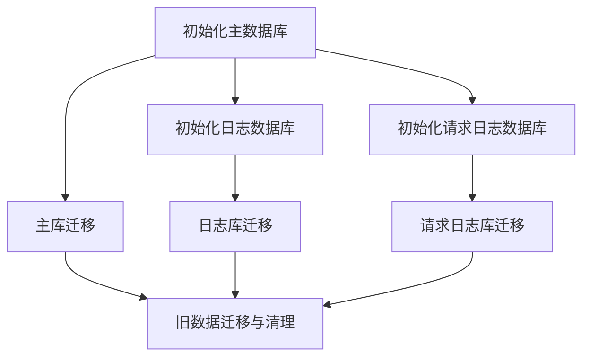
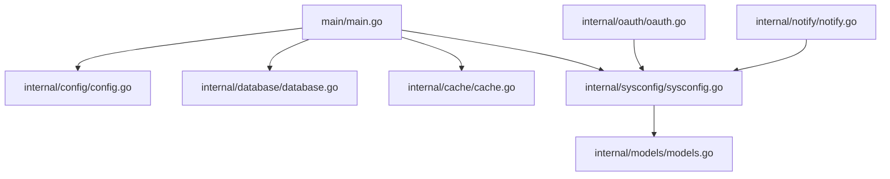

# 配置管理

<cite>
**本文档引用的文件**
- [main.go](file://main/main.go)
- [config.go](file://main/internal/config/config.go)
- [sysconfig.go](file://main/internal/sysconfig/sysconfig.go)
- [database.go](file://main/internal/database/database.go)
- [cache.go](file://main/internal/cache/cache.go)
- [oauth.go](file://main/internal/oauth/oauth.go)
- [notify.go](file://main/internal/notify/notify.go)
- [base.go](file://main/internal/cert/deploy/base/base.go)
- [registry.go](file://main/internal/cert/deploy/registry.go)
- [models.go](file://main/internal/models/models.go)
- [sysconfig_cache.go](file://main/internal/api/handler/sysconfig_cache.go)
- [auth.go](file://main/internal/api/handler/auth.go)
- [config.json](file://main/config.json)
</cite>

## 目录
1. [简介](#简介)
2. [项目结构](#项目结构)
3. [核心组件](#核心组件)
4. [架构总览](#架构总览)
5. [详细组件分析](#详细组件分析)
6. [依赖分析](#依赖分析)
7. [性能考虑](#性能考虑)
8. [故障排查指南](#故障排查指南)
9. [结论](#结论)
10. [附录](#附录)

## 简介
本指南面向DNSPlane配置管理系统，系统通过单一配置文件集中管理运行时参数，并结合系统配置表实现运行时热更新与缓存。文档覆盖以下主题：
- 配置文件结构与加载机制
- 运行时配置管理与热更新策略
- 配置项分类与用途（数据库、缓存、邮件、OAuth等）
- 配置验证与默认值处理
- 环境变量支持与优先级规则
- 安全存储与敏感信息保护

## 项目结构
配置相关模块分布于后端Go代码与前端设置界面之间，形成“本地配置文件 + 系统配置表”的双层配置体系：
- 启动入口负责加载配置文件并初始化数据库、缓存、监控等基础设施
- 系统配置表用于存放运行时可变参数，配合缓存层实现热更新
- OAuth与通知模块从系统配置表动态读取第三方凭据与通道配置
- 前端设置界面提供可视化配置入口，写入系统配置表并触发缓存失效

**图表来源**
- [main.go:52-120](file://main/main.go#L52-L120)
- [config.go:82-123](file://main/internal/config/config.go#L82-L123)
- [database.go:73-149](file://main/internal/database/database.go#L73-L149)
- [cache.go:47-86](file://main/internal/cache/cache.go#L47-L86)
- [sysconfig.go:27-46](file://main/internal/sysconfig/sysconfig.go#L27-L46)
- [models.go:105-120](file://main/internal/models/models.go#L105-L120)
- [oauth.go:100-124](file://main/internal/oauth/oauth.go#L100-L124)
- [notify.go:526-568](file://main/internal/notify/notify.go#L526-L568)
- [sysconfig_cache.go:14-39](file://main/internal/api/handler/sysconfig_cache.go#L14-L39)
- [config.json](file://main/config.json)

**章节来源**
- [main.go:52-120](file://main/main.go#L52-L120)
- [config.go:12-19](file://main/internal/config/config.go#L12-L19)

## 核心组件
- 配置加载器：负责解析配置文件、注入默认值、生成默认配置文件
- 系统配置缓存层：对SysConfig读取加缓存，降低DB压力
- 数据库初始化：根据配置选择SQLite或MySQL，初始化日志与请求日志独立数据库
- 缓存初始化：优先Redis，失败回退内存缓存
- OAuth与通知：从系统配置表动态加载第三方凭据与通道配置
- 前端设置：写入系统配置表，触发缓存失效以实现热更新

**章节来源**
- [config.go:82-161](file://main/internal/config/config.go#L82-L161)
- [sysconfig.go:27-46](file://main/internal/sysconfig/sysconfig.go#L27-L46)
- [database.go:73-149](file://main/internal/database/database.go#L73-L149)
- [cache.go:47-86](file://main/internal/cache/cache.go#L47-L86)
- [oauth.go:100-124](file://main/internal/oauth/oauth.go#L100-L124)
- [notify.go:526-568](file://main/internal/notify/notify.go#L526-L568)

## 架构总览
系统采用“本地配置文件 + 系统配置表”的双层架构：
- 本地配置文件：包含服务器、数据库、JWT、代理、日志清理、Redis等基础参数
- 系统配置表：存放运行时可变参数（如OAuth、通知、验证码开关等），通过缓存层读取并支持热更新

**图表来源**
- [main.go:56-80](file://main/main.go#L56-L80)
- [config.go:82-123](file://main/internal/config/config.go#L82-L123)
- [database.go:73-149](file://main/internal/database/database.go#L73-L149)
- [cache.go:47-86](file://main/internal/cache/cache.go#L47-L86)
- [sysconfig.go:27-46](file://main/internal/sysconfig/sysconfig.go#L27-L46)

## 详细组件分析

### 配置文件结构与加载机制
- 结构组成：服务器、数据库、JWT、代理、日志清理、Redis
- 加载流程：命令行传入配置文件路径；若文件不存在则生成默认配置并写入文件；存在则反序列化；随后注入默认值（如服务器默认端口、模式、数据库默认驱动与路径、JWT默认密钥与过期时长、日志清理默认策略）
- 默认值策略：未显式提供的字段使用硬编码默认值；JWT密钥在首次生成时使用随机字节并十六进制编码
- 文件持久化：提供保存函数将当前内存配置写回文件

**图表来源**
- [main.go:53-60](file://main/main.go#L53-L60)
- [config.go:82-123](file://main/internal/config/config.go#L82-L123)
- [config.go:125-131](file://main/internal/config/config.go#L125-L131)
- [config.go:133-145](file://main/internal/config/config.go#L133-L145)

**章节来源**
- [config.go:12-19](file://main/internal/config/config.go#L12-L19)
- [config.go:82-123](file://main/internal/config/config.go#L82-L123)
- [config.go:125-131](file://main/internal/config/config.go#L125-L131)
- [config.go:133-145](file://main/internal/config/config.go#L133-L145)
- [config.json](file://main/config.json)

### 运行时配置管理与热更新策略
- 缓存层：系统配置读取统一走缓存层，命中直接返回；未命中则查DB并写入缓存（TTL 60秒）
- 失效策略：当配置被修改后，调用失效函数清除对应缓存键，确保下次读取获取最新值
- 业务代理：API处理器通过业务缓存代理访问系统配置，集中管理失效范围（如认证相关配置）

**图表来源**
- [sysconfig.go:27-46](file://main/internal/sysconfig/sysconfig.go#L27-L46)
- [sysconfig_cache.go:14-39](file://main/internal/api/handler/sysconfig_cache.go#L14-L39)

**章节来源**
- [sysconfig.go:18-21](file://main/internal/sysconfig/sysconfig.go#L18-L21)
- [sysconfig.go:27-46](file://main/internal/sysconfig/sysconfig.go#L27-L46)
- [sysconfig_cache.go:14-39](file://main/internal/api/handler/sysconfig_cache.go#L14-L39)

### 配置项分类与用途
- 服务器配置：监听地址、端口、运行模式、基础URL
- 数据库配置：驱动类型、主机、端口、用户名、密码、数据库名、SQLite文件路径
- JWT配置：密钥、过期时长
- 代理配置：是否启用、代理URL
- 日志清理配置：是否启用、成功/错误日志保留条数、清理间隔
- Redis配置：是否启用、地址、密码、DB索引、连接池大小、最小空闲连接、键前缀

**章节来源**
- [config.go:12-19](file://main/internal/config/config.go#L12-L19)
- [config.go:38-43](file://main/internal/config/config.go#L38-L43)
- [config.go:45-53](file://main/internal/config/config.go#L45-L53)
- [config.go:67-70](file://main/internal/config/config.go#L67-L70)
- [config.go:72-75](file://main/internal/config/config.go#L72-L75)
- [config.go:31-36](file://main/internal/config/config.go#L31-L36)
- [config.go:21-29](file://main/internal/config/config.go#L21-L29)

### 数据库连接与日志数据库
- 主数据库：支持SQLite与MySQL，自动迁移、连接池优化
- 日志数据库：独立SQLite数据库，存放操作日志、证书日志、容灾检查日志
- 请求日志数据库：独立SQLite数据库，存放请求日志
- 旧数据迁移：将主库中的日志表迁移至独立数据库并清理

**图表来源**
- [database.go:73-149](file://main/internal/database/database.go#L73-L149)
- [database.go:151-231](file://main/internal/database/database.go#L151-L231)

**章节来源**
- [database.go:73-149](file://main/internal/database/database.go#L73-L149)
- [database.go:151-231](file://main/internal/database/database.go#L151-L231)

### 缓存初始化与回退机制
- 优先使用Redis：连接超时3秒，失败则回退到内存缓存
- 内存缓存：提供基本KV、列表、自增等能力，定期清理过期键
- 键前缀：支持逻辑键前缀，避免多环境冲突

**章节来源**
- [cache.go:47-86](file://main/internal/cache/cache.go#L47-L86)
- [cache.go:96-309](file://main/internal/cache/cache.go#L96-L309)

### OAuth配置加载
- 从系统配置表按前缀批量读取提供商配置，组装为ProviderConfig
- 支持GitHub旧配置格式兼容
- 提供可用提供商列表，供前端展示

**章节来源**
- [oauth.go:100-124](file://main/internal/oauth/oauth.go#L100-L124)
- [oauth.go:126-142](file://main/internal/oauth/oauth.go#L126-L142)

### 通知渠道配置加载
- 从系统配置表读取邮件、Telegram、Webhook、Discord、Bark、企业微信等配置
- 自动识别加密方式（SSL/STARTTLS）、认证方式（PLAIN/LOGIN/CRAM-MD5）
- 支持模板化消息体

**章节来源**
- [notify.go:34-46](file://main/internal/notify/notify.go#L34-L46)
- [notify.go:526-568](file://main/internal/notify/notify.go#L526-L568)

### 部署提供商配置加载
- 部署提供商配置支持大小写不敏感、下划线与驼峰互转
- 支持从指定配置映射回退到默认配置
- 提供域名分割等工具方法

**章节来源**
- [base.go:116-146](file://main/internal/cert/deploy/base/base.go#L116-L146)
- [base.go:164-174](file://main/internal/cert/deploy/base/base.go#L164-L174)
- [base.go:205-221](file://main/internal/cert/deploy/base/base.go#L205-L221)

### 配置验证与默认值处理
- 配置加载阶段：未提供字段使用默认值；JWT密钥随机生成
- OAuth配置：若客户端ID/应用ID为空则判定为未配置
- 通知配置：根据键是否存在决定渠道启用与否；端口解析与加密方式判断

**章节来源**
- [config.go:82-123](file://main/internal/config/config.go#L82-L123)
- [config.go:125-131](file://main/internal/config/config.go#L125-L131)
- [oauth.go:93-95](file://main/internal/oauth/oauth.go#L93-L95)
- [notify.go:538-550](file://main/internal/notify/notify.go#L538-L550)

### 环境变量支持与优先级规则
- 当前实现：通过命令行参数传入配置文件路径；未发现显式的环境变量解析逻辑
- 建议实践：在生产环境中可通过容器/进程管理器注入环境变量，再由应用读取并转换为配置文件或直接映射到配置结构

**章节来源**
- [main.go:53-54](file://main/main.go#L53-L54)

### 安全存储与敏感信息保护
- JWT密钥：首次生成随机密钥并写回配置文件
- OAuth与通知敏感信息：存储于系统配置表，读取时按需解密或直接使用（注意：代码未显示对这些字段的加密存储逻辑）
- 建议：对敏感字段（如OAuth密钥、通知凭证）采用加密存储并在内存中以只读形式使用

**章节来源**
- [config.go:112-115](file://main/internal/config/config.go#L112-L115)
- [config.go:125-131](file://main/internal/config/config.go#L125-L131)
- [oauth.go:100-124](file://main/internal/oauth/oauth.go#L100-L124)
- [notify.go:526-568](file://main/internal/notify/notify.go#L526-L568)

## 依赖分析
- 启动入口依赖配置加载器、数据库、缓存、监控、任务管理器
- 配置加载器依赖文件系统与JSON编解码
- 数据库初始化依赖驱动选择与迁移
- 缓存初始化依赖Redis客户端或内存实现
- 系统配置缓存层依赖数据库与缓存接口
- OAuth与通知模块依赖系统配置表

**图表来源**
- [main.go:52-120](file://main/main.go#L52-L120)
- [config.go:82-123](file://main/internal/config/config.go#L82-L123)
- [database.go:73-149](file://main/internal/database/database.go#L73-L149)
- [cache.go:47-86](file://main/internal/cache/cache.go#L47-L86)
- [sysconfig.go:27-46](file://main/internal/sysconfig/sysconfig.go#L27-L46)
- [oauth.go:100-124](file://main/internal/oauth/oauth.go#L100-L124)
- [notify.go:526-568](file://main/internal/notify/notify.go#L526-L568)
- [models.go:105-120](file://main/internal/models/models.go#L105-L120)

**章节来源**
- [main.go:52-120](file://main/main.go#L52-L120)

## 性能考虑
- 数据库连接池：SQLite启用WAL与连接池；MySQL设置较大连接池与生命周期
- 查询回调：记录SQL执行耗时与影响行数，支持可选记录（仅在请求追踪开启时）
- 缓存：系统配置60秒TTL，减少DB查询压力
- 日志数据库：独立数据库，避免主库压力

**章节来源**
- [database.go:49-71](file://main/internal/database/database.go#L49-L71)
- [database.go:367-404](file://main/internal/database/database.go#L367-L404)
- [sysconfig.go:18-21](file://main/internal/sysconfig/sysconfig.go#L18-L21)

## 故障排查指南
- 配置文件加载失败：检查文件路径与权限；确认JSON格式正确
- 数据库连接失败：核对驱动、主机、端口、用户名、密码；查看迁移日志
- Redis连接失败：检查地址、密码、DB索引；确认网络连通性
- OAuth配置无效：确认系统配置表中对应键存在且非空
- 通知发送失败：检查SMTP/第三方API凭据与网络连通性

**章节来源**
- [main.go:56-65](file://main/main.go#L56-L65)
- [database.go:80-103](file://main/internal/database/database.go#L80-L103)
- [cache.go:71-81](file://main/internal/cache/cache.go#L71-L81)
- [oauth.go:93-95](file://main/internal/oauth/oauth.go#L93-L95)
- [notify.go:103-190](file://main/internal/notify/notify.go#L103-L190)

## 结论
DNSPlane配置管理系统通过本地配置文件与系统配置表的双层设计，实现了启动时的静态配置与运行时的动态配置管理。系统在性能方面通过缓存与连接池优化，在安全性方面通过随机JWT密钥与可选的Redis回退机制提供了基础保障。建议在生产环境中进一步完善敏感信息的加密存储与更严格的配置验证。

## 附录
- 配置文件示例位置：[config.json](file://main/config.json)
- 系统配置表模型：[models.go:105-120](file://main/internal/models/models.go#L105-L120)
- 登录验证码开关读取示例：[auth.go:50-65](file://main/internal/api/handler/auth.go#L50-L65)