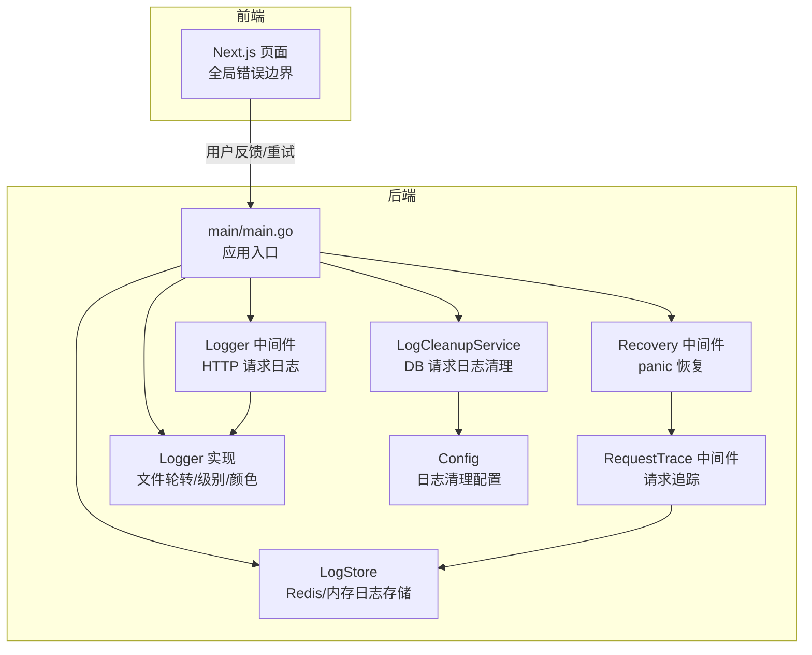
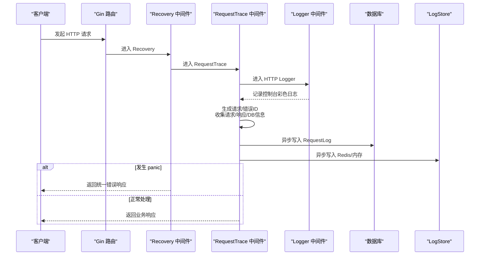
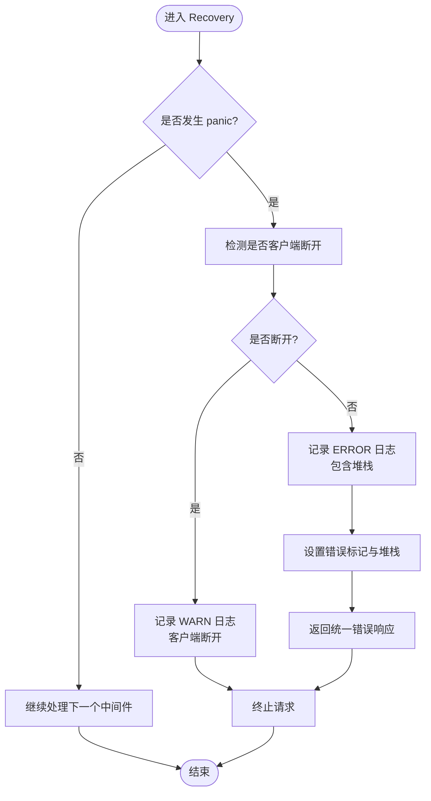
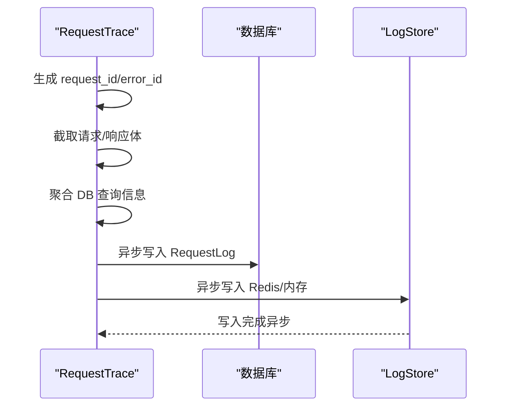
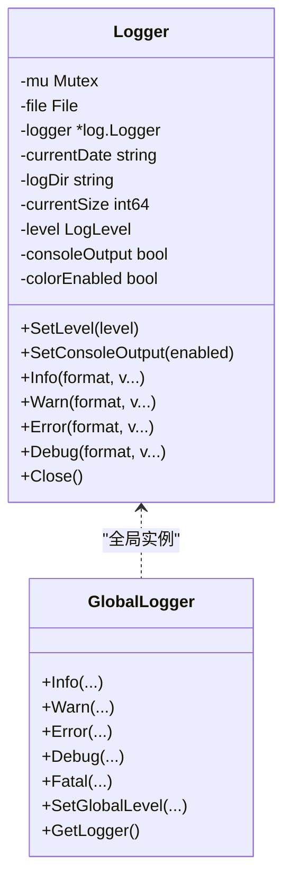
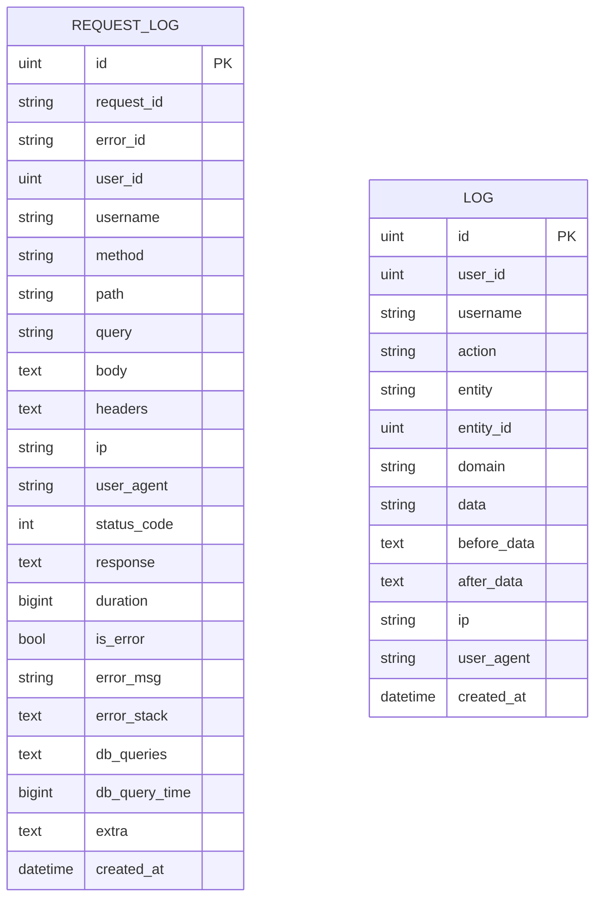
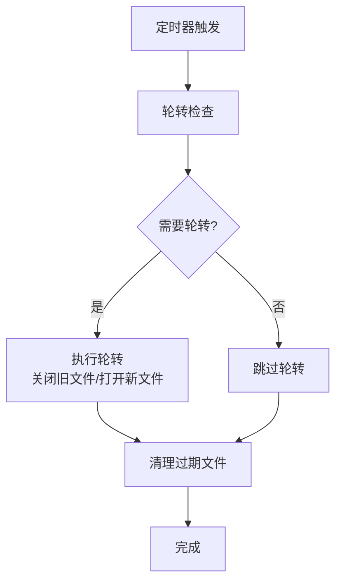
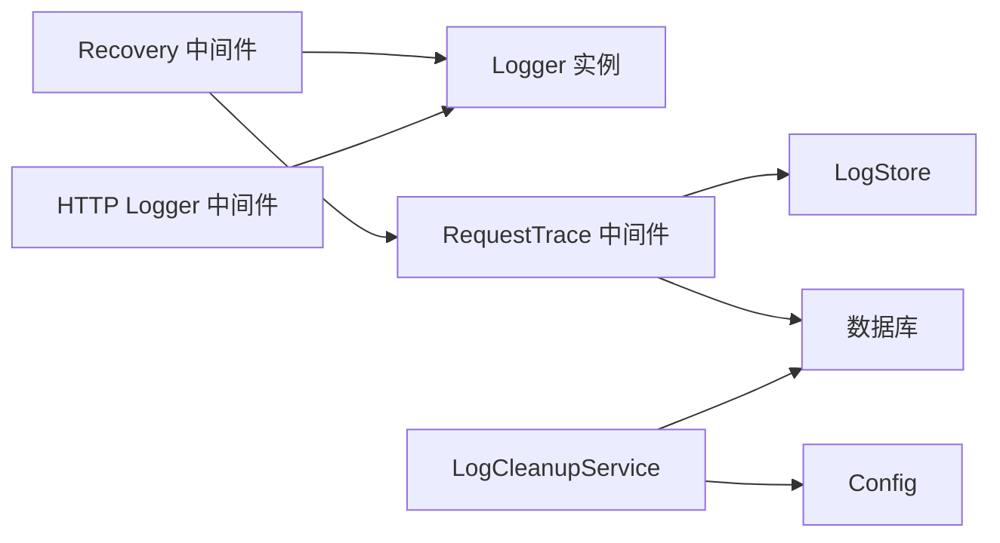

# 错误处理与日志

<cite>
**本文引用的文件**
- [main.go](file://main/main.go)
- [logger.go](file://main/internal/logger/logger.go)
- [store.go](file://main/internal/logstore/store.go)
- [log_cleanup.go](file://main/internal/service/log_cleanup.go)
- [recovery.go](file://main/internal/api/middleware/recovery.go)
- [logger.go](file://main/internal/api/middleware/logger.go)
- [request_trace.go](file://main/internal/api/middleware/request_trace.go)
- [config.go](file://main/internal/config/config.go)
- [models.go](file://main/internal/models/models.go)
</cite>

## 目录
1. [简介](#简介)
2. [项目结构](#项目结构)
3. [核心组件](#核心组件)
4. [架构总览](#架构总览)
5. [详细组件分析](#详细组件分析)
6. [依赖关系分析](#依赖关系分析)
7. [性能考量](#性能考量)
8. [故障排查指南](#故障排查指南)
9. [结论](#结论)
10. [附录](#附录)

## 简介
本文件聚焦 DNSPlane 的错误处理与日志系统，涵盖以下主题：
- 全局错误恢复机制与 panic 处理策略
- 结构化日志实现与日志级别管理
- 错误码与错误消息的组织方式
- 日志存储与检索机制（请求日志、系统日志）
- 日志轮转与清理策略
- 错误监控与告警配置思路
- 调试技巧与常见错误排查

## 项目结构
DNSPlane 的错误与日志体系由后端 Go 服务与前端 Next.js 页面共同构成：
- 后端负责：
  - HTTP 服务启动与路由装配
  - 自定义 Recovery 中间件捕获 panic
  - 请求追踪与结构化日志记录
  - 日志轮转与清理
  - 请求日志与系统日志的持久化与检索
- 前端负责：
  - 全局错误边界展示与交互
  - 错误信息与堆栈的可视化呈现

图表来源
- [main.go:117-127](file://main/main.go#L117-L127)
- [recovery.go:21-73](file://main/internal/api/middleware/recovery.go#L21-L73)
- [logger.go:156-231](file://main/internal/api/middleware/logger.go#L156-L231)
- [logger.go:107-171](file://main/internal/logger/logger.go#L107-L171)
- [store.go:43-50](file://main/internal/logstore/store.go#L43-L50)
- [log_cleanup.go:19-32](file://main/internal/service/log_cleanup.go#L19-L32)
- [config.go:31-36](file://main/internal/config/config.go#L31-L36)

章节来源
- [main.go:52-147](file://main/main.go#L52-L147)
- [logger.go:56-91](file://main/internal/logger/logger.go#L56-L91)
- [store.go:43-50](file://main/internal/logstore/store.go#L43-L50)
- [log_cleanup.go:19-32](file://main/internal/service/log_cleanup.go#L19-L32)
- [config.go:31-36](file://main/internal/config/config.go#L31-L36)

## 核心组件
- 自定义 Recovery 中间件：捕获 panic，区分客户端断开与真实异常，记录结构化日志并返回统一错误响应。
- 请求追踪中间件：生成请求/错误 ID，收集请求体、响应体、DB 查询、用户信息等，异步落库并写入 Redis/内存。
- HTTP 请求日志中间件：过滤静态资源与 HEAD 请求，控制台彩色输出 + 结构化文件日志，慢请求告警。
- 结构化日志实现：支持 DEBUG/INFO/WARN/ERROR 级别，自动轮转（按日与大小），后台清理（按天与备份数）。
- 日志存储与检索：请求日志与系统日志双通道，Redis/内存后备，支持分页与过滤查询。
- 日志清理服务：基于配置定期清理成功/错误请求日志。

章节来源
- [recovery.go:15-74](file://main/internal/api/middleware/recovery.go#L15-L74)
- [request_trace.go:94-242](file://main/internal/api/middleware/request_trace.go#L94-L242)
- [logger.go:152-231](file://main/internal/api/middleware/logger.go#L152-L231)
- [logger.go:16-31](file://main/internal/logger/logger.go#L16-L31)
- [logger.go:107-171](file://main/internal/logger/logger.go#L107-L171)
- [store.go:35-50](file://main/internal/logstore/store.go#L35-L50)
- [log_cleanup.go:12-63](file://main/internal/service/log_cleanup.go#L12-L63)

## 架构总览
后端通过 Recovery 与 RequestTrace 保证错误与请求的可观测性，Logger 提供统一的结构化日志输出，LogStore 将请求日志与系统日志持久化到数据库与缓存，LogCleanupService 定期清理历史数据。

图表来源
- [recovery.go:21-73](file://main/internal/api/middleware/recovery.go#L21-L73)
- [request_trace.go:94-242](file://main/internal/api/middleware/request_trace.go#L94-L242)
- [logger.go:156-231](file://main/internal/api/middleware/logger.go#L156-L231)

## 详细组件分析

### 全局错误恢复与 panic 处理
- 客户端断开识别：通过 net.OpError/os.SyscallError 判断 "broken pipe" 或 "connection reset by peer"，仅记录警告，不触发告警。
- 真实 panic：记录 ERROR 级别日志，包含请求方法、路径、客户端 IP、请求 ID 与堆栈信息；同时在上下文中设置错误标记与堆栈，供后续结构化日志与前端展示使用。
- 统一错误响应：返回 code=-1、msg=“服务器内部错误”的 JSON。

图表来源
- [recovery.go:21-73](file://main/internal/api/middleware/recovery.go#L21-L73)

章节来源
- [recovery.go:15-74](file://main/internal/api/middleware/recovery.go#L15-L74)

### 请求追踪与结构化日志
- 请求 ID 与错误 ID：每次 API 请求生成唯一请求 ID；若发生错误生成错误 ID 并注入响应头与上下文。
- 请求/响应采集：限制请求体与响应体大小，避免日志膨胀；对成功响应仅截取部分文本。
- 数据库查询聚合：收集 SQL、耗时、影响行数与错误信息，汇总后写入日志。
- 异步落库：先写入数据库获得自增 ID，再写入 Redis/内存，确保管理端与排障字段一致。
- 日志文件输出：HTTP Logger 将模块、方法、路径、状态码、耗时、IP、请求 ID、错误信息等结构化写入日志文件，避免与控制台重复输出。

图表来源
- [request_trace.go:94-242](file://main/internal/api/middleware/request_trace.go#L94-L242)
- [store.go:59-77](file://main/internal/logstore/store.go#L59-L77)

章节来源
- [request_trace.go:36-54](file://main/internal/api/middleware/request_trace.go#L36-L54)
- [request_trace.go:103-242](file://main/internal/api/middleware/request_trace.go#L103-L242)
- [logger.go:156-231](file://main/internal/api/middleware/logger.go#L156-L231)

### 结构化日志实现与级别管理
- 日志级别：DEBUG/INFO/WARN/ERROR 四级，可通过全局接口设置。
- 输出目标：控制台彩色输出与日志文件（可分别开关）。
- 调用者信息：自动记录调用文件与行号，便于定位。
- 文件轮转：按日切分与单文件大小限制（超限直接删除），后台定时检查。
- 清理策略：按保留天数与备份数上限清理，避免磁盘占用无限增长。

图表来源
- [logger.go:43-91](file://main/internal/logger/logger.go#L43-L91)
- [logger.go:396-455](file://main/internal/logger/logger.go#L396-L455)

章节来源
- [logger.go:16-31](file://main/internal/logger/logger.go#L16-L31)
- [logger.go:107-171](file://main/internal/logger/logger.go#L107-L171)
- [logger.go:173-228](file://main/internal/logger/logger.go#L173-L228)
- [logger.go:307-325](file://main/internal/logger/logger.go#L307-L325)

### 日志存储与检索机制
- 请求日志：
  - 结构：包含请求 ID、错误 ID、用户信息、方法、路径、查询参数、请求体、响应体、状态码、耗时、错误标记、错误消息与堆栈、DB 查询集合与总耗时、额外数据、创建时间等。
  - 存储：数据库（RequestLog 表）+ Redis/内存（LogStore 列表）。
  - 检索：支持分页、关键词、方法、错误标记、时间范围过滤；提供统计缓存（最近错误、今日统计等）。
- 系统日志（操作日志）：
  - 结构：包含用户 ID/名称、动作、实体、域名、前后数据、IP、UA、创建时间等。
  - 存储：数据库 + Redis/内存。
  - 检索：支持分页、关键词、动作、域名过滤。

图表来源
- [models.go:332-356](file://main/internal/models/models.go#L332-L356)
- [models.go:105-120](file://main/internal/models/models.go#L105-L120)

章节来源
- [store.go:59-77](file://main/internal/logstore/store.go#L59-L77)
- [store.go:83-125](file://main/internal/logstore/store.go#L83-L125)
- [store.go:268-281](file://main/internal/logstore/store.go#L268-L281)
- [store.go:283-320](file://main/internal/logstore/store.go#L283-L320)
- [models.go:332-356](file://main/internal/models/models.go#L332-L356)
- [models.go:105-120](file://main/internal/models/models.go#L105-L120)

### 日志轮转与清理策略
- 轮转：
  - 按日切分：每天生成一个新日志文件。
  - 大小限制：单文件达到上限时直接删除，避免磁盘占用。
  - 后台定时检查：每分钟检查一次日期变化或文件大小。
- 清理：
  - 保留天数：超过保留期限的文件删除。
  - 备份数上限：超过备份数时删除最旧文件。
- 请求日志清理服务：
  - 基于配置启用/禁用，按小时间隔运行。
  - 分别保留成功与错误日志条数，超过上限按 ID 截断清理。

图表来源
- [logger.go:151-171](file://main/internal/logger/logger.go#L151-L171)
- [logger.go:187-228](file://main/internal/logger/logger.go#L187-L228)

章节来源
- [logger.go:16-20](file://main/internal/logger/logger.go#L16-L20)
- [logger.go:107-149](file://main/internal/logger/logger.go#L107-L149)
- [logger.go:173-228](file://main/internal/logger/logger.go#L173-L228)
- [log_cleanup.go:42-63](file://main/internal/service/log_cleanup.go#L42-L63)
- [log_cleanup.go:65-127](file://main/internal/service/log_cleanup.go#L65-L127)

### 错误码与错误消息本地化
- 错误码：Recovery 统一返回 code=-1，msg=“服务器内部错误”，便于前端与集成方识别。
- 错误消息：Recovery 记录 ERROR 级别日志并包含堆栈；RequestTrace 生成错误 ID 并在响应头中返回，便于前端展示与用户反馈。
- 前端错误展示：Next.js 全局错误页面与路由错误页面展示错误信息与堆栈，支持复制与重试。

章节来源
- [recovery.go:66-69](file://main/internal/api/middleware/recovery.go#L66-L69)
- [request_trace.go:150-162](file://main/internal/api/middleware/request_trace.go#L150-L162)
- [web/app/global-error.tsx:39-67](file://web/app/global-error.tsx#L39-L67)
- [web/app/error.tsx:29-97](file://web/app/error.tsx#L29-L97)

### 错误监控与告警配置
- 建议配置项（来自配置文件）：
  - 启用自动清理：log_cleanup.enable
  - 成功日志保留条数：log_cleanup.success_keep_count
  - 错误日志保留条数：log_cleanup.error_keep_count
  - 清理间隔（小时）：log_cleanup.cleanup_interval
- 监控指标建议：
  - 5xx 错误率、慢请求比例、错误 ID 分布、日志文件大小与保留天数。
  - 可结合外部监控系统（如 Prometheus/Grafana）采集日志文件与数据库指标。

章节来源
- [config.go:31-36](file://main/internal/config/config.go#L31-L36)
- [log_cleanup.go:19-32](file://main/internal/service/log_cleanup.go#L19-L32)

## 依赖关系分析
- Recovery 依赖 Logger 与 RequestTrace 的键常量与错误标记。
- RequestTrace 依赖数据库与 LogStore，负责结构化日志与异步落库。
- Logger 作为基础设施，被 HTTP Logger 与 Recovery 共同使用。
- LogCleanupService 依赖 Config 与数据库模型，负责请求日志清理。

图表来源
- [recovery.go:5-12](file://main/internal/api/middleware/recovery.go#L5-L12)
- [request_trace.go:16-21](file://main/internal/api/middleware/request_trace.go#L16-L21)
- [logger.go:43-91](file://main/internal/logger/logger.go#L43-L91)
- [log_cleanup.go:19-32](file://main/internal/service/log_cleanup.go#L19-L32)

章节来源
- [recovery.go:5-12](file://main/internal/api/middleware/recovery.go#L5-L12)
- [request_trace.go:16-21](file://main/internal/api/middleware/request_trace.go#L16-L21)
- [logger.go:43-91](file://main/internal/logger/logger.go#L43-L91)
- [log_cleanup.go:19-32](file://main/internal/service/log_cleanup.go#L19-L32)

## 性能考量
- 日志写入：
  - HTTP Logger 仅写文件，避免重复输出；Recovery 与 RequestTrace 使用结构化日志，减少解析成本。
  - LogStore 采用 Redis/内存列表，写入频繁但通过批量裁剪与原子计数降低压力。
- 请求日志清理：
  - LogCleanupService 以小时为单位运行，避免高频扫描；按 ID 截断清理，减少数据库压力。
- 轮转与清理：
  - Logger 后台定时器每分钟检查轮转，每日清理一次，避免阻塞请求处理。

章节来源
- [logger.go:235-305](file://main/internal/logger/logger.go#L235-L305)
- [store.go:70-77](file://main/internal/logstore/store.go#L70-L77)
- [log_cleanup.go:42-63](file://main/internal/service/log_cleanup.go#L42-L63)
- [logger.go:151-185](file://main/internal/logger/logger.go#L151-L185)

## 故障排查指南
- 常见问题与定位步骤：
  - 500 错误：检查 Recovery 日志（ERROR 级别），确认是否为客户端断开（WARN）或真实 panic（ERROR）。查看错误 ID 与堆栈，定位具体请求。
  - 慢请求：HTTP Logger 对慢请求（默认阈值）进行告警（WARN），结合 RequestTrace 的 DB 查询信息定位瓶颈。
  - 请求日志缺失：确认 LogStore 后端（Redis/内存）可用性；检查 LogCleanup 是否清理过快导致数据丢失。
  - 日志文件异常：检查轮转与清理策略是否生效，确认磁盘空间与权限。
- 调试技巧：
  - 临时提升日志级别至 DEBUG，观察更细粒度信息。
  - 使用 RequestTrace 生成的 request_id 在数据库与日志中交叉检索。
  - 前端全局错误页面可复制错误信息与堆栈，便于反馈与复现。

章节来源
- [recovery.go:48-69](file://main/internal/api/middleware/recovery.go#L48-L69)
- [logger.go:156-231](file://main/internal/api/middleware/logger.go#L156-L231)
- [store.go:43-50](file://main/internal/logstore/store.go#L43-L50)
- [log_cleanup.go:65-127](file://main/internal/service/log_cleanup.go#L65-L127)

## 结论
DNSPlane 的错误处理与日志体系通过 Recovery、RequestTrace、HTTP Logger、结构化日志实现、LogStore 与 LogCleanupService 形成了闭环：从 panic 恢复、请求追踪、结构化日志输出，到日志存储与清理，覆盖了生产环境的关键需求。配合前端全局错误展示，提升了可观测性与用户体验。建议在生产环境中合理配置日志清理策略与监控指标，持续优化日志性能与容量。

## 附录
- 关键配置项参考：
  - server.mode：debug/release 模式
  - log_cleanup.enable：是否启用自动清理
  - log_cleanup.success_keep_count：成功日志保留条数
  - log_cleanup.error_keep_count：错误日志保留条数
  - log_cleanup.cleanup_interval：清理间隔（小时）

章节来源
- [config.go:38-43](file://main/internal/config/config.go#L38-L43)
- [config.go:31-36](file://main/internal/config/config.go#L31-L36)