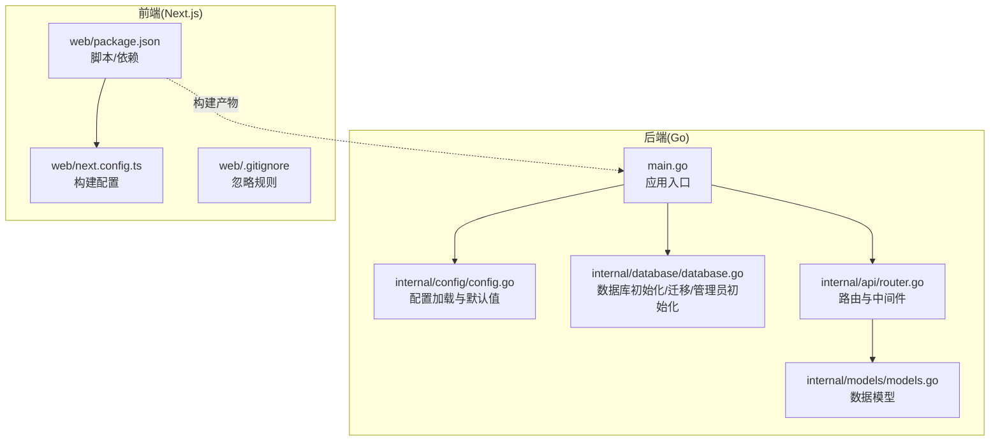
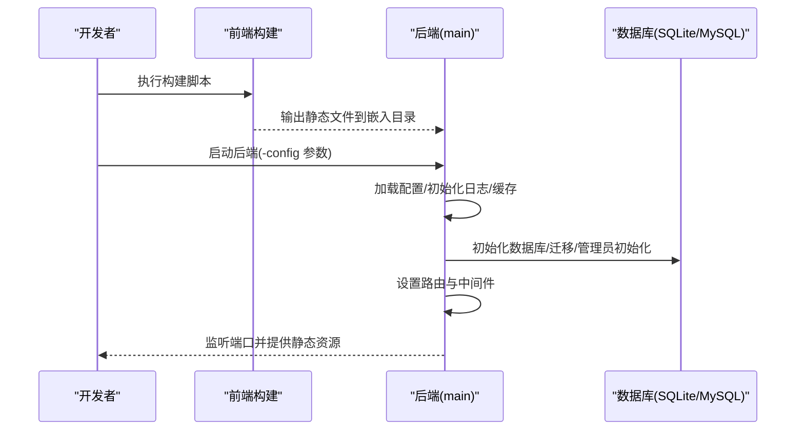

# 快速开始

<cite>
**本文引用的文件**   
- [README.md](file://README.md)
- [main.go](file://main/main.go)
- [go.mod](file://main/go.mod)
- [config.go](file://main/internal/config/config.go)
- [router.go](file://main/internal/api/router.go)
- [database.go](file://main/internal/database/database.go)
- [models.go](file://main/internal/models/models.go)
- [package.json](file://web/package.json)
- [next.config.ts](file://web/next.config.ts)
- [.gitignore](file://web/.gitignore)
- [Dockerfile](file://Dockerfile)
</cite>

## 目录
1. [简介](#简介)
2. [项目结构](#项目结构)
3. [核心组件](#核心组件)
4. [架构总览](#架构总览)
5. [详细组件分析](#详细组件分析)
6. [依赖分析](#依赖分析)
7. [性能考虑](#性能考虑)
8. [故障排除指南](#故障排除指南)
9. [结论](#结论)
10. [附录](#附录)

## 简介
DNSPlane 是一个基于 Go 的现代化 DNS 管理系统，支持多平台 DNS 服务商接入、SSL 证书申请与部署、容灾切换、多用户权限管理以及现代化的前端界面。本“快速开始”指南面向新手，提供从零到一的完整安装、运行与部署流程，涵盖开发与生产环境、配置文件创建、首次安装、Docker 容器化部署及常见问题排查。

## 项目结构
项目采用前后端分离架构：
- 后端（Go）位于 dns/main，使用 Gin 框架提供 REST API，并内嵌前端静态资源。
- 前端（Next.js）位于 dns/web，构建产物输出到后端的 web/out 目录，随二进制一起打包。

图表来源
- [main.go:52-147](file://main/main.go#L52-L147)
- [config.go:82-123](file://main/internal/config/config.go#L82-L123)
- [database.go:73-149](file://main/internal/database/database.go#L73-L149)
- [router.go:14-274](file://main/internal/api/router.go#L14-L274)
- [models.go:9-357](file://main/internal/models/models.go#L9-L357)
- [package.json:5-11](file://web/package.json#L5-L11)
- [next.config.ts:3-13](file://web/next.config.ts#L3-L13)

章节来源
- [README.md:14-40](file://README.md#L14-L40)
- [main.go:52-147](file://main/main.go#L52-L147)
- [package.json:5-11](file://web/package.json#L5-L11)

## 核心组件
- 配置系统：负责加载/保存配置，支持默认值生成与随机密钥生成。
- 数据库层：支持 SQLite/MySQL，自动迁移、日志数据库分离、管理员账户初始化。
- API 路由：统一前缀 /api，内置认证、权限、审计、CORS、日志等中间件。
- 前端构建：Next.js 静态导出，产物复制到后端嵌入资源目录。

章节来源
- [config.go:82-161](file://main/internal/config/config.go#L82-L161)
- [database.go:73-320](file://main/internal/database/database.go#L73-L320)
- [router.go:14-162](file://main/internal/api/router.go#L14-L162)
- [package.json:5-11](file://web/package.json#L5-L11)

## 架构总览
后端通过 Gin 启动 HTTP 服务，注册 API 路由组与静态资源回退；数据库初始化后执行迁移与管理员初始化；前端构建产物被嵌入到二进制中，运行时由后端直接提供。

图表来源
- [main.go:56-127](file://main/main.go#L56-L127)
- [database.go:73-149](file://main/internal/database/database.go#L73-L149)
- [router.go:14-274](file://main/internal/api/router.go#L14-L274)
- [package.json:7](file://web/package.json#L7)

## 详细组件分析

### 安装与首次运行
- 安装依赖
  - 后端：进入 dns/main，执行依赖整理。
  - 前端：进入 dns/web，使用 bun 或 npm 安装依赖。
- 构建前端
  - 在 dns/web 执行构建脚本，产物输出到 ../main/web，供后端嵌入。
- 运行后端
  - 在 dns/main 使用 go run 启动，默认监听 8080 端口。
- 首次安装
  - 访问 http://localhost:8080，系统会自动跳转到安装页面并引导设置管理员账户。

章节来源
- [README.md:44-75](file://README.md#L44-L75)
- [main.go:119-127](file://main/main.go#L119-L127)
- [database.go:294-320](file://main/internal/database/database.go#L294-L320)

### 配置文件创建与参数说明
- 默认配置加载与保存
  - 若配置文件不存在，系统会生成默认配置并写入随机 JWT 密钥。
  - 支持自定义端口、主机、运行模式、数据库驱动与路径、JWT 密钥与过期时间、日志清理策略、Redis 缓存等。
- 关键字段说明
  - server.host/port/mode/base_url：服务绑定地址、端口、运行模式（debug/release）、基础 URL。
  - database.driver/host/port/username/password/database/file_path：数据库类型与连接信息，SQLite 时使用 file_path。
  - jwt.secret/expire_hour：JWT 密钥与过期小时数。
  - redis.enable/addr/password/db/pool_size/min_idle_conns/key_prefix：Redis 缓存配置。
  - proxy.enable/url：代理开关与代理地址。
  - log_cleanup.enable/success_keep_count/error_keep_count/cleanup_interval：日志清理策略。

章节来源
- [config.go:82-161](file://main/internal/config/config.go#L82-L161)

### 数据库初始化与管理员账户
- 数据库初始化
  - 支持 SQLite 与 MySQL，自动创建目录、WAL 模式、连接池优化、日志数据库与请求日志数据库迁移。
- 管理员初始化
  - 若无用户，自动创建默认管理员账户 admin/admin123，并提升为管理员级别。

章节来源
- [database.go:73-149](file://main/internal/database/database.go#L73-L149)
- [database.go:294-320](file://main/internal/database/database.go#L294-L320)

### API 路由与认证
- 路由前缀与分组
  - 所有 API 以 /api 为前缀；公开接口无需认证，受保护接口需携带 Bearer Token。
- 关键接口
  - 认证与安装：登录、安装、安装状态查询。
  - 账户与域名：账户 CRUD、域名 CRUD、解析记录 CRUD、批量操作。
  - 容灾监控：任务 CRUD、切换/暂停、日志查询、概览统计。
  - 证书：账户、订单、部署、CNAME 验证等。
  - 系统配置与通知：系统配置、缓存清理、代理测试、任务状态、通知测试。
- 中间件
  - 认证、权限、审计、CORS、日志、恢复、请求追踪等。

章节来源
- [router.go:14-162](file://main/internal/api/router.go#L14-L162)

### 前端构建与静态资源
- 构建脚本
  - dev：开发模式，启用 Turbopack。
  - build：构建并导出静态站点，同时将产物复制到后端嵌入目录。
  - build:ci：CI 环境构建，配合同步脚本。
  - start：生产启动。
- 构建配置
  - 输出格式为静态导出，禁用 TypeScript 错误阻塞构建，图片使用未优化模式。

章节来源
- [package.json:5-11](file://web/package.json#L5-L11)
- [next.config.ts:3-13](file://web/next.config.ts#L3-L13)

### Docker 容器化部署
- 多阶段构建
  - Web 阶段：在构建平台使用 Node 镜像安装依赖并构建前端。
  - Builder 阶段：在构建平台使用 Go 镜像下载依赖并编译后端，将前端产物复制到二进制中。
  - 运行阶段：使用 distroless 静态镜像，非 root 用户运行，暴露 8080 端口。
- 构建参数
  - 支持跨平台交叉编译（TARGETOS/TARGETARCH/TARGETVARIANT），裁剪符号与调试信息，精简体积。

章节来源
- [Dockerfile:1-34](file://Dockerfile#L1-L34)

## 依赖分析
- 后端依赖
  - Web 框架：Gin。
  - ORM：GORM（SQLite/MySQL 驱动）。
  - 缓存：Redis 客户端。
  - 加解密与工具：bcrypt、uuid、ed25519、yaml 等。
- 前端依赖
  - UI：Radix UI、Tailwind CSS。
  - 运行时：Next.js 16、React 19。
  - 工具：QRCode、Sonner、go-captcha-react 等。

章节来源
- [go.mod:5-28](file://main/go.mod#L5-L28)
- [package.json:12-40](file://web/package.json#L12-L40)

## 性能考虑
- 数据库优化
  - SQLite：WAL 模式、缓存大小、忙等待、内存临时存储、映射内存优化、连接池调优。
  - MySQL：连接池上限、空闲连接、生命周期与超时配置。
- 日志与清理
  - 日志数据库与请求日志数据库分离，减少主库压力。
  - 可配置的日志保留数量与清理间隔，降低磁盘占用。
- 缓存
  - 支持 Redis 缓存，可显著降低热点查询延迟；未配置时使用内存缓存。
- 构建与运行
  - 前端静态导出，后端单二进制 + 内嵌资源，部署简单、启动快。

章节来源
- [database.go:34-71](file://main/internal/database/database.go#L34-L71)
- [config.go:31-36](file://main/internal/config/config.go#L31-L36)
- [config.go:21-29](file://main/internal/config/config.go#L21-L29)

## 故障排除指南
- 无法访问安装页面
  - 确认后端已启动且监听端口正确；首次运行会自动跳转安装页。
- 数据库连接失败
  - 检查配置文件中的数据库驱动与连接参数；SQLite 会自动创建目录与文件。
- JWT 密钥问题
  - 配置文件缺失时会自动生成随机密钥；请妥善保存并替换为安全密钥。
- 前端构建失败
  - 确保使用 Bun 或 npm 安装依赖；检查构建脚本与输出目录复制逻辑。
- Docker 构建超时
  - 使用 CI 构建脚本或调整网络重试参数；确保网络稳定。
- 端口占用
  - 修改配置文件中的端口或释放 8080 端口占用。

章节来源
- [README.md:72-75](file://README.md#L72-L75)
- [config.go:112-123](file://main/internal/config/config.go#L112-L123)
- [database.go:80-103](file://main/internal/database/database.go#L80-L103)
- [package.json:7](file://web/package.json#L7)
- [Dockerfile:7-8](file://Dockerfile#L7-L8)

## 结论
通过本指南，您可以在本地快速完成 DNSPlane 的安装、构建与运行，并掌握配置文件的关键参数、首次安装流程、Docker 容器化部署方法以及常见问题的排查思路。建议在生产环境中进一步完善安全与运维配置，例如更换默认 JWT 密钥、启用 HTTPS、配置反向代理与日志轮转等。

## 附录

### 完整首次安装流程
- 安装依赖
  - 后端：进入 dns/main，执行依赖整理。
  - 前端：进入 dns/web，安装依赖。
- 构建前端
  - 在 dns/web 执行构建脚本，产物复制到后端嵌入目录。
- 运行后端
  - 在 dns/main 使用 go run 启动，默认监听 8080 端口。
- 首次安装
  - 访问 http://localhost:8080，根据安装向导设置管理员账户。

章节来源
- [README.md:44-75](file://README.md#L44-L75)