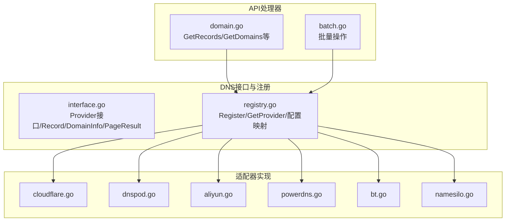
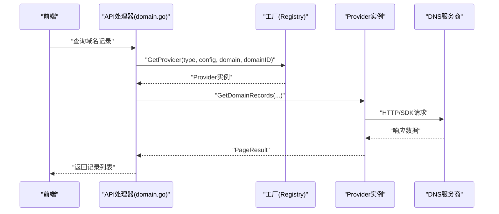
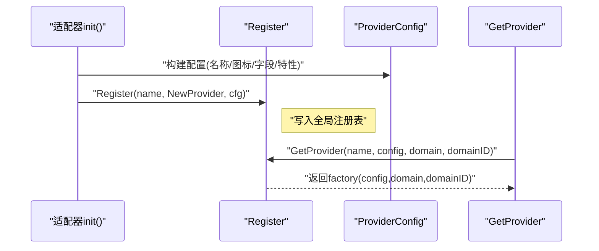
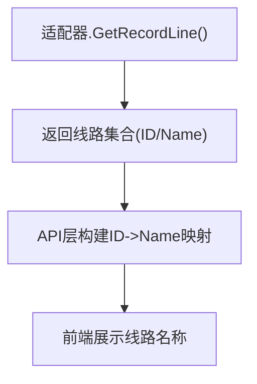
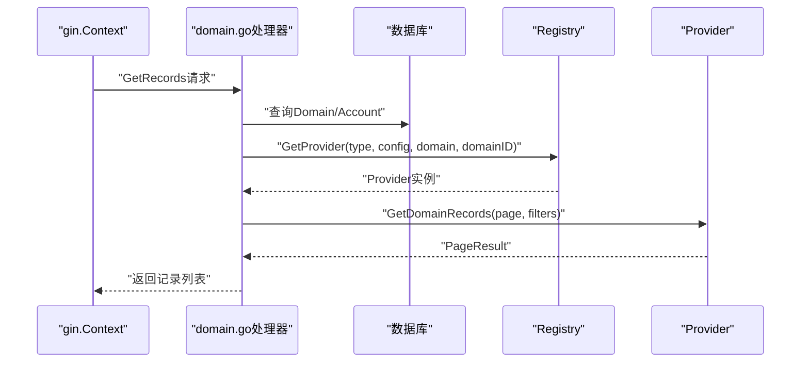
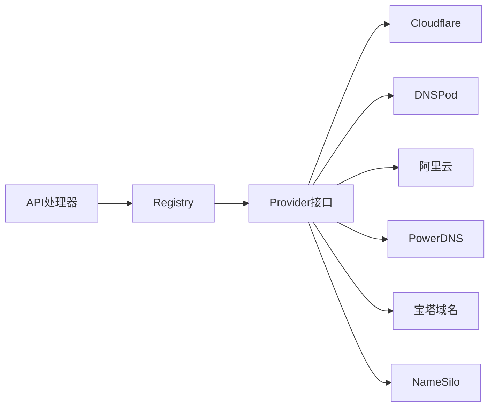

# DNS服务商扩展

<cite>
**本文档引用的文件**
- [interface.go](file://main/internal/dns/interface.go)
- [registry.go](file://main/internal/dns/registry.go)
- [cloudflare.go](file://main/internal/dns/providers/cloudflare/cloudflare.go)
- [dnspod.go](file://main/internal/dns/providers/dnspod/dnspod.go)
- [aliyun.go](file://main/internal/dns/providers/aliyun/aliyun.go)
- [powerdns.go](file://main/internal/dns/providers/powerdns/powerdns.go)
- [bt.go](file://main/internal/dns/providers/bt/bt.go)
- [namesilo.go](file://main/internal/dns/providers/namesilo/namesilo.go)
- [domain.go](file://main/internal/api/handler/domain.go)
- [batch.go](file://main/internal/api/handler/batch.go)
</cite>

## 目录
1. [简介](#简介)
2. [项目结构](#项目结构)
3. [核心组件](#核心组件)
4. [架构总览](#架构总览)
5. [详细组件分析](#详细组件分析)
6. [依赖分析](#依赖分析)
7. [性能考虑](#性能考虑)
8. [故障排查指南](#故障排查指南)
9. [结论](#结论)
10. [附录](#附录)

## 简介
本指南面向希望为系统新增DNS服务商适配的开发者，系统性阐述Provider接口设计、实现规范、工厂注册流程、默认线路映射与自定义线路支持、错误处理与重试策略、以及测试与调试方法。文档以仓库中的Provider接口与多个真实适配器为依据，提供从接口到注册的完整实践路径。

## 项目结构
DNS扩展位于 main/internal/dns 目录，采用“接口 + 工厂 + 多适配器”的分层组织方式：
- 接口与数据模型：定义Provider接口、记录与线路模型、分页结果、配置与特性声明
- 工厂与注册：提供Register/GetProvider/GetProviderConfig等工厂与注册能力
- 适配器：各云厂商/服务的实现，均在 main/internal/dns/providers 下按厂商目录组织
- API处理器：对接前端调用，统一加载账户配置并创建Provider实例，封装分页与权限控制

图表来源
- [interface.go:40-86](file://main/internal/dns/interface.go#L40-L86)
- [registry.go:17-45](file://main/internal/dns/registry.go#L17-L45)
- [cloudflare.go:17-30](file://main/internal/dns/providers/cloudflare/cloudflare.go#L17-L30)
- [dnspod.go:14-27](file://main/internal/dns/providers/dnspod/dnspod.go#L14-L27)
- [aliyun.go:14-27](file://main/internal/dns/providers/aliyun/aliyun.go#L14-L27)
- [powerdns.go:17-35](file://main/internal/dns/providers/powerdns/powerdns.go#L17-L35)
- [bt.go:19-37](file://main/internal/dns/providers/bt/bt.go#L19-L37)
- [namesilo.go:16-33](file://main/internal/dns/providers/namesilo/namesilo.go#L16-L33)
- [domain.go:26-43](file://main/internal/api/handler/domain.go#L26-L43)
- [batch.go:47-83](file://main/internal/api/handler/batch.go#L47-L83)

章节来源
- [interface.go:1-125](file://main/internal/dns/interface.go#L1-L125)
- [registry.go:1-65](file://main/internal/dns/registry.go#L1-L65)

## 核心组件
- Provider接口：统一抽象各DNS服务商的域名与记录管理能力，覆盖查询、增删改、状态控制、日志、线路、最小TTL、域名添加等
- 数据模型：Record、DomainInfo、RecordLine、PageResult用于跨适配器的数据交换
- ProviderConfig/ConfigField/ConfigOption/ProviderFeatures：用于声明适配器的配置项、UI呈现与特性开关
- 工厂与注册：Register/GetProvider/GetProviderConfig提供线程安全的注册与获取能力，并内置默认线路映射

章节来源
- [interface.go:5-125](file://main/internal/dns/interface.go#L5-L125)
- [registry.go:8-65](file://main/internal/dns/registry.go#L8-L65)

## 架构总览
API处理器通过账户模型加载配置，调用GetProvider创建具体Provider实例，再委托Provider完成实际的DNS操作。Provider内部负责API认证、请求构造、响应解析、错误码映射与特性适配。

图表来源
- [domain.go:26-43](file://main/internal/api/handler/domain.go#L26-L43)
- [registry.go:25-37](file://main/internal/dns/registry.go#L25-L37)
- [cloudflare.go:138-181](file://main/internal/dns/providers/cloudflare/cloudflare.go#L138-L181)

章节来源
- [domain.go:548-728](file://main/internal/api/handler/domain.go#L548-L728)
- [batch.go:47-156](file://main/internal/api/handler/batch.go#L47-L156)

## 详细组件分析

### Provider接口方法详解
- 基础能力
  - GetError：返回最近一次错误信息，便于前端展示
  - Check：校验账户配置可用性
  - GetMinTTL：返回该服务商支持的最小TTL
  - AddDomain：在服务商侧添加域名（部分适配器不支持）
- 域名管理
  - GetDomainList：分页列出域名，支持关键词过滤
  - GetDomainRecordInfo：获取单条记录详情（部分适配器不支持）
  - GetDomainRecordLog：获取记录变更日志（部分适配器不支持）
- 记录管理
  - GetDomainRecords：分页列出记录，支持子域名、类型、线路、状态、关键字过滤
  - GetSubDomainRecords：按子域名精确查询
  - AddDomainRecord/UpdateDomainRecord/DeleteDomainRecord/SetDomainRecordStatus：记录的增删改与启停
  - UpdateDomainRecordRemark：更新备注（部分适配器不支持）
- 线路与特性
  - GetRecordLine：返回该域名支持的线路集合
  - ProviderFeatures：声明适配器特性（备注、状态、转发、日志、权重、分页、添加域名）

章节来源
- [interface.go:40-86](file://main/internal/dns/interface.go#L40-L86)

### Provider工厂与注册流程
- 工厂函数类型：ProviderFactory
- 注册：init()中调用Register(name, NewProvider, ProviderConfig)，将适配器注册到全局表
- 获取：GetProvider(name, config, domain, domainID)根据名称与配置创建实例
- 配置查询：GetProviderConfig/GetAllProviderConfigs用于UI渲染与特性判断

图表来源
- [registry.go:17-37](file://main/internal/dns/registry.go#L17-L37)
- [cloudflare.go:17-30](file://main/internal/dns/providers/cloudflare/cloudflare.go#L17-L30)
- [dnspod.go:14-27](file://main/internal/dns/providers/dnspod/dnspod.go#L14-L27)
- [aliyun.go:14-27](file://main/internal/dns/providers/aliyun/aliyun.go#L14-L27)

章节来源
- [registry.go:17-65](file://main/internal/dns/registry.go#L17-L65)

### 默认线路映射与自定义线路
- 默认映射：registry.go内置常见适配器的默认线路ID映射，如aliyun、dnspod、huawei、cloudflare
- 自定义线路：适配器需实现GetRecordLine返回其支持的线路集合；API层在展示时将ID映射为名称
- 线路ID约定：适配器内部自行约定ID，但对外应保证与GetRecordLine返回一致

图表来源
- [registry.go:58-65](file://main/internal/dns/registry.go#L58-L65)
- [cloudflare.go:429-434](file://main/internal/dns/providers/cloudflare/cloudflare.go#L429-L434)
- [dnspod.go:289-308](file://main/internal/dns/providers/dnspod/dnspod.go#L289-L308)
- [aliyun.go:314-332](file://main/internal/dns/providers/aliyun/aliyun.go#L314-L332)

章节来源
- [registry.go:58-65](file://main/internal/dns/registry.go#L58-L65)

### 错误处理与重试机制
- 错误来源
  - 网络/超时：HTTP客户端超时、读取响应失败
  - 业务错误：服务商返回错误码或消息，适配器解析后保存至lastErr
  - 参数错误：非法状态、无效记录ID、不支持的操作
- 典型处理
  - Cloudflare：解析success字段与errors数组，设置lastErr并返回
  - PowerDNS：HTTP状态>=400时解析错误消息，设置lastErr
  - Namesilo：解析reply.code，非300时视为错误
- 重试建议
  - 对幂等操作（查询类）可在上层进行有限次数重试
  - 对非幂等操作（变更类）谨慎重试，必要时结合幂等键与去重逻辑
  - 结合context.WithTimeout控制整体耗时

章节来源
- [cloudflare.go:121-136](file://main/internal/dns/providers/cloudflare/cloudflare.go#L121-L136)
- [powerdns.go:118-129](file://main/internal/dns/providers/powerdns/powerdns.go#L118-L129)
- [namesilo.go:91-107](file://main/internal/dns/providers/namesilo/namesilo.go#L91-L107)

### API处理器与Provider交互
- 统一加载：getProviderByDomain从数据库加载账户，反序列化配置，调用GetProvider创建Provider
- 权限与分页：API层负责权限校验、子域名权限合并、分页与本地筛选
- 特性适配：根据Provider.Features决定UI与行为（如是否支持备注、权重、日志）

图表来源
- [domain.go:26-43](file://main/internal/api/handler/domain.go#L26-L43)
- [domain.go:548-728](file://main/internal/api/handler/domain.go#L548-L728)

章节来源
- [domain.go:26-43](file://main/internal/api/handler/domain.go#L26-L43)
- [domain.go:548-728](file://main/internal/api/handler/domain.go#L548-L728)

### 批量操作与异步执行
- 批量添加：支持文本与结构化两种输入，自动识别A/AAAA/CNAME，异步执行并记录审计
- 批量编辑：异步修改TTL/线路等属性
- 批量动作：异步启用/暂停/删除记录
- 超时保护：统一120秒超时，防止长时间阻塞

章节来源
- [batch.go:47-156](file://main/internal/api/handler/batch.go#L47-L156)
- [batch.go:173-264](file://main/internal/api/handler/batch.go#L173-L264)
- [batch.go:266-366](file://main/internal/api/handler/batch.go#L266-L366)

### 适配器实现要点（以典型为例）
- Cloudflare
  - 认证：支持Global API Key与Token两种头部
  - 线路：通过proxied字段表示“已代理/仅DNS”
  - 日志：不支持
- 腾讯云DNSPod
  - SDK：使用官方SDK发起Describe/Create/Modify/Delete等请求
  - 线路：通过RecordLine字段传递，支持权重与备注
  - 日志：注释掉未实现
- 阿里云
  - SDK：使用alidns SDK
  - 线路：通过Line字段传递，支持备注与日志
- PowerDNS
  - HTTP API：基于API v1，支持缓存与客户端侧过滤
  - 线路：默认线路
  - 日志：不支持
- 宝塔域名
  - 自定义签名：HMAC-SHA256签名，带时间戳
  - 线路：通过viewID映射
  - 日志：不支持
- NameSilo
  - HTTP API：GET请求，解析reply.code
  - 线路：默认线路
  - 日志/备注：不支持

章节来源
- [cloudflare.go:57-136](file://main/internal/dns/providers/cloudflare/cloudflare.go#L57-L136)
- [dnspod.go:55-86](file://main/internal/dns/providers/dnspod/dnspod.go#L55-L86)
- [aliyun.go:55-90](file://main/internal/dns/providers/aliyun/aliyun.go#L55-L90)
- [powerdns.go:88-140](file://main/internal/dns/providers/powerdns/powerdns.go#L88-L140)
- [bt.go:81-138](file://main/internal/dns/providers/bt/bt.go#L81-L138)
- [namesilo.go:58-107](file://main/internal/dns/providers/namesilo/namesilo.go#L58-L107)

## 依赖分析
- 低耦合：API处理器仅依赖Registry与Provider接口，不关心具体实现
- 可扩展：新增适配器只需实现Provider接口并通过Register注册
- 并发安全：Registry内部使用读写锁保护注册表

图表来源
- [registry.go:25-37](file://main/internal/dns/registry.go#L25-L37)
- [cloudflare.go:17-30](file://main/internal/dns/providers/cloudflare/cloudflare.go#L17-L30)
- [dnspod.go:14-27](file://main/internal/dns/providers/dnspod/dnspod.go#L14-L27)
- [aliyun.go:14-27](file://main/internal/dns/providers/aliyun/aliyun.go#L14-L27)
- [powerdns.go:17-35](file://main/internal/dns/providers/powerdns/powerdns.go#L17-L35)
- [bt.go:19-37](file://main/internal/dns/providers/bt/bt.go#L19-L37)
- [namesilo.go:16-33](file://main/internal/dns/providers/namesilo/namesilo.go#L16-L33)

章节来源
- [registry.go:11-15](file://main/internal/dns/registry.go#L11-L15)

## 性能考虑
- 分页策略
  - 服务商分页：优先使用适配器支持的分页（如Cloudflare/DNSPod/阿里云），减少网络往返
  - 客户端分页：当适配器不支持时，PowerDNS等在内存中过滤与分页，注意大数据集的内存占用
- 缓存
  - PowerDNS实现RRSet缓存，变更后主动失效，降低重复查询成本
- 超时与并发
  - API层为每个请求设置context.WithTimeout，避免阻塞
  - 批量操作异步执行，避免阻塞主请求线程

章节来源
- [powerdns.go:170-247](file://main/internal/dns/providers/powerdns/powerdns.go#L170-L247)
- [domain.go:548-728](file://main/internal/api/handler/domain.go#L548-L728)
- [batch.go:97-156](file://main/internal/api/handler/batch.go#L97-L156)

## 故障排查指南
- 常见错误定位
  - lastErr：适配器内部将服务商错误消息保存到lastErr，可通过Provider.GetError获取
  - HTTP错误：检查请求URL、头部、鉴权参数与响应体
  - 鉴权失败：确认API Key/Token/AccessKey/SecretKey是否正确
- 调试技巧
  - 在适配器request/SDK调用处打印关键参数与响应摘要
  - 使用较短page/pageSize快速验证分页逻辑
  - 对比GetRecordLine返回的ID与API实际使用的值
- 常见问题
  - 不支持的操作：如某些适配器不支持日志/备注/权重，需在UI层根据Features隐藏相关入口
  - 状态转换：前端传入的“1/0/enable/disable”需转换为适配器期望的“ENABLE/DISABLE”，API层已做归一化

章节来源
- [cloudflare.go:53-55](file://main/internal/dns/providers/cloudflare/cloudflare.go#L53-L55)
- [powerdns.go:118-129](file://main/internal/dns/providers/powerdns/powerdns.go#L118-L129)
- [domain.go:45-65](file://main/internal/api/handler/domain.go#L45-L65)

## 结论
通过Provider接口与工厂注册机制，系统实现了对多家DNS服务商的统一抽象与扩展。开发者只需遵循接口规范、正确处理鉴权与错误、实现必要的特性与线路支持，并在init中完成注册，即可无缝接入新适配器。配合API层的权限、分页与批量能力，可满足生产环境的多样化需求。

## 附录

### 实现新适配器的步骤清单
- 定义适配器结构体，包含认证信息、HTTP客户端、lastErr等
- 实现Provider接口的所有方法（至少实现基础查询与增删改）
- 在init中调用Register，提供名称、NewProvider工厂与ProviderConfig
- 在GetRecordLine中返回该域名支持的线路集合
- 在Check中实现账户连通性校验
- 在API层根据Features控制UI与行为

章节来源
- [registry.go:17-30](file://main/internal/dns/registry.go#L17-L30)
- [cloudflare.go:17-30](file://main/internal/dns/providers/cloudflare/cloudflare.go#L17-L30)
- [dnspod.go:14-27](file://main/internal/dns/providers/dnspod/dnspod.go#L14-L27)
- [aliyun.go:14-27](file://main/internal/dns/providers/aliyun/aliyun.go#L14-L27)

### Provider接口方法速查
- 基础：GetError, Check, GetMinTTL, AddDomain
- 域名：GetDomainList
- 记录：GetDomainRecords, GetSubDomainRecords, GetDomainRecordInfo, AddDomainRecord, UpdateDomainRecord, UpdateDomainRecordRemark, DeleteDomainRecord, SetDomainRecordStatus, GetDomainRecordLog
- 线路：GetRecordLine

章节来源
- [interface.go:40-86](file://main/internal/dns/interface.go#L40-L86)