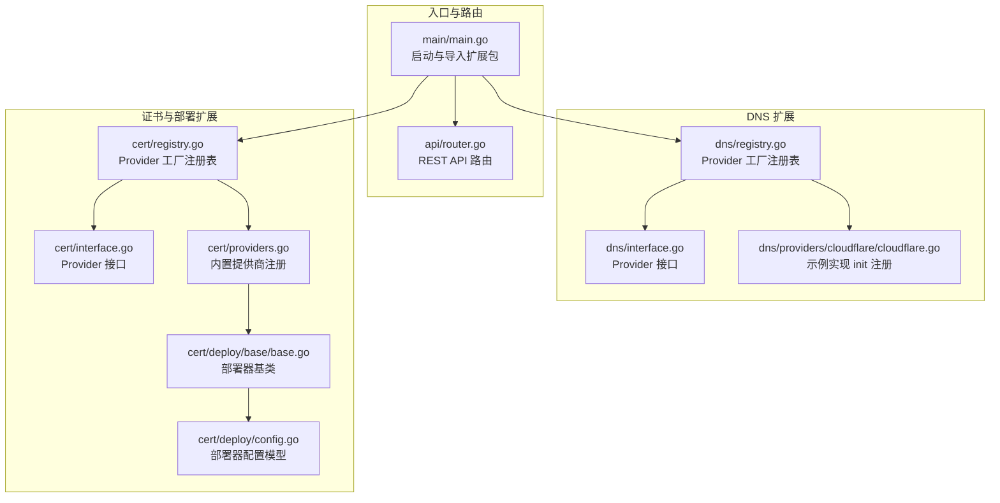
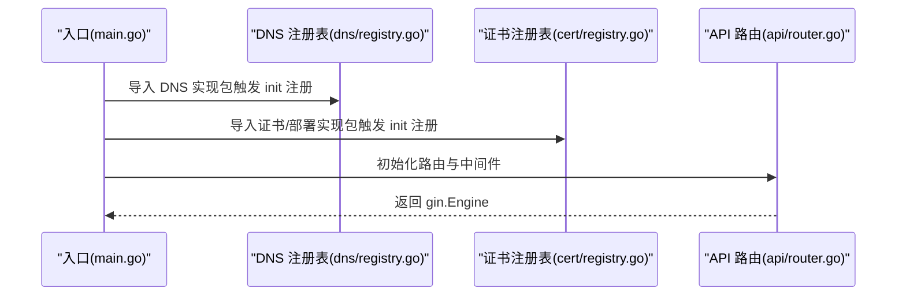
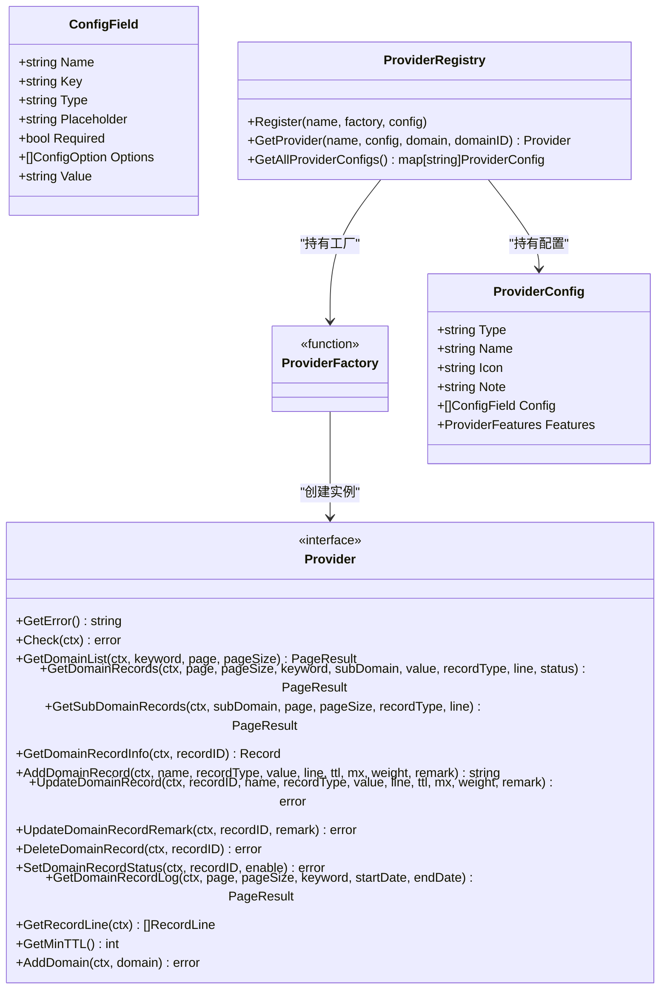
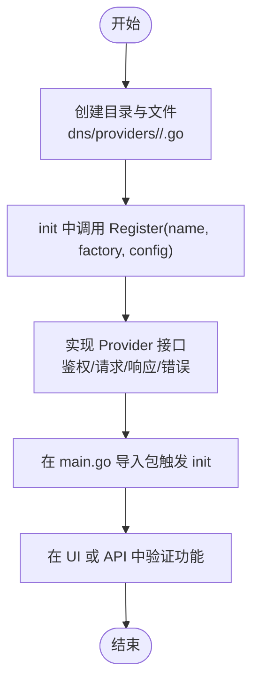
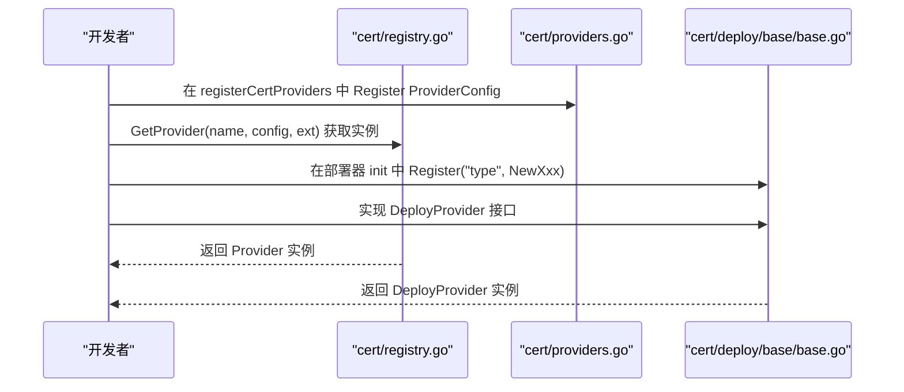
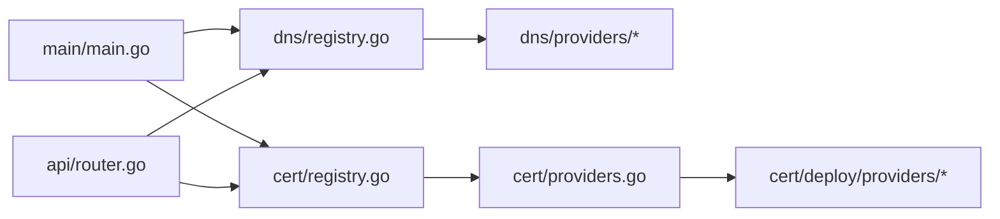

# 扩展开发

<cite>
**本文引用的文件**
- [main.go](file://main/main.go)
- [router.go](file://main/internal/api/router.go)
- [interface.go](file://main/internal/dns/interface.go)
- [registry.go](file://main/internal/dns/registry.go)
- [cloudflare.go](file://main/internal/dns/providers/cloudflare/cloudflare.go)
- [interface.go](file://main/internal/cert/interface.go)
- [registry.go](file://main/internal/cert/registry.go)
- [providers.go](file://main/internal/cert/providers.go)
- [base.go](file://main/internal/cert/deploy/base/base.go)
- [config.go](file://main/internal/cert/deploy/config.go)
- [config.go](file://main/internal/config/config.go)
</cite>

## 目录
1. [简介](#简介)
2. [项目结构](#项目结构)
3. [核心组件](#核心组件)
4. [架构总览](#架构总览)
5. [详细组件分析](#详细组件分析)
6. [依赖分析](#依赖分析)
7. [性能考量](#性能考量)
8. [故障排查指南](#故障排查指南)
9. [结论](#结论)
10. [附录](#附录)

## 简介
本指南面向希望为 DNSPlane 开发扩展的工程师，系统讲解插件系统的架构设计与扩展机制，涵盖以下主题：
- DNS 服务商扩展：接口规范、实现模式与注册流程
- 证书提供商与部署器扩展：接口与工厂注册、配置模型
- 插件生命周期与依赖注入：init 注册、运行时获取、并发安全
- 扩展开发最佳实践与安全考虑
- 测试方法与验证流程
- 版本管理与兼容性保障

## 项目结构
DNSPlane 的扩展能力主要集中在两个领域：
- DNS 服务商：统一抽象接口与注册表，按需导入实现
- 证书与部署：证书提供商与部署器均采用接口+工厂+注册表的模式，并提供基类简化实现



图表来源
- [main.go:1-148](file://main/main.go#L1-L148)
- [router.go:1-275](file://main/internal/api/router.go#L1-L275)
- [interface.go:1-125](file://main/internal/dns/interface.go#L1-L125)
- [registry.go:1-65](file://main/internal/dns/registry.go#L1-L65)
- [cloudflare.go:1-445](file://main/internal/dns/providers/cloudflare/cloudflare.go#L1-L445)
- [interface.go:1-114](file://main/internal/cert/interface.go#L1-L114)
- [registry.go:1-108](file://main/internal/cert/registry.go#L1-L108)
- [providers.go:1-666](file://main/internal/cert/providers.go#L1-L666)
- [base.go:1-258](file://main/internal/cert/deploy/base/base.go#L1-L258)
- [config.go:1-50](file://main/internal/cert/deploy/config.go#L1-L50)

章节来源
- [main.go:1-148](file://main/main.go#L1-L148)
- [router.go:1-275](file://main/internal/api/router.go#L1-L275)

## 核心组件
- DNS 服务商接口与注册表
  - Provider 接口定义了账户校验、域名与记录 CRUD、线路、TTL、日志等能力
  - ProviderConfig 定义了 UI 配置字段、特性开关、图标与说明
  - Registry 提供 Register/GetProvider/GetAllProviderConfigs 等工厂注册与查询能力
- 证书提供商接口与注册表
  - Provider 接口定义了账户注册、订单创建/验证/签发、吊销/取消、日志等能力
  - ProviderConfig 支持区分“证书申请”和“证书部署”的配置项
  - Registry 提供注册、查询、快照（仅构建一次）等能力
- 部署器基类与配置
  - BaseProvider 提供配置读取、日志、域名解析等通用能力
  - DeployProvider 接口定义 Check/Deploy/SetLogger
  - 部署器配置模型支持分类、输入项与任务输入项

章节来源
- [interface.go:40-125](file://main/internal/dns/interface.go#L40-L125)
- [registry.go:17-65](file://main/internal/dns/registry.go#L17-L65)
- [interface.go:49-114](file://main/internal/cert/interface.go#L49-L114)
- [registry.go:22-108](file://main/internal/cert/registry.go#L22-L108)
- [base.go:43-258](file://main/internal/cert/deploy/base/base.go#L43-L258)
- [config.go:19-50](file://main/internal/cert/deploy/config.go#L19-L50)

## 架构总览
DNSPlane 通过在入口处导入扩展包触发 init 注册，运行时通过注册表按名称获取具体实现。API 层通过路由暴露扩展能力，前端通过管理接口读取注册表快照。



图表来源
- [main.go:25-44](file://main/main.go#L25-L44)
- [registry.go:17-37](file://main/internal/dns/registry.go#L17-L37)
- [registry.go:22-42](file://main/internal/cert/registry.go#L22-L42)
- [router.go:14-162](file://main/internal/api/router.go#L14-L162)

## 详细组件分析

### DNS 服务商扩展
- 接口与数据模型
  - Provider 接口覆盖账户校验、域名列表、记录查询/增删改、状态切换、线路、最小 TTL、添加域名等
  - ProviderConfig/ConfigField/ProviderFeatures 定义 UI 配置与特性开关
- 注册与获取
  - 在实现包的 init 中调用 Register(name, factory, config) 完成注册
  - 运行时通过 GetProvider(name, config, domain, domainID) 获取实例
- 示例：Cloudflare 实现
  - init 中注册 ProviderConfig 与工厂
  - 实现 Provider 接口，封装 HTTP 请求、错误处理与数据转换



图表来源
- [interface.go:40-125](file://main/internal/dns/interface.go#L40-L125)
- [registry.go:17-65](file://main/internal/dns/registry.go#L17-L65)

章节来源
- [interface.go:40-125](file://main/internal/dns/interface.go#L40-L125)
- [registry.go:17-65](file://main/internal/dns/registry.go#L17-L65)
- [cloudflare.go:17-30](file://main/internal/dns/providers/cloudflare/cloudflare.go#L17-L30)

### 证书提供商与部署器扩展
- 证书提供商
  - Provider 接口：账户注册、购买/创建订单、验证、状态查询、签发、吊销、取消、日志
  - ProviderConfig：区分证书申请与部署配置，支持 CNAME 代理标记
  - 注册表：注册、查询、证书/部署两类配置快照
- 部署器
  - DeployProvider 接口：Check/Deploy/SetLogger
  - BaseProvider：统一配置读取、日志、域名解析、大小写/下划线键兼容
  - 部署器配置模型：分类、输入项、任务输入项与说明

```mermaid
classDiagram
class CertProvider {
<<interface>>
+Register(ctx) map
+BuyCert(ctx, domains, order) error
+CreateOrder(ctx, domains, order, keyType, keySize) map
+AuthOrder(ctx, domains, order) error
+GetAuthStatus(ctx, domains, order) bool
+FinalizeOrder(ctx, domains, order, keyType, keySize) CertResult
+Revoke(ctx, order, pem) error
+Cancel(ctx, order) error
+SetLogger(logger)
}
class CertProviderConfig {
+string Type
+string Name
+string Icon
+string Note
+[]ConfigField Config
+[]ConfigField DeployConfig
+string DeployNote
+bool CNAME
+bool IsDeploy
}
class CertRegistry {
+Register(name, factory, config)
+GetProvider(name, config, ext) Provider
+GetAllProviderConfigs() map
+GetCertProviderConfigs() map
+GetDeployProviderConfigs() map
+APIProvidersSnapshot() (cert, deploy)
}
class DeployProvider {
<<interface>>
+Check(ctx) error
+Deploy(ctx, fullchain, privateKey, config) error
+SetLogger(logger)
}
class BaseProvider {
+map~string,interface{}~ Config
+SetLogger(logger)
+Log(msg)
+GetString(key) string
+GetInt(key, default) int
+Check(ctx) error
+... 域名解析与配置读取工具 ...
}
CertRegistry --> CertProviderConfig : "持有配置"
CertRegistry --> CertProvider : "创建实例"
BaseProvider ..|> DeployProvider : "实现"
```

图表来源
- [interface.go:49-114](file://main/internal/cert/interface.go#L49-L114)
- [registry.go:22-108](file://main/internal/cert/registry.go#L22-L108)
- [base.go:43-258](file://main/internal/cert/deploy/base/base.go#L43-L258)

章节来源
- [interface.go:49-114](file://main/internal/cert/interface.go#L49-L114)
- [registry.go:22-108](file://main/internal/cert/registry.go#L22-L108)
- [providers.go:3-112](file://main/internal/cert/providers.go#L3-L112)
- [base.go:43-258](file://main/internal/cert/deploy/base/base.go#L43-L258)
- [config.go:19-50](file://main/internal/cert/deploy/config.go#L19-L50)

### 扩展开发流程（新增 DNS 服务商）
- 步骤
  - 新建目录 main/internal/dns/providers/<your_provider>/<your_provider>.go
  - 在 init 中调用 dns.Register("your_type", NewProvider, ProviderConfig)
  - 实现 Provider 接口，处理鉴权、请求、响应与错误
  - 在 main/main.go 中导入该包（或通过构建脚本统一导入），确保 init 触发
- 关键点
  - ProviderConfig 的 Features 与 Config 字段决定 UI 行为与输入项
  - 错误通过 GetError 统一上报
  - 若需要默认线路映射，可在 registry 中补充映射表



图表来源
- [cloudflare.go:17-30](file://main/internal/dns/providers/cloudflare/cloudflare.go#L17-L30)
- [registry.go:17-37](file://main/internal/dns/registry.go#L17-L37)
- [main.go:25-44](file://main/main.go#L25-L44)

章节来源
- [cloudflare.go:17-30](file://main/internal/dns/providers/cloudflare/cloudflare.go#L17-L30)
- [registry.go:17-37](file://main/internal/dns/registry.go#L17-L37)
- [main.go:25-44](file://main/main.go#L25-L44)

### 扩展开发流程（新增证书提供商/部署器）
- 证书提供商
  - 在 cert/providers.go 的 registerCertProviders 中调用 Register 注册 ProviderConfig
  - 如需 SDK，可在实现文件中引入第三方库并在 Check/创建订单等步骤使用
- 部署器
  - 在 cert/deploy/providers 下新增实现文件，在 init 中调用 base.Register("your_deploy_type", NewXxxProvider)
  - 实现 DeployProvider 接口，使用 BaseProvider 的配置读取与日志能力
  - 在 cert/deploy/config.go 中注册部署器配置（可选）



图表来源
- [providers.go:3-112](file://main/internal/cert/providers.go#L3-L112)
- [registry.go:22-42](file://main/internal/cert/registry.go#L22-L42)
- [base.go:63-84](file://main/internal/cert/deploy/base/base.go#L63-L84)

章节来源
- [providers.go:3-112](file://main/internal/cert/providers.go#L3-L112)
- [registry.go:22-42](file://main/internal/cert/registry.go#L22-L42)
- [base.go:63-84](file://main/internal/cert/deploy/base/base.go#L63-L84)

## 依赖分析
- 入口依赖
  - main/main.go 导入 API、缓存、验证码、数据库、监控、服务等模块
  - 通过导入 DNS/证书实现包触发 init 注册
- 注册表并发安全
  - 使用互斥锁保护注册表读写，Get* 系列方法使用读锁
- API 路由与扩展暴露
  - /api/dns/providers 与 /api/cert/providers 暴露扩展配置快照
  - 管理端可读取注册表快照，避免运行时重复构建



图表来源
- [main.go:25-44](file://main/main.go#L25-L44)
- [router.go:122-124](file://main/internal/api/router.go#L122-L124)
- [registry.go:17-65](file://main/internal/dns/registry.go#L17-L65)
- [registry.go:22-108](file://main/internal/cert/registry.go#L22-L108)

章节来源
- [main.go:25-44](file://main/main.go#L25-L44)
- [router.go:122-124](file://main/internal/api/router.go#L122-L124)
- [registry.go:17-65](file://main/internal/dns/registry.go#L17-L65)
- [registry.go:22-108](file://main/internal/cert/registry.go#L22-L108)

## 性能考量
- 并发安全
  - 注册表使用读写锁，查询路径使用读锁，降低竞争
- 快照构建
  - 证书注册表对 API 输出进行一次性快照，避免每次请求重复构建
- 网络请求
  - DNS/证书/部署器实现应设置合理超时与错误处理，避免阻塞
- 缓存与日志
  - 建议在扩展层复用全局日志与缓存能力，减少重复初始化

## 故障排查指南
- 常见问题
  - 无法找到 Provider：确认导入包已生效，init 是否被调用，名称是否正确
  - 配置读取异常：检查大小写/下划线键兼容逻辑，必要时使用 GetStringFrom 回退
  - 部署失败：核对部署器 Check 逻辑与目标系统权限
- 建议流程
  - 通过 /api/dns/providers 与 /api/cert/providers 校验注册表
  - 使用 Provider.Check 或 DeployProvider.Check 快速验证配置
  - 查看日志输出定位网络/鉴权问题

章节来源
- [registry.go:25-45](file://main/internal/dns/registry.go#L25-L45)
- [registry.go:30-61](file://main/internal/cert/registry.go#L30-L61)
- [base.go:116-174](file://main/internal/cert/deploy/base/base.go#L116-L174)

## 结论
DNSPlane 的扩展体系以接口+工厂+注册表为核心，结合 init 注册与运行时获取，实现了高内聚、低耦合的插件化架构。通过统一的数据模型与配置结构，开发者可以快速实现新的 DNS 服务商、证书提供商与部署器，并通过 API 与 UI 无缝接入。

## 附录

### 扩展开发最佳实践
- 接口实现
  - 严格遵循 Provider/DeployProvider 接口，保持幂等与可重试
  - 对外错误通过 GetError 统一返回，便于前端展示
- 配置设计
  - ProviderConfig 的 Config/DeployConfig 应清晰标注必填与可选项
  - 使用 Features/IsDeploy 明确能力边界
- 并发与安全
  - 使用注册表提供的并发安全访问
  - 避免在扩展中直接暴露敏感信息，使用配置读取工具
- 日志与可观测性
  - 使用 SetLogger 与 BaseProvider.Log 记录关键步骤
  - 对网络请求与错误进行分级日志

### 安全考虑与沙箱隔离
- 配置隔离
  - 通过 Provider/DeployProvider 的配置参数传递，避免全局状态
- 认证与授权
  - 在 Check 中验证凭据有效性，避免在非校验场景泄露凭据
- 外部依赖
  - 第三方 SDK 的调用应在受控范围内，避免执行任意命令或写入任意路径
- 网络访问
  - 设置合理的超时与重试策略，避免被恶意请求拖垮

### 测试方法与验证流程
- 单元测试
  - 对关键函数（如配置读取、域名解析）编写单元测试
- 集成测试
  - 使用真实或模拟的第三方 API 进行集成测试
- 端到端测试
  - 通过 /api/dns/providers 与 /api/cert/providers 校验扩展注册
  - 在 UI 中完成配置与操作，观察日志与结果

### 版本管理与兼容性保证
- 接口稳定性
  - 保持 Provider/Provider 接口稳定，新增能力通过 Features/Config 扩展
- 注册表快照
  - 证书注册表对 API 输出做一次性快照，避免运行时变更影响管理接口
- 配置兼容
  - 对历史配置字段提供兼容读取（如大小写/下划线键），避免破坏升级