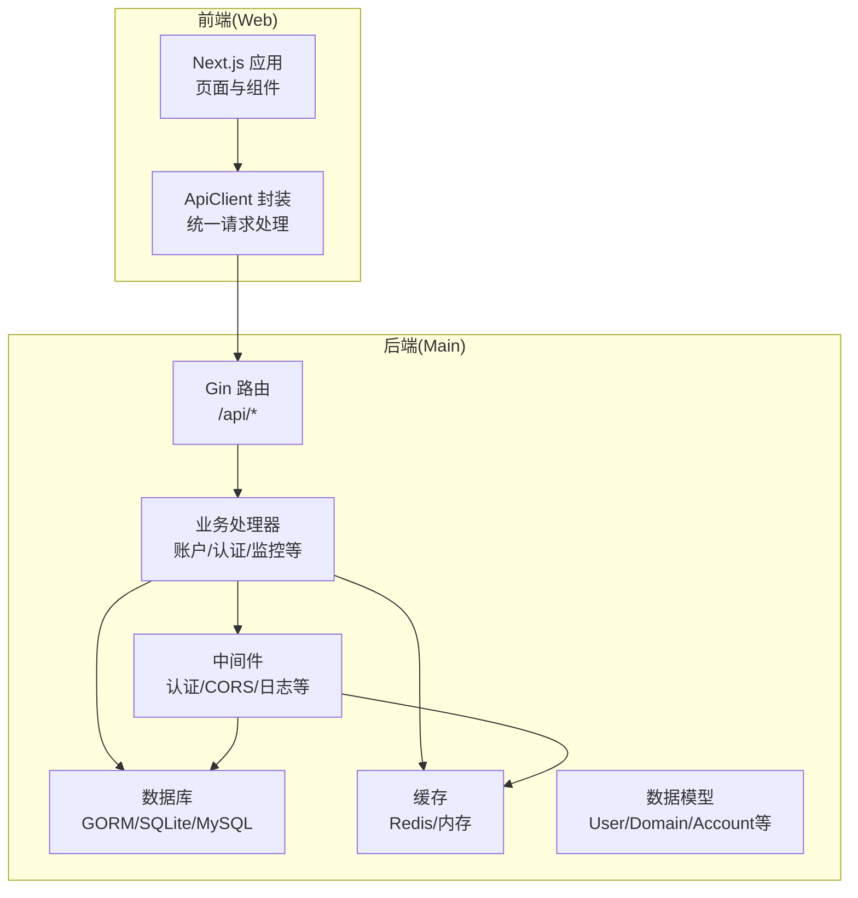
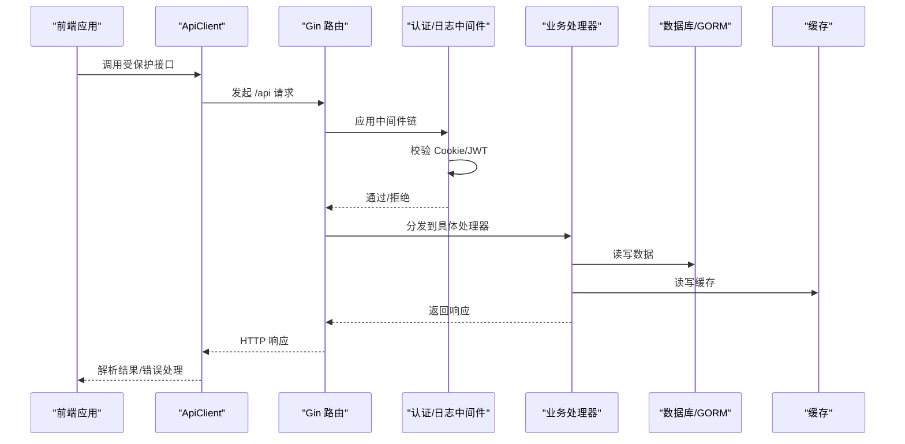
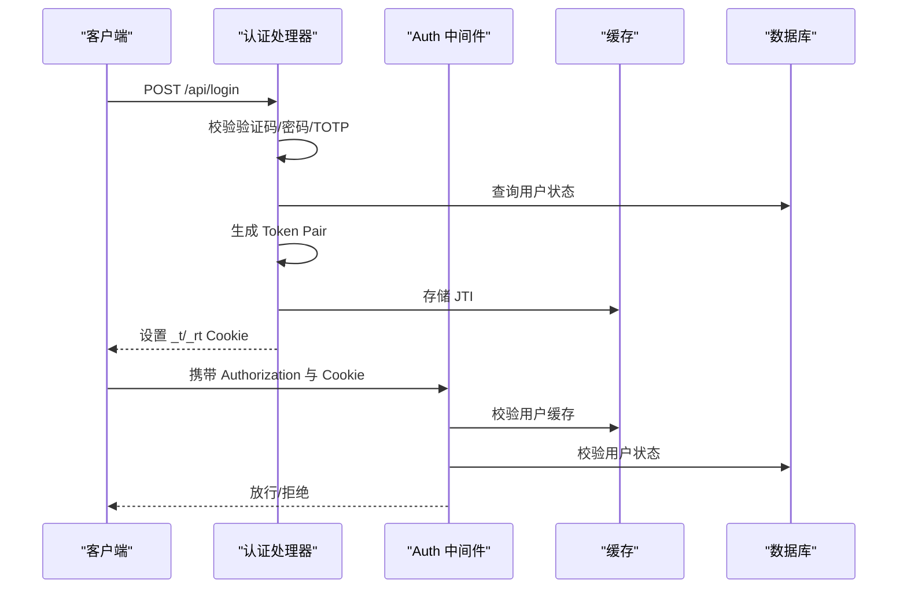
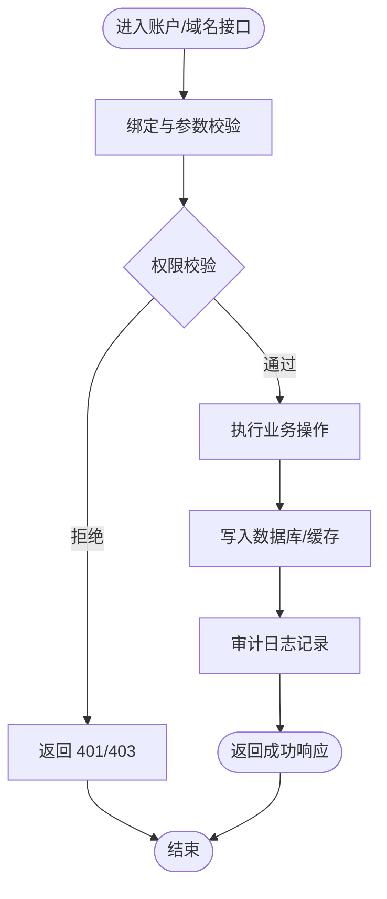
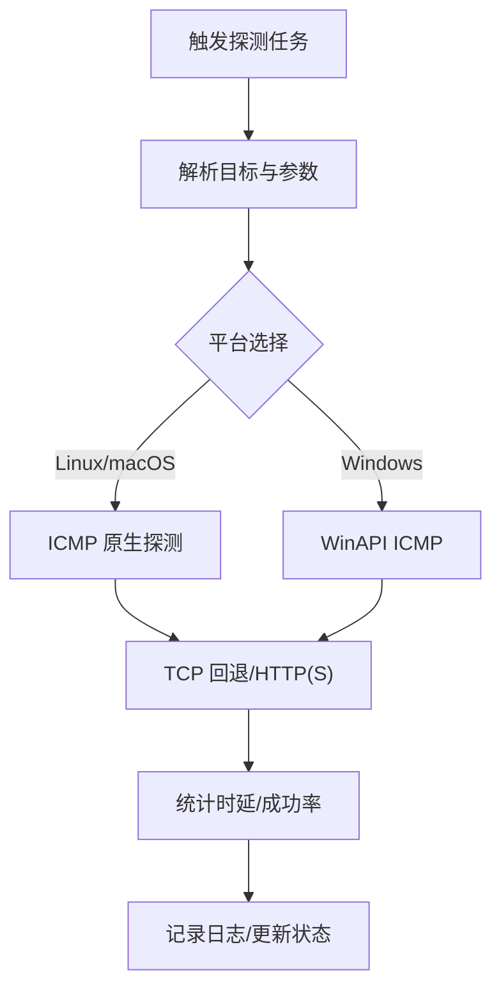
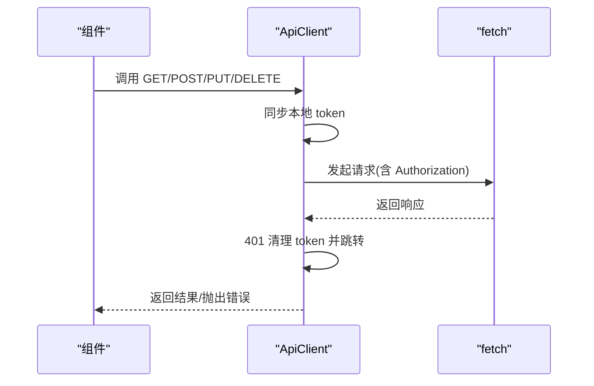
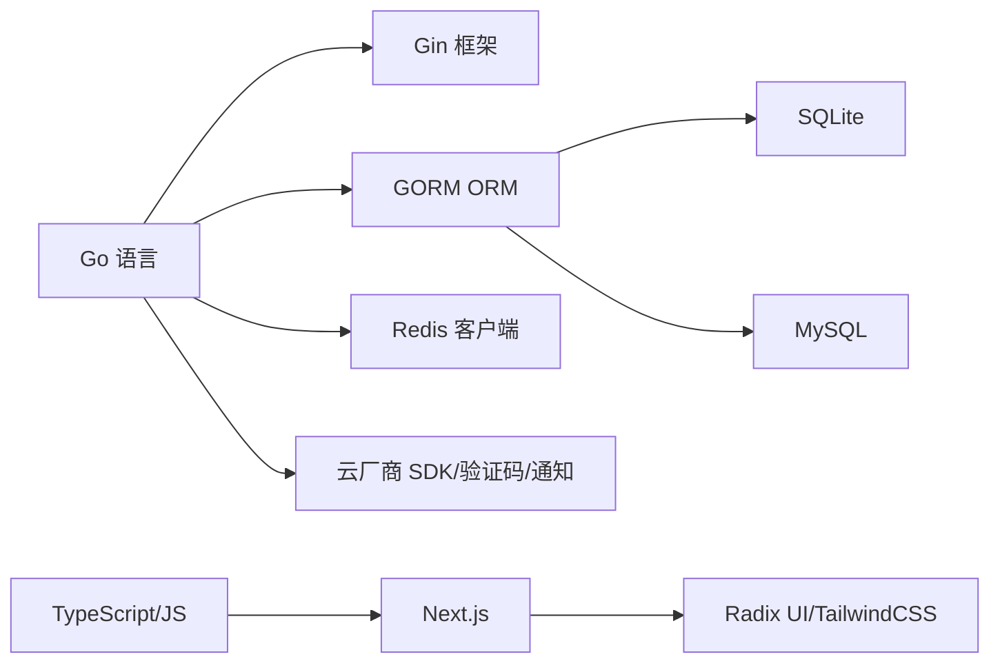

# 扩展测试与验证

<cite>
**本文档引用的文件**
- [main/go.mod](file://main/go.mod)
- [main/internal/api/router.go](file://main/internal/api/router.go)
- [main/internal/api/handler/account.go](file://main/internal/api/handler/account.go)
- [main/internal/api/handler/auth.go](file://main/internal/api/handler/auth.go)
- [main/internal/api/middleware/auth.go](file://main/internal/api/middleware/auth.go)
- [main/internal/database/database.go](file://main/internal/database/database.go)
- [main/internal/models/models.go](file://main/internal/models/models.go)
- [main/internal/config/config.go](file://main/internal/config/config.go)
- [main/internal/cache/cache.go](file://main/internal/cache/cache.go)
- [main/internal/monitor/check.go](file://main/internal/monitor/check.go)
- [main/internal/monitor/check_ping_windows.go](file://main/internal/monitor/check_ping_windows.go)
- [web/lib/api.ts](file://web/lib/api.ts)
- [.github/workflows/build.yml](file://.github/workflows/build.yml)
</cite>

## 目录
1. [简介](#简介)
2. [项目结构](#项目结构)
3. [核心组件](#核心组件)
4. [架构总览](#架构总览)
5. [详细组件分析](#详细组件分析)
6. [依赖关系分析](#依赖关系分析)
7. [性能考虑](#性能考虑)
8. [故障排查指南](#故障排查指南)
9. [结论](#结论)
10. [附录](#附录)

## 简介
本指南面向扩展开发者，系统化阐述该DNS管理系统的测试与验证策略，覆盖单元测试、集成测试、端到端测试、性能与压力测试、测试环境搭建与模拟服务、测试数据准备与清理、常见问题排查以及持续集成中的自动化验证流程。文档以代码库实际实现为依据，提供可操作的步骤、图示与最佳实践。

## 项目结构
系统采用前后端分离架构：
- 后端（Go）：基于 Gin 框架，提供 REST API、认证授权、数据库与缓存、监控与任务调度等能力。
- 前端（Next.js/React）：通过统一的 ApiClient 封装与后端交互，提供仪表盘、账户、域名、证书、监控等功能界面。
- 测试与CI：GitHub Actions 负责构建、打包与发布，前端构建产物嵌入后端可执行文件。

**图表来源**
- [main/internal/api/router.go:14-279](file://main/internal/api/router.go#L14-L279)
- [main/internal/api/handler/account.go:85-126](file://main/internal/api/handler/account.go#L85-L126)
- [main/internal/api/handler/auth.go:67-161](file://main/internal/api/handler/auth.go#L67-L161)
- [main/internal/api/middleware/auth.go:124-199](file://main/internal/api/middleware/auth.go#L124-L199)
- [main/internal/database/database.go:20-149](file://main/internal/database/database.go#L20-L149)
- [main/internal/models/models.go:9-357](file://main/internal/models/models.go#L9-L357)
- [main/internal/cache/cache.go:47-86](file://main/internal/cache/cache.go#L47-L86)
- [web/lib/api.ts:9-124](file://web/lib/api.ts#L9-L124)

**章节来源**
- [main/internal/api/router.go:14-279](file://main/internal/api/router.go#L14-L279)
- [.github/workflows/build.yml:1-181](file://.github/workflows/build.yml#L1-L181)

## 核心组件
- 路由与控制器：集中定义 /api/* 接口，按模块分组（账户、域名、证书、监控、系统等），便于测试覆盖。
- 认证与授权：基于 JWT 的 Cookie 加密存储与双重校验，支持刷新令牌与 JTI 轮转，保障安全。
- 数据层：GORM + SQLite/MySQL，分离主库、日志库、请求日志库，具备连接池与 WAL 优化。
- 缓存层：Redis 或内存缓存，支持键空间前缀与列表操作，适配扩展场景。
- 前端 API 客户端：统一封装请求头、鉴权、错误处理与重定向逻辑，便于端到端测试。

**章节来源**
- [main/internal/api/router.go:21-166](file://main/internal/api/router.go#L21-L166)
- [main/internal/api/middleware/auth.go:124-199](file://main/internal/api/middleware/auth.go#L124-L199)
- [main/internal/database/database.go:73-149](file://main/internal/database/database.go#L73-L149)
- [main/internal/cache/cache.go:47-86](file://main/internal/cache/cache.go#L47-L86)
- [web/lib/api.ts:9-124](file://web/lib/api.ts#L9-L124)

## 架构总览
下图展示扩展测试的关键交互路径：前端通过 ApiClient 调用后端 API，后端经中间件认证、路由分发到处理器，处理器访问数据库与缓存，并在需要时调用监控模块。

**图表来源**
- [web/lib/api.ts:53-92](file://web/lib/api.ts#L53-L92)
- [main/internal/api/router.go:14-279](file://main/internal/api/router.go#L14-L279)
- [main/internal/api/middleware/auth.go:124-199](file://main/internal/api/middleware/auth.go#L124-L199)
- [main/internal/database/database.go:352-365](file://main/internal/database/database.go#L352-L365)
- [main/internal/cache/cache.go:15-31](file://main/internal/cache/cache.go#L15-L31)

## 详细组件分析

### 认证与授权测试要点
- 登录与验证码：覆盖用户名/密码、验证码、TOTP 二次验证、登录失败与封禁场景。
- Cookie 加密与一致性：验证 AES-GCM 加密存储、HttpOnly 安全属性、双因子校验。
- 刷新令牌：JTI 轮转、重放检测、失效策略。
- 权限控制：模块权限校验、管理员与普通用户差异、资源归属校验。

**图表来源**
- [main/internal/api/handler/auth.go:67-161](file://main/internal/api/handler/auth.go#L67-L161)
- [main/internal/api/middleware/auth.go:124-199](file://main/internal/api/middleware/auth.go#L124-L199)
- [main/internal/cache/cache.go:334-365](file://main/internal/cache/cache.go#L334-L365)

**章节来源**
- [main/internal/api/handler/auth.go:67-161](file://main/internal/api/handler/auth.go#L67-L161)
- [main/internal/api/middleware/auth.go:124-199](file://main/internal/api/middleware/auth.go#L124-L199)

### 账户与域名管理测试要点
- 账户 CRUD：类型校验、配置加密存储、重复性检查、关联域名删除拦截。
- 域名与记录：批量操作、状态切换、WHOIS 查询、记录行获取。
- 权限与隔离：非管理员仅可见自身资源，跨用户访问拒绝。

**图表来源**
- [main/internal/api/handler/account.go:85-126](file://main/internal/api/handler/account.go#L85-L126)
- [main/internal/api/handler/account.go:184-237](file://main/internal/api/handler/account.go#L184-L237)
- [main/internal/api/handler/account.go:252-290](file://main/internal/api/handler/account.go#L252-L290)

**章节来源**
- [main/internal/api/handler/account.go:85-126](file://main/internal/api/handler/account.go#L85-L126)
- [main/internal/api/handler/account.go:184-237](file://main/internal/api/handler/account.go#L184-L237)
- [main/internal/api/handler/account.go:252-290](file://main/internal/api/handler/account.go#L252-L290)

### 监控与探测测试要点
- Ping/TCP/HTTP(S) 探测：跨平台实现（Linux/macOS 原生 ICMP、Windows API）、超时与取消、错误映射。
- 高级选项：期望状态码、关键字匹配、最大重定向、代理与 CDN 场景。
- 性能与稳定性：并发探测、结果聚合、可用率计算、平均时延统计。

**图表来源**
- [main/internal/monitor/check.go:62-99](file://main/internal/monitor/check.go#L62-L99)
- [main/internal/monitor/check_ping_windows.go:51-77](file://main/internal/monitor/check_ping_windows.go#L51-L77)

**章节来源**
- [main/internal/monitor/check.go:62-99](file://main/internal/monitor/check.go#L62-L99)
- [main/internal/monitor/check_ping_windows.go:51-77](file://main/internal/monitor/check_ping_windows.go#L51-L77)

### 前端 API 客户端测试要点
- 统一鉴权：Authorization Bearer 与本地存储同步、401 自动登出与跳转。
- 参数与查询：GET 查询串构建、POST/PUT/DELETE 数据序列化。
- 错误处理：状态码判断、消息提示、重试策略。

**图表来源**
- [web/lib/api.ts:53-92](file://web/lib/api.ts#L53-L92)

**章节来源**
- [web/lib/api.ts:9-124](file://web/lib/api.ts#L9-L124)

## 依赖关系分析
- 语言与框架：Go 1.25 + Gin + GORM + SQLite/MySQL。
- 外部依赖：Redis、各类云厂商 SDK、验证码与通知组件。
- 前端依赖：Next.js 16、Radix UI、TailwindCSS、React 19。

**图表来源**
- [main/go.mod:5-28](file://main/go.mod#L5-L28)
- [main/internal/database/database.go:73-103](file://main/internal/database/database.go#L73-L103)
- [main/internal/cache/cache.go:64-81](file://main/internal/cache/cache.go#L64-L81)
- [web/lib/api.ts:12-40](file://web/lib/api.ts#L12-L40)

**章节来源**
- [main/go.mod:5-28](file://main/go.mod#L5-L28)

## 性能考虑
- 数据库优化：SQLite WAL 模式、连接池、PRAGMA 调优；MySQL 连接池参数。
- 缓存策略：Redis/内存缓存，键前缀隔离，列表操作支持日志队列。
- 监控探测：平台差异化实现、超时控制、并发限制与结果聚合。
- 前端请求：统一鉴权与错误处理，避免重复请求与不必要的重渲染。

**章节来源**
- [main/internal/database/database.go:34-71](file://main/internal/database/database.go#L34-L71)
- [main/internal/cache/cache.go:47-86](file://main/internal/cache/cache.go#L47-L86)
- [main/internal/monitor/check.go:62-99](file://main/internal/monitor/check.go#L62-L99)

## 故障排查指南
- 登录失败
  - 检查验证码/密码/TOTP 配置与输入。
  - 核对用户状态与权限模块。
  - 查看中间件日志与审计记录。
- 401 未登录/会话过期
  - 确认 Cookie 加密值与 Authorization 一致性。
  - 检查刷新令牌 JTI 轮转与缓存状态。
- 数据库异常
  - 检查 SQLite WAL/连接池设置与磁盘空间。
  - 观察迁移与维护日志，必要时执行 VACUUM/ANALYZE。
- 缓存不可用
  - Redis 连接失败时回退内存缓存，确认键前缀与池大小。
- 监控探测失败
  - 平台差异（ICMP/TCP/HTTP），检查超时与网络策略。
  - Windows 平台 ICMP 状态码映射与权限要求。

**章节来源**
- [main/internal/api/middleware/auth.go:124-199](file://main/internal/api/middleware/auth.go#L124-L199)
- [main/internal/database/database.go:34-71](file://main/internal/database/database.go#L34-L71)
- [main/internal/cache/cache.go:74-85](file://main/internal/cache/cache.go#L74-L85)
- [main/internal/monitor/check.go:62-99](file://main/internal/monitor/check.go#L62-L99)
- [main/internal/monitor/check_ping_windows.go:79-94](file://main/internal/monitor/check_ping_windows.go#L79-L94)

## 结论
通过明确的测试策略与分层验证（单元/集成/端到端/性能/压力），结合完善的测试环境与模拟服务，可以有效保障扩展的质量与稳定性。建议在 CI 中集成构建与测试流水线，确保每次变更都能得到自动化验证。

## 附录

### 测试策略与实施清单
- 单元测试
  - 覆盖处理器关键分支（参数校验、权限、业务逻辑）。
  - 使用内存数据库/缓存模拟，隔离外部依赖。
- 集成测试
  - 路由与中间件链路验证（认证、CORS、日志）。
  - 数据库事务与回滚，确保测试隔离。
- 端到端测试
  - 前后端协作：登录、鉴权、CRUD、监控探测。
  - 真实数据库/缓存（测试环境）或容器化依赖。
- 性能与压力测试
  - 监控探测并发、数据库连接池饱和、缓存命中率。
  - 前端路由与组件渲染性能评估。
- 测试环境与模拟服务
  - 使用独立配置文件与测试数据库，开启 WAL/连接池。
  - Redis 可选，无则内存缓存回退。
- 测试数据准备与清理
  - 初始化默认管理员账户，构造最小化测试集。
  - 测试结束后清理新增数据与临时缓存。
- 持续集成
  - 构建前端并嵌入后端，Go 构建多平台二进制，Docker 镜像推送。
  - 在 PR/主干触发，产物归档与发布。

**章节来源**
- [main/internal/database/database.go:294-320](file://main/internal/database/database.go#L294-L320)
- [.github/workflows/build.yml:17-181](file://.github/workflows/build.yml#L17-L181)