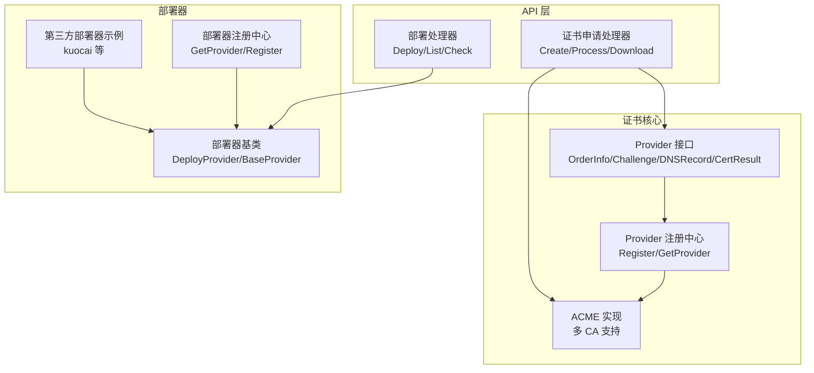
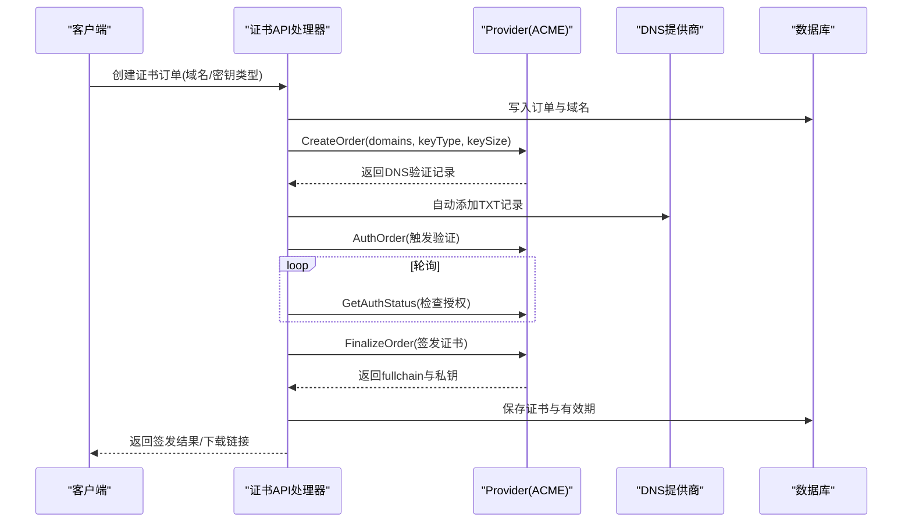
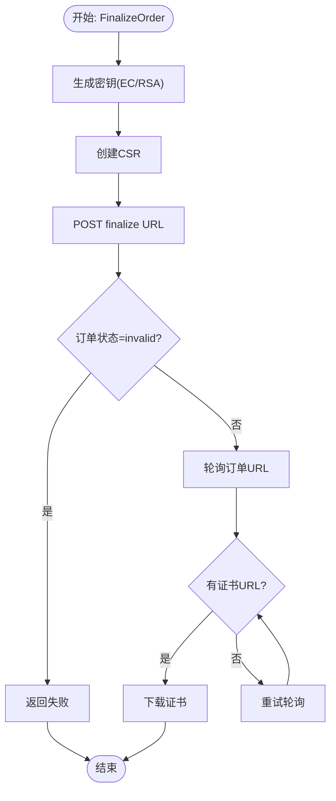
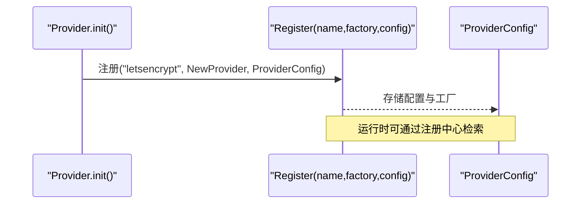
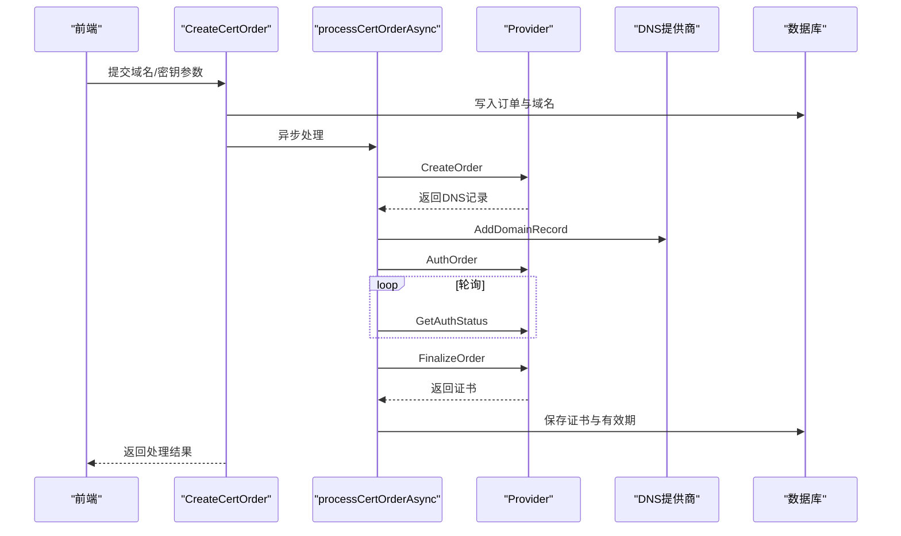
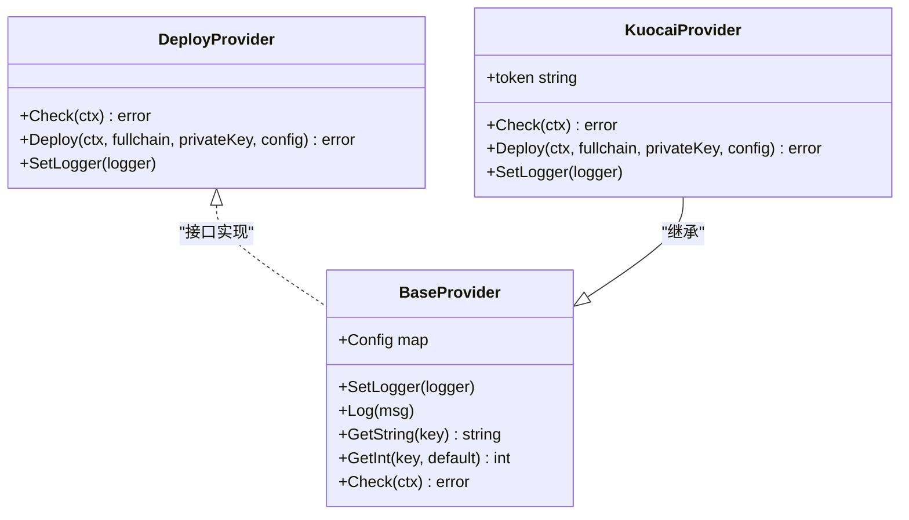
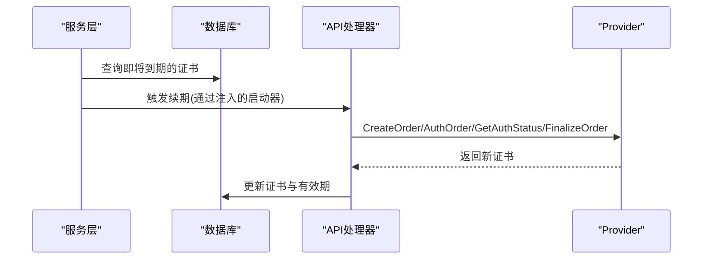
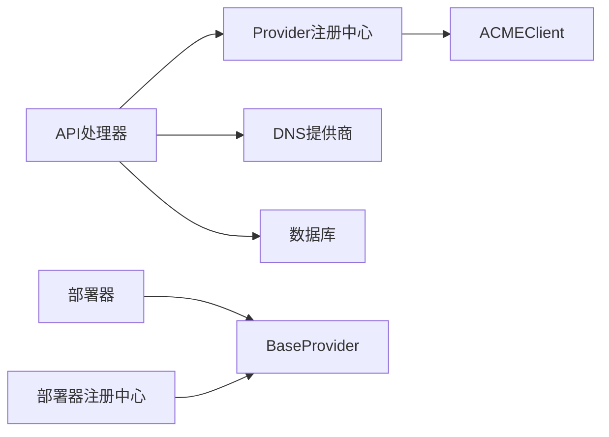

# 证书提供商扩展

<cite>
**本文档引用的文件**
- [interface.go](file://main/internal/cert/interface.go)
- [providers.go](file://main/internal/cert/providers.go)
- [registry.go](file://main/internal/cert/registry.go)
- [acme.go](file://main/internal/cert/acme/acme.go)
- [base.go](file://main/internal/cert/deploy/base/base.go)
- [registry.go](file://main/internal/cert/deploy/registry.go)
- [kuocai.go](file://main/internal/cert/deploy/others/kuocai.go)
- [cert.go](file://main/internal/api/handler/cert.go)
- [cert_deploy.go](file://main/internal/api/handler/cert_deploy.go)
- [cert_renew_hook.go](file://main/internal/service/cert_renew_hook.go)
- [expire_notice.go](file://main/internal/service/expire_notice.go)
</cite>

## 目录
1. [引言](#引言)
2. [项目结构](#项目结构)
3. [核心组件](#核心组件)
4. [架构总览](#架构总览)
5. [详细组件分析](#详细组件分析)
6. [依赖分析](#依赖分析)
7. [性能考虑](#性能考虑)
8. [故障排查指南](#故障排查指南)
9. [结论](#结论)
10. [附录](#附录)

## 引言
本指南面向希望为系统扩展“证书提供商”的开发者，围绕 ACME 协议证书提供商的架构设计与扩展机制进行深入讲解。内容涵盖：
- CertificateProvider 接口的实现要求与职责边界
- 如何实现新的 ACME 兼容证书提供商（挑战类型、账户管理、私钥处理）
- 证书提供商的注册流程与配置参数管理
- 证书链处理、过期检测与自动续期机制
- 扩展的测试策略与安全注意事项

## 项目结构
证书相关能力主要分布在以下模块：
- 证书接口与注册中心：定义 Provider 接口、配置模型与注册机制
- ACME 实现：内置 Let's Encrypt、ZeroSSL、Google、LiteSSL、自定义 ACME 等
- 证书申请与部署流程：API 层编排、异步处理、DNS 验证、证书签发与部署
- 部署器扩展：统一的部署器接口与注册机制，支持多种目标平台



图表来源
- [interface.go:49-77](file://main/internal/cert/interface.go#L49-L77)
- [registry.go:22-42](file://main/internal/cert/registry.go#L22-L42)
- [acme.go:36-67](file://main/internal/cert/acme/acme.go#L36-L67)
- [cert.go:155-304](file://main/internal/api/handler/cert.go#L155-L304)
- [cert_deploy.go:28-323](file://main/internal/api/handler/cert_deploy.go#L28-L323)
- [base.go:43-53](file://main/internal/cert/deploy/base/base.go#L43-L53)
- [registry.go:27-66](file://main/internal/cert/deploy/registry.go#L27-L66)
- [kuocai.go:16-30](file://main/internal/cert/deploy/others/kuocai.go#L16-L30)

章节来源
- [interface.go:1-114](file://main/internal/cert/interface.go#L1-L114)
- [providers.go:1-666](file://main/internal/cert/providers.go#L1-L666)
- [registry.go:1-108](file://main/internal/cert/registry.go#L1-L108)
- [acme.go:1-880](file://main/internal/cert/acme/acme.go#L1-L880)
- [base.go:1-258](file://main/internal/cert/deploy/base/base.go#L1-L258)
- [registry.go:1-72](file://main/internal/cert/deploy/registry.go#L1-L72)
- [kuocai.go:1-119](file://main/internal/cert/deploy/others/kuocai.go#L1-L119)
- [cert.go:1-935](file://main/internal/api/handler/cert.go#L1-L935)
- [cert_deploy.go:1-1097](file://main/internal/api/handler/cert_deploy.go#L1-L1097)

## 核心组件
- Provider 接口：定义证书申请全生命周期方法，包括注册、创建订单、验证、签发、吊销、取消与日志设置
- ProviderConfig/ConfigField：标准化提供商配置元数据，支持前端表单渲染与必填校验
- 注册中心：集中注册与检索 Provider 实例，支持证书提供商与部署提供商两类
- ACMEClient：通用 ACME 客户端，封装目录发现、nonce、JWK/JWK Thumbprint、EAB、签名校验、订单与授权处理、CSR 生成与签发
- API 处理器：编排证书申请与部署流程，异步执行，记录日志，暴露管理接口
- 部署器体系：统一的 DeployProvider 接口与 BaseProvider 基类，支持多厂商部署

章节来源
- [interface.go:49-77](file://main/internal/cert/interface.go#L49-L77)
- [providers.go:8-112](file://main/internal/cert/providers.go#L8-L112)
- [registry.go:22-42](file://main/internal/cert/registry.go#L22-L42)
- [acme.go:69-80](file://main/internal/cert/acme/acme.go#L69-L80)
- [cert.go:389-518](file://main/internal/api/handler/cert.go#L389-L518)
- [base.go:43-53](file://main/internal/cert/deploy/base/base.go#L43-L53)

## 架构总览
系统采用“接口抽象 + 工厂注册 + API 编排”的分层架构：
- 抽象层：Provider/DeployProvider 接口定义行为契约
- 扩展层：通过 Register 注册具体实现，支持多 CA 与多部署目标
- 编排层：API 处理器负责业务流程编排、异步任务调度、日志与错误处理
- 数据层：数据库持久化证书订单、域名、部署任务与账户信息



图表来源
- [cert.go:155-304](file://main/internal/api/handler/cert.go#L155-L304)
- [cert.go:389-518](file://main/internal/api/handler/cert.go#L389-L518)
- [acme.go:512-638](file://main/internal/cert/acme/acme.go#L512-L638)
- [acme.go:658-733](file://main/internal/cert/acme/acme.go#L658-L733)
- [acme.go:735-800](file://main/internal/cert/acme/acme.go#L735-L800)

## 详细组件分析

### Provider 接口与数据模型
- 关键方法
  - Register：账户注册（含 EAB 绑定）
  - CreateOrder：创建订单并返回每个主域所需的 DNS 验证记录
  - AuthOrder：触发验证（如 dns-01）
  - GetAuthStatus：轮询授权状态，返回是否通过
  - FinalizeOrder：生成 CSR 并提交，获取证书下载地址
  - Revoke/Canel：吊销与取消
  - SetLogger：注入日志回调
- 数据模型
  - OrderInfo：订单状态、授权 URL、证书 URL、挑战映射
  - Challenge：挑战类型、URL、token
  - DNSRecord：TXT 记录名、类型、值
  - CertResult：证书链、私钥、颁发者、有效期

```mermaid
classDiagram
class Provider {
+Register(ctx) map[string]interface{}
+BuyCert(ctx, domains, order) error
+CreateOrder(ctx, domains, order, keyType, keySize) map[string][]DNSRecord
+AuthOrder(ctx, domains, order) error
+GetAuthStatus(ctx, domains, order) bool
+FinalizeOrder(ctx, domains, order, keyType, keySize) CertResult
+Revoke(ctx, order, pem) error
+Cancel(ctx, order) error
+SetLogger(logger)
}
class ACMEClient {
-directoryURL string
-email string
-eabKID string
-eabHMACKey string
-accountKey PrivateKey
-accountURL string
-directory Directory
-client HTTPClient
-logger Logger
-nonce string
}
Provider <|.. ACMEClient : "实现"
```

图表来源
- [interface.go:49-77](file://main/internal/cert/interface.go#L49-L77)
- [acme.go:69-80](file://main/internal/cert/acme/acme.go#L69-L80)

章节来源
- [interface.go:5-44](file://main/internal/cert/interface.go#L5-L44)
- [interface.go:49-77](file://main/internal/cert/interface.go#L49-L77)
- [acme.go:69-80](file://main/internal/cert/acme/acme.go#L69-L80)

### ACME 客户端实现要点
- 目录与 Nonce：首次请求目录，缓存 nonce，减少重复请求
- JWK 与签名：根据账户私钥类型动态选择算法，生成 JWK 与签名
- EAB：支持外部账户绑定，计算 HMAC-SHA256
- 订单与授权：解析 authorizations 列表，提取 dns-01 挑战与 TXT 值
- CSR 与签发：生成 EC/RSA 密钥，创建 CSR，提交 finalize，轮询订单状态
- 错误处理：捕获 HTTP 错误与响应解析失败，记录详细日志



图表来源
- [acme.go:735-800](file://main/internal/cert/acme/acme.go#L735-L800)

章节来源
- [acme.go:242-286](file://main/internal/cert/acme/acme.go#L242-L286)
- [acme.go:288-368](file://main/internal/cert/acme/acme.go#L288-L368)
- [acme.go:422-474](file://main/internal/cert/acme/acme.go#L422-L474)
- [acme.go:512-638](file://main/internal/cert/acme/acme.go#L512-L638)
- [acme.go:658-733](file://main/internal/cert/acme/acme.go#L658-L733)
- [acme.go:735-800](file://main/internal/cert/acme/acme.go#L735-L800)

### Provider 注册与配置管理
- 注册：init 中调用 Register 注册具体 Provider 工厂与 ProviderConfig
- 配置：ProviderConfig 包含类型、名称、图标、说明、配置字段数组、是否支持 CNAME、是否用于部署等
- 查询：GetProviderConfig/GetAllProviderConfigs/GetCertProviderConfigs/GetDeployProviderConfigs 提供配置查询



图表来源
- [providers.go:36-67](file://main/internal/cert/providers.go#L36-L67)
- [registry.go:22-42](file://main/internal/cert/registry.go#L22-L42)

章节来源
- [providers.go:8-112](file://main/internal/cert/providers.go#L8-L112)
- [registry.go:44-74](file://main/internal/cert/registry.go#L44-L74)

### 证书申请流程（API 编排）
- 创建订单：解析账户配置与扩展信息，获取 Provider，设置日志，异步处理
- DNS 验证：自动添加 TXT 记录，等待生效，触发验证，轮询授权状态
- 签发证书：提交 finalize，保存 fullchain 与私钥，记录有效期
- 下载与导出：支持单独下载证书链或私钥，或打包为 zip



图表来源
- [cert.go:155-223](file://main/internal/api/handler/cert.go#L155-L223)
- [cert.go:225-304](file://main/internal/api/handler/cert.go#L225-L304)
- [cert.go:389-518](file://main/internal/api/handler/cert.go#L389-L518)

章节来源
- [cert.go:155-304](file://main/internal/api/handler/cert.go#L155-L304)
- [cert.go:389-518](file://main/internal/api/handler/cert.go#L389-L518)

### 部署器扩展机制
- DeployProvider 接口：Check/Deploy/SetLogger
- BaseProvider：统一配置读取、日志、域名分割等工具
- 注册与获取：Register/GetProvider，支持按账户类型与 product 组合键查找
- 示例：kuocai 部署器演示了登录、部署与错误处理



图表来源
- [base.go:43-53](file://main/internal/cert/deploy/base/base.go#L43-L53)
- [base.go:98-102](file://main/internal/cert/deploy/base/base.go#L98-L102)
- [kuocai.go:20-30](file://main/internal/cert/deploy/others/kuocai.go#L20-L30)

章节来源
- [base.go:43-53](file://main/internal/cert/deploy/base/base.go#L43-L53)
- [base.go:98-146](file://main/internal/cert/deploy/base/base.go#L98-L146)
- [registry.go:27-66](file://main/internal/cert/deploy/registry.go#L27-L66)
- [kuocai.go:16-30](file://main/internal/cert/deploy/others/kuocai.go#L16-L30)

### 新证书提供商实现步骤
- 步骤一：实现 Provider 接口
  - 在 init 中调用 Register 注册你的 Provider 工厂与 ProviderConfig
  - 实现 CreateOrder/AuthOrder/GetAuthStatus/FinalizeOrder 等方法
  - 使用 SetLogger 输出调试信息
- 步骤二：配置字段设计
  - 在 ProviderConfig.Config 中定义必填字段（如邮箱、EAB 参数、代理开关等）
  - 若支持 CNAME 代理，在 CNAME 字段标注
- 步骤三：账户与扩展信息
  - 支持从 ext 中读取 account_key/account_url 等扩展信息
  - 首次使用时可返回账户私钥与账户 URL，供后续请求复用
- 步骤四：与 API 集成
  - 通过 cert.GetProvider 获取实例
  - 在 API 层调用 CreateOrder/AuthOrder/GetAuthStatus/FinalizeOrder
  - 记录日志与错误，持久化订单状态

章节来源
- [providers.go:36-67](file://main/internal/cert/providers.go#L36-L67)
- [registry.go:22-42](file://main/internal/cert/registry.go#L22-L42)
- [acme.go:90-206](file://main/internal/cert/acme/acme.go#L90-L206)
- [cert.go:207-304](file://main/internal/api/handler/cert.go#L207-L304)

### 证书链处理、过期检测与自动续期
- 证书链与私钥：FinalizeOrder 返回 fullchain 与私钥，API 层保存到数据库
- 过期检测：服务层提供 WHOIS 查询与到期时间更新能力
- 自动续期：通过 CertRenewProcessStarter 注入续期入口，触发与申请相同的异步流程



图表来源
- [expire_notice.go:17-41](file://main/internal/service/expire_notice.go#L17-L41)
- [cert_renew_hook.go:7-12](file://main/internal/service/cert_renew_hook.go#L7-L12)
- [cert.go:306-367](file://main/internal/api/handler/cert.go#L306-L367)

章节来源
- [cert.go:669-737](file://main/internal/api/handler/cert.go#L669-L737)
- [expire_notice.go:17-41](file://main/internal/service/expire_notice.go#L17-L41)
- [cert_renew_hook.go:7-12](file://main/internal/service/cert_renew_hook.go#L7-L12)

## 依赖分析
- Provider 与 ACMEClient：ACMEClient 实现 Provider 接口，依赖 http、crypto、x509 等标准库
- API 处理器依赖 Provider 与 DNS 提供商，编排证书申请与 DNS 验证
- 部署器依赖 BaseProvider 与具体厂商 SDK 或 HTTP 接口
- 注册中心通过全局 map 存储工厂与配置，线程安全读写



图表来源
- [registry.go:30-42](file://main/internal/cert/registry.go#L30-L42)
- [cert.go:269-288](file://main/internal/api/handler/cert.go#L269-L288)
- [base.go:70-84](file://main/internal/cert/deploy/base/base.go#L70-L84)
- [registry.go:27-66](file://main/internal/cert/deploy/registry.go#L27-L66)

章节来源
- [registry.go:1-108](file://main/internal/cert/registry.go#L1-L108)
- [base.go:1-258](file://main/internal/cert/deploy/base/base.go#L1-L258)
- [registry.go:1-72](file://main/internal/cert/deploy/registry.go#L1-L72)

## 性能考虑
- 非ce 请求复用：ACMEClient 缓存 nonce，减少目录与 nonce 请求次数
- 异步处理：证书申请与部署通过 goroutine 异步执行，避免阻塞 API
- 轮询策略：验证状态轮询间隔与最大尝试次数可调，避免过度请求
- 部署器并发：部署器 Check/Deploy 应限制并发，避免触发目标平台限流

## 故障排查指南
- 常见错误
  - 验证超时：检查 DNS 记录是否生效、TTL 是否足够、防火墙/代理是否影响
  - 订单状态 invalid：查看授权响应中的 error 字段，定位具体挑战失败原因
  - EAB 认证失败：确认 kid 与 HMAC Key 格式（Base64URL）与目录一致
  - 私钥类型不支持：确保账户私钥类型与算法匹配（EC/RSA）
- 日志与诊断
  - 使用 Provider.SetLogger 输出详细日志
  - API 层记录订单日志与错误信息，便于定位问题
  - 部署器 Check 方法用于快速连通性检测

章节来源
- [acme.go:362-368](file://main/internal/cert/acme/acme.go#L362-L368)
- [acme.go:713-732](file://main/internal/cert/acme/acme.go#L713-L732)
- [cert.go:369-376](file://main/internal/api/handler/cert.go#L369-L376)
- [kuocai.go:32-72](file://main/internal/cert/deploy/others/kuocai.go#L32-L72)

## 结论
通过 Provider 接口与注册中心，系统实现了对多 CA 的统一抽象与扩展。ACMEClient 提供了完整的 ACME 协议实现，API 层负责编排与持久化，部署器体系支持多厂商目标。遵循本文档的扩展步骤与最佳实践，即可快速实现新的证书提供商与部署器。

## 附录

### 配置字段规范
- 必填字段：通过 ConfigField.Required 标记
- 选项字段：ConfigField.Options 提供可选值
- 显示条件：ConfigField.Show 支持基于其他字段值显示
- 校验器：ConfigField.Validator 支持自定义校验规则
- 数值范围：ConfigField.Min/Max 限定范围

章节来源
- [interface.go:92-107](file://main/internal/cert/interface.go#L92-L107)
- [providers.go:16-35](file://main/internal/cert/providers.go#L16-L35)

### 测试策略建议
- 单元测试
  - Provider 接口方法：模拟 CreateOrder/AuthOrder/GetAuthStatus/FinalizeOrder 的返回与错误
  - ACMEClient：Mock HTTP 客户端，覆盖目录、nonce、JWK、EAB、finalize 等场景
- 集成测试
  - 使用测试环境（staging）执行完整流程，验证 DNS 记录、授权状态轮询与证书签发
- 安全测试
  - 密钥生成与存储：确保私钥不泄露，必要时使用硬件安全模块
  - EAB 参数：严格校验 Base64URL 格式与长度
  - 日志脱敏：避免输出敏感信息（如私钥、令牌）

### 安全考虑
- 密钥管理：账户私钥与扩展信息应加密存储，传输过程中使用 HTTPS
- EAB 认证：严格校验 kid 与 HMAC Key，避免错误配置导致失败
- DNS 验证：确保 TXT 记录仅在验证期间存在，及时清理
- API 限流：部署器与 ACME 服务器均有限流策略，避免触发限流