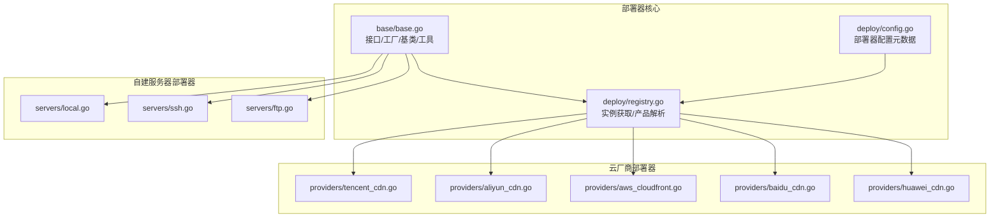
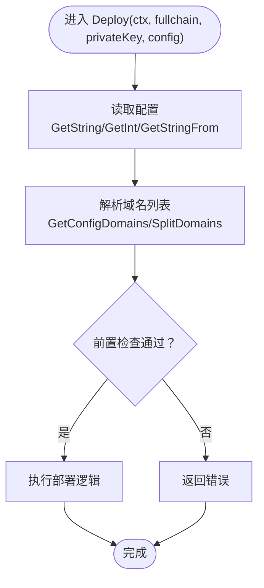
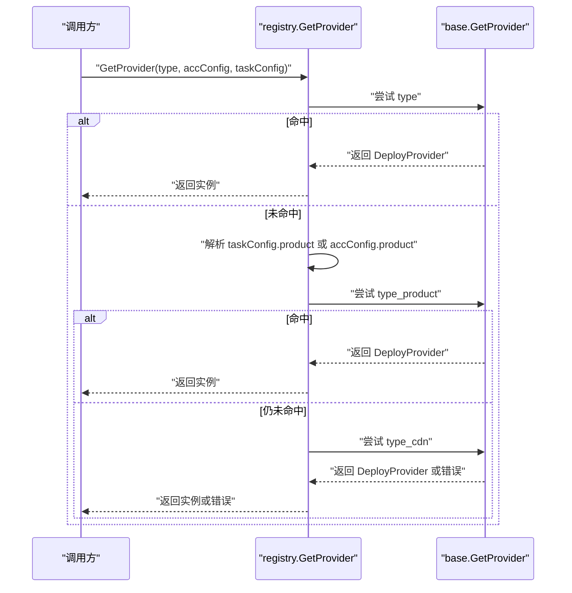
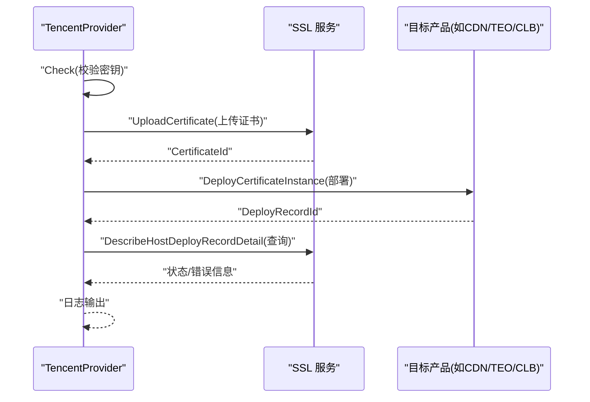
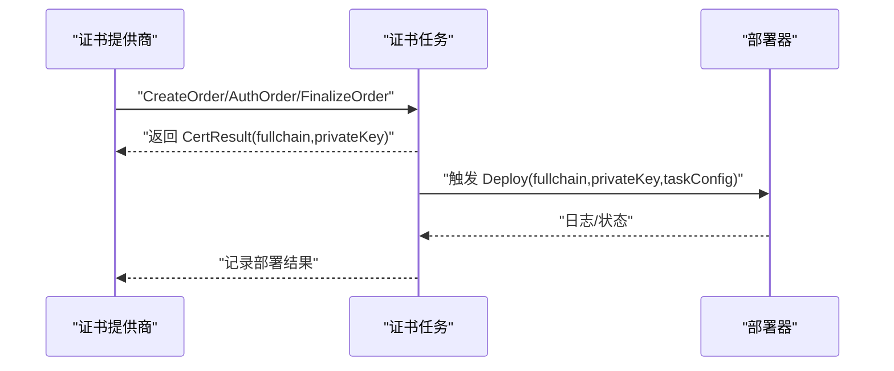
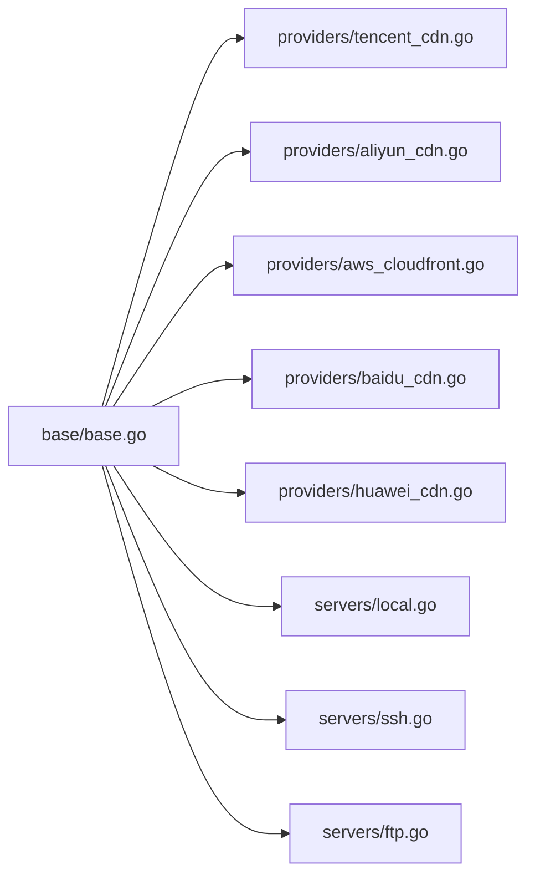

# 部署器扩展

<cite>
**本文引用的文件**
- [base.go](file://main/internal/cert/deploy/base/base.go)
- [registry.go](file://main/internal/cert/deploy/registry.go)
- [config.go](file://main/internal/cert/deploy/config.go)
- [interface.go](file://main/internal/cert/interface.go)
- [local.go](file://main/internal/cert/deploy/servers/local.go)
- [ssh.go](file://main/internal/cert/deploy/servers/ssh.go)
- [ftp.go](file://main/internal/cert/deploy/servers/ftp.go)
- [tencent_cdn.go](file://main/internal/cert/deploy/providers/tencent_cdn.go)
- [aliyun_cdn.go](file://main/internal/cert/deploy/providers/aliyun_cdn.go)
- [aws_cloudfront.go](file://main/internal/cert/deploy/providers/aws_cloudfront.go)
- [baidu_cdn.go](file://main/internal/cert/deploy/providers/baidu_cdn.go)
- [huawei_cdn.go](file://main/internal/cert/deploy/providers/huawei_cdn.go)
</cite>

## 目录
1. [简介](#简介)
2. [项目结构](#项目结构)
3. [核心组件](#核心组件)
4. [架构总览](#架构总览)
5. [详细组件分析](#详细组件分析)
6. [依赖分析](#依赖分析)
7. [性能考虑](#性能考虑)
8. [故障排查指南](#故障排查指南)
9. [结论](#结论)
10. [附录](#附录)

## 简介
本指南面向希望为证书部署器扩展系统新增部署能力的开发者，系统性讲解部署器的架构设计、扩展机制与实现规范，覆盖以下主题：
- Deployer 接口与基类的设计与职责
- 部署目标类型（CDN、云服务、自建服务器）的适配策略
- 部署器注册流程与配置参数处理
- 部署失败处理、回滚机制与状态同步
- 测试方法与性能优化建议
- 与证书提供商的协作机制

## 项目结构
部署器相关代码集中在 main/internal/cert/deploy 目录，按功能域分为：
- base：部署器接口、工厂、基类与通用工具
- providers：各类云厂商/平台的部署实现
- servers：自建服务器的部署实现（本地/SSH/FTP）
- registry.go：部署器实例获取与产品子类型解析
- config.go：部署器配置元数据定义与注册



**图表来源**
- [base.go:43-114](file://main/internal/cert/deploy/base/base.go#L43-L114)
- [registry.go:27-66](file://main/internal/cert/deploy/registry.go#L27-L66)
- [config.go:19-49](file://main/internal/cert/deploy/config.go#L19-L49)
- [local.go:15-27](file://main/internal/cert/deploy/servers/local.go#L15-L27)
- [ssh.go:17-29](file://main/internal/cert/deploy/servers/ssh.go#L17-L29)
- [ftp.go:15-27](file://main/internal/cert/deploy/servers/ftp.go#L15-L27)
- [tencent_cdn.go:34-58](file://main/internal/cert/deploy/providers/tencent_cdn.go#L34-L58)
- [aliyun_cdn.go:17-29](file://main/internal/cert/deploy/providers/aliyun_cdn.go#L17-L29)
- [aws_cloudfront.go:23-45](file://main/internal/cert/deploy/providers/aws_cloudfront.go#L23-L45)
- [baidu_cdn.go:23-58](file://main/internal/cert/deploy/providers/baidu_cdn.go#L23-L58)
- [huawei_cdn.go:17-29](file://main/internal/cert/deploy/providers/huawei_cdn.go#L17-L29)

**章节来源**
- [base.go:1-258](file://main/internal/cert/deploy/base/base.go#L1-L258)
- [registry.go:1-72](file://main/internal/cert/deploy/registry.go#L1-L72)
- [config.go:1-50](file://main/internal/cert/deploy/config.go#L1-L50)

## 核心组件
- DeployProvider 接口：定义部署器必须实现的方法，包括配置校验、部署执行、日志设置。
- BaseProvider 基类：提供配置读取、日志记录、域名解析等通用能力。
- ProviderFactory 工厂函数：根据配置构造具体部署器实例。
- 注册中心：以名称映射到工厂，支持“主类型”和“主类型_子产品”的复合键解析。

关键职责与约定：
- 配置传递：通过 map[string]interface{} 传入；基类提供大小写不敏感、下划线/驼峰互转的读取方法。
- 部署目标：CDN/云服务（HTTP API）、自建服务器（本地文件/SSH/FTP）。
- 状态管理：通过日志回调与外部状态同步；部分实现会轮询或等待云端部署结果。
- 错误处理：明确返回错误信息，便于上层统一处理与用户提示。

**章节来源**
- [base.go:43-114](file://main/internal/cert/deploy/base/base.go#L43-L114)
- [base.go:116-174](file://main/internal/cert/deploy/base/base.go#L116-L174)
- [base.go:205-257](file://main/internal/cert/deploy/base/base.go#L205-L257)
- [registry.go:27-66](file://main/internal/cert/deploy/registry.go#L27-L66)

## 架构总览
部署器采用“接口 + 工厂 + 基类 + 注册中心”的分层设计，支持多厂商、多产品形态的统一接入与差异化实现。

```mermaid
classDiagram
class DeployProvider {
+Check(ctx) error
+Deploy(ctx, fullchain, privateKey, config) error
+SetLogger(logger)
}
class BaseProvider {
+Config map[string]interface{}
+Logger Logger
+SetLogger(logger)
+Log(msg)
+GetString(key) string
+GetInt(key, defaultVal) int
+Check(ctx) error
+GetStringFrom(config, key) string
}
class ProviderFactory {
<<function>>
}
class Registry {
+Register(name, factory)
+GetProvider(accountType, accConfig, taskConfig) (DeployProvider, error)
+ListProviders() []string
}
DeployProvider <|.. BaseProvider
ProviderFactory --> DeployProvider : "构造"
Registry --> ProviderFactory : "按名称获取"
```

**图表来源**
- [base.go:43-114](file://main/internal/cert/deploy/base/base.go#L43-L114)
- [base.go:98-114](file://main/internal/cert/deploy/base/base.go#L98-L114)
- [registry.go:27-66](file://main/internal/cert/deploy/registry.go#L27-L66)

## 详细组件分析

### 接口与基类：DeployProvider 与 BaseProvider
- 接口方法
  - Check：对配置进行连通性/必要参数校验
  - Deploy：执行证书部署，接收证书链与私钥以及任务配置
  - SetLogger：注入日志回调
- 基类能力
  - 配置读取：支持大小写不敏感、下划线与驼峰互转
  - 域名解析：支持 domain/domainList/domains 的多种输入格式
  - 日志：统一通过 Logger 回调输出
  - 默认 Check：空实现，可由子类覆盖



**图表来源**
- [base.go:116-174](file://main/internal/cert/deploy/base/base.go#L116-L174)
- [base.go:205-257](file://main/internal/cert/deploy/base/base.go#L205-L257)

**章节来源**
- [base.go:43-114](file://main/internal/cert/deploy/base/base.go#L43-L114)
- [base.go:116-174](file://main/internal/cert/deploy/base/base.go#L116-L174)
- [base.go:205-257](file://main/internal/cert/deploy/base/base.go#L205-L257)

### 注册中心：GetProvider 与产品子类型解析
- 支持“主类型”与“主类型_子产品”的复合键
- 优先使用任务配置中的 product 字段，其次使用账户配置中的 product，最后尝试 “主类型_cdn”
- 未命中时返回未知部署器错误



**图表来源**
- [registry.go:27-66](file://main/internal/cert/deploy/registry.go#L27-L66)
- [base.go:70-84](file://main/internal/cert/deploy/base/base.go#L70-L84)

**章节来源**
- [registry.go:27-66](file://main/internal/cert/deploy/registry.go#L27-L66)

### 云厂商部署器示例

#### 腾讯云（CDN/TEO/CLB/COS/TKE/WAF/SCF/Live/VOD 等）
- 特点
  - 支持多产品形态，统一通过 SSL 服务上传证书后部署
  - TE0 使用专用 API，CLB 支持监听器级部署
  - 提供部署记录查询与状态同步
- 关键流程
  - 上传证书 -> 获取证书ID -> 构造实例ID列表 -> 调用部署接口 -> 查询部署结果



**图表来源**
- [tencent_cdn.go:87-207](file://main/internal/cert/deploy/providers/tencent_cdn.go#L87-L207)
- [tencent_cdn.go:269-311](file://main/internal/cert/deploy/providers/tencent_cdn.go#L269-L311)

**章节来源**
- [tencent_cdn.go:34-58](file://main/internal/cert/deploy/providers/tencent_cdn.go#L34-L58)
- [tencent_cdn.go:87-207](file://main/internal/cert/deploy/providers/tencent_cdn.go#L87-L207)
- [tencent_cdn.go:313-369](file://main/internal/cert/deploy/providers/tencent_cdn.go#L313-L369)
- [tencent_cdn.go:433-482](file://main/internal/cert/deploy/providers/tencent_cdn.go#L433-L482)

#### 阿里云（CDN）
- 特点
  - 逐域名部署，支持多域名
  - 通过 SDK 调用 SetCdnDomainSSLCertificate
- 关键流程
  - 校验 AK/SK -> 获取域名列表 -> 逐域名上传证书

**章节来源**
- [aliyun_cdn.go:17-29](file://main/internal/cert/deploy/providers/aliyun_cdn.go#L17-L29)
- [aliyun_cdn.go:56-94](file://main/internal/cert/deploy/providers/aliyun_cdn.go#L56-L94)

#### AWS CloudFront
- 特点
  - 先导入 ACM（us-east-1），再更新 CloudFront 分发配置
  - 支持通过域名自动查找分发ID
  - 自签名 CloudFront API 请求
- 关键流程
  - 导入证书 -> 查找分发 -> 替换 ViewerCertificate -> PUT 更新

**章节来源**
- [aws_cloudfront.go:23-45](file://main/internal/cert/deploy/providers/aws_cloudfront.go#L23-L45)
- [aws_cloudfront.go:60-100](file://main/internal/cert/deploy/providers/aws_cloudfront.go#L60-L100)
- [aws_cloudfront.go:144-226](file://main/internal/cert/deploy/providers/aws_cloudfront.go#L144-L226)
- [aws_cloudfront.go:363-452](file://main/internal/cert/deploy/providers/aws_cloudfront.go#L363-L452)

#### 百度云（CDN/BLB/AppBLB）
- 特点
  - CDN：逐域名部署 HTTPS 证书
  - BLB/AppBLB：先上传证书获取证书ID，再部署到指定实例与端口
  - BCE 签名算法
- 关键流程
  - CDN：检查证书是否存在 -> 不存在则 PUT
  - BLB：上传证书 -> 部署到实例端口

**章节来源**
- [baidu_cdn.go:23-58](file://main/internal/cert/deploy/providers/baidu_cdn.go#L23-L58)
- [baidu_cdn.go:222-294](file://main/internal/cert/deploy/providers/baidu_cdn.go#L222-L294)
- [baidu_cdn.go:296-358](file://main/internal/cert/deploy/providers/baidu_cdn.go#L296-L358)
- [baidu_cdn.go:360-406](file://main/internal/cert/deploy/providers/baidu_cdn.go#L360-L406)

#### 华为云（CDN）
- 特点
  - 使用官方 SDK
  - 支持强制跳转 HTTPS 开关
- 关键流程
  - 校验 AK/SK -> 逐域名部署证书 -> 可选强制跳转

**章节来源**
- [huawei_cdn.go:17-29](file://main/internal/cert/deploy/providers/huawei_cdn.go#L17-L29)
- [huawei_cdn.go:64-116](file://main/internal/cert/deploy/providers/huawei_cdn.go#L64-L116)

### 自建服务器部署器

#### 本地文件部署（local）
- 特点
  - 直接写入证书与私钥文件
  - 支持可选重启/重载命令
  - 支持域名占位符替换
- 关键流程
  - 校验证书/私钥路径 -> 写文件 -> 执行重启命令

**章节来源**
- [local.go:15-27](file://main/internal/cert/deploy/servers/local.go#L15-L27)
- [local.go:29-51](file://main/internal/cert/deploy/servers/local.go#L29-L51)
- [local.go:53-110](file://main/internal/cert/deploy/servers/local.go#L53-L110)

#### SSH 部署（ssh）
- 特点
  - 支持密钥/密码两种认证
  - 使用 scp 传输证书与私钥
  - 支持上传前后命令
- 关键流程
  - 连接 -> 可选执行前置命令 -> 逐域名上传 -> 可选执行后置命令

**章节来源**
- [ssh.go:17-29](file://main/internal/cert/deploy/servers/ssh.go#L17-L29)
- [ssh.go:31-80](file://main/internal/cert/deploy/servers/ssh.go#L31-L80)
- [ssh.go:82-135](file://main/internal/cert/deploy/servers/ssh.go#L82-L135)
- [ssh.go:137-160](file://main/internal/cert/deploy/servers/ssh.go#L137-L160)
- [ssh.go:162-174](file://main/internal/cert/deploy/servers/ssh.go#L162-L174)

#### FTP 部署（ftp）
- 特点
  - 使用第三方库连接并上传
  - 自动创建远程目录
- 关键流程
  - 连接/登录 -> 逐域名上传 -> 关闭连接

**章节来源**
- [ftp.go:15-27](file://main/internal/cert/deploy/servers/ftp.go#L15-L27)
- [ftp.go:29-58](file://main/internal/cert/deploy/servers/ftp.go#L29-L58)
- [ftp.go:60-96](file://main/internal/cert/deploy/servers/ftp.go#L60-L96)
- [ftp.go:98-105](file://main/internal/cert/deploy/servers/ftp.go#L98-L105)

### 与证书提供商的协作机制
- Provider 接口：负责证书签发生命周期（创建订单、验证、签发、吊销、取消）
- 部署器：在证书签发完成后，将证书链与私钥部署到目标平台
- 配置联动：ProviderConfig 中可声明部署配置字段，用于引导用户填写部署所需参数



**图表来源**
- [interface.go:50-77](file://main/internal/cert/interface.go#L50-L77)
- [interface.go:37-44](file://main/internal/cert/interface.go#L37-L44)
- [config.go:19-49](file://main/internal/cert/deploy/config.go#L19-L49)

**章节来源**
- [interface.go:49-77](file://main/internal/cert/interface.go#L49-L77)
- [config.go:19-49](file://main/internal/cert/deploy/config.go#L19-L49)

## 依赖分析
- 组件耦合
  - 各部署器均依赖 base 包提供的接口、工厂与基类能力
  - 云厂商部署器依赖对应 SDK 或自实现签名/HTTP 客户端
  - 自建服务器部署器依赖标准库与第三方库（如 SSH/FTP）
- 外部依赖
  - 云 SDK：腾讯云 SSL、阿里云 CDN、华为云 CDN
  - 第三方库：SSH 客户端、FTP 客户端
- 潜在环路
  - 无直接循环依赖；注册通过 init() 在包级完成，避免运行期环路



**图表来源**
- [base.go:1-258](file://main/internal/cert/deploy/base/base.go#L1-L258)
- [tencent_cdn.go:1-487](file://main/internal/cert/deploy/providers/tencent_cdn.go#L1-L487)
- [aliyun_cdn.go:1-99](file://main/internal/cert/deploy/providers/aliyun_cdn.go#L1-L99)
- [aws_cloudfront.go:1-453](file://main/internal/cert/deploy/providers/aws_cloudfront.go#L1-L453)
- [baidu_cdn.go:1-428](file://main/internal/cert/deploy/providers/baidu_cdn.go#L1-L428)
- [huawei_cdn.go:1-121](file://main/internal/cert/deploy/providers/huawei_cdn.go#L1-L121)
- [local.go:1-119](file://main/internal/cert/deploy/servers/local.go#L1-L119)
- [ssh.go:1-179](file://main/internal/cert/deploy/servers/ssh.go#L1-L179)
- [ftp.go:1-110](file://main/internal/cert/deploy/servers/ftp.go#L1-L110)

**章节来源**
- [base.go:1-258](file://main/internal/cert/deploy/base/base.go#L1-L258)

## 性能考虑
- 并发与批量
  - 对于多域名场景，尽量使用云厂商支持批量部署的接口，减少多次往返
- 超时与重试
  - 为网络请求设置合理超时；对幂等操作（如证书上传）可引入指数退避重试
- 日志与可观测性
  - 使用统一日志回调，便于聚合与追踪
- 资源复用
  - 云 SDK 客户端应复用连接与凭证，避免频繁创建销毁
- 证书拆分
  - 对于需要分离证书链与私钥的场景，提前拆分避免重复解析

## 故障排查指南
- 常见错误类型
  - 配置缺失：AK/SK、域名、实例ID等
  - 连接失败：网络不通、鉴权失败、主机不可达
  - 业务错误：证书上传失败、部署接口返回错误码
- 排查步骤
  - 使用 Check 方法进行快速连通性校验
  - 查看日志输出定位失败阶段
  - 对于云厂商部署器，结合其返回的错误信息与部署记录ID进行进一步排查
- 回滚与补偿
  - 若部署过程中断，优先保证证书链与私钥的正确性
  - 对于可逆操作（如配置变更），在失败时恢复原状
  - 对于不可逆操作，记录部署记录ID以便后续查询与人工干预

**章节来源**
- [base.go:159-162](file://main/internal/cert/deploy/base/base.go#L159-L162)
- [tencent_cdn.go:269-311](file://main/internal/cert/deploy/providers/tencent_cdn.go#L269-L311)
- [aws_cloudfront.go:236-274](file://main/internal/cert/deploy/providers/aws_cloudfront.go#L236-L274)

## 结论
该部署器扩展体系以清晰的接口与基类为核心，配合灵活的注册与产品子类型解析机制，实现了对多厂商、多形态部署目标的一致接入。通过标准化的配置读取、日志回调与错误处理，开发者可以快速实现新的部署器并融入现有工作流。建议在实现新部署器时遵循本文档的接口规范、配置约定与最佳实践，确保稳定性与可维护性。

## 附录

### 如何实现新的证书部署器（步骤清单）
- 定义部署器
  - 实现 DeployProvider 接口（Check/Deploy/SetLogger）
  - 可继承 BaseProvider 以复用配置读取与日志能力
- 注册部署器
  - 在 init() 中调用 base.Register("your_type", NewYourProvider)
- 配置元数据
  - 在部署器文件中注册 ProviderConfig（可选），定义部署配置字段与说明
- 配置参数处理
  - 使用基类 GetString/GetInt/GetStringFrom 等方法读取配置
  - 使用 GetConfigDomains 解析域名列表
- 部署流程
  - 在 Check 中进行最小化连通性校验
  - 在 Deploy 中实现部署逻辑，注意幂等性与错误处理
- 日志与状态
  - 使用 p.Log 输出关键步骤与错误信息
  - 对于异步部署，提供状态查询与日志输出
- 测试与验证
  - 编写单元测试覆盖 Check/Deploy 的关键分支
  - 使用真实环境或沙箱进行端到端验证
- 性能与可靠性
  - 控制并发与批量，设置超时与重试
  - 复用客户端资源，避免频繁创建销毁

**章节来源**
- [base.go:43-114](file://main/internal/cert/deploy/base/base.go#L43-L114)
- [base.go:116-174](file://main/internal/cert/deploy/base/base.go#L116-L174)
- [base.go:205-257](file://main/internal/cert/deploy/base/base.go#L205-L257)
- [registry.go:27-66](file://main/internal/cert/deploy/registry.go#L27-L66)
- [config.go:19-49](file://main/internal/cert/deploy/config.go#L19-L49)