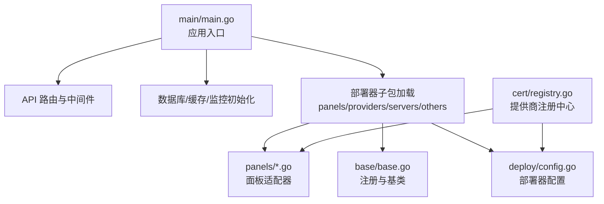
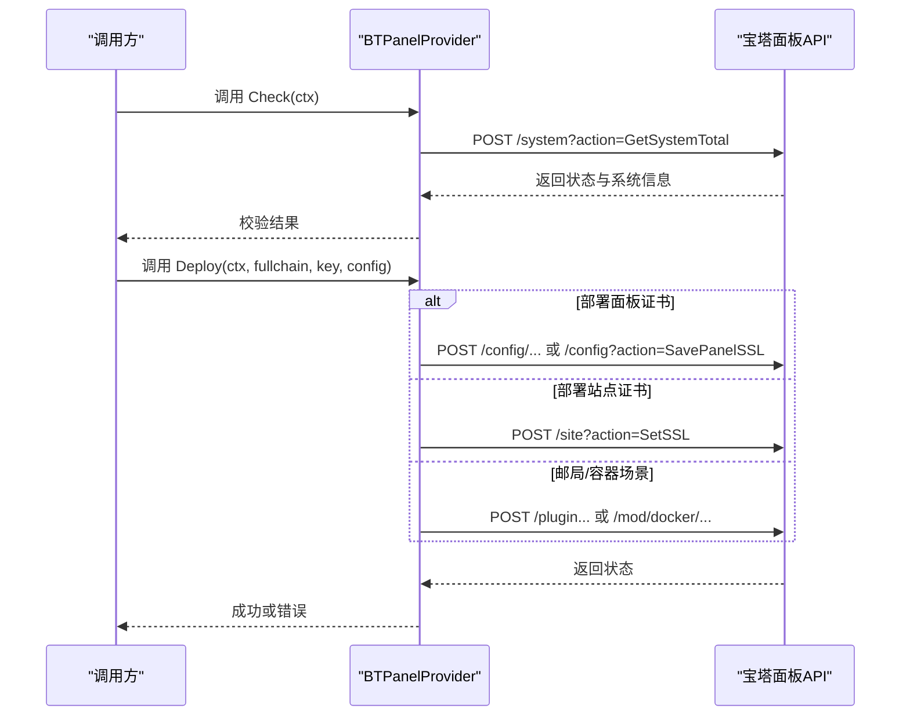
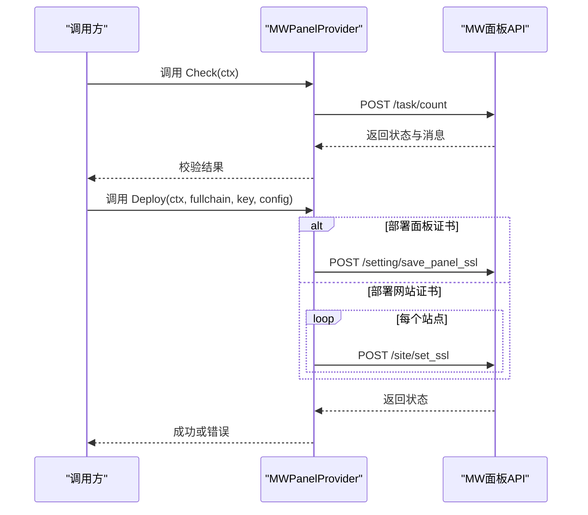
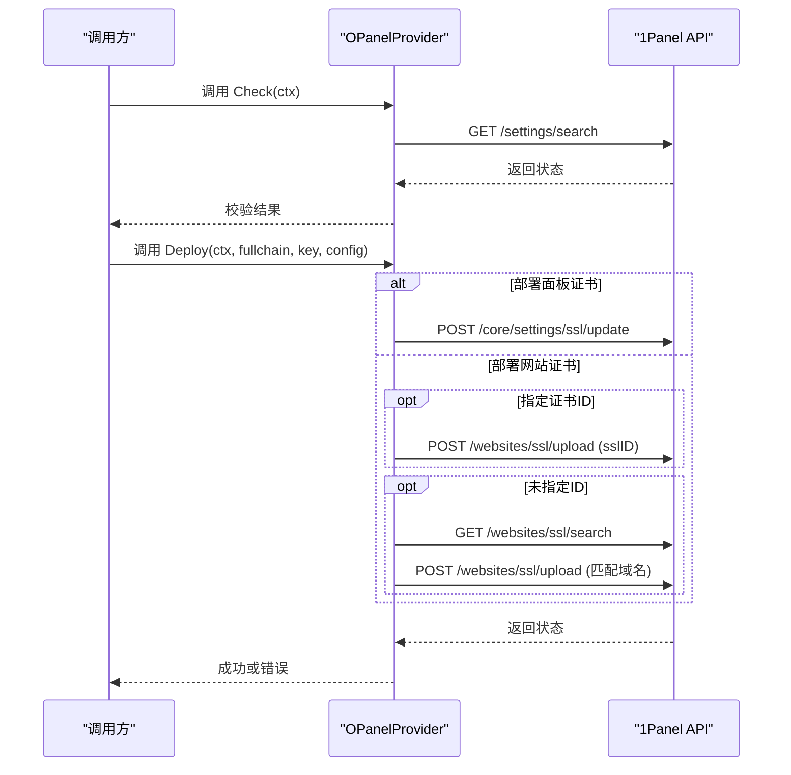
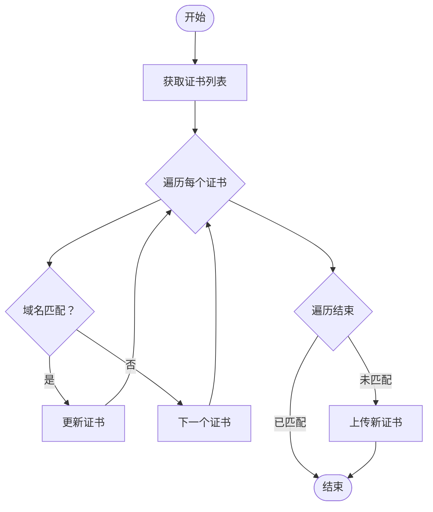
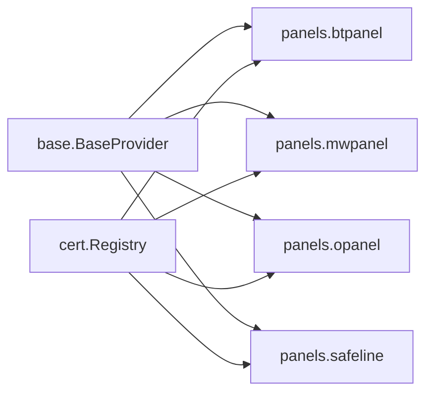

# 面板集成扩展

<cite>
**本文引用的文件**
- [main.go](file://main/main.go)
- [btpanel.go](file://main/internal/cert/deploy/panels/btpanel.go)
- [mwpanel.go](file://main/internal/cert/deploy/panels/mwpanel.go)
- [opanel.go](file://main/internal/cert/deploy/panels/opanel.go)
- [safeline.go](file://main/internal/cert/deploy/panels/safeline.go)
- [base.go](file://main/internal/cert/deploy/base/base.go)
- [config.go](file://main/internal/cert/deploy/config.go)
- [interface.go](file://main/internal/cert/interface.go)
- [registry.go](file://main/internal/cert/registry.go)
- [README.md](file://main/internal/cert/deploy/README.md)
</cite>

## 目录
1. [简介](#简介)
2. [项目结构](#项目结构)
3. [核心组件](#核心组件)
4. [架构总览](#架构总览)
5. [详细组件分析](#详细组件分析)
6. [依赖分析](#依赖分析)
7. [性能考量](#性能考量)
8. [故障排查指南](#故障排查指南)
9. [结论](#结论)
10. [附录](#附录)

## 简介
本指南面向为各类服务器面板（如宝塔、魔方、1Panel、西部数码、雷池WAF 等）开发“证书部署适配器”的工程师，系统讲解以下内容：
- 面板集成扩展的总体架构与职责边界
- 面板API调用方式、认证机制与权限管理要点
- 配置流程与参数传递规范
- 错误处理、状态同步与日志记录策略
- 测试方法与兼容性注意事项
- 与“部署器系统”的协作关系与任务执行链路

## 项目结构
本项目采用“按职责分层 + 按功能域划分”的组织方式：
- 面板部署器位于 main/internal/cert/deploy/panels，包含宝塔、魔方、1Panel、雷池WAF 等适配器
- 部署器基类与注册机制位于 main/internal/cert/deploy/base
- 部署器配置与注册中心位于 main/internal/cert/deploy 与 main/internal/cert
- 主程序入口 main/main.go 加载配置、初始化数据库/缓存/监控，并挂载API路由



图表来源
- [main.go:1-148](file://main/main.go#L1-L148)
- [README.md:1-123](file://main/internal/cert/deploy/README.md#L1-L123)

章节来源
- [main.go:1-148](file://main/main.go#L1-L148)
- [README.md:1-123](file://main/internal/cert/deploy/README.md#L1-L123)

## 核心组件
- 部署器接口与工厂
  - DeployProvider：统一的部署器接口，包含 Check 与 Deploy 两个核心方法
  - ProviderFactory/Registry：注册与实例化机制，支持按类型动态获取部署器
- 基类 BaseProvider
  - 统一的日志记录、配置读取（含大小写不敏感与下划线/驼峰互转）、域名解析工具
- 配置体系
  - ProviderConfig/DeployProviderConfig：描述部署器的UI配置项、分类与说明
  - 注册中心 registry：集中管理提供商与部署器配置

章节来源
- [base.go:43-53](file://main/internal/cert/deploy/base/base.go#L43-L53)
- [base.go:98-102](file://main/internal/cert/deploy/base/base.go#L98-L102)
- [base.go:116-146](file://main/internal/cert/deploy/base/base.go#L116-L146)
- [config.go:19-30](file://main/internal/cert/deploy/config.go#L19-L30)
- [registry.go:22-42](file://main/internal/cert/registry.go#L22-L42)

## 架构总览
面板集成扩展遵循“接口抽象 + 工厂注册 + 基类复用”的设计模式：
- 各面板适配器实现统一接口，通过 init() 中注册到工厂
- 基类提供通用能力（日志、配置读取、域名解析），减少重复代码
- 配置中心统一暴露提供商与部署器配置，便于前端渲染与校验

```mermaid
classDiagram
class DeployProvider {
+Check(ctx) error
+Deploy(ctx, fullchain, privateKey, config) error
+SetLogger(logger)
}
class BaseProvider {
+Config map[string]interface{}
+Logger Logger
+GetString(key) string
+GetInt(key, default) int
+Log(msg)
}
class BTPanelProvider {
}
class MWPanelProvider {
}
class OPanelProvider {
}
class SafeLineProvider {
}
DeployProvider <|.. BaseProvider
BaseProvider <|-- BTPanelProvider
BaseProvider <|-- MWPanelProvider
BaseProvider <|-- OPanelProvider
BaseProvider <|-- SafeLineProvider
```

图表来源
- [base.go:43-53](file://main/internal/cert/deploy/base/base.go#L43-L53)
- [base.go:98-102](file://main/internal/cert/deploy/base/base.go#L98-L102)
- [btpanel.go:23-33](file://main/internal/cert/deploy/panels/btpanel.go#L23-L33)
- [mwpanel.go:37-53](file://main/internal/cert/deploy/panels/mwpanel.go#L37-L53)
- [opanel.go:43-53](file://main/internal/cert/deploy/panels/opanel.go#L43-L53)
- [safeline.go:21-31](file://main/internal/cert/deploy/panels/safeline.go#L21-L31)

## 详细组件分析

### 宝塔面板适配器（BTPanel）
- 职责与能力
  - 支持部署到面板自身、站点、邮局、Docker 四种场景
  - 版本兼容：区分面板不同版本的API路径与参数
  - 认证机制：基于时间戳与MD5拼接生成token
- 关键流程
  - Check：调用系统总览接口校验凭据
  - Deploy：根据 type 选择部署路径；支持多站点批量部署
  - 内部方法：按站点名获取ID、面板/站点/邮局/Docker证书部署
- 错误处理
  - 对面板返回的状态字段进行判读，非成功状态统一转换为错误
  - 对响应体解析失败给出明确提示
- 日志记录
  - 使用基类日志接口输出部署进度与结果



图表来源
- [btpanel.go:35-59](file://main/internal/cert/deploy/panels/btpanel.go#L35-L59)
- [btpanel.go:117-176](file://main/internal/cert/deploy/panels/btpanel.go#L117-L176)
- [btpanel.go:178-207](file://main/internal/cert/deploy/panels/btpanel.go#L178-L207)
- [btpanel.go:209-247](file://main/internal/cert/deploy/panels/btpanel.go#L209-L247)
- [btpanel.go:249-280](file://main/internal/cert/deploy/panels/btpanel.go#L249-L280)

章节来源
- [btpanel.go:19-33](file://main/internal/cert/deploy/panels/btpanel.go#L19-L33)
- [btpanel.go:35-59](file://main/internal/cert/deploy/panels/btpanel.go#L35-L59)
- [btpanel.go:117-176](file://main/internal/cert/deploy/panels/btpanel.go#L117-L176)
- [btpanel.go:178-207](file://main/internal/cert/deploy/panels/btpanel.go#L178-L207)
- [btpanel.go:209-247](file://main/internal/cert/deploy/panels/btpanel.go#L209-L247)
- [btpanel.go:249-280](file://main/internal/cert/deploy/panels/btpanel.go#L249-L280)

### 魔方面板适配器（MWPanel）
- 职责与能力
  - 支持面板证书与网站证书两种部署类型
  - 使用 App ID/App Secret 作为签名认证
- 关键流程
  - Check：访问任务计数接口判断连通性与鉴权
  - Deploy：按类型批量部署到指定网站
  - 请求封装：统一设置头信息并序列化请求体
- 错误处理
  - 对返回状态与消息进行判读，失败时返回可读错误



图表来源
- [mwpanel.go:55-74](file://main/internal/cert/deploy/panels/mwpanel.go#L55-L74)
- [mwpanel.go:76-119](file://main/internal/cert/deploy/panels/mwpanel.go#L76-L119)
- [mwpanel.go:121-143](file://main/internal/cert/deploy/panels/mwpanel.go#L121-L143)
- [mwpanel.go:145-167](file://main/internal/cert/deploy/panels/mwpanel.go#L145-L167)
- [mwpanel.go:169-209](file://main/internal/cert/deploy/panels/mwpanel.go#L169-L209)

章节来源
- [mwpanel.go:16-35](file://main/internal/cert/deploy/panels/mwpanel.go#L16-L35)
- [mwpanel.go:55-74](file://main/internal/cert/deploy/panels/mwpanel.go#L55-L74)
- [mwpanel.go:76-119](file://main/internal/cert/deploy/panels/mwpanel.go#L76-L119)
- [mwpanel.go:121-143](file://main/internal/cert/deploy/panels/mwpanel.go#L121-L143)
- [mwpanel.go:145-167](file://main/internal/cert/deploy/panels/mwpanel.go#L145-L167)
- [mwpanel.go:169-209](file://main/internal/cert/deploy/panels/mwpanel.go#L169-L209)

### 1Panel 面板适配器（OPanel）
- 职责与能力
  - 支持面板证书与网站证书两类部署
  - 支持多节点部署（主节点 + 子节点）
  - 支持按证书ID更新或按域名自动匹配更新
- 关键流程
  - Check：访问设置接口校验凭据
  - Deploy：根据 type 与配置决定面板或站点部署
  - request：统一封装请求头（Token/Timestamp）与节点上下文
- 错误处理
  - 对响应码与消息进行判读，失败时返回可读错误
  - 多节点场景统计成功/失败数量，全部失败时返回错误



图表来源
- [opanel.go:55-68](file://main/internal/cert/deploy/panels/opanel.go#L55-L68)
- [opanel.go:70-89](file://main/internal/cert/deploy/panels/opanel.go#L70-L89)
- [opanel.go:91-141](file://main/internal/cert/deploy/panels/opanel.go#L91-L141)
- [opanel.go:158-206](file://main/internal/cert/deploy/panels/opanel.go#L158-L206)
- [opanel.go:208-246](file://main/internal/cert/deploy/panels/opanel.go#L208-L246)
- [opanel.go:387-455](file://main/internal/cert/deploy/panels/opanel.go#L387-L455)

章节来源
- [opanel.go:18-41](file://main/internal/cert/deploy/panels/opanel.go#L18-L41)
- [opanel.go:55-68](file://main/internal/cert/deploy/panels/opanel.go#L55-L68)
- [opanel.go:70-89](file://main/internal/cert/deploy/panels/opanel.go#L70-L89)
- [opanel.go:91-141](file://main/internal/cert/deploy/panels/opanel.go#L91-L141)
- [opanel.go:158-206](file://main/internal/cert/deploy/panels/opanel.go#L158-L206)
- [opanel.go:208-246](file://main/internal/cert/deploy/panels/opanel.go#L208-L246)
- [opanel.go:387-455](file://main/internal/cert/deploy/panels/opanel.go#L387-L455)

### 雷池WAF 适配器（SafeLine）
- 职责与能力
  - 支持按域名匹配现有证书或上传新证书
  - 支持通配符域名匹配逻辑
- 关键流程
  - Check：访问系统接口校验凭据
  - Deploy：遍历证书列表匹配域名，命中则更新，否则上传新证书
- 错误处理
  - 对响应状态与消息进行判读，失败时返回可读错误



图表来源
- [safeline.go:45-150](file://main/internal/cert/deploy/panels/safeline.go#L45-L150)
- [safeline.go:152-220](file://main/internal/cert/deploy/panels/safeline.go#L152-L220)

章节来源
- [safeline.go:17-31](file://main/internal/cert/deploy/panels/safeline.go#L17-L31)
- [safeline.go:45-150](file://main/internal/cert/deploy/panels/safeline.go#L45-L150)
- [safeline.go:152-220](file://main/internal/cert/deploy/panels/safeline.go#L152-L220)

### 面板API调用方式、认证机制与权限管理
- 宝塔（BTPanel）
  - 认证：时间戳 + MD5 拼接生成 token，随表单提交
  - 权限：通过系统总览接口判断凭据有效性
- 魔方（MWPanel）
  - 认证：请求头携带 App ID 与 App Secret
  - 权限：通过任务计数接口判断连通性
- 1Panel（OPanel）
  - 认证：请求头携带 Token 与 Timestamp，支持 CurrentNode 指定节点
  - 权限：通过设置接口判断凭据
- 雷池（SafeLine）
  - 认证：请求头携带 API Token
  - 权限：通过系统接口判断连通性

章节来源
- [btpanel.go:61-109](file://main/internal/cert/deploy/panels/btpanel.go#L61-L109)
- [mwpanel.go:169-209](file://main/internal/cert/deploy/panels/mwpanel.go#L169-L209)
- [opanel.go:387-455](file://main/internal/cert/deploy/panels/opanel.go#L387-L455)
- [safeline.go:152-220](file://main/internal/cert/deploy/panels/safeline.go#L152-L220)

### 配置流程与参数传递
- 配置字段
  - 面板地址、接口密钥/令牌、部署类型、站点列表、证书ID、节点名称等
  - 配置项由 ProviderConfig 描述，支持必填、占位符、选项与说明
- 参数传递
  - 基类提供 GetString/GetConfigString/GetConfigDomains 等方法，支持大小写不敏感与下划线/驼峰互转
  - 部署器优先从任务配置读取，否则回退到账户配置

章节来源
- [opanel.go:21-40](file://main/internal/cert/deploy/panels/opanel.go#L21-L40)
- [base.go:116-146](file://main/internal/cert/deploy/base/base.go#L116-L146)
- [base.go:176-203](file://main/internal/cert/deploy/base/base.go#L176-L203)
- [base.go:224-257](file://main/internal/cert/deploy/base/base.go#L224-L257)

### 错误处理、状态同步与日志记录
- 错误处理
  - 面板返回状态字段判读：非成功即报错
  - 响应体解析失败、HTTP异常、消息非成功均视为错误
- 状态同步
  - 1Panel 支持多节点部署，统计成功/失败数量，全部失败时返回错误
- 日志记录
  - 基类统一日志接口，适配器通过 p.Log 输出部署进度与结果

章节来源
- [btpanel.go:95-109](file://main/internal/cert/deploy/panels/btpanel.go#L95-L109)
- [mwpanel.go:128-142](file://main/internal/cert/deploy/panels/mwpanel.go#L128-L142)
- [opanel.go:110-140](file://main/internal/cert/deploy/panels/opanel.go#L110-L140)
- [opanel.go:176-205](file://main/internal/cert/deploy/panels/opanel.go#L176-L205)
- [base.go:109-114](file://main/internal/cert/deploy/base/base.go#L109-L114)

### 与部署器系统的协作关系
- 注册与发现
  - 各面板适配器在 init() 中通过 base.Register 注册类型与工厂
  - 通过 registry 获取部署器配置与提供商配置
- 任务执行
  - 部署器配置由 config.go 与 config_*.go 定义，统一暴露给前端与管理接口
  - 基类提供通用工具与日志，减少重复实现

章节来源
- [btpanel.go:19-21](file://main/internal/cert/deploy/panels/btpanel.go#L19-L21)
- [mwpanel.go:16-18](file://main/internal/cert/deploy/panels/mwpanel.go#L16-L18)
- [opanel.go:18-19](file://main/internal/cert/deploy/panels/opanel.go#L18-L19)
- [safeline.go:17-19](file://main/internal/cert/deploy/panels/safeline.go#L17-L19)
- [base.go:63-84](file://main/internal/cert/deploy/base/base.go#L63-L84)
- [config.go:32-49](file://main/internal/cert/deploy/config.go#L32-L49)
- [registry.go:22-42](file://main/internal/cert/registry.go#L22-L42)

## 依赖分析
- 组件耦合
  - 面板适配器依赖 base.BaseProvider 与 cert.Logger
  - 适配器通过 base.Register 与 registry 协作完成注册与发现
- 外部依赖
  - HTTP 客户端用于调用面板API
  - JSON 解析用于处理响应体
- 循环依赖
  - 未见循环依赖迹象，模块边界清晰



图表来源
- [base.go:98-102](file://main/internal/cert/deploy/base/base.go#L98-L102)
- [registry.go:22-42](file://main/internal/cert/registry.go#L22-L42)
- [btpanel.go:19-21](file://main/internal/cert/deploy/panels/btpanel.go#L19-L21)
- [mwpanel.go:16-18](file://main/internal/cert/deploy/panels/mwpanel.go#L16-L18)
- [opanel.go:18-19](file://main/internal/cert/deploy/panels/opanel.go#L18-L19)
- [safeline.go:17-19](file://main/internal/cert/deploy/panels/safeline.go#L17-L19)

章节来源
- [base.go:98-102](file://main/internal/cert/deploy/base/base.go#L98-L102)
- [registry.go:22-42](file://main/internal/cert/registry.go#L22-L42)

## 性能考量
- 并发与超时
  - HTTP 客户端统一设置超时，避免阻塞
- 批量部署
  - 1Panel 支持多节点部署，建议合理拆分批次并记录失败明细
- 日志与可观测性
  - 基类日志接口便于追踪部署进度与问题定位

## 故障排查指南
- 常见问题
  - 凭据无效：检查面板地址、密钥/令牌、App ID/App Secret 是否正确
  - 响应解析失败：确认面板返回格式与状态码
  - 域名不匹配：核对域名列表与通配符规则
- 排查步骤
  - 使用 Check 方法快速验证连通性与权限
  - 查看日志输出定位具体失败环节
  - 对多节点场景统计成功/失败数量，逐节点排查

章节来源
- [btpanel.go:35-59](file://main/internal/cert/deploy/panels/btpanel.go#L35-L59)
- [mwpanel.go:55-74](file://main/internal/cert/deploy/panels/mwpanel.go#L55-L74)
- [opanel.go:55-68](file://main/internal/cert/deploy/panels/opanel.go#L55-L68)
- [safeline.go:45-150](file://main/internal/cert/deploy/panels/safeline.go#L45-L150)

## 结论
本指南梳理了面板集成扩展的设计与实现要点，包括接口抽象、工厂注册、基类复用、配置体系与错误处理。通过遵循统一的适配器模式与配置规范，可以高效地为新的面板系统开发适配器，并确保与部署器系统的良好协作。

## 附录
- 新增适配器步骤
  - 在 panels 目录新增文件，实现 DeployProvider 接口
  - 在 init() 中注册类型与工厂
  - 在对应配置文件中补充 ProviderConfig
- 基类常用方法
  - GetString/GetStringFrom/GetInt/Log/GetConfigDomains/GetConfigString/GetConfigBool

章节来源
- [README.md:89-122](file://main/internal/cert/deploy/README.md#L89-L122)
- [base.go:116-146](file://main/internal/cert/deploy/base/base.go#L116-L146)
- [base.go:176-203](file://main/internal/cert/deploy/base/base.go#L176-L203)
- [base.go:224-257](file://main/internal/cert/deploy/base/base.go#L224-L257)