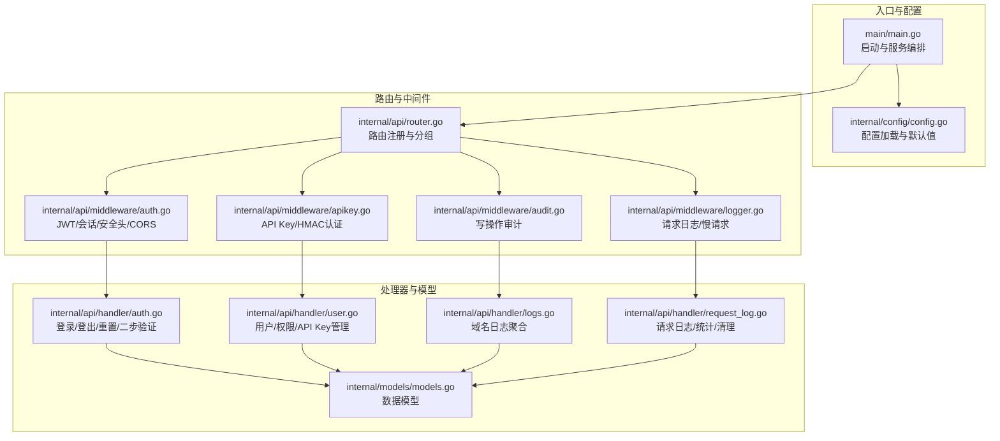
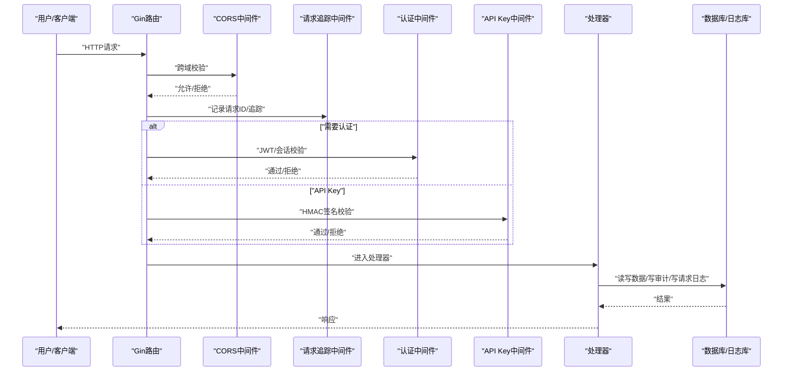
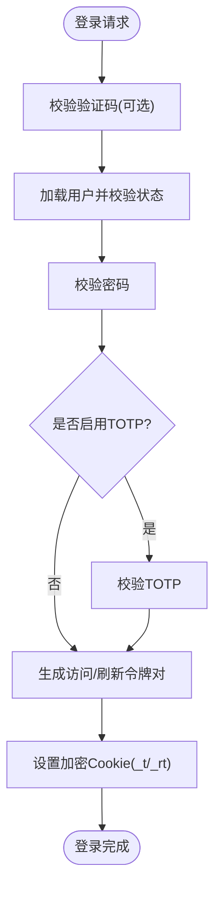
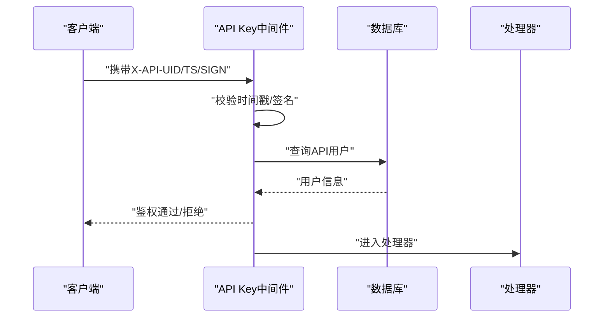
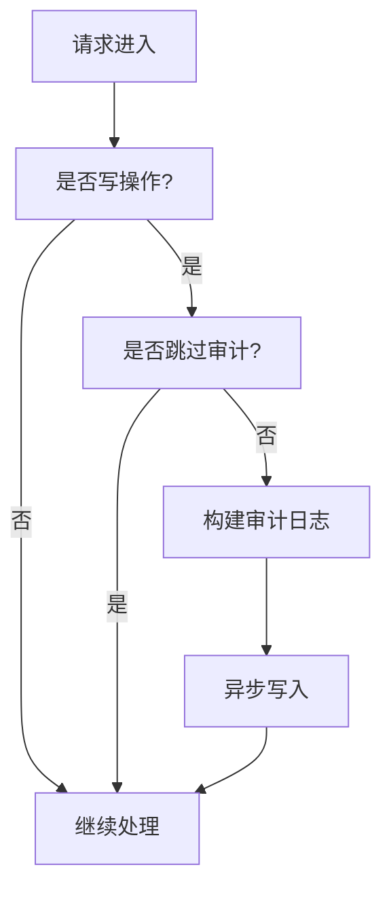
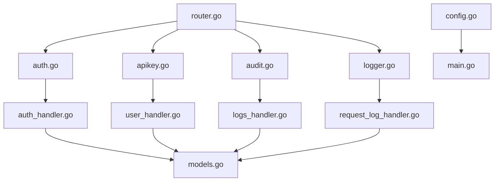

# 安全事件响应

<cite>
**本文引用的文件**
- [main.go](file://main/main.go)
- [router.go](file://main/internal/api/router.go)
- [auth.go](file://main/internal/api/middleware/auth.go)
- [apikey.go](file://main/internal/api/middleware/apikey.go)
- [audit.go](file://main/internal/api/middleware/audit.go)
- [logger.go](file://main/internal/api/middleware/logger.go)
- [auth_handler.go](file://main/internal/api/handler/auth.go)
- [user_handler.go](file://main/internal/api/handler/user.go)
- [logs_handler.go](file://main/internal/api/handler/logs.go)
- [request_log_handler.go](file://main/internal/api/handler/request_log.go)
- [config.go](file://main/internal/config/config.go)
- [models.go](file://main/internal/models/models.go)
- [password_utils.go](file://main/internal/utils/password.go)
- [sign_utils.go](file://main/internal/utils/sign.go)
- [oauth.go](file://main/internal/oauth/oauth.go)
</cite>

## 目录
1. [简介](#简介)
2. [项目结构](#项目结构)
3. [核心组件](#核心组件)
4. [架构总览](#架构总览)
5. [详细组件分析](#详细组件分析)
6. [依赖分析](#依赖分析)
7. [性能考虑](#性能考虑)
8. [故障排查指南](#故障排查指南)
9. [结论](#结论)
10. [附录](#附录)

## 简介
本指南面向DNSPlane平台的安全事件响应，围绕“识别—报告—处置—恢复—改进”的闭环流程，结合系统现有认证、审计、日志与API保护机制，提供可操作的应急响应步骤与最佳实践。内容覆盖认证攻击、API滥用、数据泄露等威胁的检测要点，以及密码重置、API密钥撤销、访问权限调整等处置动作，并给出安全配置检查清单与加固建议。

## 项目结构
DNSPlane后端采用Gin框架组织路由与中间件，核心安全能力集中在认证中间件、API Key认证、审计日志与请求日志模块。前端静态资源由嵌入FS提供，路由按模块分组，便于统一接入安全中间件。

图示来源
- [main.go:52-147](file://main/main.go#L52-L147)
- [router.go:14-165](file://main/internal/api/router.go#L14-L165)
- [auth.go:124-199](file://main/internal/api/middleware/auth.go#L124-L199)
- [apikey.go:44-105](file://main/internal/api/middleware/apikey.go#L44-L105)
- [audit.go:21-88](file://main/internal/api/middleware/audit.go#L21-L88)
- [logger.go:156-231](file://main/internal/api/middleware/logger.go#L156-L231)
- [auth_handler.go:67-161](file://main/internal/api/handler/auth.go#L67-L161)
- [user_handler.go:17-99](file://main/internal/api/handler/user.go#L17-L99)
- [logs_handler.go:27-87](file://main/internal/api/handler/logs.go#L27-L87)
- [request_log_handler.go:99-129](file://main/internal/api/handler/request_log.go#L99-L129)
- [models.go:9-31](file://main/internal/models/models.go#L9-L31)

章节来源
- [main.go:52-147](file://main/main.go#L52-L147)
- [router.go:14-165](file://main/internal/api/router.go#L14-L165)

## 核心组件
- 认证与会话
  - 基于JWT的短期访问令牌与长期刷新令牌，配合HttpOnly Cookie与AES-GCM加密，实现无状态会话与防重放。
  - 支持TOTP二步验证与密码重置邮件链路。
- API Key认证
  - HMAC-SHA256签名，时间戳±5分钟容差，常量时间比较，支持API用户专用。
- 审计与日志
  - 自动记录写操作审计，跳过敏感路径；请求日志支持按关键字/方法/日期/错误筛选，提供统计与清理。
- 安全中间件
  - CORS白名单、安全响应头、慢请求告警、请求追踪与落库。

章节来源
- [auth.go:124-199](file://main/internal/api/middleware/auth.go#L124-L199)
- [auth_handler.go:67-161](file://main/internal/api/handler/auth.go#L67-L161)
- [apikey.go:44-105](file://main/internal/api/middleware/apikey.go#L44-L105)
- [audit.go:21-88](file://main/internal/api/middleware/audit.go#L21-L88)
- [logger.go:156-231](file://main/internal/api/middleware/logger.go#L156-L231)
- [request_log_handler.go:99-129](file://main/internal/api/handler/request_log.go#L99-L129)

## 架构总览
DNSPlane的安全架构以“中间件前置、处理器聚焦业务、日志审计贯穿”为核心设计，形成“认证—授权—审计—日志”的闭环。

图示来源
- [router.go:21-25](file://main/internal/api/router.go#L21-L25)
- [auth.go:124-199](file://main/internal/api/middleware/auth.go#L124-L199)
- [apikey.go:44-105](file://main/internal/api/middleware/apikey.go#L44-L105)
- [audit.go:21-88](file://main/internal/api/middleware/audit.go#L21-L88)
- [logger.go:156-231](file://main/internal/api/middleware/logger.go#L156-L231)

## 详细组件分析

### 认证与会话（JWT/会话/安全头/CORS）
- 会话机制
  - 访问令牌短期（15分钟）、刷新令牌长期（7天），通过HttpOnly Cookie传输，使用JWT Secret派生AES密钥进行加密存储，避免明文暴露。
  - 刷新令牌JTI轮转与一次性使用校验，防止重放攻击。
- 安全头与CORS
  - 设置X-Content-Type-Options、X-Frame-Options、Strict-Transport-Security等安全头；CORS仅允许系统配置的合法来源。
- 登录与二步验证
  - 登录支持验证码与TOTP；密码重置与TOTP重置通过邮件发送一次性链接，链接带过期时间。

图示来源
- [auth_handler.go:67-161](file://main/internal/api/handler/auth.go#L67-L161)
- [auth.go:295-317](file://main/internal/api/middleware/auth.go#L295-L317)
- [auth.go:374-413](file://main/internal/api/middleware/auth.go#L374-L413)

章节来源
- [auth.go:124-199](file://main/internal/api/middleware/auth.go#L124-L199)
- [auth.go:295-317](file://main/internal/api/middleware/auth.go#L295-L317)
- [auth.go:374-413](file://main/internal/api/middleware/auth.go#L374-L413)
- [auth_handler.go:67-161](file://main/internal/api/handler/auth.go#L67-L161)

### API Key认证与滥用防护
- 认证要素
  - X-API-UID、X-API-Timestamp、X-API-Sign三要素；时间戳±5分钟容差；HMAC-SHA256签名，常量时间比较。
- 适用场景
  - API用户专用，适合自动化脚本与第三方集成；对敏感操作建议叠加TOTP或二次校验。
- 风险与处置
  - 发现异常：立即撤销API Key并生成新密钥；检查请求日志与审计日志定位来源；必要时临时封禁对应用户。

图示来源
- [apikey.go:44-105](file://main/internal/api/middleware/apikey.go#L44-L105)
- [user_handler.go:258-276](file://main/internal/api/handler/user.go#L258-L276)

章节来源
- [apikey.go:44-105](file://main/internal/api/middleware/apikey.go#L44-L105)
- [user_handler.go:258-276](file://main/internal/api/handler/user.go#L258-L276)

### 审计与请求日志（写操作审计/慢请求/统计清理）
- 审计范围
  - 自动记录POST/PUT/DELETE写操作，跳过登录/认证/部分只读接口；异步写入，避免阻塞响应。
- 请求日志
  - 支持按关键字、方法、日期、错误类型筛选；提供统计接口与清理策略（按天/保留数量）。
- 建议
  - 定期审查审计与请求日志，建立异常模式基线；对慢请求与错误率异常进行告警联动。

图示来源
- [audit.go:21-88](file://main/internal/api/middleware/audit.go#L21-L88)
- [audit.go:125-143](file://main/internal/api/middleware/audit.go#L125-L143)
- [logger.go:156-231](file://main/internal/api/middleware/logger.go#L156-L231)
- [request_log_handler.go:99-129](file://main/internal/api/handler/request_log.go#L99-L129)

章节来源
- [audit.go:21-88](file://main/internal/api/middleware/audit.go#L21-L88)
- [audit.go:125-143](file://main/internal/api/middleware/audit.go#L125-L143)
- [logger.go:156-231](file://main/internal/api/middleware/logger.go#L156-L231)
- [request_log_handler.go:99-129](file://main/internal/api/handler/request_log.go#L99-L129)

### 数据模型与敏感字段
- 用户模型包含密码哈希、API Key、TOTP密钥、重置Token等敏感字段；审计与日志均避免记录明文敏感数据。
- 建议
  - 对涉及敏感字段的变更操作，务必触发审计与日志记录；定期核对权限与状态。

章节来源
- [models.go:9-31](file://main/internal/models/models.go#L9-L31)
- [audit.go:35-87](file://main/internal/api/middleware/audit.go#L35-L87)

## 依赖分析
- 路由与中间件
  - /api组统一挂载CORS、请求追踪与安全中间件；认证与API Key中间件按需启用。
- 处理器与数据
  - 处理器依赖中间件提供的用户上下文、权限校验与日志能力；数据持久化通过GORM与独立日志库。
- 配置与运行
  - 配置文件决定JWT密钥、数据库路径、Redis缓存、日志清理策略等；默认值与随机密钥生成保障初始安全。

图示来源
- [router.go:14-165](file://main/internal/api/router.go#L14-L165)
- [auth.go:124-199](file://main/internal/api/middleware/auth.go#L124-L199)
- [apikey.go:44-105](file://main/internal/api/middleware/apikey.go#L44-L105)
- [audit.go:21-88](file://main/internal/api/middleware/audit.go#L21-L88)
- [logger.go:156-231](file://main/internal/api/middleware/logger.go#L156-L231)
- [auth_handler.go:67-161](file://main/internal/api/handler/auth.go#L67-L161)
- [user_handler.go:17-99](file://main/internal/api/handler/user.go#L17-L99)
- [logs_handler.go:27-87](file://main/internal/api/handler/logs.go#L27-L87)
- [request_log_handler.go:99-129](file://main/internal/api/handler/request_log.go#L99-L129)
- [models.go:9-31](file://main/internal/models/models.go#L9-L31)
- [config.go:82-161](file://main/internal/config/config.go#L82-L161)
- [main.go:52-147](file://main/main.go#L52-L147)

章节来源
- [router.go:14-165](file://main/internal/api/router.go#L14-L165)
- [config.go:82-161](file://main/internal/config/config.go#L82-L161)

## 性能考虑
- 认证缓存
  - 认证用户信息缓存（约30秒TTL）减少DB往返，提升高并发下的响应速度。
- 日志与审计
  - 审计异步写入，请求日志分页查询与字段裁剪降低IO压力；统计结果缓存（60秒）减少重复计算。
- 慢请求与清理
  - 控制台彩色输出与慢请求告警，结合日志清理策略，维持系统可观测性与稳定性。

章节来源
- [auth.go:442-453](file://main/internal/api/middleware/auth.go#L442-L453)
- [audit.go:74-87](file://main/internal/api/middleware/audit.go#L74-L87)
- [request_log_handler.go:28-55](file://main/internal/api/handler/request_log.go#L28-L55)
- [logger.go:156-231](file://main/internal/api/middleware/logger.go#L156-L231)

## 故障排查指南
- 常见问题定位
  - 401/403：检查Cookie是否存在、解密是否成功、Authorization头与Cookie一致性、用户状态与权限。
  - 401(API Key)：检查X-API-UID/TS/SIGN是否齐全、时间戳是否在容差范围内、签名是否常量时间比较通过。
  - 审计缺失：确认是否为写操作、是否命中跳过规则、是否异步写入成功。
  - 慢请求/错误率上升：查看请求日志统计与最近错误列表，定位热点接口与错误堆栈。
- 处置步骤
  - 隔离：临时封禁可疑用户或API Key，撤销相关会话。
  - 影响评估：基于审计与请求日志回溯操作范围与受影响数据。
  - 恢复：修复配置/密钥，恢复服务，持续监控。
  - 记录与改进：完善告警策略、加固认证与日志机制。

章节来源
- [auth.go:124-199](file://main/internal/api/middleware/auth.go#L124-L199)
- [apikey.go:44-105](file://main/internal/api/middleware/apikey.go#L44-L105)
- [audit.go:21-88](file://main/internal/api/middleware/audit.go#L21-L88)
- [request_log_handler.go:209-251](file://main/internal/api/handler/request_log.go#L209-L251)

## 结论
DNSPlane在认证、审计与日志方面具备较为完善的内置能力，建议在实际运营中结合本文的操作指南，建立常态化的安全监控与应急响应流程，确保在发生安全事件时能够快速、有序地完成识别、报告、处置与恢复。

## 附录

### 安全事件响应标准操作程序（SOP）
- 识别
  - 关注慢请求与错误率异常、异常登录行为、批量写操作、API Key异常调用。
- 报告
  - 记录事件时间、影响范围、初步原因与处置建议；通知安全与运维团队。
- 处置
  - 隔离：封禁用户/撤销API Key/吊销会话；对可疑来源做网络层面阻断。
  - 影响评估：回溯审计与请求日志，确定受影响数据与用户。
  - 恢复：修复配置/密钥，恢复服务，验证功能正常。
- 改进
  - 优化告警策略、加强认证与日志策略、补充自动化处置流程。

### 安全威胁检测要点
- 认证攻击
  - 登录暴力破解：验证码开关、登录失败次数与速率限制（系统支持）。
  - 会话劫持：检查Cookie加密与HttpOnly设置、HTTPS强制。
  - 重放攻击：刷新令牌JTI轮转与一次性使用、CORS白名单。
- API滥用
  - API Key泄露：立即撤销并生成新密钥；检查签名与时间戳。
  - 无权限调用：确认权限校验与审计覆盖。
- 数据泄露
  - 审计覆盖写操作，避免敏感字段明文记录；定期审查审计与日志。

章节来源
- [auth.go:124-199](file://main/internal/api/middleware/auth.go#L124-L199)
- [auth.go:374-413](file://main/internal/api/middleware/auth.go#L374-L413)
- [apikey.go:44-105](file://main/internal/api/middleware/apikey.go#L44-L105)
- [audit.go:21-88](file://main/internal/api/middleware/audit.go#L21-L88)

### 应急处置操作步骤
- 密码重置
  - 通过邮件发送一次性链接，设置过期时间；记录发送与访问日志。
- API密钥撤销与重置
  - 禁用API用户或清空API Key；管理员重置新密钥并下发。
- 访问权限调整
  - 调整用户状态（启用/禁用）、权限范围与过期时间；必要时清空认证缓存使变更即时生效。

章节来源
- [auth_handler.go:482-576](file://main/internal/api/handler/auth.go#L482-L576)
- [auth_handler.go:578-670](file://main/internal/api/handler/auth.go#L578-L670)
- [user_handler.go:258-276](file://main/internal/api/handler/user.go#L258-L276)
- [user_handler.go:101-151](file://main/internal/api/handler/user.go#L101-L151)
- [auth.go:459-463](file://main/internal/api/middleware/auth.go#L459-L463)

### 安全配置检查清单
- 认证
  - JWT密钥是否随机且妥善保管；会话Cookie是否HttpOnly+Samesite+Secure；CORS白名单是否最小化。
- API Key
  - API Key是否启用；签名算法与时间戳容差是否合理；是否定期轮换。
- 日志与审计
  - 审计是否覆盖写操作；请求日志是否保留足够信息；统计与清理策略是否合理。
- 配置
  - 默认配置是否已修改（如JWT密钥、数据库路径）；日志清理是否开启。

章节来源
- [config.go:82-161](file://main/internal/config/config.go#L82-L161)
- [auth.go:469-482](file://main/internal/api/middleware/auth.go#L469-L482)
- [logger.go:156-231](file://main/internal/api/middleware/logger.go#L156-L231)
- [request_log_handler.go:253-334](file://main/internal/api/handler/request_log.go#L253-L334)

### 与安全团队协作与外部响应机制
- 内部协作
  - 明确事件分级与响应时限；建立跨团队沟通渠道与责任矩阵。
- 外部响应
  - 必要时联系供应商/托管方协助取证与溯源；遵循合规要求进行数据留存与上报。

[本节为概念性指导，不直接分析具体文件]

### 安全日志分析方法与异常行为识别
- 方法
  - 使用关键字/方法/日期/错误筛选定位异常；关注慢请求与错误堆栈；对比历史趋势发现突增。
- 异常识别
  - IP/UA异常、高频失败、批量写操作、绕过CORS/安全头的行为。

章节来源
- [request_log_handler.go:67-91](file://main/internal/api/handler/request_log.go#L67-L91)
- [request_log_handler.go:209-251](file://main/internal/api/handler/request_log.go#L209-L251)
- [logger.go:156-231](file://main/internal/api/middleware/logger.go#L156-L231)

### 密码强度与TOTP加固建议
- 密码强度
  - 建议采用强密码策略（长度≥8、包含大小写字母与数字）。
- TOTP
  - 启用二步验证；对管理员账户强制开启；定期轮换密钥。

章节来源
- [password_utils.go:17-45](file://main/internal/utils/password.go#L17-L45)
- [auth_handler.go:304-384](file://main/internal/api/handler/auth.go#L304-L384)

### OAuth与第三方集成安全
- 配置
  - 仅启用已配置的提供商；密钥妥善保管；授权回调URL严格校验。
- 风险
  - 未配置提供商不应对外暴露；回调参数需校验与防重放。

章节来源
- [oauth.go:78-98](file://main/internal/oauth/oauth.go#L78-L98)
- [oauth.go:126-142](file://main/internal/oauth/oauth.go#L126-L142)