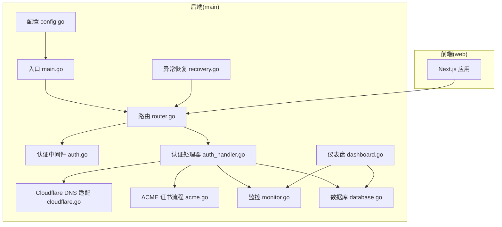
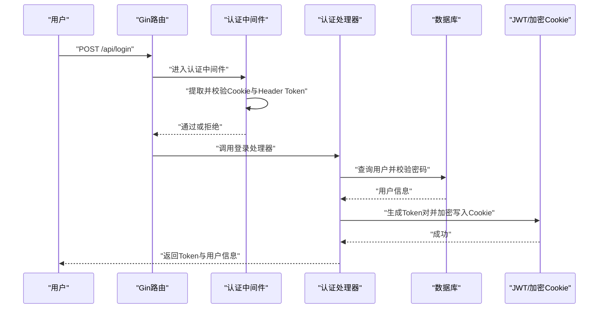
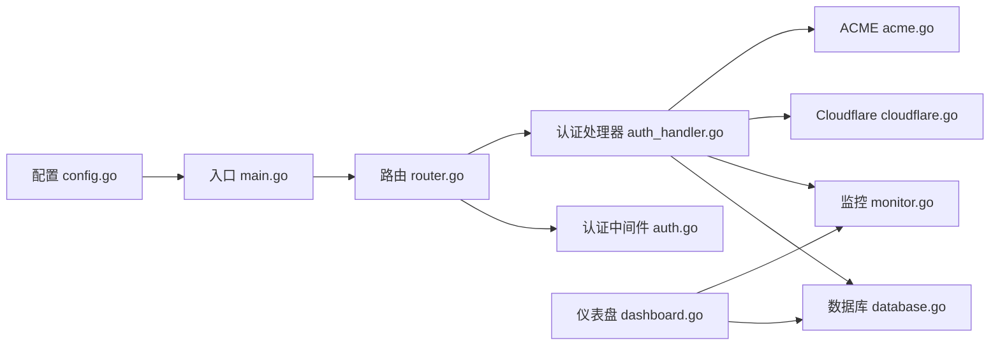

# 常见问题解决

<cite>
**本文引用的文件**
- [main.go](file://main/main.go)
- [README.md](file://README.md)
- [config.go](file://main/internal/config/config.go)
- [router.go](file://main/internal/api/router.go)
- [auth.go](file://main/internal/api/middleware/auth.go)
- [auth_handler.go](file://main/internal/api/handler/auth.go)
- [cloudflare.go](file://main/internal/dns/providers/cloudflare/cloudflare.go)
- [acme.go](file://main/internal/cert/acme/acme.go)
- [monitor.go](file://main/internal/monitor/monitor.go)
- [dashboard.go](file://main/internal/api/handler/dashboard.go)
- [database.go](file://main/internal/database/database.go)
- [recovery.go](file://main/internal/api/middleware/recovery.go)
</cite>

## 目录
1. [简介](#简介)
2. [项目结构](#项目结构)
3. [核心组件](#核心组件)
4. [架构总览](#架构总览)
5. [详细组件分析](#详细组件分析)
6. [依赖分析](#依赖分析)
7. [性能考虑](#性能考虑)
8. [故障排查指南](#故障排查指南)
9. [结论](#结论)
10. [附录](#附录)

## 简介
本指南面向DNSPlane用户与运维人员，聚焦安装、配置与使用过程中的常见问题，覆盖DNS服务商集成、证书申请与部署、API调用、权限认证、系统状态检查与健康检查等主题。文档提供症状描述、可能原因分析、具体解决步骤、配置修正方法与最佳实践，并给出问题自检清单与快速修复方案。

## 项目结构
DNSPlane采用前后端一体化的Go后端与Next.js前端混合架构，后端负责API、认证、数据库、监控与证书流程，前端提供仪表盘与交互界面。后端通过嵌入式静态资源提供前端页面，统一由Gin路由分发。

图表来源
- [main.go:52-147](file://main/main.go#L52-L147)
- [router.go:14-275](file://main/internal/api/router.go#L14-L275)
- [auth.go:124-199](file://main/internal/api/middleware/auth.go#L124-L199)
- [auth_handler.go:67-161](file://main/internal/api/handler/auth.go#L67-L161)
- [cloudflare.go:17-51](file://main/internal/dns/providers/cloudflare/cloudflare.go#L17-L51)
- [acme.go:36-67](file://main/internal/cert/acme/acme.go#L36-L67)
- [monitor.go:56-91](file://main/internal/monitor/monitor.go#L56-L91)
- [database.go:73-149](file://main/internal/database/database.go#L73-L149)
- [dashboard.go:41-129](file://main/internal/api/handler/dashboard.go#L41-L129)
- [recovery.go:15-74](file://main/internal/api/middleware/recovery.go#L15-L74)

章节来源
- [main.go:1-148](file://main/main.go#L1-L148)
- [README.md:1-172](file://README.md#L1-L172)

## 核心组件
- 配置管理：负责加载与持久化配置，支持JWT密钥生成、日志清理策略、Redis缓存、数据库驱动与连接参数。
- 认证与权限：基于JWT的短期访问令牌与长期刷新令牌，支持TOTP二步验证、Cookie加密存储、CORS与安全头。
- DNS提供商适配：以Cloudflare为例，封装API调用、错误解析与域名/记录查询。
- 证书管理：ACME客户端，支持Let’s Encrypt、ZeroSSL等，提供订单创建、验证、签发与错误诊断。
- 监控与容灾：定时任务扫描主备节点健康，自动切换/恢复并记录日志与发送通知。
- 数据库：主库与日志/请求日志分离，SQLite/WAL优化与连接池配置。
- 仪表盘与系统状态：提供系统统计、通知测试、代理连通性测试、定时任务状态与缓存清理。

章节来源
- [config.go:82-161](file://main/internal/config/config.go#L82-L161)
- [auth.go:124-199](file://main/internal/api/middleware/auth.go#L124-L199)
- [cloudflare.go:138-141](file://main/internal/dns/providers/cloudflare/cloudflare.go#L138-L141)
- [acme.go:508-800](file://main/internal/cert/acme/acme.go#L508-L800)
- [monitor.go:376-443](file://main/internal/monitor/monitor.go#L376-L443)
- [database.go:73-149](file://main/internal/database/database.go#L73-L149)
- [dashboard.go:131-205](file://main/internal/api/handler/dashboard.go#L131-L205)

## 架构总览
后端启动时加载配置、初始化数据库与缓存、注册监控与后台任务、启动HTTP服务。API路由按需挂载认证中间件，认证处理器负责登录、登出、用户信息与密码/TOTP管理。DNS与证书模块通过Provider接口抽象不同服务商，监控模块周期性执行健康检查并触发切换。

图表来源
- [router.go:24-40](file://main/internal/api/router.go#L24-L40)
- [auth.go:124-199](file://main/internal/api/middleware/auth.go#L124-L199)
- [auth_handler.go:67-161](file://main/internal/api/handler/auth.go#L67-L161)

## 详细组件分析

### 认证与权限问题
- 症状
  - “未登录/Token无效/账户被禁用”
  - “会话已过期”或“Token不一致”
  - “需要进行二步验证”或TOTP错误
- 可能原因
  - Cookie未正确设置或被浏览器拦截
  - Header携带的Bearer Token与Cookie中的Token不一致
  - JWT密钥变更导致历史Cookie失效
  - 用户被禁用或权限不足
  - TOTP未启用或验证码错误
- 解决步骤
  - 确认浏览器支持Cookie且未禁用第三方Cookie
  - 确保请求同时携带HttpOnly Cookie与Authorization头
  - 若更换JWT密钥，需重新登录以刷新Cookie
  - 检查用户状态与权限等级
  - 启用并正确输入TOTP验证码
- 最佳实践
  - 使用HTTPS部署，确保Cookie Secure属性生效
  - 定期轮换JWT密钥并做好Cookie刷新
  - 为管理员开启TOTP增强安全性

章节来源
- [auth.go:124-199](file://main/internal/api/middleware/auth.go#L124-L199)
- [auth_handler.go:67-161](file://main/internal/api/handler/auth.go#L67-L161)
- [auth_handler.go:285-384](file://main/internal/api/handler/auth.go#L285-L384)

### DNS服务商集成问题（以Cloudflare为例）
- 症状
  - “检查账户失败/域名列表为空”
  - “API返回未知错误/认证失败”
  - “记录查询/增删改失败”
- 可能原因
  - API Key类型错误（全局Key与令牌混淆）
  - 认证头缺失或格式不正确
  - 服务商返回success=false但未解析错误消息
  - 网络超时或DNS解析异常
- 解决步骤
  - 确认使用正确的API Key类型（全局Key或令牌）
  - 检查请求头是否包含X-Auth-Key或Authorization
  - 查看lastErr或响应中的错误消息并修正配置
  - 在防火墙/代理环境中确认出站访问
- 最佳实践
  - 优先使用令牌而非全局Key
  - 为不同账户配置独立的API凭据
  - 定期轮换密钥并限制权限范围

章节来源
- [cloudflare.go:57-61](file://main/internal/dns/providers/cloudflare/cloudflare.go#L57-L61)
- [cloudflare.go:93-104](file://main/internal/dns/providers/cloudflare/cloudflare.go#L93-L104)
- [cloudflare.go:121-135](file://main/internal/dns/providers/cloudflare/cloudflare.go#L121-L135)

### 证书申请与部署问题（ACME）
- 症状
  - “创建订单失败/授权状态pending/invalid”
  - “签发失败/未获取到证书下载地址”
  - “EAB HMAC Key解码失败”
- 可能原因
  - ACME目录URL不可达或网络受限
  - 未正确配置EAB参数（ZeroSSL等）
  - 未正确添加DNS TXT/CNAME验证记录
  - 账户注册或JWK签名失败
- 解决步骤
  - 校验ACME目录URL可达性与证书链
  - 按提供商要求配置邮箱与EAB参数
  - 在DNS中添加ACME挑战所需的TXT/CNAME记录
  - 检查账户私钥格式与JWK生成
- 最佳实践
  - 先在沙箱环境测试（staging）再正式签发
  - 为通配符与根域名分别添加验证记录
  - 记录并跟踪订单状态与错误详情

章节来源
- [acme.go:242-260](file://main/internal/cert/acme/acme.go#L242-L260)
- [acme.go:476-500](file://main/internal/cert/acme/acme.go#L476-L500)
- [acme.go:658-733](file://main/internal/cert/acme/acme.go#L658-L733)
- [acme.go:735-800](file://main/internal/cert/acme/acme.go#L735-L800)

### API调用错误
- 症状
  - “401未登录/403权限不足”
  - “500服务器内部错误”
  - “CORS跨域失败/Origin不被允许”
- 可能原因
  - 缺少Authorization头或Cookie
  - JWT签名密钥不一致或过期
  - CORS配置与site_url不匹配
  - 服务端panic导致500
- 解决步骤
  - 确保同时携带Cookie与Bearer Token
  - 检查JWT密钥一致性与过期时间
  - 配置正确的site_url并确保Origin匹配
  - 查看日志中的堆栈信息定位panic
- 最佳实践
  - 前端统一携带Cookie与Authorization
  - 生产环境使用HTTPS与严格CORS策略

章节来源
- [auth.go:124-199](file://main/internal/api/middleware/auth.go#L124-L199)
- [router.go:490-508](file://main/internal/api/router.go#L490-L508)
- [recovery.go:15-74](file://main/internal/api/middleware/recovery.go#L15-L74)

### 系统状态检查与健康检查
- 症状
  - “监控服务未运行/任务未执行”
  - “切换/恢复未发生/通知未发送”
  - “数据库连接异常/VACUUM失败”
- 可能原因
  - 监控服务未启动或被意外停止
  - 任务频率设置过短或并发冲突
  - 通知渠道未配置或不可达
  - 数据库驱动/连接参数错误
- 解决步骤
  - 通过仪表盘统计确认监控运行状态
  - 检查任务配置（频率、阈值、自动切换/恢复）
  - 测试邮件/Telegram/Webhook等通知通道
  - 校验数据库驱动与连接参数，必要时切换SQLite/WAL
- 最佳实践
  - 定期清理日志与请求日志，控制数据库体积
  - 使用独立日志数据库与请求日志数据库提升稳定性

章节来源
- [monitor.go:63-91](file://main/internal/monitor/monitor.go#L63-L91)
- [monitor.go:130-152](file://main/internal/monitor/monitor.go#L130-L152)
- [dashboard.go:367-402](file://main/internal/api/handler/dashboard.go#L367-L402)
- [database.go:73-149](file://main/internal/database/database.go#L73-L149)

## 依赖分析
后端通过embed将前端静态资源打包，统一由Gin路由处理API与页面请求。认证中间件依赖JWT与Cookie加密，DNS与证书模块通过Provider接口抽象不同服务商，监控模块依赖数据库与通知模块。

图表来源
- [main.go:14-47](file://main/main.go#L14-L47)
- [router.go:14-275](file://main/internal/api/router.go#L14-L275)
- [auth.go:124-199](file://main/internal/api/middleware/auth.go#L124-L199)
- [auth_handler.go:67-161](file://main/internal/api/handler/auth.go#L67-L161)
- [cloudflare.go:17-51](file://main/internal/dns/providers/cloudflare/cloudflare.go#L17-L51)
- [acme.go:36-67](file://main/internal/cert/acme/acme.go#L36-L67)
- [monitor.go:56-91](file://main/internal/monitor/monitor.go#L56-L91)
- [database.go:73-149](file://main/internal/database/database.go#L73-L149)
- [dashboard.go:41-129](file://main/internal/api/handler/dashboard.go#L41-L129)

## 性能考虑
- 数据库优化
  - SQLite启用WAL、调整缓存与连接池，提高并发读取性能
  - MySQL设置合适的连接池参数与生命周期
- 监控与日志
  - 分离日志数据库与请求日志数据库，降低主库压力
  - 定期清理日志与请求日志，控制文件体积
- 前端静态资源
  - 嵌入式FS提供静态资源，减少外部依赖

章节来源
- [database.go:34-71](file://main/internal/database/database.go#L34-L71)
- [database.go:105-128](file://main/internal/database/database.go#L105-L128)
- [dashboard.go:529-558](file://main/internal/api/handler/dashboard.go#L529-L558)

## 故障排查指南

### 通用自检清单
- 系统与网络
  - 服务是否正常启动（查看启动日志）
  - 端口占用与防火墙放行
  - 代理/CDN是否影响ACME验证
- 配置与凭据
  - config.json是否正确加载与持久化
  - JWT密钥是否一致且未被意外更改
  - DNS与证书提供商的API凭据是否正确
- 认证与权限
  - Cookie与Authorization头是否同时存在
  - 用户状态是否正常、权限是否足够
  - TOTP是否启用且验证码正确
- 数据库与监控
  - 数据库驱动与连接参数是否正确
  - 监控服务是否运行，任务是否按时执行
  - 通知渠道是否配置并可连通

### 快速修复方案
- 安装与首次登录
  - 通过安装接口创建管理员账户，随后登录并修改默认密码
- 配置修正
  - 重新生成config.json并保存，确保数据库路径与驱动正确
  - 如需更换JWT密钥，需重新登录以刷新Cookie
- DNS提供商
  - 使用令牌而非全局Key；检查请求头与域名ID
  - 确认服务商返回的错误消息并修正配置
- 证书申请
  - 在DNS中添加ACME验证记录；先在staging测试
  - 按提供商要求配置邮箱与EAB参数
- API调用
  - 统一携带Cookie与Authorization头
  - 校验CORS配置与site_url
- 监控与通知
  - 检查任务配置与阈值；测试通知渠道
  - 清理日志数据库与请求日志数据库，释放空间

章节来源
- [auth_handler.go:231-283](file://main/internal/api/handler/auth.go#L231-L283)
- [config.go:82-161](file://main/internal/config/config.go#L82-L161)
- [cloudflare.go:138-141](file://main/internal/dns/providers/cloudflare/cloudflare.go#L138-L141)
- [acme.go:508-800](file://main/internal/cert/acme/acme.go#L508-L800)
- [router.go:490-508](file://main/internal/api/router.go#L490-L508)
- [monitor.go:376-443](file://main/internal/monitor/monitor.go#L376-L443)
- [dashboard.go:272-285](file://main/internal/api/handler/dashboard.go#L272-L285)

## 结论
通过本指南，用户可以系统地定位与解决DNSPlane在安装、配置与使用过程中的常见问题。建议在生产环境遵循HTTPS、TOTP、最小权限与定期备份等最佳实践，并利用内置的系统状态检查与健康检查功能持续监控系统运行状况。

## 附录

### 社区支持与获取帮助
- 文档与示例：参考项目README中的功能特性、API接口与编译发布说明
- 问题反馈：在仓库中提交Issue，附上系统信息、日志与复现步骤
- 前端与后端依赖：按README指引安装与构建

章节来源
- [README.md:1-172](file://README.md#L1-L172)