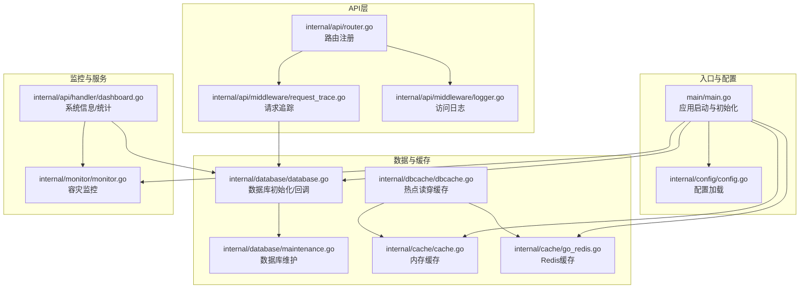
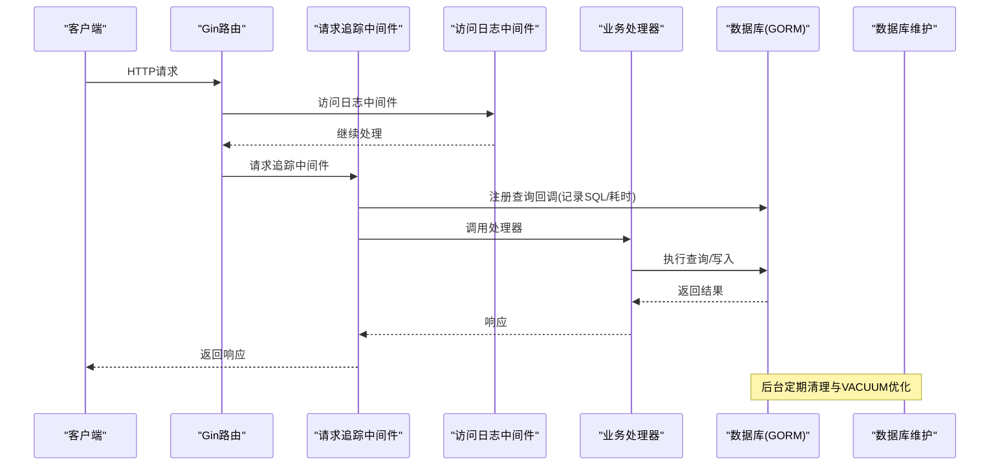
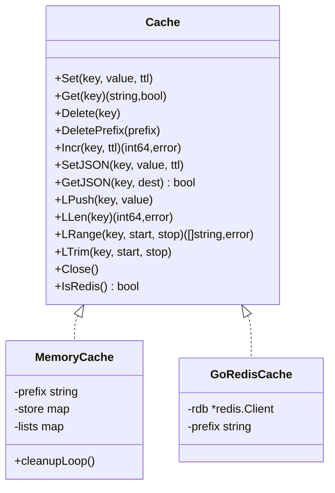
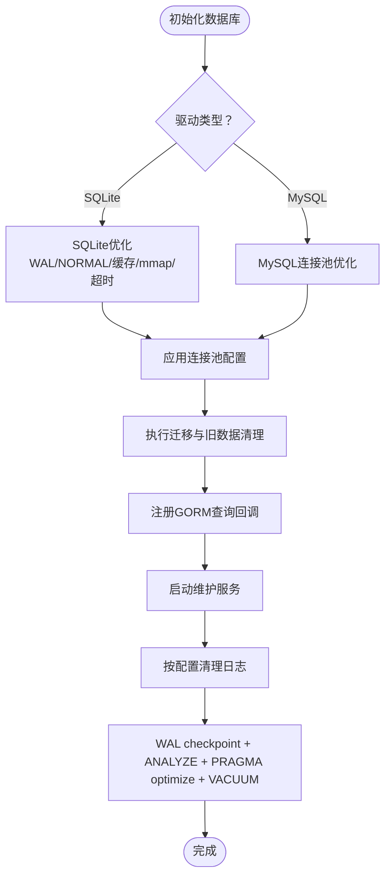
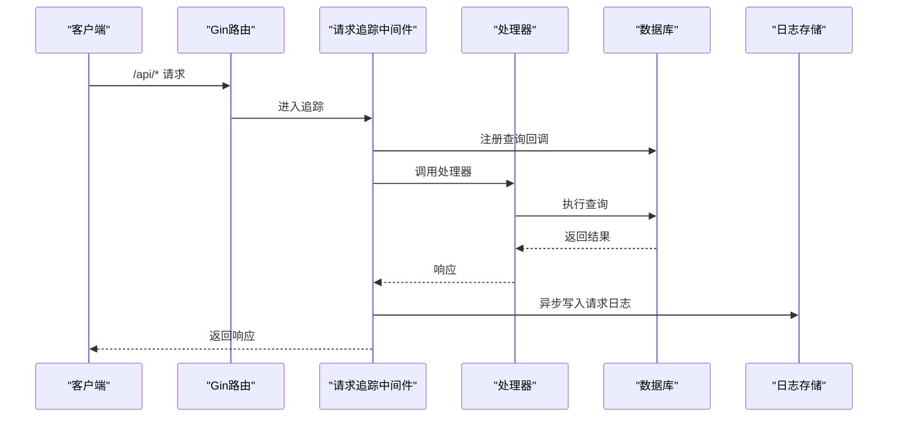
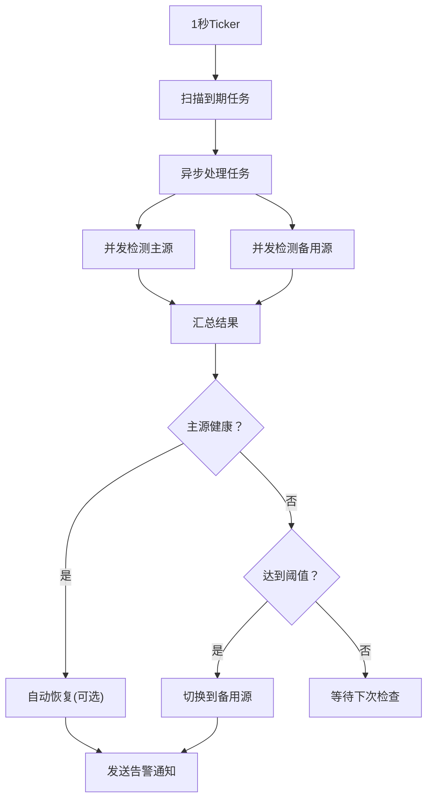
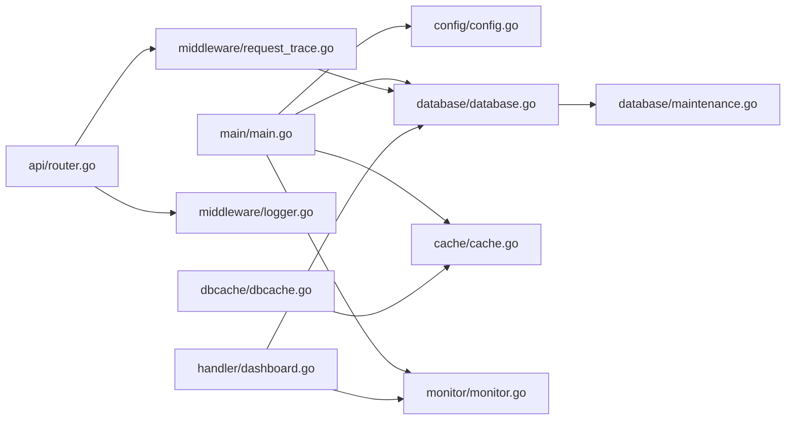

# 性能诊断

<cite>
**本文引用的文件**
- [main.go](file://main/main.go)
- [cache.go](file://main/internal/cache/cache.go)
- [go_redis.go](file://main/internal/cache/go_redis.go)
- [dbcache.go](file://main/internal/dbcache/dbcache.go)
- [database.go](file://main/internal/database/database.go)
- [maintenance.go](file://main/internal/database/maintenance.go)
- [router.go](file://main/internal/api/router.go)
- [request_trace.go](file://main/internal/api/middleware/request_trace.go)
- [logger.go](file://main/internal/api/middleware/logger.go)
- [dashboard.go](file://main/internal/api/handler/dashboard.go)
- [monitor.go](file://main/internal/monitor/monitor.go)
- [config.go](file://main/internal/config/config.go)
</cite>

## 目录
1. [简介](#简介)
2. [项目结构](#项目结构)
3. [核心组件](#核心组件)
4. [架构总览](#架构总览)
5. [详细组件分析](#详细组件分析)
6. [依赖分析](#依赖分析)
7. [性能考量](#性能考量)
8. [故障排查指南](#故障排查指南)
9. [结论](#结论)
10. [附录](#附录)

## 简介
本指南面向DNSPlane项目的性能诊断与优化，聚焦以下方面：
- CPU与内存使用监控与分析
- 数据库查询性能与维护策略
- 缓存系统（Redis/内存）配置与优化
- API响应时间分析与瓶颈定位
- 性能监控工具与关键指标解读
- 常见性能问题的解决方案与预防措施

## 项目结构
DNSPlane采用Go语言与Gin框架构建后端，前端为Next.js应用。后端核心由API路由、中间件、缓存、数据库、监控与服务组成。整体结构清晰，便于分层定位性能问题。

**图表来源**
- [main.go:52-147](file://main/main.go#L52-L147)
- [router.go:14-275](file://main/internal/api/router.go#L14-L275)
- [request_trace.go:58-192](file://main/internal/api/middleware/request_trace.go#L58-L192)
- [logger.go:152-231](file://main/internal/api/middleware/logger.go#L152-L231)
- [database.go:73-149](file://main/internal/database/database.go#L73-L149)
- [maintenance.go:110-133](file://main/internal/database/maintenance.go#L110-L133)
- [dbcache.go:14-69](file://main/internal/dbcache/dbcache.go#L14-L69)
- [cache.go:47-94](file://main/internal/cache/cache.go#L47-L94)
- [monitor.go:63-91](file://main/internal/monitor/monitor.go#L63-L91)
- [dashboard.go:529-558](file://main/internal/api/handler/dashboard.go#L529-L558)

**章节来源**
- [main.go:52-147](file://main/main.go#L52-L147)
- [router.go:14-275](file://main/internal/api/router.go#L14-L275)

## 核心组件
- 应用启动与初始化：负责配置加载、数据库初始化、缓存初始化、监控启动、后台任务与维护服务启动、HTTP服务启动。
- API路由与中间件：统一注册API路由，提供认证、CORS、日志、请求追踪等中间件。
- 数据库与维护：支持SQLite与MySQL，针对SQLite进行WAL、缓存、连接池优化，并提供定期清理与VACUUM优化。
- 缓存系统：支持Redis与内存两种后端，具备键空间前缀、列表操作、过期与原子递增等能力。
- 监控与容灾：定时扫描监控任务，异步并发检测主备源健康，自动切换/恢复并记录日志。
- 系统信息与统计：提供系统运行信息、内存/CPU/Goroutine、数据库大小与维护统计等。

**章节来源**
- [main.go:62-111](file://main/main.go#L62-L111)
- [database.go:73-149](file://main/internal/database/database.go#L73-L149)
- [maintenance.go:110-133](file://main/internal/database/maintenance.go#L110-L133)
- [cache.go:47-94](file://main/internal/cache/cache.go#L47-L94)
- [monitor.go:63-91](file://main/internal/monitor/monitor.go#L63-L91)
- [dashboard.go:529-558](file://main/internal/api/handler/dashboard.go#L529-L558)

## 架构总览
DNSPlane后端采用“入口启动→中间件链路→业务处理器→数据层”的分层设计。请求通过Gin路由进入，经由日志与追踪中间件，再进入业务处理器；数据库通过GORM回调记录查询耗时与SQL；缓存层支持Redis与内存，dbcache提供热点读穿缓存；监控服务后台运行，定期扫描任务并执行切换。

**图表来源**
- [router.go:14-275](file://main/internal/api/router.go#L14-L275)
- [request_trace.go:58-192](file://main/internal/api/middleware/request_trace.go#L58-L192)
- [database.go:367-404](file://main/internal/database/database.go#L367-L404)
- [maintenance.go:165-197](file://main/internal/database/maintenance.go#L165-L197)

## 详细组件分析

### 缓存系统（Redis/内存）
- 初始化策略：优先尝试Redis连接，失败则回退到内存缓存；支持连接池大小与最小空闲连接配置；键空间前缀避免多环境冲突。
- 能力覆盖：字符串、JSON、原子递增、列表（LPush/LRange/LTrim/LLen）、前缀删除、关闭。
- 读穿缓存：dbcache提供GetOrSetJSON，命中反序列化，未命中执行load并写入缓存，支持TTL。

**图表来源**
- [cache.go:15-31](file://main/internal/cache/cache.go#L15-L31)
- [cache.go:96-308](file://main/internal/cache/cache.go#L96-L308)
- [go_redis.go:12-137](file://main/internal/cache/go_redis.go#L12-L137)

**章节来源**
- [cache.go:47-94](file://main/internal/cache/cache.go#L47-L94)
- [go_redis.go:18-137](file://main/internal/cache/go_redis.go#L18-L137)
- [dbcache.go:14-69](file://main/internal/dbcache/dbcache.go#L14-L69)

### 数据库与查询性能
- 驱动选择：SQLite与MySQL；SQLite启用WAL、NORMAL同步、64MB缓存、mmap、超时与连接池；MySQL提高连接池上限与生命周期。
- 查询回调：GORM注册Query/Create/Update/Delete/Row/Raw回调，记录SQL、耗时、影响行数与错误；仅在请求追踪开启时记录，避免高开销路径。
- 迁移与旧数据清理：迁移日志表至独立数据库，批量迁移并清理旧表，随后VACUUM。
- 维护服务：按配置清理操作日志、证书日志、监控检查日志、容灾切换日志与请求日志；定时执行WAL checkpoint、ANALYZE、PRAGMA optimize、VACUUM并恢复WAL模式。

**图表来源**
- [database.go:73-149](file://main/internal/database/database.go#L73-L149)
- [database.go:367-404](file://main/internal/database/database.go#L367-L404)
- [maintenance.go:110-133](file://main/internal/database/maintenance.go#L110-L133)
- [maintenance.go:201-250](file://main/internal/database/maintenance.go#L201-L250)
- [maintenance.go:275-325](file://main/internal/database/maintenance.go#L275-L325)

**章节来源**
- [database.go:73-149](file://main/internal/database/database.go#L73-L149)
- [database.go:367-404](file://main/internal/database/database.go#L367-L404)
- [maintenance.go:110-133](file://main/internal/database/maintenance.go#L110-L133)
- [maintenance.go:201-250](file://main/internal/database/maintenance.go#L201-L250)
- [maintenance.go:275-325](file://main/internal/database/maintenance.go#L275-L325)

### API响应时间分析与瓶颈定位
- 请求追踪中间件：为/api路径请求生成请求ID，记录方法、路径、头、请求体、状态码、耗时、错误信息、数据库查询集合与总耗时；异步落库请求日志。
- 访问日志中间件：控制台彩色输出，区分慢请求（≥3秒）与错误；过滤静态资源与特定路径，避免日志文件膨胀。
- 仪表盘统计：并行查询多个只读统计，避免注入gin_context导致回调并发写db_queries竞态；提供系统信息（内存、CPU、Goroutine、数据库大小、维护统计）。

**图表来源**
- [request_trace.go:58-192](file://main/internal/api/middleware/request_trace.go#L58-L192)
- [logger.go:152-231](file://main/internal/api/middleware/logger.go#L152-L231)
- [router.go:14-275](file://main/internal/api/router.go#L14-L275)

**章节来源**
- [request_trace.go:58-192](file://main/internal/api/middleware/request_trace.go#L58-L192)
- [logger.go:152-231](file://main/internal/api/middleware/logger.go#L152-L231)
- [dashboard.go:41-129](file://main/internal/api/handler/dashboard.go#L41-L129)

### 监控与容灾
- 主循环：1秒扫描到期任务，60秒更新运行状态；并发检测主源与备用源，记录健康状态与耗时。
- 切换/恢复：根据阈值与状态自动切换到备用源或恢复主源，记录日志并发送通知；支持暂停/删除/重建等多种策略。
- 通知：支持邮件、Telegram、Webhook、Discord、企业微信等渠道。

**图表来源**
- [monitor.go:93-152](file://main/internal/monitor/monitor.go#L93-L152)
- [monitor.go:154-318](file://main/internal/monitor/monitor.go#L154-L318)

**章节来源**
- [monitor.go:63-91](file://main/internal/monitor/monitor.go#L63-L91)
- [monitor.go:154-318](file://main/internal/monitor/monitor.go#L154-L318)

## 依赖分析
- 启动阶段：main.go依赖配置、数据库、缓存、监控、服务与日志存储；注册数据库回调与启动维护服务。
- API层：router注册路由，middleware提供日志与追踪；handler调用数据库与服务。
- 数据层：database封装GORM配置、回调与维护；maintenance提供清理与VACUUM；dbcache基于cache抽象。
- 缓存层：cache抽象统一内存与Redis；dbcache提供读穿缓存。
- 监控层：monitor后台任务扫描与切换，依赖DNS提供商接口与通知模块。

**图表来源**
- [main.go:52-147](file://main/main.go#L52-L147)
- [router.go:14-275](file://main/internal/api/router.go#L14-L275)
- [request_trace.go:58-192](file://main/internal/api/middleware/request_trace.go#L58-L192)
- [logger.go:152-231](file://main/internal/api/middleware/logger.go#L152-L231)
- [database.go:73-149](file://main/internal/database/database.go#L73-L149)
- [maintenance.go:110-133](file://main/internal/database/maintenance.go#L110-L133)
- [dbcache.go:14-69](file://main/internal/dbcache/dbcache.go#L14-L69)
- [cache.go:47-94](file://main/internal/cache/cache.go#L47-L94)
- [monitor.go:63-91](file://main/internal/monitor/monitor.go#L63-L91)
- [dashboard.go:529-558](file://main/internal/api/handler/dashboard.go#L529-L558)

**章节来源**
- [main.go:52-147](file://main/main.go#L52-L147)
- [router.go:14-275](file://main/internal/api/router.go#L14-L275)

## 性能考量
- CPU与内存
  - 使用系统信息接口查看内存分配、系统内存、Goroutine数量与CPU核数，结合日志中间件的慢请求标记定位热点接口。
  - 定期触发垃圾回收（示例：仪表盘清理缓存时触发GC），在低峰时段执行以降低抖动。
- 数据库查询
  - 仅在请求追踪开启时记录查询回调，避免不必要的开销；关注数据库回调记录的SQL与耗时，定位慢查询。
  - SQLite启用WAL与缓存优化，MySQL提升连接池上限；定期VACUUM与ANALYZE保持索引统计有效。
- 缓存
  - Redis连接池大小与最小空闲连接按负载调整；键空间前缀避免多环境冲突；热点数据使用dbcache读穿缓存并设置合理TTL。
- API响应时间
  - 通过请求追踪中间件聚合数据库查询耗时与总耗时；结合日志中间件慢请求阈值（≥3秒）进行报警与优化。
- 监控与容灾
  - 主循环1秒扫描，注意并发检测带来的瞬时负载；合理设置任务频率与超时，避免频繁切换造成抖动。

[本节为通用指导，无需列出具体文件来源]

## 故障排查指南
- CPU/内存飙升
  - 查看系统信息接口确认内存分配、系统内存、Goroutine数量与CPU核数；结合慢请求日志定位热点接口。
  - 在低峰时段执行数据库VACUUM与ANALYZE，释放空间并更新统计信息。
- 数据库查询缓慢
  - 检查请求追踪中间件记录的数据库查询集合与总耗时；关注长SQL与高耗时查询；确认SQLite/MySQL优化参数生效。
  - 根据维护配置清理过期日志，避免表膨胀影响查询性能。
- 缓存不可用或回退
  - 检查Redis连接参数与连接池配置；若连接失败，系统会回退到内存缓存；建议优先修复Redis连接。
- API响应时间异常
  - 结合日志中间件慢请求阈值与请求追踪中间件的总耗时与数据库查询耗时，定位瓶颈环节。
- 监控任务频繁切换
  - 检查任务阈值、错误计数与自动恢复配置；适当提高阈值或延长频率，避免误切换。

**章节来源**
- [dashboard.go:529-558](file://main/internal/api/handler/dashboard.go#L529-L558)
- [logger.go:152-231](file://main/internal/api/middleware/logger.go#L152-L231)
- [request_trace.go:139-192](file://main/internal/api/middleware/request_trace.go#L139-L192)
- [maintenance.go:201-250](file://main/internal/database/maintenance.go#L201-L250)
- [monitor.go:257-318](file://main/internal/monitor/monitor.go#L257-L318)

## 结论
DNSPlane在启动阶段即完成数据库与缓存初始化，并通过GORM回调与维护服务保障数据库健康；API层通过请求追踪与访问日志提供完整的性能观测；缓存层支持Redis与内存双后端，dbcache提供热点读穿缓存。结合系统信息接口与慢请求阈值，可快速定位性能瓶颈并采取针对性优化措施。

[本节为总结性内容，无需列出具体文件来源]

## 附录
- 关键配置项
  - 服务器：主机、端口、运行模式、基础URL
  - 数据库：驱动、主机、端口、用户名、密码、数据库名、SQLite文件路径
  - JWT：密钥、过期小时
  - 日志清理：是否启用、成功/错误日志保留条数、清理间隔
  - Redis：启用、地址、密码、DB、连接池大小、最小空闲连接、键空间前缀
- 性能监控指标建议
  - CPU使用率、内存分配、Goroutine数量、数据库文件大小、维护统计（上次VACUUM时间、下次计划时间）
  - API响应时间（总耗时、数据库查询耗时）、慢请求占比、错误率
  - 缓存命中率、Redis连接池使用情况、内存缓存容量与过期清理频率

**章节来源**
- [config.go:12-76](file://main/internal/config/config.go#L12-L76)
- [dashboard.go:544-558](file://main/internal/api/handler/dashboard.go#L544-L558)