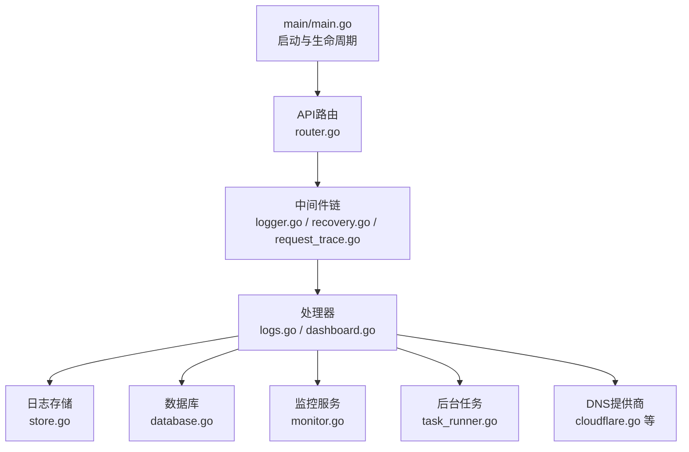
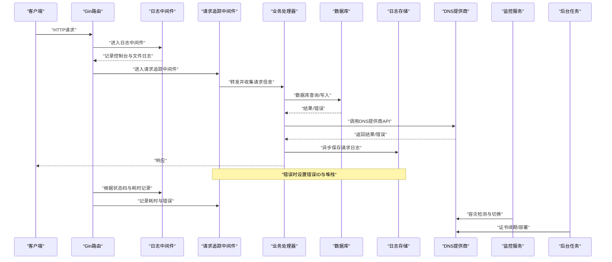
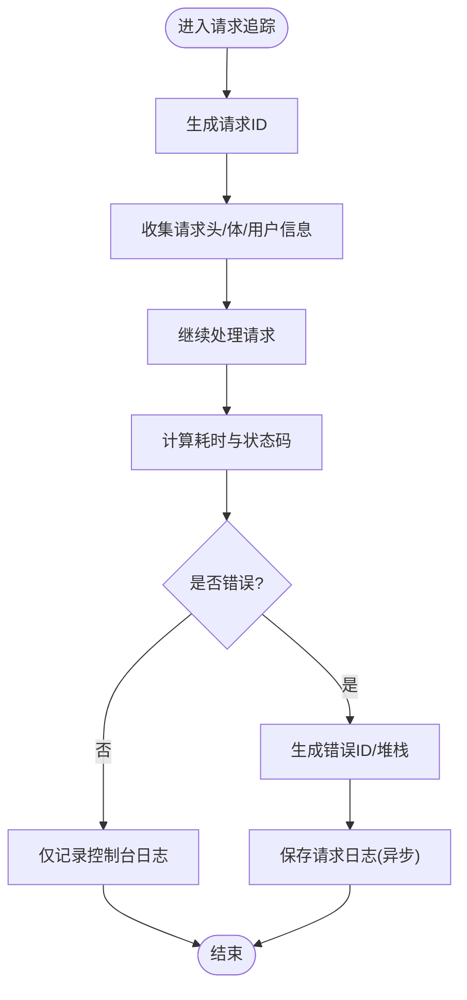
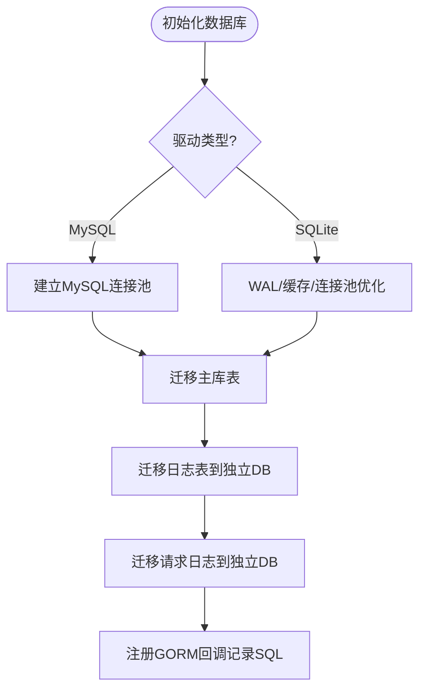
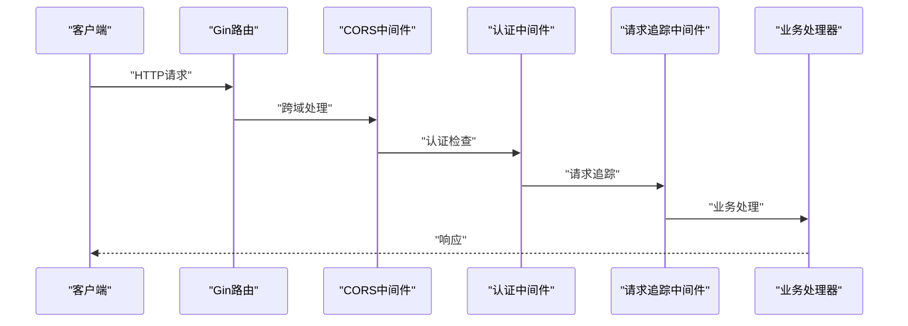
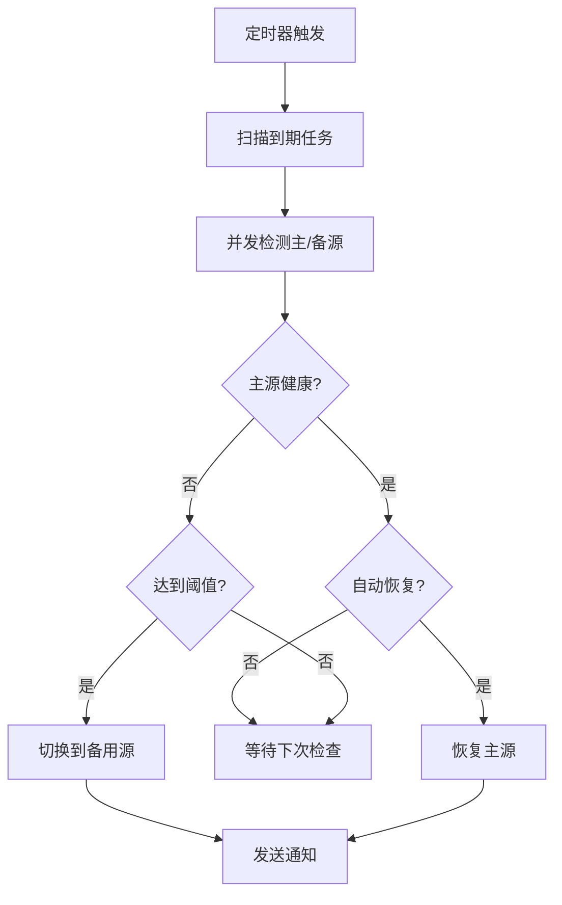
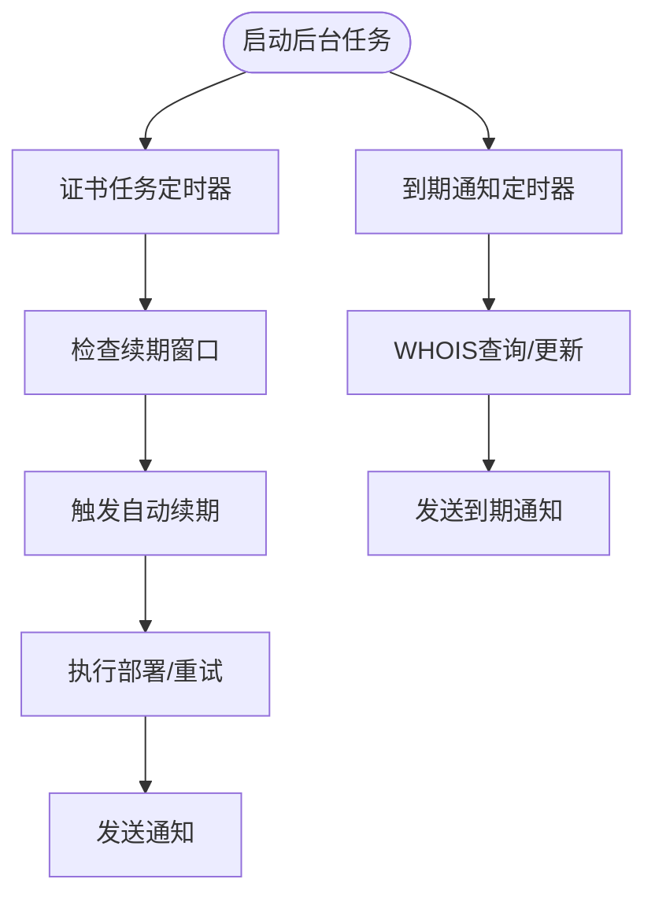
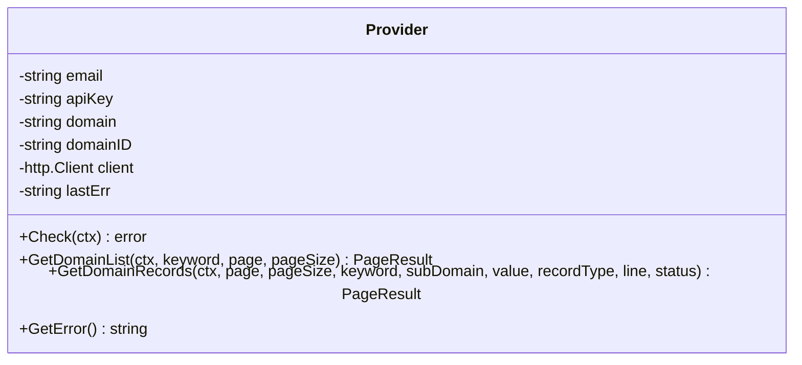
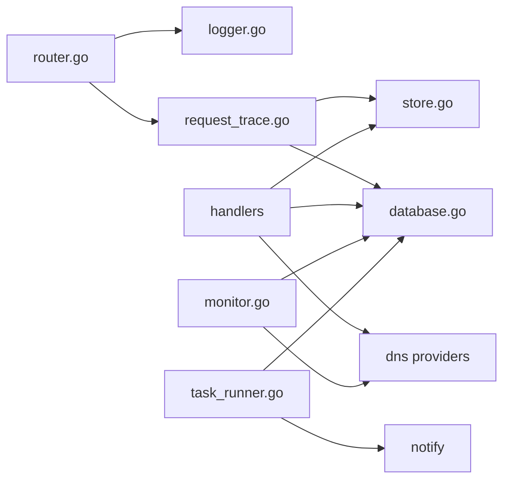

# 故障排除

<cite>
**本文引用的文件**
- [main.go](file://main/main.go)
- [logger.go](file://main/internal/logger/logger.go)
- [store.go](file://main/internal/logstore/store.go)
- [database.go](file://main/internal/database/database.go)
- [recovery.go](file://main/internal/api/middleware/recovery.go)
- [logger.go](file://main/internal/api/middleware/logger.go)
- [request_trace.go](file://main/internal/api/middleware/request_trace.go)
- [monitor.go](file://main/internal/monitor/monitor.go)
- [task_runner.go](file://main/internal/service/task_runner.go)
- [config.go](file://main/internal/config/config.go)
- [router.go](file://main/internal/api/router.go)
- [logs.go](file://main/internal/api/handler/logs.go)
- [dashboard.go](file://main/internal/api/handler/dashboard.go)
- [cloudflare.go](file://main/internal/dns/providers/cloudflare/cloudflare.go)
</cite>

## 目录
1. [简介](#简介)
2. [项目结构](#项目结构)
3. [核心组件](#核心组件)
4. [架构总览](#架构总览)
5. [详细组件分析](#详细组件分析)
6. [依赖分析](#依赖分析)
7. [性能考虑](#性能考虑)
8. [故障排除指南](#故障排除指南)
9. [结论](#结论)
10. [附录](#附录)

## 简介
本指南面向DNSPlane运维与开发人员，提供系统性故障排除方法，覆盖日志分析、性能排查、数据库与API调用、DNS服务商集成、错误监控与告警、调试工具与开发环境、系统崩溃与异常恢复、以及安全事件应急响应。文档基于代码实现细节，结合实际可操作步骤，帮助快速定位与解决问题。

## 项目结构
DNSPlane采用Go语言与Gin框架构建后端，前端为Next.js应用，通过嵌入式静态资源提供管理界面。核心模块包括：
- 启动入口与生命周期管理
- 日志系统与请求日志存储
- 数据库与迁移、连接池与回调
- API路由与中间件链
- 容灾监控与后台任务
- DNS服务商适配层
- 通知与告警

**图表来源**
- [main.go:52-147](file://main/main.go#L52-L147)
- [router.go:14-162](file://main/internal/api/router.go#L14-L162)
- [logger.go:156-231](file://main/internal/api/middleware/logger.go#L156-L231)
- [recovery.go:21-74](file://main/internal/api/middleware/recovery.go#L21-L74)
- [request_trace.go:58-192](file://main/internal/api/middleware/request_trace.go#L58-L192)
- [store.go:43-50](file://main/internal/logstore/store.go#L43-L50)
- [database.go:73-149](file://main/internal/database/database.go#L73-L149)
- [monitor.go:64-91](file://main/internal/monitor/monitor.go#L64-L91)
- [task_runner.go:49-75](file://main/internal/service/task_runner.go#L49-L75)
- [cloudflare.go:17-51](file://main/internal/dns/providers/cloudflare/cloudflare.go#L17-L51)

**章节来源**
- [main.go:52-147](file://main/main.go#L52-L147)
- [router.go:14-162](file://main/internal/api/router.go#L14-L162)

## 核心组件
- 启动与配置
  - 读取配置、初始化数据库、缓存、验证码、日志存储、监控、后台任务、数据库维护与日志清理、HTTP服务与优雅关闭。
- 日志系统
  - 控制台彩色输出与文件轮转、过期清理、请求日志与系统日志的内存/Redis存储、请求追踪与错误标记。
- 数据库
  - SQLite/MySQL驱动、连接池优化、迁移、回调记录SQL与耗时、日志数据库分离。
- API中间件
  - 请求追踪、慢请求告警、错误恢复、日志中间件、CORS。
- 监控与任务
  - 容灾监控主备切换、通知、后台任务证书续期/部署、到期通知、WHOIS刷新。
- DNS提供商
  - Cloudflare等提供商适配，统一错误返回与认证头设置。

**章节来源**
- [main.go:56-116](file://main/main.go#L56-L116)
- [logger.go:56-91](file://main/internal/logger/logger.go#L56-L91)
- [store.go:43-50](file://main/internal/logstore/store.go#L43-L50)
- [database.go:73-149](file://main/internal/database/database.go#L73-L149)
- [monitor.go:64-91](file://main/internal/monitor/monitor.go#L64-L91)
- [task_runner.go:49-75](file://main/internal/service/task_runner.go#L49-L75)
- [cloudflare.go:17-51](file://main/internal/dns/providers/cloudflare/cloudflare.go#L17-L51)

## 架构总览
下图展示从HTTP请求到数据库与DNS提供商的关键交互路径，以及错误恢复与日志记录机制。

**图表来源**
- [router.go:14-162](file://main/internal/api/router.go#L14-L162)
- [logger.go:156-231](file://main/internal/api/middleware/logger.go#L156-L231)
- [request_trace.go:58-192](file://main/internal/api/middleware/request_trace.go#L58-L192)
- [store.go:59-77](file://main/internal/logstore/store.go#L59-L77)
- [database.go:367-404](file://main/internal/database/database.go#L367-L404)
- [monitor.go:130-152](file://main/internal/monitor/monitor.go#L130-L152)
- [task_runner.go:106-132](file://main/internal/service/task_runner.go#L106-L132)

## 详细组件分析

### 日志系统与请求追踪
- 日志轮转与清理
  - 按日轮转、文件大小上限、保留天数与备份数量限制，后台定期清理过期文件。
- 请求追踪
  - 生成请求ID与错误ID、记录请求/响应体、用户信息、耗时、数据库查询集合、异步落库与Redis存储。
- 日志中间件
  - 过滤静态资源与HEAD请求、彩色控制台输出、慢请求告警、错误标记与模块分类。

**图表来源**
- [request_trace.go:58-192](file://main/internal/api/middleware/request_trace.go#L58-L192)
- [logger.go:156-231](file://main/internal/api/middleware/logger.go#L156-L231)

**章节来源**
- [logger.go:107-171](file://main/internal/logger/logger.go#L107-L171)
- [logger.go:187-228](file://main/internal/logger/logger.go#L187-L228)
- [store.go:59-77](file://main/internal/logstore/store.go#L59-L77)
- [request_trace.go:58-192](file://main/internal/api/middleware/request_trace.go#L58-L192)
- [logger.go:156-231](file://main/internal/api/middleware/logger.go#L156-L231)

### 数据库与迁移、连接池与回调
- 驱动选择与连接池
  - MySQL与SQLite双栈，SQLite启用WAL、调整连接池与超时，MySQL提升连接池参数。
- 迁移与旧数据迁移
  - 主库日志表迁移至独立日志数据库，请求日志表迁移至独立请求日志数据库。
- 回调记录SQL
  - 记录SQL、耗时、影响行数、错误，注入请求上下文，便于追踪。

**图表来源**
- [database.go:73-149](file://main/internal/database/database.go#L73-L149)
- [database.go:151-231](file://main/internal/database/database.go#L151-L231)
- [database.go:367-404](file://main/internal/database/database.go#L367-L404)

**章节来源**
- [database.go:73-149](file://main/internal/database/database.go#L73-L149)
- [database.go:151-231](file://main/internal/database/database.go#L151-L231)
- [database.go:367-404](file://main/internal/database/database.go#L367-L404)

### API路由与中间件链
- 路由组织
  - 登录、安装、公开重置接口、认证后端路由、监控、证书、用户、系统配置、DNS提供商、仪表盘、请求日志等。
- 中间件
  - 日志中间件、CORS、认证、权限、请求追踪、恢复中间件。

**图表来源**
- [router.go:14-162](file://main/internal/api/router.go#L14-L162)
- [logger.go:156-231](file://main/internal/api/middleware/logger.go#L156-L231)
- [request_trace.go:58-192](file://main/internal/api/middleware/request_trace.go#L58-L192)

**章节来源**
- [router.go:14-162](file://main/internal/api/router.go#L14-L162)
- [logger.go:156-231](file://main/internal/api/middleware/logger.go#L156-L231)
- [request_trace.go:58-192](file://main/internal/api/middleware/request_trace.go#L58-L192)

### 容灾监控与通知
- 主备检测与切换
  - 并发检测主源与备用源，健康状态记录，阈值触发自动切换与恢复，通知发送。
- 通知渠道
  - 邮件、Telegram、Webhook、Discord、Bark、企业微信等。

**图表来源**
- [monitor.go:130-152](file://main/internal/monitor/monitor.go#L130-L152)
- [monitor.go:257-318](file://main/internal/monitor/monitor.go#L257-L318)
- [monitor.go:735-791](file://main/internal/monitor/monitor.go#L735-L791)

**章节来源**
- [monitor.go:64-91](file://main/internal/monitor/monitor.go#L64-L91)
- [monitor.go:130-152](file://main/internal/monitor/monitor.go#L130-L152)
- [monitor.go:257-318](file://main/internal/monitor/monitor.go#L257-L318)
- [monitor.go:735-791](file://main/internal/monitor/monitor.go#L735-L791)

### 后台任务与证书续期/部署
- 证书任务
  - 每5分钟检查续期窗口内的订单，自动续期、部署、失败重试（指数退避）、锁释放。
- 到期通知
  - 每天检查域名与证书到期，WHOIS刷新与通知发送。
- 通知开关
  - 默认开启/关闭策略与系统配置键。

**图表来源**
- [task_runner.go:106-132](file://main/internal/service/task_runner.go#L106-L132)
- [task_runner.go:184-253](file://main/internal/service/task_runner.go#L184-L253)
- [task_runner.go:294-332](file://main/internal/service/task_runner.go#L294-L332)
- [task_runner.go:644-747](file://main/internal/service/task_runner.go#L644-L747)

**章节来源**
- [task_runner.go:49-75](file://main/internal/service/task_runner.go#L49-L75)
- [task_runner.go:106-132](file://main/internal/service/task_runner.go#L106-L132)
- [task_runner.go:184-253](file://main/internal/service/task_runner.go#L184-L253)
- [task_runner.go:294-332](file://main/internal/service/task_runner.go#L294-L332)
- [task_runner.go:644-747](file://main/internal/service/task_runner.go#L644-L747)

### DNS提供商集成（以Cloudflare为例）
- 认证与请求
  - 支持Global API Key与Bearer Token两种认证方式，统一设置请求头。
- 错误处理
  - 解析Cloudflare API返回的错误字段，记录最后错误信息。
- 基本能力
  - 域名列表、记录查询、健康检查等基础能力。

**图表来源**
- [cloudflare.go:34-51](file://main/internal/dns/providers/cloudflare/cloudflare.go#L34-L51)

**章节来源**
- [cloudflare.go:17-51](file://main/internal/dns/providers/cloudflare/cloudflare.go#L17-L51)
- [cloudflare.go:63-136](file://main/internal/dns/providers/cloudflare/cloudflare.go#L63-L136)

## 依赖分析
- 组件耦合
  - API中间件依赖日志与请求追踪；处理器依赖数据库、日志存储、DNS提供商；监控与任务依赖数据库与通知。
- 外部依赖
  - Gin、GORM、SQLite/MySQL驱动、Redis（可选）。
- 潜在环路
  - 无直接环路，模块职责清晰。

**图表来源**
- [router.go:14-162](file://main/internal/api/router.go#L14-L162)
- [logger.go:156-231](file://main/internal/api/middleware/logger.go#L156-L231)
- [request_trace.go:58-192](file://main/internal/api/middleware/request_trace.go#L58-L192)
- [store.go:43-50](file://main/internal/logstore/store.go#L43-L50)
- [database.go:73-149](file://main/internal/database/database.go#L73-L149)
- [monitor.go:64-91](file://main/internal/monitor/monitor.go#L64-L91)
- [task_runner.go:49-75](file://main/internal/service/task_runner.go#L49-L75)

**章节来源**
- [router.go:14-162](file://main/internal/api/router.go#L14-L162)
- [request_trace.go:58-192](file://main/internal/api/middleware/request_trace.go#L58-L192)
- [store.go:43-50](file://main/internal/logstore/store.go#L43-L50)
- [database.go:73-149](file://main/internal/database/database.go#L73-L149)
- [monitor.go:64-91](file://main/internal/monitor/monitor.go#L64-L91)
- [task_runner.go:49-75](file://main/internal/service/task_runner.go#L49-L75)

## 性能考虑
- 日志与存储
  - 控制台与文件分离输出，避免重复写入；请求日志Redis热路径节流与裁剪，减少QPS。
- 数据库
  - SQLite启用WAL与缓存，合理连接池；MySQL提升连接上限与生命周期；回调记录SQL便于定位慢查询。
- 中间件
  - 过滤静态资源与HEAD请求，慢请求告警阈值，避免日志文件过大。
- 监控与任务
  - 并发检测主/备源，定时器与超时控制，指数退避重试，锁超时自动释放。

**章节来源**
- [logger.go:156-231](file://main/internal/api/middleware/logger.go#L156-L231)
- [store.go:70-77](file://main/internal/logstore/store.go#L70-L77)
- [database.go:49-71](file://main/internal/database/database.go#L49-L71)
- [monitor.go:154-218](file://main/internal/monitor/monitor.go#L154-L218)
- [task_runner.go:294-332](file://main/internal/service/task_runner.go#L294-L332)

## 故障排除指南

### 通用诊断流程
- 快速定位
  - 使用请求ID在请求日志中检索，确认错误ID、堆栈、耗时与数据库查询集合。
  - 查看慢请求与错误状态码，结合控制台彩色输出定位模块。
- 日志分析
  - 日志文件按日期轮转，过期自动清理；通过日志存储查询接口过滤关键词、时间范围、方法与错误状态。
- 数据库检查
  - 检查主库与日志/请求日志数据库连接状态、迁移是否完成、索引与VACUUM是否正常。
- 监控与任务
  - 查看监控服务运行状态、任务队列与通知发送情况；检查后台任务定时器与锁状态。

**章节来源**
- [request_trace.go:159-191](file://main/internal/api/middleware/request_trace.go#L159-L191)
- [logger.go:156-231](file://main/internal/api/middleware/logger.go#L156-L231)
- [store.go:83-125](file://main/internal/logstore/store.go#L83-L125)
- [database.go:151-231](file://main/internal/database/database.go#L151-L231)
- [monitor.go:130-152](file://main/internal/monitor/monitor.go#L130-L152)
- [task_runner.go:106-132](file://main/internal/service/task_runner.go#L106-L132)

### 常见问题与解决方案

#### 数据库连接失败
- 症状
  - 启动时报数据库连接错误或迁移失败。
- 排查步骤
  - 检查配置文件数据库驱动、主机、端口、用户名、密码与文件路径。
  - 确认SQLite数据目录存在且可写；MySQL网络连通性与账号权限。
  - 查看迁移日志与回调记录的SQL错误。
- 优化建议
  - SQLite启用WAL与缓存；MySQL提升连接池参数；确保磁盘空间充足。

**章节来源**
- [config.go:45-53](file://main/internal/config/config.go#L45-L53)
- [database.go:73-149](file://main/internal/database/database.go#L73-L149)
- [database.go:367-404](file://main/internal/database/database.go#L367-L404)

#### API调用异常与慢请求
- 症状
  - 响应缓慢或超时，状态码4xx/5xx。
- 排查步骤
  - 在日志中间件中查看模块与耗时；结合请求追踪中间件的错误ID与堆栈。
  - 检查慢请求阈值与过滤规则，确认是否被跳过记录。
- 优化建议
  - 减少不必要的静态资源请求；优化数据库查询；增加缓存；检查上游DNS提供商速率限制。

**章节来源**
- [logger.go:156-231](file://main/internal/api/middleware/logger.go#L156-L231)
- [request_trace.go:58-192](file://main/internal/api/middleware/request_trace.go#L58-L192)

#### DNS服务商集成故障
- 症状
  - 获取域名/记录失败，错误信息来自提供商。
- 排查步骤
  - 检查提供商配置（邮箱/API Key/令牌），区分Global API Key与Bearer Token。
  - 查看提供商返回的错误字段，记录最后错误信息。
- 优化建议
  - 使用更稳定的网络与代理；检查提供商API限额与速率限制；必要时降级到本地日志查询。

**章节来源**
- [cloudflare.go:57-61](file://main/internal/dns/providers/cloudflare/cloudflare.go#L57-L61)
- [cloudflare.go:121-136](file://main/internal/dns/providers/cloudflare/cloudflare.go#L121-L136)

#### 容灾监控与通知异常
- 症状
  - 主源异常未切换或切换失败，通知未发送。
- 排查步骤
  - 检查监控任务配置、阈值与超时；查看切换日志与通知渠道配置。
  - 确认通知管理器可用与配置正确。
- 优化建议
  - 合理设置阈值与通知频率；启用多种通知渠道；定期测试代理与通知通道。

**章节来源**
- [monitor.go:257-318](file://main/internal/monitor/monitor.go#L257-L318)
- [monitor.go:735-791](file://main/internal/monitor/monitor.go#L735-L791)

#### 证书续期/部署失败
- 症状
  - 自动续期未触发或部署失败，重试次数耗尽。
- 排查步骤
  - 检查证书订单状态与到期时间；查看后台任务日志与通知。
  - 确认部署账户配置与提供商能力；检查锁状态与超时释放。
- 优化建议
  - 启用指数退避重试；配置成功/失败通知；定期清理过期锁。

**章节来源**
- [task_runner.go:184-253](file://main/internal/service/task_runner.go#L184-L253)
- [task_runner.go:294-332](file://main/internal/service/task_runner.go#L294-L332)
- [task_runner.go:477-503](file://main/internal/service/task_runner.go#L477-L503)

#### 日志分析与关键信息解读
- 日志文件
  - 按日期轮转，过期自动清理；可通过日志存储接口查询请求日志与系统日志。
- 关键字段
  - 请求ID/错误ID、模块、方法、路径、状态码、耗时、用户IP、错误消息与堆栈。
- 过滤与统计
  - 支持关键词、时间范围、方法、错误状态过滤；统计总数、错误数、今日数量与最近错误。

**章节来源**
- [logger.go:107-171](file://main/internal/logger/logger.go#L107-L171)
- [store.go:83-125](file://main/internal/logstore/store.go#L83-L125)
- [store.go:193-249](file://main/internal/logstore/store.go#L193-L249)

#### 错误监控与告警配置
- 通知渠道
  - 邮件、Telegram、Webhook、Discord、Bark、企业微信；支持测试发送。
- 配置键
  - 邮件：主机、端口、用户名、密码、发件人、接收人、安全方式、认证方式。
  - Telegram：Bot Token、Chat ID。
  - Webhook/Discord/Bark/企业微信：对应URL或Key。
- 默认策略
  - 证书到期通知默认开启；部署成功通知默认关闭，失败通知默认开启。

**章节来源**
- [dashboard.go:131-270](file://main/internal/api/handler/dashboard.go#L131-L270)
- [monitor.go:735-791](file://main/internal/monitor/monitor.go#L735-L791)
- [task_runner.go:505-532](file://main/internal/service/task_runner.go#L505-L532)

#### 调试工具与开发环境
- 代理测试
  - 构造HTTP/SOCKS5代理URL，测试连通性与延迟。
- 缓存清理
  - 强制GC回收内存，审计日志记录操作。
- 系统信息
  - 版本、Go版本、操作系统、架构、协程数、内存分配、数据库文件大小、维护统计。

**章节来源**
- [dashboard.go:287-365](file://main/internal/api/handler/dashboard.go#L287-L365)
- [dashboard.go:529-558](file://main/internal/api/handler/dashboard.go#L529-L558)

#### 系统崩溃与异常恢复
- 恢复机制
  - 自定义恢复中间件捕获panic，区分客户端断开与真实异常，记录堆栈并返回500。
- 优雅关闭
  - 监听系统信号，10秒超时优雅关闭HTTP服务，确保资源释放。
- 锁与超时
  - 后台任务与证书订单锁超时自动释放，避免进程重启或异常导致的死锁。

**章节来源**
- [recovery.go:21-74](file://main/internal/api/middleware/recovery.go#L21-L74)
- [main.go:135-146](file://main/main.go#L135-L146)
- [task_runner.go:477-503](file://main/internal/service/task_runner.go#L477-L503)

#### 安全事件应急响应
- 审计与日志
  - 系统操作日志与请求日志结合，快速定位异常操作与错误。
- 通知与隔离
  - 紧急告警通知渠道启用；必要时临时关闭自动切换或部署任务。
- 配置加固
  - 重新生成JWT密钥；检查API Key/令牌有效期；审查权限与白名单。

**章节来源**
- [store.go:268-320](file://main/internal/logstore/store.go#L268-L320)
- [monitor.go:296-314](file://main/internal/monitor/monitor.go#L296-L314)
- [config.go:125-131](file://main/internal/config/config.go#L125-L131)

## 结论
通过完善的日志系统、请求追踪、数据库回调、监控与后台任务，DNSPlane具备较强的可观测性与自愈能力。故障排除应遵循“快速定位—日志分析—根因排查—修复验证”的流程，结合配置与通知策略，确保问题在最小范围内得到解决，并持续优化性能与稳定性。

## 附录
- 常用命令与路径
  - 日志目录：logs/
  - 数据库文件：data/dnsplane.db、data/logs.db、data/request_logs.db
  - 配置文件：config.json（默认）
- 常用接口
  - 请求日志查询：POST /api/request-logs/list
  - 请求详情：POST /api/request-logs/detail
  - 错误详情：POST /api/request-logs/error
  - 仪表盘统计：GET /api/dashboard/stats
  - 系统信息：GET /api/system/info
  - 通知测试：POST /api/system/mail/test、/api/system/telegram/test、/api/system/webhook/test