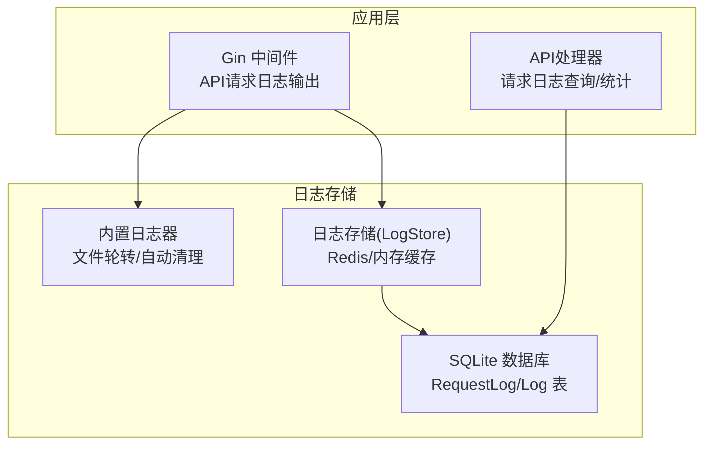
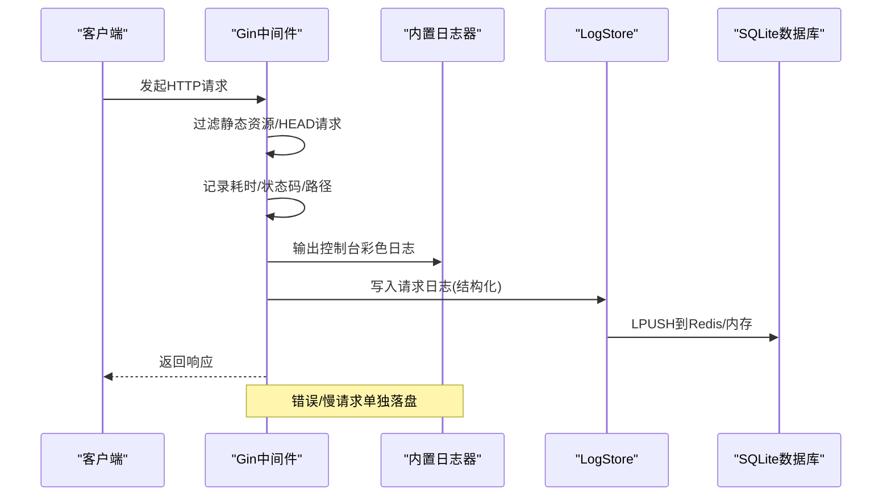
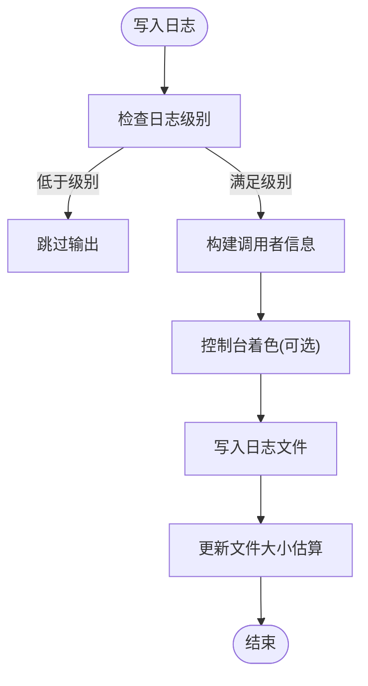
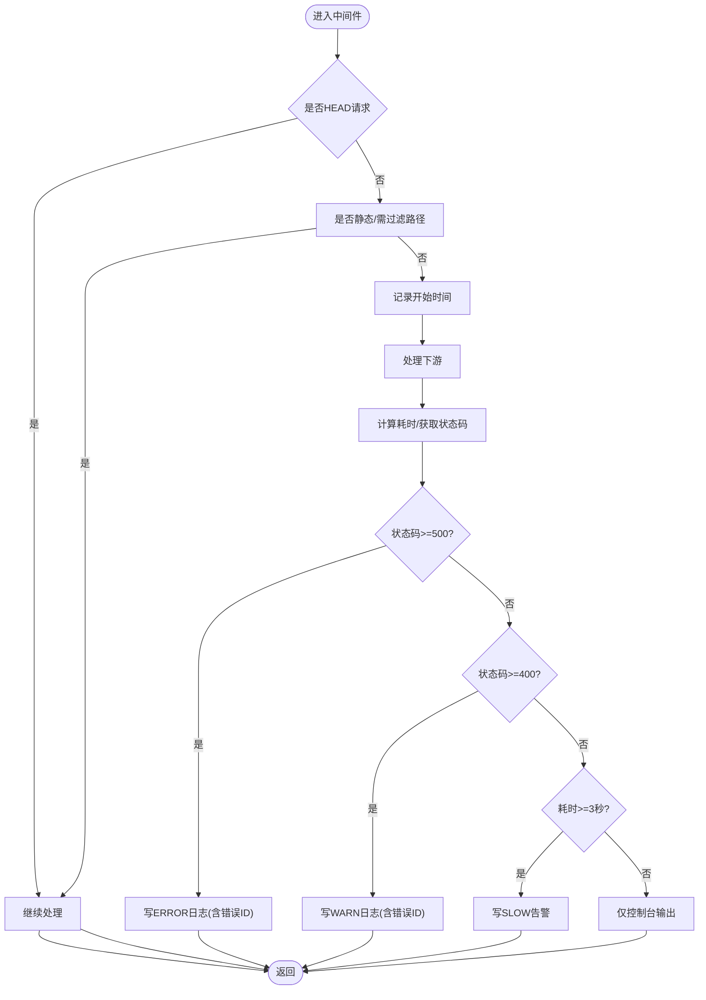
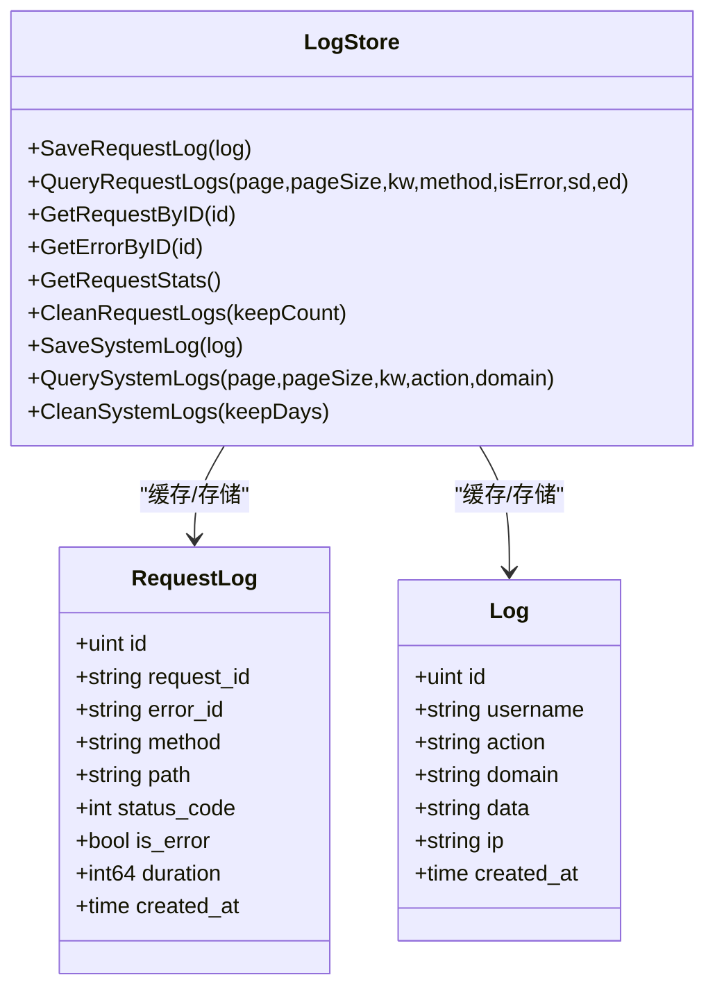
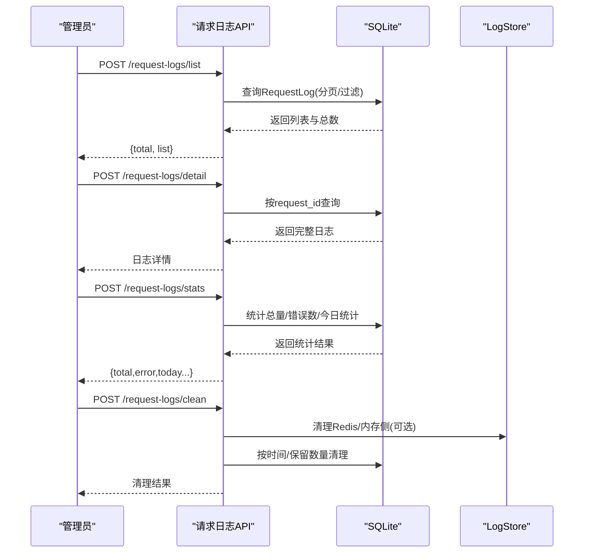
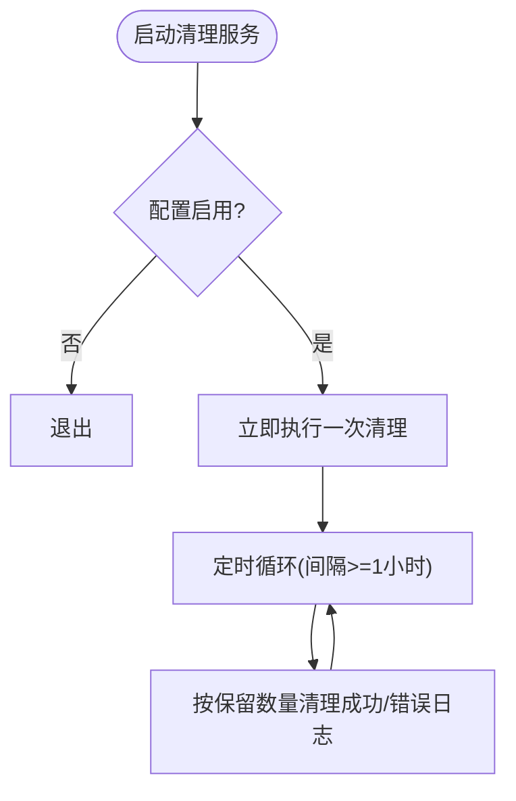
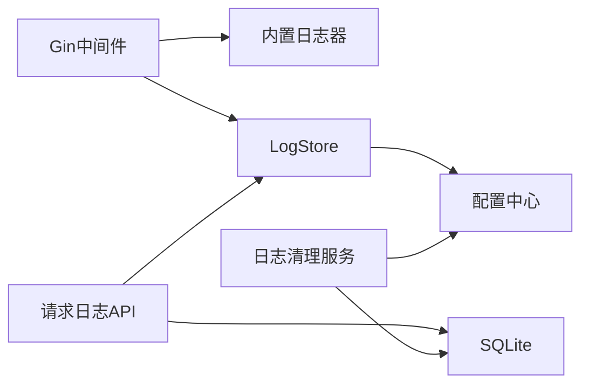

# 日志分析

<cite>
**本文引用的文件**   
- [main/internal/logger/logger.go](file://main/internal/logger/logger.go)
- [main/internal/api/middleware/logger.go](file://main/internal/api/middleware/logger.go)
- [main/internal/logstore/store.go](file://main/internal/logstore/store.go)
- [main/internal/service/log_cleanup.go](file://main/internal/service/log_cleanup.go)
- [main/internal/api/handler/request_log.go](file://main/internal/api/handler/request_log.go)
- [main/internal/api/handler/logs.go](file://main/internal/api/handler/logs.go)
- [main/internal/config/config.go](file://main/internal/config/config.go)
- [main/internal/models/models.go](file://main/internal/models/models.go)
</cite>

## 目录
1. [简介](#简介)
2. [项目结构](#项目结构)
3. [核心组件](#核心组件)
4. [架构总览](#架构总览)
5. [详细组件分析](#详细组件分析)
6. [依赖分析](#依赖分析)
7. [性能考量](#性能考量)
8. [故障排查指南](#故障排查指南)
9. [结论](#结论)
10. [附录](#附录)

## 简介
本指南面向DNSPlane平台的运维与开发人员，系统性讲解日志体系的架构、配置与使用方法，覆盖以下主题：
- 日志系统整体架构与职责划分
- 日志级别、文件轮转与自动清理策略
- 如何查看与分析系统日志、API请求日志、错误日志与调试日志
- 日志格式规范与关键字段含义
- 常见分析场景与工具使用（grep、日志聚合、实时监控）
- 日志文件位置、命名规则与存储策略
- 最佳实践与性能优化建议

## 项目结构
DNSPlane的日志子系统由“应用日志”和“请求日志/系统日志”两大类构成：
- 应用日志（系统日志与运行日志）：通过内置日志器进行文件轮转与自动清理，输出到标准输出与日志文件。
- 请求日志与系统日志：以结构化形式写入独立SQLite数据库，并提供Redis/内存作为热数据缓存（可选），支持分页与条件过滤。

图表来源
- [main/internal/api/middleware/logger.go:156-231](file://main/internal/api/middleware/logger.go#L156-L231)
- [main/internal/logger/logger.go:107-228](file://main/internal/logger/logger.go#L107-L228)
- [main/internal/logstore/store.go:35-50](file://main/internal/logstore/store.go#L35-L50)
- [main/internal/api/handler/request_log.go:93-129](file://main/internal/api/handler/request_log.go#L93-L129)

章节来源
- [main/internal/api/middleware/logger.go:156-231](file://main/internal/api/middleware/logger.go#L156-L231)
- [main/internal/logger/logger.go:107-228](file://main/internal/logger/logger.go#L107-L228)
- [main/internal/logstore/store.go:35-50](file://main/internal/logstore/store.go#L35-L50)
- [main/internal/api/handler/request_log.go:93-129](file://main/internal/api/handler/request_log.go#L93-L129)

## 核心组件
- 内置日志器（Logger）：负责应用日志的控制台彩色输出与文件落盘，具备按日切分、大小轮转、过期清理能力。
- Gin中间件日志器：对HTTP请求进行过滤、着色输出与结构化落盘，区分正常/慢请求与错误请求。
- 日志存储（LogStore）：基于Redis/内存实现的请求日志与系统日志的高性能缓存，支持分页与条件过滤，定期裁剪。
- 请求日志处理器：提供请求日志的查询、详情检索、统计与清理接口。
- 配置中心：集中管理日志清理开关、保留数量与清理周期等参数。
- 数据模型：定义RequestLog与Log表结构，支撑查询与统计。

章节来源
- [main/internal/logger/logger.go:43-91](file://main/internal/logger/logger.go#L43-L91)
- [main/internal/api/middleware/logger.go:156-231](file://main/internal/api/middleware/logger.go#L156-L231)
- [main/internal/logstore/store.go:35-50](file://main/internal/logstore/store.go#L35-L50)
- [main/internal/api/handler/request_log.go:93-129](file://main/internal/api/handler/request_log.go#L93-L129)
- [main/internal/config/config.go:31-36](file://main/internal/config/config.go#L31-L36)
- [main/internal/models/models.go:105-120](file://main/internal/models/models.go#L105-L120)

## 架构总览
DNSPlane的日志架构分为三层：
- 输入层：Gin中间件捕获HTTP请求，按规则输出到控制台与日志文件；同时将请求日志写入Redis/内存缓存。
- 缓存层：LogStore统一管理请求日志与系统日志，按上限裁剪，提供统计与过滤能力。
- 存储层：SQLite数据库持久化请求日志与系统日志，支持按时间与条件清理。

图表来源
- [main/internal/api/middleware/logger.go:156-231](file://main/internal/api/middleware/logger.go#L156-L231)
- [main/internal/logger/logger.go:230-305](file://main/internal/logger/logger.go#L230-L305)
- [main/internal/logstore/store.go:59-77](file://main/internal/logstore/store.go#L59-L77)

章节来源
- [main/internal/api/middleware/logger.go:156-231](file://main/internal/api/middleware/logger.go#L156-L231)
- [main/internal/logger/logger.go:230-305](file://main/internal/logger/logger.go#L230-L305)
- [main/internal/logstore/store.go:59-77](file://main/internal/logstore/store.go#L59-L77)

## 详细组件分析

### 应用日志（系统日志与运行日志）
- 日志级别：支持Debug/Info/Warn/Error四个级别，可通过全局接口设置。
- 输出目标：同时输出到控制台与日志文件，控制台彩色显示便于快速识别。
- 文件轮转：按日切分，单文件最大大小限制，超限自动删除重建。
- 自动清理：按保留天数与备份文件数量上限清理过期文件。
- 日志格式：文件中包含完整日期、级别、调用者位置与用户消息；控制台包含简短时间与级别颜色。

图表来源
- [main/internal/logger/logger.go:240-305](file://main/internal/logger/logger.go#L240-L305)

章节来源
- [main/internal/logger/logger.go:16-20](file://main/internal/logger/logger.go#L16-L20)
- [main/internal/logger/logger.go:107-149](file://main/internal/logger/logger.go#L107-L149)
- [main/internal/logger/logger.go:173-228](file://main/internal/logger/logger.go#L173-L228)
- [main/internal/logger/logger.go:230-305](file://main/internal/logger/logger.go#L230-L305)

### HTTP请求日志（中间件）
- 过滤策略：跳过静态资源、特定路径前缀与HEAD请求，避免噪声。
- 输出内容：控制台彩色展示时间、状态码、耗时、方法、路径；错误请求附加错误ID。
- 结构化落盘：仅对错误/慢请求写入日志文件，正常快速请求仅控制台输出，减少文件膨胀。
- 模块提取：从API路径提取模块名，便于分类统计与检索。

图表来源
- [main/internal/api/middleware/logger.go:156-231](file://main/internal/api/middleware/logger.go#L156-L231)

章节来源
- [main/internal/api/middleware/logger.go:46-68](file://main/internal/api/middleware/logger.go#L46-L68)
- [main/internal/api/middleware/logger.go:156-231](file://main/internal/api/middleware/logger.go#L156-L231)

### 请求日志与系统日志（缓存与存储）
- 缓存策略：Redis可用时优先使用Redis存储请求日志与系统日志，否则回退到内存；写入侧同步到缓存，读取统一走SQLite，避免LRANGE全量反序列化。
- 结构化存储：请求日志与系统日志分别以列表形式存储，按上限裁剪，支持分页与关键字/方法/错误/日期等条件过滤。
- 统计缓存：请求统计结果带互斥重算与TTL缓存，降低全表扫描成本。
- 清理策略：按条数截断（Redis/内存侧）与按时间/条数清理（SQLite侧）。

图表来源
- [main/internal/logstore/store.go:35-50](file://main/internal/logstore/store.go#L35-L50)
- [main/internal/logstore/store.go:59-77](file://main/internal/logstore/store.go#L59-L77)
- [main/internal/logstore/store.go:268-281](file://main/internal/logstore/store.go#L268-L281)
- [main/internal/models/models.go:105-120](file://main/internal/models/models.go#L105-L120)
- [main/internal/models/models.go:332-356](file://main/internal/models/models.go#L332-L356)

章节来源
- [main/internal/logstore/store.go:35-50](file://main/internal/logstore/store.go#L35-L50)
- [main/internal/logstore/store.go:59-77](file://main/internal/logstore/store.go#L59-L77)
- [main/internal/logstore/store.go:83-125](file://main/internal/logstore/store.go#L83-L125)
- [main/internal/logstore/store.go:127-178](file://main/internal/logstore/store.go#L127-L178)
- [main/internal/logstore/store.go:189-249](file://main/internal/logstore/store.go#L189-L249)
- [main/internal/logstore/store.go:251-264](file://main/internal/logstore/store.go#L251-L264)
- [main/internal/logstore/store.go:266-347](file://main/internal/logstore/store.go#L266-L347)
- [main/internal/models/models.go:105-120](file://main/internal/models/models.go#L105-L120)
- [main/internal/models/models.go:332-356](file://main/internal/models/models.go#L332-L356)

### 请求日志处理器（API）
- 列表查询：支持分页与关键字/方法/错误/日期范围过滤，按ID倒序。
- 详情查询：按请求ID或错误ID查询完整日志。
- 统计查询：返回总量、错误数、今日总量与错误数及最近错误列表。
- 清理接口：支持按保留数量清理成功/错误请求日志，并联动缓存失效。

图表来源
- [main/internal/api/handler/request_log.go:93-129](file://main/internal/api/handler/request_log.go#L93-L129)
- [main/internal/api/handler/request_log.go:135-201](file://main/internal/api/handler/request_log.go#L135-L201)
- [main/internal/api/handler/request_log.go:203-251](file://main/internal/api/handler/request_log.go#L203-L251)
- [main/internal/api/handler/request_log.go:308-334](file://main/internal/api/handler/request_log.go#L308-L334)

章节来源
- [main/internal/api/handler/request_log.go:93-129](file://main/internal/api/handler/request_log.go#L93-L129)
- [main/internal/api/handler/request_log.go:135-201](file://main/internal/api/handler/request_log.go#L135-L201)
- [main/internal/api/handler/request_log.go:203-251](file://main/internal/api/handler/request_log.go#L203-L251)
- [main/internal/api/handler/request_log.go:308-334](file://main/internal/api/handler/request_log.go#L308-L334)

### 日志清理服务
- 启停控制：根据配置决定是否启用，支持手动启停。
- 清理策略：分别按成功/错误保留条数清理SQLite中的请求日志；清理周期可配置。
- 并发安全：内部使用互斥锁保证统计重算一致性。

图表来源
- [main/internal/service/log_cleanup.go:19-63](file://main/internal/service/log_cleanup.go#L19-L63)
- [main/internal/service/log_cleanup.go:65-127](file://main/internal/service/log_cleanup.go#L65-L127)

章节来源
- [main/internal/service/log_cleanup.go:12-16](file://main/internal/service/log_cleanup.go#L12-L16)
- [main/internal/service/log_cleanup.go:19-63](file://main/internal/service/log_cleanup.go#L19-L63)
- [main/internal/service/log_cleanup.go:65-127](file://main/internal/service/log_cleanup.go#L65-L127)
- [main/internal/config/config.go:31-36](file://main/internal/config/config.go#L31-L36)

## 依赖分析
- 中间件依赖日志器：用于控制台输出与结构化落盘。
- LogStore依赖缓存层：优先使用Redis，否则回退内存；读取统一走SQLite。
- 请求日志处理器依赖数据库与LogStore：提供查询、统计与清理能力。
- 配置中心为清理服务与日志器提供参数来源。

图表来源
- [main/internal/api/middleware/logger.go:5-11](file://main/internal/api/middleware/logger.go#L5-L11)
- [main/internal/logger/logger.go:62-91](file://main/internal/logger/logger.go#L62-L91)
- [main/internal/logstore/store.go:43-50](file://main/internal/logstore/store.go#L43-L50)
- [main/internal/api/handler/request_log.go:8-14](file://main/internal/api/handler/request_log.go#L8-L14)
- [main/internal/service/log_cleanup.go:21-32](file://main/internal/service/log_cleanup.go#L21-L32)
- [main/internal/config/config.go:77-123](file://main/internal/config/config.go#L77-L123)

章节来源
- [main/internal/api/middleware/logger.go:5-11](file://main/internal/api/middleware/logger.go#L5-L11)
- [main/internal/logger/logger.go:62-91](file://main/internal/logger/logger.go#L62-L91)
- [main/internal/logstore/store.go:43-50](file://main/internal/logstore/store.go#L43-L50)
- [main/internal/api/handler/request_log.go:8-14](file://main/internal/api/handler/request_log.go#L8-L14)
- [main/internal/service/log_cleanup.go:21-32](file://main/internal/service/log_cleanup.go#L21-L32)
- [main/internal/config/config.go:77-123](file://main/internal/config/config.go#L77-L123)

## 性能考量
- 控制台输出与文件落盘分离：中间件仅对异常/慢请求写文件，避免日志文件过大。
- 缓存与裁剪：LogStore按上限裁剪，降低内存/RDB压力；统计结果带TTL与互斥重算。
- 读写分离：写入侧同步到缓存，读取统一走SQLite，避免全量反序列化。
- 清理策略：按条数与时间双维度清理，兼顾容量与查询效率。

章节来源
- [main/internal/api/middleware/logger.go:207-229](file://main/internal/api/middleware/logger.go#L207-L229)
- [main/internal/logstore/store.go:70-77](file://main/internal/logstore/store.go#L70-L77)
- [main/internal/logstore/store.go:193-249](file://main/internal/logstore/store.go#L193-L249)
- [main/internal/api/handler/request_log.go:16-26](file://main/internal/api/handler/request_log.go#L16-L26)

## 故障排查指南
- 日志文件无法轮转/清理
  - 检查日志目录权限与磁盘空间。
  - 查看后台轮转与清理协程是否正常运行。
- 请求日志缺失或不完整
  - 确认Redis配置与连通性；若未启用Redis，确认内存缓存是否足够。
  - 检查清理服务是否按配置周期运行。
- 统计结果异常
  - 清理统计缓存后重试；关注互斥重算与TTL影响。
- API查询性能差
  - 避免无筛选全量拉取；合理使用分页与过滤条件。
- 错误定位
  - 使用请求ID或错误ID查询接口快速定位；结合控制台彩色输出与文件日志定位问题。

章节来源
- [main/internal/logger/logger.go:173-228](file://main/internal/logger/logger.go#L173-L228)
- [main/internal/logstore/store.go:193-249](file://main/internal/logstore/store.go#L193-L249)
- [main/internal/api/handler/request_log.go:127-128](file://main/internal/api/handler/request_log.go#L127-L128)
- [main/internal/api/handler/request_log.go:135-201](file://main/internal/api/handler/request_log.go#L135-L201)

## 结论
DNSPlane的日志体系通过“中间件+内置日志器+缓存+数据库”的组合，实现了高效、可控且可扩展的日志采集与分析能力。遵循本文的配置与使用建议，可在保障性能的同时获得清晰、可追溯的日志视图。

## 附录

### 日志级别与配置项
- 日志级别：Debug/Info/Warn/Error
- 配置项（来自配置中心）：
  - 日志清理开关、成功/错误保留条数、清理周期
  - Redis连接与键前缀（影响LogStore行为）

章节来源
- [main/internal/logger/logger.go:22-30](file://main/internal/logger/logger.go#L22-L30)
- [main/internal/config/config.go:31-36](file://main/internal/config/config.go#L31-L36)
- [main/internal/config/config.go:21-29](file://main/internal/config/config.go#L21-L29)

### 日志文件位置、命名与存储策略
- 应用日志文件位置：logs目录，按日期命名（YYYY-MM-DD.log），单文件最大大小限制，超限自动删除重建。
- 请求日志与系统日志存储：SQLite数据库，独立于主数据库；请求日志表与系统日志表分别存放。
- 缓存策略：Redis优先，内存回退；写入侧同步，读取统一走SQLite。

章节来源
- [main/internal/logger/logger.go:16-20](file://main/internal/logger/logger.go#L16-L20)
- [main/internal/logger/logger.go:107-149](file://main/internal/logger/logger.go#L107-L149)
- [main/internal/logstore/store.go:35-50](file://main/internal/logstore/store.go#L35-L50)
- [main/internal/models/models.go:105-120](file://main/internal/models/models.go#L105-L120)
- [main/internal/models/models.go:332-356](file://main/internal/models/models.go#L332-L356)

### 日志格式规范与关键字段
- 应用日志（文件）：包含完整日期、级别、调用者位置与用户消息。
- 请求日志（数据库）：包含请求ID、错误ID、方法、路径、状态码、是否错误、耗时、创建时间等。
- 系统日志（数据库）：包含操作者、动作、实体、域名、数据、IP、UA、创建时间等。

章节来源
- [main/internal/logger/logger.go:276-292](file://main/internal/logger/logger.go#L276-L292)
- [main/internal/models/models.go:332-356](file://main/internal/models/models.go#L332-L356)
- [main/internal/models/models.go:105-120](file://main/internal/models/models.go#L105-L120)

### 常见分析场景与工具
- grep搜索：在应用日志文件中按关键字、状态码、模块名过滤。
- 日志聚合：结合控制台彩色输出与文件日志，快速定位错误与慢请求。
- 实时监控：利用中间件输出的控制台彩色日志进行实时观察；结合请求日志API进行定时统计与告警。

章节来源
- [main/internal/api/middleware/logger.go:190-205](file://main/internal/api/middleware/logger.go#L190-L205)
- [main/internal/api/handler/request_log.go:203-251](file://main/internal/api/handler/request_log.go#L203-L251)