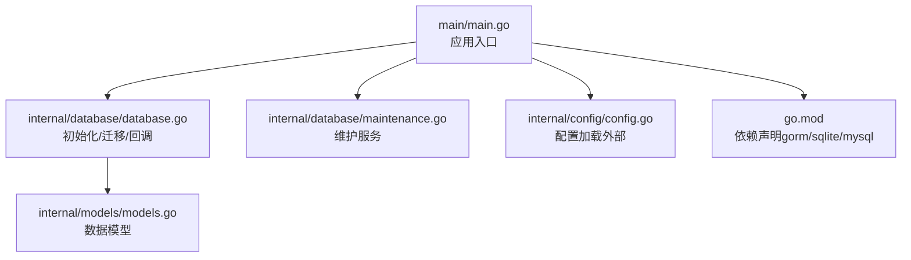
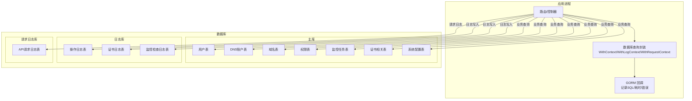
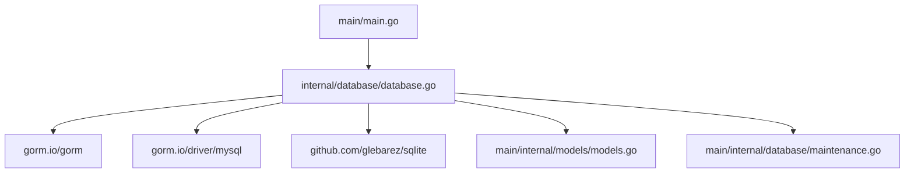

# 数据库设计

<cite>
**本文引用的文件**
- [main.go](file://main/main.go)
- [go.mod](file://main/go.mod)
- [database.go](file://main/internal/database/database.go)
- [maintenance.go](file://main/internal/database/maintenance.go)
- [models.go](file://main/internal/models/models.go)
</cite>

## 目录
1. [简介](#简介)
2. [项目结构](#项目结构)
3. [核心组件](#核心组件)
4. [架构总览](#架构总览)
5. [详细组件分析](#详细组件分析)
6. [依赖分析](#依赖分析)
7. [性能考量](#性能考量)
8. [故障排查指南](#故障排查指南)
9. [结论](#结论)
10. [附录](#附录)

## 简介
本文件面向DNSPlane项目的数据库层，系统化阐述数据模型的整体设计思路、实体关系、主键/外键/索引/约束设计、数据验证与业务规则、迁移与版本管理策略、数据访问模式与查询优化技巧，以及针对SQLite与MySQL的兼容性设计与选择考虑。同时给出数据库维护、备份与最佳实践建议。

## 项目结构
数据库相关代码集中在以下模块：
- 初始化与连接：database包负责数据库初始化、连接池、迁移、回调注册与维护服务启动
- 数据模型：models包定义所有核心表结构及字段约束
- 维护与清理：maintenance包提供周期性清理、VACUUM与统计接口
- 入口集成：main.go在启动阶段完成数据库初始化、维护服务与后台任务的装配



**图示来源**
- [main.go:52-111](file://main/main.go#L52-L111)
- [database.go:73-149](file://main/internal/database/database.go#L73-L149)
- [maintenance.go:110-133](file://main/internal/database/maintenance.go#L110-L133)
- [models.go:1-357](file://main/internal/models/models.go#L1-L357)
- [go.mod:1-28](file://main/go.mod#L1-L28)

**章节来源**
- [main.go:52-111](file://main/main.go#L52-L111)
- [database.go:73-149](file://main/internal/database/database.go#L73-L149)
- [maintenance.go:110-133](file://main/internal/database/maintenance.go#L110-L133)
- [models.go:1-357](file://main/internal/models/models.go#L1-L357)
- [go.mod:1-28](file://main/go.mod#L1-L28)

## 核心组件
- 数据库初始化与多库架构
  - 主库：承载用户、域名、权限、监控任务、证书、定时任务、系统配置等核心业务表
  - 日志库：独立SQLite，存放操作日志、证书日志、监控检查日志
  - 请求日志库：独立SQLite，存放API请求日志
  - 支持SQLite与MySQL双引擎，运行时根据配置选择驱动
- 数据模型与约束
  - 使用GORM标签定义主键、唯一索引、普通索引、长度与非空约束
  - 采用软删除DeletedAt字段，配合GORM全局查询拦截
- 维护与清理
  - 周期性清理：按配置保留天数/小时数清理日志
  - VACUUM与优化：定期执行WAL checkpoint、ANALYZE、PRAGMA optimize、VACUUM
  - 统计缓存：短时缓存数据库大小与表行数估算，降低系统信息页压力
- 查询追踪与回调
  - GORM回调记录SQL、耗时、影响行数与错误，注入到请求上下文，便于审计与诊断

**章节来源**
- [database.go:20-149](file://main/internal/database/database.go#L20-L149)
- [models.go:1-357](file://main/internal/models/models.go#L1-L357)
- [maintenance.go:14-98](file://main/internal/database/maintenance.go#L14-L98)
- [maintenance.go:201-271](file://main/internal/database/maintenance.go#L201-L271)
- [maintenance.go:288-325](file://main/internal/database/maintenance.go#L288-L325)
- [database.go:367-468](file://main/internal/database/database.go#L367-L468)

## 架构总览
DNSPlane采用“一主两从”数据库架构：
- 主库：业务核心表（用户、DNS账户、域名、权限、监控任务、证书、定时任务、系统配置）
- 日志库：操作日志、证书日志、监控检查日志
- 请求日志库：API请求日志



**图示来源**
- [database.go:20-149](file://main/internal/database/database.go#L20-L149)
- [models.go:1-357](file://main/internal/models/models.go#L1-L357)

## 详细组件分析

### 数据模型与实体关系
- 用户(User)：主键，用户名唯一，状态与级别字段，TOTP相关字段，软删除
- 用户OAuth(UserOAuth)：每用户每提供商一条记录，联合唯一索引(user_id, provider)，第三方令牌与过期时间
- DNS账户(Account)：外键指向用户，类型与名称，配置与备注，软删除
- 域名(Domain)：外键指向账户，域名唯一索引，记录数、隐藏/SSO标记、到期/检测时间、软删除
- 域名备注(DomainNote)：用户-域名唯一组合，备注文本
- 权限(Permission)：用户-域名维度的权限，子域名限制，只读与过期时间
- 操作日志(Log)：日志库，记录操作者、实体、前后数据、IP与UA
- 监控任务(DMTask)：关联域名，记录切换策略、探测参数、代理与通知配置、状态与计数
- 监控检查日志(DMCheckLog)：日志库，探测结果、耗时、错误、主备健康状态
- 容灾切换日志(DMLog)：主库，切换动作与错误信息
- 证书账户(CertAccount)：外键指向用户，类型与名称，配置与扩展字段
- 证书订单(CertOrder)：关联账户，证书流程状态、错误、锁定与重试、链与密钥
- 证书域名(CertDomain)：订单-域名映射
- 证书部署(CertDeploy)：部署任务，目标账户与订单，状态、重试与日志
- 证书CNAME(CertCNAME)：CNAME代理
- 定时任务(ScheduleTask)：按周期修改/启用/暂停/删除记录
- 系统配置(SysConfig)：键值配置
- 优选IP(OptimizeIP)：CDN优选任务
- 证书日志(CertLog)：日志库
- 请求日志(RequestLog)：请求日志库

```mermaid
erDiagram
USER {
uint id PK
string username UK
string password
string email
bool is_api
string api_key
int level
int status
string permissions
bool totp_open
string totp_secret
string reset_token
string reset_type
timestamp reset_expire
timestamp reg_time
timestamp last_time
int64 github_id
timestamp created_at
timestamp updated_at
timestamp deleted_at
}
USER_OAUTH {
uint id PK
uint user_id IK1
string provider UK1
string provider_user_id IK2
string provider_name
string provider_email
string provider_avatar
text access_token
text refresh_token
timestamp expires_at
timestamp created_at
timestamp updated_at
}
ACCOUNT {
uint id PK
uint uid IK
string type
string name
text config
string remark
timestamp created_at
timestamp updated_at
timestamp deleted_at
}
DOMAIN {
uint id PK
uint aid IK
string name UK
string third_id
bool is_hide
bool is_sso
int record_count
string remark
bool is_notice
timestamp reg_time
timestamp expire_time
timestamp check_time
timestamp notice_time
int check_status
timestamp created_at
timestamp updated_at
timestamp deleted_at
}
DOMAIN_NOTE {
uint id PK
uint uid IK1 UK
uint did IK2 UK
string remark
timestamp created_at
timestamp updated_at
}
PERMISSION {
uint id PK
uint uid IK
uint did IK
string domain
string sub
bool read_only
timestamp expire_time
timestamp created_at
}
LOG {
uint id PK
uint uid IK
string username
string action
string entity
uint entity_id
string domain
string data
text before_data
text after_data
string ip
string user_agent
timestamp created_at
}
DM_TASK {
uint id PK
uint did IK
string rr
string record_id
string record_type
string record_line
int type
string main_value
string backup_value
string backup_values
string backup_type
int check_type
string check_url
int tcp_port
int frequency
int cycle
int timeout
string remark
bool use_proxy
bool cdn
int64 add_time
int64 check_time
int64 check_next_time
int64 switch_time
int err_count
int status
bool main_health
bool active
string record_info
string expect_status
string expect_keyword
int max_redirects
string proxy_type
string proxy_host
int proxy_port
string proxy_username
string proxy_password
bool notify_enabled
text notify_channels
bool auto_restore
}
DM_CHECK_LOG {
uint id PK
uint task_id IK
bool success IK
int64 duration
string error
bool main_health
text backup_healths
int64 main_duration
int64 backup_duration
timestamp created_at IK
}
DM_LOG {
uint id PK
uint task_id IK
int action
string err_msg
timestamp created_at
}
CERT_ACCOUNT {
uint id PK
uint uid IK
string type
string name
text config
text ext
string remark
bool is_deploy
timestamp created_at
timestamp updated_at
timestamp deleted_at
}
CERT_ORDER {
uint id PK
uint aid
string key_type
string key_size
string process_id
timestamp issue_time
timestamp expire_time
string issuer
int status
string error
bool is_auto
int retry
int retry2
timestamp retry_time
bool is_lock
timestamp lock_time
bool is_send
text info
text dns
text fullchain
text private_key
timestamp renew_fail_notice_at
timestamp expire_notice_at
timestamp created_at
timestamp updated_at
}
CERT_DOMAIN {
uint id PK
uint oid IK
string domain
int sort
}
CERT_DEPLOY {
uint id PK
uint uid IK
uint aid
uint oid
timestamp issue_time
text config
string remark
timestamp last_time
string process_id
int status
string error
bool active
int retry
int max_retry
int retry_delay
timestamp retry_time
bool is_lock
timestamp lock_time
bool is_send
text info
text log_content
timestamp created_at
timestamp updated_at
}
CERT_CNAME {
uint id PK
string domain
uint did
string rr
int status
timestamp created_at
}
SCHEDULE_TASK {
uint id PK
uint did IK
string rr
string record_id
int type
int cycle
int switch_type
string switch_date
string switch_time
string value
string line
int64 add_time
int64 update_time
int64 next_time
bool active
string record_info
string remark
}
SYS_CONFIG {
string key PK
text value
}
OPTIMIZE_IP {
uint id PK
uint did IK
string rr
int type
string ip_type
int cdn_type
int recordnum
int ttl
string remark
timestamp addtime
timestamp updatetime
int status
string errmsg
bool active
}
CERT_LOG {
uint id PK
uint oid IK
string type
string content
timestamp created_at
}
REQUEST_LOG {
uint id PK
string request_id IK
string error_id IK
uint user_id IK
string username
string method
string path
string query
text body
text headers
string ip
string user_agent
int status_code
text response
int64 duration
bool is_error IK
string error_msg
text error_stack
text db_queries
int64 db_query_time
text extra
timestamp created_at IK
}
USER ||--o{ USER_OAUTH : "绑定"
USER ||--o{ ACCOUNT : "拥有"
ACCOUNT ||--o{ DOMAIN : "包含"
USER ||--o{ PERMISSION : "授予"
DOMAIN ||--o{ DOMAIN_NOTE : "备注"
DOMAIN ||--o{ DM_TASK : "被监控"
DM_TASK ||--o{ DM_CHECK_LOG : "产生"
DM_TASK ||--o{ DM_LOG : "记录"
CERT_ACCOUNT ||--o{ CERT_ORDER : "创建"
CERT_ORDER ||--o{ CERT_DOMAIN : "包含"
CERT_ACCOUNT ||--o{ CERT_DEPLOY : "部署"
CERT_DEPLOY ||--o{ CERT_LOG : "记录"
DOMAIN ||--o{ SCHEDULE_TASK : "调度"
DOMAIN ||--o{ OPTIMIZE_IP : "优选"
```

**图示来源**
- [models.go:1-357](file://main/internal/models/models.go#L1-L357)

**章节来源**
- [models.go:1-357](file://main/internal/models/models.go#L1-L357)

### 主键、外键、索引与约束设计
- 主键
  - 所有表均以自增整型作为主键，保证全局唯一且有序
- 外键
  - 通过GORM外键标签与业务逻辑约束实现关联关系（例如Account.uid、Domain.aid、DMTask.did、CertOrder.aid等）
  - 未显式声明外键约束，依赖应用层与数据库层索引保障一致性
- 索引
  - 关键查询字段建立单列或联合索引：用户名唯一索引、OAuth联合唯一索引、账户/域名/任务/日志等常用过滤字段
  - 日志类高频写入表普遍建立时间戳索引，便于按时间范围清理
- 约束
  - 长度约束与非空约束通过GORM标签定义
  - 软删除DeletedAt字段统一处理逻辑删除
  - 状态枚举字段（如任务状态、证书状态）通过业务规则约束取值范围

**章节来源**
- [models.go:1-357](file://main/internal/models/models.go#L1-L357)

### 数据验证与业务规则
- 用户登录与权限
  - 用户状态与级别控制访问权限；TOTP开关与令牌重置机制增强安全
- DNS账户与域名
  - 域名唯一性约束，账户与域名的归属关系
- 监控任务
  - 任务有效性校验：无效域名ID或记录ID将被禁用
  - 探测类型、频率、超时、代理与通知等参数由业务层校验
- 证书流程
  - 订单状态机与重试/锁定机制，部署任务的重试策略与日志记录
- 日志与请求
  - 按配置保留策略清理过期日志；请求日志按条数上限裁剪，避免无限增长

**章节来源**
- [models.go:1-357](file://main/internal/models/models.go#L1-L357)
- [maintenance.go:135-153](file://main/internal/database/maintenance.go#L135-L153)
- [maintenance.go:201-271](file://main/internal/database/maintenance.go#L201-L271)

### 数据库迁移与版本管理策略
- 自动迁移
  - 启动时对主库、日志库、请求日志库分别执行AutoMigrate
- 旧数据迁移
  - 将主库中的旧日志表迁移至独立数据库，并清理旧表
  - 将旧字段github_id迁移至UserOAuth表
- 版本演进
  - 通过新增字段与索引逐步演进，不强制要求手动迁移脚本
  - 通过SysConfig表动态配置维护策略，避免硬编码

**章节来源**
- [database.go:233-292](file://main/internal/database/database.go#L233-L292)
- [database.go:151-231](file://main/internal/database/database.go#L151-L231)
- [database.go:260-278](file://main/internal/database/database.go#L260-L278)
- [maintenance.go:62-98](file://main/internal/database/maintenance.go#L62-L98)

### 数据访问模式与查询优化技巧
- 查询封装
  - WithContext/WithLogContext/WithRequestContext为不同场景提供数据库连接
  - GORM回调记录SQL与耗时，便于审计与定位慢查询
- 连接池与方言
  - SQLite：WAL模式、连接池最大并发、内存临时存储、映射内存优化
  - MySQL：默认连接池参数，提升并发与复用
- 统计与估算
  - 使用ANALYZE与sqlite_stat1估算表行数，避免全表COUNT
- 索引与清理
  - 高频字段建立索引；按时间/条数清理日志，保持表规模可控

**章节来源**
- [database.go:352-468](file://main/internal/database/database.go#L352-L468)
- [database.go:34-71](file://main/internal/database/database.go#L34-L71)
- [maintenance.go:395-431](file://main/internal/database/maintenance.go#L395-L431)

### 备份与维护最佳实践
- 备份策略
  - SQLite：直接复制数据库文件；生产环境建议在停机或事务安全窗口内复制
  - MySQL：使用mysqldump或物理备份工具，结合binlog恢复点
- 维护策略
  - 定期执行VACUUM与ANALYZE，保持数据库紧凑与查询计划最优
  - 按配置清理日志，避免磁盘膨胀
  - 监控数据库大小与可回收空间，及时触发压缩
- 备份验证
  - 定期验证备份文件完整性与可恢复性

**章节来源**
- [maintenance.go:275-325](file://main/internal/database/maintenance.go#L275-L325)
- [maintenance.go:329-393](file://main/internal/database/maintenance.go#L329-L393)

### SQLite与MySQL兼容性设计与选择考虑
- 兼容性
  - 通过GORM驱动切换实现SQLite与MySQL双栈
  - 针对SQLite进行WAL、连接池、内存映射等优化
  - 通过IsSQLite判断方言差异，避免SQL语法差异导致的问题
- 选择考虑
  - SQLite适合单机、轻量部署与开发测试
  - MySQL适合高并发、多实例与企业级部署，具备更强的事务与复制能力

**章节来源**
- [database.go:26-47](file://main/internal/database/database.go#L26-L47)
- [database.go:80-103](file://main/internal/database/database.go#L80-L103)
- [go.mod:9,26](file://main/go.mod#L9,L26)

## 依赖分析
- GORM与驱动
  - gorm.io/gorm：ORM框架
  - gorm.io/driver/mysql：MySQL驱动
  - github.com/glebarez/sqlite：SQLite驱动
- 应用集成
  - main/main.go在启动时加载配置、初始化数据库、注册维护服务与后台任务



**图示来源**
- [main.go:56-66](file://main/main.go#L56-L66)
- [database.go:3-18](file://main/internal/database/database.go#L3-L18)
- [go.mod:9,26](file://main/go.mod#L9,L26)

**章节来源**
- [main.go:56-66](file://main/main.go#L56-L66)
- [database.go:3-18](file://main/internal/database/database.go#L3-L18)
- [go.mod:9,26](file://main/go.mod#L9,L26)

## 性能考量
- 连接池与并发
  - SQLite：最大打开连接64，空闲连接32，忙碌超时5秒，内存临时存储
  - MySQL：默认连接池参数，提升并发与复用
- 存储与I/O
  - SQLite WAL模式、ANALYZE统计、PRAGMA optimize与VACUUM压缩
  - 内存映射与缓存大小优化
- 查询与索引
  - 高频过滤字段建立索引；日志表按时间索引，便于清理
  - 使用sqlite_stat1估算行数，避免COUNT(*)开销

**章节来源**
- [database.go:34-71](file://main/internal/database/database.go#L34-L71)
- [maintenance.go:288-325](file://main/internal/database/maintenance.go#L288-L325)
- [maintenance.go:395-431](file://main/internal/database/maintenance.go#L395-L431)

## 故障排查指南
- 查询追踪
  - 通过GORM回调获取SQL、耗时、影响行数与错误，注入请求上下文
- 日志清理异常
  - 检查维护配置项（SysConfig中maint_*）与数据库连接状态
- 数据库膨胀
  - 触发VACUUM与ANALYZE，确认WAL checkpoint与journal_mode
- 迁移失败
  - 检查数据库权限、路径与驱动版本；必要时回滚并重试

**章节来源**
- [database.go:367-468](file://main/internal/database/database.go#L367-L468)
- [maintenance.go:62-98](file://main/internal/database/maintenance.go#L62-L98)
- [maintenance.go:275-325](file://main/internal/database/maintenance.go#L275-L325)

## 结论
DNSPlane数据库层采用清晰的模型设计与严格的索引/约束策略，结合SQLite与MySQL双栈支持与完善的维护体系，实现了从开发到生产的稳定运行。通过自动迁移、日志清理、VACUUM优化与查询追踪，系统在可用性、可观测性与性能方面达到良好平衡。建议在生产环境中持续监控数据库大小与清理效果，并定期验证备份与恢复流程。

## 附录
- 关键配置键（SysConfig）
  - maint_operation_log_days、maint_cert_log_days、maint_monitor_log_days、maint_check_log_hours、maint_request_log_days、maint_request_success_keep、maint_request_error_keep、maint_vacuum_interval_h
- 建议的运维流程
  - 启动阶段：检查数据库连接与迁移结果
  - 运行阶段：关注维护服务日志与数据库大小变化
  - 备份阶段：制定定期备份与恢复演练计划

**章节来源**
- [maintenance.go:28-44](file://main/internal/database/maintenance.go#L28-L44)
- [maintenance.go:62-98](file://main/internal/database/maintenance.go#L62-L98)