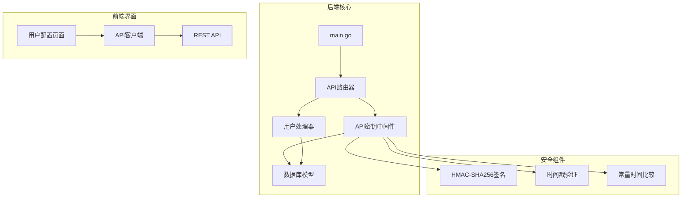
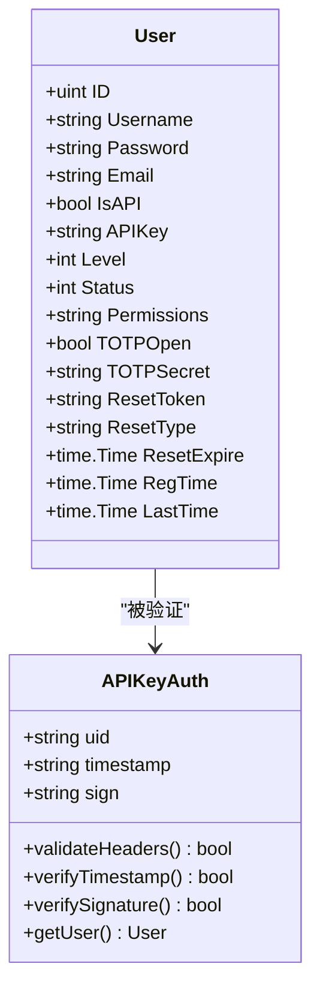
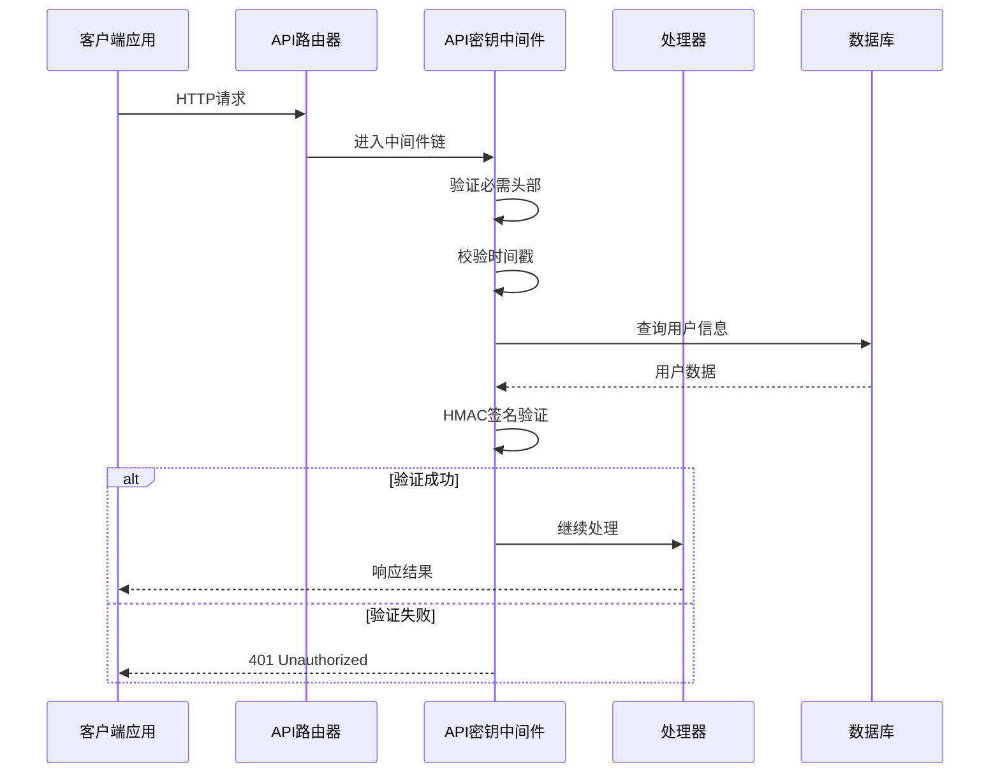
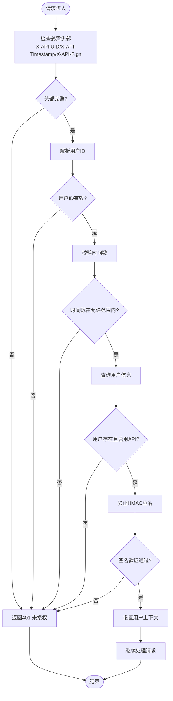
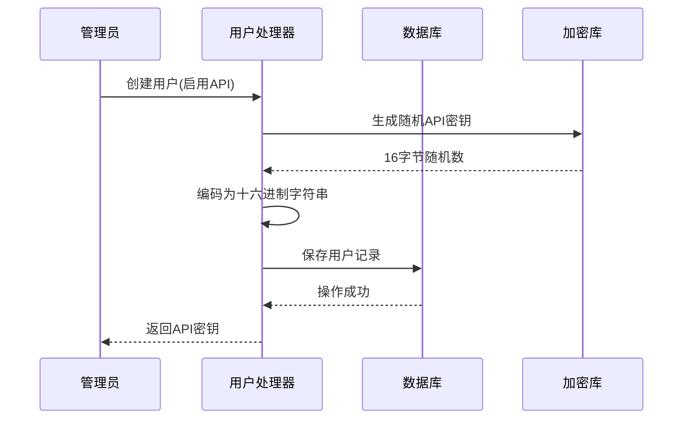
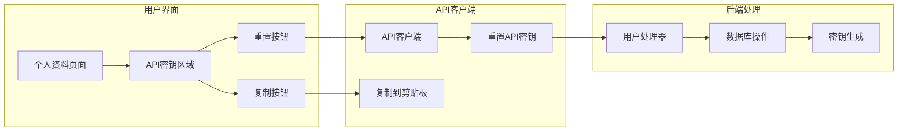
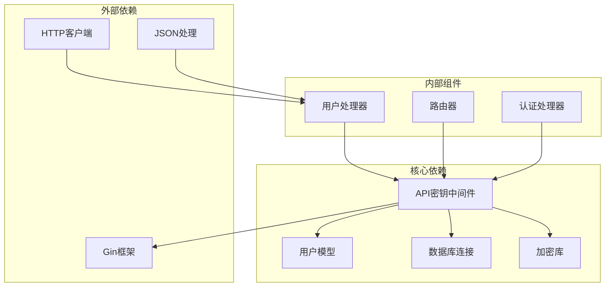

# API密钥系统

<cite>
**本文档引用的文件**
- [main.go](file://main/main.go)
- [apikey.go](file://main/internal/api/middleware/apikey.go)
- [models.go](file://main/internal/models/models.go)
- [user.go](file://main/internal/api/handler/user.go)
- [router.go](file://main/internal/api/router.go)
- [auth.go](file://main/internal/api/handler/auth.go)
- [page.tsx](file://web/app/(dashboard)/dashboard/profile/page.tsx)
- [api.ts](file://web/lib/api.ts)
</cite>

## 目录
1. [简介](#简介)
2. [项目结构](#项目结构)
3. [核心组件](#核心组件)
4. [架构概览](#架构概览)
5. [详细组件分析](#详细组件分析)
6. [依赖关系分析](#依赖关系分析)
7. [性能考虑](#性能考虑)
8. [故障排除指南](#故障排除指南)
9. [结论](#结论)

## 简介

API密钥系统是DNSPlane平台中用于程序化访问的核心认证机制。该系统提供了基于HMAC-SHA256签名的API认证，支持时间戳防重放攻击，确保API调用的安全性和完整性。

本系统采用双层认证架构：传统的基于会话的用户认证（用于Web界面）和基于API密钥的程序化认证（用于自动化集成）。API密钥系统特别适用于CI/CD管道、监控脚本、第三方集成等场景。

## 项目结构

API密钥系统主要分布在以下模块中：

**图表来源**
- [main.go:117](file://main/main.go#L117)
- [apikey.go:44](file://main/internal/api/middleware/apikey.go#L44)
- [router.go:14](file://main/internal/api/router.go#L14)

**章节来源**
- [main.go:117](file://main/main.go#L117)
- [router.go:14](file://main/internal/api/router.go#L14)

## 核心组件

### 数据模型设计

API密钥系统的核心数据模型定义在User结构中：

**图表来源**
- [models.go:9](file://main/internal/models/models.go#L9)
- [apikey.go:44](file://main/internal/api/middleware/apikey.go#L44)

### API密钥生成机制

系统支持多种API密钥生成场景：

1. **自动生成功能**：当创建用户时启用API访问
2. **手动重置功能**：管理员和用户可以重置API密钥
3. **条件生成**：当启用API访问但没有现有密钥时自动生成

**章节来源**
- [user.go:16](file://main/internal/api/handler/user.go#L16)
- [user.go:87](file://main/internal/api/handler/user.go#L87)
- [user.go:135](file://main/internal/api/handler/user.go#L135)

## 架构概览

API密钥系统的整体架构采用中间件模式，确保所有API请求都经过统一的安全验证：

**图表来源**
- [apikey.go:44](file://main/internal/api/middleware/apikey.go#L44)
- [router.go:113](file://main/internal/api/router.go#L113)

## 详细组件分析

### API密钥中间件实现

API密钥中间件是整个系统的核心安全组件，负责验证所有API请求的合法性：

#### 认证流程验证

**图表来源**
- [apikey.go:50](file://main/internal/api/middleware/apikey.go#L50)
- [apikey.go:80](file://main/internal/api/middleware/apikey.go#L80)

#### 安全特性实现

系统实现了多项安全防护措施：

1. **时间戳防重放**：±5分钟的时间容差
2. **常量时间比较**：防止时序攻击
3. **严格的身份验证**：必须同时满足三个条件
4. **用户状态检查**：确保用户账户有效

**章节来源**
- [apikey.go:18](file://main/internal/api/middleware/apikey.go#L18)
- [apikey.go:94](file://main/internal/api/middleware/apikey.go#L94)

### API密钥生命周期管理

#### 创建API密钥

API密钥的创建遵循严格的业务规则：

**图表来源**
- [user.go:16](file://main/internal/api/handler/user.go#L16)
- [user.go:87](file://main/internal/api/handler/user.go#L87)

#### 重置API密钥

系统支持安全的API密钥重置功能：

**章节来源**
- [user.go:256](file://main/internal/api/handler/user.go#L256)
- [page.tsx:317](file://web/app/(dashboard)/dashboard/profile/page.tsx#L317)

### 前端集成支持

前端提供了完整的API密钥管理界面：

**图表来源**
- [page.tsx:528](file://web/app/(dashboard)/dashboard/profile/page.tsx#L528)
- [api.ts:273](file://web/lib/api.ts#L273)

**章节来源**
- [page.tsx:317](file://web/app/(dashboard)/dashboard/profile/page.tsx#L317)
- [api.ts:273](file://web/lib/api.ts#L273)

## 依赖关系分析

API密钥系统与其他组件的依赖关系如下：

**图表来源**
- [apikey.go:3](file://main/internal/api/middleware/apikey.go#L3)
- [router.go:3](file://main/internal/api/router.go#L3)

### 关键依赖点

1. **数据库查询**：中间件直接查询用户信息
2. **加密算法**：使用标准的HMAC-SHA256算法
3. **框架集成**：基于Gin Web框架的中间件机制
4. **类型安全**：强类型的Go语言实现

**章节来源**
- [apikey.go:82](file://main/internal/api/middleware/apikey.go#L82)
- [models.go:9](file://main/internal/models/models.go#L9)

## 性能考虑

### 认证性能特征

API密钥认证的性能特点：

1. **低延迟**：单次数据库查询，通常在毫秒级别
2. **内存友好**：只在内存中处理密钥数据
3. **CPU效率**：HMAC计算开销很小
4. **网络开销**：主要受限于数据库响应时间

### 优化建议

1. **数据库索引**：确保用户ID和API密钥字段有适当索引
2. **连接池**：合理配置数据库连接池大小
3. **缓存策略**：对于频繁访问的用户信息可考虑缓存
4. **批量操作**：避免在同一请求中进行多次认证检查

## 故障排除指南

### 常见问题及解决方案

#### 401 未授权错误

可能原因和解决方法：

1. **缺少认证头部**
   - 确保设置了X-API-UID、X-API-Timestamp、X-API-Sign三个头部
   - 检查请求头的拼写和大小写

2. **时间戳过期**
   - 确保客户端时间和服务器时间同步
   - 检查网络延迟是否超过5分钟

3. **签名验证失败**
   - 确认API密钥正确无误
   - 检查签名计算过程中的消息格式

#### 用户不存在或未启用

- 确认用户ID有效且用户状态正常
- 检查IsAPI标志位是否正确设置
- 验证用户状态是否为启用状态

**章节来源**
- [apikey.go:51](file://main/internal/api/middleware/apikey.go#L51)
- [apikey.go:85](file://main/internal/api/middleware/apikey.go#L85)

### 调试技巧

1. **启用详细日志**：查看认证过程中的具体错误信息
2. **验证时间同步**：确保客户端和服务端时间一致
3. **测试签名算法**：使用已知正确的API密钥验证签名计算
4. **检查数据库连接**：确认数据库查询能够正常执行

## 结论

API密钥系统为DNSPlane平台提供了强大而安全的程序化访问能力。系统采用的标准HMAC-SHA256签名算法、时间戳防重放机制和常量时间比较技术，确保了认证过程的安全性。

### 主要优势

1. **安全性高**：多重验证机制防止各种攻击
2. **易用性强**：简单的三头部认证协议
3. **性能优秀**：低延迟的认证处理
4. **管理便捷**：完整的前端管理界面

### 最佳实践建议

1. **密钥管理**：定期轮换API密钥，及时撤销不再使用的密钥
2. **访问控制**：结合用户权限系统，限制API密钥的使用范围
3. **监控审计**：建立API使用监控和审计机制
4. **安全存储**：在客户端安全存储API密钥，避免明文传输

该系统为DNSPlane平台的自动化集成和第三方开发提供了坚实的基础，支持从简单的脚本调用到复杂的CI/CD流水线等各种使用场景。