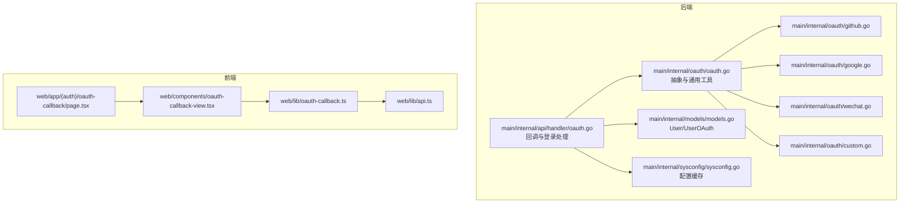
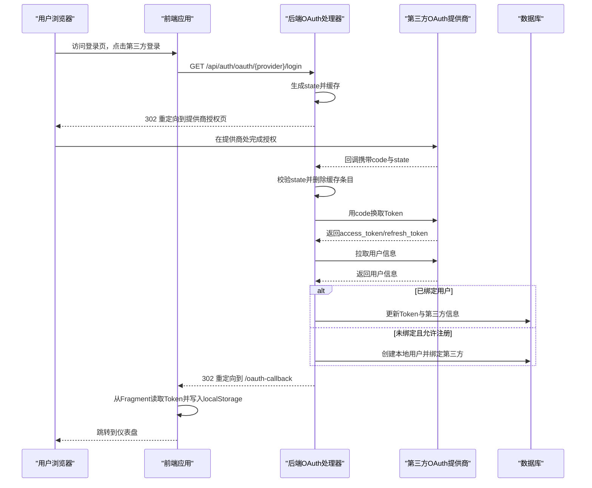
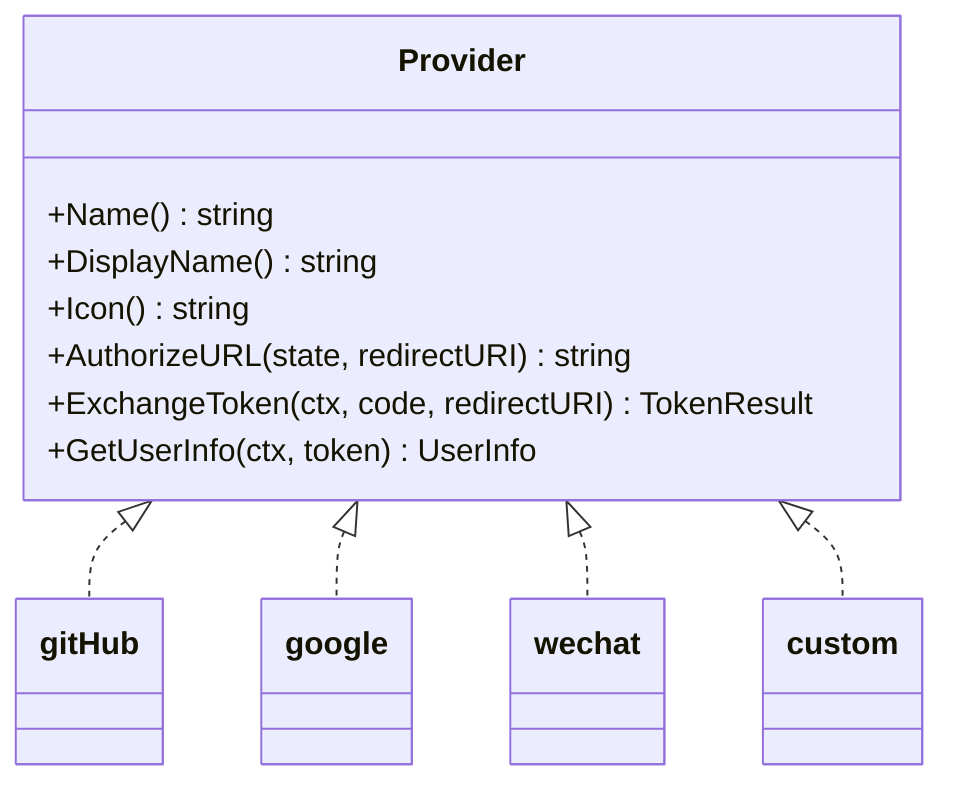
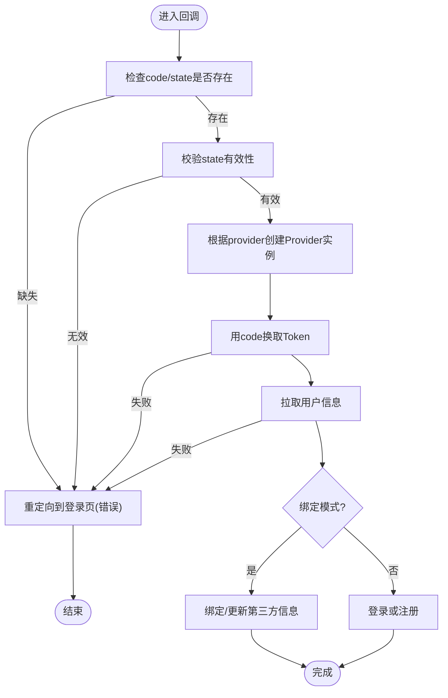
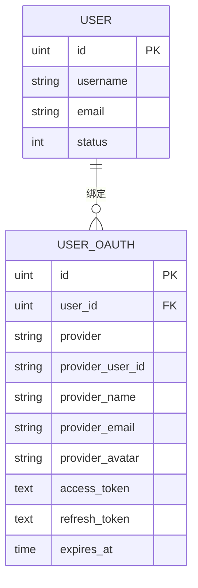
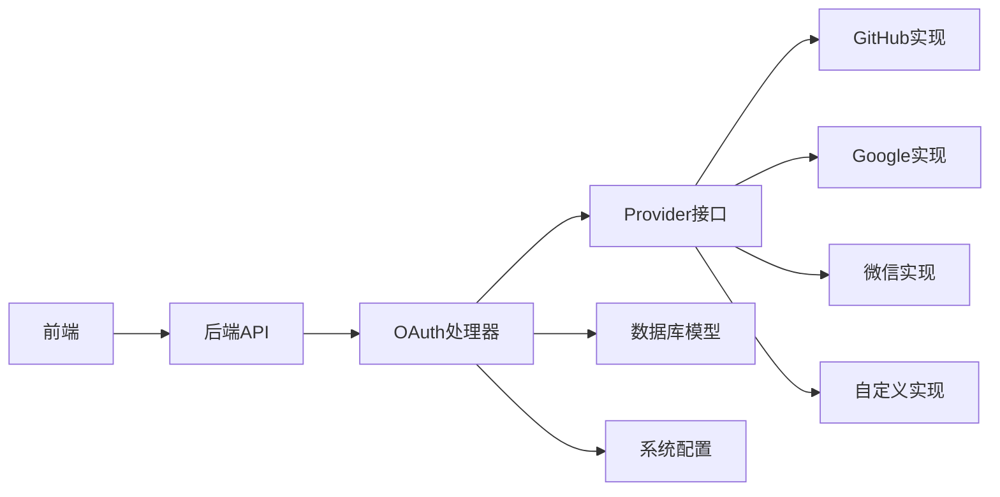

# OAuth集成

<cite>
**本文引用的文件**
- [main.go](file://main/main.go)
- [oauth.go](file://main/internal/oauth/oauth.go)
- [github.go](file://main/internal/oauth/github.go)
- [google.go](file://main/internal/oauth/google.go)
- [wechat.go](file://main/internal/oauth/wechat.go)
- [custom.go](file://main/internal/oauth/custom.go)
- [oauth.go](file://main/internal/api/handler/oauth.go)
- [models.go](file://main/internal/models/models.go)
- [sysconfig.go](file://main/internal/sysconfig/sysconfig.go)
- [oauth-callback.tsx](file://web/app/(auth)/oauth-callback/page.tsx)
- [github-callback.tsx](file://web/app/(auth)/github-callback/page.tsx)
- [oauth-callback-view.tsx](file://web/components/oauth-callback-view.tsx)
- [oauth-callback.ts](file://web/lib/oauth-callback.ts)
- [api.ts](file://web/lib/api.ts)
</cite>

## 目录
1. [简介](#简介)
2. [项目结构](#项目结构)
3. [核心组件](#核心组件)
4. [架构总览](#架构总览)
5. [详细组件分析](#详细组件分析)
6. [依赖关系分析](#依赖关系分析)
7. [性能考量](#性能考量)
8. [故障排查指南](#故障排查指南)
9. [结论](#结论)
10. [附录](#附录)

## 简介
本文件面向希望在系统中集成OAuth登录能力的开发者与运维人员，系统性阐述GitHub、Google、微信及自定义OAuth提供商的接入方式，覆盖回调处理流程、用户信息获取、UserOAuth模型设计与多Provider绑定策略、Token存储与刷新机制、安全与错误处理策略，以及与传统用户名密码登录的协同方案。文档同时提供前后端交互序列图、数据流图与类图，帮助读者快速理解与落地。

## 项目结构
后端采用Go语言与Gin框架，OAuth相关逻辑集中在内部模块，前端使用Next.js与React，通过API层与后端交互。核心目录与职责如下：
- 后端
  - main/internal/oauth：OAuth抽象与各提供商实现
  - main/internal/api/handler：OAuth回调与登录处理API
  - main/internal/models：User与UserOAuth数据模型
  - main/internal/sysconfig：系统配置缓存
- 前端
  - web/app/(auth)/oauth-callback：OAuth回调页面
  - web/components/oauth-callback-view：回调视图组件
  - web/lib/oauth-callback：回调参数解析与错误映射
  - web/lib/api：统一API客户端与鉴权

**图表来源**
- [oauth.go:1-194](file://main/internal/oauth/oauth.go#L1-L194)
- [github.go:1-90](file://main/internal/oauth/github.go#L1-L90)
- [google.go:1-55](file://main/internal/oauth/google.go#L1-L55)
- [wechat.go:1-89](file://main/internal/oauth/wechat.go#L1-L89)
- [custom.go:1-96](file://main/internal/oauth/custom.go#L1-L96)
- [oauth.go:1-448](file://main/internal/api/handler/oauth.go#L1-L448)
- [models.go:33-47](file://main/internal/models/models.go#L33-L47)
- [sysconfig.go:1-47](file://main/internal/sysconfig/sysconfig.go#L1-L47)
- [oauth-callback.tsx](file://web/app/(auth)/oauth-callback/page.tsx#L1-L6)
- [oauth-callback-view.tsx:1-63](file://web/components/oauth-callback-view.tsx#L1-L63)
- [oauth-callback.ts:1-44](file://web/lib/oauth-callback.ts#L1-L44)
- [api.ts:1-709](file://web/lib/api.ts#L1-L709)

**章节来源**
- [main.go:117](file://main/main.go#L117)
- [oauth.go:1-194](file://main/internal/oauth/oauth.go#L1-L194)
- [oauth.go:1-448](file://main/internal/api/handler/oauth.go#L1-L448)
- [models.go:33-47](file://main/internal/models/models.go#L33-L47)

## 核心组件
- Provider接口与实现
  - Provider接口定义了提供商标识、授权URL构造、Token交换、用户信息获取等能力，便于扩展自定义提供商。
  - 内置实现包括GitHub、Google、微信与自定义OAuth。
- OAuth处理器
  - 负责生成state、校验state、处理回调、换取Token、拉取用户信息、登录/注册、绑定与解绑等。
- 数据模型
  - User：本地用户表
  - UserOAuth：第三方绑定表，支持每用户多Provider绑定
- 前端回调
  - 从URL Fragment或查询参数读取Token，避免泄露至Referer与日志；成功后写入本地存储并跳转仪表盘

**章节来源**
- [oauth.go:51-98](file://main/internal/oauth/oauth.go#L51-L98)
- [oauth.go:1-194](file://main/internal/oauth/oauth.go#L1-L194)
- [oauth.go:99-142](file://main/internal/oauth/oauth.go#L99-L142)
- [oauth.go:144-194](file://main/internal/oauth/oauth.go#L144-L194)
- [oauth.go:1-448](file://main/internal/api/handler/oauth.go#L1-L448)
- [models.go:33-47](file://main/internal/models/models.go#L33-L47)
- [oauth-callback-view.tsx:1-63](file://web/components/oauth-callback-view.tsx#L1-L63)
- [oauth-callback.ts:1-44](file://web/lib/oauth-callback.ts#L1-L44)

## 架构总览
下图展示了OAuth登录从浏览器发起到后端完成登录与前端接管Token的完整链路。

**图表来源**
- [oauth.go:60-89](file://main/internal/api/handler/oauth.go#L60-L89)
- [oauth.go:99-158](file://main/internal/api/handler/oauth.go#L99-L158)
- [oauth.go:160-222](file://main/internal/api/handler/oauth.go#L160-L222)
- [oauth.go:224-248](file://main/internal/api/handler/oauth.go#L224-L248)
- [oauth-callback-view.tsx:10-31](file://web/components/oauth-callback-view.tsx#L10-L31)
- [oauth-callback.ts:5-28](file://web/lib/oauth-callback.ts#L5-L28)

## 详细组件分析

### Provider接口与内置实现
- 抽象与工厂
  - Provider接口定义了提供商能力；GetProvider根据名称选择工厂函数创建实例；LoadProviderConfig从系统配置加载提供商参数。
- GitHub
  - 使用标准OAuth Web Flow，授权URL包含邮箱作用域；Token交换与用户信息获取遵循GitHub API规范。
- Google
  - 使用OpenID Connect授权范围；Token交换与用户信息接口符合Google OAuth2规范。
- 微信
  - 使用二维码登录场景，授权URL以微信专用路径与参数；Token交换采用GET而非POST；用户信息接口返回OpenID。
- 自定义OAuth
  - 通过配置authorize_url、token_url、userinfo_url与scopes即可接入任意OpenID Connect兼容提供商。

**图表来源**
- [oauth.go:51-59](file://main/internal/oauth/oauth.go#L51-L59)
- [github.go:12-58](file://main/internal/oauth/github.go#L12-L58)
- [google.go:10-54](file://main/internal/oauth/google.go#L10-L54)
- [wechat.go:10-88](file://main/internal/oauth/wechat.go#L10-L88)
- [custom.go:10-95](file://main/internal/oauth/custom.go#L10-L95)

**章节来源**
- [oauth.go:78-98](file://main/internal/oauth/oauth.go#L78-L98)
- [oauth.go:100-124](file://main/internal/oauth/oauth.go#L100-L124)
- [github.go:16-58](file://main/internal/oauth/github.go#L16-L58)
- [google.go:14-54](file://main/internal/oauth/google.go#L14-L54)
- [wechat.go:14-88](file://main/internal/oauth/wechat.go#L14-L88)
- [custom.go:14-95](file://main/internal/oauth/custom.go#L14-L95)

### OAuth回调处理流程
- state管理
  - 生成随机state并缓存，回调时校验并删除；超时自动清理，防止CSRF与重放攻击。
- 回调入口
  - GitHub使用专用回调路径，其他Provider使用通用路径；回调参数包含code与state。
- Token交换与用户信息
  - 用code换取Token；根据提供商差异调用不同接口；解析用户信息并标准化为统一结构。
- 登录/注册与绑定
  - 若已绑定：更新Token与第三方信息；若未绑定且允许注册：创建本地用户并绑定；绑定模式支持已登录用户将第三方账号与本地账号关联。
- 前端接管
  - 后端重定向到/oauth-callback，携带access_token与refresh_token；前端从Fragment读取并写入localStorage。

**图表来源**
- [oauth.go:99-158](file://main/internal/api/handler/oauth.go#L99-L158)
- [oauth.go:160-222](file://main/internal/api/handler/oauth.go#L160-L222)
- [oauth.go:224-248](file://main/internal/api/handler/oauth.go#L224-L248)
- [oauth-callback-view.tsx:14-31](file://web/components/oauth-callback-view.tsx#L14-L31)

**章节来源**
- [oauth.go:24-52](file://main/internal/api/handler/oauth.go#L24-L52)
- [oauth.go:99-158](file://main/internal/api/handler/oauth.go#L99-L158)
- [oauth.go:160-248](file://main/internal/api/handler/oauth.go#L160-L248)

### UserOAuth模型与多Provider绑定策略
- 模型设计
  - UserOAuth包含用户ID、提供商标识、第三方用户ID、第三方昵称/邮箱/头像、访问与刷新Token、过期时间等字段；提供唯一索引保证每用户每Provider仅一条绑定。
- 多Provider绑定
  - 支持同一本地用户绑定多个第三方Provider；绑定后可使用任一Provider登录。
- 绑定管理API
  - 获取绑定列表、生成绑定URL、解绑等；管理员可查看与解绑用户绑定。

**图表来源**
- [models.go:33-47](file://main/internal/models/models.go#L33-L47)

**章节来源**
- [models.go:33-47](file://main/internal/models/models.go#L33-L47)
- [oauth.go:303-347](file://main/internal/api/handler/oauth.go#L303-L347)
- [oauth.go:349-416](file://main/internal/api/handler/oauth.go#L349-L416)

### OAuth Token的存储、刷新与过期处理
- 存储
  - 后端在UserOAuth中持久化access_token、refresh_token与expires_at；前端在localStorage中保存access_token与refresh_token。
- 刷新
  - 前端通过API客户端在401时触发刷新流程；后端基于refresh token轮换JTI并生成新的token pair。
- 过期
  - 若expires_at存在，可在登录成功后写入UserOAuth；前端在请求时检查token有效期并在必要时刷新。

**章节来源**
- [oauth.go:250-268](file://main/internal/api/handler/oauth.go#L250-L268)
- [api.ts:31-37](file://web/lib/api.ts#L31-L37)
- [api.ts:82-88](file://web/lib/api.ts#L82-L88)

### 自定义OAuth提供商的集成方法
- 配置项
  - authorize_url、token_url、userinfo_url、scopes、display_name等；可选AppID/AppKey/AppSecret用于微信风格。
- 实现步骤
  - 通过ProviderConfig构造Provider实例；实现AuthorizeURL、ExchangeToken、GetUserInfo；注册到工厂映射。
- 兼容性
  - 支持OpenID Connect标准字段解析；若第三方返回字段不一致，可在GetUserInfo中做适配。

**章节来源**
- [oauth.go:35-49](file://main/internal/oauth/oauth.go#L35-L49)
- [oauth.go:69-76](file://main/internal/oauth/oauth.go#L69-L76)
- [custom.go:23-95](file://main/internal/oauth/custom.go#L23-L95)

### OAuth登录、用户绑定、第三方信息同步的实际代码示例
- 获取提供商列表（公开API）
  - 路径：/api/auth/oauth/providers
  - 示例路径：[oauth.go:54-58](file://main/internal/api/handler/oauth.go#L54-L58)
- 发起登录（重定向到提供商）
  - 路径：/api/auth/oauth/:provider/login
  - 示例路径：[oauth.go:60-89](file://main/internal/api/handler/oauth.go#L60-L89)
- 处理回调（换取Token与用户信息）
  - 路径：/api/auth/github/callback 或 /api/auth/oauth/:provider/callback
  - 示例路径：[oauth.go:99-158](file://main/internal/api/handler/oauth.go#L99-L158)
- 获取绑定列表（需认证）
  - 路径：/user/oauth/bindings
  - 示例路径：[oauth.go:303-309](file://main/internal/api/handler/oauth.go#L303-L309)
- 生成绑定URL（需认证）
  - 路径：/user/oauth/bind-url
  - 示例路径：[oauth.go:311-347](file://main/internal/api/handler/oauth.go#L311-L347)
- 解绑（需认证）
  - 路径：/user/oauth/unbind
  - 示例路径：[oauth.go:349-373](file://main/internal/api/handler/oauth.go#L349-L373)
- 前端回调处理（读取Token）
  - 示例路径：[oauth-callback-view.tsx:22-28](file://web/components/oauth-callback-view.tsx#L22-L28)
  - 示例路径：[oauth-callback.ts:5-28](file://web/lib/oauth-callback.ts#L5-L28)

**章节来源**
- [oauth.go:54-58](file://main/internal/api/handler/oauth.go#L54-L58)
- [oauth.go:60-89](file://main/internal/api/handler/oauth.go#L60-L89)
- [oauth.go:99-158](file://main/internal/api/handler/oauth.go#L99-L158)
- [oauth.go:303-347](file://main/internal/api/handler/oauth.go#L303-L347)
- [oauth.go:349-373](file://main/internal/api/handler/oauth.go#L349-L373)
- [oauth-callback-view.tsx:22-28](file://web/components/oauth-callback-view.tsx#L22-L28)
- [oauth-callback.ts:5-28](file://web/lib/oauth-callback.ts#L5-L28)

### OAuth与传统用户名密码登录的结合使用
- 登录方式并存
  - 用户既可通过第三方Provider一键登录，也可使用用户名密码登录；二者共享同一用户体系。
- 绑定策略
  - 已登录用户可将第三方账号绑定到本地账号，实现“多入口登录”。
- 注册策略
  - 未绑定且允许注册时，系统自动创建本地用户并绑定第三方信息。

**章节来源**
- [oauth.go:160-222](file://main/internal/api/handler/oauth.go#L160-L222)
- [oauth.go:224-248](file://main/internal/api/handler/oauth.go#L224-L248)

## 依赖关系分析
- 组件耦合
  - Handler依赖Provider接口与数据库模型；Provider实现彼此独立，通过配置驱动；前端通过API客户端与后端交互。
- 外部依赖
  - GitHub、Google、微信的授权与Token接口；Redis缓存（可选）用于配置与状态缓存。
- 潜在循环依赖
  - 当前模块间为单向依赖，未发现循环导入。

**图表来源**
- [oauth.go:51-98](file://main/internal/oauth/oauth.go#L51-L98)
- [oauth.go:1-448](file://main/internal/api/handler/oauth.go#L1-L448)
- [models.go:33-47](file://main/internal/models/models.go#L33-L47)
- [sysconfig.go:27-36](file://main/internal/sysconfig/sysconfig.go#L27-L36)

**章节来源**
- [oauth.go:51-98](file://main/internal/oauth/oauth.go#L51-L98)
- [oauth.go:1-448](file://main/internal/api/handler/oauth.go#L1-L448)
- [models.go:33-47](file://main/internal/models/models.go#L33-L47)
- [sysconfig.go:27-36](file://main/internal/sysconfig/sysconfig.go#L27-L36)

## 性能考量
- 状态缓存与清理
  - state缓存采用内存Map并定期清理，避免长期驻留导致内存膨胀。
- HTTP调用超时
  - 与第三方提供商交互设置合理超时，避免阻塞请求线程。
- 配置缓存
  - 系统配置读取增加缓存层，降低DB压力。
- Token存储
  - 建议在expires_at存在时持久化过期时间，减少无效请求。

**章节来源**
- [oauth.go:24-52](file://main/internal/api/handler/oauth.go#L24-L52)
- [oauth.go:146-182](file://main/internal/oauth/oauth.go#L146-L182)
- [sysconfig.go:27-36](file://main/internal/sysconfig/sysconfig.go#L27-L36)

## 故障排查指南
- 常见错误与定位
  - invalid_state：state不存在或过期，检查state生成与缓存清理逻辑。
  - provider_error：提供商未正确配置，检查ClientID/ClientSecret/AuthorizeURL/TokenURL等。
  - token_failed：第三方Token交换失败，检查网络与回调地址。
  - userinfo_failed：第三方用户信息拉取失败，检查作用域与Token有效性。
  - register_disabled：未开放新用户注册，调整系统配置。
  - account_disabled：本地账户被禁用，联系管理员。
  - already_bound_other：第三方账号已被其他用户绑定，建议解绑后再绑定。
- 前端错误提示
  - 前端回调页面根据错误码显示友好提示，并引导回登录页。

**章节来源**
- [oauth.go:106-158](file://main/internal/api/handler/oauth.go#L106-L158)
- [oauth-callback.tsx:30-43](file://web/lib/oauth-callback.ts#L30-L43)
- [oauth-callback-view.tsx:14-20](file://web/components/oauth-callback-view.tsx#L14-L20)

## 结论
本系统通过Provider接口抽象与工厂模式，实现了对GitHub、Google、微信与自定义OAuth提供商的统一接入；配合UserOAuth模型与绑定管理API，支持多Provider登录与绑定策略；前端通过Fragment传递Token并避免泄露，后端在回调阶段完成登录/注册与绑定，并提供完善的错误处理与安全控制。整体架构清晰、扩展性强，适合在生产环境中稳定运行。

## 附录
- 关键API一览
  - 获取提供商列表：/api/auth/oauth/providers
  - 发起登录：/api/auth/oauth/:provider/login
  - 处理回调：/api/auth/github/callback 或 /api/auth/oauth/:provider/callback
  - 获取绑定：/user/oauth/bindings
  - 生成绑定URL：/user/oauth/bind-url
  - 解绑：/user/oauth/unbind
- 前端回调页面
  - /oauth-callback
  - /github-callback（兼容旧书签）