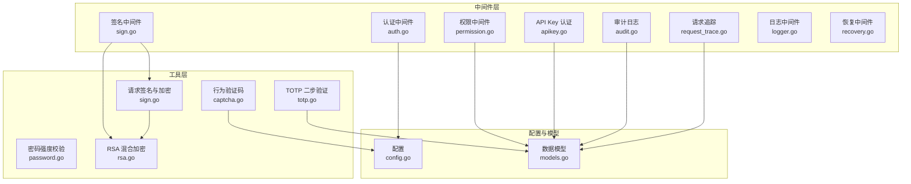
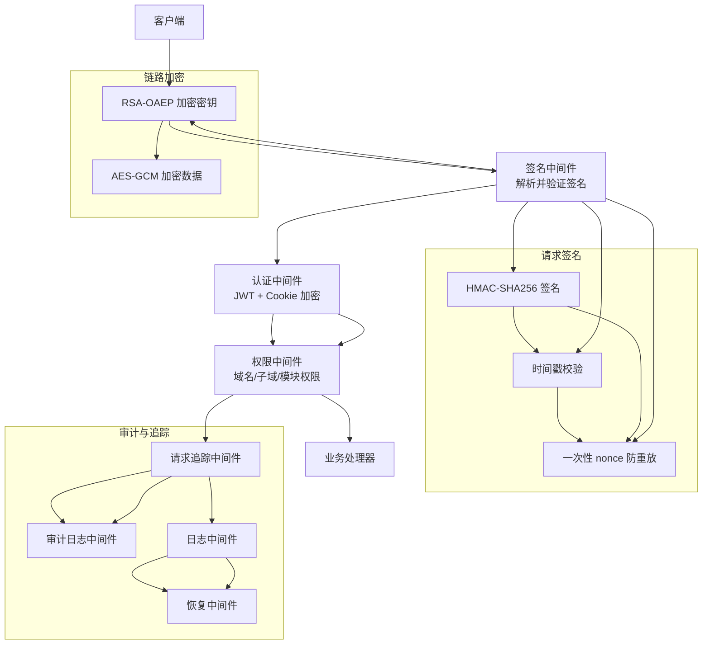
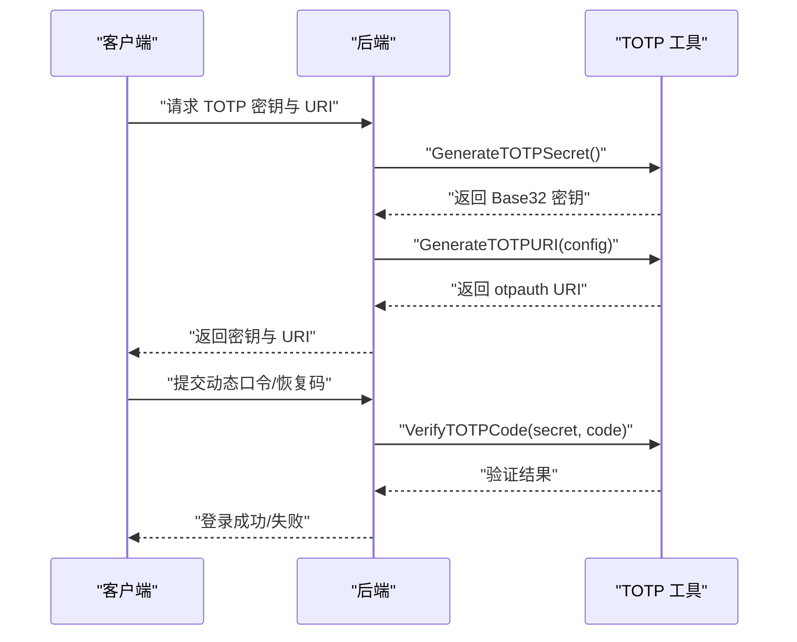
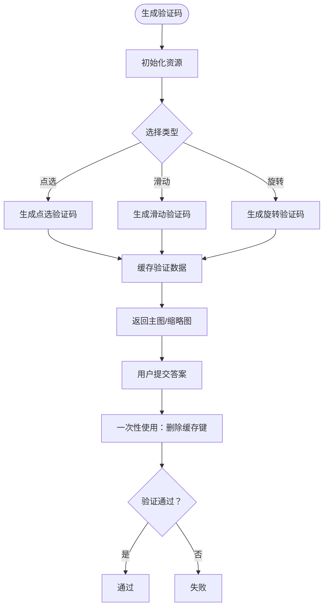
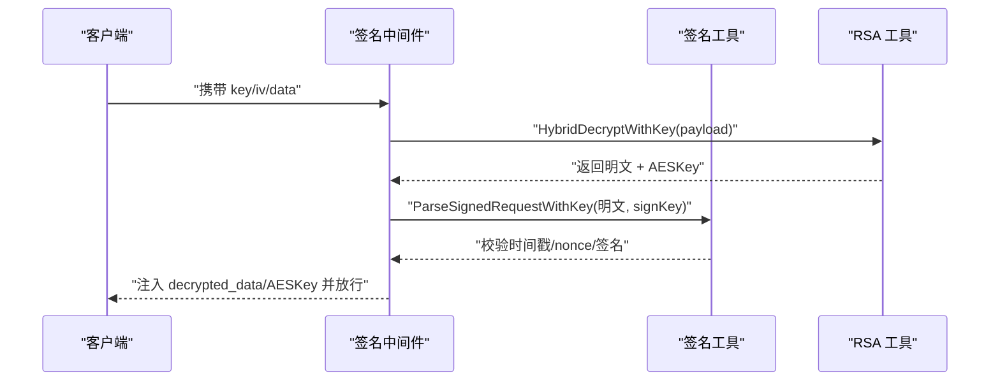
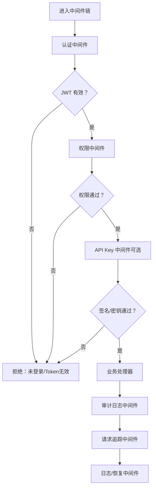
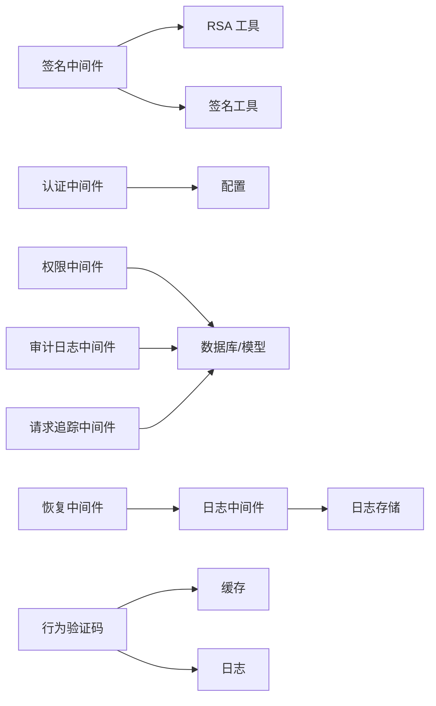

# 安全防护

<cite>
**本文引用的文件**
- [密码强度校验](file://main/internal/utils/password.go)
- [TOTP 二步验证](file://main/internal/utils/totp.go)
- [请求签名与加密](file://main/internal/utils/sign.go)
- [RSA 混合加密](file://main/internal/utils/rsa.go)
- [行为验证码](file://main/internal/captcha/captcha.go)
- [签名中间件](file://main/internal/api/middleware/sign.go)
- [认证中间件](file://main/internal/api/middleware/auth.go)
- [权限中间件](file://main/internal/api/middleware/permission.go)
- [API Key 认证中间件](file://main/internal/api/middleware/apikey.go)
- [审计日志中间件](file://main/internal/api/middleware/audit.go)
- [请求追踪中间件](file://main/internal/api/middleware/request_trace.go)
- [日志中间件](file://main/internal/api/middleware/logger.go)
- [恢复中间件](file://main/internal/api/middleware/recovery.go)
- [配置](file://main/internal/config/config.go)
- [数据模型](file://main/internal/models/models.go)
</cite>

## 目录
1. [简介](#简介)
2. [项目结构](#项目结构)
3. [核心组件](#核心组件)
4. [架构总览](#架构总览)
5. [详细组件分析](#详细组件分析)
6. [依赖关系分析](#依赖关系分析)
7. [性能考量](#性能考量)
8. [故障排查指南](#故障排查指南)
9. [结论](#结论)
10. [附录](#附录)

## 简介
本文件面向安全工程师与后端开发者，系统化梳理本项目的安全防护体系，包括密码加密与存储策略、TOTP 双因子认证、行为验证码（Behavioral Captcha）防刷机制、请求签名验证与 API 安全防护、暴力破解与频率限制策略、安全中间件的拦截逻辑、安全配置最佳实践以及安全事件的日志与告警机制。文档以代码为依据，辅以可视化图示，帮助读者快速理解并落地实施。

## 项目结构
安全相关能力主要分布在以下模块：
- 工具层：密码强度校验、TOTP、请求签名与加密、RSA 混合加密、行为验证码
- 中间件层：认证、权限、API Key、签名、审计、请求追踪、日志、恢复
- 配置与模型：JWT 密钥、Redis、日志清理、用户与权限模型

**图表来源**
- [认证中间件:124-199](file://main/internal/api/middleware/auth.go#L124-L199)
- [权限中间件:132-207](file://main/internal/api/middleware/permission.go#L132-L207)
- [API Key 认证中间件:44-105](file://main/internal/api/middleware/apikey.go#L44-L105)
- [签名中间件:14-69](file://main/internal/api/middleware/sign.go#L14-L69)
- [审计日志中间件:21-88](file://main/internal/api/middleware/audit.go#L21-L88)
- [请求追踪中间件:95-242](file://main/internal/api/middleware/request_trace.go#L95-L242)
- [日志中间件:156-232](file://main/internal/api/middleware/logger.go#L156-L232)
- [恢复中间件:21-75](file://main/internal/api/middleware/recovery.go#L21-L75)
- [请求签名与加密:35-62](file://main/internal/utils/sign.go#L35-L62)
- [RSA 混合加密:131-192](file://main/internal/utils/rsa.go#L131-L192)
- [行为验证码:46-51](file://main/internal/captcha/captcha.go#L46-L51)
- [配置:77-123](file://main/internal/config/config.go#L77-L123)
- [数据模型:9-31](file://main/internal/models/models.go#L9-L31)

**章节来源**
- [认证中间件:124-199](file://main/internal/api/middleware/auth.go#L124-L199)
- [权限中间件:132-207](file://main/internal/api/middleware/permission.go#L132-L207)
- [API Key 认证中间件:44-105](file://main/internal/api/middleware/apikey.go#L44-L105)
- [签名中间件:14-69](file://main/internal/api/middleware/sign.go#L14-L69)
- [审计日志中间件:21-88](file://main/internal/api/middleware/audit.go#L21-L88)
- [请求追踪中间件:95-242](file://main/internal/api/middleware/request_trace.go#L95-L242)
- [日志中间件:156-232](file://main/internal/api/middleware/logger.go#L156-L232)
- [恢复中间件:21-75](file://main/internal/api/middleware/recovery.go#L21-L75)
- [请求签名与加密:35-62](file://main/internal/utils/sign.go#L35-L62)
- [RSA 混合加密:131-192](file://main/internal/utils/rsa.go#L131-L192)
- [行为验证码:46-51](file://main/internal/captcha/captcha.go#L46-L51)
- [配置:77-123](file://main/internal/config/config.go#L77-L123)
- [数据模型:9-31](file://main/internal/models/models.go#L9-L31)

## 核心组件
- 密码强度校验：确保密码最小长度与字符类型要求，降低弱口令风险。
- TOTP 二步验证：基于时间窗口的动态口令，支持 URI 生成、密钥校验与恢复码机制。
- 请求签名与加密：HMAC-SHA256 签名、时间戳校验、一次性 nonce 防重放、AES-GCM 响应混淆。
- RSA 混合加密：RSA-OAEP 加密 AES 密钥，AES-GCM 加密请求体，服务端私钥持久化。
- 行为验证码：点选/滑动/旋转三类行为验证码，缓存验证数据，一次性使用。
- 中间件体系：认证、权限、API Key、签名、审计、请求追踪、日志、恢复，形成纵深防御。
- 配置与模型：JWT 密钥、Redis、日志清理策略，用户与权限模型支撑访问控制。

**章节来源**
- [密码强度校验:17-45](file://main/internal/utils/password.go#L17-L45)
- [TOTP 二步验证:15-161](file://main/internal/utils/totp.go#L15-L161)
- [请求签名与加密:20-280](file://main/internal/utils/sign.go#L20-L280)
- [RSA 混合加密:124-374](file://main/internal/utils/rsa.go#L124-L374)
- [行为验证码:29-410](file://main/internal/captcha/captcha.go#L29-L410)
- [认证中间件:124-199](file://main/internal/api/middleware/auth.go#L124-L199)
- [权限中间件:132-207](file://main/internal/api/middleware/permission.go#L132-L207)
- [API Key 认证中间件:44-105](file://main/internal/api/middleware/apikey.go#L44-L105)
- [签名中间件:14-69](file://main/internal/api/middleware/sign.go#L14-L69)
- [审计日志中间件:21-88](file://main/internal/api/middleware/audit.go#L21-L88)
- [请求追踪中间件:95-242](file://main/internal/api/middleware/request_trace.go#L95-L242)
- [日志中间件:156-232](file://main/internal/api/middleware/logger.go#L156-L232)
- [恢复中间件:21-75](file://main/internal/api/middleware/recovery.go#L21-L75)
- [配置:77-123](file://main/internal/config/config.go#L77-L123)
- [数据模型:9-31](file://main/internal/models/models.go#L9-L31)

## 架构总览
整体安全架构采用“链路加密 + 请求签名 + 多层认证 + 审计追踪”的设计，前端通过 RSA 公钥加密请求体，后端使用私钥解密；请求体内的签名字段用于防篡改与时序校验；认证中间件结合 JWT 与 Cookie 加密，配合权限中间件进行细粒度授权；API Key 通道用于第三方集成；行为验证码用于高危场景的人机识别；日志与审计中间件记录关键事件，恢复中间件兜底异常。

**图表来源**
- [签名中间件:14-69](file://main/internal/api/middleware/sign.go#L14-L69)
- [请求签名与加密:86-141](file://main/internal/utils/sign.go#L86-L141)
- [RSA 混合加密:207-262](file://main/internal/utils/rsa.go#L207-L262)
- [认证中间件:124-199](file://main/internal/api/middleware/auth.go#L124-L199)
- [权限中间件:132-207](file://main/internal/api/middleware/permission.go#L132-L207)
- [请求追踪中间件:95-242](file://main/internal/api/middleware/request_trace.go#L95-L242)
- [审计日志中间件:21-88](file://main/internal/api/middleware/audit.go#L21-L88)
- [日志中间件:156-232](file://main/internal/api/middleware/logger.go#L156-L232)
- [恢复中间件:21-75](file://main/internal/api/middleware/recovery.go#L21-L75)

## 详细组件分析

### 密码加密机制与安全存储策略
- 密码强度校验：要求最小长度与包含大写、小写、数字，降低弱口令概率。
- 存储策略：用户模型包含 Password 字段，建议在入库前进行哈希处理（例如 bcrypt），并避免明文落库。
- 最佳实践：
  - 入库前必须进行强哈希（不可逆），盐值随机且足够长。
  - 禁止在日志或响应中回显密码摘要以外的敏感信息。
  - 定期轮换哈希算法与参数，确保向前兼容。

**章节来源**
- [密码强度校验:17-45](file://main/internal/utils/password.go#L17-L45)
- [数据模型:9-31](file://main/internal/models/models.go#L9-L31)

### TOTP 双因子认证
- 密钥生成：20 字节随机密钥，Base32 编码，支持恢复码生成与一次性使用。
- URI 生成：标准化 otpauth URI，便于移动应用扫码导入。
- 验证流程：当前时间窗口及前后 1 个窗口（30 秒）内验证，支持去除空格与大小写归一化。
- 恢复码：一次性使用，使用后从列表移除，防止滥用。
- 集成方式：
  - 生成密钥与 URI，下发给用户扫描。
  - 登录时要求输入动态口令或恢复码。
  - 与用户模型的 TOTP 字段配合，开启/关闭 TOTP。

**图表来源**
- [TOTP 二步验证:25-79](file://main/internal/utils/totp.go#L25-L79)
- [TOTP 二步验证:35-62](file://main/internal/utils/totp.go#L35-L62)
- [TOTP 二步验证:149-160](file://main/internal/utils/totp.go#L149-L160)

**章节来源**
- [TOTP 二步验证:15-161](file://main/internal/utils/totp.go#L15-L161)
- [数据模型:19-26](file://main/internal/models/models.go#L19-L26)

### 行为验证码（Behavioral Captcha）工作原理与防刷机制
- 验证码类型：点选、滑动、旋转三类，分别生成主图与缩略图/滑块图，缓存验证数据。
- 一次性使用：验证后立即删除缓存键，防止重放。
- 容差控制：点选按像素容差、滑动与旋转按角度容差，记录调试日志便于分析偏差。
- 资源初始化：字体、背景图、滑块图等资源嵌入，首次使用时初始化。
- 防刷要点：
  - 验证码有效期短（5 分钟），超时即失效。
  - 一次性使用，避免被批量验证。
  - 前端展示与后端缓存分离，降低伪造难度。

**图表来源**
- [行为验证码:46-51](file://main/internal/captcha/captcha.go#L46-L51)
- [行为验证码:144-161](file://main/internal/captcha/captcha.go#L144-L161)
- [行为验证码:281-300](file://main/internal/captcha/captcha.go#L281-L300)
- [行为验证码:302-382](file://main/internal/captcha/captcha.go#L302-L382)

**章节来源**
- [行为验证码:29-410](file://main/internal/captcha/captcha.go#L29-L410)

### 请求签名验证与 API 安全防护
- 签名要素：时间戳（±5 分钟容差）、一次性 nonce（10 分钟过期）、HMAC-SHA256 签名。
- 解析流程：从请求体解析 _t、_n、_s，校验时间戳与 nonce，使用派生密钥验证签名。
- 派生密钥：从 Authorization 与自定义头组合派生 HMAC 密钥，提升抗重放能力。
- 响应混淆：AES-GCM 加密响应数据，返回混淆结构，保护敏感信息。
- 中间件职责：签名中间件负责解密与签名验证，统一注入解密数据与 AES 密钥到上下文。

**图表来源**
- [签名中间件:14-69](file://main/internal/api/middleware/sign.go#L14-L69)
- [请求签名与加密:86-141](file://main/internal/utils/sign.go#L86-L141)
- [RSA 混合加密:217-262](file://main/internal/utils/rsa.go#L217-L262)

**章节来源**
- [请求签名与加密:20-280](file://main/internal/utils/sign.go#L20-L280)
- [RSA 混合加密:124-374](file://main/internal/utils/rsa.go#L124-L374)
- [签名中间件:14-69](file://main/internal/api/middleware/sign.go#L14-L69)

### 暴力破解防护、频率限制与 IP 封禁策略
- 当前实现重点：
  - 时间戳与 nonce 防重放，降低重放与暴力尝试成本。
  - API Key 认证对时间戳进行容差校验，避免重放。
  - 审计日志中间件记录写操作，便于事后分析。
- 建议补充：
  - 针对登录/验证码/重置等高危接口增加速率限制（如 Redis 计数器）。
  - 基于 IP/用户维度的滑动窗口计数，触发临时封禁与二次验证。
  - 结合网关或 WAF 实施更细粒度的 DDoS 与爬虫防护。

**章节来源**
- [请求签名与加密:144-178](file://main/internal/utils/sign.go#L144-L178)
- [API Key 认证中间件:44-105](file://main/internal/api/middleware/apikey.go#L44-L105)
- [审计日志中间件:21-88](file://main/internal/api/middleware/audit.go#L21-L88)

### 安全中间件实现与拦截逻辑
- 认证中间件：
  - 从 Cookie 解密出 AccessToken，与 Authorization 头对比，双重校验。
  - 校验 JWT 有效性与类型，缓存用户信息减少 DB 压力。
  - 支持刷新 Token 的 JTI 轮转与重用检测。
- 权限中间件：
  - 管理员放行，普通用户按域名/子域/模块权限校验。
  - 委派权限合并与只读控制，子域二次校验。
- API Key 中间件：
  - 校验 X-API-UID、X-API-Timestamp、X-API-Sign 三要素。
  - 常量时间比较防时序攻击，时间戳容差 ±5 分钟。
- 审计与追踪：
  - 写操作自动审计，异步落库。
  - 请求追踪记录请求/响应、DB 查询、错误堆栈，便于排障。

**图表来源**
- [认证中间件:124-199](file://main/internal/api/middleware/auth.go#L124-L199)
- [权限中间件:132-207](file://main/internal/api/middleware/permission.go#L132-L207)
- [API Key 认证中间件:44-105](file://main/internal/api/middleware/apikey.go#L44-L105)
- [审计日志中间件:21-88](file://main/internal/api/middleware/audit.go#L21-L88)
- [请求追踪中间件:95-242](file://main/internal/api/middleware/request_trace.go#L95-L242)
- [日志中间件:156-232](file://main/internal/api/middleware/logger.go#L156-L232)
- [恢复中间件:21-75](file://main/internal/api/middleware/recovery.go#L21-L75)

**章节来源**
- [认证中间件:124-199](file://main/internal/api/middleware/auth.go#L124-L199)
- [权限中间件:132-207](file://main/internal/api/middleware/permission.go#L132-L207)
- [API Key 认证中间件:44-105](file://main/internal/api/middleware/apikey.go#L44-L105)
- [审计日志中间件:21-88](file://main/internal/api/middleware/audit.go#L21-L88)
- [请求追踪中间件:95-242](file://main/internal/api/middleware/request_trace.go#L95-L242)
- [日志中间件:156-232](file://main/internal/api/middleware/logger.go#L156-L232)
- [恢复中间件:21-75](file://main/internal/api/middleware/recovery.go#L21-L75)

### 安全配置最佳实践
- JWT 密钥：
  - 配置文件中提供随机密钥生成逻辑，生产环境务必替换默认密钥。
- Redis：
  - 启用密码与网络隔离，合理设置连接池与键前缀，避免命名冲突。
- 日志清理：
  - 控制成功/错误日志保留数量与清理周期，平衡取证与存储成本。
- Cookie 安全：
  - 使用 HttpOnly、SameSite、Secure 标记，HTTPS 场景启用 Strict-Transport-Security。
- CORS：
  - 仅允许受控来源，避免反射型跨域风险。

**章节来源**
- [配置:77-123](file://main/internal/config/config.go#L77-L123)
- [认证中间件:469-482](file://main/internal/api/middleware/auth.go#L469-L482)
- [认证中间件:490-508](file://main/internal/api/middleware/auth.go#L490-L508)

### 安全事件日志记录与告警机制
- 请求追踪：记录请求 ID、用户、方法、路径、头、体、响应、耗时、错误信息与堆栈。
- 审计日志：自动记录写操作，异步落库，支持跳过规则（如查询类接口）。
- 日志中间件：彩色控制台输出与结构化文件日志，慢请求告警。
- 恢复中间件：区分客户端断开与真实 panic，记录堆栈并返回统一错误。
- 建议：
  - 将请求日志与审计日志接入集中式日志平台，设置告警规则。
  - 对高频错误与异常模式进行聚合分析与自动告警。

**章节来源**
- [请求追踪中间件:95-242](file://main/internal/api/middleware/request_trace.go#L95-L242)
- [审计日志中间件:21-88](file://main/internal/api/middleware/audit.go#L21-L88)
- [日志中间件:156-232](file://main/internal/api/middleware/logger.go#L156-L232)
- [恢复中间件:21-75](file://main/internal/api/middleware/recovery.go#L21-L75)

## 依赖关系分析
- 中间件依赖：
  - 签名中间件依赖 RSA 工具与签名工具。
  - 认证中间件依赖配置与 JWT。
  - 权限中间件依赖数据库与模型。
  - 审计与追踪依赖数据库与日志存储。
- 工具依赖：
  - 签名工具依赖 HMAC、时间与 nonce 缓存。
  - RSA 工具依赖 PEM 文件与密钥持久化。
  - 行为验证码依赖缓存与日志。

**图表来源**
- [签名中间件:14-69](file://main/internal/api/middleware/sign.go#L14-L69)
- [请求签名与加密:35-62](file://main/internal/utils/sign.go#L35-L62)
- [RSA 混合加密:131-192](file://main/internal/utils/rsa.go#L131-L192)
- [认证中间件:34-38](file://main/internal/api/middleware/auth.go#L34-L38)
- [权限中间件:18-21](file://main/internal/api/middleware/permission.go#L18-L21)
- [审计日志中间件:74-87](file://main/internal/api/middleware/audit.go#L74-L87)
- [请求追踪中间件:235-241](file://main/internal/api/middleware/request_trace.go#L235-L241)
- [日志中间件:208-230](file://main/internal/api/middleware/logger.go#L208-L230)
- [恢复中间件:21-75](file://main/internal/api/middleware/recovery.go#L21-L75)
- [行为验证码:9-11](file://main/internal/captcha/captcha.go#L9-L11)

**章节来源**
- [签名中间件:14-69](file://main/internal/api/middleware/sign.go#L14-L69)
- [请求签名与加密:35-62](file://main/internal/utils/sign.go#L35-L62)
- [RSA 混合加密:131-192](file://main/internal/utils/rsa.go#L131-L192)
- [认证中间件:34-38](file://main/internal/api/middleware/auth.go#L34-L38)
- [权限中间件:18-21](file://main/internal/api/middleware/permission.go#L18-L21)
- [审计日志中间件:74-87](file://main/internal/api/middleware/audit.go#L74-L87)
- [请求追踪中间件:235-241](file://main/internal/api/middleware/request_trace.go#L235-L241)
- [日志中间件:208-230](file://main/internal/api/middleware/logger.go#L208-L230)
- [恢复中间件:21-75](file://main/internal/api/middleware/recovery.go#L21-L75)
- [行为验证码:9-11](file://main/internal/captcha/captcha.go#L9-L11)

## 性能考量
- 认证缓存：用户信息缓存 TTL 降低 DB 压力，但需在权限变更时及时失效。
- 日志落库：异步写入，避免阻塞请求；注意日志体量增长与清理策略。
- 验证码缓存：短 TTL 与一次性使用，避免缓存膨胀。
- 签名与加密：RSA 解密与 HMAC 校验为 CPU 密集型，建议在高并发场景评估硬件与连接池。

[本节为通用指导，无需特定文件引用]

## 故障排查指南
- 连接中断：恢复中间件区分“Broken Pipe”与真实 panic，前者仅记录警告，后者记录堆栈并返回 500。
- 请求追踪：通过 X-Request-ID 关联日志，定位慢请求与错误堆栈。
- 审计日志：确认写操作是否被正确记录，核对跳过规则。
- 签名失败：检查时间戳、nonce、签名三要素，确认密钥派生与编码一致性。
- 行为验证码：确认验证码未过期、缓存键存在且一次性使用。

**章节来源**
- [恢复中间件:21-75](file://main/internal/api/middleware/recovery.go#L21-L75)
- [请求追踪中间件:252-273](file://main/internal/api/middleware/request_trace.go#L252-L273)
- [审计日志中间件:125-143](file://main/internal/api/middleware/audit.go#L125-L143)
- [请求签名与加密:144-196](file://main/internal/utils/sign.go#L144-L196)
- [行为验证码:281-300](file://main/internal/captcha/captcha.go#L281-L300)

## 结论
本项目在链路加密、请求签名、多层认证与审计追踪方面形成了较为完整的安全闭环。建议在现有基础上补充速率限制、IP 封禁与更细粒度的 WAF 防护，并完善日志告警与自动化处置流程，以进一步提升抗攻击能力与可观测性。

[本节为总结性内容，无需特定文件引用]

## 附录
- 数据模型关键字段：
  - 用户：用户名、密码、邮箱、API 标识、API Key、级别、状态、TOTP 开关与密钥、权限 JSON、重置 Token/类型/过期。
  - 权限：用户 ID、域名 ID、域名、子域限制、只读标志、过期时间。
  - 请求日志：请求 ID、错误 ID、用户 ID/名、方法、路径、查询、头、体、响应、状态码、耗时、错误信息、DB 查询、附加信息、时间戳。

**章节来源**
- [数据模型:9-31](file://main/internal/models/models.go#L9-L31)
- [数据模型:93-103](file://main/internal/models/models.go#L93-L103)
- [数据模型:332-357](file://main/internal/models/models.go#L332-L357)