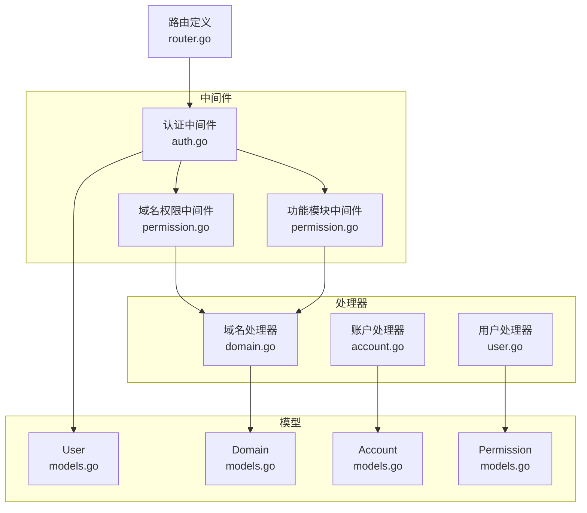
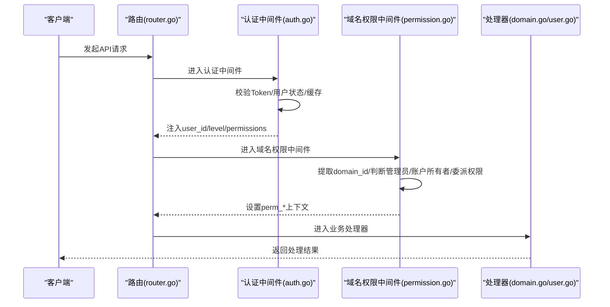
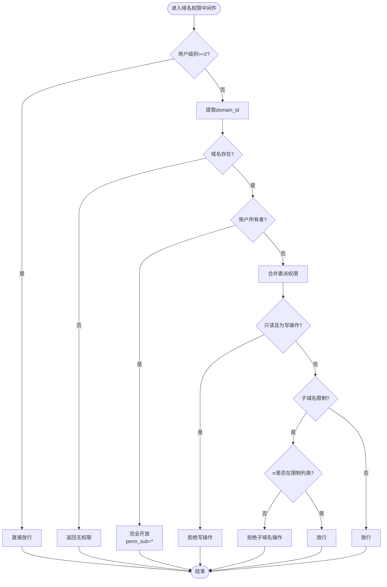
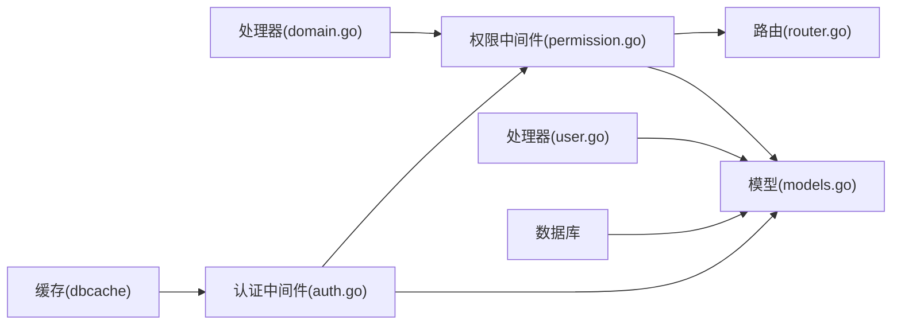

# 权限控制

<cite>
**本文引用的文件**
- [permission.go](file://main/internal/api/middleware/permission.go)
- [models.go](file://main/internal/models/models.go)
- [domain.go](file://main/internal/api/handler/domain.go)
- [user.go](file://main/internal/api/handler/user.go)
- [router.go](file://main/internal/api/router.go)
- [auth.go](file://main/internal/api/middleware/auth.go)
- [dbcache.go](file://main/internal/dbcache/dbcache.go)
- [keys.go](file://main/internal/dbcache/keys.go)
- [account.go](file://main/internal/api/handler/account.go)
</cite>

## 目录
1. [简介](#简介)
2. [项目结构](#项目结构)
3. [核心组件](#核心组件)
4. [架构总览](#架构总览)
5. [详细组件分析](#详细组件分析)
6. [依赖分析](#依赖分析)
7. [性能考量](#性能考量)
8. [故障排查指南](#故障排查指南)
9. [结论](#结论)
10. [附录](#附录)

## 简介
本文件面向权限控制系统，围绕基于角色的权限模型（RBAC）进行深入技术说明，涵盖用户级别（normal/admin）、功能权限（模块白名单）、域名级细粒度权限（只读与子域名限制）、权限验证中间件工作流与算法、权限继承与组合机制，以及权限分配、查询、更新的实际代码路径示例。同时提供最佳实践与安全考虑，以及权限失效与缓存更新策略。

## 项目结构
权限控制相关代码主要分布在以下模块：
- 中间件层：认证与权限中间件（鉴权、功能模块白名单、域名权限）
- 数据模型层：用户、域名、账户、权限等核心模型
- 处理器层：域名、用户、账户等业务处理器，使用中间件进行权限校验
- 路由层：API 路由定义，挂载权限中间件
- 缓存层：热点数据读穿缓存与失效策略

图表来源
- [router.go:14-163](file://main/internal/api/router.go#L14-L163)
- [auth.go:124-199](file://main/internal/api/middleware/auth.go#L124-L199)
- [permission.go:132-207](file://main/internal/api/middleware/permission.go#L132-L207)
- [domain.go:79-196](file://main/internal/api/handler/domain.go#L79-L196)
- [user.go:167-254](file://main/internal/api/handler/user.go#L167-L254)
- [models.go:9-31](file://main/internal/models/models.go#L9-L31)
- [models.go:62-81](file://main/internal/models/models.go#L62-L81)
- [models.go:49-60](file://main/internal/models/models.go#L49-L60)
- [models.go:93-103](file://main/internal/models/models.go#L93-L103)

章节来源
- [router.go:14-163](file://main/internal/api/router.go#L14-L163)

## 核心组件
- 用户级别与功能权限
  - 用户模型包含 level（0: normal, 1: admin）与 permissions（功能模块白名单 JSON）字段，用于区分管理员与普通用户，并控制功能模块访问。
- 域名权限模型
  - 权限模型包含用户ID、域名ID、域名、子域名限制、只读标记、过期时间等字段，支持委派权限与过期控制。
- 权限中间件
  - 域名权限中间件负责从请求中提取 domain_id，判断管理员、账户所有者、委派权限，设置上下文权限信息。
  - 功能模块中间件负责将用户功能权限写入上下文，并提供模块级访问控制。
- 处理器与路由
  - 路由挂载认证与权限中间件；处理器在需要时调用权限检查函数或依赖中间件结果。

章节来源
- [models.go:9-31](file://main/internal/models/models.go#L9-L31)
- [models.go:93-103](file://main/internal/models/models.go#L93-L103)
- [permission.go:132-207](file://main/internal/api/middleware/permission.go#L132-L207)
- [permission.go:337-375](file://main/internal/api/middleware/permission.go#L337-L375)
- [router.go:39-160](file://main/internal/api/router.go#L39-L160)

## 架构总览
权限控制采用“认证中间件 + 功能模块中间件 + 域名权限中间件”的三层防护：
- 认证中间件：校验登录态、用户状态、缓存用户信息、注入用户级别与功能权限。
- 功能模块中间件：基于用户 permissions 字段进行模块白名单校验。
- 域名权限中间件：基于 domain_id 与委派权限进行域名与子域名访问控制。

图表来源
- [router.go:39-160](file://main/internal/api/router.go#L39-L160)
- [auth.go:124-199](file://main/internal/api/middleware/auth.go#L124-L199)
- [permission.go:132-207](file://main/internal/api/middleware/permission.go#L132-L207)
- [domain.go:79-196](file://main/internal/api/handler/domain.go#L79-L196)
- [user.go:167-254](file://main/internal/api/handler/user.go#L167-L254)

## 详细组件分析

### 基于角色的权限模型与用户级别
- 用户级别
  - normal（level=0）：普通用户，受功能模块白名单与域名权限约束。
  - admin（level≥2）：管理员，功能模块与域名权限均直接放行。
- 功能权限（模块白名单）
  - 用户 permissions 字段为 JSON 数组，存储允许访问的功能模块 key（如 domain、monitor、cert、deploy 等）。
  - 中间件将 permissions 写入上下文，提供 UserModuleAllowed 判定。

章节来源
- [models.go:9-31](file://main/internal/models/models.go#L9-L31)
- [auth.go:187-187](file://main/internal/api/middleware/auth.go#L187-L187)
- [permission.go:337-375](file://main/internal/api/middleware/permission.go#L337-L375)

### 域名级细粒度权限控制（只读与子域名限制）
- 权限来源
  - 账户所有者：用户自有账户下的域名，完全开放（无子域名限制）。
  - 委派权限：通过 Permission 表存储，支持子域名列表、通配符、只读标记、过期时间。
- 权限检查流程
  - 管理员直接放行。
  - 非管理员：若为账户所有者，完全开放；否则合并委派权限，检查只读与子域名限制。
- 子域名限制算法
  - 支持通配符“*”与逗号分隔的子域名列表。
  - 匹配规则：空或“*”表示全部；精确匹配列表项；列表合并时去重排序。

图表来源
- [permission.go:132-207](file://main/internal/api/middleware/permission.go#L132-L207)
- [permission.go:51-87](file://main/internal/api/middleware/permission.go#L51-L87)
- [permission.go:33-49](file://main/internal/api/middleware/permission.go#L33-L49)

章节来源
- [permission.go:132-207](file://main/internal/api/middleware/permission.go#L132-L207)
- [permission.go:51-87](file://main/internal/api/middleware/permission.go#L51-L87)
- [permission.go:33-49](file://main/internal/api/middleware/permission.go#L33-L49)

### 权限继承与组合机制
- 权限继承
  - 账户所有者继承“完全开放”的权限，不受委派权限限制。
- 权限组合
  - 合并同一域名下多条委派权限：子域名列表合并去重并排序；只读标志取“任一为真即只读”；通配符“*”提升为整体授权。
- 子域名匹配
  - 支持精确匹配与通配符；当请求携带 rr 时优先匹配具体子域名，否则合并为列表供列表接口过滤。

章节来源
- [permission.go:51-87](file://main/internal/api/middleware/permission.go#L51-L87)
- [permission.go:93-125](file://main/internal/api/middleware/permission.go#L93-L125)
- [permission.go:33-49](file://main/internal/api/middleware/permission.go#L33-L49)

### 权限验证中间件工作流程与算法
- 域名权限中间件
  - 提取 domain_id：支持解密数据、query、路径参数。
  - 管理员放行；账户所有者放行；委派权限匹配与合并；只读拦截；子域名二次校验。
- 功能模块中间件
  - 将用户 permissions 写入上下文；UserModuleAllowed 判定模块访问。

章节来源
- [permission.go:132-207](file://main/internal/api/middleware/permission.go#L132-L207)
- [permission.go:209-234](file://main/internal/api/middleware/permission.go#L209-L234)
- [permission.go:236-259](file://main/internal/api/middleware/permission.go#L236-L259)
- [permission.go:337-375](file://main/internal/api/middleware/permission.go#L337-L375)

### 权限分配、查询、更新（实际代码路径）
- 权限分配（管理员为用户添加委派权限）
  - 路由：POST /users/:id/permissions
  - 处理器：AddUserPermission
  - 模型：Permission
  - 示例路径：[user.go:177-209](file://main/internal/api/handler/user.go#L177-L209)
- 权限查询（获取用户权限列表）
  - 路由：GET /users/:id/permissions
  - 处理器：GetUserPermissions
  - 示例路径：[user.go:167-175](file://main/internal/api/handler/user.go#L167-L175)
- 权限更新（修改子域名限制、只读、过期时间）
  - 路由：PUT /users/:id/permissions/:permId
  - 处理器：UpdateUserPermission
  - 示例路径：[user.go:211-240](file://main/internal/api/handler/user.go#L211-L240)
- 权限删除（删除用户权限）
  - 路由：DELETE /users/:id/permissions/:permId
  - 处理器：DeleteUserPermission
  - 示例路径：[user.go:242-254](file://main/internal/api/handler/user.go#L242-L254)

章节来源
- [router.go:109-112](file://main/internal/api/router.go#L109-L112)
- [user.go:167-254](file://main/internal/api/handler/user.go#L167-L254)
- [models.go:93-103](file://main/internal/models/models.go#L93-L103)

### 权限检查算法（处理器侧）
- 域名权限检查
  - CheckDomainPermission：供处理器直接调用，快速判定用户是否有域名权限。
  - 示例路径：[permission.go:309-316](file://main/internal/api/middleware/permission.go#L309-L316)
- 子域名权限检查
  - CheckSubDomainPermission：在需要时对具体 rr 进行子域名权限校验。
  - 示例路径：[permission.go:318-335](file://main/internal/api/middleware/permission.go#L318-L335)
- 处理器使用示例
  - GetDomains：非管理员查询域名列表时，合并委派权限并返回子域名权限信息。
  - GetRecords：根据中间件设置的 perm_sub_domain 进行本地子域过滤。
  - 示例路径：
    - [domain.go:79-196](file://main/internal/api/handler/domain.go#L79-L196)
    - [domain.go:548-728](file://main/internal/api/handler/domain.go#L548-L728)

章节来源
- [permission.go:309-316](file://main/internal/api/middleware/permission.go#L309-L316)
- [permission.go:318-335](file://main/internal/api/middleware/permission.go#L318-L335)
- [domain.go:79-196](file://main/internal/api/handler/domain.go#L79-L196)
- [domain.go:548-728](file://main/internal/api/handler/domain.go#L548-L728)

### 权限失效与缓存更新策略
- 认证缓存失效
  - 认证中间件对用户信息进行缓存（约 30 秒），权限变更最多延迟该时间生效。
  - 用户信息变更（禁用/升降级/删除）后需调用 InvalidateAuthUserCache 清除缓存。
  - 示例路径：[auth.go:442-463](file://main/internal/api/middleware/auth.go#L442-L463)
- 列表缓存失效
  - dbcache 提供 GetOrSetJSON 读穿缓存与 Delete/DeletePrefix 删除能力。
  - 例如账户列表缓存失效：BustAccounts。
  - 示例路径：
    - [dbcache.go:14-45](file://main/internal/dbcache/dbcache.go#L14-L45)
    - [dbcache.go:47-69](file://main/internal/dbcache/dbcache.go#L47-L69)
    - [keys.go:33-41](file://main/internal/dbcache/keys.go#L33-L41)

章节来源
- [auth.go:442-463](file://main/internal/api/middleware/auth.go#L442-L463)
- [dbcache.go:14-45](file://main/internal/dbcache/dbcache.go#L14-L45)
- [dbcache.go:47-69](file://main/internal/dbcache/dbcache.go#L47-L69)
- [keys.go:33-41](file://main/internal/dbcache/keys.go#L33-L41)

## 依赖分析
- 组件耦合
  - 权限中间件依赖数据库模型与数据库上下文，用于查询域名、账户与权限。
  - 处理器依赖中间件注入的上下文权限信息，减少重复查询。
- 外部依赖
  - Gin 路由框架与中间件链。
  - JWT 令牌解析与签名验证。
  - 缓存层（dbcache）提供读穿缓存与失效。

图表来源
- [permission.go:132-207](file://main/internal/api/middleware/permission.go#L132-L207)
- [models.go:93-103](file://main/internal/models/models.go#L93-L103)
- [router.go:39-160](file://main/internal/api/router.go#L39-L160)
- [domain.go:79-196](file://main/internal/api/handler/domain.go#L79-L196)
- [user.go:167-254](file://main/internal/api/handler/user.go#L167-L254)
- [auth.go:124-199](file://main/internal/api/middleware/auth.go#L124-L199)
- [dbcache.go:14-45](file://main/internal/dbcache/dbcache.go#L14-L45)

章节来源
- [permission.go:132-207](file://main/internal/api/middleware/permission.go#L132-L207)
- [router.go:39-160](file://main/internal/api/router.go#L39-L160)
- [domain.go:79-196](file://main/internal/api/handler/domain.go#L79-L196)
- [user.go:167-254](file://main/internal/api/handler/user.go#L167-L254)
- [auth.go:124-199](file://main/internal/api/middleware/auth.go#L124-L199)
- [dbcache.go:14-45](file://main/internal/dbcache/dbcache.go#L14-L45)

## 性能考量
- 缓存策略
  - 认证用户信息缓存（约 30 秒），显著降低每次请求的数据库往返。
  - 列表读穿缓存（dbcache.GetOrSetJSON），默认 TTL 60 秒，减少热点数据重复查询。
- 查询优化
  - 域名列表查询使用 JOIN 与 IN 子句，结合委派权限合并，避免 N+1 查询。
  - 子域名权限过滤在本地完成，减少服务商 API 调用次数。
- 并发与安全
  - 中间件链顺序固定，确保认证与权限检查在业务处理前完成。
  - 只读权限拦截写操作，避免不必要的后端调用。

[本节为通用指导，不直接分析具体文件]

## 故障排查指南
- 常见问题
  - 无权限操作域名：检查 domain_id 是否正确传递、是否存在委派权限、是否为账户所有者。
  - 无权限操作子域名：确认子域名限制列表是否包含目标 rr。
  - 无权限访问功能模块：确认用户 permissions 中是否包含相应模块 key。
  - 权限变更未生效：等待认证缓存 TTL 过期或主动调用缓存失效。
- 排查步骤
  - 确认路由是否挂载了认证与权限中间件。
  - 检查处理器是否正确读取上下文中的 perm_* 信息。
  - 使用日志与审计记录定位权限拒绝的具体环节。

章节来源
- [permission.go:132-207](file://main/internal/api/middleware/permission.go#L132-L207)
- [auth.go:442-463](file://main/internal/api/middleware/auth.go#L442-L463)

## 结论
本权限控制系统以 RBAC 为核心，结合功能模块白名单与域名/子域名细粒度控制，形成“认证—功能—域名—子域名”的四层防护。通过缓存与合并算法优化性能，通过中间件链实现统一接入点，既满足安全需求又兼顾易用性。建议在生产环境中配合严格的审计与缓存失效策略，确保权限变更及时生效与系统稳定运行。

[本节为总结，不直接分析具体文件]

## 附录
- 关键接口与路径
  - 权限分配：POST /users/:id/permissions
  - 权限查询：GET /users/:id/permissions
  - 权限更新：PUT /users/:id/permissions/:permId
  - 权限删除：DELETE /users/:id/permissions/:permId
  - 域名列表：POST /domains/list
  - 域名记录：POST /domains/:id/records
  - 示例路径：
    - [router.go:109-112](file://main/internal/api/router.go#L109-L112)
    - [domain.go:79-196](file://main/internal/api/handler/domain.go#L79-L196)
    - [domain.go:548-728](file://main/internal/api/handler/domain.go#L548-L728)
    - [user.go:167-254](file://main/internal/api/handler/user.go#L167-L254)

[本节为补充信息，不直接分析具体文件]