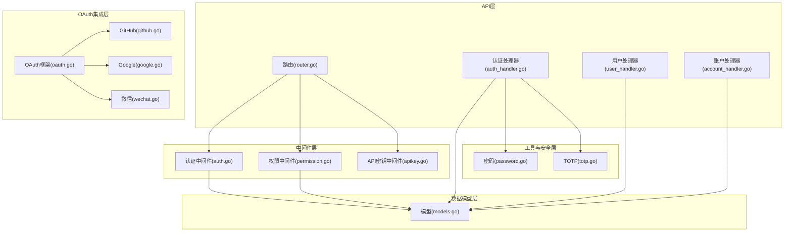
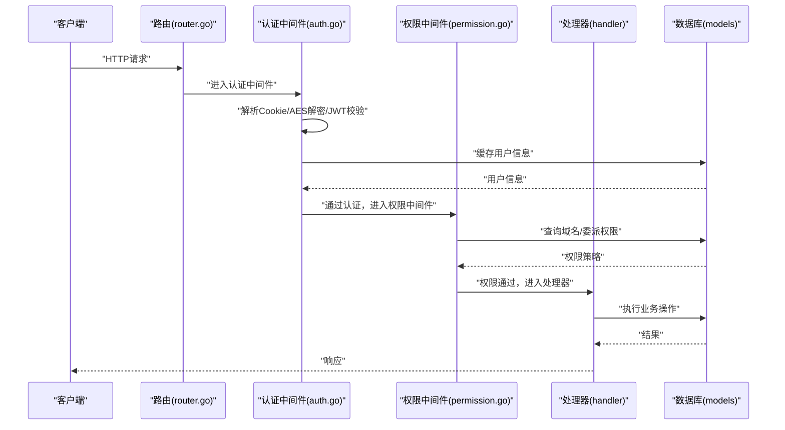
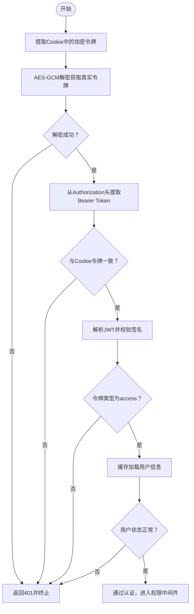
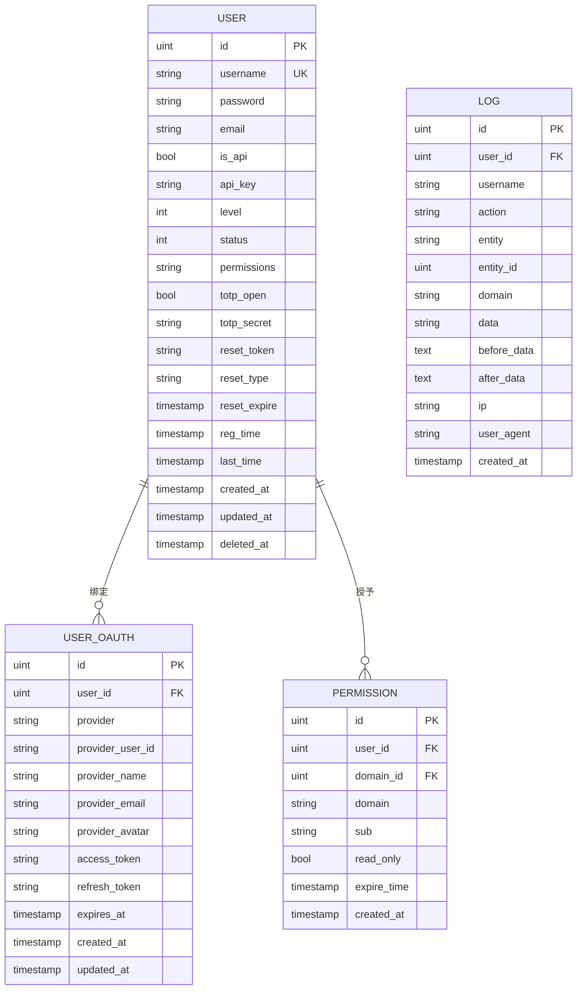
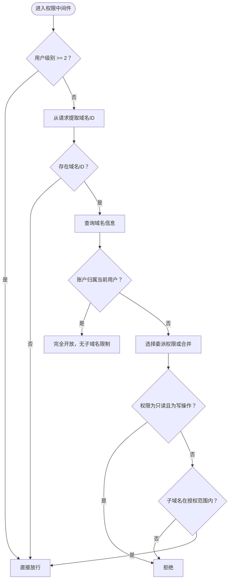
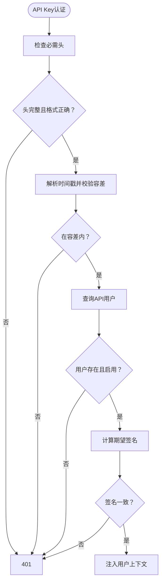
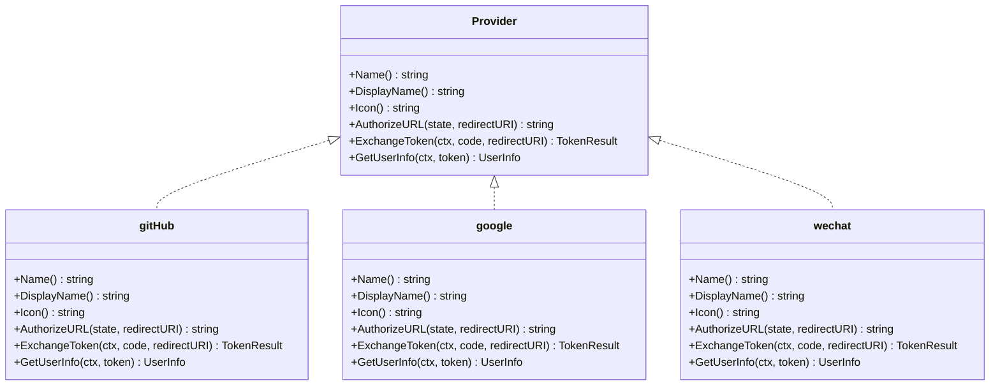
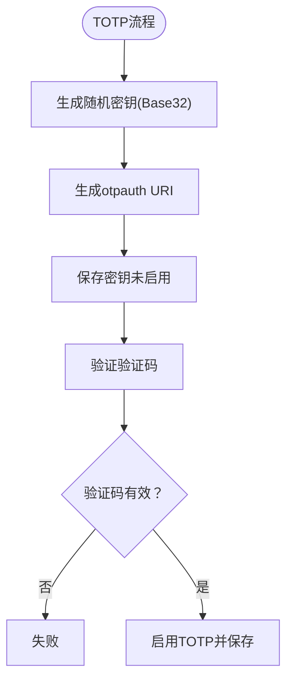
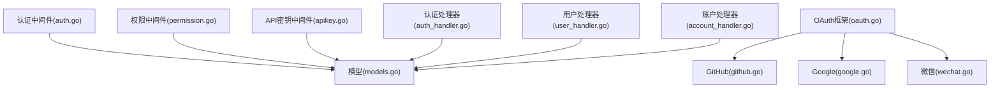

# 用户权限系统

<cite>
**本文档引用的文件**
- [models.go](file://main/internal/models/models.go)
- [auth.go](file://main/internal/api/middleware/auth.go)
- [permission.go](file://main/internal/api/middleware/permission.go)
- [apikey.go](file://main/internal/api/middleware/apikey.go)
- [github.go](file://main/internal/oauth/github.go)
- [google.go](file://main/internal/oauth/google.go)
- [wechat.go](file://main/internal/oauth/wechat.go)
- [oauth.go](file://main/internal/oauth/oauth.go)
- [password.go](file://main/internal/utils/password.go)
- [totp.go](file://main/internal/utils/totp.go)
- [auth_handler.go](file://main/internal/api/handler/auth.go)
- [router.go](file://main/internal/api/router.go)
- [user_handler.go](file://main/internal/api/handler/user.go)
- [account_handler.go](file://main/internal/api/handler/account.go)
</cite>

## 目录
1. [简介](#简介)
2. [项目结构](#项目结构)
3. [核心组件](#核心组件)
4. [架构总览](#架构总览)
5. [详细组件分析](#详细组件分析)
6. [依赖关系分析](#依赖关系分析)
7. [性能考虑](#性能考虑)
8. [故障排除指南](#故障排除指南)
9. [结论](#结论)
10. [附录](#附录)

## 简介
本文件面向DNSPlane项目的用户权限系统，提供从架构设计到实现细节的全面技术文档。内容涵盖认证授权机制（JWT令牌管理、Cookie加密、刷新令牌轮转）、用户与权限模型、API密钥系统、OAuth第三方登录集成（GitHub、Google、微信等）、权限控制策略与角色管理、安全功能（密码加密、TOTP双因子认证）、以及中间件在权限验证中的作用与实际应用示例。

## 项目结构
系统采用分层架构，主要分为：
- API层：路由定义与HTTP处理
- 中间件层：认证、权限、CORS、审计等横切关注点
- 业务处理器层：用户、账户、域名、证书等业务逻辑
- OAuth集成层：第三方登录适配
- 工具与安全层：密码加密、TOTP、HMAC签名等
- 数据模型层：用户、权限、账户、域名等核心实体

图表来源
- [router.go:14-275](file://main/internal/api/router.go#L14-L275)
- [auth.go:124-199](file://main/internal/api/middleware/auth.go#L124-L199)
- [permission.go:132-207](file://main/internal/api/middleware/permission.go#L132-L207)
- [apikey.go:44-105](file://main/internal/api/middleware/apikey.go#L44-L105)
- [oauth.go:78-98](file://main/internal/oauth/oauth.go#L78-L98)
- [github.go:20-36](file://main/internal/oauth/github.go#L20-L36)
- [google.go:18-22](file://main/internal/oauth/google.go#L18-L22)
- [wechat.go:32-36](file://main/internal/oauth/wechat.go#L32-L36)
- [password.go:17-45](file://main/internal/utils/password.go#L17-L45)
- [totp.go:25-80](file://main/internal/utils/totp.go#L25-L80)
- [models.go:9-31](file://main/internal/models/models.go#L9-L31)

章节来源
- [router.go:14-275](file://main/internal/api/router.go#L14-L275)

## 核心组件
- 用户模型与权限模型：定义用户、OAuth绑定、账户、域名、权限、日志等核心实体及其字段约束
- 认证中间件：基于JWT的短期访问令牌与长期刷新令牌，Cookie加密存储，双重验证，JTI轮转与重用检测
- 权限中间件：基于域名与子域名的委派权限控制，管理员豁免，只读策略
- API密钥中间件：基于HMAC-SHA256签名的API认证，时间戳防重放
- OAuth集成：统一Provider接口，支持GitHub、Google、微信等第三方登录
- 安全工具：bcrypt密码加密、TOTP双因子认证、密码强度校验
- 路由与处理器：暴露认证、用户管理、权限分配、API访问控制等REST接口

章节来源
- [models.go:9-120](file://main/internal/models/models.go#L9-L120)
- [auth.go:124-413](file://main/internal/api/middleware/auth.go#L124-L413)
- [permission.go:132-376](file://main/internal/api/middleware/permission.go#L132-L376)
- [apikey.go:44-113](file://main/internal/api/middleware/apikey.go#L44-L113)
- [oauth.go:51-98](file://main/internal/oauth/oauth.go#L51-L98)
- [password.go:17-45](file://main/internal/utils/password.go#L17-L45)
- [totp.go:25-161](file://main/internal/utils/totp.go#L25-L161)

## 架构总览
系统通过Gin框架组织路由，中间件负责认证与权限校验，处理器完成业务逻辑，模型层定义数据结构。认证采用JWT，结合Cookie加密与刷新令牌轮转，权限采用基于域名与子域名的委派模型，API密钥用于机器对机器的无状态认证。

图表来源
- [router.go:38-162](file://main/internal/api/router.go#L38-L162)
- [auth.go:124-199](file://main/internal/api/middleware/auth.go#L124-L199)
- [permission.go:132-207](file://main/internal/api/middleware/permission.go#L132-L207)

## 详细组件分析

### 认证授权机制与JWT令牌管理
- 令牌类型与生命周期
  - 访问令牌：短期（15分钟），用于API访问
  - 刷新令牌：长期（7天），用于刷新访问令牌
- Cookie加密与双重验证
  - 访问令牌与刷新令牌分别加密存储在HttpOnly Cookie中
  - 同时从Authorization头提取Bearer Token，与Cookie中的令牌进行双重验证
- JWT Claims与上下文传递
  - Claims包含用户ID、用户名、级别、令牌类型及标准声明
  - 中间件将用户信息注入上下文，供后续处理器使用
- 刷新令牌轮转与重用检测
  - 使用JTI（JWT ID）进行轮转验证，防止刷新令牌重用
  - 验证通过后删除旧JTI，生成新JTI并缓存
- 安全响应头与CORS
  - 添加X-Content-Type-Options、X-Frame-Options、X-XSS-Protection等安全头
  - CORS仅允许配置的site_url或同源Origin，避免反射型CSRF风险

图表来源
- [auth.go:124-199](file://main/internal/api/middleware/auth.go#L124-L199)
- [auth.go:295-310](file://main/internal/api/middleware/auth.go#L295-L310)
- [auth.go:374-413](file://main/internal/api/middleware/auth.go#L374-L413)

章节来源
- [auth.go:89-95](file://main/internal/api/middleware/auth.go#L89-L95)
- [auth.go:124-199](file://main/internal/api/middleware/auth.go#L124-L199)
- [auth.go:227-282](file://main/internal/api/middleware/auth.go#L227-L282)
- [auth.go:295-310](file://main/internal/api/middleware/auth.go#L295-L310)
- [auth.go:334-365](file://main/internal/api/middleware/auth.go#L334-L365)
- [auth.go:469-508](file://main/internal/api/middleware/auth.go#L469-L508)

### 用户模型与权限模型
- 用户(User)
  - 字段：ID、用户名、密码哈希、邮箱、API用户标记、API Key、级别、状态、功能权限JSON、TOTP开关与密钥、重置令牌与类型、注册/最后登录时间等
  - 级别：0普通用户、1管理员、2及以上管理员
  - 状态：0禁用、1启用
- OAuth绑定(UserOAuth)
  - 每用户每提供商一条记录，存储第三方用户ID、名称、邮箱、头像、访问令牌、刷新令牌、过期时间
- 权限(Permission)
  - 域名级委派权限，支持子域名限制（通配或列表）、只读标记、过期时间
- 日志(Log)
  - 记录用户操作行为，包括实体类型、实体ID、域名、前后数据、IP、UA等

图表来源
- [models.go:9-31](file://main/internal/models/models.go#L9-L31)
- [models.go:33-47](file://main/internal/models/models.go#L33-L47)
- [models.go:93-103](file://main/internal/models/models.go#L93-L103)
- [models.go:105-120](file://main/internal/models/models.go#L105-L120)

章节来源
- [models.go:9-31](file://main/internal/models/models.go#L9-L31)
- [models.go:33-47](file://main/internal/models/models.go#L33-L47)
- [models.go:93-103](file://main/internal/models/models.go#L93-L103)
- [models.go:105-120](file://main/internal/models/models.go#L105-L120)

### 权限控制策略与角色管理
- 角色管理
  - 级别(level)：0普通用户、1管理员、2及以上管理员
  - 管理员直接放行，无需域名权限校验
- 域名权限
  - 用户自有域名：完全开放，无子域名限制
  - 委派权限：支持通配(*)或子域名列表，合并策略用于列表接口
  - 只读权限：写操作被拦截
- 子域名二次校验
  - 当权限为有限列表时，请求中的子域名必须在授权范围内
- 功能模块权限
  - 用户功能权限以JSON数组形式存储，中间件将其写入上下文
  - 非管理员仅允许列表中的模块

图表来源
- [permission.go:132-207](file://main/internal/api/middleware/permission.go#L132-L207)
- [permission.go:175-200](file://main/internal/api/middleware/permission.go#L175-L200)
- [permission.go:342-376](file://main/internal/api/middleware/permission.go#L342-L376)

章节来源
- [permission.go:18-31](file://main/internal/api/middleware/permission.go#L18-L31)
- [permission.go:51-87](file://main/internal/api/middleware/permission.go#L51-L87)
- [permission.go:93-125](file://main/internal/api/middleware/permission.go#L93-L125)
- [permission.go:132-207](file://main/internal/api/middleware/permission.go#L132-L207)
- [permission.go:342-376](file://main/internal/api/middleware/permission.go#L342-L376)

### API密钥系统
- 认证流程
  - 必需请求头：X-API-UID、X-API-Timestamp、X-API-Sign
  - 时间戳±5分钟容差，防重放攻击
  - HMAC-SHA256签名验证，常量时间比较
- 用户筛选
  - 仅允许is_api=true且status=1的用户使用API Key
- 上下文注入
  - 通过API Key认证后，将用户ID、用户名、级别注入上下文

图表来源
- [apikey.go:44-105](file://main/internal/api/middleware/apikey.go#L44-L105)
- [apikey.go:80-88](file://main/internal/api/middleware/apikey.go#L80-L88)
- [apikey.go:90-98](file://main/internal/api/middleware/apikey.go#L90-L98)

章节来源
- [apikey.go:18-21](file://main/internal/api/middleware/apikey.go#L18-L21)
- [apikey.go:44-105](file://main/internal/api/middleware/apikey.go#L44-L105)

### OAuth集成（GitHub、Google、微信）
- Provider接口
  - 统一的Provider接口，包含名称、显示名、图标、授权URL构建、Token交换、用户信息获取
- GitHub
  - 授权URL：github.com/login/oauth/authorize
  - Token交换：github.com/login/oauth/access_token
  - 用户信息：api.github.com/user
- Google
  - 授权URL：accounts.google.com/o/oauth2/v2/auth
  - Token交换：oauth2.googleapis.com/token
  - 用户信息：www.googleapis.com/oauth2/v2/userinfo
- 微信
  - 授权URL：open.weixin.qq.com/connect/qrconnect（二维码）
  - Token交换：api.weixin.qq.com/sns/oauth2/access_token（GET）
  - 用户信息：api.weixin.qq.com/sns/userinfo

图表来源
- [oauth.go:51-59](file://main/internal/oauth/oauth.go#L51-L59)
- [github.go:12-58](file://main/internal/oauth/github.go#L12-L58)
- [google.go:10-54](file://main/internal/oauth/google.go#L10-L54)
- [wechat.go:10-88](file://main/internal/oauth/wechat.go#L10-L88)

章节来源
- [oauth.go:51-98](file://main/internal/oauth/oauth.go#L51-L98)
- [github.go:20-58](file://main/internal/oauth/github.go#L20-L58)
- [google.go:18-54](file://main/internal/oauth/google.go#L18-L54)
- [wechat.go:32-88](file://main/internal/oauth/wechat.go#L32-L88)

### 安全功能：密码加密与TOTP双因子认证
- 密码加密
  - 使用bcrypt进行密码哈希，强度默认
  - 登录时CompareHashAndPassword验证
- 密码强度校验
  - 最少8位，包含大写字母、小写字母、数字
- TOTP双因子认证
  - 生成20字节随机密钥，Base32编码
  - 生成otpauth URI用于二维码
  - 验证码支持前后1个时间窗口偏移
  - 支持恢复码生成与验证

图表来源
- [totp.go:25-62](file://main/internal/utils/totp.go#L25-L62)
- [totp.go:64-79](file://main/internal/utils/totp.go#L64-L79)
- [totp.go:136-161](file://main/internal/utils/totp.go#L136-L161)

章节来源
- [password.go:17-45](file://main/internal/utils/password.go#L17-L45)
- [totp.go:25-161](file://main/internal/utils/totp.go#L25-L161)

### 中间件在权限验证中的作用
- 认证中间件(Auth)
  - 解析Cookie/AES解密/JWT校验，双重验证，缓存用户信息，注入上下文
- 权限中间件(Permission)
  - 域名权限校验，管理员豁免，委派权限合并，只读拦截，子域名二次校验
- API密钥中间件(APIKeyAuth)
  - HMAC签名验证，时间戳容差，用户筛选，上下文注入
- CORS与安全头
  - CORS仅允许配置的Origin，安全头增强防护

章节来源
- [auth.go:124-199](file://main/internal/api/middleware/auth.go#L124-L199)
- [permission.go:132-207](file://main/internal/api/middleware/permission.go#L132-L207)
- [apikey.go:44-105](file://main/internal/api/middleware/apikey.go#L44-L105)
- [auth.go:469-508](file://main/internal/api/middleware/auth.go#L469-L508)

### 实际应用示例
- 用户管理
  - 创建用户：支持设置级别、API用户标记、功能权限JSON
  - 更新用户：可更新密码、邮箱、级别、状态、功能权限；启用API时自动生成API Key
  - 删除用户：禁止删除自身，同时清理用户权限
  - 重置API Key：管理员可为API用户重新生成API Key
- 权限分配
  - 为用户添加域名级委派权限，支持子域名限制与只读标记
  - 更新/删除用户权限
  - 查询用户权限列表
- API访问控制
  - 通过Bearer Token访问受保护API
  - 通过API Key + HMAC签名访问特定API
  - 刷新令牌轮转，防止重用攻击
- OAuth登录
  - 获取可用OAuth提供商列表
  - 发起第三方登录授权
  - 处理回调并绑定用户

章节来源
- [user_handler.go:56-98](file://main/internal/api/handler/user.go#L56-L98)
- [user_handler.go:100-150](file://main/internal/api/handler/user.go#L100-L150)
- [user_handler.go:152-165](file://main/internal/api/handler/user.go#L152-L165)
- [user_handler.go:167-254](file://main/internal/api/handler/user.go#L167-L254)
- [user_handler.go:256-275](file://main/internal/api/handler/user.go#L256-L275)
- [auth_handler.go:67-149](file://main/internal/api/handler/auth.go#L67-149)
- [auth_handler.go:469-520](file://main/internal/api/handler/auth.go#L469-520)
- [auth_handler.go:565-621](file://main/internal/api/handler/auth.go#L565-621)
- [auth_handler.go:623-657](file://main/internal/api/handler/auth.go#L623-657)
- [auth_handler.go:659-718](file://main/internal/api/handler/auth.go#L659-718)
- [auth_handler.go:720-745](file://main/internal/api/handler/auth.go#L720-745)

## 依赖关系分析
- 模块耦合
  - 中间件层对模型层有直接依赖（用户、权限、日志）
  - 处理器层依赖中间件与模型层
  - OAuth层依赖配置与网络请求工具
- 外部依赖
  - Gin框架、JWT库、bcrypt、HMAC、AES-GCM、HTTP客户端
- 潜在循环依赖
  - 未发现循环依赖，层次清晰

图表来源
- [auth.go:124-199](file://main/internal/api/middleware/auth.go#L124-L199)
- [permission.go:132-207](file://main/internal/api/middleware/permission.go#L132-L207)
- [apikey.go:44-105](file://main/internal/api/middleware/apikey.go#L44-L105)
- [auth_handler.go:67-149](file://main/internal/api/handler/auth.go#L67-149)
- [user_handler.go:56-98](file://main/internal/api/handler/user.go#L56-L98)
- [account_handler.go:85-126](file://main/internal/api/handler/account.go#L85-L126)
- [oauth.go:78-98](file://main/internal/oauth/oauth.go#L78-L98)
- [github.go:12-58](file://main/internal/oauth/github.go#L12-L58)
- [google.go:10-54](file://main/internal/oauth/google.go#L10-L54)
- [wechat.go:10-88](file://main/internal/oauth/wechat.go#L10-L88)

章节来源
- [router.go:14-275](file://main/internal/api/router.go#L14-L275)

## 性能考虑
- 认证缓存
  - 用户认证信息缓存30秒，减少DB/Redis往返，降低认证压力
- 权限合并
  - 多条委派权限合并为一条策略，减少权限判断开销
- CORS与安全头
  - 仅允许配置的Origin，避免不必要的跨域处理
- API Key签名
  - HMAC常量时间比较，防时序攻击，同时保持验证效率

## 故障排除指南
- 401未登录/会话过期
  - 检查Cookie是否存在且未过期，确认AES密钥与JWT密钥一致
  - 确认Authorization头与Cookie中的令牌一致
- 401无效Token类型
  - 确保使用access token而非refresh token访问API
- 401无权限操作该域名
  - 检查用户是否为域名所有者或是否具有委派权限
  - 确认子域名是否在授权范围内
- 401签名验证失败
  - 检查X-API-UID、X-API-Timestamp、X-API-Sign是否齐全
  - 确认时间戳在±5分钟容差内
  - 确认API Key正确且用户状态为启用
- OAuth登录失败
  - 检查Provider配置（ClientID/ClientSecret/AppID等）
  - 确认回调URL与第三方平台配置一致
- TOTP验证失败
  - 确认验证码在当前时间窗口或前后1个时间窗口内
  - 检查密钥格式是否正确

章节来源
- [auth.go:129-156](file://main/internal/api/middleware/auth.go#L129-L156)
- [permission.go:175-179](file://main/internal/api/middleware/permission.go#L175-L179)
- [apikey.go:50-98](file://main/internal/api/middleware/apikey.go#L50-L98)
- [oauth.go:78-98](file://main/internal/oauth/oauth.go#L78-L98)
- [totp.go:64-79](file://main/internal/utils/totp.go#L64-L79)

## 结论
本用户权限系统通过JWT令牌管理、Cookie加密、刷新令牌轮转、基于域名与子域名的委派权限、API Key签名认证、以及OAuth第三方登录，构建了完整的认证授权体系。配合bcrypt密码加密、TOTP双因子认证与安全响应头，提供了高安全性与良好用户体验。中间件层的职责清晰，便于扩展与维护。

## 附录
- 路由与中间件使用示例
  - 认证中间件：在需要认证的路由组上使用Auth()
  - 权限中间件：在需要域名权限的路由组上使用Permission()
  - API密钥中间件：在需要API Key认证的路由上使用APIKeyAuth()
- 常用配置项
  - site_url：CORS允许的Origin
  - login_captcha：登录验证码开关
  - mail_*：邮件通知配置（用于密码/TOTP重置）

章节来源
- [router.go:38-162](file://main/internal/api/router.go#L38-L162)
- [auth.go:469-508](file://main/internal/api/middleware/auth.go#L469-L508)
- [auth_handler.go:50-65](file://main/internal/api/handler/auth.go#L50-L65)