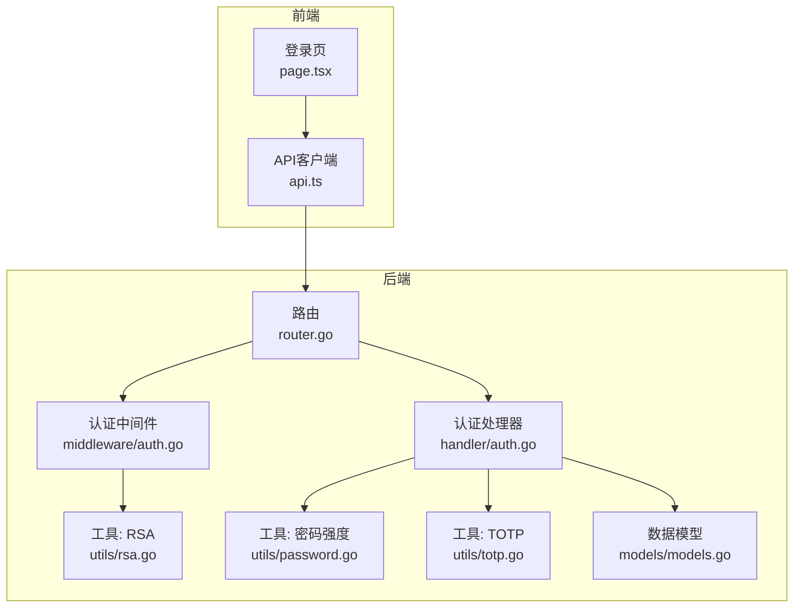
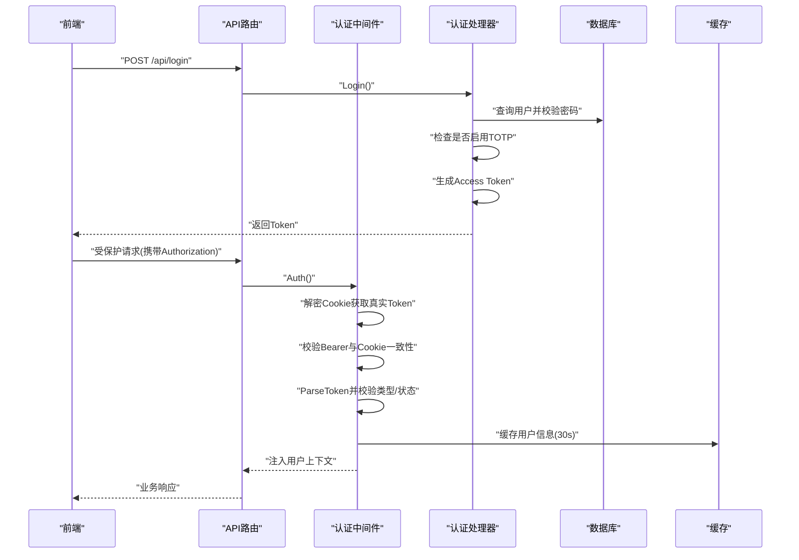
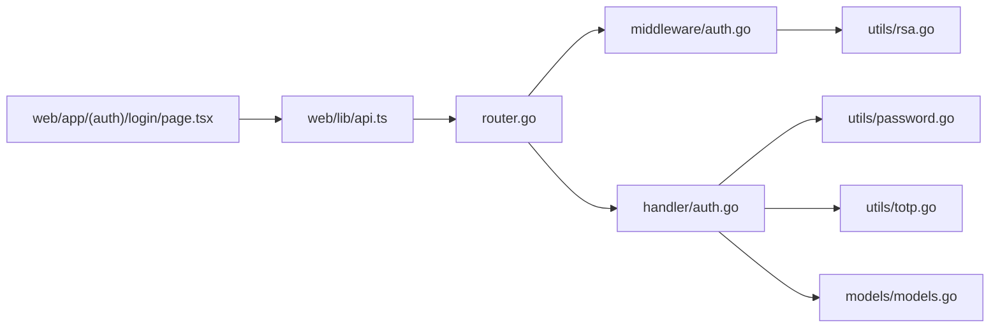

# 认证机制

<cite>
**本文档引用的文件**
- [auth.go](file://main/internal/api/middleware/auth.go)
- [auth.go](file://main/internal/api/handler/auth.go)
- [models.go](file://main/internal/models/models.go)
- [router.go](file://main/internal/api/router.go)
- [password.go](file://main/internal/utils/password.go)
- [totp.go](file://main/internal/utils/totp.go)
- [rsa.go](file://main/internal/utils/rsa.go)
- [api.ts](file://web/lib/api.ts)
- [page.tsx](file://web/app/(auth)/login/page.tsx)
</cite>

## 目录
1. [简介](#简介)
2. [项目结构](#项目结构)
3. [核心组件](#核心组件)
4. [架构总览](#架构总览)
5. [详细组件分析](#详细组件分析)
6. [依赖关系分析](#依赖关系分析)
7. [性能考量](#性能考量)
8. [故障排查指南](#故障排查指南)
9. [结论](#结论)

## 简介
本文件面向DNSPlane系统的认证机制，系统采用“短期访问令牌 + 长期刷新令牌”的JWT双令牌模式，并结合HttpOnly Cookie加密存储、TOTP双因子认证、RSA混合加密以及完善的中间件安全策略，提供高安全性与可用性的认证体系。本文档将深入解释JWT令牌生成、验证与刷新流程，用户登录与TOTP集成方式，RSA在认证中的应用，会话管理与过期处理，认证中间件工作原理与拦截器实现，并给出常见操作的实际代码路径参考与安全防护建议。

## 项目结构
认证相关的核心代码分布在后端Go服务与前端Next.js应用中：
- 后端Go服务
  - 中间件：JWT解析、Cookie加解密、CORS、安全头、权限注入
  - 处理器：登录、登出、用户信息、密码/TOTP重置、TOTP启用/验证/禁用
  - 工具：密码强度校验、TOTP生成与验证、RSA混合加密
  - 数据模型：用户表字段（含TOTP、重置Token等）
  - 路由：公开接口与受保护接口分组
- 前端Next.js应用
  - 登录页：验证码、TOTP输入、安装流程
  - API客户端：统一请求封装、401自动跳转登录

图表来源
- [router.go:14-163](file://main/internal/api/router.go#L14-L163)
- [auth.go:124-199](file://main/internal/api/middleware/auth.go#L124-L199)
- [auth.go:67-149](file://main/internal/api/handler/auth.go#L67-L149)
- [password.go:17-45](file://main/internal/utils/password.go#L17-L45)
- [totp.go:25-113](file://main/internal/utils/totp.go#L25-L113)
- [rsa.go:131-192](file://main/internal/utils/rsa.go#L131-L192)
- [models.go:9-31](file://main/internal/models/models.go#L9-L31)

章节来源
- [router.go:14-163](file://main/internal/api/router.go#L14-L163)
- [auth.go:124-199](file://main/internal/api/middleware/auth.go#L124-L199)
- [auth.go:67-149](file://main/internal/api/handler/auth.go#L67-L149)
- [password.go:17-45](file://main/internal/utils/password.go#L17-L45)
- [totp.go:25-113](file://main/internal/utils/totp.go#L25-L113)
- [rsa.go:131-192](file://main/internal/utils/rsa.go#L131-L192)
- [models.go:9-31](file://main/internal/models/models.go#L9-L31)

## 核心组件
- JWT令牌与Claims
  - Claims包含用户ID、用户名、级别、令牌类型(access/refresh)及标准声明
  - 访问令牌15分钟过期，刷新令牌7天过期
- Cookie加密层
  - 使用JWT Secret派生AES-256密钥，AES-GCM加密访问令牌与刷新令牌，分别写入_httpOnly Cookie
- 认证中间件
  - 从Cookie解密获取真实访问令牌，同时校验Authorization头中的Bearer令牌一致性
  - 校验令牌类型、用户状态、权限注入与即将过期提醒
- 刷新令牌机制
  - 基于JTI轮转与一次性使用策略，防止重放与重用攻击
- TOTP双因子认证
  - 登录阶段根据用户配置决定是否需要TOTP验证码
  - 提供启用、验证启用、禁用TOTP的完整流程
- RSA混合加密
  - 服务端自动生成4096位RSA密钥对，用于加密敏感载荷
- 前端交互
  - 登录页支持验证码、TOTP输入、安装流程
  - API客户端统一处理401自动跳转

章节来源
- [auth.go:90-113](file://main/internal/api/middleware/auth.go#L90-L113)
- [auth.go:100-106](file://main/internal/api/middleware/auth.go#L100-L106)
- [auth.go:227-244](file://main/internal/api/middleware/auth.go#L227-L244)
- [auth.go:246-282](file://main/internal/api/middleware/auth.go#L246-L282)
- [auth.go:295-310](file://main/internal/api/middleware/auth.go#L295-L310)
- [auth.go:367-413](file://main/internal/api/middleware/auth.go#L367-L413)
- [auth.go:415-430](file://main/internal/api/middleware/auth.go#L415-L430)
- [auth.go:67-149](file://main/internal/api/handler/auth.go#L67-L149)
- [totp.go:25-113](file://main/internal/utils/totp.go#L25-L113)
- [rsa.go:131-192](file://main/internal/utils/rsa.go#L131-L192)
- [api.ts:18-69](file://web/lib/api.ts#L18-L69)
- [page.tsx:109-157](file://web/app/(auth)/login/page.tsx#L109-L157)

## 架构总览
认证系统采用“前端发起请求 -> 后端中间件校验 -> 业务处理器执行”的分层设计。JWT用于无状态鉴权，Cookie加密存储提升抗窃听能力，TOTP提供第二因子保障，RSA混合加密用于敏感数据传输。

图表来源
- [router.go:24-40](file://main/internal/api/router.go#L24-L40)
- [auth.go:124-199](file://main/internal/api/middleware/auth.go#L124-L199)
- [auth.go:67-149](file://main/internal/api/handler/auth.go#L67-L149)

## 详细组件分析

### JWT令牌生成与验证
- 生成访问令牌
  - Claims包含用户ID、用户名、级别、令牌类型为access，过期时间为15分钟
  - 使用HS256签名，密钥来自配置
- 生成刷新令牌
  - Claims包含用户ID、用户名、级别、令牌类型为refresh，过期时间为7天
- 解析与验证
  - 使用相同密钥解析JWT，校验签名与过期时间
- 令牌类型约束
  - 中间件仅允许access令牌访问受保护接口

章节来源
- [auth.go:246-282](file://main/internal/api/middleware/auth.go#L246-L282)
- [auth.go:415-430](file://main/internal/api/middleware/auth.go#L415-L430)
- [auth.go:158-163](file://main/internal/api/middleware/auth.go#L158-L163)

### Cookie加密与会话存储
- 密钥派生
  - 使用JWT Secret的SHA-256摘要作为AES-256密钥
- 加密存储
  - 访问令牌与刷新令牌分别加密后写入_httpOnly Cookie
  - 访问令牌Cookie有效期15分钟，刷新令牌Cookie有效期7天
- 解密校验
  - 从Cookie解密得到真实访问令牌，与Authorization头中的Bearer令牌进行一致性校验
- 安全策略
  - 严格SameSite策略，HTTPS场景下设置安全标志
  - 支持反向代理场景下的安全判断

章节来源
- [auth.go:33-38](file://main/internal/api/middleware/auth.go#L33-L38)
- [auth.go:44-59](file://main/internal/api/middleware/auth.go#L44-L59)
- [auth.go:65-87](file://main/internal/api/middleware/auth.go#L65-L87)
- [auth.go:295-310](file://main/internal/api/middleware/auth.go#L295-L310)
- [auth.go:323-328](file://main/internal/api/middleware/auth.go#L323-L328)

### 刷新令牌机制与JTI轮转
- JTI轮转
  - 每次刷新前校验并撤销旧JTI，新刷新令牌生成后存入缓存
- 一次性使用
  - 旧刷新令牌一旦使用即失效，防止重放
- 异常处理
  - 若发现JTI不匹配，记录警告并吊销该用户所有刷新令牌
- 刷新流程
  - 验证刷新令牌 -> 校验JTI -> 从数据库获取最新用户信息 -> 生成新的令牌对 -> 存储新JTI

章节来源
- [auth.go:334-340](file://main/internal/api/middleware/auth.go#L334-L340)
- [auth.go:347-365](file://main/internal/api/middleware/auth.go#L347-L365)
- [auth.go:374-413](file://main/internal/api/middleware/auth.go#L374-L413)

### 用户登录流程与TOTP集成
- 登录步骤
  - 校验验证码（若开启）
  - 查询用户并校验状态
  - bcrypt校验密码
  - 若启用TOTP且未提供TOTP验证码，返回需要TOTP
  - 生成访问令牌并更新最后登录时间
- TOTP启用/验证/禁用
  - 启用：生成TOTP密钥与URI，保存密钥待验证启用
  - 验证启用：校验验证码后启用TOTP
  - 禁用：校验密码与TOTP验证码后关闭

章节来源
- [auth.go:67-149](file://main/internal/api/handler/auth.go#L67-L149)
- [auth.go:290-371](file://main/internal/api/handler/auth.go#L290-L371)
- [totp.go:25-113](file://main/internal/utils/totp.go#L25-L113)

### RSA混合加密在认证中的应用
- 密钥生成
  - 首次运行生成4096位RSA密钥对，私钥严格权限，公钥持久化
- 混合加密
  - 生成随机AES-256密钥，使用RSA-OAEP加密AES密钥，使用AES-GCM加密数据
- 响应加密
  - 服务端可使用自身公钥对响应进行混合加密
- 前端配合
  - 前端通过Web Crypto实现RSA-OAEP加密与自定义编码/解码

章节来源
- [rsa.go:131-192](file://main/internal/utils/rsa.go#L131-L192)
- [rsa.go:207-262](file://main/internal/utils/rsa.go#L207-L262)
- [rsa.go:264-322](file://main/internal/utils/rsa.go#L264-L322)

### 认证中间件工作原理与拦截器实现
- 请求拦截
  - 从_httpOnly Cookie读取加密的访问令牌并解密
  - 从Authorization头提取Bearer令牌并与Cookie中的令牌一致性校验
  - 解析JWT并校验令牌类型为access
  - 从缓存获取用户信息，校验用户状态
- 上下文注入
  - 注入用户ID、用户名、级别、权限模块
- 过期提醒
  - 当访问令牌剩余时间小于5分钟时，设置响应头提示前端刷新
- CORS与安全头
  - 严格的CORS白名单与安全响应头，防止反射型跨域与常见攻击

章节来源
- [auth.go:124-199](file://main/internal/api/middleware/auth.go#L124-L199)
- [auth.go:469-482](file://main/internal/api/middleware/auth.go#L469-L482)
- [auth.go:490-508](file://main/internal/api/middleware/auth.go#L490-L508)

### 会话管理与令牌过期处理
- 访问令牌过期
  - 15分钟过期，中间件通过剩余时间触发前端刷新提示
- 刷新令牌过期
  - 7天过期，用于换取新的访问令牌
- 缓存策略
  - 认证用户信息缓存30秒，降低数据库压力
- 会话失效
  - 用户被禁用或状态异常时，中间件拒绝请求
  - 清理Cookie时设置负数过期时间

章节来源
- [auth.go:89-98](file://main/internal/api/middleware/auth.go#L89-L98)
- [auth.go:169-180](file://main/internal/api/middleware/auth.go#L169-L180)
- [auth.go:442-453](file://main/internal/api/middleware/auth.go#L442-L453)
- [auth.go:313-317](file://main/internal/api/middleware/auth.go#L313-L317)

### 密码重置与TOTP重置
- 密码重置
  - 发送带Token的邮件，30分钟有效期，校验通过后更新密码并清除Token
- TOTP重置
  - 发送带Token的邮件，30分钟有效期，校验通过后关闭TOTP并清除Token
- 管理员重置
  - 管理员可直接发送重置邮件或重置用户TOTP

章节来源
- [auth.go:469-563](file://main/internal/api/handler/auth.go#L469-L563)
- [auth.go:565-657](file://main/internal/api/handler/auth.go#L565-L657)
- [auth.go:659-718](file://main/internal/api/handler/auth.go#L659-L718)

### 前端交互与API封装
- 登录页
  - 支持验证码、TOTP输入、安装流程
  - 登录成功后设置本地Token并跳转仪表盘
- API客户端
  - 统一设置Authorization头
  - 401自动清理Token并跳转登录页

章节来源
- [page.tsx:109-157](file://web/app/(auth)/login/page.tsx#L109-L157)
- [api.ts:18-69](file://web/lib/api.ts#L18-L69)

## 依赖关系分析

图表来源
- [router.go:14-163](file://main/internal/api/router.go#L14-L163)
- [auth.go:124-199](file://main/internal/api/middleware/auth.go#L124-L199)
- [auth.go:67-149](file://main/internal/api/handler/auth.go#L67-L149)
- [password.go:17-45](file://main/internal/utils/password.go#L17-L45)
- [totp.go:25-113](file://main/internal/utils/totp.go#L25-L113)
- [rsa.go:131-192](file://main/internal/utils/rsa.go#L131-L192)
- [models.go:9-31](file://main/internal/models/models.go#L9-L31)
- [api.ts:18-69](file://web/lib/api.ts#L18-L69)
- [page.tsx:109-157](file://web/app/(auth)/login/page.tsx#L109-L157)

## 性能考量
- 认证缓存
  - 用户信息缓存30秒，显著降低数据库往返，适合远程部署
- 令牌短周期
  - 访问令牌15分钟过期，结合JTI轮转与一次性使用，兼顾安全与性能
- AES-GCM
  - 低开销的对称加密，适合Cookie加密与响应加密
- 前端优化
  - 401自动跳转减少手动处理成本，提升用户体验

## 故障排查指南
- 401未登录/会话过期
  - 检查Cookie是否存在且未过期，确认Authorization头与Cookie中的令牌一致
- Token不一致
  - 确认前端是否正确设置Authorization头，避免跨域或CORS问题
- 账户被禁用
  - 中间件会拒绝被禁用用户的所有请求
- TOTP错误
  - 验证码允许前后1个时间窗口偏移，确保设备时间同步
- 刷新令牌失败
  - 检查JTI轮转是否正常，旧刷新令牌是否被二次使用
- RSA解密失败
  - 确认密钥对生成与权限设置，检查自定义编码/解码逻辑

章节来源
- [auth.go:128-149](file://main/internal/api/middleware/auth.go#L128-L149)
- [auth.go:176-180](file://main/internal/api/middleware/auth.go#L176-L180)
- [auth.go:64-87](file://main/internal/api/middleware/auth.go#L64-L87)
- [totp.go:65-79](file://main/internal/utils/totp.go#L65-L79)
- [auth.go:347-365](file://main/internal/api/middleware/auth.go#L347-L365)
- [rsa.go:237-240](file://main/internal/utils/rsa.go#L237-L240)

## 结论
本认证机制通过JWT无状态鉴权、Cookie加密存储、TOTP双因子认证与RSA混合加密，构建了高安全性与良好用户体验的认证体系。中间件负责统一的安全拦截与上下文注入，处理器提供完整的登录、密码/TOTP重置与TOTP管理功能。建议在生产环境中：
- 严格管理JWT Secret与RSA密钥文件权限
- 启用HTTPS与安全响应头
- 定期轮换密钥并监控JTI轮转日志
- 对管理员操作增加审计与二次确认